# AUTOSAR 基础与应用

*AUTOSAR Fundamentals and Applications — 中文版*

---

## 目录
1. [第1章 探索 AUTOSAR 的起源与目标](#第1章-探索-autosar-的起源与目标)
2. [第2章 AUTOSAR 软件层简介](#第2章-autosar-软件层简介)
3. [第3章 AUTOSAR 方法论与数据交换格式](#第3章-autosar-方法论与数据交换格式)
4. [第4章 使用软件组件与 RTE](#第4章-使用软件组件与-rte)
5. [第5章 设计与实现事件和接口](#第5章-设计与实现事件和接口)
6. [第6章 AUTOSAR 操作系统入门](#第6章-autosar-操作系统入门)
7. [第7章 探索通信栈](#第7章-探索通信栈)
8. [第8章 使用 Crypto 与安全栈保护 AUTOSAR 系统](#第8章-使用-crypto-与安全栈保护-autosar-系统)
9. [第9章 内存与模式管理](#第9章-内存与模式管理)
10. [第10章 总结与知识拓展用例](#第10章-总结与知识拓展用例)

---

# 第1章 探索 AUTOSAR 的起源与目标

AUTOSAR Fundamentals and Applications — Hossam Soffar 著 | AI 辅助翻译

---

AUTOSAR（AUTomotive Open System ARchitecture，汽车开放系统架构）是汽车电子系统开发的标准化规范。它为车辆中的电子控制单元（ECU）提供了通用的软件架构，使得新功能的集成和开发更加便捷。AUTOSAR 是由主要汽车制造商和供应商组成的合作组织，其目标是提升汽车软件开发过程的整体效率和灵活性。

在本章中，我们将讨论 AUTOSAR 发展的动机、合作组织的架构，以及其宗旨与目标。本章将涵盖以下主要主题：

- 汽车行业的演变
- AUTOSAR 框架介绍
- 理解 AUTOSAR 标准
- 软件架构与设计

## 汽车行业的演变

在过去几十年里，汽车工业已从简单的交通工具演变为堪比"轮上智能手机"的复杂机器。这一转变源于先进技术的集成与设计开发方式的日益成熟。

汽车的演变可以追溯到20世纪初第一辆汽车问世之时。那时的车辆简单实用，主要设计目标就是将人从A点运到B点。然而，随着技术的进步，汽车也在不断发展。在20世纪50年代和60年代，我们看到了安全带、安全气囊和防抱死制动系统等先进安全功能的出现。到了80年代，车载计算机开始被引入，实现了更先进的发动机管理和诊断功能。在90年代，车辆集成了更复杂的电子系统，例如电子稳定控制（ESC（Electronic Stability Control，电子稳定控制））和高级驾驶辅助系统（ADAS）。进入21世纪，汽车经历了巨大的变革。如今的车辆配备了曾经仅属于高端豪华车的先进功能。

电子控制系统和汽车软件占汽车生产成本的比例多年来持续上升。这一上升趋势在下图所示的 Statista 数据中清晰展现，该数据自1970年起便开始追踪这一发展：

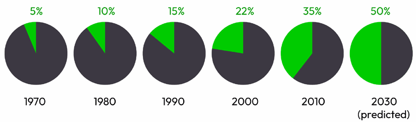

图 1.1 – 电子系统占汽车总成本的百分比

汽车系统日益增长的复杂性给行业带来了软件开发方面的挑战。

汽车向智能、互联和自动驾驶机器演变的过程受多种因素驱动，包括：

- 对先进安全功能日益增长的需求

- 对更高效、更环保交通工具的需求

- 对更便捷、更互联驾驶体验的渴望

---

传感器、软件系统和互联互通等先进技术的采用，使汽车制造商能够满足这些需求，开创了智能、自动驾驶和互联汽车的新时代。

随着 ADAS 和网联汽车功能等新技术的集成，需要开发和集成到车辆中的软件数量显著增长。

与阿波罗登月任务的对比凸显了现代汽车复杂性的巨大提升。阿波罗航天器仅有数量有限的系统需要管理，而现代汽车可能包含多达100个或更多的 ECU、传感器和执行器，所有这些都必须在非常严格的时间约束下彼此无缝通信，以确保正常运行。此外，现代汽车是高度互联的设备，需要复杂的软件和网络能力，进一步增加了其复杂性。这种提升的复杂性使现代汽车能够提供先进的功能和特性，但也需要更复杂的维护和维修流程。

在讨论了汽车软件的演变和复杂性之后，让我们将焦点转向使现代汽车有效运行的关键组件之一——ECU。

## 什么是 ECU？

在进一步讨论之前，我们需要理解什么是汽车 ECU。ECU 是一台计算机——由印刷电路板（PCB（Printed Circuit Board，印刷电路板））与微控制器和各种电子元件组成——用于控制车辆中的各种功能。这些功能可能包括发动机管理、变速箱控制、气候控制、动力转向和制动。以下是一些汽车 ECU 的示例：

- <strong>发动机控制模块（ECM（Engine Control Module，发动机控制模块））：</strong>ECM 负责管理发动机的性能，包括燃油喷射、点火正时和排放控制。

- <strong>变速箱控制模块（TCM（Transmission Control Module，变速箱控制模块））：</strong>TCM 管理变速箱的运作，包括档位选择、换档时机和变矩器锁止。

- <strong>车身控制模块（BCM（Body Control Module，车身控制模块））：</strong>BCM 控制与车辆车身和内饰相关的各种功能，如照明、气候控制、门锁和音响系统。

- <strong>防抱死制动系统（ABS）控制模块：</strong>ABS 控制模块管理 ABS 的运作，有助于防止打滑并在制动过程中保持对车辆的控制。

- <strong>电池管理系统（BMS（Battery Management System，电池管理系统））：</strong>BMS 的主要功能是监控、控制和优化车辆电池组的性能。它还确保电池组内所有电芯的充放电均匀，防止某些电芯过充，并最大化电池总容量。

---

这些组件的部分示例如下图所示：


图 1.2 – 车辆中 ECU 的示例

总体而言，汽车 ECU 在现代车辆的运行中起着至关重要的作用，为各种系统提供精确控制，并确保最佳性能、效率和安全。由于汽车 ECU 高度依赖复杂的软件来执行其功能，我们首先需要理解软件开发方面，以全面掌握 ECU 运行和设计的细微之处。

## 汽车软件开发简介

汽车软件开发是汽车行业持续创新和成功的关键组成部分。它涉及创建和维护用于各类汽车——轿车、卡车、公交车和其他机动车——的软件系统。这些软件系统承担多项任务，如发动机管理、导航、娱乐和安全功能。因此，该领域的工程师必须具备<strong>嵌入式系统</strong>、<strong>实时编程</strong>、<strong>控制系统</strong>和<strong>通信协议</strong>方面的专业知识，以创建可靠和安全的软件系统。

这是一个高度专业化的领域，需要与汽车开发团队的其他成员——如电气工程师、机械工程师和质量保证专家——密切协作，以确保软件系统无缝集成到车辆中并满足最终用户的需求。清晰的软件架构原则是应对这些挑战的关键——它能帮助构建易于维护、易于演进、对变化有弹性的系统。

---

软件设计中的整洁架构指的是一种优先考虑清晰性、关注点分离和可维护性的结构化方法。它强调以最小化依赖关系的方式组织代码，便于修改和测试。整洁架构培育出适应性强、可扩展且易于理解的系统。

这是一个充满挑战的领域，但在汽车行业的持续成功和创新中起着至关重要的作用。在讨论该领域的进展之前，让我们先了解传统的汽车软件开发方式。

## 理解传统软件开发

传统汽车软件开发涉及种类繁多的 ECU，它们具有不同的硬件和软件，这使得确保所有组件高效协同工作变得困难。每家供应商都有自己定义的软件架构、开发方法和 ECU 接口，导致整个汽车行业的软件组件（SWC）碎片化、非标准化。这种方法有以下若干局限性：

- <strong>可重用性有限：</strong>为一个车辆或系统开发的 SWC 可能无法在另一个中重用，导致开发成本增加和上市时间延长——如果在另一个平台需要类似功能的话。

- <strong>集成时间：</strong>不同 SWC 的集成可能是一个耗时且昂贵的过程，特别是如果这些组件从一开始就没有被设计为协同工作。

- <strong>上市时间：</strong>新车型和新功能的上市时间可能漫长且成本高昂，尤其是在使用传统汽车软件开发方法时。这可能导致制造商和供应商错失机会和收入损失。

- <strong>供应链复杂化：</strong>软件实现日益增长的复杂性与供应链日益增加的复杂性密切相关。在此背景下，软件开发人员根据原始设备制造商（OEM）或 Tier 1 供应商提供的需求定义来设计其组件，后者负责后续阶段的集成。

- <strong>刚性：</strong>汽车软件通常是单体且不灵活的。此外，很难适应不断变化的需求和技术。

传统汽车软件开发是碎片化的、非标准化的和高成本的，使得开发高质量软件并满足汽车行业日益增长的需求变得困难。以下图展示了一个这种非标准化架构的示例：

---

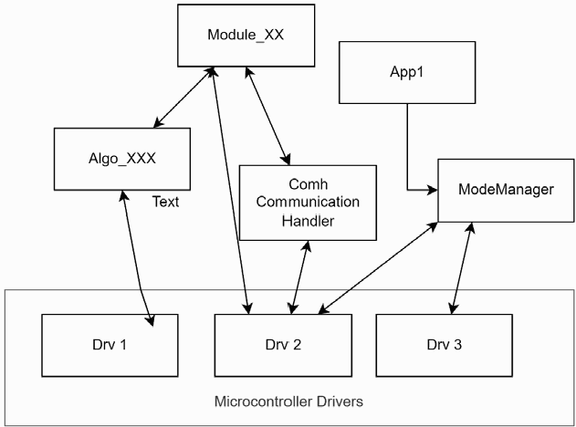

图 1.3 – 非标准化软件架构示例

因此，AUTOSAR 被引入，以解决这些局限性，并促进更高效、更有效和更标准化的汽车软件开发。在下一节中，我们将通过一个案例研究来说明这一点。

早期存在过标准化的尝试，既有企业内部推动的，也有通过不同实体之间合作进行的，例如 OSEK/VDX 和 HIS。这些倡议旨在解决软件架构的特定方面，如操作系统和诊断。尽管做出了这些努力，但它们往往关注范围较窄，缺乏现代车辆系统所需的集成度。这促成了 AUTOSAR 的发展——一个涵盖汽车软件架构所有层面的综合标准，实现了更好的可扩展性、互操作性和跨不同制造商及车辆平台的可重用性。

---

### 案例研究 – 更换 MCU 与交换微控制器驱动

让我们考虑这样一个例子：一家公司想要升级一个 ECU，该 ECU 通常使用专有的软件和硬件架构设计和实现，不同汽车制造商之间几乎没有或完全没有标准化。ECU 中部署的微控制器通常是定制的，针对汽车制造商和特定车型进行了专门设计，任何对其的修改都需要对硬件和软件方面进行大量变更。

假设该公司想用更先进的微控制器替换 ECU 的微控制器。在这种情况下，他们需要设计一个与新的微控制器兼容的新硬件板，这可能需要更改引脚分配和其他电路。如果采用类似于图 1.3 所示的架构，大部分软件将需要重写或修改以适配新微控制器的外设接口和架构。根据 ECU 的复杂性，这将需要大量时间、资金和资源的投入。

总之，在 AUTOSAR 问世之前，更换汽车 ECU 的微控制器是一项艰巨的任务，需要大量的技术知识和法规专业知识。汽车制造商之间缺乏标准化加剧了这一问题，使得设计通用解决方案变得困难。此外，所涉及的软件和硬件的复杂性质使得任何升级或修改 ECU 的尝试都构成重大挑战，需要大量精力和资源。随着 AUTOSAR 的出现，范式发生了转变，它使软件不仅可以从微控制器中抽象出来，而且可以从整个 ECU 和车辆架构中抽象出来。这使得开发人员能够编写与其他软件通信的应用程序，完全从 ECU 架构、字节序、总线架构、信号打包与协议、以及车辆网关等方面抽象出来。

值得注意的是，我们在本文中主要关注了 AUTOSAR 在微控制器替换方面的优势。然而，AUTOSAR 的优势远不止于此。除了促进微控制器替换外，AUTOSAR 的广泛影响还积极作用于汽车软件和硬件的诸多其他方面，使其成为汽车技术领域更高效、更灵活的解决方案。

## AUTOSAR 框架简介

AUTOSAR 是一个面向汽车行业的开放、标准化的软件架构。它由一个由汽车制造商、供应商和工具开发商组成的联盟开发。其目标是创建一个对所有人开放且可访问的汽车软件架构行业标准。该标准旨在满足汽车软件行业的技术目标：模块化、可扩展性、可移植性和功能可重用性。

---

AUTOSAR 的主要目标是开发一个可在不同汽车领域（如动力总成、底盘控制、车身和安全）中使用的标准架构。这种标准化旨在使来自不同供应商的 SWC 能够无缝协同工作，降低开发成本，并促进 SWC 的可重用性。它还有助于管理电气和电子系统日益增长的复杂性，并确保其质量和可靠性。

以下是生态系统中不同组成部分的工作方式：

- <strong>OEM：</strong>他们负责设定 ECU 软件需求，并选择 Tier 1 供应商来交付硬件和 SWC。通过采用 AUTOSAR，OEM 确保遵守安全和法规标准，同时促进模块化、可重用和可扩展的软件开发，以实现跨不同汽车系统和供应商的无缝集成与兼容。

- <strong>Tier 1 供应商：</strong>Tier 1 供应商是直接向 OEM 提供组件或系统（可以是硬件或软件）以用于车辆生产的公司。这些供应商处于汽车供应链的顶端，负责提供满足 OEM 规格和要求的高质量、可靠组件。汽车行业中 Tier 1 供应商的示例包括提供发动机、变速箱、制动系统、转向系统以及信息娱乐系统和 ECU 等电子元件的公司。

- <strong>标准软件供应商：</strong>标准软件供应商提供符合 AUTOSAR 标准的软件模块，如通信栈和诊断服务，这些模块可以轻松集成并与其他 SWC 互换。标准软件按照 AUTOSAR 标准开发，可供 Tier 1 供应商用于构建更复杂的软件模块。

- <strong>半导体制造商：</strong>汽车行业的半导体制造商提供电子元件。他们确保满足汽车行业未来的硬件和软件需求。

AUTOSAR 标准通过与合作伙伴的协作开发与维护，他们通过考虑支持用户路线图所需的用例来确保标准的持续相关性和先进性。合作伙伴根据其成员类型进行分组，在标准的开发、实现和使用方面具有不同程度的参与。这种方法鼓励多样化的利益相关者参与，并反映了整个汽车生态系统的需求和视角。AUTOSAR 的协作特性对其成功起到了关键作用，使其成为汽车软件架构的行业标准。主要类别如下：

- <strong>核心合作伙伴：</strong>核心合作伙伴包括 BMW Group、Bosch、Continental、Daimler AG、Ford、General Motors、PSA Group、Toyota、Volkswagen Group 和 Volvo Group。他们是合作关系的初始成员，提供了开发 AUTOSAR 标准所需的资金和资源。

---

- <strong>高级合作伙伴：</strong>一组作为 AUTOSAR 开发合作关系成员、并对 AUTOSAR 标准的开发和推广做出了重大贡献的公司。高级合作伙伴在合作关系中的参与度和影响力比普通成员更高，并享有额外的协作机会和提前获取最新 AUTOSAR 规范与版本的特权。

- <strong>开发合作伙伴：</strong>开发合作伙伴通过分享其知识、专业技术和资源，在塑造汽车行业的未来中扮演着重要角色。

- <strong>准合作伙伴：</strong>准合作伙伴的参与程度低于核心合作伙伴和高级合作伙伴，但仍能享受协作机会并获取最新的 AUTOSAR 规范和版本。

总之，AUTOSAR 通过提供一种共同语言和标准化框架，使 ECU 开发过程中的所有利益相关者能够有效协作。这促进了 SWC 跨不同汽车制造商的互操作性、可扩展性和重用性，减少了开发时间和成本，同时提高了软件质量和可靠性。

## 对传统软件开发的影响

AUTOSAR 通过提供标准化的方法来解决传统汽车软件开发的局限性。通过促进模块化、标准化和可扩展性，AUTOSAR 使开发满足汽车行业日益增长的需求的高质量软件变得更加容易。AUTOSAR 的成功体现在其作为汽车软件架构行业标准的广泛采用上。

以下是 AUTOSAR 解决传统软件开发局限性的一些方式：

- <strong>通用平台：</strong>它为软件开发提供了一个通用平台和架构，使不同供应商和制造商之间能够协作。

- <strong>模块化设计：</strong>它促进了模块化和标准化，使 SWC 更容易在不同项目中重用，并适应不断变化的需求和技术。

- <strong>成本高效的集成：</strong>AUTOSAR 采用的标准化软件开发方法使不同 SWC 的集成变得更加容易和成本高效。

- <strong>安全与安保：</strong>在汽车软件中实现安全和安保概念的框架有助于确保道路上车辆的安全和安保。

- <strong>互操作性：</strong>它定义了一种通用的通信方法论，使来自不同供应商的 ECU 能够无缝互操作。

- <strong>一致性：</strong>一致的软件开发方法使 SWC 的互操作性、可维护性和可扩展性更容易得到保障。

---

- <strong>灵活性：</strong>它促进了模块化和灵活的软件开发方法，使其更容易适应不断变化的需求和技术。

在下一节中，我们将探讨 AUTOSAR 用于解决传统汽车软件开发局限性的方法。我们将研究 AUTOSAR 的通用平台、模块化设计、成本高效的集成、安全与安保、互操作性、一致性和灵活性如何通过提供一个标准化、高效的框架来开发卓越的汽车软件，从而改变了整个行业。

## 这些目标是如何实现的？

将基础设施与应用分离是软件架构的一个基本原则，它使软件开发人员能够专注于他们在开发应用软件（ASW）模块方面的核心竞争力和专业知识，这些模块提供了其产品的独特功能。他们无需担心底层硬件或软件平台，也无需担心 BSW 和运行时环境（RTE）的实现细节。相反，他们可以专注于自己在开发 ASW 模块方面的核心竞争力，同时使用标准化的接口和服务来访问 BSW。

BSW 提供底层软件服务，如驱动程序、通信和诊断服务，这些是 ECU 正常运行所必需的。它包括符合 AUTOSAR 规范的标准化模块，可以轻松集成并与来自不同供应商的其他 BSW 模块互换。

下图展示了这个标准化接口的基本结构：

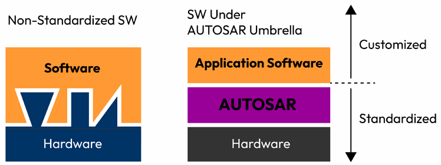

图 1.4 – AUTOSAR 标准化

将基础设施与应用分离还使 ECU 更加模块化和可扩展。来自不同供应商的不同 ASW 模块可以轻松集成到 ECU 中，新的 ASW 模块可以添加或移除，而不会影响 BSW 或其他 ASW 模块。

---

然而，AUTOSAR 并不为个别问题或用例提供具体的解决方案。相反，它提供了一种结构化的方式在 ECU 中实现特定功能，可以根据不同汽车制造商和用例的需求进行适配和定制。

例如，如果一家汽车制造商想要实现一个特定的制动系统，他们会使用 AUTOSAR 框架和规范来开发控制制动系统的软件模块。AUTOSAR 将提供一种标准化的方式来与微控制器和外设硬件交互，以实现制动功能的实施。然而，它不会提供关于如何管理制动系统或如何实现特定功能的具体指导。以下案例研究提供了一个更详细的示例。

### 案例研究 – 在 AUTOSAR 框架中开发 ECU

一家汽车供应商正在使用 AUTOSAR 为自动驾驶应用开发新的雷达传感器系统。挑战在于开发一种高精度、高可靠性的雷达传感器系统，能够在尽可能短的时间内检测到物体并向车辆控制系统提供准确的预警信号。

该供应商决定采用 AUTOSAR，它提供了一套标准化的接口和服务，用于 SWC 的开发和集成。AUTOSAR BSW 层提供了一套预构建的软件模块，这些模块抽象了硬件特定的细节，并为 ASW 层访问硬件功能提供了统一的接口。

通过使用 AUTOSAR，该供应商能够减少集成多个 SWC 所需的开发时间和成本，同时降低不兼容或错误的风险。AUTOSAR 提供的标准化接口和服务使软件工程师能够专注于开发雷达传感器系统的应用特定功能，而不是花费时间在开发和集成基础软件服务上。

例如，应用工程师不必担心如何将数据存储在非易失性存储器中、通信如何工作、或者是使用控制器局域网（CAN）还是 Ethernet 作为传输介质。

相反，他们只需专注于实现检测物体并向车辆控制系统提供预警信号的预警算法。

现在我们已经理解了 AUTOSAR 的必要性，让我们更详细地了解其标准。

## 理解 AUTOSAR 标准

AUTOSAR 标准由一系列规范、标准和指南组成，为汽车 ECU 中 SWC 的开发和集成提供了框架。AUTOSAR 标准由以下部分组成：

---

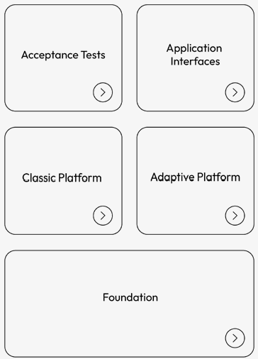

图 1.5 – AUTOSAR 标准

以下列表详细描述了这些组成部分：

### AUTOSAR 平台

AUTOSAR 有两个主要版本，即 Classic Platform（CP）和 Adaptive Platform（AP）。一个常见的误解是 Adaptive AUTOSAR 正在取代 Classic AUTOSAR。实际上，Adaptive AUTOSAR 和 Classic AUTOSAR 是互补的软件架构，分别应对汽车行业不同的需求和应用场景：

- <strong>CP</strong> 适用于具有固定功能集、硬件和软件紧耦合（静态）的传统嵌入式汽车系统。它采用分层架构和标准化接口，便于 SWC 的一致的、高效的开发与集成。它还针对资源受限环境进行了优化，非常适合处理能力和内存有限的 ECU。

它使用基于 OSEK/VDX 的实时操作系统（RTOS），该操作系统具有高度确定性并针对实时性能进行了优化，因此适用于安全关键型和硬实时应用，如动力总成和底盘控制。

通信基于静态配置，使用预定义的协议，如 CAN、LIN、FlexRay 和 Ethernet，通信关系在设计时建立。

---

- <strong>AP</strong> 专为更灵活、更动态的汽车系统而设计，其中硬件和软件是解耦的，可以独立升级。它提供了模块化架构，并支持使用开源和第三方组件，从而实现更快的创新和更频繁的更新。与 CP 相比，它使用 Ethernet 支持基于面向服务架构（SOA）的动态通信，在运行时可以发现并与服务通信。它使用符合 POSIX 标准的操作系统，通常基于 Linux，提供更大的灵活性，适合处理复杂和资源密集型任务。

AUTOSAR 的两个版本反映了汽车行业的不同需求和愿望，它们旨在为车辆中 SWC 的开发和集成提供通用标准，无论具体用例或应用如何。

### Foundation（FO（Foundation，基础平台））

AUTOSAR 中的 Foundation（FO）旨在通过提供一组在 CP 和 AP 之间共享的通用工件，确保不同 AUTOSAR 平台之间的互操作性。这有助于促进不同平台之间的兼容性，包括那些不基于 AUTOSAR 的平台，并确保汽车系统和设备能够无缝协同工作。

它包含通用需求和技术规范，例如 E2E 协议规范、V2X 规范、安全车载通信协议和入侵检测系统协议规范，这些都在 AUTOSAR 平台（CP 和 AP）之间共享。

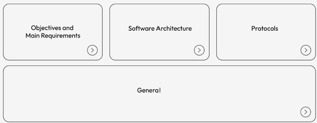

图 1.6 – AUTOSAR 标准中的 FO

---

### 验收测试（AT）

AUTOSAR AT 是总线层面和应用层面的系统测试，用于验证 AUTOSAR 栈在 ASW 组件以及通信总线方面的行为：

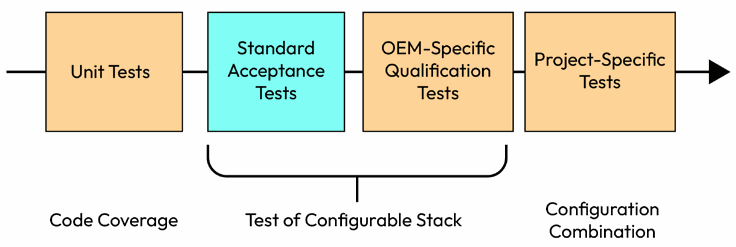

图 1.7 – AUTOSAR 验收测试

文档描述了 CAN 总线通信的 AT 规范，其中说明了测试用例步骤以及测试架构。在下图中（摘自上述示例用例），该图展示了一个测试设置，其中测试台通过 CAN 总线向被测系统（SUT）中的嵌入式 SWC 发送测试序列。

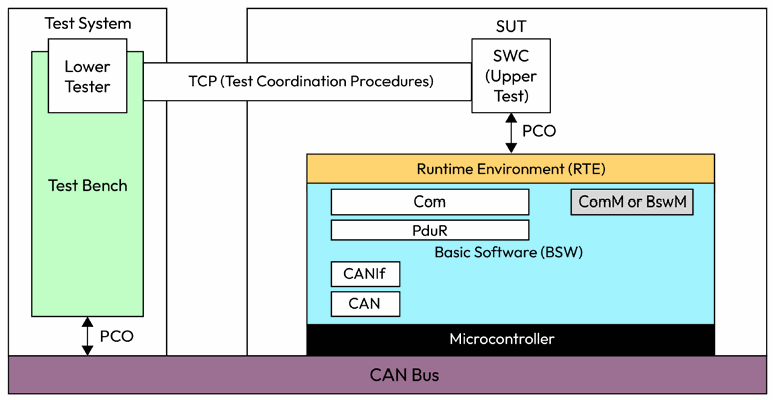

图 1.8 – 测试架构描述

---

### 应用接口（AI）

AUTOSAR 已经为不同的车辆领域标准化了大量的 AI——在语法和语义方面——涵盖：车身与舒适性；动力总成；底盘控制；乘员和行人安全；以及 HMI（Human-Machine Interface，人机界面）、多媒体与远程信息处理。例如，底盘控制领域关注稳定性和操控性，而动力总成管理推进系统。车身领域处理舒适性和便利性功能，自动驾驶系统实现自动驾驶能力，车载信息娱乐系统（IVI（In-Vehicle Infotainment，车载信息娱乐系统））确保娱乐和互联互通。AUTOSAR 跨这些领域定义了参考接口和 SWC，使系统能够有效通信并互操作，无论不同制造商使用何种具体的硬件或软件。例如，动力总成和底盘控制系统协同工作以实现车辆稳定性和性能，而 ADAS 依赖来自各种传感器和系统的输入来做出实时驾驶决策。

AUTOSAR 中应用接口的一个示例是自适应巡航控制（ACC（Adaptive Cruise Control，自适应巡航控制））接口。这个接口标准化了 ACC 组件与其他车辆系统（如传感器和执行器）之间的通信方式。它定义了如何处理和交换数据（如车速和与前车的距离），使 ACC 能够自动保持与其他车辆的安全距离。通过使用这个标准化接口，不同的 ACC 实现可以跨不同车型与各种传感器和执行器交互，保证一致性和互操作性。

AUTOSAR 跨这些领域标准化了接口和 SWC，确保系统能够有效通信并互操作，无论不同制造商使用何种具体的硬件或软件。例如，动力总成和底盘控制系统之间的交互对车辆稳定性和性能至关重要，而自动驾驶域依赖来自各种传感器和系统的输入来做出实时驾驶决策。

## 软件架构与设计

所定义的架构基于模块化、分层的设计方法，强调关注点分离、清晰的接口和组件的独立性。AUTOSAR 提供了软件架构与设计的指南和最佳实践，使软件工程师能够开发出高质量、标准化的 SWC，这些组件可以轻松集成到不同的汽车系统和设备中。

### 层

软件架构中的"层"指的是共享一组共同职责并被设计为协同工作以执行一组特定任务的 SWC 的逻辑分组。

---

它可以被看作软件架构中的一个水平切片，每一层为其上层提供一组特定的服务，如图 1.9 所示。层的设计通常旨在模块化和松耦合，使得对某一层的更改不会影响其他层的功能。

AUTOSAR 分层架构通过将软件划分为在微控制器上运行的三个主要层，为实现软件和硬件独立性提供了必要的机制，如下图所示：

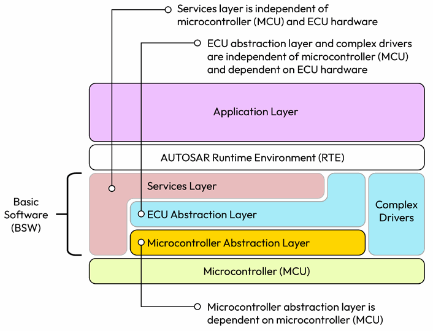

图 1.9 – AUTOSAR 分层架构

让我们更详细地讨论这些层：

- <strong>应用层：</strong>这是包含系统算法和功能的 SWC 所在的层。该层负责实现系统的高层行为，并利用较低层的接口来访问硬件资源。功能示例包括为电池充电器 ECU 监控电池电量，以及通过人机界面（HMI）设置和查看温度。

- <strong>AUTOSAR RTE：</strong>RTE 既是 ASW 和 BSW 层之间的绑定层，也是隔离层。这两个层之间的所有通信和服务使用都必须在 RTE 内进行。我们将在第 4 章中深入探讨这一主题的具体细节。

---

- <strong>基础软件：</strong>BSW 层分为三个不同的子层，每个子层提供 ECU 正常运行所需的特定功能。这些层次如下：

  - <strong>服务层：</strong>该层为应用程序提供各种服务以供使用。它包含系统服务、内存服务、加密服务以及诊断和通信服务等服务。

  - <strong>ECU 抽象层：</strong>该层提供 ECU 相关的抽象，包括 I/O 硬件抽象、板载设备抽象（如外部看门狗）、内存硬件抽象和加密硬件抽象，使应用程序实现硬件独立性。

  - <strong>微控制器抽象层（MCAL）：</strong>该层为所使用的 MCU 提供驱动实现，使上层的 BSW 层与微控制器硬件外设之间能够通信。

我们将在第 2 章中进一步探索这些层。

### 栈

栈是指一组软件层或组件协同工作以提供特定功能或服务的集合。栈中的每一层代表一组不同的功能和服务，并负责执行一组特定的任务。各层之间通过定义良好的接口进行通信，数据以层次化的方式在层之间传递，每一层为其上层提供服务。架构如下图所示：

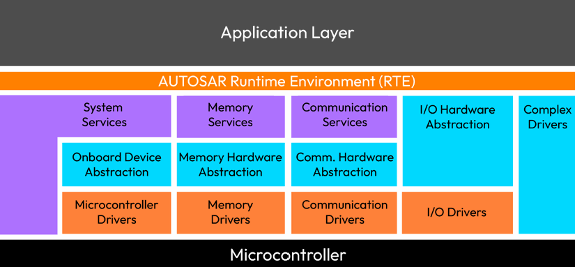

图 1.10 – AUTOSAR 栈

---

我们在旅程中将要深入探讨的一些主要 AUTOSAR 栈包括：

- 内存栈

- 通信栈（CAN、Ethernet、LIN 和 FlexRay）

- 诊断栈

- I/O 硬件抽象栈

- 安全栈

### 本章小结

在本章中，我们追溯了汽车行业的演变，并识别了传统软件开发所面临的挑战。这些挑战是促使 AUTOSAR 诞生的关键驱动力。我们讨论了 AUTOSAR 框架为汽车行业内的软件开发和集成提供了一种标准化的方法。这使软件开发者能够专注于他们的核心竞争力，开发应用特定的功能，同时利用标准化的接口和服务来访问基础软件层。

此外，该框架促进了跨不同汽车制造商的 SWC 的互操作性、可扩展性和重用性，最终减少了开发时间和成本，同时提高了软件质量和可靠性。

我们了解到 AUTOSAR 由一系列规范和指南组成，为汽车 ECU 中 SWC 的开发和集成建立了框架。该框架采用分层方法，层与层之间模块化且松耦合，实现了 ASW 和硬件的独立性。此外，AUTOSAR 提供了一组栈，它们协同工作以提供 ECU 特定的功能和服务。本章获得的见解具有重大意义，因为它们使我们能够更好地理解 AUTOSAR 的实际应用。通过理解这些主题的相关性和所学到的经验教训，开发人员可以有效地将这些知识应用于实际场景中，进一步改进汽车软件系统的开发和集成。

在下一章中，我们将探索 AUTOSAR 中的各个层和栈，更全面地理解该框架及其经典组件。

---

### 思考题

请回答以下问题，以评估你对本章的整体理解：

- AUTOSAR 代表什么？

- 谁开发了 AUTOSAR 标准？

- AUTOSAR 框架的主要目标是什么？

- Classic AUTOSAR 有多少层？

- 列出四个 AUTOSAR 栈。

- Adaptive AUTOSAR 是否在取代 Classic AUTOSAR？如果取代，原因是什么？

- Classic AUTOSAR 和 Adaptive AUTOSAR 的主要区别是什么？

---

---

## 第2章 AUTOSAR 软件层简介

至此，你已经了解了 AUTOSAR、其面临的挑战，以及它由一群合作者联合力量共同创立的历程。但 AUTOSAR 到底是什么？

将 AUTOSAR 想象为一组模块化元素，它们创建一个基础平台，汽车应用程序可以构建于其上。就像积木可以用来构建各种结构一样，AUTOSAR 提供了一系列标准化的模块和软件组件（SWC），可以组合起来创建多样化的汽车系统。

### 什么是 SWC？

在 AUTOSAR 中，SWC 是一种模块化、可重用且自包含的功能单元，它封装了软件应用程序的特定部分，代表各种类型的功能，如传感器数据处理、执行器控制或复杂算法。AUTOSAR 提供了一种标准化的方式来定义这些组件，同时提供到底层服务组件的标准化接口。

AUTOSAR 可以被比作汽车软件开发的通用语言。正如来自不同国家的人可以使用一种共享语言进行交流一样，使用 AUTOSAR 创建的 SWC 可以通过标准化的接口和协议相互交互，而不管底层的硬件或软件平台是什么。

在本章中，我们将通过涵盖以下主要主题来深入理解这一点：

- 理解 AUTOSAR 中的分层软件架构

- 应用层

- 运行时环境

- 基础软件层

---

# 第2章 AUTOSAR 软件层简介

AUTOSAR Fundamentals and Applications — Hossam Soffar 著 | AI 辅助翻译

---

## 理解 AUTOSAR 中的分层软件架构

我们可以将 AUTOSAR 中的分层软件架构想象为一栋多层建筑，每一层都有不同的用途和各自的职责。在这个类比中，楼层代表 AUTOSAR 软件架构的不同层次，每层中的房间代表各层内的模块：

- <strong>基础软件（BSW）层（地下室）：</strong>这一层代表建筑的地基，提供水电、暖通等基础服务。类似地，该层包含管理低级任务的模块，如通信、诊断服务、内存管理和操作系统（OS）功能。

- <strong>运行时环境（接地层/大厅）：</strong>这一层充当连接底层与上层的通道，使它们之间能够顺畅通行。AUTOSAR 中的运行时环境（RTE）促进应用层中的 SWC 与 BSW 层之间的通信，为底层硬件提供抽象。

- <strong>应用层（上层）：</strong>这一层包含居住空间，如卧室、厨房和客厅，满足居住者的特定需求。同样地，应用层容纳定义汽车系统功能和行为的具体应用 SWC。

在这个多层建筑类比中，如图 2.1 所示，每一层都服务于独特的目的，并依赖其下层提供的服务：

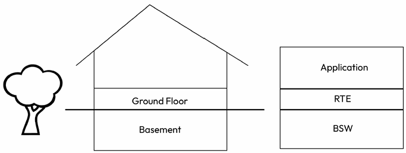

图 2.1 – AUTOSAR 类比

建筑的居住者（最终用户）主要与上层（应用层）交互，该层专为满足他们的需求而设计。类似地，汽车系统的功能主要由应用层决定，该层利用下层来实现其目标。

---

这个类比有助于说明 AUTOSAR 软件架构中每一层的独特角色和依赖关系，突显了抽象和关注点分离在管理汽车系统复杂性方面的重要性。接下来，让我们讨论和研究图 2.2 所示的 AUTOSAR 各层。以下是总体结构：

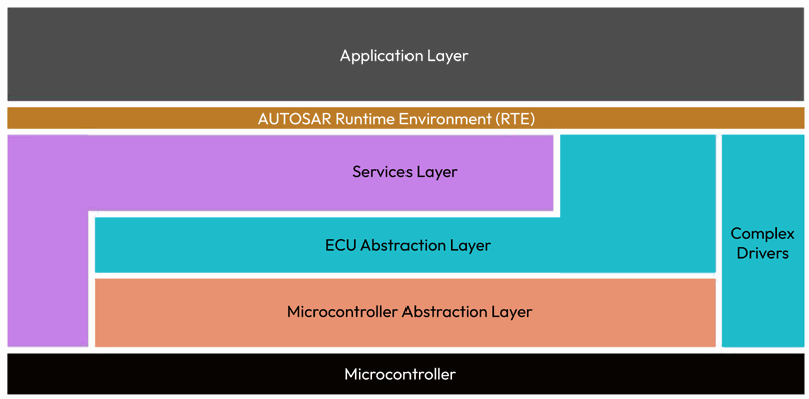

图 2.2 – AUTOSAR 层

在本章中我们将采用自上而下的方法，更详细地讨论每一层的功能，最后以一个电池管理系统（BMS（Battery Management System，电池管理系统））ECU 开发的案例研究作为总结。让我们先看应用层。

## 应用层

在 AUTOSAR 中，应用层代表软件架构的最高层，负责执行系统的高层功能。

该层由设计用于执行汽车系统所需特定任务或操作的 SWC 组成。这些组件可以包含控制算法、信号处理、监控和诊断功能、用户界面以及其他应用特定的逻辑。SWC 之间以及 SWC 与下层之间通过明确定义的接口进行通信，促进了模块化、可重用性和可维护性。AUTOSAR 软件架构定义了应用层，其组件被设计为独立于底层硬件和 BSW 层。这种独立性使得 SWC 在不同的汽车系统之间具有更高的灵活性和可重用性。如下图所示：

---

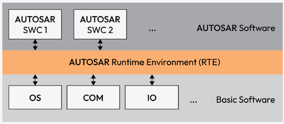

图 2.3 – AUTOSAR 应用层

算法和决策是高层功能，需要使用 BSW 层提供的服务，例如读取特定 GPIO 的 ADC 值、使用 SPI 通信控制 ECU 上的其他芯片，以及通过通信协议发送消息。当我们在本章稍后更详细地讨论 BSW 时，我们将更加熟悉 BSW 为应用提供的服务。

例如，雷达传感器 ECU 负责处理和解译来自 RF 芯片的数据，这些芯片通常用于高级驾驶辅助系统（ADAS）和自动驾驶功能。盲点检测是一项利用雷达传感器检测车辆是否处于盲区并通过声音或视觉警报提醒驾驶员的功能。在这种情况下，应用层将由多个 SWC 组成，每个 SWC 负责功能的特定部分。例如，可能有一个组件读取雷达传感器的原始数据；另一个组件追踪和分类物体；另一个组件处理数据以检测潜在危险；还有另一个组件为驾驶员生成视觉或听觉警报。

应用层需要关心底层通信协议吗？不需要。如果 ECU 通过通信总线发送检测到的物体或警告信号，SWC 将这些数据发送到 BSW 层，其服务模块将这些数据打包到已配置的通信总线（控制器局域网（CAN）、Ethernet 或 FlexRay）中。

虽然 AUTOSAR 没有规定特定的编程语言，但其大多数 SWC 是用 C 语言编写的。这是因为 C 是一种被广泛认可和成熟的编程语言，与底层系统软件（如设备驱动和通信协议）的开发高度兼容。

在接下来的章节中，我们将深入探讨 RTE 层，它充当连接应用层和 BSW 服务的桥梁。

---

## 运行时环境

RTE 在 AUTOSAR 架构中扮演着关键角色；它是促进应用层中的 SWC 与 BSW 层之间通信的中间件层。RTE 作为一个抽象层，使数据与信号的交换能够在 SWC 之间进行，而无需了解底层硬件或软件的细节。

这种抽象使得 SWC 能够彼此独立且独立于目标硬件平台进行设计、开发和测试。此外，RTE 还提供一系列服务，如数据编组、数据转换和事件驱动通信，进一步增强了整个系统的效率和健壮性。

在进一步讨论 RTE 之前，我们需要先熟悉虚拟功能总线（VFB（Virtual Functional Bus，虚拟功能总线））的概念，以便更好地理解 RTE。

### 理解 VFB 概念

VFB 是 AUTOSAR 中的一个抽象概念，代表应用层中 SWC 的通信基础设施。它定义了一组标准化的接口和协议，用于 SWC 之间的数据交换，使它们能够在无需了解底层硬件或软件细节的情况下进行通信。

但这到底是什么意思呢？

VFB 在配置步骤中是必需的，在此过程中会定义和设置 AUTOSAR 系统的架构。这包括定义 SWC、它们的接口以及这些组件之间的通信。

这也是架构师决定系统所需功能的时刻，从而将这些功能划分为不同的 SWC：

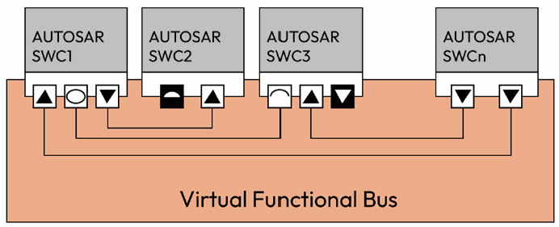

图 2.4 – VFB 概念

---

每个软件部分被分解为多个 SWC，每个 SWC 都有自己专门的功能。当一个 SWC 需要与另一个 SWC 交换数据时，通过信号甚至远程过程调用（RPC（Remote Procedure Call，远程过程调用））来完成。一旦软件架构完成，SWC 被分布到一个或多个物理 ECU 上。这些 ECU 负责实现相应的功能以及促进组件之间的通信：

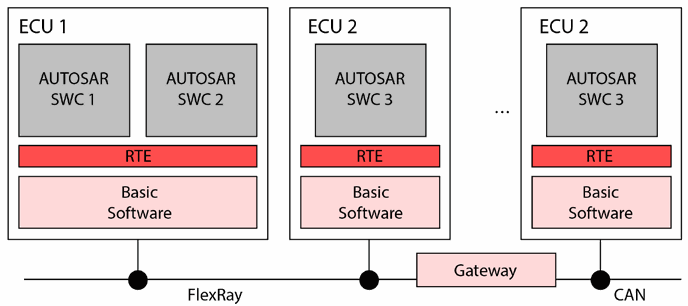

图 2.5 – 将 SWC 分配到 ECU

因此，如果 SWC（如 SWC 1 和 SWC 2）位于同一个 ECU 内，通信将使用 ECU 内部通信机制，通信保持在 ECU 内部，由 RTE 实现。

然而，如果 SWC 位于两个不同的 ECU 中，如 SWC 1 和 SWC 3，它们之间的通信将通过通信介质（如 CAN、FlexRay 或 Ethernet）实现。信号在 BSW 层中如何打包的过程将在第 5 章中更详细地讨论。

目前，可以将 RTE 视为一座桥梁或粘合层，允许 SWC 之间共享数据，同时也支持与 BSW 层的交互。这在维护基于 AUTOSAR 的汽车系统中 SWC 的模块化、可重用性和互操作性方面起着至关重要的作用。

### 理解 RTE 的功能

你可能在想 RTE 层如何促进模块化。让我们通过以下示例来阐明这个想法。假设有两个 SWC 组件：SWC 1 是发送方，SWC 2 是信号的接收方，例如一个计数器值。此外，接收方模块将计数器值发送到通信总线（例如 CAN）。

以下示例仅用于演示 RTE 层如何充当 SWC 与 BSW 服务层之间的粘合层。

---

以下示例在 SWC 1 中定义了一个名为 `SenderCounterFunction` 的函数。该函数递增一个名为 `counter` 的静态变量，并使用名为 `Rte_Write_SenderInterface_SenderOutput` 的函数写入其更新后的值：

```
# include "Rte_Sender.h"
void SenderCounterFunction(void) {
    static UInt32 counter = 0U;
    counter++; /*just an example */
    Rte_Write_SenderInterface_SenderOutput(counter);
}
```

SWC 2 定义了另一个名为 `ReceiverCounterFunction` 的函数。在函数内部，声明了一个类型为 `UInt32` 的局部变量 `receivedData`。然后该函数读取一个值并将其存储在 `receivedData` 变量中。

代码随后检查 `receivedData` 是奇数还是偶数。如果是奇数，函数使用名为 `Rte_Write_ReceiverModule_CounterSig` 的函数发送该值：

```
# include "Rte_Receiver.h"
void ReceiverCounterFunction(void) {
    UInt32 receivedData;
    Rte_Read_ReceiverInterface_ReceiverInput(&receivedData);
    // Process received data, e.g., control an actuator based on the input
    // In this example only odd counter value is sent
    if (receivedData % 2) {
        Rte_Write_ReciverModule_CounterSig(receivedData)
    }
}
```

以下代码演示了 RTE 层的一种可能实现，它充当 SWC 或应用程序之间的中介。RTE 层作为粘合剂，使信号能够在不同 SWC 之间传递。为实现这一点，代码定义了一个缓冲区作为数据的临时存储位置，并提供了可用于读取或写入缓冲区的 setter 和 getter 函数。总体而言，这段代码提供了一个示例，说明如何使用 RTE 层来促进 SWC 之间的通信：

```
UInt32 Rte_buffer_Data=0U;
FUNC (Std_ReturnType, RTE_CODE) Rte_Write_SenderInterface_SenderOutput(UInt32 data)
{
    Std_ReturnType ret = RTE_E_OK;
    Rte_buffer_Data = data;
    return ret;
}
```

---

```
FUNC(Std_ReturnType, RTE_CODE) Rte_Read_ReceiverInterface_ReceiverInput (UInt32 *data)
{
    Std_ReturnType ret = RTE_E_OK;
    *data = Rte_buffer_Data;
    return ret;
}

FUNC (Std_ReturnType, RTE_CODE) Rte_Write_ReciverModule_CounterSig(UInt32 data)
{
    Std_ReturnType ret = RTE_E_OK;
    ret |= Com_SendSignal(ComConf_ComSignal_CounterSig_Tx,&(data));
    return ret;
}
```

如本例所示，两个 SWC 通过交换数据来相互通信。RTE 管理缓冲区和数据处理过程。两个 SWC 独立运行，SWC 1 将数据发送到 RTE，RTE 在内部存储数据。每当另一个 SWC 需要数据时，它从 RTE 请求数据。此外，当数据被发送到通信总线时，会使用 BSW 层的 COM 服务。请进一步查看图 2.6，其中以序列图的形式展示了这个过程。在第 7 章中，我们将探索从应用层到物理通信总线的完整路径。

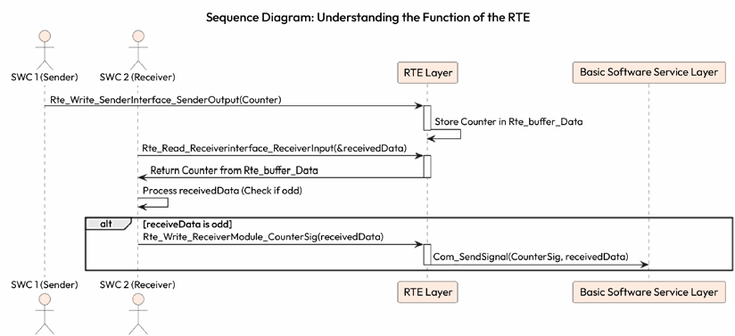

图 2.6 – RTE 层作为 SWC 之间的中介

至此，我们已经理解了应用层和 RTE 层的机制和运作方式。为了获得更深入的理解，让我们探索 BSW 层。

---

## 基础软件层

在智能手机的最底层，有处理器、内存和传感器等硬件组件。这些组件由设备驱动和其他低级软件模块管理，使它们能够与更高级的 SWC（如你喜爱的微信或抖音应用）通信。在 AUTOSAR 中，BSW 层为上层应用提供这种低级功能，如内存管理、通信协议和诊断服务，如下图所示：

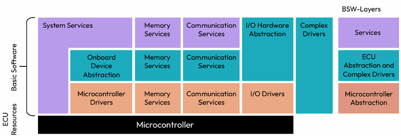

图 2.7 – BSW 层

让我们放大观察 BSW 的架构及其不同的子层，BSW 由三个额外的子层组成：服务层、ECU 抽象层和微控制器层。

### 服务层

最顶层是服务层，为应用组件提供各种服务。它是应用组件与 BSW 功能之间的主要接口。它是应用唯一可以直接访问的层，使应用组件能够访问和利用一系列功能，而无需直接处理底层硬件或 SWC。让我们在 BSW 图中突出显示这些组件：

---

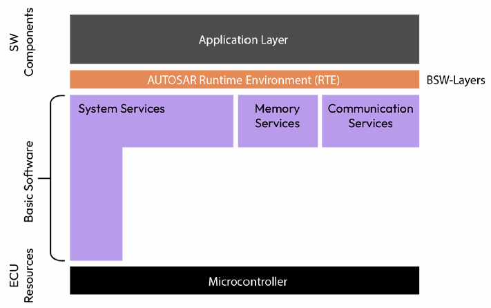

图 2.8 – BSW 服务层

BSW 为应用提供的服务示例如下：

- <strong>通信服务：</strong>这些服务处理不同 ECU 之间以及 ECU 与外部设备之间的通信，使用标准化协议，如 CAN、LIN、FlexRay 和 Ethernet。通过提供通用的通信服务，BSW 层允许分布式汽车系统中各种组件的无缝集成。
如果你的应用需要发送 CAN 消息，它利用 COM API 来触发消息的发送。你将在第 7 章中了解更多相关信息。

- <strong>内存服务：</strong>BSW 层提供标准化的内存服务，如 EEPROM Abstraction 和 Flash EEPROM Emulation，使应用层能够访问和管理非易失性存储器，而无需处理硬件特定的细节。
例如，开发中的 ECU 可能需要永久存储校准值、配置参数和其他重要设置等数据。

- <strong>诊断服务：</strong>诊断服务，如诊断通信管理器（DCM（Diagnostic Communication Manager，诊断通信管理器））和诊断事件管理器（DEM），使应用层能够执行诊断并报告错误。这些服务提供了一种标准化的诊断方法，简化了开发和维护。更多内容见第 10 章，届时我们将简要涉及诊断模块。

---

- <strong>系统服务：</strong>这些服务管理基本的系统功能，如 ECU 状态管理器（ECUM）、OS 和模式管理。通过提供通用的系统服务，BSW 层使应用层能够专注于高层功能，而无需担心底层的系统管理任务。

### ECU 抽象层

AUTOSAR 中的 ECU 抽象层充当通用连接器，使不同的 AUTOSAR 软件组件能够与不同的硬件设备交互和管理，而无需了解每个设备的具体细节。该层在 BSW 和硬件之间建立了标准化接口，确保跨不同 ECU 的兼容性和无缝操作，无论具体的微控制器制造商或型号、ECU 配置，或者某些硬件外设是集成在微控制器内还是作为独立芯片存在。通过抽象 ECU 之间的差异，ECU 抽象层使应用层能够独立于特定的硬件实现或 ECU 的具体布局进行开发：

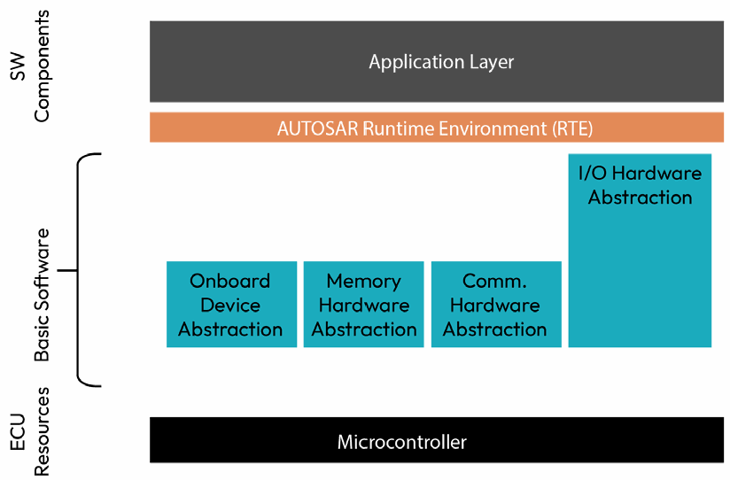

图 2.9 – ECU 抽象层

---

在复杂的汽车系统中，一个 ECU 可能包含多个 CAN 设备，既有内部的也有外部的。这些设备负责与车辆内的其他 ECU 和系统进行通信。ECU 抽象层在管理与这些各种 CAN 设备的交互方面发挥着重要作用，同时保持应用程序对底层 ECU 布局的独立性。在这种情况下，ECU 提供以下功能：

- <strong>统一接口：</strong>ECU 抽象层为应用程序提供了一个统一的接口，用于与系统中的所有 CAN 设备交互，无论它们是内部还是外部的。这种抽象隐藏了不同 CAN 设备之间的复杂性和差异，使应用代码保持独立于具体的 ECU 布局。

- <strong>适应性：</strong>ECU 抽象层管理多个 CAN 设备交互的能力使应用程序能够更好地适应 ECU 布局的变化。例如，如果添加了新的 CAN 设备或替换了现有设备，可以更新 ECU 抽象层以适应这些变化，而无需修改应用代码。这使得系统更具可扩展性，更易于维护。

另一个例子是输入/输出硬件抽象（I/O Hardware Abstraction），位于 ECU 抽象层内 RTE 的下方。它充当 BSW 模块与应用软件之间的接口。它还提供一致的接口用于与各种硬件组件交互，如数字输入/输出（DIO）、模数转换器（ADC）和脉宽调制（PWM）外设，使应用层能够正常工作而无需关心硬件特定的细节，因为它抽象并隐藏了硬件特定的细节。

### 微控制器抽象层

在 AUTOSAR 中，微控制器抽象层（MCAL）是软件架构中的最低层，提供 BSW 层与底层微控制器硬件之间的标准化接口：

---

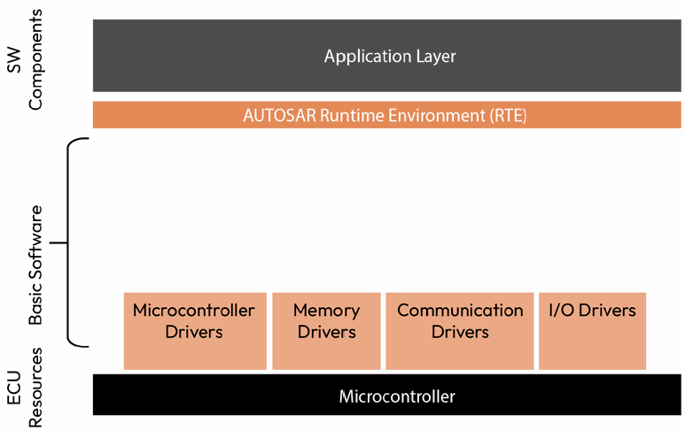

图 2.10 – MCAL

MCAL 的主要目的是抽象硬件特定的细节。它提供了一套针对系统中使用的特定微控制器而定制的软件模块和设备驱动。这些模块和驱动提供对微控制器外设的访问。这些模块包括 DIO 端口、ADC、定时器、通信接口（CAN、LIN、FlexRay 和 Ethernet）驱动和内存管理（Flash Driver 或 FLS）、以及 Crypto Driver。

想象一个汽车应用需要通过 PWM 信号控制电机的速度。如果没有 MCAL，应用开发人员需要编写特定于所用硬件（例如特定的微控制器和 PWM 模块）的代码。这可能使应用难以维护和移植到其他硬件平台。为了更清晰地说明这一点，在以下示例中，我们将演示如何在 AUTOSAR 中使用 ECU 抽象层控制 LED。目标是通过 DIO 使 LED 周期性亮灭。

现在，让我们看看用于切换 LED 的代码：

```
void ToggleHeartBeatLED(){
    static boolean ledState = FALSE;
    // Toggle the LED state
    ledState = !ledState;
    // Write the new state to the LED pin
    Dio_WriteChannel(LED_PIN, ledState);
}
```

---

检查上述代码，统一的 API `Dio_WriteChannel` 被用于访问 PIN，而无需担心特定的微控制器实现。这使得能够无缝集成来自不同供应商（如 Infineon、NXP、ST 或任何其他制造商）的微控制器。

如果我们不能使用抽象层来完成这个任务，我们需要直接访问外设寄存器来实现它。然而，这种方法会将我们的应用或实现与特定的微控制器系列紧密耦合。这可能会阻碍模块化，使代码在不同微控制器平台之间的可用性降低。

在讨论了 BSW 各层及其各自的功能（这些层由多个模块组成以实现 ECU 功能）之后，有必要探索向 AUTOSAR 系统引入新功能或集成遗留代码的可能性。AUTOSAR 致力于维护一个灵活的平台，同时支持遗留代码的集成。为了满足这一需求，复杂设备驱动（CDD（Complex Device Driver，复杂设备驱动））应运而生，填补了空白，使用户能够向 AUTOSAR 框架中最初不存在的任何 BSW 层添加新功能。让我们在下一节中讨论这些内容。

### 复杂驱动

在 AUTOSAR 中，CDD 是一种专门的软件模块，旨在管理和控制未被其他层覆盖的复杂硬件设备或子系统。CDD 的创建是为了解决需要超出规范范围的独特功能或硬件控制的特定汽车系统的需求。

下图显示了复杂驱动横跨所有 BSW 子层：

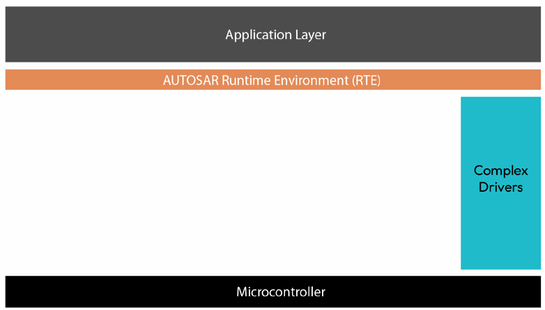

图 2.11 – CDD

---

想象一个汽车应用利用定制的触控感应界面来控制各种车内功能，如信息娱乐系统、气候控制和照明。该触控感应界面由第三方供应商开发，不能直接与标准 AUTOSAR 模块兼容。因此，需要开发一个 CDD 来弥合这一差距。CDD 可以通过 SPI 与传感器通信（利用 AUTOSAR SPI 模块），然后通过 RTE 将触摸信息提供给应用，帮助应用 SWC 采取适当的操作。

到目前为止，我们已经讨论了 AUTOSAR 的分层架构和 BSW 层的各个组件。为了完善全貌，让我们讨论各层之间的不同接口，明确哪些是标准的，哪些可以由用户定制。

## 接口

接口使各种 SWC 和层之间能够进行通信和交互。如下图所示，可以在应用与 RTE 之间、RTE 与 BSW 之间以及 BSW 模块之间观察到不同的 AUTOSAR 接口：

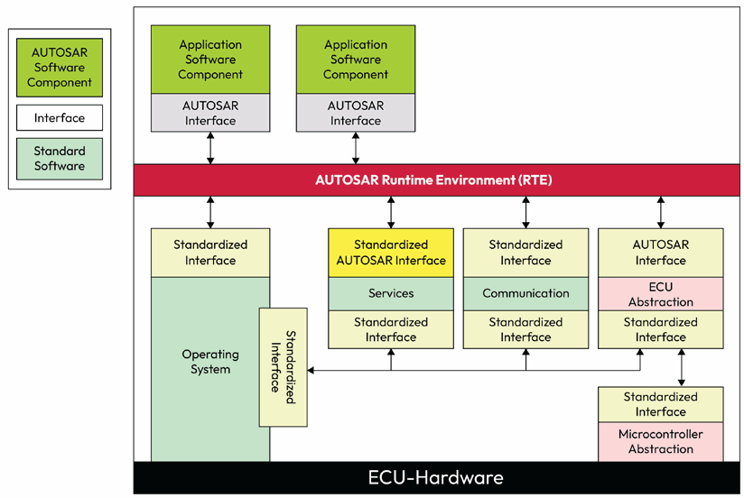

图 2.12 – AUTOSAR 分层软件架构的组件视图

---

如上图所示，AUTOSAR 提供了三种主要类型的接口：

- <strong>标准化接口（Standardized interfaces）：</strong>标准化 AUTOSAR 接口是源自 SWC 端口的通用接口。由 RTE 提供，这些接口充当 SWC 之间或 SWC 与 ECU 固件（IoHwAb 或复杂驱动）之间的通信通道。通过这些接口，SWC 可以（例如）读取输入值和写入输出值。以下接口是标准化 AUTOSAR 接口结构的一部分，可供各种 SWC 通过 `Rte_read` 和 `Rte_call` 使用：

```
Std_ReturnType Rte_Read_<portname>_<interface>(<data>)
Std_ReturnType Rte_call_<portname>_<operation>(<data>)
```

- <strong>标准化 AUTOSAR 接口（Standardized AUTOSAR interfaces）：</strong>这些接口的语法和语义由 AUTOSAR 标准预定义。这些接口被 SWC 用于访问服务层内 BSW 模块提供的 AUTOSAR 服务，如 ECUM 或 DEM。
例如，`Det_ReportError` 是所有 BSW 模块用于报告错误的接口：

```
Det_ReportError(uint16 ModuleId, uint8 InstanceId, uint8 ApiId, uint8 ErrorId);
```

- <strong>AUTOSAR 接口（AUTOSAR interfaces）：</strong>这些接口也由 AUTOSAR 联盟定义，但专门用于 ECU 内 BSW 模块之间的交互、RTE 与系统 OS 之间，或 RTE 与通信层之间：

```
Com_SendSignal(uint16 SigId,uint8* value)
StatusType ActivateTask(TaskType TaskID)
```

现在你已经清晰地理解了 AUTOSAR 各层和接口，是时候将这些知识应用到一个现实案例中了，比如电动汽车中的 BMS ECU。这个案例将以原始设备制造商（OEM）可能指定的需求形式呈现。通过理解这些需求，我们将深入了解必要的功能，并能够将不同功能关联到相应的 AUTOSAR 层，从而帮助 AUTOSAR 新手更清晰地理解各层。

以下案例将用来说明一个现实生活中的用例，帮助我们更好地理解不同 AUTOSAR 层的各种功能。需要注意的是，该案例为传达信息而进行了简化处理，不应被视为设计参考。

---

### 案例研究 – 开发 BMS ECU

BMS 负责监控和管理电动汽车中的电池组。其主要功能包括测量电池电压、电流和温度，估算荷电状态和健康状态，确保安全的充放电，并向其他 ECU 提供诊断信息。下图展示了这一工作流程：

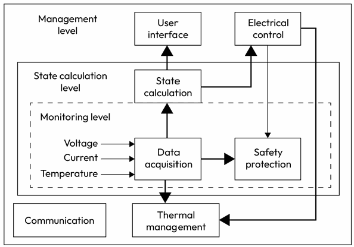

图 2.13 – BMS 框图

上图展示了一个 BMS 的拟议系统设计。以下是本案例研究背景下的 ECU 需求：

- <strong>荷电状态估算 [REQ_1]：</strong>ECU 使用基于电池电压、电流、温度和历史数据的算法估算剩余电池容量。

- <strong>电芯均衡 [REQ_2]：</strong>ECU 监控并控制单个电芯的充放电过程，以确保最佳性能并延长电池寿命。

- <strong>热管理 [REQ_3]：</strong>监控电池温度并控制冷却/加热系统，以将电池维持在最佳温度范围内。

- <strong>故障检测与保护 [REQ_4]：</strong>检测并管理故障，如过压、欠压、过流或过温，并采取适当措施。

- <strong>故障存储 [REQ_5]：</strong>故障存储在非易失性存储器（NVM）中。

- <strong>诊断服务 [REQ_6]：</strong>提供诊断功能（例如统一诊断服务 UDS），以监控 BMS 的健康状态并支持故障排除和维护活动。

---

- <strong>通信服务 [REQ_7]：</strong>使用标准化接口和协议，促进 BMS 与其他车辆系统或外部设备（例如充电站）之间的交互。

- <strong>通信 [REQ_8]：</strong>BMS 将在 CAN 上发送两条循环状态消息（Msg_A, Msg_B）。

- <strong>内存管理 [REQ_9]：</strong>处理非易失性存储器访问，如在 eFlash 存储器中读取和存储校准数据和故障码。

- <strong>OS [REQ_10]：</strong>管理 ECU 内的软件任务调度与执行、中断和资源分配。

- <strong>I/O 硬件抽象 [REQ_11]：</strong>提供访问和控制电池相关硬件组件（如 ADC、DAC 或 GPIO）及外围设备（如温度传感器、接触器或冷却系统组件）的接口。

- <strong>网络管理 [REQ_12]：</strong>管理 ECU 在车辆网络中的参与，包括启动和关闭程序、休眠/唤醒模式和错误处理。

现在让我们讨论其中一些需求将如何实现，以及它们分别属于哪些层。

### 应用层

可以在应用层范围内实现的一些需求是 REQ_1 和 REQ_2——这两个需求要求软件执行电池电芯均衡和剩余电量估算，软件将通过实现特定算法（超出本书范围）来实现这一功能，这些算法使用电池电压和电流。

### RTE

正如我们刚才讨论的，RTE 仅充当桥梁或粘合层；SWC 或 BSW 之间的所有通信都将通过 RTE 处理。

例如，假设有一个名为 BattEst 的 SWC，负责实现估算电池容量的算法并传输电量百分比。在这种情况下，应用利用 BSW 的通信服务，RTE 作为 SWC 和 BSW 服务提供者之间的中介。

### BSW – 服务层

软件所需的所有服务都通过服务层提供，例如诊断服务（REQ_6）——软件提供 BMS 健康状态，或内存服务（REQ_5）——软件需要一种机制来在非易失性存储器中存储数据。

---

### BSW – ECU 抽象层

应用程序使用的任何服务，无论是发送消息还是在非易失性存储器中存储块，都会影响 ECU 抽象层的配置，例如 REQ_5 在非易失性存储器中存储数据块。

### BSW – MCAL

在这个阶段，所有底层驱动都被配置。例如，根据 REQ_8，需要通过 CAN 进行通信；因此，必须在 MCAL 中配置 CAN 驱动以允许传输到物理 CAN。

在此时，展示一个消息发送和接收过程中各层之间交互或通信的抽象图可能会很有帮助。图 2.14 展示了从软件组件（SWCA）向 CAN 总线发送信号（Msg_A）以及由另一个软件组件（SWCB）通过不同的 AUTOSAR 层接收不同信号（Msg_B）所涉及的事件序列。

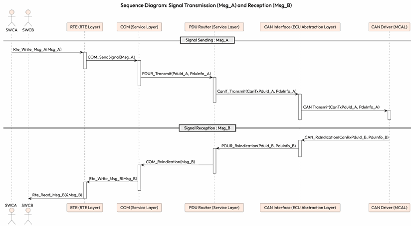

图 2.14 – AUTOSAR 各层中的通信流程

这个案例研究有助于阐明 AUTOSAR 架构，并展示其模块化、标准化方法在实际应用中的优势。通过理解各层和各种接口的角色，可以更容易地掌握 AUTOSAR 框架如何促进汽车领域中高效的软件开发和集成。这些知识在开发、集成或维护汽车软件时非常有价值。

---

### 本章小结

在本章中，我们探讨了 AUTOSAR 架构中各个层的重要性和相关性，强调了它们在汽车软件系统开发中的作用。本章获得的见解至关重要，因为它们为设计和实现符合 AUTOSAR 标准的模块化、可重用和兼容的 SWC 提供了指导。

理解每一层——如应用层、RTE、服务层、ECU 抽象层和 MCAL——对于开发人员和工程师有效地创建符合 AUTOSAR 标准的汽车系统至关重要。这种理解使他们能够高效地利用每一层提供的服务，并确保 SWC 与底层硬件之间的顺畅交互。

通过上述电池管理 ECU 的用例理解不同 AUTOSAR 层的功能，开发人员可以创建不仅模块化、可重用，而且兼容各种硬件平台的 SWC。这促进了汽车软件生态系统内的适应性和多样性。

在下一章中，我们将讨论 AUTOSAR 的方法论，包括软件和配置如何建模与共享。

### 思考题

- AUTOSAR 有哪些层？

- 针对本章讨论的案例研究，尝试将需求与它们可能实现的层进行匹配。
提示：一个需求可能与多个层匹配。

- AUTOSAR 中拥有不同层的好处是什么？

---

## 第3章 AUTOSAR 方法论与数据交换格式

在了解了 AUTOSAR 及其各个层之后，我们现在准备好深入探讨支撑这一创新方法的方法论，以及它在汽车软件开发流程中的定位——从需求工程到验证与测试。这些知识将使你能够充分发挥 AUTOSAR 框架的潜力。你不仅能够更有效地将其应用到汽车软件项目中，还能领会它在当今汽车行业中的重要意义。

在本章中，我们将通过涵盖以下主要主题来深入理解：

- AUTOSAR 方法论简介

- 理解 AUTOSAR 方法论

- 使用模板进行数据交换

- AUTOSAR 的一致性类别

### AUTOSAR 方法论简介

在本节中，我们将讨论 AUTOSAR 方法论，概述开发 AUTOSAR 系统所需的步骤或活动。AUTOSAR 方法论区别于其他方法论的一个关键特征是软件组件实现与电子控制单元（ECU）配置的实质性独立。这种分离提供了更大的灵活性和适应性优势，使开发人员能够在不同的 ECU 配置和平台之间重用软件组件，最终减少开发时间和成本。

---

# 第3章 AUTOSAR 方法论与数据交换格式

AUTOSAR Fundamentals and Applications — Hossam Soffar 著 | AI 辅助翻译

---

本章将深入探讨 AUTOSAR 方法论，重点介绍 AUTOSAR 规范中描述的典型开发工作流。我们还将了解如何使用 AUTOSAR 模板进行数据交换。这些模板在确保开发过程中不同利益相关者之间的一致性和标准化方面发挥着关键作用。

我们将在本章中讨论以下主题：

- AUTOSAR 方法论与开发工作流

- 系统配置

- ECU 配置

- 代码生成

- 使用模板进行数据交换

- AUTOSAR 一致性类别

在深入了解更多细节之前，让我们先解释一下什么是 ECU 配置。

## 什么是 ECU 配置？

AUTOSAR 中的 ECU 配置涉及设置一个 ECU 的软件和硬件资源，以满足特定的车辆功能。这个过程包括：选择哪些 AUTOSAR SWC 将部署在该 ECU 上；建立基础的 BSW 层，负责处理通信、内存和诊断；定义标准化的协议和接口，用于 ECU 与其他 ECU 以及外部系统之间的通信；管理硬件资源（如 CPU、内存和外设），以确保软件组件高效运行。这种结构化的方法确保每个 ECU 都能被量身定制，从而在车辆整体系统中有效地执行其指定功能。

虽然 AUTOSAR 针对不同的任务提供了多种方法论，但本次讨论将聚焦于最关键的环节，即根据软件和硬件描述为每个 ECU 生成可配置的可执行文件。此工作流主要分为三个部分，如下图所示：

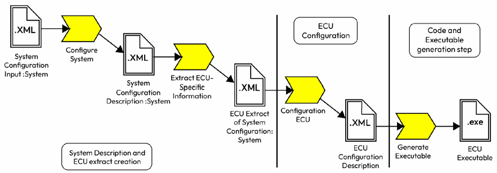

图 3.1 – AUTOSAR 工作流

让我们逐一深入了解这些部分：

- 工作流的第一部分处理基于模板的硬件、软件和系统约束描述，最终生成包含 ECU 软件映射的完整系统描述。

- 第二部分详细描述了单个 ECU 的基础软件和运行时环境（RTE）的配置。

- 第三阶段涉及生成代码并为 ECU 软件创建可执行文件。该可执行文件是编译和链接各种软件组件及基础软件对象后的产物。

---

虽然 AUTOSAR 方法论概述了开发 AUTOSAR 系统所需的基本步骤，但它并不描述一个全面的流程。例如，该方法论没有指定活动或活动序列可以重复的频率，也没有定义这些活动中涉及的角色或职责。

在继续探索 AUTOSAR 的过程中，我们现在将注意力转向系统配置。系统配置侧重于软件组件的配置及其在系统内的交互，以及它们到相应 ECU 的映射。

## 理解 AUTOSAR 方法论

AUTOSAR 方法论是一种结构化的方法，用于获取汽车系统中各个 ECU 的可执行文件。它主要由三个步骤组成：

- <strong>系统配置：</strong>此步骤涉及设置整个系统。这包括定义整体架构、ECU 之间的互连以及指定通信协议。

- <strong>ECU 配置：</strong>此步骤专注于单个 ECU。在这一步中，提取每个 ECU 相关的特定信息，并为后续操作做好准备。这些信息对于根据每个 ECU 的需求和功能定制其配置至关重要。

- <strong>代码生成：</strong>在此步骤中，生成每个 ECU 的实际可执行代码。该代码源自前面步骤中获得的配置设置和规范。它确保每个 ECU 按照其在系统中指定的功能运行。

让我们更详细地了解这些步骤。

## 系统配置

原始设备制造商（OEM）在开发 AUTOSAR 系统中扮演着关键角色。OEM 负责定义系统架构、指定需求，并监督来自不同供应商的软件组件的集成。

在 AUTOSAR 中，系统提取（System Extract）表示车辆系统的特定部分，强调某些方面或特定 ECU 的配置。它源自完整的系统描述，包含选定的有关软件组件、接口、通信通道以及组件到 ECU 映射的信息。

---

要在 AUTOSAR 系统中创建系统提取，OEM 通常执行以下步骤：

- <strong>定义系统需求：</strong>OEM 首先定义汽车系统的高层需求和功能。这可能包括性能、安全、安保和通信目标。

例如，在开发高级驾驶辅助系统（ADAS）时，OEM 设定自适应巡航控制、车道偏离警告和紧急制动等功能的需求。

- <strong>识别软件组件和接口：</strong>OEM 根据需求识别必要的软件组件及其接口。这可能涉及复用现有组件或开发新组件。

对于 ADAS，OEM 识别出传感器融合、车辆控制、用户界面等组件以及相应的接口。

- <strong>设计系统架构：</strong>OEM 设计整个系统架构，指定软件组件之间的交互方式，并将它们映射到 ECU。

OEM 确定传感器融合组件如何与车辆控制组件通信，并将这些组件映射到 ADAS 中的特定 ECU。

- <strong>开发或采购软件组件：</strong>OEM 自行开发所需的软件组件，或从供应商处采购。

对于 ADAS，OEM 可能在内部开发传感器融合组件，同时从专业供应商处采购车辆控制组件。

- <strong>创建系统提取：</strong>OEM 将软件组件、硬件拓扑和配置参数组合到系统提取中。

ADAS 的系统提取包含软件组件、ECU 映射，以及通信、传感器和执行器的配置参数。

下图展示了一个涉及多个 ECU 的系统提取示例，展示了 SWC 之间的映射以及每个 ECU 使用的通信通道：

---

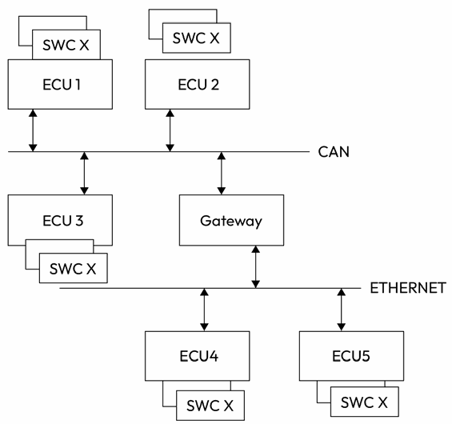

图 3.2 – 系统描述示例

在系统配置阶段，OEM 将软件功能分配到系统拓扑中的 ECU 上。虽然此时可以做出关于特定组件实现的决策，但通常不会在这个高层阶段做出这些选择。

此外，OEM 在此步骤中创建通信矩阵，详细说明 ECU 之间的通信介质、数据及相关属性，如时序、校验和等。此步骤的输出被保存为系统配置描述（System Configuration Description）。从图 3.2 中你可以看到此步骤的结果。通常，一个系统由多个 ECU 和各种通信通道组成。这些 ECU 之间的通信被建模，如果帧需要从一个通信总线网关转发到另一个通信总线，则某个 ECU 可以充当网关。

目前有许多软件工具可用于协助此过程。有了这些理解，让我们继续下一步：配置特定的 ECU。

---

## ECU 配置

在大多数情况下，ECU 由不同的供应商为特定车辆制造。因此，将从系统配置描述中提取每个 ECU 的特定信息，并交给各个供应商。这个提取物被称为 ECU 提取（ECU Extract），如下图所示：

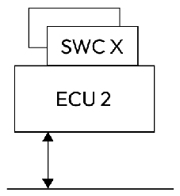

图 3.3 – 单个 ECU 提取描述

我们使用 AUTOSAR 创作工具来创建高层设计，其中包括依据前面讨论的模板（包括通信矩阵、拓扑等）生成的软件组件描述、ECU 资源描述和系统描述文件。一旦我们有了这三个组件，基于 AUTOSAR 方法论的软件开发过程大体上可以分解为两部分：应用/SWC 软件开发和 ECU 配置过程。

AUTOSAR 创作工具是旨在帮助创建、修改和可视化 AUTOSAR 系统描述、软件组件及其配置的软件应用程序。这些工具在基于 AUTOSAR 的应用程序的高效开发和管理中发挥着至关重要的作用。

在应用 SWC 开发过程中，以 SWC 描述文件为输入，该文件描述了需要开发的软件组件元素，如端口、接口和触发事件等；需要注意的是，SWC 元素将在后续章节中详细讨论。

我们为 ECU 配备实现所需的所有关键信息，包括任务调度、选择适当的 BSW 模块、配置 BSW、将可运行实体分配到任务、通信参数，以及确保系统最佳性能的各种其他配置值。输出是 ECU 配置描述（ECU Configuration Description）文件，它包含微控制器端口定义、引脚分配、时钟配置以及通信通道类型（如控制器局域网（CAN）、Ethernet 和 FlexRay），此外还包括特定的服务模块，如通信模块（COM）或特定外设，如串行外设接口（SPI）、通用异步收发器（UART）、集成电路间总线（I2C）或其他外设。

---

SWC 的开发将在与此步骤并行进行，我们将在第 4 章中进一步详细讨论。ECU 配置描述文件用于生成 RTE 和 BSW 的某些部分。这些组件随后与 SWC 一起编译，最终为单个 ECU 创建可执行文件，如下图所示：

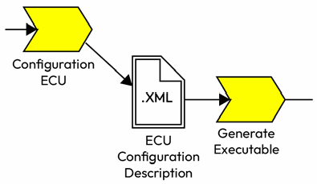

图 3.4 – 可执行文件生成过程

接下来，我们将向你介绍 AUTOSAR 中的代码生成过程。这是开发周期中至关重要的一步，它确保配置和模板能够高效、准确地转换为功能性软件。

## 代码生成

在此过程中，配置工具为应用软件生成代码模板。这些 SWC 与 BSW 层之间的交互决定了 RTE 代码的生成方式。

在 AUTOSAR 的上下文中，配置工具在软件开发过程中发挥着至关重要的作用。这些工具便于生成配置文件和代码模板，使开发人员能够定制软件组件和 BSW 模块。需要了解的是，不同的供应商提供各自的配置工具，每种工具都具有独特的功能和特性。因此，开发人员必须选择最适合其特定需求并且与其基于 AUTOSAR 的开发流程相契合的适当工具。

---

对于每个 BSW 模块，都会创建包含在 AUTOSAR 配置工具中完成的所有用户自定义配置的配置文件。还需要注意的是，这些配置包含类型子集。这些被称为配置类别（Configuration Classes），指的是在开发过程中可以设置或修改特定参数的不同阶段。这些类别决定了配置参数何时以及如何被定义，以及在软件开发过程中何时变为固定不变的。让我们来看看 AUTOSAR 中三种主要配置类别之间的区别：

- <strong>预编译时（Pre-compile time）：</strong>此配置类别的参数在编译过程开始之前设置。它们通常被硬编码或在源代码中定义为宏或常量。这些参数在编译后无法更改。

预编译时参数的一个示例用例是在开发过程中启用错误跟踪宏。

- <strong>链接时（Link time）：</strong>此配置类别的参数在编译之后、链接过程中使用。这些参数通常以目标代码文件的形式指定，并在链接过程之后变为固定——与在编译器预处理器阶段（如 `#define` 常量）建立的预编译时配置形成对比。

链接时参数的一个示例用例是使用包含 CAN 通信配置（如通道标识符）的配置结构体。

- <strong>构建后（Post-build time）：</strong>此配置类别的参数可以在整个构建过程（编译和链接）完成之后更改。构建后参数有两种替代方式：

  - <strong>可加载（Loadable）：</strong>这些参数存储在不可执行的二进制文件中，可以下载到 ECU。参数值可以在 ECU 的启动过程中更改。

  - <strong>可选（Selectable）：</strong>这些参数存储在链接到可执行文件的多个备选配置集中。配置设置可以在 ECU 启动过程中选择，并且可以在启动期间下载到 ECU。

我们已经探索了 AUTOSAR 中的三种主要配置类别：预编译时、链接时和构建后。每个类别在确定配置参数何时以及如何在软件开发过程中定义和固定方面都发挥着作用。通过理解这些类别及其含义，开发人员可以有效地管理和优化其基于 AUTOSAR 的系统的配置。

在下一节中，我们将介绍 AUTOSAR 的模板。我们还将了解软件和系统是如何被建模并在不同利益相关者之间共享的。

---

## 使用模板进行数据交换

上述 ARXML（AUTOSAR XML） 片段定义了一个名为 CanFrameExample 的 CAN 帧，长度为 8 字节。它展示了如何将 PDU 映射到 CAN 帧，起始位置为 0，采用最高有效字节在后的字节序。

AUTOSAR 模板充当 AUTOSAR 方法中使用的信息结构的正式化表示，用于定义软件组件、模块或配置参数。模板通过提供可以由开发人员根据特定应用需求实例化和定制的预定义框架，确保不同 ECU 和车辆平台之间的一致性、模块化和效率；它们确保在开发过程的不同阶段中实现统一性、标准化和顺畅的数据交换。这些模板使用统一建模语言（UML（Unified Modeling Language，统一建模语言））进行规范，并依赖 AUTOSAR UML Profile。该 Profile 引入了一系列构造型（stereotype）来表达 AUTOSAR 概念，例如 ECU 的硬件元素、软件组件、端口、数据类型或接口描述。这些构造型根据其在各类模板中的应用，被系统地排列到各个包（package）中。

所有模板都依赖 AUTOSAR UML Profile。UML Profile 中的模板包是相互关联的，如下图所示。两个包之间的连接表示一个包复用了另一个包中定义的概念：

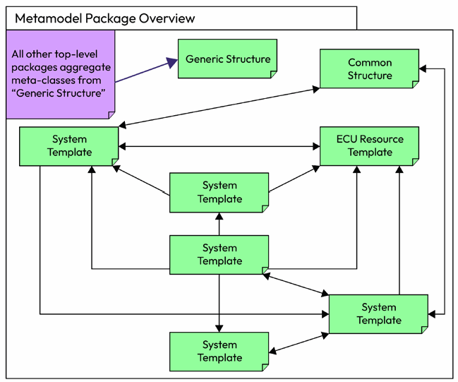

图 3.5 – AUTOSAR UML Profile

---

让我们更详细地了解上图中所示的各个组件：

- <strong>软件组件模板（Software Component Template）</strong>描述了系统的软件层面。该模板包含组件类型的通用描述，包括端口原型和端口接口。此外，它还区分了复合组件，从而形成软件组件的层次结构。

- <strong>ECU 资源模板（ECU Resource Template）</strong>概述了 ECU 的硬件资源，例如发动机控制模块（ECM）中的资源，包括物理通信介质和外设，如 ADC 和通用输入输出（GPIO）。所提供的信息对于配置 ECU 抽象层和微控制器以针对该 ECU 进行精确定制至关重要。

- <strong>基础软件模块描述模板（Basic Software Module Description Template）</strong>涉及基础软件的各个元素。它包含与基础软件模块和集群相关的所有数据。此模板包与软件组件模板之间存在关联，因为两者都详细描述了实现特性和资源使用情况。

- <strong>系统模板（System Template）</strong>充当软件组件模板和 ECU 资源模板之间的桥梁。它在系统的软件视角和 ECU 的物理布局之间建立联系。此外，该模板还允许描述与此连接相关的约束条件。

AUTOSAR 中的每个模板都遵循通用结构（Generic Structure），该结构建立了基本属性。例如，其中一个属性是模板中的每个元素都拥有一个唯一的标识符或层次组织结构；通用结构以层次化方式组织元素，其中的元素根据其在各种模板中的应用被组织到各个包中。这些包有助于将相关元素组合在一起，并在 AUTOSAR 系统内保持逻辑组织。例如，在以下两个片段中，我们展示了 CAN 帧在 AUTOSAR XML（ARXML）中的建模方式；每个帧都将在 `CanFrame` 父节点内进行描述。以下是在 ARXML 中定义 CAN 帧的示例：

```
<AR-PACKAGES>
  <AR-PACKAGE>
    <SHORT-NAME>CanFrame</SHORT-NAME>
    <ELEMENTS>
      <CAN-FRAME>
        <SHORT-NAME>CanFrameExample</SHORT-NAME>
        <FRAME-LENGTH>8</FRAME-LENGTH>
        <PDU-TO-FRAME-MAPPINGS>
          <PDU-TO-FRAME-MAPPING>
            <SHORT-NAME>Cluster_0_Status_0</SHORT-NAME>
            <PACKING-BYTE-ORDER>MOST-SIGNIFICANT-BYTE-LAST</PACKING-BYTE-ORDER>
            <PDU-REF DEST="I-SIGNAL-I-PDU">/PDU/CanFrameExample</PDU-REF>
            <START-POSITION>0</START-POSITION>
          </PDU-TO-FRAME-MAPPING>
        </PDU-TO-FRAME-MAPPINGS>
      </CAN-FRAME>
    </ELEMENTS>
  </AR-PACKAGE>
</AR-PACKAGES>
```

---

这段 ARXML 片段定义了一个名为 `CanFrameExample` 的 CAN 帧，其长度为 8 字节。它包含将 `CanFrameExample` 协议数据单元（PDU）映射到该 CAN 帧的配置，起始位置为 0，最高有效字节最后放置。该映射的标识为 `Cluster_0_Status_0`。

CAN 帧触发是描述消息如何在 ECU 之间通过 CAN 总线发送和接收的一种方式：

```
<CAN-FRAME-TRIGGERING>
  <SHORT-NAME>FT_CanFrameExample</SHORT-NAME>
  <FRAME-PORT-REFS>
    <FRAME-PORT-REF DEST="FRAME-PORT">/ECU/MyECU/CAN/FP_CanFrameExample_Rx</FRAME-PORT-REF>
  </FRAME-PORT-REFS>
  <FRAME-REF DEST="CAN-FRAME">/CanFrame/CanFrameExample_OCAN</FRAME-REF>
  <PDU-TRIGGERINGS>
    <PDU-TRIGGERING-REF-CONDITIONAL>
      <PDU-TRIGGERING-REF DEST="PDU-TRIGGERING">/Cluster/CAN/CHNL/FT_CanFrameExample</PDU-TRIGGERING-REF>
    </PDU-TRIGGERING-REF-CONDITIONAL>
  </PDU-TRIGGERINGS>
  <CAN-ADDRESSING-MODE>STANDARD</CAN-ADDRESSING-MODE>
  <CAN-FRAME-RX-BEHAVIOR>ANY</CAN-FRAME-RX-BEHAVIOR>
  <CAN-FRAME-TX-BEHAVIOR>CAN-200</CAN-FRAME-TX-BEHAVIOR>
  <IDENTIFIER>1890</IDENTIFIER>
</CAN-FRAME-TRIGGERING>
```

这段 ARXML 片段概述了 `PT_CanFrameExample` CAN 帧的触发配置，详细说明了它如何与某个 ECU 的接收（`CanFrameExample_Rx`）和发送（`CanFrameExample_oCAN`）端口关联，并引用其对应的 PDU（`PT_CanFrameExample`）。它将寻址模式设置为 `STANDARD`，定义了特定的接收和发送行为，并为该帧分配了唯一的标识符（`1809`），这决定了该 CAN 帧在消息通信过程中如何在 CAN 网络内进行交互。

在下一节中，我们将探讨 AUTOSAR 中不同类型的一致性类别，以及它们如何确保 AUTOSAR 生态系统中的兼容性和互操作性。

---

## AUTOSAR 的一致性类别

一致性类别（Conformance Classes）定义了 ECU 必须支持的最小 BSW 模块集合，才能被认为符合特定的一致性类别。通过遵循某个一致性类别，ECU 制造商可以确保其产品与其他符合 AUTOSAR 标准的系统和组件兼容。让我们列出各种一致性类别：

- <strong>一致性类别 1（CC（Conformance Class，一致性类别）1）：</strong>此类代表 AUTOSAR 支持的最基本级别，主要关注通信和基本诊断等基本功能。符合 CC1 的 ECU 通常资源有限，用于简单的应用场景。

- <strong>一致性类别 2（CC2）：</strong>符合 CC2 的 ECU 提供比 CC1 更高级的功能，例如支持复杂设备驱动、内存管理和高级诊断。CC2 适用于资源更丰富、用例更复杂的 ECU。

- <strong>一致性类别 3（CC3）：</strong>此类专为高性能 ECU 设计，具有先进的能力，例如支持多核处理器、高级调度和复杂的通信协议。CC3 通常用于高端、安全关键型应用。

- <strong>一致性类别 4（CC4）：</strong>CC4 代表 AUTOSAR 支持的最先进级别，融合了 Adaptive Platform 支持、高级网络安全以及对新通信协议的支持等功能。此类适用于需要尖端技术和功能的高度复杂 ECU。

总之，我们探讨了 AUTOSAR 的各个一致性类别，它们定义了 ECU 被认为符合标准所需的最小 BSW 模块集合。从 CC1 的基本功能到 CC4 的高级能力，这些分类确保了不同 AUTOSAR 兼容系统和组件之间的兼容性。理解了这些一致性类别后，你现在可以更好地为特定的 ECU 开发需求选择合适的一致性类别，并确保与汽车生态系统中其他组件的无缝集成。

### 本章小结

在本章中，我们探讨了 AUTOSAR 方法论，概述了开发 AUTOSAR 系统所需的一系列活动，重点关注软件组件实现与 ECU 配置的独立性。我们还讨论了数据交换格式，特别是 AUTOSAR 模板——它们是在整个开发过程中使用的信息结构的正式化表示。此外，我们深入研究了系统设计与建模过程、代码生成与配置，以及各种一致性类别，这些类别定义了 ECU 被认为符合特定一致性类别所需的最小 BSW 模块集合。

---

通过理解这些核心概念，你可以利用 AUTOSAR 方法论进行系统设计，使用 AUTOSAR 模板确保顺畅的数据交换，并遵循适当的一致性类别以实现与其他 AUTOSAR 兼容系统和组件的兼容性。

在下一章中，我们将开始探索软件组件和 RTE，作为深入了解 AUTOSAR 更多构建模块的第一步。

### 思考题

请回答以下问题，以评估你对本章的整体理解：

- 描述使用 AUTOSAR 方法论设计汽车系统所涉及的步骤。

- AUTOSAR 的一致性类别是什么？

- 讨论不同的配置类别。

---

# 第4章 使用软件组件与 RTE

AUTOSAR Fundamentals and Applications — Hossam Soffar 著 | AI 辅助翻译

---

## 理解 SWC

如第2章所述，在 AUTOSAR 标准中，SWC指的是嵌入式汽车系统中具有特定功能的封装软件单元。AUTOSAR 软件组件被设计为独立、可重用且可在车辆不同电子控制单元（ECU）之间移植。这些 SWC 由一组运行实体（即代码函数）组成，这些实体由特定事件激活或调度，并通过明确定义的接口与系统交互。

想象一辆车像一个大拼图，每个部分都需要平滑协作。在 AUTOSAR 中，SWC 就像这个拼图中的独立碎片。它们是汽车计算机系统中自包含的小部件，每个都有特定的工作任务。其中一些组件在单个 ECU 内组合，而另一些则分布在整车不同的 ECU 上。

下图展示了 SWC 之间通过 RTE 进行的交互和数据交换。请注意 SWC 位于 RTE 之上，RTE 负责管理它们之间的数据和控制交换：


图 4.1 – AUTOSAR 中的 SWC

AUTOSAR SWC 的特性如下：

- 与 AUTOSAR RTE 连接的能力至关重要。这种连接使它们能够与其他 SWC 以及 BSW 层中的 SWC 通信。这带来了多重好处，如软件重用、组件在 ECU 间改进了可移植性，以及更高效和经济的资源利用。

---

- AUTOSAR SWC 也是可扩展的。它们可以形成 AUTOSAR 组合（composition），这是一种特殊的 SWC 类型，允许将具有相似功能的 SWC 分组。这些组合作为系统抽象层，处理复杂性并增强软件应用逻辑表示设计的可扩展性。

- AUTOSAR SWC 提供了一种模块化、可扩展且高效的汽车软件开发方法。它们对复杂汽车系统的平滑运行起着至关重要的作用，其适应性和可重用性使它们成为不断发展的汽车软件架构领域中的宝贵资源。

由于组件可以无缝通信，相同的软件模块可以在不同项目和平台之间重用，减少了开发时间和工作投入。为了更好地理解 SWC，让我们看一个示例。

### 示例——节气门控制器

考虑汽车发动机管理系统中的节气门控制组件。该组件可能负责根据驾驶员加速踏板、发动机控制单元或巡航控制系统的输入来控制节气阀的位置。节气门控制 SWC 可能包含以下多个函数：

- <strong>calculateThrottlePosition()：</strong>接收加速踏板传感器的输入并计算所需的节气门位置。

- <strong>actuateThrottle()：</strong>接收所需的节气门位置并相应控制物理节气阀。

以下是这些函数在 C 代码中的简化示例：

```
void calculateThrottlePosition(AccelerationPedalPosition position) {
    // Algorithm to calculate throttle position based on pedal position
    ...
}
void actuateThrottle(ThrottlePosition position) {
    // Control signal sent to throttle actuator based on calculated position
    ...
}
```

在此示例中，输入和输出将通过 SWC 定义的接口进行传递，使其能够与其他组件（如传感器 SWC（用于加速踏板传感器输入）和执行器 SWC（用于控制节气门执行器））进行交互。图 4.2 展示了这种交互的简化示例：

---

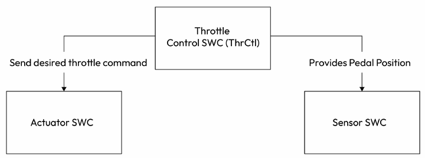

图 4.2 – 节气门控制 SWC 交互

AUTOSAR 创作工具（authoring tool）将用于创建这些组件、运行实体及其接口的描述，通常使用标准化的 XML 格式——AUTOSAR XML（ARXML），然后生成胶水代码或封装层，用于将这些组件集成到整体系统（ECU）中。我们将在后面探索 SWC 的构建块时进一步讨论。

现在我们已经理解了 SWC 能做什么。可能会产生一个问题：它如何集成到 AUTOSAR 软件中？此外，我们可能想知道这些 SWC 是如何组织的，它们如何通信，以及它们如何在模型中表示。首先，让我们深入了解各种类型的 SWC，然后弄清楚如何对它们进行建模并在 AUTOSAR 中实现。

## AUTOSAR SWC 的类型

在本节中，我们将深入探讨构成 AUTOSAR 框架基石的一系列基本 SWC，解释它们在复杂架构中的独特角色和交互：

- <strong>Application SWC：</strong>代表一个不可分割的软件组件，执行应用的部分或全部功能。限定在单个 ECU 内，该组件构成 AUTOSAR 应用的基本构建块。

- <strong>Parameter SWC：</strong>主要用于从 ECU 访问标定参数并向其他 SWC 提供标定参数。此组件不包含内部行为，通过特定类型的接口向 SWC 提供参数。

- <strong>Service SWC：</strong>提供与其他 BSW 模块直接通信的标准接口，例如来自 COMM 模块的管理通信通道状态的服务。

- <strong>复杂设备驱动（CDD）：</strong>泛化 ECU 抽象组件，可与 BSW 模块通信。如果 AUTOSAR 的 BSW 架构无法实现某个复杂应用，则可以使用复杂设备驱动组件在 AUTOSAR ECU 中实现这种非 AUTOSAR 定义的功能，从而扩展功能。

---

- <strong>NVBlock SWC：</strong>管理 ECU 内的非易失性存储器。它确保标定参数等重要数据在电源周期中持久保存，通过提供跨重启存活的数据读写接口来增强系统可靠性。

接下来，我们的下一个重点是 AUTOSAR 中设计软件组件的过程。接下来我们将熟悉 SWC 的元素。

## SWC 的元素

AUTOSAR SWC 是高度结构化的实体，包含几个基本元素，如图 4.3 所示：

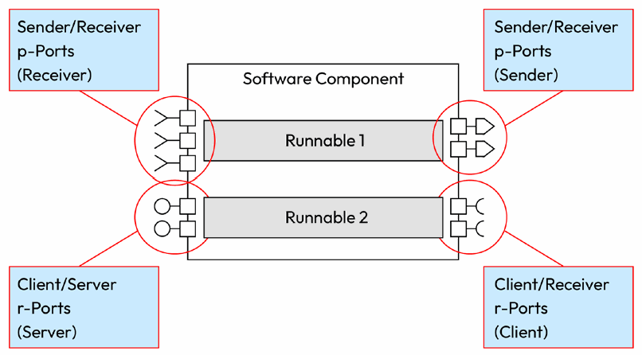

图 4.3 – SWC 的内部结构

让我们详细了解这些元素：

### 端口（Ports）

在 AUTOSAR 中，端口是 SWC 与外部世界之间的明确定义的交互点。它以标准化方式促进数据交换。AUTOSAR 中有两种类型的端口：

- <strong>提供端口（PPorts）：</strong>作为 SWC 的输出通道。数据由组件生成并通过 PPort 发送给其他 SWC 或 BSW 层。PPort 就像一个服务台，为其他组件或用户提供特定服务。例如，温度传感器 SWC 可能有一个提供端口，用于报告当前发动机温度。

---

- <strong>需求端口（RPorts）：</strong>作为 SWC 的输入通道。组件期望通过 RPort 从其他组件或 BSW 接收数据。它指定了组件需要但不自行实现的操作或函数。在服务提供者的类比中，需求端口就像请求特定服务的客户。例如，发动机控制 SWC 可能有一个需要发动机温度的需求端口，它将连接到温度传感器 SWC 的提供端口以获取此信息。

AUTOSAR 中的端口可以比作房屋中的电源插座和插头。电源插座（如 AUTOSAR 中的服务器端口）向其他组件提供数据或服务。插头（如 AUTOSAR 中的客户端端口）从服务器端口请求和接收数据或服务。插头必须与插座匹配才能取电，正如客户端端口必须正确连接到服务器端口才能访问数据或服务一样。电源插座和插头为兼容性而标准化，同样，AUTOSAR 端口也被标准化以确保来自不同制造商的组件之间的互操作性。

### 接口（Interfaces）

这些建立了 SWC 之间的通信协议，使它们能够平滑交互。AUTOSAR 提供了多种通信接口。然而，在当前的范围内，我们将重点讨论两种最常用的通信接口类别：

<strong>发送方-接收方（Sender-Receiver）接口：</strong>这是一种通信模型，其中一个 SWC（发送方）将数据发送给一个或多个 SWC（接收方）。这种通信是单向的，意味着数据仅从发送方流向接收方。其表示方式如下：

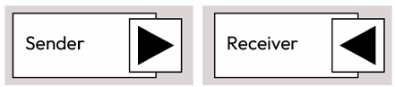

图 4.4 – 发送方-接收方接口符号

考虑如图 4.5 所示的示例，其中车辆控制系统中有三个 SWC：

- <strong>速度传感器 SWC（发送方）：</strong>负责检测和记录车辆当前速度。测得的速度数据是系统中其他组件出于不同目的所需的关键信息。速度传感器 SWC（发送方）通过发送方-接收方接口将速度数据发送给速度显示 SWC 和巡航控制 SWC（接收方）。

- <strong>速度显示 SWC（接收方）：</strong>速度显示 SWC 使用这些数据更新车辆仪表盘上的速度表读数，使驾驶员能够看到车辆当前速度。

---

- <strong>巡航控制 SWC（接收方）：</strong>与此同时，巡航控制 SWC 使用这些数据根据驾驶员的设置维持或调整车速。例如，如果车辆速度低于设定速度，巡航控制 SWC 可能指示发动机控制系统增加加速。

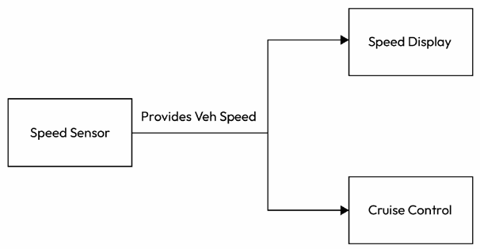

图 4.5 – 发送方-接收方示例

在探索了发送方-接收方接口之后，让我们来探讨 AUTOSAR 中的客户端-服务器通信模型：

<strong>客户端-服务器（Client-Server）接口：</strong>它基于请求-响应模型促进 SWC 之间的通信。在此模型中，一个 SWC（客户端）向另一个 SWC（服务器）请求特定服务，然后服务器通过执行该服务并向客户端发回响应来作出回应。这是一种双向接口，因为通信在两个方向上进行——从客户端到服务器以及从服务器返回到客户端。图 4.6 展示了客户端-服务器接口在 AUTOSAR 模型中的表示方式：


图 4.6 – 客户端-服务器接口符号

例如，让我们考虑一个车辆控制系统，其中包含两个 SWC：

- Climate Control SWC（客户端）

- Air Conditioning System SWC（服务器）

Climate Control SWC 管理车辆内部气候，包括温度、湿度和气流。为此，它与车辆中的其他系统通信，在本例中为 Air Conditioning System SWC。

---

以下是在此上下文中客户端-服务器接口的工作方式：

- <strong>用户输入：</strong>驾驶员在气候控制面板上调整期望温度。

- <strong>气候分析：</strong>Climate Control SWC 接收用户输入和传感器数据。根据期望温度与当前温度（以及可能的湿度）之间的差异，Climate Control SWC 确定必要的调整。

- <strong>客户端请求：</strong>Climate Control SWC 通过其 RPort 发送请求，调用 Air Conditioning System SWC（服务器）上的特定操作。该操作可以命名为 `SetTargetTemperature`，并包含期望温度值等参数。

- <strong>服务器操作：</strong>Air Conditioning System SWC 接收请求并使用提供的参数执行 `SetTargetTemperature` 函数。

- <strong>AC 系统控制：</strong>基于接收到的目标温度，Air Conditioning System SWC 激活各种执行器（如压缩机和风扇）以调整气流并达到期望温度。

在此示例中，AUTOSAR 框架内的客户端-服务器接口展示了不同 SWC 如何清晰高效地进行交互。这使系统能够精确响应外部刺激并执行所需功能，确保车辆内的协调性能。

AUTOSAR 中还使用其他类型的接口，如下图所示：

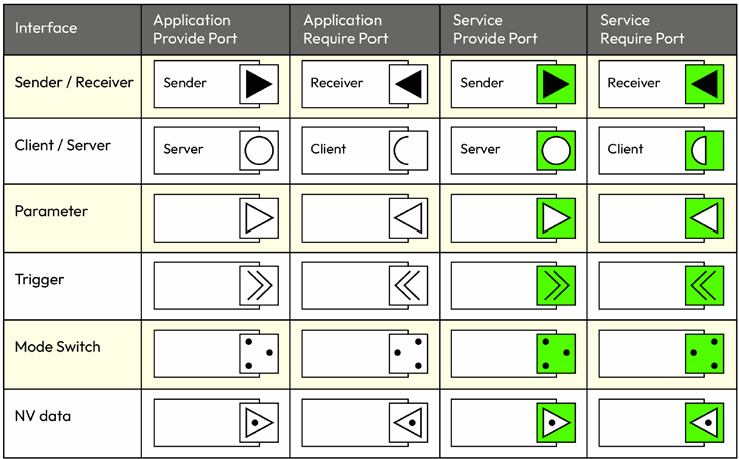

图 4.7 – AUTOSAR 接口列表

---

AUTOSAR 中的接口可以比作以太网线或电话线，承载特定数据；而端口可以看作连接到这些线路的插头，实现组件之间的数据和服务交换。

### 运行实体（Runnable Entities）

这些封装了软件组件需要执行的独立功能。每个运行实体对应组件的一个特定任务或操作，如处理输入、计算输出、管理内部数据或执行特定算法。我们可以认为运行实体就是代码函数的实现。

### 内部行为（Internal Behavior）

AUTOSAR SWC 的内部行为作为其内部运作的蓝图，详细描述了称为运行实体的基本构建块、数据访问（定义运行实体如何通过端口和接口消费或使用数据）以及触发机制（根据数据变化、基于时间的事件或事件驱动触发器启动运行实体），从而全面展现了 SWC 内部如何运作。

这些元素共同确保 AUTOSAR SWC 是可扩展、可重用且可维护的实体。

现在你已经掌握了 SWC 的基本概念，以及它们的不同类型和元素。此外，你还了解到 SWC 本质上是响应事件而激活的不同函数（运行实体）的集合。接下来，让我们探索可以在这些 SWC 中使用的各种数据类型。

## 探索 AUTOSAR 数据类型

AUTOSAR 标准概述了一种处理 AUTOSAR 数据类型的方法，其中基础数据类型与应用数据类型和实现数据类型相关联。这种方法允许区分应用层面的物理属性（如物理值范围、数据结构和物理含义）与实现层面的属性（如存储整数的最小值和最大值以及原始类型规范，如整数、布尔或实数）。

在处理 SWC 时理解这种区别至关重要，因为它确保数据不仅在功能上正确，而且在技术上也是健全的。这就像确保拼图碎片完美契合，无论是在预期用途还是技术兼容性方面。

以下简要说明每种数据类型代表的含义：

- <strong>应用数据类型（Application Data Types）：</strong>在 AUTOSAR 中，这些以平台无关的方式定义，意味着它们不绑定到特定的编程语言或硬件平台。它们捕获应用领域中数据的物理属性、语义和行为。这包括有效值范围、测量单位、数据结构（如记录或数组）以及任何相关的语义约束等信息。

---

应用数据类型的目的是在 AUTOSAR 系统中提供标准化且可移植的数据表示。通过将应用级属性与实现级细节分离，应用数据类型使 SWC 能够独立于特定硬件或软件平台进行开发。这促进了 AUTOSAR 生态系统内的模块化、可重用性和互操作性。

- <strong>实现数据类型（Implementation Data Types）：</strong>在 AUTOSAR 中，这些与底层编程语言和硬件架构紧密相关。它们用于生成将在目标平台上执行的实际代码，考虑到内存分配、位排序和对齐需求等方面。实现数据类型的示例包括：
  - <strong>uint32：</strong>表示 32 位无符号整数，通常用于存储和操作范围在 0 到 4,294,967,295 的非负整数值。
  - <strong>float32：</strong>表示 32 位单精度浮点数，用于执行具有一定精度的小数值计算。这些实现数据类型是定义 SWC 变量、结构和数组的构建块。它们提供必要的细节和特异性，以确保与目标硬件和软件平台的兼容性和高效执行。

- <strong>基础类型（Base Types）：</strong>在编程中，基础数据类型（也称为原始数据类型）是编程语言提供的基本数据类型。基础数据类型不由其他数据类型组合而成，代表计算机硬件可以直接操作的基本值。基础数据类型包含数据类型特定于硬件的特征，如其大小和编码。它们作为构建实现数据类型的基础。多个实现数据类型可以引用单一基础类型。

在下图中，我们可以看到数据类型如何关联。例如，在应用层面有一个名为 `adt_VehSpeed` 的数据类型，值得注意的是该数据类型的最大值设定为 212。这说明了 AUTOSAR 中的应用数据类型如何携带对定义数据如何在 SWC 中使用和处理至关重要的特定属性和约束：

---

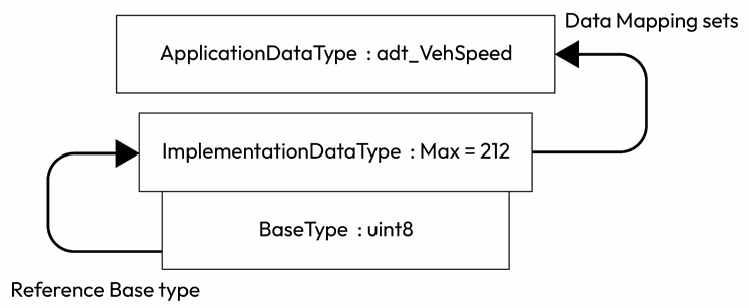

图 4.8 – 数据类型及其关系

应用数据类型就像标签，告诉软件如何处理特定信息。它们定义诸如有效值范围、复杂数据的结构以及数据在应用上下文中的含义。以 `adt_VehSpeed` 为例，它似乎与车辆速度相关，了解其最大值对于确保软件组件在处理此类数据时正确运行至关重要。

在下一节中，我们将探讨如何对 SWC 进行建模。

## 建模 SWC

称为创作工具（authoring tools）的专用软件应用程序简化了 SWC 和汽车软件框架其他方面的创建和构建。这些工具支持工程师和开发人员塑造、定制和监督各种 AUTOSAR 元素，包括 SWC 和通信接口。由于 Vector DaVinci Configurator 和 SystemDesk 等工具不免费提供，让我们转而探索 ARXML 输出。这将使我们对使用这些工具时可以期待什么有宝贵的了解。

### 什么是 AUTOSAR 创作工具？

AUTOSAR 创作工具是专用的软件应用程序，旨在解释、管理和创建 AUTOSAR 描述，这些描述是 SWC 功能和定义的组成部分。这些描述突出显示了 SWC 的功能、系统需求、资源需求、实现细节和系统约束，以及 ECU 资源和配置的详细信息。

SWC 由两个主要部分组成：详细说明其基础设施设置的全面描述，以及包含其功能的实现（通常用 C 代码编写）。在创建 SWC 之前，必须定义其组件类型。此定义概述了其固定特性，如端口名称、通信特性、接口类型及其特定属性，以及 SWC 的行为。

---

AUTOSAR 元素以标准化的 XML 文件格式（ARXML 格式）相互交互，该格式可能根据 AUTOSAR 发布版本略有不同。因此，AUTOSAR 创作工具必须能够根据 ARXML Schema 版本解释、创建或修改 ARXML 描述。

让我们将其作为建模 SWC 的练习。我们将描述设计一个名为 `TemperatureHandler` 的 AUTOSAR 软件组件的过程，该组件处理温度数据。在此示例中，它使用发送方-接收方接口传播温度数据，并使用客户端-服务器接口从服务器（提供者）查询温度值（操作）。ARXML 文件中该软件组件的定义如下：

```
<AUTOSAR xmlns="http://autosar.org/schema/r4.0" xmlns:xsi="http://www.w3.org/2001/XMLSchema-instance">
  <AR-PACKAGES>
    <AR-PACKAGE>
      <SHORT-NAME>TemperatureControlPackage</SHORT-NAME>
      <ELEMENTS>
        <SW-COMPONENT-PROTOTYPE>
          <SHORT-NAME>TemperatureHandler</SHORT-NAME>
          <PORTS>
            <P-PORT-PROTOTYPE SHORT-NAME="TempOutputPort">
              <PROVIDED-INTERFACE-TREF DEST="SENDER-RECEIVER-INTERFACE">/TemperatureOutputInterface</PROVIDED-INTERFACE-TREF>
            </P-PORT-PROTOTYPE>
            <R-PORT-PROTOTYPE SHORT-NAME="TempInputPort">
              <REQUIRED-INTERFACE-TREF DEST="CLIENT-SERVER-INTERFACE">/TemperatureSetInterface</REQUIRED-INTERFACE-TREF>
            </R-PORT-PROTOTYPE>
          </PORTS>
        </SW-COMPONENT-PROTOTYPE>
        <INTERNAL-BEHAVIORS>
          <SWC-INTERNAL-BEHAVIOR>
            <RUNNABLES>
              <RUNNABLE-ENTITY>
                <SHORT-NAME>TemperatureHandler_MainFunction</SHORT-NAME>
              </RUNNABLE-ENTITY>
            </RUNNABLES>
          </SWC-INTERNAL-BEHAVIOR>
        </INTERNAL-BEHAVIORS>
      </ELEMENTS>
    </AR-PACKAGE>
  </AR-PACKAGES>
</AUTOSAR>
```

---

在上述代码片段中，`TemperatureHandler` 软件组件已定义了两个端口。发送方-接收方端口命名为 `TempOutputPort`，客户端-服务器端口命名为 `TempInputPort`。

该软件组件的代码可能如下所示：

```
# include "Rte_TemperatureHandler.h"
float currentTemperature = 0.0;
void TemperatureHandler_MainFunction(void)
{
    Rte_ResultType res = Rte_Call_TempInputPort_GetTemperature(¤tTemperature, &isupdated);
    if(isupdated == TRUE) {
        /* Propagate the new temperature */
        Rte_Write_TempOutputPort_Temperature(¤tTemperature);
    }
}
```

在此代码中，有一个周期性运行的主函数（`TemperatureHandler_MainFunction`）。它检查是否有新的温度被设置。如果有，则更新温度并传播新的温度数据。

以下片段是包含 API 定义的生成头文件：

```
# include "Rte_Type.h"
/* RTE API prototypes */
Std_ReturnType Rte_Call_TempInputPort_GetTemperature(float* temperature, boolean *isupdated);
Std_ReturnType Rte_Write_TempOutputPort_Temperature(const float* temperature);
```

在这段 RTE 代码中，你可以看到软件组件使用的 RTE API 函数原型。`Rte_Call_TempInputPort_GetTemperature` 函数用于检查是否有新的温度值被更新。`isupdated` 标志表示新的温度值已被更新，而 `Rte_Write_TempOutputPort_Temperature` 用于将新的温度数据传播给其他使用者。

请注意，在实际应用中该过程会更加复杂，并涉及额外的步骤。代码和 ARXML 片段为说明目的而做了极大的简化，仅展示端口定义部分。代码设计仅用于展示建模过程如何生成代码。

---

至此，我们对 SWC 的设计和实现如何工作有了更清晰的认识。现在让我们来研究不同 SWC 之间如何交互。

## SWC 之间的通信

虚拟功能总线（VFB）实现 SWC 之间的通信。它提供了一个抽象层，将应用程序与基础设施隔离开来。在运行时，VFB 通常由 RTE 体现，为 AUTOSAR 系统中的每个 ECU 单独生成。VFB 内的通信通过专用端口进行，需要将应用软件的通信接口映射到这些端口。VFB 处理单个 ECU 内部以及多个 ECU 之间的通信，实现跨系统的无缝数据和信息交换：

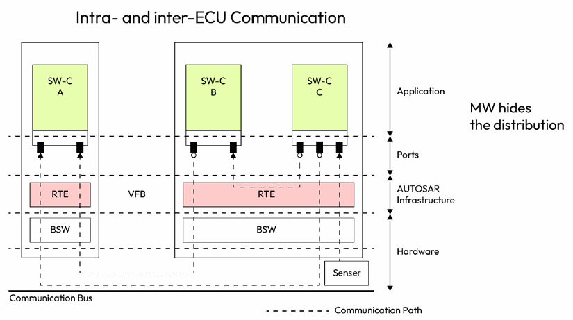

图 4.9 – ECU 间/ECU 内通信

如上图所示，SWC 之间的通信可以通过两种方式进行：ECU 间（inter-ECU）和 ECU 内（intra-ECU）。两种类型的通信都通过 AUTOSAR RTE 进行管理。让我们仔细看看：

- <strong>ECU 间通信，</strong>如 ECU I 与 ECU II 之间的通信，通过 RTE 及其下方经过 BSW 模块进行。BSW 模块处理各种功能，包括内存交互、诊断和（如有必要的）通信服务，以促进 ECU 间通信。

---

- <strong>ECU 内通信</strong>指的是单个 ECU 内部的通信，如 SWC B 与 SWC C 之间。ECU 内通信完全通过 RTE 处理。图中显示映射到单个 ECU 的 SWC 使用 ECU 内通信方法。

应用层（Application SWC）通过 RTE 与较低层以及彼此之间进行通信。每当一个 SWC 需要服务时，RTE 将这些请求映射到相应的 BSW 服务提供者。

现在你理解了 SWC 通信如何工作，重要的是要了解一种称为组合（composition）的 SWC 分组方式，它有助于管理复杂性、逻辑组织系统并增强可扩展性。

## 组合简介

SWC 和组合是 AUTOSAR 架构中的重要构造，各自服务于独特的目的。它们提供不同级别的抽象和组织方法来处理汽车软件的复杂生态系统。

我们在本章前面已经探讨了 SWC；现在来理解组合。组合是一种特殊类型的 SWC，本身不包含任何实现。相反，它们作为容器来聚合相关的 SWC，有助于管理复杂性和构建更大的系统。

例如，你可能有一个 Engine System（发动机系统） 组合，将 Engine Control（发动机控制）、Fuel Sensor（燃油传感器）、Temperature Sensor（温度传感器） 和 Throttle Position（节气门位置） SWC 分组在一起。组合本身不执行任何功能，但聚合了这些相关组件，提高了整体系统的可管理性。创建组合具有以下明显优势：

- <strong>管理复杂性：</strong>随着系统中 SWC 数量的增长，管理它们可能变得越来越复杂。组合提供了一种将相关 SWC 分组在一起的方法，简化了架构。

- <strong>逻辑组织：</strong>组合通过将相关功能分组来帮助逻辑组织系统，增强系统结构和功能的可理解性。

- <strong>可扩展性：</strong>随着系统扩展或新功能的添加，新的 SWC 可以通过添加到适当的组合中轻松集成。

总之，SWC 和组合的引入对于管理复杂性和提高汽车软件系统的开发效率具有重要意义。现在我们已经涵盖了 SWC 及其组合，是时候探索如何通过端口在这些实体之间传递信息了。这强调了理解各种连接器类型的重要性，接下来我们将探讨这一点。

---

## 连接器类型

连接器作为 SWC 或软件组合的 PPort 和 RPort 之间数据流的表示。它们建立了数据交换和协调所需的链接。特别是，Assembly 连接器和 Delegation 连接器是 AUTOSAR 架构中的基本组件，在实现 SWC 之间的通信和管理信息流方面发挥着关键作用。让我们详细了解：

- <strong>Assembly 连接器：</strong>Assembly 连接器在一个 SWC 的提供接口与另一个 SWC 的需求接口之间建立直接链接。这种连接使连接组件之间能够进行无缝通信和信息交换。
例如，考虑一个涉及车辆巡航控制系统的示例。该系统包含两个 SWC：Cruise Control Manager（巡航控制管理器） 和 Throttle Controller（节气门控制器）。Cruise Control Manager SWC 提供一个输出期望速度的提供接口，而 Throttle Controller SWC 需要此期望速度信息来控制节气门。为了在这两个组件之间建立通信，使用了一个 Assembly 连接器。它将 Cruise Control Manager SWC 的提供接口连接到 Throttle Controller SWC 的需求接口，使前者能够直接将期望速度信息传输给后者。这种连接确保了巡航控制系统内的有效协调和控制。

- <strong>Delegation 连接器：</strong>Delegation 连接器在组合内部使用，用于在内部 SWC 接口与组合本身的接口之间建立连接。它使组合能够将需求或提供接口委托给其内部组件之一。
扩展前面的示例，让我们引入一个名为 Vehicle Control System（车辆控制系统） 的组合，它包含 Cruise Control Manager 和 Throttle Controller SWC。在此场景中，我们可能希望 Vehicle Control System 组合向外部环境提供一个提供当前速度信息的接口。为实现这一点，我们将使用 Delegation 连接器将负责输出当前速度的 Vehicle Control System 接口连接到负责提供此信息的 Cruise Control Manager SWC 的接口。Delegation 连接器使 Vehicle Control System 组合能够将提供当前速度接口的任务委托给 Cruise Control Manager SWC，从而可以通过组合接口访问此功能。

---

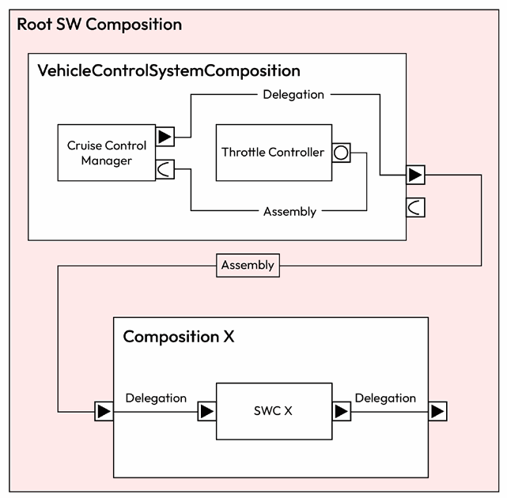

图 4.10 – 组合与 SWC

Assembly 连接器和 Delegation 连接器之间的一些主要区别如下：

- Assembly 连接器连接提供端口和接收端口。Delegation 连接器连接相同类型的端口——提供端口到提供端口，或接收端口到接收端口。

- Assembly 连接器促进数据或信号在连接的 SWC 之间直接流动。相比之下，Delegation 连接器旨在抽象内部 SWC 的功能并将其作为组合接口的一部分公开。它允许组合中介或提供特定功能，将实现细节委托给内部组件。

在观察了 SWC 之间的各种通信类型后，现在有必要更深入地探讨 RTE 层的功能和意义。

---

## 理解 RTE 的重要性

RTE 和 VFB 的协作努力使底层 BSW 层得以高效利用，将 SWC 与特定实现解耦。这种分离培养了灵活性和可移植性，使 SWC 能够无缝集成到不同的汽车系统中，同时受益于标准化的 AUTOSAR 框架。

图 4.11 展示了 RTE 如何作为应用层和 BSW 层之间的中间件：

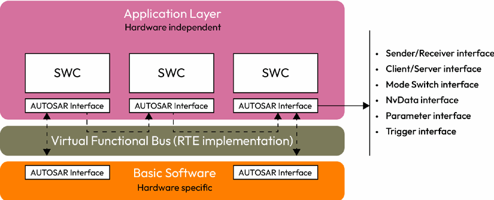

图 4.11 – RTE 作为中间层

RTE 层的主要特性如下：

- <strong>RTE 作为中间件：</strong>RTE 可以视为一种为 SWC 提供标准化接口的中间件形式。它抽象了低级操作的复杂性，如数据交换机制、任务调度和网络管理，为应用层呈现简化的接口。这使得应用开发人员能够专注于核心业务逻辑，同时最大限度地减少对底层硬件或系统级任务的担忧。

- <strong>通信管理：</strong>RTE 处理 ECU 间（不同 ECU 之间）和 ECU 内（同一 ECU 内部）的通信。它高效地管理信息在发送方和接收方组件之间的路由，无论它们位于同一还是不同的 ECU 内。

- <strong>数据映射和转换：</strong>RTE 负责必要的数据映射和转换。当数据在组件之间交换时，通常需要从一种格式转换为另一种格式。这可能涉及更改数据类型或编码方案。

---

- <strong>安全与安保：</strong>由于 RTE 处于中心角色，它对维护系统完整性至关重要。它管理访问权限，确保只有授权的组件可以彼此通信。此外，RTE 协助识别或减轻特定故障，如时序错误和通信失败。它使用错误处理和监控等机制来检测异常，并纠正它们或将系统置于安全状态。

- <strong>SWC–BSW 交互：</strong>RTE 桥接应用层（SWC）和 BSW 层之间的鸿沟。SWC 通过 RTE 提供的标准化 API 与 BSW 模块（如 OS 和通信服务）进行交互。

- <strong>事件处理：</strong>RTE 管理 SWC 功能的执行。它可以基于预配置的事件（如接收数据或信号）触发 SWC 的特定部分（运行实体）。这确保了任务的高效执行。

总体而言，RTE 是 AUTOSAR 架构中的关键组件，执行对应用功能以及系统和软件设计效率至关重要的基本操作。这为理解 RTE 层如何在系统中实例化奠定了基础。本质上，RTE 作为绑定层，确保 AUTOSAR 框架内各个 SWC 之间的无缝通信和交互。

在掌握了 RTE 的基本操作后，下一个问题是这一层是如何产生的。

## RTE 的生成

在 AUTOSAR 系统中创建 RTE 是一个结构化的过程，将软件架构转换为 ECU 的功能框架。以下是其运作方式的一般概述，包括一个例子以及一些关键输出文件的详细信息。

RTE 的生成利用各种工具和输入文件，将 AUTOSAR VFB 规范转换为在 ECU 上运行的操作代码。此过程确保所有 SWC 能够仅通过 AUTOSAR 定义的接口彼此交互以及与操作系统（OS）和通信服务等基础软件模块交互。

例如，RTE 生成的输入如下：

- <strong>SWC 描述：</strong>包括 SWC 的端口（数据接口）、接口（如客户端-服务器的通信机制）、运行实体（功能单元）和事件（执行触发器）的信息。

- <strong>ECU 配置：</strong>详细说明目标 ECU 上可用的 BSW 模块，如 OS、通信栈以及 BSW 提供的任何服务。

- <strong>工具链：</strong>指用于 RTE 生成的软件工具。常用选项包括来自 AUTOSAR 或第三方供应商的工具，如 Vector DaVinci Configurator。

---

<strong>RTE 的非重用特性：</strong>由于其配置特定性，RTE 不能在不同 ECU 或项目之间重用。如果 SWC 部署或通信模式发生变化，RTE 需要重新生成以反映这些变化。

### RTE 生成的阶段

AUTOSAR 中 RTE 的生成是一个两阶段过程，将 SWC 的高层配置转换为管理目标 ECU 上通信和执行的特定代码。这些阶段共同作用，确保为你的系统生成量身定制的 RTE：

- <strong>RTE 契约阶段：</strong>在此初始阶段，首先定义 SWC 与 RTE 之间的交互。此阶段可用的关于组件能力和通信需求的信息有限。此阶段的主要输出是应用头文件，它在 SWC 和 RTE 之间建立了一个"契约"。该契约指定了组件将如何与 RTE 交互，并概述了必要的接口和数据类型。

- <strong>RTE 生成阶段：</strong>在契约阶段之后，RTE 生成阶段在所有关于 SWC、它们在 ECU 上的部署以及它们的通信链接的相关信息最终确定后开始。在此阶段，生成实际的 RTE 代码。此代码集成了所有指定的交互，并确保跨 SWC 以及 SWC 与 BSW 模块之间的通信遵循定义的 AUTOSAR 标准。

RTE 不是手工编写的，而是根据项目的特定配置自动生成的。以下是处理此过程的工具介绍。

### RTE 生成工具

使用各种专用工具来支持 RTE 生成过程。这些工具对于配置、集成和生成 SWC 及 RTE 至关重要。它们协助建立映射、定义配置，并最终生成将在 ECU 中实现的 RTE 代码。以下是工具链选项：

- Vector DaVinci Configurator
- ETAS RTA-RTE
- EB tresos
- KPIT K-SAR

所有这些工具都是强大的 RTE 生成器，以 ARXML 文件为输入并生成 RTE 代码，确保生成的代码符合 AUTOSAR 标准。

---

### 选择正确的工具

最佳工具的选择取决于你的具体需求和偏好。以下是一些需要考虑的因素：

- <strong>项目需求：</strong>某些工具可能针对特定的 ECU 架构，或为复杂的通信场景提供高级功能

- <strong>供应商支持：</strong>考虑工具供应商提供的支持和培训水平

- <strong>与现有工作流程的集成：</strong>如果你已经在使用其他开发工具，请确保与所选的 RTE 生成工具兼容且平滑集成

- <strong>成本和许可：</strong>AUTOSAR 和第三方工具可能具有不同的许可模式和定价结构

选择好合适的工具后，现在让我们回顾一下 RTE 输出将如何生成。请注意，所有供应商将生成类似的文件，因为生成的文件结构和内容主要由 AUTOSAR 标准定义。尽管在实现上可能存在细微差异，但这些文件的相似性大于差异性。

### RTE 生成的输出

RTE 生成过程的输出包括几个关键文件，这些文件对于软件在 ECU 内正确运行至关重要：

- <strong>Rte.c：</strong>包含 RTE 的实现代码，包括必要的函数定义、事件处理和数据转换。

- <strong>Rte.h：</strong>设置不需要为每个 ECU 生成的固定元素，因此不会被 RTE 生成器软件重复生成。然而，此文件可以根据我们的应用需求进行必要的自定义。`Std_Types.h` 文件包含在此文件中。

- <strong>Rte_<swc_name>.h：</strong>此文件是为每个 SWC 生成的头文件，特定于该 SWC。它定义了 SWC 与 RTE 之间的接口，促进通信和服务访问。此文件包含了相关 SWC 中使用的 RTE API 函数原型、数据结构和运行实体的函数原型。

- <strong>Rte_Type.h：</strong>此文件填充了基于 SWC 设置过程中配置的实现数据类型的 RTE 特定类型声明。它还包含对 RTE API 有用的 AUTOSAR 数据类型。`Rte.h` 文件包含在此文件中。

- <strong>Rte_<swc_name>_Type.h：</strong>此文件通常称为应用类型头文件，包含与应用相关的常量，如 SWC 中使用的范围值或枚举值。SWC 名称始终包含在文件名中作为分隔符。`Rte_Type.h` 文件包含在此文件中。

---

根据项目的具体需求和配置，可能还会生成其他文件，如 RTE 配置文件或特定 SWC 或模块的额外头文件。

图 4.12 展示了 RTE 生成步骤与 SWC 和 RTE 生成器软件的关系：

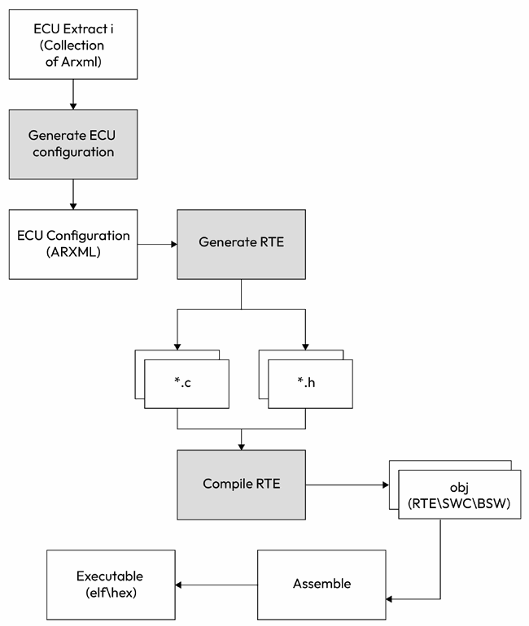

图 4.12 – RTE 生成输出

以下是此过程的概述：

- <strong>提取 ECU 特定信息：</strong>过程：从系统配置描述中提取 ECU 特定信息。输出：此信息用于生成单个 ECU 配置。

---

- <strong>生成 ECU 配置：</strong>过程：基于提取的信息生成 ECU 配置值。输出：ECU 配置值存储在 ARXML 文件中。

- <strong>生成 RTE：</strong>过程：从 ECU 配置值生成 RTE。输出：此步骤产生 RTE 代码文件（.c 和 .h）。

- <strong>编译 RTE：</strong>过程：编译生成的 RTE 代码。输出：RTE 目标文件（.obj）被编译。

- <strong>编译 SWC 和 BSW：</strong>过程：编译 SWC 和 BSW。输出：SWC 目标文件和编译后的 BSW 目标文件（.obj）被编译。

- <strong>生成可执行文件：</strong>过程：将编译后的 RTE、SWC 和 BSW 目标文件链接在一起以生成最终的可执行文件。输出：ECU 可执行文件（.elf/.hex/.bin 等）。

本章到此结束，在此我们尝试揭示了 SWC 与 RTE 之间复杂的关系。需要指出的是，由于这一主题非常广泛，超出了入门书籍的范围，我们无法涵盖所有复杂的细节。至此，我希望你已经理解了什么是 SWC、它们如何在 ECU 中集成、它们在组合中的相互作用，以及端口的重要性以及这些组件如何连接的方法。

---

### 本章小结

本章深入 AUTOSAR SWC 的世界及其在 AUTOSAR 框架中的关键角色。我们探索了 SWC 的结构、功能和关键组件，对驱动汽车 ECU 的元素建立了坚实基础。SWC 被介绍为封装、可重用的单元，专门执行 ECU 内特定功能。我们还深入理解了各种 SWC 类型，如 Application SWC 和复杂设备驱动 SWC。

我们的探索揭示了 SWC 如何使用端口进行通信和交互，实现服务和数据的顺畅交换。我们进一步研究了如何通过运行实体及其触发条件在组件内组织特定任务和操作。

此外，我们理解了 RTE 的重要角色及其特性，突出了它与 VFB 的关键连接。通过本章介绍的基本 SWC 构建块——端口、接口和内部行为——开发人员具备了概念化复杂系统的能力。

在下一章中，我们将探索事件和接口的设计与实现细节。我们将探讨 ARXML 模型的结构并研究这些接口的内部特征，为理解它们在汽车软件架构中的角色和功能提供更深层次的认识。

### 思考题

- 什么是软件组件？

- SWC 如何在 AUTOSAR 中建模？

- 内部行为描述了什么？

- 讨论 RTE 的功能和特性。

- 发送方-接收方接口和客户端-服务器接口有什么区别？

- 端口在 AUTOSAR 中意味着什么？

- 描述 RTE 的生成过程以及需要哪些输入。

---

## 第5章 设计与实现事件和接口

事件和接口的相互作用构成了系统通信和同步的主干。在本章中，我们旨在更深入地探讨软件组件（SWC）如何在汽车软件的构建块中封装多样功能，并利用事件和接口建立通信通道。基于第4章讨论的基础，我们将探索 SWC 内部通信的基本通道：端口、接口和事件。我们将揭示它们如何运作，研究它们的各种类型，以及它们在确保无缝数据流方面的作用，全面洞察它们的角色和功能。通过此过程，你将更深入地理解实现软件系统中高效可靠通信的机制。

我们将涵盖以下主要主题：

- 通信模型简介
- 理解 AUTOSAR 中的事件和接口

---

# 第5章 设计与实现事件和接口

AUTOSAR Fundamentals and Applications — Hossam Soffar 著 | AI 辅助翻译

---

## 信息流说明

让我们考虑一个简单的嵌入式示例。设想 ECU 中有一个非常简单的温度监控组件（Temperature Monitoring Component（温度监控组件））。该系统从传感器读取温度，处理数据，然后通过向信息娱乐 ECU 发送 CAN 消息将温度显示在车辆仪表盘上。

为了将连续变化的模拟信号转换为软件可以理解的格式，嵌入式设备会使用模数转换器（ADC，Analog-to-Digital Converter）。ADC 周期性地将信号转换为数字值，并将其提供给用户，例如另一个软件模块。

图 5.1 从抽象视图简要展示了这样一个系统的外观：

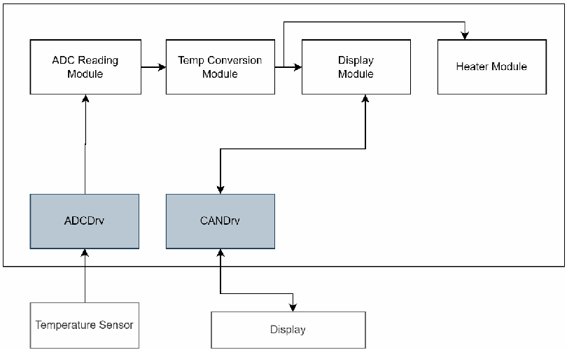

图 5.1 – 温度传感器示例

抽象化后的 ECU 软件可能利用 ADC 外设来获取信号值（温度）。这个过程很可能由 ADC 读取软件模块处理。ADC 值需要进行滤波处理，滤波后的值将转发给温度转换软件模块（Temperature Conversion SW Module（温度转换软件模块））。这个特定的软件模块负责将滤波后的 ADC 值转换为物理温度值，最终呈现在显示模块上。

---

让我们熟悉各个软件模块及其角色：

- <strong>ADC 读取模块（ADC Reading Module（ADC读取模块））：</strong>读取 ADC 值，进行转换，并将其提供给温度转换 SWC。以下代码片段展示了在 AUTOSAR 环境之外如何实现这样的系统。它包含一个 `analog_to_digital` 函数，通过读取特定的 ADC 通道将模拟信号转换为数字信号。`adc_task_10ms` 任务从温度传感器获取模拟值，将其转换为数字值，并通过 `TCM_ProcessTemperature` 发送给温度处理模块：

```
# define ADC_RESOLUTION 1024 // Assuming a 10-bit ADC
# define TEMP_SEN_CHANNEL 2
int analog_to_digital(int channel) {
    // Convert analog value to digital
    int digital_value = (int)(rREG_ADC[channel].rawval * ADC_RESOLUTION);
    return digital_value;
}
void adc_task_10ms() {
    int digital_value=analog_to_digital(TEMP_SEN_CHANNEL);
    TCM_ProcessTemperature(digital_value);
}
```

- <strong>温度转换模块（Temp Conversion Module（温度转换模块））：</strong>接收数字值，应用校准和转换，为显示做准备。当温度发生变化时，它向显示模块发送请求，在车辆仪表盘上显示更新后的值。代码定义了一个函数用于处理从 ADC 读取模块获得的温度值，在需要时应用校准，并将更新后的温度值发送给显示模块。此过程避免了温度未变化时的冗余更新：

```
# define CALIBRATION_FACTOR 1.0
# define TEMPERATURE_CONVERSION_FACTOR 0.01
float current_temperature=0;
std_return TCM_ProcessTemperature (int digital_value) {
    float calibrated_value = digital_value * CALIBRATION_FACTOR;
    float temperature = calibrated_value * TEMPERATURE_CONVERSION_FACTOR;
    current_temperature = temperature;
    return(E_OK);
}
```

---

```
void processing_task_10ms() {
    static float previous_temperature = -1;
    Static T_TState current_state= RUNNING_STATE;
    If .... some code
    If ((current_temperature != previous_temperature) && someothercondition()) {
        DIS_UpdateTemp(temperature , ¤t_state);
        previous_temperature = temperature;
    }
}
```

- <strong>显示软件模块（Display SW Module（显示软件模块））：</strong>在车辆仪表盘上显示温度值。以下代码展示了显示温度读数的功能。`display_task_50ms` 任务每 50 ms 运行一次，获取当前温度值，并在满足某些条件时将其作为 CAN 消息发送给显示单元：

```
float updated_temperature=0;
void DIS_UpdateTemp(float temperature, unsigned char* state) {
    updated_temperature= temperature;
    /*some code to use state*/
}
void display_temperature(float temperature) {
    uint8_t *temp_ptr = (uint8_t*)&temperature;
    Uint8 data[8] =0;
    data[0] = temp_ptr[0]
    ......
    if (getsomestate() == TRUE) {
        SendSignalOverCAN(0x7A1,&data);
    }
}
void display_task_50ms() {
    If(somecondition == TRUE) {
        display_temperature(temperature);
    }
}
```

- <strong>CANDrv：</strong>底层 CAN 驱动实现，用于向物理显示模块发送消息。

- <strong>ADCDrv：</strong>底层 ADC 驱动实现，用于配置和读取 ADC 通道。

---

图 5.2 展示了不同软件模块在汽车系统中如何交互以读取、处理和显示温度数据：

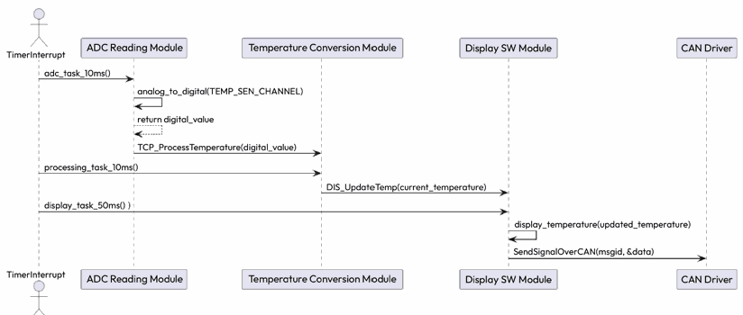

图 5.2 – 温度传感器模块交互序列图

信息流可以根据其性质进行分类。像模数转换器的输出这样的值流可能使用发送方-接收方（SR，Sender-Receiver（发送方-接收方））接口。对于行为请求及其响应，则使用客户端-服务器接口。这些是主要类型，我们将在以下章节中讨论它们。其他信息流方法，如模式切换和参数接口，不在本次讨论范围内。

请花时间仔细审阅上述示例。虽然它只是一个简单的说明，但对于我们接下来的 AUTOSAR 接口探索非常重要。这个示例将作为一个实用的参考点，帮助理解我们将要讨论的概念。确保现在清晰的理解将使后续章节更加易于理解和有意义。同一示例将再次用于按照 AUTOSAR 接口和方法论重新设计。

## 发送方-接收方通信

SR 接口管理 AUTOSAR 中 SWC 之间的数据交换。这些接口支持各种通信模式，包括 1-to-N 模型（一个发送方向多个接收方传输数据）和 N-to-N 模型（多个发送方向多个接收方传输数据）。有两种类型：

- <strong>发送方（Sender，P Port）：</strong>发出信息；接口通过提供端口引用

- <strong>接收方（Receiver，R Port）：</strong>等待接收信息；接口通过需求端口引用

---

例如，图 5.3 展示了一个 1-to-N 配置，负责计算车辆速度的 SWC（发送方）可以将此数据发送给多个其他 SWC（接收方）。这种数据交换可以是周期性的，也可以是事件驱动的：

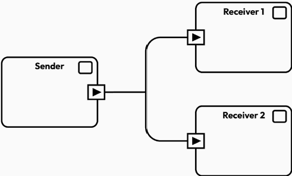

图 5.3 – SR 1-to-N 示例

在 SR 接口的上下文中，数据元素（Data Element（数据元素））是信息交换的基本单元。你可以将数据元素想象为在 SWC 之间传输车辆速度、横摆率、加速度等信息的虚拟线路。虽然单个数据元素传输很常见，但 SR 接口足够灵活，可以容纳多个数据元素，允许更丰富、更全面的数据交换。

<strong>关于数据元素：</strong>为简单起见，你可以将 SR 接口中的数据元素视为一个全局变量，通过定义的接口可被多个 SWC 访问。一组数据元素可视为在组件间共享的结构化数据集。

例如，考虑一个测量速度的车载系统。一旦捕获到速度数据，它可以被发送给多个组件：一个组件可能用它来在仪表盘上显示当前速度；另一个可能用它来调整车辆的自适应巡航控制（Adaptive Cruise Control（自适应巡航控制））；第三个可能记录数据用于诊断目的。SR 接口的这种多播特性确保所有这些组件同时接收速度数据，并能在近乎实时的情况下对其做出响应。

---

### AUTOSAR XML（ARXML）建模

以下 ARXML 代码是作为示例提供的，旨在帮助你熟悉 ARXML 语法。它可能不完全准确，并且可能根据特定的 AUTOSAR Schema 而略有不同。

此 ARXML 片段定义了一个特定的 SR 接口，名为 `If_SR_SenderReceiverTest`，用于处理 `VehicleSpeed` 数据元素的发送或接收，类型为 `uint32`：

```
<SENDER-RECEIVER-INTERFACE UUID="2DABF647-F234-404A-9669-58A29FABF1BC">
  <SHORT-NAME>If_SR_SenderReceiverTest</SHORT-NAME>
  <IS-SERVICE>false</IS-SERVICE>
  <DATA-ELEMENTS>
    <VARIABLE-DATA-PROTOTYPE UUID="D1368B17-1925-4F77-B4A8-520A992CED1D">
      <SHORT-NAME>VehicleSpeed</SHORT-NAME>
      <SW-DATA-DEF-PROPS>
        <SW-DATA-DEF-PROPS-VARIANTS>
          <SW-DATA-DEF-PROPS-CONDITIONAL>
            <SW-CALIBRATION-ACCESS>NOT-ACCESSIBLE</SW-CALIBRATION-ACCESS>
          </SW-DATA-DEF-PROPS-CONDITIONAL>
        </SW-DATA-DEF-PROPS-VARIANTS>
      </SW-DATA-DEF-PROPS>
      <TYPE-TREF DEST="IMPLEMENTATION-DATA-TYPE">/AUTOSAR_Platform/ImplementationDataTypes/uint32</TYPE-TREF>
    </VARIABLE-DATA-PROTOTYPE>
  </DATA-ELEMENTS>
</SENDER-RECEIVER-INTERFACE>
```

作为开发人员，通常不会直接编写 ARXML 代码，但了解其基本格式对调试实现很有帮助。以下是解释：

- <strong><SENDER-RECEIVER-INTERFACE>：</strong>该标签标记 SR 接口定义的开始
- <strong>UUID：</strong>唯一标识符，帮助将此接口与项目中的其他接口区分开
- <strong>SHORT-NAME：</strong>接口的可读名称
- <strong>IS-SERVICE：</strong>指示接口是否提供服务（服务导向通信通常为 true）或仅促进数据交换（SR 为 false）
- <strong><DATA-ELEMENTS>：</strong>定义可通过接口传输的数据
- <strong><VARIABLE-DATA-PROTOTYPE>：</strong>定义接口内的特定变量，有自己的 UUID 和名称
- <strong>SW-CALIBRATION-ACCESS：</strong>设为 NOT-ACCESSIBLE，表示数据不能通过标定工具修改（适用于只读传感器数据）
- <strong>TYPE-TREF：</strong>指定变量的数据类型，此处引用 uint32 类型

---

### 提供端口作为发送方

此 ARXML 片段定义了一个名为 `Example_SenderPort` 的端口原型，使用非队列发送方通信规范通过 SR 接口传输 `VehicleSpeed` 数据元素：

```
<P-PORT-PROTOTYPE>
  <SHORT-NAME>Example_SenderPort</SHORT-NAME>
  <PROVIDED-COM-SPECS>
    <NONQUEUED-SENDER-COM-SPEC>
      <DATA-ELEMENT-REF DEST="VARIABLE-DATA-PROTOTYPE">/PortInterfaces/If_SR_SenderReceiverTest/VehicleSpeed</DATA-ELEMENT-REF>
    </NONQUEUED-SENDER-COM-SPEC>
  </PROVIDED-COM-SPECS>
  <PROVIDED-INTERFACE-TREF DEST="SENDER-RECEIVER-INTERFACE">/PortInterfaces/If_SR_SenderReceiverTest/</PROVIDED-INTERFACE-TREF>
</P-PORT-PROTOTYPE>
```

---

需求端口的 ARXML 语法示例与提供端口非常相似。不过，它将使用 `<R-PORT-PROTOTYPE>` 替代 `<P-PORT-PROTOTYPE>`，通信规范也将替换为 `<NONQUEUED-RECEIVER-COM-SPEC>`。在探索 ARXML Schema 时，你还会遇到队列通信规范如 `<QUEUED-RECEIVER-COM-SPEC>`，可以处理缓冲通信。

XML Schema 定义了 XML 文档的结构、内容和约束。在 AUTOSAR 中，ARXML Schema 遵循 XML Schema 的一般原则，但包括了建模汽车软件组件和接口的特定规则和结构。

## 通信类型

SR 接口可以以两种不同的方式使用：隐式（Implicit）和显式（Explicit）通信机制。

### 隐式 SR 通信

- <strong>IMPLICIT_SEND（隐式发送）：</strong>当运行实体使用 IMPLICIT_SEND 发布数据元素时，一旦运行实体结束，RTE 确保数据元素的最新值对接收方可用

- <strong>IMPLICIT_RECEIVE（隐式接收）：</strong>运行实体直接访问在其执行开始时已存在的数据元素值。传输的值存储在缓冲区中，因此在运行实体的生命周期内保持不变。图 5.4 的序列图说明了隐式 SR 接口的行为，其中 SWC B 发布数据，SWC A 接收数据：

运行实体 B 的优先级高于运行实体 A。因此运行实体 B 可以中断运行实体 A 并修改/读取数据。我们将在第 6 章探索 AUTOSAR 操作系统时介绍优先级和任务的概念。

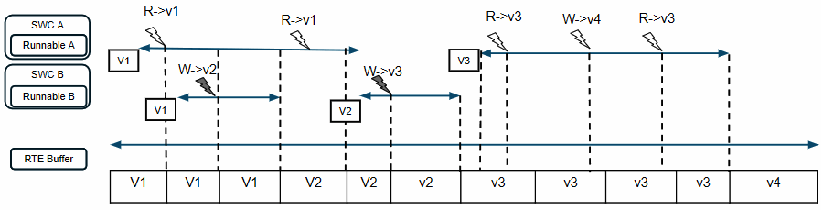

图 5.4 – 隐式写入序列图

---

RTE API 的生成语法：

```
Rte_IRead : DataElementType Rte_IRead_<RunnableName>_<PortName>_<DataItemName>()
Rte_IWrite : Rte_IWrite_<RunnableName>_<PortName>_<DataItem>(DataElemementType Data)
```

其中 `DataElementType` 是数据类型，`Rte_IRead` 表示 RTE 读取函数，`<RunnableName>` 是执行读操作的运行实体名称，`<PortName>` 是读取数据的端口名称，`<DataItemName>` 是访问的特定数据项。例如，`float Rte_IRead_ReadSensorData_SensorPort_Temperature()`。

<strong>隐式读取用例：</strong>考虑一个在整个执行过程中需要一致温度数据的控制算法。当算法（运行实体）启动时，它读取初始温度值，该值被缓冲，控制算法在整个运行期间使用此稳定数据。

---

### 显式 SR 通信

- <strong>EXPLICIT SEND（显式发送）：</strong>数据更新后立即对所用用户发布，确保最新可用数据始终就绪
- <strong>EXPLICIT RECEIVE（显式接收）：</strong>显式调用转发到 RTE 以获取最新可用数据。传输值不被缓冲；运行实体读取数据元素时立即获取最新值

显式的发送方/接收方通信可以是有队列或无队列的，但两种方法都导致最新数据被立即发布和读取。可以将显式通信视为 RTE 中的一个全局缓冲区，发送方和接收方在执行读写操作时都可以访问它。

在显式通信的上下文中，图 5.5 展示两个 SWC 之间的关系。SWC B 利用 RTE 将数据元素写入共享缓冲区。同时，SWC A 具有一个持续从该缓冲区读取的运行实体。序列图生动地说明数据由 SWC B 写入的内容正是 SWC A 运行实体所读取的内容：

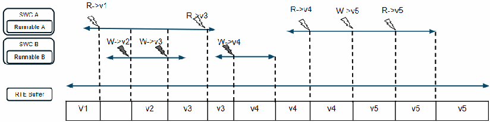

图 5.5 – 显式无队列读写示例

---

图 5.6 展示了涉及队列的类似示例。RTE 中的数据缓冲区大小为 3。注意从缓冲区读取和写入之间的关系，观察队列的行为：

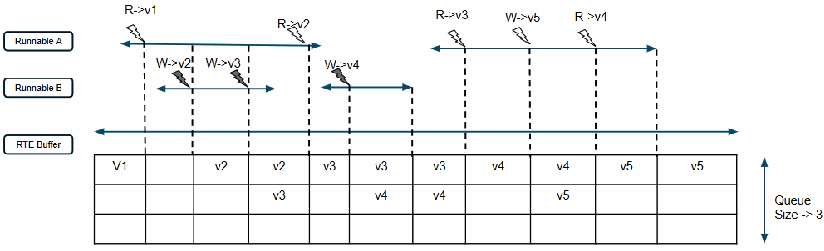

图 5.6 – 显式队列发送和接收示例

显式 RTE API 语法：

```
Rte_Read : DataElementType Rte_Read_<Runnable>_<Port>_<DataItem>()
Rte_Write : Rte_Write_<Runnable>_<Port>_<DataItem>(DataElemementType Data)
```

显式无队列变体使用 `Rte_Write` 和 `Rte_Read`。队列变体分别使用 `Rte_Send` 和 `Rte_Receive`。

<strong>显式读取用例：</strong>考虑一个监控电池电压的系统。监控系统需要按特定间隔检查电池电压以确保其在安全范围内。当监控系统（运行实体）发起电压检查时，它通过 RTE API 调用显式请求最新电池电压，从而在需要时获得最新数据。

---

## 客户端-服务器通信

通常缩写为 C/S 接口（Client-Server（客户端-服务器） Interface（客户端-服务器接口）），它促进 AUTOSAR 中 SWC 之间面向服务的通信。这些接口支持请求-响应通信模式，客户端向服务器发送服务请求，服务器处理请求并返回响应。例如，在客户端-服务器配置中，负责控制车辆灯光的 SWC（客户端）可以请求灯光状态或发送命令将其打开或关闭。服务器组件处理这些请求并提供必要的响应。这种交互可以是同步的（客户端等待服务器响应）或异步的（客户端继续处理并在稍后处理响应）。

- <strong>客户端（Client，R Port）：</strong>发起服务请求的组件，作为交互中的消费者
- <strong>服务器（Server，P Port）：</strong>响应客户端请求提供所需服务的组件，作为交互中的提供者

操作（Operation）是服务器提供的特定功能或服务。操作可以有参数（Argument），按方向分类：

- <strong>Set（in）：</strong>输入参数，为服务器提供必要数据
- <strong>Get（out）：</strong>输出参数，服务器处理后返回
- <strong>双向（in-out）：</strong>既能接收输入也能提供输出

---

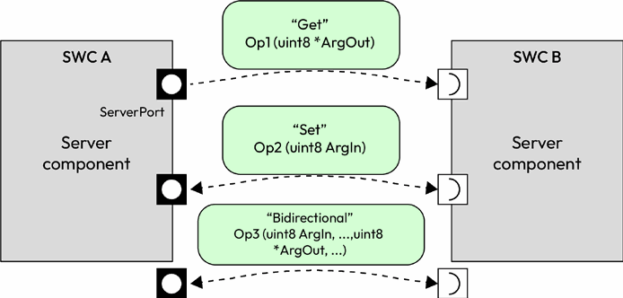

图 5.7 – 客户端-服务器接口

### ARXML 建模

以下 ARXML 片段定义了一个特定的客户端-服务器接口，名为 `If_CS_ClientServerTest`，包含一个名为 `RunService` 的操作，接受 `Arg1`（uint8 类型输入参数）和 `Arg2`（uint8 类型输出参数）：

```
<CLIENT-SERVER-INTERFACE>
  <SHORT-NAME>If_CS_ClientServerTest</SHORT-NAME>
  <IS-SERVICE>false</IS-SERVICE>
  <OPERATIONS>
    <CLIENT-SERVER-OPERATION>
      <SHORT-NAME>RunService</SHORT-NAME>
      <ARGUMENTS>
        <ARGUMENT-DATA-PROTOTYPE>
          <SHORT-NAME>Arg1</SHORT-NAME>
          <TYPE-TREF DEST="IMPLEMENTATION-DATA-TYPE">/AUTOSAR_Platform/ImplementationDataTypes/uint8</TYPE-TREF>
          <DIRECTION>IN</DIRECTION>
        </ARGUMENT-DATA-PROTOTYPE>
        <ARGUMENT-DATA-PROTOTYPE>
          <SHORT-NAME>Arg2</SHORT-NAME>
          <TYPE-TREF DEST="IMPLEMENTATION-DATA-TYPE">/AUTOSAR_Platform/ImplementationDataTypes/uint8</TYPE-TREF>
          <DIRECTION>OUT</DIRECTION>
        </ARGUMENT-DATA-PROTOTYPE>
      </ARGUMENTS>
    </CLIENT-SERVER-OPERATION>
  </OPERATIONS>
</CLIENT-SERVER-INTERFACE>
```

---

服务提供者（服务器）的 ARXML 示例——定义了一个名为 `P_If_CS_ClientServerTest` 的提供端口原型，包含服务器通信规范及操作引用和队列长度：

```
<P-PORT-PROTOTYPE>
  <SHORT-NAME>P_If_CS_ClientServerTest</SHORT-NAME>
  <PROVIDED-COM-SPECS>
    <SERVER-COM-SPEC>
      <OPERATION-REF DEST="CLIENT-SERVER-OPERATION">/SWCA/PortInterfaces/If_CS_ClientServerTest/RunService</OPERATION-REF>
      <QUEUE-LENGTH>1</QUEUE-LENGTH>
    </SERVER-COM-SPEC>
  </PROVIDED-COM-SPECS>
  <PROVIDED-INTERFACE-TREF DEST="CLIENT-SERVER-INTERFACE">/SWCA/PortInterfaces/If_CS_ClientServerTest</PROVIDED-INTERFACE-TREF>
</P-PORT-PROTOTYPE>
```

### 通信类型

<strong>同步客户端-服务器通信：</strong>客户端发送请求后等待服务器响应再继续。客户端在此期间被阻塞，无法执行其他任务。每个请求后立即获得响应，然后才能继续下一操作。适用于客户端需要立即获得结果的场景。

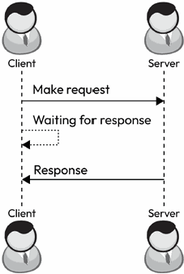

图 5.8 – 同步客户端-服务器调用

---

<strong>异步客户端-服务器通信：</strong>客户端发送请求后不等待立即响应，继续自身操作。服务器独立处理请求并在就绪后发回响应。非阻塞特性允许客户端执行其他任务，通过回调、事件或中断机制处理响应。适用于客户端不需要立即结果或服务器处理时间不可预测的场景。

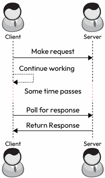

图 5.9 – 异步客户端-服务器调用

---

## 重新思考温度传感器设计

现在让我们重温本章开始时在"信息流说明"中讨论的示例。用接口和端口重新设计温度监控系统：

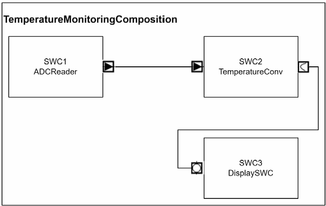

图 5.10 – 温度监控软件组合

---

| SWC | 端口/接口 | 类型 | 描述 |
| --- | --- | --- | --- |
| SWC1 - ADC Reader | PP_Temp | 提供端口 | 向其他 SWC 提供数字温度值 |
| SWC1 | 接口 | 发送方（Sender） | 向连接的需求端口发送数字温度值 |
| SWC2 - Temperature Conversion | RP_Temp | 需求端口 | 从连接的提供端口接收数字温度值 |
| SWC2 | 接口 | 接收方（Receiver SR） | 从连接的提供端口接收数字温度值 |
| SWC2 | RP_Display | 需求端口 | 使用服务来显示温度 |
| SWC2 | 接口 | 客户端-服务器（Client-Server） | 接受显示模块客户端端口的显示请求 |
| SWC3 - Display SWC | PP_Display | 服务器端口 | 提供服务以接受显示请求并显示温度数据 |
| SWC3 | 接口 | 客户端-服务器（Client-Server） | 接收来自 SWC2 的显示请求并显示温度数据 |

表 5.1 – 使用 AUTOSAR 接口和端口的温度监控示例

---

基于建议设计的通信流程：

- SWC1 读取温度值并通过 SR 接口发送给 SWC2

- SWC2 处理温度值后通过客户端-服务器接口请求 SWC3 显示

- SWC3 接收请求并使用 SR 接口通过 COM 模块发送 CAN 消息在仪表盘上显示温度

<strong>如何选择：</strong>选择 Provide 还是 Require 端口——取决于 SWC 是提供（Provide）还是消费/请求（Require）数据或服务。选择 SR 还是客户端-服务器接口——SR 适合持续数据更新而不需要响应的情况；客户端-服务器适合需要执行动作并期待结果/确认的情况。

此示例选择性地聚焦于 ADC 读取模块、温度转换模块和显示模块，特别说明如何使用接口提供 ADC 和温度值以及显示值。ADC 读取模块如何从驱动读取数据的详细设计超出了本次讨论的范围。目的是让你了解何时使用 SR 接口（如持续数据传输）和客户端-服务器接口（用于直接服务请求和响应）。

---

## 理解 AUTOSAR 中的事件

事件（Event）可以看作系统中可识别的发生或状态变化，可能需要相应的动作或反应。AUTOSAR 中的事件是触发系统内特定动作或反应的特定发生或条件。它们充当信号，通知 SWC 某个特定条件已满足，并促使其执行特定的功能。

事件不仅促进 SWC 之间的同步和通信，而且显著影响系统的整体性能和功能。本节将探讨端口、接口和事件之间的相互依赖关系，突出它们对 AUTOSAR 生态系统的综合影响。事件可以由各种源生成，如外部输入、定时器甚至其他 SWC，通常由专用的事件处理器或中断服务例程处理。

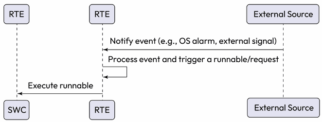

图 5.11 – RTE 事件生成与处理

图 5.11 展示了 RTE 事件从各种源（OS 闹钟、信号变化或其他触发器）生成的序列，以及 RTE 如何处理和触发事件，最终 SWC 执行相应运行实体的过程。

---

### 端口、接口和事件如何交互？

端口和接口定义了信息流的通道。然而，仅仅有这些通道还不够——我们需要一种机制基于接收到的信息或系统状态变化来触发动作。这就是事件发挥作用的地方。事件是与端口和接口关联的触发器，用于管理数据流或服务调用。

例如，当传感器检测到特定条件（如车门打开）时，可以生成一个事件。事件随后触发一系列动作，如打开车内灯。因此，事件是动作的触发器，在 AUTOSAR 中通常是运行实体。

考虑 ECU 中的一个抽象场景：温度传感器的 SWC（SWC 1）检测到温度急剧上升。传感器 SWC 通过其发送方端口使用 SR 接口周期性地发送温度数据。负责监控此数据的 SWC 2 中的主函数执行由定时事件触发的周期性检查。在一次周期性检查中，它检测到温度上升，立即使用客户端-服务器接口请求 SWC 3 进行紧急响应。此请求触发 SWC 3 中的事件，随即激活冷却系统。这个简化的示例说明了端口、接口和事件如何在 ECU 中协同工作以管理 SWC 之间的关键交互。

---

### RTE 事件类型

| 缩写 | 事件 | 描述 |
| --- | --- | --- |
| T | TimingEvent（定时事件） | 基于定时器周期的事件 |
| BG | BackgroundEvent（后台事件） | 低优先级、无固定周期的后台活动 |
| DR | DataReceivedEvent（数据接收事件） | 接收并处理 SR 接口上接收到的信号 |
| DRE | DataReceiveErrorEvent（数据接收错误事件） | 收集接收错误状态（仅 SR 通信） |
| DSC | DataSendCompletedEvent（数据发送完成事件） | 接收并处理发送确认通知（仅显式 SR） |
| DWC | DataWriteCompletedEvent（数据写入完成事件） | 接收并处理传输确认（仅隐式 SR） |
| OI | OperationInvokedEvent（操作调用事件） | 客户端调用时触发服务器端运行实体 |
| ASCR | AsynchronousServerCallReturnsEvent | 收集异步 C/S 操作的结果和状态 |
| MS | SwcModeSwitchEvent（模式切换事件） | 接收到模式变更时触发 |
| ETO | ExternalTriggerOccurredEvent | 外部事件发生时触发 |
| I | InitEvent（初始化事件） | RTE 启动或分区重启时的初始化 |

表 5.2 – RTE 事件

---

我们将重点讨论三种最广泛使用的事件：

### TimingEvent（定时事件）

定时事件是系统一致性和可预测性的标杆，像节拍器一样确保特定功能按固定间隔执行。例如，发动机 ECU 需要每 10 毫秒监控一次发动机温度——创建一个 TimingEvent 以精确按这些间隔触发温度监控功能，确保发动机在安全温度范围内运行：

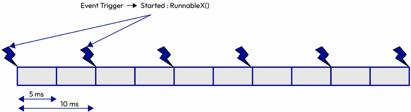

图 5.12 – AUTOSAR 中的 TimingEvent

### OperationInvokedEvent（操作调用事件）

确保客户端请求的操作由服务器提供者响应或启动。与按固定时间表运行的事件不同，这些事件关乎即时性——当特定操作被调用时立即启动。图 5.13 展示了 Sensor SWC 通过 RTE 请求温度计算，RTE 调度并触发 Controller SWC 中的 `R_CalculateTemp` 运行实体，然后将计算结果返回的过程：

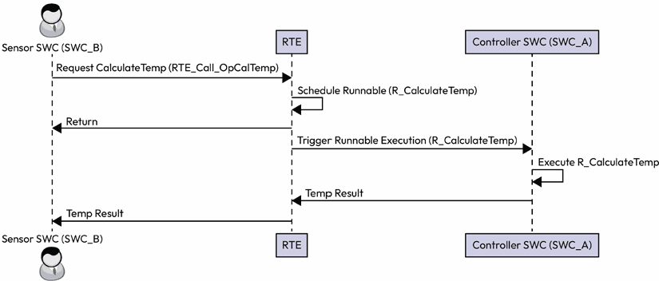

图 5.13 – OperationInvokedEvent 序列图

---

### DataReceivedEvent（数据接收事件）

持续监控特定数据或信号，一旦检测到就立即启动动作，确保系统保持警惕并准备响应关键信息。设想碰撞传感器向安全气囊 ECU 发送信号表示需要立即展开——DataReceivedEvent 在接收到信号时立即触发，指示安全气囊无延迟展开：

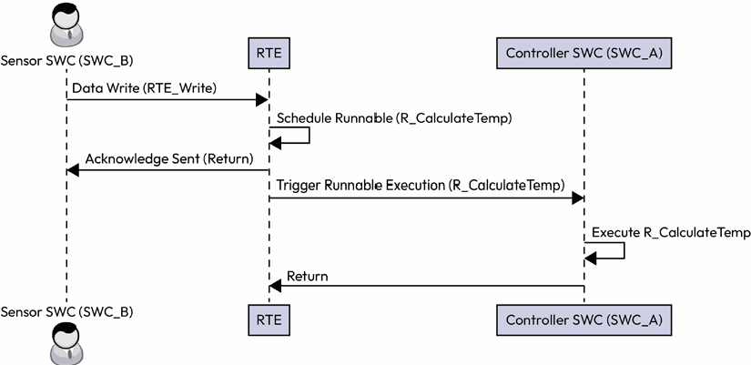

图 5.14 – DataReceivedEvent 序列图

---

### 温度监控示例的事件分配

| SWC | 事件类型 | 事件名称 | 描述 |
| --- | --- | --- | --- |
| SWC1 - ADC Reader | TimingEvent | TI_ReadADCValue | 每 10ms 触发 ADC 读取 |
| SWC2 - Temperature Conversion | DataReceiveEvent | DRE_ReceiveDigitalValue | SWC1 发送温度值时触发 |
| SWC2 | TimingEvent | TI_ProcessTask10ms | 每 10ms 触发温度计算 |
| SWC3 - Display Module | OperationInvokedEvent | OIE_ProcessTemperature | SWC2 请求更新时触发 |
| SWC3 | TimingEvent | TI_DisplayTask50ms | 每 50ms 触发 CAN 消息发送 |

表 5.3 – 温度监控系统中的事件类型与功能

这只是一个示例，具体使用的事件、端口和操作可能因设计选择而异。

---

### 本章小结

本章揭示了 AUTOSAR 框架中事件和接口的复杂性。我们从信息流的说明开始，以温度监控系统为例展示了 SR 和客户端-服务器接口的实际应用。我们深入探讨了 ARXML 建模、隐式与显式通信机制、以及同步与异步客户端-服务器通信范式。最后，我们聚焦于三种关键事件——TimingEvent（定时驱动）、OperationInvokedEvent（操作调用驱动）和 DataReceivedEvent（数据接收驱动）——它们与端口和接口集成，像引擎一样协调 AUTOSAR 架构的平滑运行。

现在你应该能够为汽车 SWC 架构和建立健壮的通信通道。基于本章建立的基础，下一章将深入 AUTOSAR 操作系统的内部机制，探讨它如何管理任务、优先执行并与硬件交互以确保实时性能。

### 思考题

- 事件和接口在 AUTOSAR 框架中的主要作用是什么？

- SR 和客户端-服务器接口在通信模型上有何不同？

- 同步和异步通信类型在 AUTOSAR 中的意义是什么？

- AUTOSAR 提供了哪些不同的事件？

---

## 第6章 AUTOSAR 操作系统入门

基于对 AUTOSAR 及其多层架构的理解，我们现在准备更详细地检视 AUTOSAR 操作系统（OS，Operating System）在这一创新框架中的关键作用，以及它如何贡献于汽车软件开发的整体过程——从初始系统设计到性能调优和故障管理。

通过探索 AUTOSAR OS 的角色并理解其在汽车软件开发中的意义，读者将具备坚实的基础来设计、开发和优化 AUTOSAR 框架内的软件系统。本章将重点通过以下主题揭示 AUTOSAR OS 的复杂性和功能：

- AUTOSAR OS 简要概述
- 探索 AUTOSAR OS 架构

---

# 第6章 AUTOSAR 操作系统入门

AUTOSAR Fundamentals and Applications — Hossam Soffar 著 | AI 辅助翻译

---

AUTOSAR OS（Operating System，操作系统）策略性地定位于 AUTOSAR 栈中，与所有基础软件（BSW）层紧密交互，并在需要时直接管理和利用硬件（HW）。让我们再次查看其结构：


图 6.1 – AUTOSAR 架构中的 AUTOSAR OS

接下来的章节将提供关于实时操作系统（RTOS，Real-Time Operating System（实时操作系统））在嵌入式系统中的重要性，以及 OSEK/VDX（Offene Systeme und deren Schnittstellen für die Elektronik in Kraftfahrzeugen / Vehicle Distributed Executive）标准演进的重要见解——该标准为 AUTOSAR OS 的发展奠定了基础。

## 实时操作系统（RTOS）简介

RTOS 是专为需要精确时序和确定性行为的嵌入式系统设计的专用操作系统。与优先考虑最大化吞吐量和用户交互的通用 OS 不同，RTOS 旨在提供可预测性，并确保特定任务在严格的时间约束内执行。它擅长精确管理时间和系统资源，对关键事件提供快速响应时间。

RTOS 与常规 OS 的关键区别在于其主要关注点：常规 OS 旨在为多样化应用提供广泛的功能和服务，而 RTOS 优先考虑确定性行为和实时响应能力。它保证系统任务——特别是那些具有关键时序需求的任务——在其指定的时间限制内执行。

---

这一独特特性使得 RTOS 对时序至关重要的系统（如汽车控制单元）不可或缺。在汽车行业中，实时性能要求和绝对可靠性至关重要。现代车辆包含大量 ECU，它们必须无缝交互。制动和发动机控制等安全关键功能依赖于精确的时序和确定性行为。RTOS（如 AUTOSAR OS）为此类操作提供必要的功能和服务，包括基于优先级的调度、快速中断处理以及任务间通信和同步机制——所有这些必须在较小且确定的内存占用内实现。

## OSEK 简介

OSEK/VDX 标准出现于 1990 年代，代表了汽车行业主导的一项倡议。其目的是为车辆中部署的众多 ECU 创建一致的软件架构。随着 AUTOSAR OS 的出现，OSEK 标准的基本原则被采纳并进一步发展，以适应汽车软件应用不断演变的复杂性。

AUTOSAR OS 建立在 OSEK OS 标准的基础上，专为汽车控制单元的特定需求而设计。这包括理解和解决汽车应用的独特约束和实时需求。抢占式（Preemptive（抢占式））和非抢占式（Non-Preemptive（非抢占式））调度等关键特性被实现以实现有效的任务管理，促进处理资源的最佳利用。此外，资源管理策略被集成以缓解优先级反转（Priority Inversion（优先级反转））等挑战——即低优先级任务可能阻碍高优先级任务完成的情况。AUTOSAR OS 还集成了事件驱动的任务同步机制，为协调多个任务提供了更敏捷高效的系统。它还通过支持多核和灵活的调度策略进一步增强系统性能，并维护栈监控（Stack Monitoring（栈监控））原则——用于识别和防止栈溢出的工具。

---

下图描绘了 OS 作为计算机系统中央引擎的角色，说明了其与各种模块的交互及其与驱动层的关系：


图 6.2 – OS 在嵌入式软件中的角色

## 配置 AUTOSAR OS

AUTOSAR OS 的配置发生在 AUTOSAR 方法论的集成阶段，这至关重要，因为它决定了 OS 如何管理系统资源、处理中断、调度任务以及与软件组件通信。

AUTOSAR OS 与 RTE——一个实现软件组件之间通信的中间件层——密切相关。这些软件组件通常是独立开发的，需要一种通用的方式来通信和交换数据。RTE 提供这种能力，并利用 AUTOSAR OS 的服务来实现。软件组件、RTE、BSW 模块和 AUTOSAR OS 被配置和集成。RTE 为每个软件组件生成描述文件，概述其接口和行为。这些信息用于生成适当的通信机制（如发送/接收函数）。RTE 还与实现底层硬件依赖功能（如通信协议和 I/O 管理）的 BSW 模块交互。

---


图 6.3 – 配置 AUTOSAR OS

## 探索 AUTOSAR OS 架构

AUTOSAR OS 由多个相互关联的对象组成，每个对象服务于管理系统资源和为软件应用提供服务的特定目的：

- <strong>任务（Tasks）：</strong>执行的基本构建块，本质上是由 OS 调用的 C 函数。它们是执行特定功能的独立软件元素，按预定顺序运行，通常由特定事件或刺激激活
- <strong>闹钟（Alarms）：</strong>基于时间的触发器，可用于在特定时间点调度任务执行或激活事件

---

- <strong>事件（Events）：</strong>代表可触发任务执行的发生或条件，任务、中断或其他系统组件也可以生成事件
- <strong>服务（Services）：</strong>OS 提供的预定义函数，促进常见操作，如任务间通信、内存管理和定时服务
- <strong>调度（Scheduling）：</strong>确定任务执行的顺序和优先级，确保较高优先级任务先于较低优先级任务执行
- <strong>资源（Resources）：</strong>多个任务可以访问和管理的共享实体，包括硬件外设、内存、通信通道和定时器

## 任务

AUTOSAR OS 提供两种不同的任务概念：<strong>基础任务（Basic Tasks）</strong>和<strong>扩展任务（Extended Tasks）</strong>。

### 基础任务

基础任务仅在满足特定条件时才释放处理器：任务终止、OS 切换到更高优先级任务、或中断发生触发处理器切换到中断服务例程（ISR，Interrupt Service Routine）。

---


图 6.4 – 基础任务状态机

- <strong>运行（Running）：</strong>CPU 正积极执行该任务的指令。例如控制汽车发动机的嵌入式系统中，与发动机控制模块关联的任务持续运行，监控和控制各种发动机参数以确保最佳性能和效率
- <strong>挂起（Suspended）：</strong>任务暂时暂停，不被 CPU 执行。这可能发生在另一个任务优先级更高或任务主动让出控制权时
- <strong>就绪（Ready）：</strong>任务准备就绪可被 CPU 执行但正在等待轮次。任务已加载到内存中，所有必要资源已分配

总结示例：正常驾驶时，发动机管理任务保持运行状态，持续优化发动机性能。然而，如果检测到潜在碰撞，发动机管理任务可能暂时挂起以优先处理碰撞避免。同时，制动任务保持就绪，监控输入并等待驾驶员命令或需要制动干预的事件。

---

### 扩展任务

扩展任务相比基础任务提供额外的功能。它们能够利用 OS 的 `WaitEvent` 调用，进入等待状态（Waiting State）。此等待状态允许处理器被释放并分配给较低优先级任务，而无需终止当前运行的扩展任务。然而，扩展任务的管理对 OS 来说更复杂，需要比基础任务更多的系统资源。


图 6.5 – 扩展任务状态机

等待状态是扩展任务在 OS 中的特定状态。在此状态下，任务正在等待特定事件、条件或资源才能继续执行。任务保持等待状态直到预期的事件或条件发生，此时它可以转为运行状态继续操作。在汽车嵌入式领域，传感器数据处理任务持续运行，通信任务在错误时可能暂时挂起，诊断任务等待触发事件，输入处理任务等待用户输入，如果任务需要排他访问共享资源，则可能被阻塞。

---

## 中断（Interrupts）

在嵌入式开发中，中断是指暂停程序正常执行并将控制权临时转移到称为 ISR 的特定代码段的信号或事件。中断是处理嵌入式系统中时间敏感事件和外部交互的基本机制。当发生中断时，它中断程序的当前执行，将处理器的注意力转移到与该特定中断关联的 ISR。ISR 执行必要的动作以响应事件或信号，如读取传感器数据、服务硬件设备或处理外部输入。

在 AUTOSAR OS 中，处理中断的函数分为两个 ISR 类别：

- <strong>ISR 类别 1：</strong>独立于 OS 服务运行。ISR 执行完毕后，处理从产生中断的指令处精确恢复。这意味着中断不影响任务管理。此类 ISR 具有最小的开销。

- <strong>ISR 类别 2：</strong>与 OS 交互。一旦类别 2 中的 ISR 完成执行，OS 可能执行任务切换或调整任务优先级。这是因为类别 2 ISR 可以调用 OS 服务，如激活任务或设置事件。

---


图 6.6 – ISR 类别

在类别 1 ISR 中，它们不受 OS 管理且独立运行。另一方面，类别 2 ISR 由 OS 通过 OS 框架管理。这种区分允许根据 ISR 的类型在 AUTOSAR 框架内进行不同的处理和管理。

## 事件（Events）

在 AUTOSAR OS 中，事件是向扩展任务提供系统内各种状态变化或发生的关键提示的信号机制。这些由 OS 管理的实体与扩展任务紧密关联，不是独立元素，而是补充这些任务的辅助对象。每个扩展任务关联一组独立的事件，成为这些事件的所有者。AUTOSAR 中的事件有两个关键属性：所属任务和唯一标识符（通常称为名称或掩码）。激活扩展任务后，OS 会系统地清除相关事件，为下一次任务做好准备。

---

AUTOSAR OS 提供管理事件的 API 函数：

- <strong>SetEvent：</strong>为特定任务设置事件，等待该事件的任务将被解除阻塞并准备执行
- <strong>ClearEvent：</strong>清除任务的指定事件
- <strong>WaitEvent：</strong>阻塞调用任务的执行直到其某一事件被设置
- <strong>GetEvent：</strong>读取任务当前待处理的事件

让我们考虑一个示例，有两个任务——Task1 和 Task2。Task1 设置事件 Event1，Task2 等待此事件发生：

```
# define Event1 0x01
TASK(Task1)
{
    // ... Task1's processing ...
    // Set the Event1 for Task2
    SetEvent(Task2, Event1);
    // Terminate Task1
    TerminateTask();
}
TASK(Task2)
{
    // Wait for the Event1
    WaitEvent(Event1);
    // If the execution reaches this point, it means Event1 occurred
    // ... Task2's processing ...
    // Clear the Event1
    ClearEvent(Event1);
    // Terminate Task2
    TerminateTask();
}
```

---

在此示例中，Task2 使用 `WaitEvent` 等待 Event1。在 Event1 被设置之前，Task2 保持等待状态。Task1 在完成处理时使用 `SetEvent` 设置 Event1。一旦 Event1 被设置，Task2 从等待状态转为就绪状态并继续执行。处理事件后，Task2 使用 `ClearEvent` 清除 Event1 然后终止。这种机制使任务能够基于特定的系统状态或发生事件来同步其执行。


图 6.7 – 任务间的事件

## 调度（Scheduling）

### 完全抢占式调度（Full Preemptive Scheduling）

这种调度类型允许正在运行的任务在任何指令处基于 OS 设定的预定义触发条件被重新调度。当更高优先级任务准备好执行时，当前运行的任务被置于就绪状态并保存其执行上下文。更高优先级任务随后被调度执行。这种抢占行为确保更高优先级任务立即获得处理器访问权，一旦更高优先级任务完成执行或被阻塞，先前被抢占的任务可以从被抢占时的确切位置恢复执行：

---


图 6.8 – 完全抢占式调度

### 非抢占式调度（Non-Preemptive Scheduling）

也称为协作式调度（Cooperative Scheduling（协作式调度）），任务持续执行直到它们主动放弃控制权或遇到显式的重调度点。任务切换仅通过明确定义的系统服务或特定重调度点发生。非抢占式调度对时序需求施加特定约束——当低优先级任务进入不可抢占区域时，可能导致高优先级任务执行延迟直到下一个重调度点：


图 6.9 – 非抢占式调度

---

时序保护通过最高优先级优先（Highest Priority First（最高优先级优先））策略确保。同优先级任务以 FIFO（First In, First Out）方式分组，共享公共资源。一次只允许一个任务占用共享资源，不支持同组内抢占。

## 任务触发机制

### 闹钟（Alarms）

闹钟是 AUTOSAR OS 中关键的时间驱动实体，与计数器（Counters（计数器））紧密关联——计数器是以 tick 为单位计数的软件计时器。计数器的每次 tick 可以代表任意时间周期，实践上通常设置为与 OS 调度器 tick 匹配。计数器可以按固定时间间隔（系统计数器）、通过硬件中断（硬件计数器）或由应用软件手动（软件计数器）来递增。当计数器达到预设计数值时，关联的闹钟到期并执行预定义动作：

- <strong>激活任务：</strong>到期时闹钟可以激活特定任务，实现精确的任务调度和时间驱动行为
- <strong>设置事件：</strong>闹钟也可以为特定任务设置事件，为任务基于特定系统状态同步执行提供方式

---

```
# define ALARM_CYCLE 10
TASK(Task1)
{
    // Task1 processing here
    TerminateTask();
}
void setup(void)
{
    SetRelAlarm(Alarm1, ALARM_CYCLE, ALARM_CYCLE);
}
void main(void)
{
    setup();
    while(1)
    {
        IncrementCounter(Counter1);
        AlarmCheck();
        if (CheckAlarmExpired(Alarm1)) {
            ActivateTask(Task1);
        }
    }
}
```

`SetRelAlarm` 函数配置 Alarm1 在 ALARM_CYCLE 次计数器 tick 后启动，之后每 ALARM_CYCLE 次 tick 到期。当闹钟到期时触发 Task1 的激活。

---

### 调度表（Schedule Tables（调度表））

调度表提供比闹钟和计数器更高层次的抽象，允许精确的任务调度和基于时间的事件设置。可以将其视为行动时间表——由多个步骤组成，每个步骤对应一个时间点。当到达特定步骤的时间时，调度动作（如任务激活或事件设置）发生：


图 6.10 – 调度表示例

AUTOSAR OS 支持相对调度表和同步调度表。相对调度表一经启动即开始运行，每一步时序相对于表的开始。同步调度表则同步到外部时间源，在 ECU 间同步中发挥重要作用——车辆中多个 ECU 经常需要协调动作以实现整体系统目标。

---

```
// On ECU1 (master)
# define SYNC_CYCLE 100 // Sync signal every 100 ms
TASK(SyncTask)
{
    SendSyncSignal();
    SetRelAlarm(SyncAlarm, SYNC_CYCLE, SYNC_CYCLE);
    TerminateTask();
}

// On ECU2 (slave)
void OnSyncSignalReceived(TickType syncTime)
{
    SyncScheduleTable(SlaveScheduleTable, syncTime);
}
```

ECU1 使用任务和闹钟周期性地生成同步信号。ECU2 接收同步信号后，使用 `SyncScheduleTable` 将 SlaveScheduleTable 调度表同步到同步信号，确保 SlaveTask 在接收同步信号后 50ms 激活。

---

## OS 资源


图 6.11 – 两个任务间的共享资源

核心原则：<strong>排他访问</strong>（两个任务不能同时占用同一资源）、<strong>优先级反转预防</strong>（采用优先级继承协议，Priority Inheritance Protocol（优先级继承协议））、<strong>死锁避免</strong>（Deadlock Avoidance（死锁避免））、<strong>非阻塞访问</strong>（资源访问永不导致等待状态）。

```
# define RESOURCE_ID 1
TASK(Task1)
{
    GetResource(RESOURCE_ID);
    // Critical section, access the shared resource here...
    ReleaseResource(RESOURCE_ID);
    TerminateTask();
}
```

---

## 钩子函数（Hooks）

钩子函数是用户可实现的回调函数，在 OS 执行的特定点被调用以自定义和扩展 OS 行为。常用钩子：

- <strong>任务/ISR 执行钩子：</strong>在每个任务执行前后调用，用于监控任务行为、收集运行时信息、性能分析和异常检测
- <strong>关闭钩子（Shutdown Hooks）：</strong>系统关闭或进入低功耗状态时调用，用于清理任务、保存关键数据到 NVM（非易失性存储器）或确保系统处于安全关闭状态

---

- <strong>错误钩子（Error Hooks）：</strong>当 OS 内发生错误条件时触发，用于捕获错误信息、执行错误处理例程和采取适当措施以减轻错误影响

钩子函数在 AUTOSAR 系统中很实用，但应精心设计以避免引入不必要的开销。钩子函数应高效、非阻塞，对系统性能影响最小。

### 本章小结

本章探索了 AUTOSAR OS 在汽车软件开发中的关键角色。我们讨论了其架构、RTOS 基础和 OSEK 标准。AUTOSAR OS 基于优先级的调度、快速中断处理和任务间通信能力使开发者能够开发高性能和时间关键的汽车软件系统。你熟悉了任务、闹钟、事件、服务、调度、资源和中断等核心元素，能够有效配置和管理这些组件。资源管理确保共享资源的协调访问和冲突预防。钩子函数提供了在 OS 关键点扩展功能的机制。在下一章中，我们将深入探索应用层、RTE 以及软件组件如何设计。

### 思考题

- 描述 AUTOSAR OS 的主要对象。
- 基础任务和扩展任务之间有什么区别？
- 何时在 OS 配置器中选择 FULL 或 NON 作为任务属性？
- 如何保护共享资源？

---

## 第7章 探索通信栈

通信栈（Communication Stack）是 AUTOSAR 框架的核心支柱，将多样化模块交织在一起，创建数据交换和功能集成的和谐交响。在本章中，我们的探索将集中在构成 AUTOSAR 通信栈的各个模块及其在促进汽车 ECU 内通信协议方面的重要性。我们将剖析通信栈的每一层，揭示其目的和设计考虑，检查其模块，阐明它们复杂的相互依赖关系，并介绍关键术语——消息（Message）、帧（Frame）、协议数据单元（PDU，Protocol Data Unit）和信号（Signal）。

---

# 第7章 探索通信栈

AUTOSAR Fundamentals and Applications — Hossam Soffar 著 | AI 辅助翻译

---

## 什么是 COM 栈？

假设你是一位开发监测发动机温度 ECU 的工程师。在传统嵌入式实现中，你需要自己处理整个通信过程——配置硬件接口（CAN、FlexRay、LIN），格式化消息数据，管理数据传输的时序和同步，以及实现错误检测和恢复机制。这需要大量底层编码，且高度依赖系统中使用的特定硬件和通信协议。

在 AUTOSAR 中，ECU 间通信通过标准化接口和分层通信栈实现了抽象。在 AUTOSAR 兼容的系统中，同样的场景将按如下方式处理：

- <strong>应用层（Application Layer）：</strong>在 ECU 上运行的应用生成表示发动机高温的信号（Signal）
- <strong>RTE 层：</strong>信号被传递到 RTE，RTE 将应用的通信需求从底层硬件和协议中抽象出来
- <strong>通信栈（Communication Stack）：</strong>通信栈接管打包并传输信号的责任，还负责根据预定义的通信路由将消息路由到适当的目标 ECU——消息是通过 CAN、FlexRay 还是其他汽车通信总线发送？

通信硬件接口——如 CAN 控制器或 Ethernet PHY——处理消息在通信总线上的物理传输。

AUTOSAR 中的信号（Signal）是在车辆电子系统的不同组件或软件模块之间传输的信息或数据。信号可以表示各种类型的数据，如传感器读数、执行器命令或状态信息。

---

## COM 栈概述

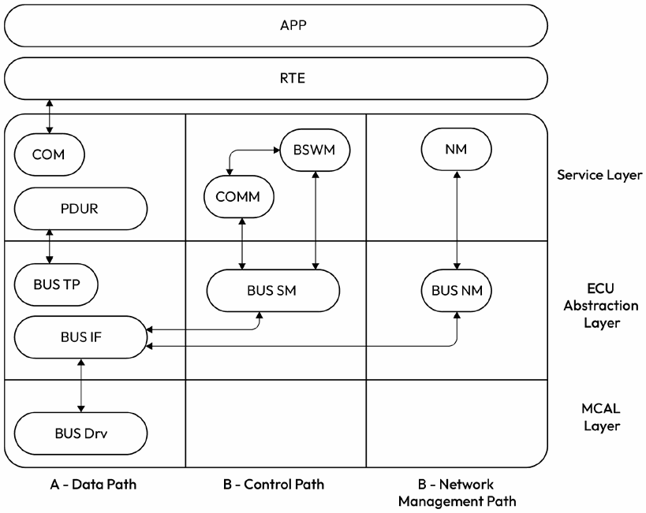

图 7.1 – COM 分层架构

AUTOSAR 通信栈分为三个主要部分：

- <strong>数据路径（A）：</strong>处理信号、PDU（PDU（Protocol Data Unit，协议数据单元），协议数据单元）及其传输
- <strong>控制路径（B）：</strong>处理通信通道的状态
- <strong>网络管理（C，Network Management（网络管理））</strong>

这些部分分布在服务层（Service Layer）、ECU 抽象层（ECU Abstraction Layer）和硬件层之间。

---

### 服务层通信模块

- <strong>COM：</strong>进一步抽象通信细节，提供 PDU 处理服务，核心职责是处理基于信号的通信，抽象底层通信协议和硬件接口
- <strong>PduR（PDU Router（PDU路由器））：</strong>在层间路由 PDU——例如从 COM 层到适当的总线特定接口（CAN、FlexRay、LIN 等），或提供两个通信接口之间的网关功能（如 CAN 到 Ethernet）
- <strong>BUS-TP（传输协议）：</strong>管理 ECU 间可靠数据传输，处理分段、流控、错误检测和寻址（如 CAN-TP）
- <strong>BUS-SM（总线状态管理器）：</strong>基于来自 ComM（通信管理器）的请求管理每个网络的通信模式转换
- <strong>ComM（通信管理器）：</strong>根据 ECU 状态协调通信路径的激活/停用，支持 Full（全部通信可用）、Partial（部分通道）和 No Communication 模式

---

### ECU 抽象层模块

- <strong>CanIf（CAN 接口）：</strong>抽象底层 CAN 控制器和收发器，成为上层 PduR 和底层 CAN 驱动之间的桥梁
- <strong>LinIf（LIN 接口）：</strong>类似 CanIf，管理 LIN 帧的内外传输
- <strong>EthIf（Ethernet 接口）：</strong>抽象以太网控制器，提供 ETH 收发器与上层模块间的标准接口
- <strong>FrIf（FlexRay 接口）：</strong>管理 FlexRay 通信，抽象底层驱动细节

---

### PDU 与 PCI（协议控制信息）

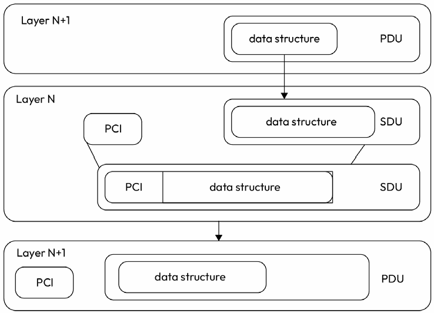

图 7.2 – PDU 与 PCI

PDU 是通信栈各层之间传输的数据包，每层可以添加自己的 PCI。形成嵌套结构——上层 SDU（Service Data Unit，服务数据单元）加上本层的 PCI 构成该层的 PDU。

---

### 从 PduR 到 CAN Driver 的数据流

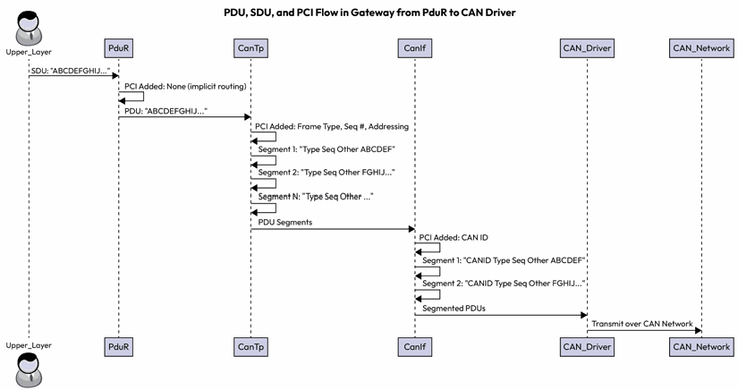

图 7.3 – PduR 到 CAN Driver 的 UML 序列图

上述序列图展示了数据从 PduR 经 CanIf 到 CAN Driver 再经 CanTrcv（CAN 收发器）到物理总线的完整流程。每个模块在传输链中都有其特定的责任。

---

### COM 模块详细解析

COM 模块是通信服务层的核心，为上层 SWC 提供统一的信号级通信接口。COM 将来自不同 SWC 的多个信号打包进 PDU，管理信号的发送模式和传输时机。关键 API 包括：

```
Std_ReturnType Com_ReceiveSignal(uint16 SignalId, void* SignalDataPtr);
// 从COM模块读取信号数据

Std_ReturnType Com_SendSignal(uint16 SignalId, const void* SignalDataPtr);
// 通过COM模块更新并发送信号数据
```

---

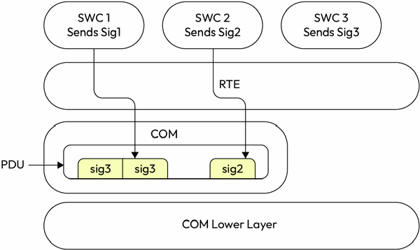

图 7.5 – COM 模块将信号打包成 PDU

上图展示了 COM 模块如何将来自不同 SWC 的信号（Signal A, B, C）聚合打包进一个 PDU 进行传输，接收端再解包还原各个信号。

---

### PDU 传输模式

<strong>直接传输（Direct）：</strong>PDU 一经更新立即请求传输。可配置重复次数 N——N=0 仅发送一次，N=3 则在总线上重复 3 次以提高可靠性：

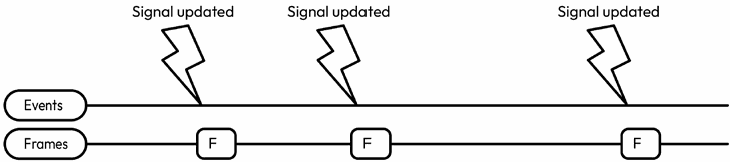

图 7.6 – 直接传输模式 N=0

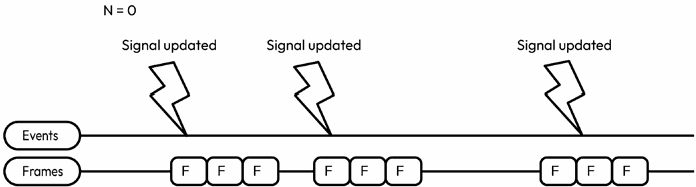

图 7.7 – 直接传输模式 N=3

<strong>周期传输（Periodic）：</strong>PDU 按固定时间间隔 t 请求传输，无论数据是否更新。

<strong>混合传输（Mixed）：</strong>在周期内如 PDU 更新则立即发送，无更新则在周期结束时发送一次。

---

### PduR 路由与网关

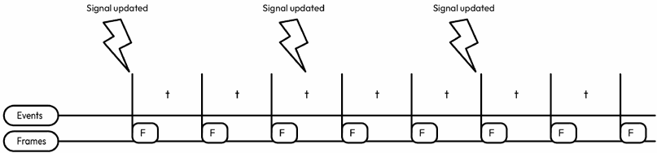

图 7.4 – PDU 从 CAN 到 ETH 和 FlexRay 的网关路由

PduR 模块不仅负责将 PDU 从上层（COM）路由到正确的总线接口（如 CanIf），还提供网关功能——允许 PDU 在不同总线协议间转发。例如，来自 CAN 总线的消息可以通过 PduR 网关转发到 Ethernet 或 FlexRay 网络。

---

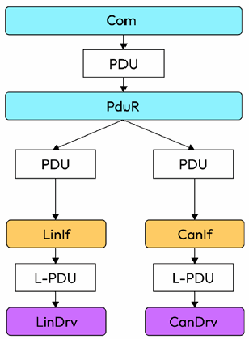

图 7.10 – PduR 路由流程

PduR 路由流程展示了从 COM 发送的 I-PDU 经过 PduR 转发到 CanIf，再通过 CAN 驱动发送到物理总线的完整路径。

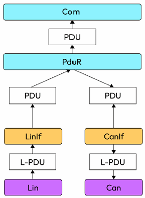

图 7.11 – PduR 网关流程

网关流程展示了一条消息从 CAN 网络通过 PduR 网关转发到 Ethernet 网络的路径，涉及 CanIf → PduR → EthIf 的跨总线传输。

---

### 从 SWC 到 CAN Driver 的完整数据流

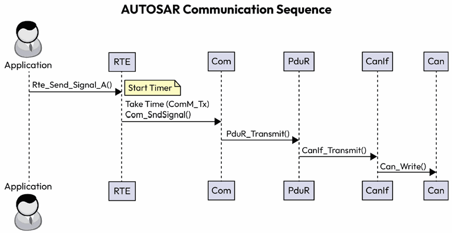

图 7.12 – 信号在 COM 中的流向

完整发送流程：SWC → RTE（Rte_Send）→ COM（Com_SendSignal）→ PduR（PduR_Transmit）→ CanIf（CanIf_Transmit）→ CAN Driver（Can_Write）→ CAN 控制器 → 物理总线。接收流程反向进行。

---

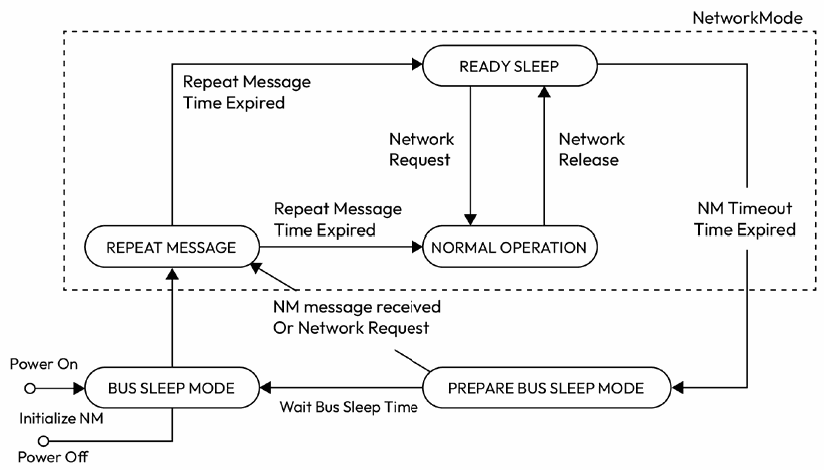

图 7.13 – 信号传输序列图

序列图展示了从应用层 SWC 发送信号到 CAN 总线物理传输的时序过程，包括各层模块的调用顺序和数据流向。

---

## 网络管理（Network Management，NM）


图 7.14 – CanNm 状态机

CanNm（CAN 网络管理）管理 ECU 在 CAN 网络中的状态转换：

- <strong>Bus Sleep Mode（总线休眠模式）：</strong>总线休眠，无通信活动
- <strong>Prepare Bus Sleep Mode（准备总线休眠）：</strong>准备进入休眠状态
- <strong>Network Mode（网络模式）：</strong>活跃通信状态。包含三个子状态：
  - Repeat Message State（重复消息状态）：重复发送 NM 消息
  - Normal Operation State（正常操作状态）：正常通信
  - Ready Sleep State（准备休眠状态）：准备休眠

---

### NM 协调式唤醒

ECU 通过 CanNm 模块发送和监听 NM 消息来实现协调式唤醒和休眠。NM 消息包含源节点 ID，节点通过逻辑环令牌机制（Logical Ring Token（逻辑环令牌））协调唤醒。当所有节点同意进入休眠时，网络转换为 Bus Sleep Mode 以节省功耗。

---

### 本章小结

本章深入 AUTOSAR 通信栈，理解了它在 ECU 间管理数据和信号传输的关键作用。我们探索了 COM 栈的分层架构——包括 COM、PduR、CanIf、CAN Driver 和 CanTp——理解了数据通过通信层传输的机制。我们讨论了 PDU 的三种传输模式（Direct/Periodic/Mixed）以及 PduR 的路由和网关功能。最后我们了解了网络管理及其状态机，使 ECU 能够在休眠和唤醒状态间转换，实现高效的功耗管理。

### 思考题

- AUTOSAR 通信栈的主要组成部分是什么？
- COM 和 PduR 模块各自的角色是什么？
- PDU 的三种传输模式及其应用场景？
- CanNm 状态机的状态及其转换条件是什么？

---

## 第8章 使用 Crypto 与安全栈保护 AUTOSAR 系统

在本章中，我们将踏上汽车网络安全的旅程，首先概述 AUTOSAR 框架内的安全全景，然后探索 Crypto 栈设计的核心组件——深入研究保护敏感数据以及保障车辆组件之间安全通信的原则与配置。本章旨在让读者熟悉汽车系统安全概念，并展示 AUTOSAR 如何通过其强大的加密栈应对这些问题。

本章将讨论以下主题：

- 汽车安全简介
- 汽车安全基础
- AUTOSAR 架构中的安全栈
- Crypto 栈用例与示例

---

# 第8章 使用 Crypto 与安全栈保护 AUTOSAR 系统

AUTOSAR Fundamentals and Applications — Hossam Soffar 著 | AI 辅助翻译

---

## 汽车安全简介

想象一下驾驶一辆可以被远程入侵的汽车——不仅危及你的安全，还威胁到你的个人数据安全。这个噩梦般的场景凸显了在当今互联世界中汽车安全的至关重要性。

近年来，汽车行业经历了显著的变革。现代车辆配备了先进功能，包括信息娱乐系统、远程信息处理和自动驾驶能力。虽然这些创新提高了便利性和安全性，但也引入了新的脆弱性。就像我们保护家庭和个人信息一样，我们也必须保护车辆免受恶意攻击者利用这些漏洞的侵害。

那么，汽车安全为何备受关注，尤其是在 AUTOSAR 的背景下？以下几点值得考虑：

- <strong>生命安全问题：</strong>车辆正日益成为轮子上的计算机，任何安全漏洞都可能产生危及生命的后果。例如，想象一下黑客控制车辆制动系统导致碰撞的场景

- <strong>数据隐私：</strong>车辆收集从驾驶偏好到定位数据等大量信息，保护这些数据不仅关乎 GDPR 等法规遵从，更是消费者与汽车制造商之间信任的基石

- <strong>财务影响：</strong>安全漏洞可导致召回、法律赔偿和公司声誉损害等重大财务损失，以及公司知识产权的保护问题

- <strong>不断演变的威胁：</strong>黑客和网络犯罪分子持续开发新的攻击手段。随着 AUTOSAR 的演进，攻击向量也在变化。领先于这些威胁至关重要

- <strong>法规遵从：</strong>全球各国政府正在引入严格的汽车网络安全法规和标准，不合规可能导致严厉处罚和市场禁入

了解了汽车安全在当今互联世界的重要性后，接下来探讨在 AUTOSAR 框架内实现这些安全目标的基本方法。本节将探讨保护数据和通信的关键加密机制。

---

## 汽车安全基础

在 AUTOSAR 中，加密机制对于确保汽车系统内数据和通信的安全不可或缺。这些机制包括软件加密和硬件加密两种处理方式，各自具有独特的优势和应用场景。软件加密依赖 ECU 的中央处理器（CPU）或微控制器执行的算法，而硬件加密则利用微控制器内的专用加密模块或协处理器，如硬件安全模块（HSM（Hardware Security Module，硬件安全模块），Hardware Security Module），这些模块专门设计用于加速加密操作，提供更快更高效的处理。在 AUTOSAR 中，加密算法可以通过软硬件组件组合实现，提供灵活的、量身定制的解决方案，以满足汽车系统多样化的安全需求。

---


汽车安全的首要目标是确保车辆系统和数据的机密性、完整性和可用性，具体如下：

- <strong>机密性（Confidentiality）：</strong>保护敏感信息（如用户数据和车辆诊断数据）免受未授权访问和泄露

- <strong>完整性（Integrity）：</strong>确保数据和软件保持准确可信，防止未授权的修改和篡改

- <strong>可用性（Availability）：</strong>确保关键车辆系统在需要时正常运行和可访问，抵御拒绝服务等干扰攻击

此外，系统还实现了强大的认证和授权机制，用于验证用户和设备的身份，并基于其角色授予适当的访问权限。这些目标共同确保汽车系统安全、可靠、有韧性，能够抵御意外故障和恶意攻击。

---

## AUTOSAR 中的安全

AUTOSAR 认识到安全在现代车辆中的关键作用，并制定了一套安全要求和指南。这些要求和指南旨在补充 ISO 21434 和 ISO 26262 等行业标准，为在 AUTOSAR 架构内实施安全措施提供具体指导。

ISO 21434 是专门为汽车行业设计的综合性网络安全标准，概述了在车辆开发和生产过程中评估和管理网络安全风险的要求。ISO 21434 提供了一个结构化框架，将安全集成到汽车开发生命周期中，确保从初始设计阶段到生产及以后的整个过程都考虑安全因素。

ISO 26262 专注于汽车行业的功能安全。虽然它主要关注安全问题，但也承认安全与安保之间的相互影响。一个安全的系统可以通过防止恶意干扰来增强功能安全。ISO 26262 包含了与网络安全相关的风险评估条款，强调了在考虑功能安全的同时也应关注安全因素的重要性。

---

## 区分功能安全与信息安全

"安全"（Safety）和"安保"（Security）这两个概念在汽车软件开发中密切相关。它们常常重叠——一次安全漏洞或攻击可能产生严重的功能安全影响，例如危及制动或转向等关键系统的功能。

---

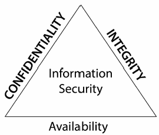

图 8.1 – 功能安全与信息安全的重叠

接下来，我们将探讨 AUTOSAR 如何管理这两个相互交织的安全和安保方面。

### AUTOSAR 中的功能安全（Safety）

AUTOSAR 中的功能安全主要关注事故和危害的预防与减轻。它涵盖应对车辆系统中物理故障和功能失常的机制与流程。功能安全措施旨在保护乘员、行人以及环境。

### AUTOSAR 中的信息安全（Security）

相比之下，AUTOSAR 中的信息安全关注保护车辆系统免受故意攻击、未授权访问和数据泄露。它涵盖防止网络威胁损害车辆功能、隐私和安全的措施。

AUTOSAR 安全需求涵盖广泛范围，包括安全通信、加密服务和访问控制。这些需求旨在确保基于 AUTOSAR 的系统能够有效应对各种网络威胁。AUTOSAR 不提供直接的实现指南，而是提供构建模块来帮助保护 ECU 软件安全。这些构建模块支持工程师集成强大的安全功能，确保汽车系统达到高安全标准并能抵御潜在的网络威胁。

在下一节中，我们将探讨加密栈的 BSW 架构及其在 AUTOSAR 中的服务，重点关注它如何保护汽车系统中的通信和数据安全。我们还将研究安全栈的核心组件，强调其在应对汽车安全独特挑战中的作用。

---

## AUTOSAR 安全栈架构

本节将探讨 AUTOSAR 架构提供的安全模块，重点关注那些提供安全功能的模块。AUTOSAR 提供了一套构建模块工具箱，旨在帮助实现软件中的安全目标。这些工具使工程师能够集成强大的安全功能，确保汽车系统达到高安全标准并能抵御潜在的网络威胁。

AUTOSAR 的关键安全特性：

- <strong>加密服务：</strong>AUTOSAR 提供一系列加密服务，包括加密、解密、哈希和数字签名。这些服务用于保护数据并确保其真实性

- <strong>访问控制：</strong>AUTOSAR 支持细粒度的访问控制，规定谁可以访问系统内的特定功能、服务或数据。这通过最小化攻击面来增强安全

- <strong>安全通信：</strong>该架构支持 ECU 之间的安全通信，确保组件之间交换的数据保持机密且防篡改

- <strong>安全启动：</strong>AUTOSAR 支持安全启动机制，帮助在启动过程中验证软件组件的完整性，防止未授权代码执行

> **关于 AUTOSAR 安全特性的说明**
>
> AUTOSAR 提供的安全特性是通过详细的需求规范来定义的，而非直接的代码实现。这些需求概述了需要集成到汽车系统中以确保针对网络威胁提供强大保护的必要安全措施和功能。例如，AUTOSAR 定义了安全通信、加密服务、访问控制和安全启动等方面的需求。这些需求作为工程师设计和实现其 ECU 软件安全功能的指南，确保系统达到高安全标准并能抵御潜在的网络威胁。

### 加密技术

加密技术构成了 AUTOSAR 安全通信的基础。以下是常用的加密技术：

- <strong>加密：</strong>数据在传输前被加密，使其在没有正确解密密钥的情况下无法读取。这确保了数据的机密性，即使数据被未授权实体截获

- <strong>数字签名：</strong>数字签名用于验证数据的真实性和完整性。当数据被签名后，接收方可以验证它在传输过程中未被篡改，并且来自可信来源

- <strong>哈希函数：</strong>哈希函数基于输入数据生成固定大小的值（哈希值）。这些哈希值用于验证数据完整性。如果接收到的哈希值与重新计算得到的哈希值匹配，则数据很可能未被篡改

下图（图 8.2）描述了 BSW 架构中加密栈的组件：

---


图 8.2 – AUTOSAR 安全栈架构

---

在 AUTOSAR 中，加密栈就像一把瑞士军刀，用于确保汽车系统内数据的安全性和完整性。它由几个关键模块组成，包括加密服务管理器（CSM）、加密接口（CryptoIf）和加密模块。每个模块都有其独特的用途，并为 AUTOSAR 的整体安全架构做出贡献。

### 加密服务管理器模块（CSM（Crypto Service Manager，加密服务管理器））

CSM 负责协调和管理 AUTOSAR 系统内的加密操作。其主要功能包括：

- <strong>请求处理：</strong>CSM 接收来自系统中各种 SWC、服务或模块的加密请求。这些请求可包括加密、解密、哈希生成、数字签名创建或验证等操作

- <strong>资源管理：</strong>CSM 管理加密资源，如加密密钥和算法。它确保密钥安全存储，并确保适当的加密算法可供使用

- <strong>密钥处理：</strong>CSM 监督密钥管理，包括密钥生成、分发和吊销。它确保加密密钥按照安全策略被安全使用

- <strong>错误处理：</strong>CSM 处理加密错误和异常。如果加密操作失败或遇到问题，CSM 提供错误码和信息用于诊断和恢复

### CSM 中的 Job 概念

AUTOSAR 中的加密服务管理器（CSM）充当服务提供者，用户（如 SWC 和安全车载通信 SecOC 等 BSW 模块）向其请求加密操作（如加密和解密）。CSM 通过将请求作为 Job 进行优先级排序来管理这些请求，确保高效处理。

Job 指的是已配置并可提交执行的静态加密操作实例。每个 Job 涉及与加密任务（如加密、解密、消息认证码生成和验证）相关的特定参数和操作。以下是一些 API 示例：

- <strong>Csm_Encrypt：</strong>

  - 描述：使用指定的加密算法加密数据
  - 语法：
    ```
    Std_ReturnType Csm_Encrypt( uint32 jobId, Crypto_
        OperationModeType mode, const uint8* dataPtr, uint32 dataLength,
        uint8* macPtr, uint32* macLengthPtr );
    ```

- <strong>Csm_MacGenerate：</strong>

  - 描述：为提供的数据生成 MAC
  - 语法：
    ```
    Std_ReturnType Csm_MacGenerate ( uint32 jobId, Crypto_
        OperationModeType mode, const uint8* dataPtr, uint32 dataLength,
        uint8* macPtr, uint32* macLengthPtr );
    ```

- <strong>Csm_Hash：</strong>

  - 描述：计算给定数据的哈希值
  - 语法：
    ```
    Std_ReturnType Csm_Hash( uint32 jobId, Crypto_OperationModeType
        mode, const uint8* dataPtr, uint32 dataLength, uint8* resultPtr,
        uint32* resultLengthPtr);
    ```

> **注意**
>
> AUTOSAR CSM 中用于加密、解密、哈希和 MAC 计算的大多数服务 API 使用相似的参数。这些参数可能因具体服务而略有不同，通常包括：
> - <strong>JobId：</strong>保存使用加密服务管理器服务的 Job 标识符
> - <strong>Mode：</strong>指示要执行的操作模式
> - <strong>DataPtr：</strong>指向待加密明文数据的指针
> - <strong>dataLength：</strong>包含要加密的字节数
> - <strong>resultLengthPtr：</strong>结果数据指针的长度
> - <strong>resultPtr：</strong>指向存储密文的缓冲区的指针
> - <strong>KeyId：</strong>用于加密的密钥标识符
> - <strong>返回值：</strong>加密状态（例如 E_OK、E_NOT_OK、CRYPTO_E_BUSY、CRYPTO_E_KEY_NOT_VALID 等）

### 加密服务管理器处理流程

AUTOSAR 中的加密服务管理器通过结构化的步骤序列管理加密操作，确保安全的数据处理。此流程包括：

1. <strong>Job 提交：</strong>Job 被提交到加密服务管理器，附带了所有相关参数，如 SWC A 请求 Csm_Encrypt，引用 Job ID 1。这将包括用于加密的密钥以及使用的加密原语

2. <strong>验证：</strong>CSM 验证 Job 参数，包括密钥有效性和数据长度

3. <strong>驱动选择：</strong>基于原语类型和密钥需求，CSM 将 Job 定向到适当的加密驱动

4. <strong>执行：</strong>加密驱动根据指定的操作模式处理 Job

5. <strong>完成：</strong>返回结果，Job 状态被更新（例如成功或错误）

CSM 在 AUTOSAR 中充当服务提供者，用户（如 SWC 和 SecOC 等 BSW 模块）请求加密操作，CSM 通过将请求作为 Job 进行优先级排序来确保高效处理。加密栈在 ECU 抽象层的下一层是 CryptoIf。

### 加密接口模块（CryIf（Crypto Interface，加密接口））

CryptoIf 充当 CSM 与实际执行加密计算的加密模块之间的中间层。其关键功能包括：

- <strong>抽象：</strong>CryptoIf 抽象了加密模块提供的底层加密功能。这种抽象简化了 CSM 与加密模块之间的交互，允许灵活选择和更改加密算法和提供者

- <strong>标准化：</strong>CryptoIf 标准化了加密操作的接口，使不同的加密库或 HSM 更容易集成到 AUTOSAR 系统中

- <strong>资源映射：</strong>CryptoIf 将 CSM 请求的加密资源（如密钥和算法）映射到加密模块提供的相应资源

现在进入栈的最底层——加密驱动，它可以是软件实现或硬件实现。

### 加密模块（Crypto Driver）

加密模块是负责执行加密操作的核心组件，如加密、解密、哈希、数字签名和密钥管理。其重要性在于能够安全高效地执行这些操作。加密模块的关键功能包括：

- <strong>加密计算：</strong>加密模块实现加密算法，确保数据按要求被加密、解密、哈希或签名

- <strong>安全密钥存储：</strong>该模块安全地存储加密密钥，保护它们免受未授权访问。它可以与 HSM 交互以增强密钥保护，或将密钥存储在非易失性存储器（NVM）中

加密栈（包括 CSM、CryptoIf 和加密模块）对于在 AUTOSAR 系统内建立和维护安全的通信和数据保护环境至关重要。它允许灵活集成加密功能，同时确保加密操作可靠安全地执行，保护汽车生态系统中交换数据的机密性、完整性和真实性。

---

### 硬件和软件实现方式

加密处理有两种主要方式：软件加密和硬件加密，各自具有独特的优势和应用场景。

<strong>软件加密：</strong>软件加密处理依赖车辆 CPU 或微控制器执行的算法。它提供灵活性和通用性，允许加密功能以软件库的形式实现。软件加密可以适应不同的硬件平台，对于专用加密硬件有限的系统是一个实用的选择。然而，与基于硬件的解决方案相比，它可能消耗更多的 CPU 资源和处理时间，可能影响整体系统性能。

<strong>硬件加密：</strong>硬件加密处理利用微控制器或安全硬件组件内的专用加密模块或协处理器。这些硬件模块专门设计用于加速加密操作，提供更快更高效的处理。硬件加密通过保护加密密钥和操作免受某些基于软件的攻击来增强安全。对于性能关键型应用和具有严格安全要求的系统特别有益。

AUTOSAR 中一个值得注意的特性是能够使用多个加密模块（软件和硬件均可），并根据需要进行配置。通过配置，用户可以确定哪个加密模块管理特定的加密原语或操作。这种灵活性允许 AUTOSAR 开发人员根据系统独特需求定制安全架构，优化性能、安全和资源利用率之间的平衡。此能力使用户能够就加密任务的分配做出明智的决策，确保在 AUTOSAR 框架内高效安全地执行加密操作。

---

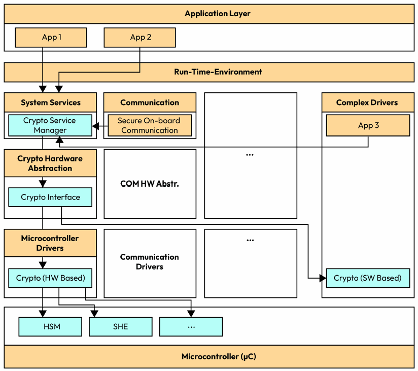

图 8.3 – 安全系统架构框图

利用 HSM 等硬件组件相比纯软件方案具有显著优势，因为它可以建立一个专用的、高度安全的环境，包含关键要素如核心、安全内存和硬件加速器。在这个安全环境内，可以实现以下关键功能：

- 向应用提供安全服务
- 安全存储密钥及相关安全资产
- 高效管理密钥和证书
- 执行加密算法，采用硬件和软件实现以提升性能和安全

---

### 其他安全辅助模块

以下部分模块位于其他栈中（例如 IdsM 和 KeyM 属于加密栈的一部分，而 SecOC 属于通信栈，因为它处理通信，但与加密栈密切协作以实现安全的 PDU 通信）：

- <strong>KeyM（Key Management，密钥管理）：</strong>负责处理加密密钥。它确保用于各种加密操作的密钥的安全生成、存储、分发和生命周期管理

- <strong>IdsM（Intrusion Detection System Manager，入侵检测系统管理器）：</strong>入侵检测系统（IDS）充当车辆的守卫，从分布于车辆各处的安全传感器收集数据，并发送到中央系统进行详细分析。此分析有助于制定强大的未来安全措施。IDS 由几个协同工作的关键组件组成，用于检测和响应网络威胁。软件传感器是编程算法，检测潜在的网络威胁并将此信息发送给 IdsM。IdsM 充当过滤系统，处理传入数据以识别和隔离相关信息。这些合格数据随后传输到入侵检测报告器（IdsR）并存储在安全事件存储器（SEM）中

- <strong>SecOC（Secure Onboard Communication，安全车载通信）：</strong>确保车辆网络内数据的安全传输。它与加密栈集成以提供加密保护，作为通信栈的一部分保护数据的完整性和真实性

- <strong>DCM（Diagnostic Communication Manager，诊断通信管理器）：</strong>使用加密栈通过执行加密操作（如认证和密钥验证）来管理安全访问级别。当诊断会话需要访问受限功能时，DCM 依赖加密栈安全处理认证挑战和响应，确保只有授权工具或用户才能访问敏感的 ECU 操作

---

现在我们已经强调了汽车 ECU 安全的重要性，接下来探索一些常见的安全用例，并研究加密栈如何用于实现这些用例。这将帮助我们理解加密服务在增强汽车安全方面的实际应用和集成。

---

## Crypto 栈用例与示例

AUTOSAR 中的加密栈是一个关键组件，服务于汽车系统内保护数据和通信安全的多种用例。加密栈在 AUTOSAR 中的一些关键用例包括安全通信、数据加密和数字签名。

### 数据加密

考虑以下场景：在基于 AUTOSAR 的嵌入式应用中，SWC A 需要通过 CAN（Controller Area Network）总线向 SWC B 安全传输敏感数据。为确保数据机密性，SWC A 使用 AUTOSAR 加密栈进行数据加密。

参与者：

- <strong>SWC A：</strong>敏感数据的发送方
- <strong>SWC B：</strong>加密数据的接收方
- <strong>AUTOSAR 加密栈：</strong>负责数据加密和解密的加密模块
- <strong>安全密钥管理：</strong>负责管理加密密钥的组件

前置条件：

- SWC A 和 SWC B 在 AUTOSAR 系统中已配置并正常运行
- AUTOSAR 加密栈已正确配置并集成到系统中
- 加密密钥（包括 SWC A 和 SWC B 之间的共享密钥）已由安全密钥管理组件安全建立并存储

图 8.4 展示了位于两个不同 ECU 上的 SWC A 和 SWC B 之间的数据交换过程。

---

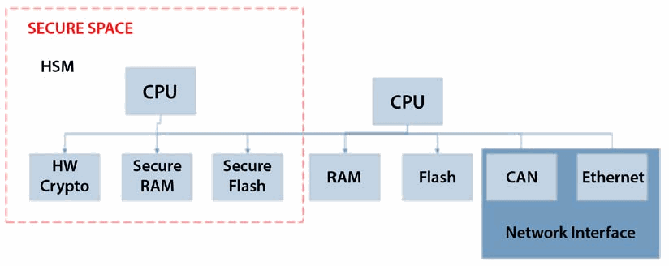

图 8.4 – 两个 ECU 之间的加密数据共享

---

主流程序列：

1. <strong>SWC A 数据准备：</strong>SWC A 生成需要传输给 SWC B 的敏感数据。发送数据前，SWC A 使用 AUTOSAR 加密栈启动数据加密过程

2. <strong>加密请求：</strong>SWC A 向 AUTOSAR 加密服务管理器发送请求，要求加密数据以进行安全传输。请求指定了待加密数据，并指明应使用特定密钥进行加密（如图 8.4 步骤 1 所示）

3. <strong>加密栈加密：</strong>AUTOSAR 加密栈接收加密请求，并使用共享密钥执行加密过程

4. <strong>加密数据传输：</strong>加密栈将加密数据返回给 SWC A（如图 8.4 步骤 2 所示）。然后 SWC A 才能通过通信栈通过 CAN 总线安全传输加密数据给 SWC B（如步骤 3 所示）

5. <strong>SWC B 接收数据：</strong>SWC B 通过 CAN 总线从 SWC A 接收加密数据。由于 SWC B 知道共享密钥，它已准备好解密传入数据（如图 8.4 步骤 5 和步骤 6 所示）

6. <strong>数据解密请求：</strong>SWC B 向 AUTOSAR 加密栈发送请求，指明需要使用共享密钥解密接收到的数据（如步骤 7 所示）

7. <strong>加密栈解密：</strong>AUTOSAR 加密栈处理 SWC B 的解密请求，利用共享密钥执行解密操作，逆转加密过程，恢复原始敏感数据

8. <strong>解密数据使用：</strong>SWC B 现在可以访问解密的敏感数据，可按其在嵌入式系统中的预期目的进行处理和使用（如步骤 8 和步骤 9 所示）

后置条件：

- SWC A 成功以加密形式将敏感数据传输给 SWC B，确保传输过程中的数据机密性
- SWC B 接收并解密了数据，使其能够访问和使用原始敏感信息

异常情况：如果加密或解密过程因密钥相关问题或加密错误而失败，AUTOSAR 加密栈内的适当错误处理机制将被触发，以确保数据的安全性和完整性。

重要说明：

- 使用共享密钥在 SWC A 和 SWC B 之间进行加密和解密，凸显了嵌入式 AUTOSAR 系统内安全密钥管理的重要性
- AUTOSAR 加密栈抽象了底层加密操作，简化了 SWC 实现数据加密和解密的过程，同时保持了高水平的安全性

---

### 安全通信（SecOC（Secure Onboard Communication，安全车载通信））

AUTOSAR 中的安全车载通信（SecOC）是一个关键组件，确保车辆网络内 ECU 之间交换数据的机密性和完整性。它在传输前为协议数据单元（PDU）添加安全特性，如 MAC 和新鲜度值（Freshness Value）。让我们通过一个示例来探讨 SecOC 如何在两个 ECU（ECU 1 和 ECU 2）之间的 CAN 网络中工作。

图 8.5 展示了如何使用 MAC 管理两个 ECU 之间的安全通信，描述了通信栈、加密栈和 SecOC 模块之间的交互过程。

---

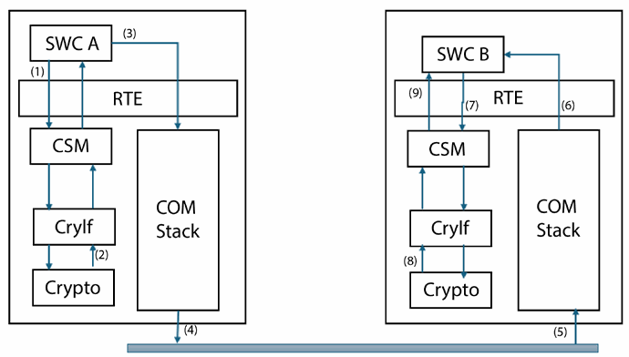

图 8.5 – SecOC 认证流程

---

以下步骤展示了数据在 ECU 1 中被 MAC 保护，然后在 ECU 2 中被验证的流程：

1. <strong>从 ECU 1 的 SWC 1 发送 PDU：</strong>

   - SWC 1 生成需要通过 CAN 网络发送到 ECU 2 的 PDU。此 PDU 包含关键信息（如传感器数据），必须保持机密并防止篡改
   - PDU 被交给 ECU 1 内的通信（COM）模块。COM 管理不同 ECU 之间 PDU 的传输

2. <strong>使用 SecOC 保护 PDU：</strong>

   - PDU 从 COM 传递给 ECU 1 内的 SecOC 模块。SecOC 负责为 PDU 添加安全特性
   - SecOC 与 CSM 交互以启动安全过程。CSM 管理 AUTOSAR 中的加密操作
   - CSM 与 CryptoIf 模块通信以请求加密服务
   - CryptoIf 充当 CSM 和加密模块之间的中介，抽象加密功能
   - 加密模块负责执行实际的加密操作，包括使用加密栈提供的加密算法进行 MAC 计算和新鲜度值生成
   - 加密操作完成后，受保护的 PDU（包括 MAC 和新鲜度值）返回给 SecOC

3. <strong>将受保护的 PDU 发送到 PDU 路由器（PDUR）：</strong>

   - SecOC 将受保护的 PDU（包括 MAC 和新鲜度值）传回 COM 模块
   - COM 将受保护的 PDU 发送到 PDUR 模块。PDUR 负责在不同通信层和总线之间路由和传输 PDU

4. <strong>通过 CanIf 发送受保护的 PDU 到 CAN 网络：</strong>

   - PDUR 将受保护的 PDU 转发给 CanIf 模块，后者处理通过 CAN 网络的数据传输

5. <strong>在 ECU 2 中接收并验证受保护的 PDU：</strong>

   - ECU 2 通过其 CanIf 模块经由 CAN 网络接收受保护的 PDU
   - 受保护的 PDU 随后交给 ECU 2 的 SecOC 模块

6. <strong>使用 SecOC 验证和解码受保护的 PDU：</strong>

   - ECU 2 的 SecOC 模块与 CSM、CryptoIf 和加密模块交互（类似于 ECU 1），以验证 MAC 和新鲜度值，确保数据完整性和真实性
   - 如果 MAC 和新鲜度值检查通过，则受保护的 PDU 被认为是真实可信的

7. <strong>将解码的 PDU 传递给 ECU 2 中的 SWC 2：</strong>

   - 解码和验证后的 PDU 传递给 ECU 2 的 COM 模块
   - COM 将 PDU 转发给 ECU 2 中的目标 SWC 2

通过这个详细过程，我们可以看到 CSM、CryptoIf 和加密模块如何保护和验证 PDU。此外，PDUR 还参与将受保护的 PDU 路由到 CAN 网络。

---

### 安全诊断

安全诊断已成为现代车辆维护和操作中的关键流程。随着汽车演变为高度互联和软件驱动的系统，保护诊断过程免受未授权访问和网络威胁的需求比以往更加重要。它确保只有授权人员才能访问和修改关键车辆数据。

该过程从技术人员使用安全凭证登录诊断工具开始，凭证随后由 ECU 进行验证。认证通过后，技术人员与 ECU 安全通信以获取诊断数据或执行必要操作（如软件更新）。在整个过程中，所有数据传输都被加密以防篡改或拦截。密钥或访问控制的验证通过 DCM 模块和加密栈服务来处理。图 8.6 展示了此过程的简要序列图。

---

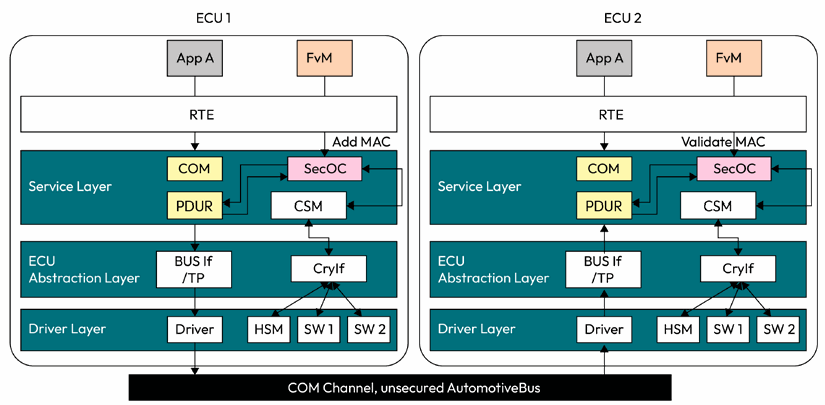

图 8.6 – 安全诊断流程

---

### AUTOSAR 中的安全启动（Secure Boot（安全启动））

安全启动是基于 AUTOSAR 的汽车系统中采用的关键安全机制，用于确保启动过程中 SWC 的完整性和真实性。它验证只有受信任且未被篡改的软件才能在车辆 ECU 上加载和执行。安全启动依赖加密技术，而 AUTOSAR 加密栈在启用和增强此过程的安全性方面发挥着关键作用。

以下是在基于 AUTOSAR 的车辆中应用安全启动确保 ECU 软件完整性的步骤：

1. <strong>初始化：</strong>

   - 车辆上电，ECU 启动引导过程
   - 在此阶段，ECU 硬件执行最小自检以确保其功能正常

2. <strong>安全启动序列：</strong>

   - 安全启动从加载初始引导加载程序开始，该程序存储在 ECU 的只读存储器（ROM）中
   - HSM 内部或安全区域中称为"信任根"（Root of Trust）的代码将尝试验证引导加载程序

3. <strong>引导加载程序验证：</strong>

   - 引导加载程序包含数字签名，该签名在开发过程中生成并在刷写引导加载程序到 ECU 时嵌入
   - 使用加密栈验证引导加载程序的数字签名
   - 如果签名验证失败，启动过程将停止，防止执行未授权或被篡改的代码

4. <strong>加载主应用程序：</strong>

   - 一旦引导加载程序的完整性得到确认，它将加载 AUTOSAR 兼容的软件，这些软件也可以像之前一样进行签名和验证

5. <strong>信任链：</strong>

   - 安全启动通过确保每个加载的组件都是受信任且未被篡改的，建立了一个信任链
   - 如果任何签名验证失败，加载过程将停止，受危害的组件将不会被执行

6. <strong>安全执行：</strong>

   - 一旦所有 SWC 经过验证并加载完毕，ECU 进入汽车应用的安全执行阶段

图 8.7 展示了如何利用 AUTOSAR 框架内的加密功能实现安全启动过程的示例。

---

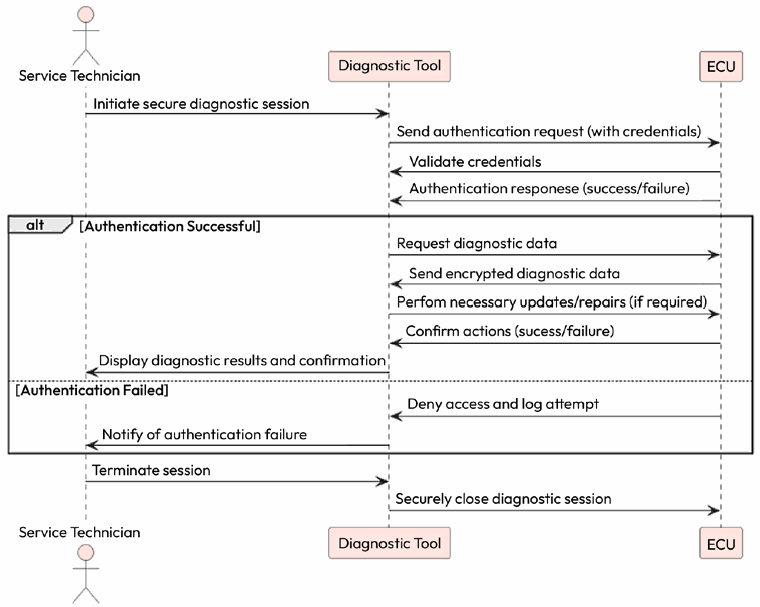

图 8.7 – 安全启动流程

---

### 加密栈在安全启动中的作用

AUTOSAR 加密栈在增强安全启动过程的安全性方面发挥着重要作用：

- <strong>密钥管理：</strong>加密栈管理用于验证数字签名的加密密钥，确保它们的机密性和完整性

- <strong>签名验证：</strong>它使用存储的公钥对引导加载程序、操作系统和 SWC 执行签名验证

- <strong>篡改检测：</strong>加密栈还可以通过监控 SWC 及其签名的完整性来协助检测篡改尝试

- <strong>安全存储：</strong>加密资产（包括密钥和证书）由加密栈安全存储和访问，以防止未授权操作

在此用例中，安全启动与 AUTOSAR 加密栈的组合确保只有受信任且未被篡改的软件被执行，保护 ECU 的功能性、可靠性和整体车辆安全。它提供了抵御未授权代码执行和潜在安全漏洞的强大防御。

---

## 本章小结

本章聚焦于 AUTOSAR 框架内的汽车网络安全。首先强调了汽车安全在当今互联世界中的重大意义，阐述了与远程黑客攻击和数据泄露相关的潜在风险——这些风险可能影响生命安全、数据隐私、财务稳定和法规遵从。

本章深入探讨了汽车安全的基本原则，定义了其目标：机密性、完整性、可用性和认证。同时明确区分了功能安全（Safety）与信息安全（Security），强调在 AUTOSAR 背景下必须同时关注这两个方面。

此外，本章强调了安全标准在汽车行业中的关键作用，概述了 ISO 21434、ISO 26262 以及 AUTOSAR 自身的安全需求和指南等关键标准，强调需要遵守这些标准以确保全行业的一致性和法规遵从。

本章接着探讨了 AUTOSAR 架构中的安全特性，特别关注加密栈。详细阐述了加密栈的核心组件——CSM、CryptoIf 和加密模块——阐明它们在安全管理加密操作中的各自角色。SecOC 被强调为确保障车辆网络内 ECU 之间数据机密性和完整性的关键组件，详细解释了保护和验证数据传输所涉及的步骤。

最后，本章强调了所呈现信息对于开发者和 AUTOSAR 新手的重要性：安全不仅关乎保护数据和系统，更关乎保护生命、财务稳定和遵守法规要求。鼓励开发者采用安全编码实践，认识到遗留系统的存在，并将供应链安全视为有效汽车安全策略的组成部分。

---

## 思考题

1. 汽车安全在 AUTOSAR 框架内为何至关重要？
2. 汽车安全的基本目标是什么？
3. 在 AUTOSAR 环境下，功能安全（Safety）与信息安全（Security）有何区别？
4. 加密栈在 AUTOSAR 中的作用是什么？其核心组件有哪些？
5. SecOC 如何为 AUTOSAR 中的汽车安全做出贡献？

---

## 第9章 内存与模式管理

本章探索 AUTOSAR 内存栈（Memory Stack）和模式管理——NVM（Non-Volatile Memory，非易失性存储器）如何确保关键数据在电源周期中得以保存，以及模式管理（Mode Management）如何协调 ECU 工作状态的转换。

---

# 第9章 内存与模式管理

AUTOSAR Fundamentals and Applications — Hossam Soffar 著 | AI 辅助翻译

---

## AUTOSAR 中的内存栈

将内存栈（Memory Stack）想象为图书馆的存储系统：每本书代表一段需要存储、编目和高效检索的数据。在 AUTOSAR 中，内存栈就是管理这个系统的图书管理员，确保关键信息在电源周期和系统重置后得以保留。

在 ECU 中，通常需要保存车辆设置、标定参数、诊断故障码（DTC（Diagnostic Trouble Code，诊断故障码），Diagnostic Trouble Code）以及其他对正常运行不可或缺的数据。BSW 内置了 NVM 栈，可使用 EEPROM 或 Flash 存储器进行存储。

---

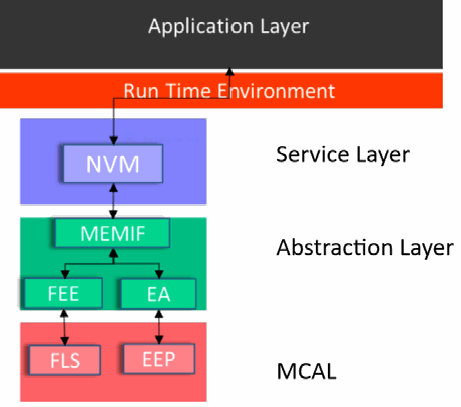

图 9.1 – 内存栈架构

### 各层模块详解

<strong>服务层——NvM（NVRAM Manager，NVRAM 管理器）：</strong>内存栈的核心组件，提供管理 NVM 操作的标准化接口和服务。关键功能包括数据块管理、读写操作和错误处理。

---

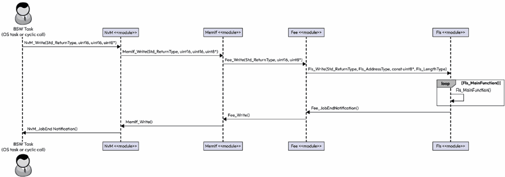

图 9.2 – 内存栈模块交互

<strong>抽象层：</strong>

- <strong>FEE（Flash EEPROM Emulation，Flash EEPROM 仿真）：</strong>在 Flash 存储器中模拟 EEPROM 行为
- <strong>EA（EEPROM Abstraction，EEPROM 抽象）：</strong>抽象外部 EEPROM 硬件，提供标准化接口
- <strong>MemIf（Memory Abstraction Interface，存储器抽象接口）：</strong>抽象底层 FEE 和 EA 模块的统一接口，提供读写擦除和块管理任务以及磨损均衡

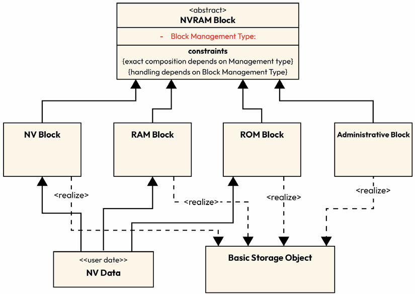

图 9.3 – 基本存储对象定义

<strong>MCAL 层：</strong>Fls（Flash Driver）和 Eep（EEPROM Driver）直接控制硬件存储器。

---

### NVM 使用流程

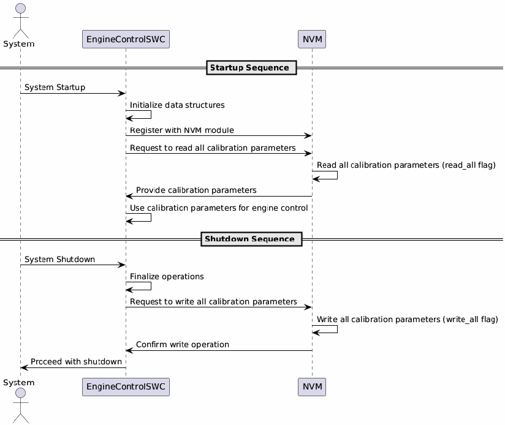

图 9.4 – 系统中 NVM 使用抽象序列图

SWC → RTE → NvM → MemIf → FEE/EA → Flash/EEPROM 驱动 → 物理存储器。数据可以在运行时立即写入，也可以延迟直到 ECU 关闭时才批量写入。可配置的设置控制数据何时以何种方式写入和读取——数据变更后立即写入还是延迟到系统关闭，启动时自动检索还是仅在特定请求时读取。

---

## 模式管理

### BSWM（BSW Mode Manager，BSW 模式管理器）

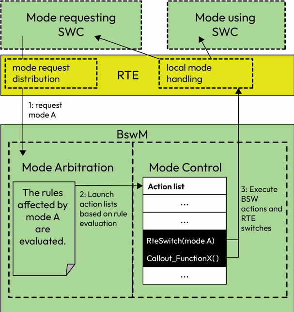

图 9.5 – BSWM 模式请求处理与控制

BSWM 基于规则评估系统条件并触发模式切换。它接收来自其他模块的模式请求，应用预定义的评估规则，并触发相应的模式控制动作。

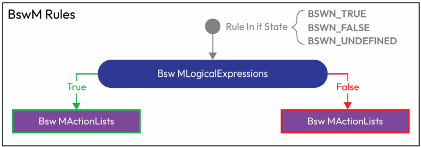

图 9.6 – BSWM 模式控制评估

每条规则包含"模式条件"（Mode Condition）和"模式控制"（Mode Control）两部分。当条件评估为 TRUE 时，执行对应的模式控制动作。

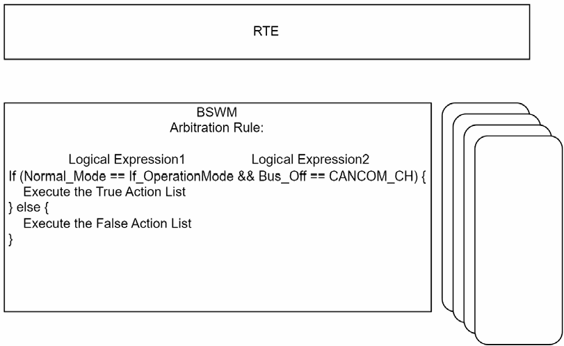

图 9.7 – BSWM 规则执行流程

<strong>ECUM（ECU State Manager，ECU 状态管理器）：</strong>控制 ECU 的整体状态转换——启动（Startup）、运行（RUN）、关闭（Shutdown）和休眠（Sleep）。启动序列包括初始化 BSW 模块、初始化 OS 和启动 RTE。

---

### 安全 ECU 关闭用例

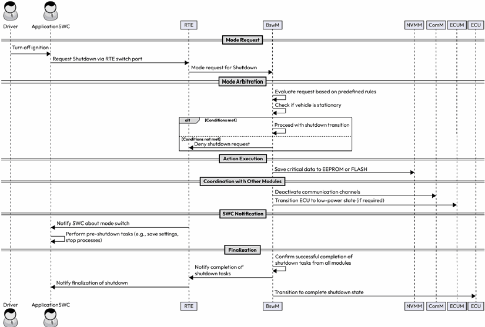

图 9.8 – 安全 ECU 关闭序列图

当检测到电压过低时，BSWM 触发安全关闭流程：通知 ECUM → 各模块将关键数据写入 NVM → 确认数据写入完成 → 系统安全关机。这确保在意外断电情况下重要数据不会丢失。

---

### 本章小结

本章探讨了 AUTOSAR 内存栈的结构——NvM、MemIf、FEE、EA、Fls 和 Eep 等模块如何在各层协同工作以在电源周期中保持数据完整性和可用性。模式管理部分讨论了 BSWM 基于规则的模式切换逻辑、ECUM 在管理 ECU 生命周期中的角色，以及电压过低时的安全关闭序列。

### 思考题

- ECU 内存栈的各个模块及其角色是什么？
- FEE 和 EA 在 AUTOSAR 中的区别？
- BSWM 如何基于规则触发模式切换？
- 描述安全 ECU 关闭的完整流程。

---

## 第10章 总结与知识拓展用例

本章作为全书的收尾，涵盖诊断概览、时间同步简介、如何阅读 AUTOSAR 标准文档，以及一个综合性的自动驾驶泊车辅助系统（Autonomous Parking Assist System）案例研究，将全书所学的各个模块整合为一个完整的实际应用。

---

# 第10章 总结与知识拓展用例

AUTOSAR Fundamentals and Applications — Hossam Soffar 著 | AI 辅助翻译

---

## 诊断概览

诊断（Diagnostics）对于确保车辆可靠性、安全性和性能至关重要。其主要目标包括检测故障、准确报告并提供维修机制。有效的诊断系统支持：早期故障检测（防止小问题升级为重大故障）、高效维护维修（精确故障信息减少停机时间）、法规遵从（排放和安全标准）以及客户满意度。

---

### DCM（Diagnostic Communication Manager，诊断通信管理器）

DCM 是 AUTOSAR 诊断栈的核心组件，确保车辆内部系统（发动机控制单元、变速箱控制和其他电子单元）能与外部诊断工具有效通信。关键功能：

- <strong>诊断会话管理：</strong>处理默认、编程和扩展会话，扩展会话提供对需要更高安全级别或更具侵入性功能的访问，如电机标定和调优参数
- <strong>安全与访问控制：</strong>通过 seed/key 算法管理安全访问级别，保护敏感诊断操作
- <strong>诊断请求处理：</strong>解释外部工具的诊断请求并转发给相应内部模块
- <strong>服务处理：</strong>支持 UDS（Unified Diagnostic Services，统一诊断服务，ISO 14229）和 J1939 等标准定义的诊断服务

UDS 是 ISO 14229 标准定义的协议，用于通过通信网络（通常是 CAN）诊断和配置车辆设备。它标准化了诊断工具与 ECU 之间的通信，支持跨不同品牌和车型的一致诊断。

---

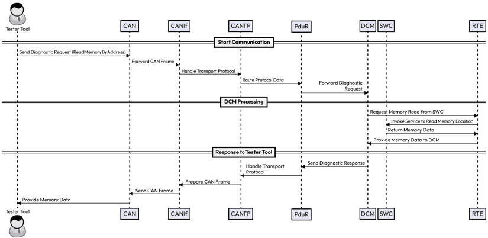

图 10.1 – DCM 在 AUTOSAR 架构中的序列图

上图展示了诊断会话过程：测试工具通过 CAN 发送诊断请求，依次经过 CAN、CanTp（CAN Transport Protocol，CAN 传输协议）和 PduR 到达 DCM。DCM 通过 RTE 与 SWC 交互执行内存读取操作，响应沿相同路径返回。

---

### DEM（Diagnostic Event Manager，诊断事件管理器）

DEM 负责诊断事件的管理和故障信息存储。核心职责：

- <strong>故障检测：</strong>SWC（作为监控器）监控各种信号和参数并报告事件给 DEM，DEM 执行防抖（Debouncing）等处理步骤
- <strong>事件状态管理：</strong>跟踪每个事件的状态——活跃、已确认、待定
- <strong>DTC 管理：</strong>记录诊断故障码（DTC，Diagnostic Trouble Code），如 P0301 表示 1 缸失火
- <strong>事件存储：</strong>维护事件存储供服务和维护期间访问

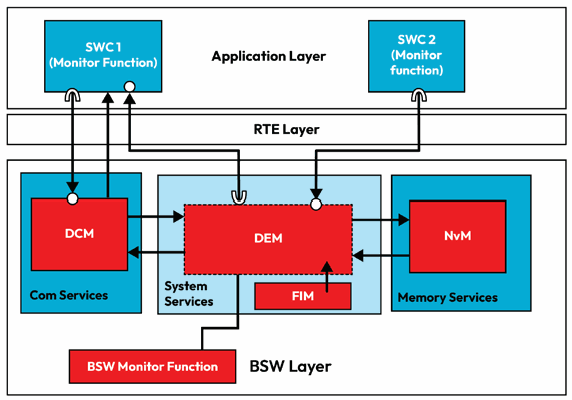

图 10.2 – AUTOSAR 架构中 DCM 与 DEM 的交互

---

### DET（Default Error Tracer，默认错误追踪器）

DET 是在汽车软件开发阶段使用的诊断方法。关键职责：错误检测（监控开发错误）、错误记录、调试支持以及内部错误检测（如错误函数调用、参数不匹配或断言失败）。DET 关注软件开发生命周期而非车辆运行诊断。例如，`CalculateEngineTorque()` 函数因代码 bug 被错误地用负发动机转速值调用，DET 会检测并记录此开发错误。

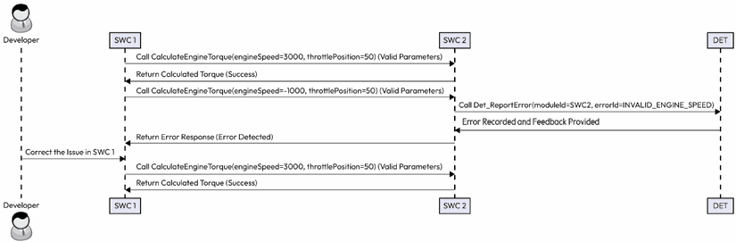

图 10.3 – DET 功能序列图

---

### FiM（Function Inhibition Manager，功能抑制管理器）

FiM 模块与 DEM 交互，管理诊断事件状态并基于故障条件控制功能启用/禁用。例如，转向系统检测到故障时抑制自动泊车功能，确保车辆安全运行。

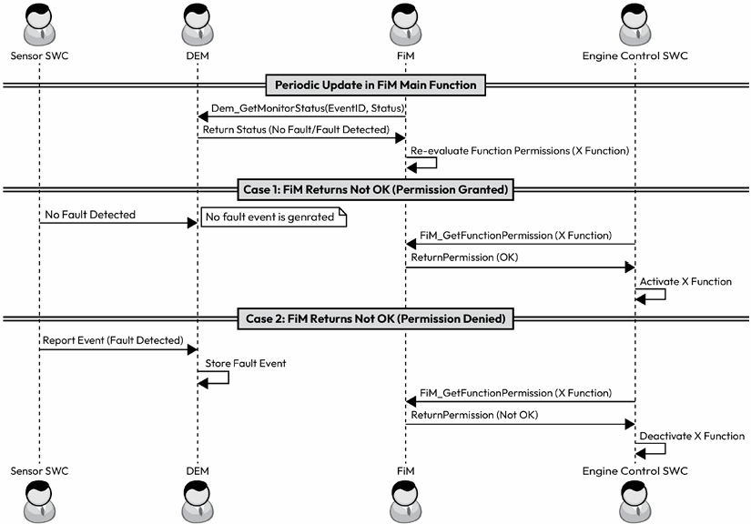

图 10.4 – FiM 功能序列图

诊断部分已涵盖 DCM、DEM、DET 和 FiM——每个模块都提供丰富的功能和配置，这里仅做了入门概述。接下来转向时间同步。

---

## 时间同步概览

AUTOSAR 中的时间同步（Time Synchronization）旨在通过专用时间同步协议和机制确保车辆内不同 ECU 之间的精确一致计时。时间关键型应用通常分布在通过 CAN、Ethernet 和 FlexRay 等车载网络连接的多个 ECU 上，每个 ECU 都有自己的源时钟。通过网关连接的不同协议节点间同步是混合网络架构的主要挑战——AUTOSAR 通过时间网关（Time Gateway）概念来解决。

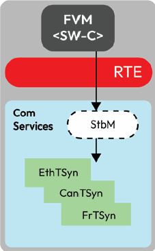

图 10.5 – 时间同步架构

核心概念：<strong>Time Master（时间主节点）</strong>负责生成和分发参考时间；<strong>Time Slave（时间从节点）</strong>接收时间更新并调整自身时钟与参考时间对齐。

---

<strong>精确时间同步为何重要：</strong>事件关联（跨 ECU 精确时间戳）、实时系统（ADAS 和自动驾驶需要精确时序）、传感器融合、通信协议要求（如 Ethernet）、日志记录和回放。

### StbM（Synchronized Time-Base Manager，同步时基管理器）

StbM 是管理时间同步的基础组件。核心功能：维护每个 ECU 上的本地时基、运行实体同步（配置运行实体在基于 StbM 提供的同步时基的特定时间执行）、支持多个时间域、计算本地时基与同步时间之间的偏移。四个关键时间同步模块：EthTSyn（Ethernet 时间同步）、CanTSyn（CAN 时间同步）、FrTSyn（FlexRay 时间同步）以及 StbM 本身。

---

### 用例——使用 StbM 同步雷达 ECU

场景：车辆有多个雷达 ECU，为避免雷达信号间干扰，每个雷达 ECU 需要以精确的 40µs 时间偏移触发其 RF 信号。StbM 确保所有雷达共享统一的时基，使每个雷达 ECU 能够在精确的时间点发射信号。

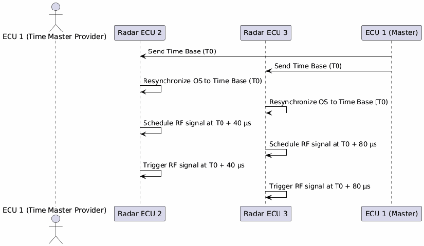

图 10.6 – 雷达 ECU 时间同步架构

---

### CanTSyn（CAN 时间同步）

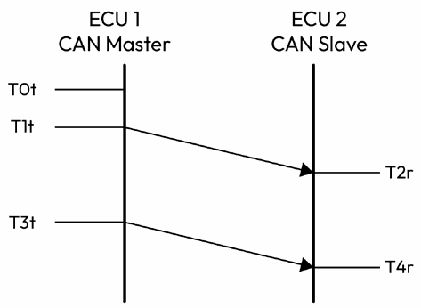

图 10.7 – CanTSyn 同步机制

CanTSyn 采用 PTP（Precision Time Protocol，精确时间协议）同步流程：Time Master 广播 SYNC 消息（含当前时间 T0t）→ Time Slave 记录精确接收时间 T2r → Time Master 发送 FUP（Follow-Up）消息（含实际传输与指示时间的差值 T1t−T0t）→ Slave 结合 SYNC 和 FUP 信息精确调整本地时钟。

---

## 如何阅读 AUTOSAR 标准

无论选择哪种配置工具，实现需求的关键在于理解定义 AUTOSAR 标准的规范文档。这些规范充当通用蓝图，概述每个模块的行为方式以及可用的配置参数。

### 核心文档类型

- <strong>SWS（Software Specification，软件规范）：</strong>定义软件模块的功能、需求、API 接口和详细行为描述
- <strong>TPS（Template Protocol Specification，模板协议规范）：</strong>定义特定模板的格式、结构和内容
- <strong>RS（Requirement Specification，需求规范）：</strong>概述高层需求，包括需求 ID、描述、优先级和依赖关系
- <strong>EXP（Explanatory Document，解释性文档）：</strong>提供特定概念、设计决策或过程的详细见解和理由

### 阅读方法

- <strong>从基础开始：</strong>先读概述文档和术语表
- <strong>聚焦相关章节：</strong>根据角色定位关键领域，寻找用例和示例
- <strong>系统化阅读：</strong>自上而下，从高层描述逐步到详细规范，持续参考架构图

---

## 下一步做什么？

跟上行业趋势、参与 AUTOSAR 社区、动手实践。AUTOSAR 官方通常每年发布两次新版本，持续学习是保持技能更新的关键。

---

### 案例研究——开发自动驾驶泊车辅助系统（AP）

用户故事：Yahya 在拥挤的城市环境中难以完成平行泊车。开发 AP 系统：检测空车位、自动控制转向和车速、通过 HMI 提供实时反馈。

---

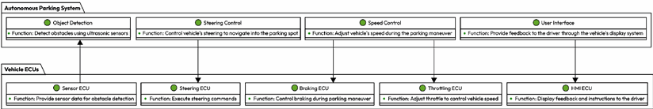

图 10.8 – AP 系统框图

<strong>功能需求：</strong>物体检测、转向控制、速度控制、用户界面

<strong>通信需求：</strong>CAN 收集超声波传感器数据、发送转向和速度命令、仪表盘显示状态

<strong>诊断需求：</strong>故障检测与报告、DTC 存储

<strong>安全需求：</strong>控制命令的数据完整性和认证（SecOC）

<strong>内存管理：</strong>持久存储 DTC 和系统日志

<strong>模式管理：</strong>管理不同运行模式（活跃、待机、故障）

---

| 需求 ID | 描述 |
| --- | --- |
| AP_SW_001 | 处理超声波传感器数据，实时检测障碍物 |
| AP_SW_002 | 基于障碍物检测触发转向调整或停车 |
| AP_SW_003 | 计算并发送转向角命令控制车辆转向 |
| AP_COM_001 | 通过 CAN 协议处理传感器、执行器和控制单元间的通信 |
| AP_CRY_001 | 通过 SecOC 确保控制命令的数据完整性和真实性 |
| AP_NVM_001 | 管理 NVM 存储 DTC 和系统日志 |
| AP_GEN_001 | ECU 软件符合 AUTOSAR 标准 |

---

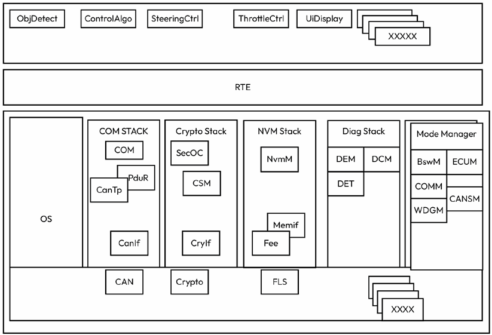

图 10.9 – AP ECU 建议软件架构

<strong>应用层 SWC：</strong>ObjDetect（物体检测，覆盖 AP_SW_001）处理超声波传感器数据。其他 SWC 如 ControlAlgo、SteeringCtrl、ThrottleCtrl 和 UIDisplay 同样通过 RTE 与底层 BSW 通信。

<strong>BSW 模块选择：</strong>

- <strong>通信栈（COM、PduR、CanTp、CanIf）：</strong>管理 CAN 数据交换；如需 Ethernet，添加 Eth、EthIf、TcpIp、SoAd、SD
- <strong>Crypto 栈（SecOC、CSM、CryIf、Crypto Driver）：</strong>保护传输数据，覆盖 AP_CRY_001
- <strong>诊断栈（DCM、DEM）：</strong>管理故障检测和 DTC 报告
- <strong>内存栈（NvM、FEE、MemIf）：</strong>NVM 数据管理，覆盖 AP_NVM_001
- <strong>模式管理（ECUM、BSWM、ComM）：</strong>管理 ECU 运行模式

---

### 全书总结

本书从 AUTOSAR 的起源出发，逐步深入分层架构、SWC 设计、事件与接口、OS、通信栈、安全栈、内存管理和诊断。通过本章的自动驾驶泊车辅助系统案例，我们看到了所有模块如何协同工作——应用层 SWC 实现核心算法，RTE 桥接通信，BSW 提供通信/安全/诊断/内存服务。

AUTOSAR 的成功在于标准化——让来自不同供应商的 ECU 和 SWC 能够无缝协作。继续深入阅读 AUTOSAR 标准文档，将这些知识应用于实际项目，是巩固和拓展技能的最佳途径。

### 思考题

- DCM 和 DEM 在诊断栈中各扮演什么角色？

- 为什么时间同步在分布式汽车系统中至关重要？

- StbM 的主要功能是什么？

- SWS、TPS、RS 和 EXP 四种文档类型分别用于什么目的？

- 总结本书学到的五个核心 AUTOSAR 概念。

---

