# 第6章 AUTOSAR 操作系统入门

AUTOSAR Fundamentals and Applications — Hossam Soffar 著 | AI 辅助翻译

---

AUTOSAR OS（Operating System，操作系统）策略性地定位于 AUTOSAR 栈中，与所有基础软件（BSW）层紧密交互，并在需要时直接管理和利用硬件（HW）。让我们再次查看其结构：

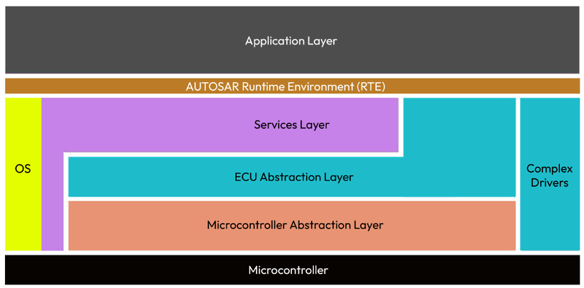

图 6.1 – AUTOSAR 架构中的 AUTOSAR OS

接下来的章节将提供关于实时操作系统（RTOS，Real-Time Operating System（实时操作系统））在嵌入式系统中的重要性，以及 OSEK/VDX（Offene Systeme und deren Schnittstellen für die Elektronik in Kraftfahrzeugen / Vehicle Distributed Executive）标准演进的重要见解——该标准为 AUTOSAR OS 的发展奠定了基础。

## 实时操作系统（RTOS）简介

RTOS 是专为需要精确时序和确定性行为的嵌入式系统设计的专用操作系统。与优先考虑最大化吞吐量和用户交互的通用 OS 不同，RTOS 旨在提供可预测性，并确保特定任务在严格的时间约束内执行。它擅长精确管理时间和系统资源，对关键事件提供快速响应时间。

RTOS 与常规 OS 的关键区别在于其主要关注点：常规 OS 旨在为多样化应用提供广泛的功能和服务，而 RTOS 优先考虑确定性行为和实时响应能力。它保证系统任务——特别是那些具有关键时序需求的任务——在其指定的时间限制内执行。

---

这一独特特性使得 RTOS 对时序至关重要的系统（如汽车控制单元）不可或缺。在汽车行业中，实时性能要求和绝对可靠性至关重要。现代车辆包含大量 ECU，它们必须无缝交互。制动和发动机控制等安全关键功能依赖于精确的时序和确定性行为。RTOS（如 AUTOSAR OS）为此类操作提供必要的功能和服务，包括基于优先级的调度、快速中断处理以及任务间通信和同步机制——所有这些必须在较小且确定的内存占用内实现。

## OSEK 简介

OSEK/VDX 标准出现于 1990 年代，代表了汽车行业主导的一项倡议。其目的是为车辆中部署的众多 ECU 创建一致的软件架构。随着 AUTOSAR OS 的出现，OSEK 标准的基本原则被采纳并进一步发展，以适应汽车软件应用不断演变的复杂性。

AUTOSAR OS 建立在 OSEK OS 标准的基础上，专为汽车控制单元的特定需求而设计。这包括理解和解决汽车应用的独特约束和实时需求。抢占式（Preemptive（抢占式））和非抢占式（Non-Preemptive（非抢占式））调度等关键特性被实现以实现有效的任务管理，促进处理资源的最佳利用。此外，资源管理策略被集成以缓解优先级反转（Priority Inversion（优先级反转））等挑战——即低优先级任务可能阻碍高优先级任务完成的情况。AUTOSAR OS 还集成了事件驱动的任务同步机制，为协调多个任务提供了更敏捷高效的系统。它还通过支持多核和灵活的调度策略进一步增强系统性能，并维护栈监控（Stack Monitoring（栈监控））原则——用于识别和防止栈溢出的工具。

---

下图描绘了 OS 作为计算机系统中央引擎的角色，说明了其与各种模块的交互及其与驱动层的关系：

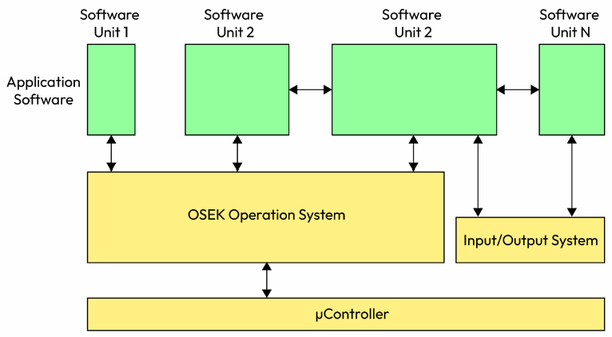

图 6.2 – OS 在嵌入式软件中的角色

## 配置 AUTOSAR OS

AUTOSAR OS 的配置发生在 AUTOSAR 方法论的集成阶段，这至关重要，因为它决定了 OS 如何管理系统资源、处理中断、调度任务以及与软件组件通信。

AUTOSAR OS 与 RTE——一个实现软件组件之间通信的中间件层——密切相关。这些软件组件通常是独立开发的，需要一种通用的方式来通信和交换数据。RTE 提供这种能力，并利用 AUTOSAR OS 的服务来实现。软件组件、RTE、BSW 模块和 AUTOSAR OS 被配置和集成。RTE 为每个软件组件生成描述文件，概述其接口和行为。这些信息用于生成适当的通信机制（如发送/接收函数）。RTE 还与实现底层硬件依赖功能（如通信协议和 I/O 管理）的 BSW 模块交互。

---

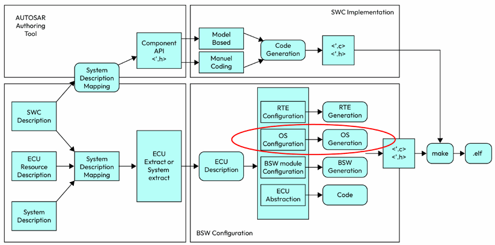

图 6.3 – 配置 AUTOSAR OS

## 探索 AUTOSAR OS 架构

AUTOSAR OS 由多个相互关联的对象组成，每个对象服务于管理系统资源和为软件应用提供服务的特定目的：

- **任务（Tasks）：**执行的基本构建块，本质上是由 OS 调用的 C 函数。它们是执行特定功能的独立软件元素，按预定顺序运行，通常由特定事件或刺激激活
- **闹钟（Alarms）：**基于时间的触发器，可用于在特定时间点调度任务执行或激活事件

---

- **事件（Events）：**代表可触发任务执行的发生或条件，任务、中断或其他系统组件也可以生成事件
- **服务（Services）：**OS 提供的预定义函数，促进常见操作，如任务间通信、内存管理和定时服务
- **调度（Scheduling）：**确定任务执行的顺序和优先级，确保较高优先级任务先于较低优先级任务执行
- **资源（Resources）：**多个任务可以访问和管理的共享实体，包括硬件外设、内存、通信通道和定时器

## 任务

AUTOSAR OS 提供两种不同的任务概念：**基础任务（Basic Tasks）**和**扩展任务（Extended Tasks）**。

### 基础任务

基础任务仅在满足特定条件时才释放处理器：任务终止、OS 切换到更高优先级任务、或中断发生触发处理器切换到中断服务例程（ISR，Interrupt Service Routine）。

---

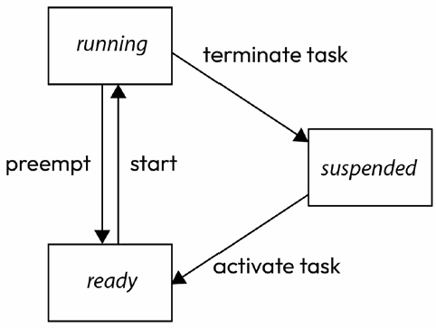

图 6.4 – 基础任务状态机

- **运行（Running）：**CPU 正积极执行该任务的指令。例如控制汽车发动机的嵌入式系统中，与发动机控制模块关联的任务持续运行，监控和控制各种发动机参数以确保最佳性能和效率
- **挂起（Suspended）：**任务暂时暂停，不被 CPU 执行。这可能发生在另一个任务优先级更高或任务主动让出控制权时
- **就绪（Ready）：**任务准备就绪可被 CPU 执行但正在等待轮次。任务已加载到内存中，所有必要资源已分配

总结示例：正常驾驶时，发动机管理任务保持运行状态，持续优化发动机性能。然而，如果检测到潜在碰撞，发动机管理任务可能暂时挂起以优先处理碰撞避免。同时，制动任务保持就绪，监控输入并等待驾驶员命令或需要制动干预的事件。

---

### 扩展任务

扩展任务相比基础任务提供额外的功能。它们能够利用 OS 的 `WaitEvent` 调用，进入等待状态（Waiting State）。此等待状态允许处理器被释放并分配给较低优先级任务，而无需终止当前运行的扩展任务。然而，扩展任务的管理对 OS 来说更复杂，需要比基础任务更多的系统资源。

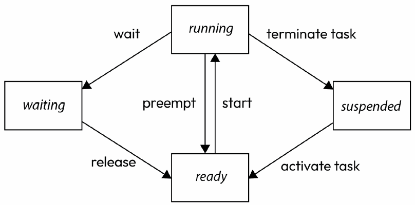

图 6.5 – 扩展任务状态机

等待状态是扩展任务在 OS 中的特定状态。在此状态下，任务正在等待特定事件、条件或资源才能继续执行。任务保持等待状态直到预期的事件或条件发生，此时它可以转为运行状态继续操作。在汽车嵌入式领域，传感器数据处理任务持续运行，通信任务在错误时可能暂时挂起，诊断任务等待触发事件，输入处理任务等待用户输入，如果任务需要排他访问共享资源，则可能被阻塞。

---

## 中断（Interrupts）

在嵌入式开发中，中断是指暂停程序正常执行并将控制权临时转移到称为 ISR 的特定代码段的信号或事件。中断是处理嵌入式系统中时间敏感事件和外部交互的基本机制。当发生中断时，它中断程序的当前执行，将处理器的注意力转移到与该特定中断关联的 ISR。ISR 执行必要的动作以响应事件或信号，如读取传感器数据、服务硬件设备或处理外部输入。

在 AUTOSAR OS 中，处理中断的函数分为两个 ISR 类别：

- **ISR 类别 1：**独立于 OS 服务运行。ISR 执行完毕后，处理从产生中断的指令处精确恢复。这意味着中断不影响任务管理。此类 ISR 具有最小的开销。

- **ISR 类别 2：**与 OS 交互。一旦类别 2 中的 ISR 完成执行，OS 可能执行任务切换或调整任务优先级。这是因为类别 2 ISR 可以调用 OS 服务，如激活任务或设置事件。

---

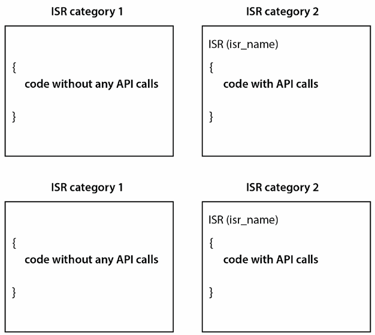

图 6.6 – ISR 类别

在类别 1 ISR 中，它们不受 OS 管理且独立运行。另一方面，类别 2 ISR 由 OS 通过 OS 框架管理。这种区分允许根据 ISR 的类型在 AUTOSAR 框架内进行不同的处理和管理。

## 事件（Events）

在 AUTOSAR OS 中，事件是向扩展任务提供系统内各种状态变化或发生的关键提示的信号机制。这些由 OS 管理的实体与扩展任务紧密关联，不是独立元素，而是补充这些任务的辅助对象。每个扩展任务关联一组独立的事件，成为这些事件的所有者。AUTOSAR 中的事件有两个关键属性：所属任务和唯一标识符（通常称为名称或掩码）。激活扩展任务后，OS 会系统地清除相关事件，为下一次任务做好准备。

---

AUTOSAR OS 提供管理事件的 API 函数：

- **SetEvent：**为特定任务设置事件，等待该事件的任务将被解除阻塞并准备执行
- **ClearEvent：**清除任务的指定事件
- **WaitEvent：**阻塞调用任务的执行直到其某一事件被设置
- **GetEvent：**读取任务当前待处理的事件

让我们考虑一个示例，有两个任务——Task1 和 Task2。Task1 设置事件 Event1，Task2 等待此事件发生：

```
# define Event1 0x01
TASK(Task1)
{
    // ... Task1's processing ...
    // Set the Event1 for Task2
    SetEvent(Task2, Event1);
    // Terminate Task1
    TerminateTask();
}
TASK(Task2)
{
    // Wait for the Event1
    WaitEvent(Event1);
    // If the execution reaches this point, it means Event1 occurred
    // ... Task2's processing ...
    // Clear the Event1
    ClearEvent(Event1);
    // Terminate Task2
    TerminateTask();
}
```

---

在此示例中，Task2 使用 `WaitEvent` 等待 Event1。在 Event1 被设置之前，Task2 保持等待状态。Task1 在完成处理时使用 `SetEvent` 设置 Event1。一旦 Event1 被设置，Task2 从等待状态转为就绪状态并继续执行。处理事件后，Task2 使用 `ClearEvent` 清除 Event1 然后终止。这种机制使任务能够基于特定的系统状态或发生事件来同步其执行。

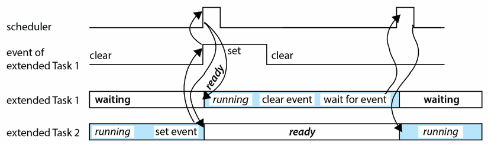

图 6.7 – 任务间的事件

## 调度（Scheduling）

### 完全抢占式调度（Full Preemptive Scheduling）

这种调度类型允许正在运行的任务在任何指令处基于 OS 设定的预定义触发条件被重新调度。当更高优先级任务准备好执行时，当前运行的任务被置于就绪状态并保存其执行上下文。更高优先级任务随后被调度执行。这种抢占行为确保更高优先级任务立即获得处理器访问权，一旦更高优先级任务完成执行或被阻塞，先前被抢占的任务可以从被抢占时的确切位置恢复执行：

---

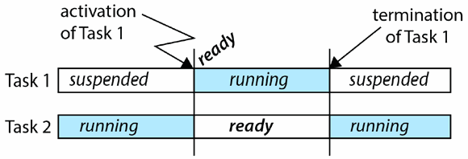

图 6.8 – 完全抢占式调度

### 非抢占式调度（Non-Preemptive Scheduling）

也称为协作式调度（Cooperative Scheduling（协作式调度）），任务持续执行直到它们主动放弃控制权或遇到显式的重调度点。任务切换仅通过明确定义的系统服务或特定重调度点发生。非抢占式调度对时序需求施加特定约束——当低优先级任务进入不可抢占区域时，可能导致高优先级任务执行延迟直到下一个重调度点：

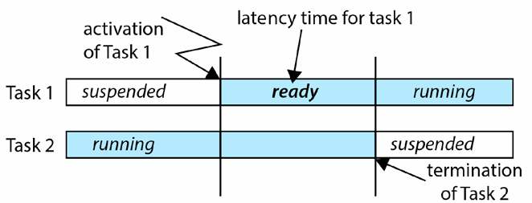

图 6.9 – 非抢占式调度

---

时序保护通过最高优先级优先（Highest Priority First（最高优先级优先））策略确保。同优先级任务以 FIFO（First In, First Out）方式分组，共享公共资源。一次只允许一个任务占用共享资源，不支持同组内抢占。

## 任务触发机制

### 闹钟（Alarms）

闹钟是 AUTOSAR OS 中关键的时间驱动实体，与计数器（Counters（计数器））紧密关联——计数器是以 tick 为单位计数的软件计时器。计数器的每次 tick 可以代表任意时间周期，实践上通常设置为与 OS 调度器 tick 匹配。计数器可以按固定时间间隔（系统计数器）、通过硬件中断（硬件计数器）或由应用软件手动（软件计数器）来递增。当计数器达到预设计数值时，关联的闹钟到期并执行预定义动作：

- **激活任务：**到期时闹钟可以激活特定任务，实现精确的任务调度和时间驱动行为
- **设置事件：**闹钟也可以为特定任务设置事件，为任务基于特定系统状态同步执行提供方式

---

```
# define ALARM_CYCLE 10
TASK(Task1)
{
    // Task1 processing here
    TerminateTask();
}
void setup(void)
{
    SetRelAlarm(Alarm1, ALARM_CYCLE, ALARM_CYCLE);
}
void main(void)
{
    setup();
    while(1)
    {
        IncrementCounter(Counter1);
        AlarmCheck();
        if (CheckAlarmExpired(Alarm1)) {
            ActivateTask(Task1);
        }
    }
}
```

`SetRelAlarm` 函数配置 Alarm1 在 ALARM_CYCLE 次计数器 tick 后启动，之后每 ALARM_CYCLE 次 tick 到期。当闹钟到期时触发 Task1 的激活。

---

### 调度表（Schedule Tables（调度表））

调度表提供比闹钟和计数器更高层次的抽象，允许精确的任务调度和基于时间的事件设置。可以将其视为行动时间表——由多个步骤组成，每个步骤对应一个时间点。当到达特定步骤的时间时，调度动作（如任务激活或事件设置）发生：

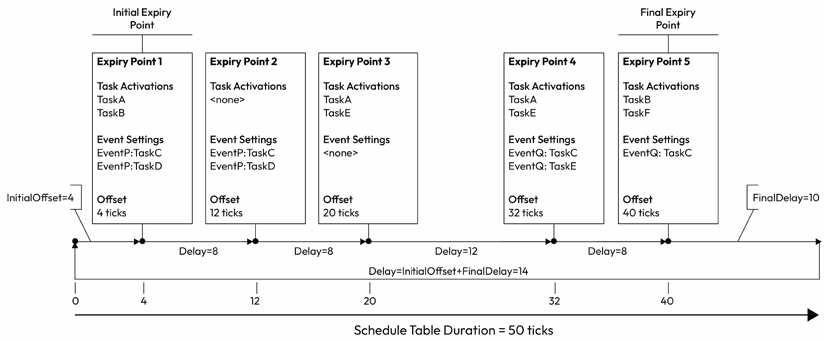

图 6.10 – 调度表示例

AUTOSAR OS 支持相对调度表和同步调度表。相对调度表一经启动即开始运行，每一步时序相对于表的开始。同步调度表则同步到外部时间源，在 ECU 间同步中发挥重要作用——车辆中多个 ECU 经常需要协调动作以实现整体系统目标。

---

```
// On ECU1 (master)
# define SYNC_CYCLE 100 // Sync signal every 100 ms
TASK(SyncTask)
{
    SendSyncSignal();
    SetRelAlarm(SyncAlarm, SYNC_CYCLE, SYNC_CYCLE);
    TerminateTask();
}

// On ECU2 (slave)
void OnSyncSignalReceived(TickType syncTime)
{
    SyncScheduleTable(SlaveScheduleTable, syncTime);
}
```

ECU1 使用任务和闹钟周期性地生成同步信号。ECU2 接收同步信号后，使用 `SyncScheduleTable` 将 SlaveScheduleTable 调度表同步到同步信号，确保 SlaveTask 在接收同步信号后 50ms 激活。

---

## OS 资源

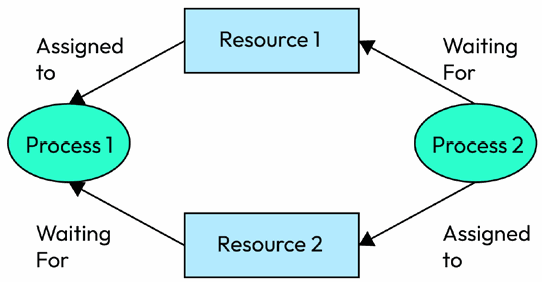

图 6.11 – 两个任务间的共享资源

核心原则：**排他访问**（两个任务不能同时占用同一资源）、**优先级反转预防**（采用优先级继承协议，Priority Inheritance Protocol（优先级继承协议））、**死锁避免**（Deadlock Avoidance（死锁避免））、**非阻塞访问**（资源访问永不导致等待状态）。

```
# define RESOURCE_ID 1
TASK(Task1)
{
    GetResource(RESOURCE_ID);
    // Critical section, access the shared resource here...
    ReleaseResource(RESOURCE_ID);
    TerminateTask();
}
```

---

## 钩子函数（Hooks）

钩子函数是用户可实现的回调函数，在 OS 执行的特定点被调用以自定义和扩展 OS 行为。常用钩子：

- **任务/ISR 执行钩子：**在每个任务执行前后调用，用于监控任务行为、收集运行时信息、性能分析和异常检测
- **关闭钩子（Shutdown Hooks）：**系统关闭或进入低功耗状态时调用，用于清理任务、保存关键数据到 NVM（非易失性存储器）或确保系统处于安全关闭状态

---

- **错误钩子（Error Hooks）：**当 OS 内发生错误条件时触发，用于捕获错误信息、执行错误处理例程和采取适当措施以减轻错误影响

钩子函数在 AUTOSAR 系统中很实用，但应精心设计以避免引入不必要的开销。钩子函数应高效、非阻塞，对系统性能影响最小。

### 本章小结

本章探索了 AUTOSAR OS 在汽车软件开发中的关键角色。我们讨论了其架构、RTOS 基础和 OSEK 标准。AUTOSAR OS 基于优先级的调度、快速中断处理和任务间通信能力使开发者能够开发高性能和时间关键的汽车软件系统。你熟悉了任务、闹钟、事件、服务、调度、资源和中断等核心元素，能够有效配置和管理这些组件。资源管理确保共享资源的协调访问和冲突预防。钩子函数提供了在 OS 关键点扩展功能的机制。在下一章中，我们将深入探索应用层、RTE 以及软件组件如何设计。

### 思考题

- 描述 AUTOSAR OS 的主要对象。
- 基础任务和扩展任务之间有什么区别？
- 何时在 OS 配置器中选择 FULL 或 NON 作为任务属性？
- 如何保护共享资源？

---

## 第7章 探索通信栈

通信栈（Communication Stack）是 AUTOSAR 框架的核心支柱，将多样化模块交织在一起，创建数据交换和功能集成的和谐交响。在本章中，我们的探索将集中在构成 AUTOSAR 通信栈的各个模块及其在促进汽车 ECU 内通信协议方面的重要性。我们将剖析通信栈的每一层，揭示其目的和设计考虑，检查其模块，阐明它们复杂的相互依赖关系，并介绍关键术语——消息（Message）、帧（Frame）、协议数据单元（PDU，Protocol Data Unit）和信号（Signal）。