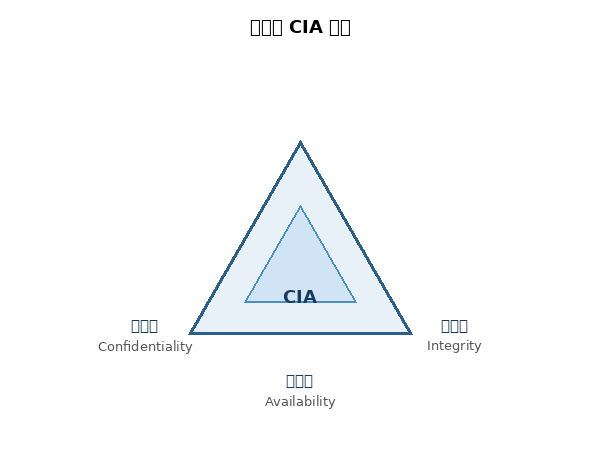
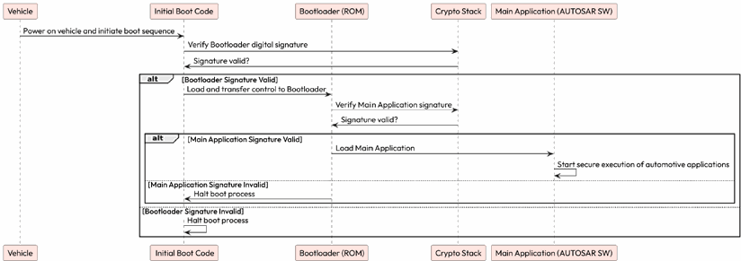

# 第8章 使用 Crypto 与安全栈保护 AUTOSAR 系统

AUTOSAR Fundamentals and Applications — Hossam Soffar 著 | AI 辅助翻译

---

## 汽车安全简介

想象一下驾驶一辆可以被远程入侵的汽车——不仅危及你的安全，还威胁到你的个人数据安全。这个噩梦般的场景凸显了在当今互联世界中汽车安全的至关重要性。近年来，汽车行业经历了显著的变革。现代车辆配备了先进功能，包括信息娱乐系统、远程信息处理和自动驾驶能力。虽然这些创新提高了便利性和安全性，但也引入了新的脆弱性。

汽车安全为何备受关注，尤其是在 AUTOSAR 的背景下：

- **生命安全问题：**车辆正日益成为轮子上的计算机，任何安全漏洞都可能产生危及生命的后果——例如黑客控制车辆制动系统导致碰撞

- **数据隐私：**车辆收集从驾驶偏好到定位数据等大量信息，保护这些数据关乎用户信任和 GDPR 等法规遵从

- **财务影响：**安全漏洞导致召回、法律赔偿和公司声誉损害的巨额损失

- **不断演变的威胁：**黑客和网络犯罪分子持续开发新的攻击手段

- **法规遵从：**全球各国政府正在引入严格的汽车网络安全法规

---

## 汽车安全基础



图 8.1 – 安全的 CIA 目标

汽车安全围绕 CIA 三要素构建：

- **机密性（Confidentiality）：**只有授权方才能访问敏感数据和通信

- **完整性（Integrity）：**数据在存储和传输过程中不被未授权篡改

- **可用性（Availability）：**系统和数据在需要时可供授权用户使用

---


图 8.2 – 安全（Security）与功能安全（Safety）的重叠

功能安全（ISO 26262）和网络安全（ISO 21434）在现代车辆中紧密交织。一次成功的网络攻击（如制动系统被劫持）可能导致功能安全失效。两者必须协同考虑——安全的车辆必须在功能安全和网络安全两个维度上都得到保护。

---

## AUTOSAR 安全栈架构


图 8.3 – AUTOSAR 安全栈架构

AUTOSAR 加密栈通过软件和硬件两种方式实现。软件加密依赖 ECU 的 CPU 或微控制器执行算法，而硬件加密利用微控制器内的专用加密模块或协处理器，如硬件安全模块（HSM（Hardware Security Module，硬件安全模块），Hardware Security Module），专门设计用于加速加密操作，提供更快更高效的处理。

---


图 8.4 – 安全系统架构框图

AUTOSAR 安全栈的关键模块：

- **CSM（Crypto Service Manager，加密服务管理器）：**提供标准化的加密服务接口，抽象底层加密实现细节。为上层应用提供统一的加密、解密、MAC（Message Authentication Code，消息认证码）生成和哈希计算服务：

```
Std_ReturnType Csm_Encrypt(uint32 jobId, Crypto_OperationModeType mode,
    const uint8* dataPtr, uint32 dataLength,
    uint8* macPtr, uint32* macLengthPtr);

Std_ReturnType Csm_MacGenerate(uint32 jobId, Crypto_OperationModeType mode,
    const uint8* dataPtr, uint32 dataLength,
    uint8* macPtr, uint32* macLengthPtr);

Std_ReturnType Csm_Hash(uint32 jobId, Crypto_OperationModeType mode,
    const uint8* dataPtr, uint32 dataLength,
    uint8* resultPtr, uint32* resultLengthPtr);
```

---

- **CryIf（Crypto Interface，加密接口）：**管理密钥和加密原语访问的统一接口层，在 CSM 和底层 Crypto Driver 之间提供抽象

- **Crypto Driver：**底层加密驱动，直接与 HSM 或软件加密库交互，执行实际的加密操作

- **SecOC（Secure Onboard Communication，安全车载通信）：**为 PDU 添加认证信息以验证消息的完整性和真实性。工作机制：发送方获取新鲜度值（Freshness Value）→构造认证数据→使用密钥生成 MAC→将 MAC 和新鲜度值附加到 PDU。接收方验证新鲜度值和 MAC 一致性，拒绝被篡改或重放的消息

---

### 加密数据交换示例


图 8.5 – 两个 ECU 之间的加密数据共享

SWC A（发送方）请求 CSM 使用指定算法和密钥加密数据→CSM 通过 CryIf 调用 Crypto Driver 执行加密→密文通过通信栈传输到另一个 ECU→SWC B（接收方）请求 CSM 解密密文→获取原始明文数据。

---

### SecOC 认证流程


图 8.6 – SecOC 认证流程

SecOC 在发送端为每个安全 PDU 生成新鲜度值和 MAC，接收端通过验证 MAC 来确认消息未被篡改且不是重放攻击。

---

### 安全诊断


图 8.7 – 安全诊断流程

诊断访问需要安全认证——通过 seed/key 算法验证诊断工具的身份，防止未经授权的诊断操作修改 ECU 配置或刷写固件。

---

### 安全启动（Secure Boot（安全启动））


图 8.8 – 安全启动流程

ECU 上电启动时验证固件的数字签名：加载固件→计算哈希值→使用存储的公钥验证签名→签名有效则正常启动，无效则拒绝启动或进入安全恢复模式。这确保只有经过认证的固件能够在 ECU 上运行。

---



图 8.9 – 安全刷写流程

**安全刷写（Secure Flashing（安全刷写））：**在 ECU 固件更新期间，新固件必须先通过数字签名验证，确保其来源可信且未被篡改，然后才能写入 ECU 存储器。

### 本章小结

本章探讨了 AUTOSAR 中的汽车网络安全，涵盖 CIA 安全三要素（机密性、完整性和可用性）、安全与功能安全的交集，以及 AUTOSAR 安全栈的核心组件——CSM、CryIf、Crypto Driver 和 SecOC。通过加密数据交换、安全诊断、安全启动和安全刷写等实际用例，我们了解了加密栈如何保护现代汽车系统免受网络威胁。

### 思考题

- 说明 SecOC 解决的问题及其实现机制。
- CSM 和 CryIf 之间的区别是什么？
- 在 AUTOSAR 中使用 HSM 的优势有哪些？
- 描述安全启动的完整流程。

---

## 第9章 内存与模式管理

本章探索 AUTOSAR 内存栈（Memory Stack）和模式管理——NVM（Non-Volatile Memory，非易失性存储器）如何确保关键数据在电源周期中得以保存，以及模式管理（Mode Management）如何协调 ECU 工作状态的转换。