# Real-Time Systems 实时系统设计原则

*Hermann Kopetz · Wilfried Steiner | 第三版 | 2022 — 中文版*

---

## 目录

1. [第1章 实时系统环境](#第1章-实时系统环境)
2. [第2章 简洁性](#第2章-简洁性)
3. [第3章 全局时间](#第3章-全局时间)
4. [第4章 实时模型](#第4章-实时模型)
5. [第5章 时间关系](#第5章-时间关系)
6. [第6章 可靠性](#第6章-可靠性)
7. [第7章 实时通信](#第7章-实时通信)
8. [第8章 功耗与能效意识](#第8章-功耗与能效意识)
9. [第9章 实时操作系统](#第9章-实时操作系统)
10. [第10章 实时调度](#第10章-实时调度)
11. [第11章 系统设计](#第11章-系统设计)
12. [第12章 验证](#第12章-验证)
13. [第13章 物联网](#第13章-物联网)
14. [第14章 云计算与雾计算](#第14章-云计算与雾计算)

---

# 第1章 实时系统环境

Real-Time Systems — Hermann Kopetz & Wilfried Steiner 著 | AI 辅助翻译

---

## 本章概述

本章作为引言，旨在从多个不同的视角描述实时计算机系统的环境。扎实理解界定实时应用的技术和经济因素，有助于理解系统设计师必须应对的种种需求。本章从实时系统的定义开始，讨论其功能性需求和非功能性需求。特别强调从控制应用那些已被充分理解的特性中推导出的时间需求。控制算法的目标在于驱动一个过程，使其满足某个性能准则。环境中发生的随机扰动会降低系统性能，控制算法必须予以考虑。控制系统本身引入控制环路的任何额外不确定性——例如控制环路产生不可预测的抖动——都会导致控制质量下降。

在第 1.2、1.3、1.4 和 1.5 节中，我们从多个视角对实时应用进行了分类。特别强调了硬实时系统与软实时系统之间的本质区别。由于软实时系统不存在严重的失效模式，其设计通常采用不那么严格的方法。有时，出于经济上的考量，人们会接受一种资源不足的解决方案，它无法处理极少发生的峰值负载场景。而在硬实时应用中，这种做法是不可接受的——因为在所有规定的情形下（即使极为罕见），设计的安全性必须向认证机构提供证明。在第 1.6 节中，我们对实时系统市场进行了简要分析，重点关注嵌入式实时系统领域。嵌入式实时系统是自包含产品的一部分，例如一台电视机或一辆汽车。嵌入式实时系统——也称为信息物理系统（CPS）——构成了实时技术和整个计算机行业最重要的市场细分。

---

## 1.1 何时一个计算机系统是"实时"的？

实时计算机系统是这样一种计算机系统：其系统行为的正确性不仅取决于计算的逻辑结果，还取决于产生这些结果的物理时间。所谓系统行为，是指系统输出在时间上的序列。

我们将时间的流动建模为一条从过去延伸至未来的有向时间线。时间线上的一个切点称为一个**时刻**（instant）。任何发生在某一时刻的理想化发生称为一个**事件**（event）。描述一个事件的信息（另见第 5.2.4 节关于事件观测的内容）称为**事件信息**（event information）。当前的时间点——**现在**（now）——是一个非常特殊的事件，它将过去与未来分离开来（此处呈现的时间模型基于牛顿物理学，忽略了相对论效应）。时间线上的一个区间，由两个事件定义——起始事件和终止事件——称为一个**持续时长**（duration）。一个数字时钟将时间线分割为一系列等长的持续时长，称为该时钟的**颗粒**（granules），这些颗粒由特殊的周期性事件——时钟的**滴答**（ticks）——来界定。

实时计算机系统始终是一个更大系统的一部分——这个更大的系统称为实时系统或信息物理系统。实时系统会随物理时间的变化而变化，例如，即使在控制它的计算机系统停止后，一个化学反应仍然会继续改变其状态。将一个实时系统分解为一组自包含的子系统（称为集群）是合理的。图 1.1 中给出了集群的示例：需要被控制的物理装置或机器（受控集群）、实时计算机系统（计算集群）以及人类操作员（操作员集群）。我们将受控集群和操作员集群统称为计算集群（实时计算机系统）的**环境**。

如果实时计算机系统是分布式的（大多数都是如此），则它由一组通过实时通信网络互连的（计算机）节点组成。人类操作员与实时计算机系统之间的接口称为人机接口，受控对象与实时计算机系统之间的接口称为仪器接口。人机接口由与操作员交互的输入设备（如键盘）和输出设备（如显示器）组成。仪器接口由传感器和执行器组成，它们将受控集群中的物理信号（如电压、电流）转换为数字形式，反之亦然。


图 1.1 实时系统

（cluster = 集群, operator = 操作员, real-time computer system = 实时计算机系统, controlled object = 受控对象, man-machine interface = 人机接口, instrumentation interface = 仪器接口）

---

实时计算机系统必须在其环境（受控集群或操作员集群）所决定的时间区间内对环境中的激励做出反应。结果必须被产生出来的时刻称为**截止时间**（deadline）。如果一个结果在截止时间过后仍有效用，该截止时间被归类为**软**截止时间（soft）；否则为**确定**截止时间（firm）。如果错过一个确定截止时间可能导致严重的后果，则该截止时间称为**硬**截止时间（hard）。

**示例：**考虑铁路道口前道路上的一盏交通信号灯。如果该交通信号灯在火车到达前没有变为红色，就可能导致事故。

一个必须满足至少一个硬截止时间的实时计算机系统称为硬实时计算机系统或安全关键实时计算机系统。如果不存在硬截止时间，则该系统称为软实时计算机系统。

硬实时系统的设计与软实时系统的设计有着本质上的不同。硬实时计算机系统必须在所有指定的负载和故障条件下维持有保证的时间行为，而软实时计算机系统偶尔错过截止时间是可以容许的。软、硬实时系统之间的区别将在后续各节中详细讨论。本书的重点是硬实时系统的设计。

## 1.2 功能性需求

实时系统的功能性需求涉及实时计算机系统必须执行的功能。它们被分为数据采集需求、直接数字控制需求和人机交互需求。

---

### 1.2.1 数据采集

一个受控对象——例如一辆汽车或一个工业装置——会随时间而改变其状态（本书中，凡不加限定地使用"时间"一词，均指第 3.1 节所描述的物理时间）。如果我们冻结时间，就可以通过记录该时刻状态变量的值来描述受控对象的当前状态。以汽车这一受控对象为例，其可能的状态变量包括：汽车的位置、速度、仪表板上开关的位置，以及气缸中活塞的位置。通常，我们并不关心所有状态变量，而只关心其中对我们有意义的子集。一个有意义的状体变量称为一个**实时（RT）实体**（real-time entity）。

每个 RT 实体都处于某个子系统的**控制域**（SOC，Sphere of Control）内，也就是说，它属于一个有权修改该 RT 实体值的子系统（另见第 5.1.1 节）。在其控制域之外，一个 RT 实体的值可以被观测，但其语义内容（见第 2.2.4 节）不能被修改。例如，发动机气缸中活塞的当前位置处于发动机的控制域内。在汽车发动机之外，活塞的当前位置只能被观测，但我们无权修改此观测的语义内容（语义内容的表示是可以改变的）。

实时计算机系统的第一个功能性需求是观测受控集群中的 RT 实体并收集这些观测结果。对一个 RT 实体的观测在计算机系统中由一个**实时（RT）镜像**（real-time image）来表示。由于受控对象在受控集群中的状态是实时的函数，一个给定的 RT 镜像只在有限的时间区间内保持时间准确性。该时间区间的长度取决于受控对象的动态特性。如果受控对象的状态变化非常快，对应的 RT 镜像就只有一个非常短的准确性区间。

**示例：**考虑图 1.2 中的例子，一辆汽车进入一个由交通信号灯控制的交叉路口。"交通信号灯为绿色"这一观测在时间上是多长有效的？如果"交通信号灯为绿色"这一信息在其准确性区间之外被使用——例如一辆汽车在交通信号灯已变为红色后才进入交叉路口——就可能发生事故。在此例中，准确性区间的上界由交通信号灯黄灯阶段的持续时间给出。只有当观测在汽车驶过交叉路口的整个期间始终保持时间准确时，汽车才能安全进入。


图 1.2 交通信号灯信息的时间准确性

（"the traffic light is green" = 交通信号灯为绿色; "how long is the observation temporally accurate?" = 此观测在多长时间内保持时间准确性？）

---

所有保持时间准确性的受控集群实时镜像的集合称为**实时数据库**（real-time database）。每当一个 RT 实体改变其值时，实时数据库都必须被更新。这些更新可以周期性进行——由实时时钟以固定周期推进触发（时间触发（TT）观测），也可以在状态变化（即一个事件发生）立即之后进行（事件触发（ET）观测）。关于时间触发和事件触发观测的更详细分析将在第 4 章和第 5 章中给出。

**信号调理** 一个物理传感器——例如热电偶——产生原始数据元素（例如电压）。通常，会采集一系列原始数据元素并应用平均算法以减小测量误差。下一步，必须对原始数据进行校准和转换为标准测量单位。**信号调理**（signal conditioning）一词用于指代从原始传感器数据中获得有意义的 RT 实体测量数据所需的所有处理步骤。信号调理之后，必须检查测量数据的合理性，并将其与其他测量数据关联起来，以检测传感器可能的故障。被判断为相应 RT 实体之正确 RT 镜像的数据元素称为一个**共识数据元素**（agreed data element）。

**报警监控** 实时计算机系统的一个重要功能是持续监控 RT 实体，以检测异常的过程行为。

**示例：**化工厂中的管道破裂——一个**主事件**（primary event）——将导致许多 RT 实体（各种压力、温度、液位）偏离其正常工作范围并越过某些预设的报警限值，从而产生一组关联的报警，称为**报警风暴**（alarm shower）。

实时计算机系统必须检测并显示这些报警，并且必须帮助操作员识别引发这些报警的初始原因——主事件。为此，必须将观测到的报警记录在一个特殊的报警日志中，并记录报警发生的精确时刻。报警的精确时间顺序有助于识别**次生报警**（secondary alarms），即所有可能成为主事件因果衍生结果的报警。在复杂的工业装置中，采用复杂的基于知识的系统来帮助操作员进行报警分析。

**示例：**在 2003 年 8 月 14 日美国和加拿大大停电的最终报告中，[Tas03, p. 162] 中有这样的陈述："8 月 14 日大停电的一个宝贵教训是拥有时间同步的系统数据记录器的重要性。调查组的工作人员埋头研究了数千个数据项以确定事件的顺序，就像拼凑一个巨大拼图的一个个小块。如果当时更广泛地使用了同步数据记录设备，这一过程本可以显著加快、大大简化。"

一种很少发生、但一旦发生就极受关注的情形称为**罕见事件情景**（rare-event situation）。验证实时计算机系统在罕见事件情景下的性能是一个具有挑战性的任务，需要物理环境的模型（见第 12.2.2 节）。

**示例：**核电站监控和停堆系统的唯一目的就是在峰值负载报警情景（即罕见事件）下提供可靠的性能。希望这一罕见事件在核电站的整个运行寿命中永远不会发生。

---

### 1.2.2 直接数字控制

许多实时计算机系统必须为执行器计算执行变量，以便直接控制受控对象——即没有任何底层传统控制系统的**直接数字控制**（DDC，Direct Digital Control）。

控制应用具有高度的规律性，由（无限）序列的控制周期组成，每个周期以对 RT 实体的采样（观测）开始，接着执行控制算法以计算出新的执行变量，随即将执行变量输出到执行器。设计一个既能实现期望的控制目标、又能补偿扰动受控对象的随机干扰的合适控制算法，是控制工程领域的课题。在下一节关于时间需求的内容中，将介绍控制工程的一些基本概念。

### 1.2.3 人机交互

实时计算机系统必须将受控对象的当前状态告知操作员，并且必须协助操作员控制机器或装置对象。这是通过人机接口实现的——一个极为重要的关键子系统。安全关键实时系统中的许多严重计算机相关事故都可以追溯到人机接口处出现的错误 [Lev95]。

**示例：**飞机人机接口处的模式混淆已被认定是重大空难的原因之一 [Deg95]。

大多数过程控制应用在人机接口部分都包含一个广泛的数据记录和数据报告子系统，该子系统根据特定行业的需求设计。

**示例：**在某些国家，制药行业被法律要求记录并存档每一生产批次的所有相关过程参数，以便在产品在市场上被发现有缺陷时，能于日后重新审查生产运行当时的过程条件。

人机交互已成为基于计算机的系统设计中如此重要的课题，以至于出现了许多涉及该主题的课程。在本书的语境中，我们将在第 4.5.2 节介绍一个抽象的人机接口，但不会详细讨论其设计。感兴趣的读者可参阅有关用户界面设计的标准教材。

---

## 1.3 时间需求

### 1.3.1 时间需求从何而来？

实时系统最严格的时间需求来源于控制环路的各项要求，例如控制一个快速过程（如汽车发动机）的需求。相比之下，人机接口处的时间需求不那么严格，因为人类的感知延迟（约在 50–100 ms 范围内）比快速控制环路的延迟需求高出数个数量级。

**一个简单的控制环路** 考虑图 1.3 中所示的简单控制环路，它由一个装有液体的容器、一个连接到蒸汽管道的热交换器以及一个控制计算机系统组成。该计算机系统的目标是控制一个阀门（控制变量），该阀门决定流经热交换器的蒸汽流量，从而使容器中液体的温度保持在操作员所选设定点附近的一个小范围内。

以下讨论的重点是该简单控制环路的时间特性，它由一个受控对象和一个控制计算机系统组成。

**受控对象** 假设图 1.4 中的系统处于平衡状态。每当蒸汽流量以阶跃函数增加时，容器中液体的温度将按照图 1.4 所示变化，直至达到新的平衡。该温度在容器中的响应函数取决于环境条件，例如容器中液体的量、以及流经热交换器的蒸汽流量，即取决于受控对象的动态特性。（在接下来的章节中，我们将用 d 表示持续时长，用 t 表示时刻，即时间上的一个点。）

有两个重要的时间参数表征了这一基本的阶跃响应函数：**对象延迟** dobject（有时称为滞后时间或纯滞后）——在此之后被测量变量温度才开始上升（由过程的初始惯性和仪器仪表引起，称为过程滞后），以及温度达到新平衡状态之前的**上升时间** drise。


图 1.3 一个简单的控制环路

（set point selected by an operator = 操作员选择的设定点; controlling computer system = 控制计算机系统; temperature sensor = 温度传感器; control valve for steam flow = 蒸汽流量控制阀; steam pipe = 蒸汽管道; controlled object = 受控对象; flow sensor = 流量传感器）

---

图 1.4 阶跃响应的延迟和上升时间

（temperature of liquid = 液体温度; steam flow = 蒸汽流量; on/off = 开/关; real-time = 实时）

为了从一个给定的实验记录的阶跃响应函数形状中确定对象延迟 dobject 和上升时间 drise，需要找到响应函数达到两个稳态平衡值之间差的 10% 和 90% 所对应的两个时间点。用一条直线连接这两个点（图 1.4）。表征阶跃响应函数的对象延迟 dobject 和上升时间 drise 的重要时间点通过找出该直线与两条水平线的交点来构造，这两条水平线分别表示施加阶跃函数前后的稳定平衡状态所对应的液体温度。

**控制计算机系统** 控制计算机系统必须周期性地对容器温度进行采样，以检测被控制变量温度在期望值与实际值之间的任何偏差。两个采样点之间的恒定持续时间称为**采样周期** dsample，而其倒数 1/dsample 即为**采样频率** fsample。一个经验法则是：在期望表现出准连续系统行为的数字系统中，采样周期应小于受控对象阶跃响应函数上升时间 drise 的十分之一，即 dsample < (drise/10)。计算机将被测温度与操作员选择的温度设定点进行比较，计算出误差项。该误差项构成控制算法计算控制变量新值的基础。在给定每次采样点之后的一个时间区间——称为**计算机延迟** dcomputer——内，控制计算机将输出该执行变量的新值至控制阀，从而闭合控制环路。延迟 dcomputer 应当小于采样周期 dsample。计算机延迟的最大值与最小值之间的差称为计算机延迟的**抖动** ∆dcomputer。该抖动是控制质量的一个敏感参数。

控制环路的**死区时间**（dead time）是指从观测 RT 实体到受控对象因基于该观测的计算机动作而开始做出反应之间的时间区间。死区时间是受控对象延迟 dobject 与计算机延迟 dcomputer 之和 ——前者处于受控对象的控制域内，因而由受控对象的动态特性决定；后者则由计算机实现决定。为了减少控制环路的死区时间并改善控制环路的稳定性，这些延迟应当尽可能小。

---

计算机延迟 dcomputer 由采样点——即对受控对象的观测——到该信息被使用（见图 1.5），即相应的执行器信号（执行变量）被输出到受控对象之间的时间区间来定义。除了进行计算所需的必要时间外，计算机延迟还取决于通信所需的时间以及执行器的反应时间。

图 1.5 延迟与延迟抖动

（observation of the controlled object = 观测受控对象; delay dcomputer = 延迟 dcomputer; output to the actuator = 输出至执行器; variability of the delay = 延迟的可变性; delay jitter: ∆d = 延迟抖动: ∆d; real-time = 实时）

**控制环路的参数** 表 1.1 总结了表征图 1.3 所示基本控制环路的各项时间参数。前两列给出了参数的符号和名称。第三列说明了参数所处的控制域，即哪个子系统决定了该参数的值。最后，第四列指示了这些时间参数之间的关系。

表 1.1 基本控制环路的参数

  | 符号 | 参数 | 控制域 | 关系 |  |  |  |  |
| --- | --- | --- | --- | --- | --- | --- | --- |
| d | object | 受控对象延迟 | 受控对象 | 物理过程 |  |  |  |
| d | rise | 阶跃响应上升时间 | 受控对象 | 物理过程 |  |  |  |
| d | sample | 采样周期 | 计算机 | d | sample | << d | rise |
| d | computer | 计算机延迟 | 计算机 | d | computer | < d | sample |
| ∆d | computer | 计算机延迟的抖动 | 计算机 | ∆d | computer | << d | computer |
| d | deadtime | 死区时间 | 计算机与受控对象 | d | computer | + d | object |

### 1.3.2 最小延迟抖动

控制应用中的数据项是基于状态的，即它们包含的是 RT 实体的镜像。控制应用中的计算动作大多是时间触发的，例如获取采样值的控制信号来源于计算机系统内时间的推进。该控制信号因此处于计算机系统的控制域内。可以预先知道下一次控制动作必须在什么时候发生。许多控制算法基于这样的假设：延迟抖动 ∆dcomputer 相比于延迟 dcomputer 非常小，即延迟接近恒定。之所以做出这一假设，是因为控制算法可以被设计为只能补偿已知的恒定延迟。延迟抖动向控制环路中引入了额外的不确定性，对控制质量产生不利影响。

---

抖动 ∆d 可以看作是关于 RT 实体被观测时刻的不确定性。如图 1.6 所示，这种抖动可以被解释为导致被测量变量温度 T 产生一个附加值误差 ∆T。因此，延迟抖动应始终只是延迟的一个很小比例，即如果要求延迟为 1 ms，则延迟抖动应在几 μs 的范围内 [SAE95]。


图 1.6 抖动对被测量变量 T 的影响

（additional measurement error ∆T = 附加测量误差 ∆T; jitter ∆d = 抖动 ∆d; real-time = 实时）

### 1.3.3 最小错误检测延迟

硬实时应用，顾名思义，是安全关键的。因此，控制系统中出现的任何错误——例如一条消息的丢失或损坏、或一个节点的故障——都必须在极短时间内以极高概率被检测到。所需的最小错误检测延迟必须与控制环路中最快的临界控制环路的采样周期处于同一数量级。这样才能在错误的后果造成任何严重系统失效之前，执行某种纠正动作或将系统带入安全状态。几近无抖动的系统将比允许抖动的系统具有更短的有保证的错误检测延迟。

## 1.4 可信赖性需求

可信赖性（dependability）的概念涵盖了计算机系统中与服务交付质量相关的非功能性属性——即系统在一个较长的时间区间内向其用户（用户可以是人，也可以是另一个技术系统）提供服务的质量。以下可信赖性属性的度量指标是重要的 [Avi04]。

### 1.4.1 可靠性

系统的**可靠性** R(t) 是指在给定系统在初始时刻（即 t = t₀）处于正常运行状态的前提下，系统到时间 t 时仍然提供规定服务的概率。系统在给定时间区间内发生失效的概率用**故障率**（failure rate）表示，以 FIT（Failure In Time，时基故障）为单位度量。1 FIT 的故障率意味着一个器件的平均失效前时间（MTTF）为 10⁹ 小时，即大约每 115,000 年发生一次失效。

---

如果一个系统具有恒定的故障率 λ（失效次数/小时），则在时间 t 的可靠性由以下公式给出：

R(t) = exp(−λ(t − t₀))

其中 t − t₀ 以小时为单位。故障率的倒数 1/λ = MTTF 称为平均失效前时间（Mean Time To Failure，MTTF）（以小时为单位）。如果系统故障率要求达到 10⁻⁹ 失效次数/小时或更低的数量级，则我们称该系统具有**超高可靠性需求**。

### 1.4.2 安全性

**安全性**（safety）是关于关键失效模式的可靠性。一个关键失效模式被说是**恶劣的**（malign），与良性（benign）的非关键失效相对。在恶劣失效模式中，一次失效的代价可能比系统正常运行期间的效用高出数量级。恶劣失效的示例包括：因飞控系统失效导致的飞机坠毁，以及因汽车中计算机控制智能制动器故障导致的汽车事故。安全关键（硬）实时系统在关键失效模式方面的故障率必须满足超高可靠性需求。

**示例：**以汽车中的计算机控制制动器为例。计算机导致的制动器关键失效的故障率必须低于传统制动系统的故障率。假设一辆汽车平均每天运行约 1 小时，那么每一百万辆车每年发生一次安全关键失效就相当于大约 10⁻⁹ 失效次数/小时的故障率。

类似地，在飞控系统、铁路信号系统和核电站监控系统中也需要同等低的故障率。

**认证** 在许多情况下，安全关键实时系统的设计必须获得独立认证机构的批准。如果能让认证机构确信以下几点，认证过程便可以简化：

(i) 对系统安全运行起关键作用的子系统受到**故障隔离**（fault-containment）机制的保护，该机制消除了系统其余部分向这些安全关键子系统传播错误的可能性。

(ii) 从设计的角度看，在给定的负载和故障假设所涵盖的所有场景下，系统都能够按照规范处理，无需引用概率论据。这要求设计必须是**资源充足的**（resource-adequate）。

(iii) 架构支持**构造式模块化认证**过程，其中各子系统的认证可以彼此独立进行。在系统层面，只需对涌现属性进行验证。

---

[Joh92] 规定了一个为验证而设计的系统所需具备的属性：

(i) 可以构建一个完整且准确的可靠性模型。该模型中所有无法通过分析推导的参数，必须能够在可实施的时间内通过测试进行测量。

(ii) 可靠性模型不包含表示设计故障的状态转移；必须通过分析论证表明设计故障不会导致系统失效。

(iii) 设计权衡应偏向于那些将需要测量的参数数量最小化的设计。

### 1.4.3 可维护性

**可维护性**（maintainability）是对发生良性失效后修复系统所需时间区间的一种度量。可维护性由概率 M(d) 衡量，即在失效发生后 d 时间区间内系统得到恢复的概率。与可靠性的形式化描述一致，引入恒定的修复率 μ（修复次数/小时）和平均修复时间（MTTR）来定义可维护性的量化指标。

可靠性与可维护性之间存在着根本性的冲突。可维护的设计要求将系统划分为一组现场可替换单元（FRU），这些单元通过可维护接口（serviceable interface）连接，可以在发生失效时方便地断开和重新连接以替换有故障的 FRU。一个可维护接口——例如插拔式连接——的物理故障率明显高于不可维护接口。此外，可维护接口的生产成本也更高。

在环境智能领域，由未经培训的最终用户进行自动诊断和维护是产品在市场成功中至关重要的系统属性。

### 1.4.4 可用性

**可用性**（availability）是关于正确服务与不正确服务交替情况下正确服务交付的一种度量。它以系统准备就绪以提供正确服务的时间占总时间的比例来衡量。

**示例：**只要用户拿起电话听筒，电话交换系统就应当以非常高的概率准备好提供电话服务。一个电话交换局每年只能有几分钟时间脱离服务。

---

在具有恒定故障率和修复率的系统中，可靠性（MTTF）、可维护性（MTTR）和可用性（A）之间存在以下关系：

A = MTTF / (MTTF + MTTR)

MTTF + MTTR 之和有时被称为**平均失效间隔时间**（MTBF，Mean Time Between Failures）。图 1.7 展示了 MTTF、MTTR 和 MTBF 之间的关系。高可用性可以通过长的 MTTF 或短的 MTTR 来实现。因此，设计师在选择构建高可用性系统的方法上有一定的自由度。


图 1.7 MTTF、MTBF 和 MTTR 之间的关系

（system state = 系统状态; up = 正常; down = 故障; failure = 失效; repair = 修复; MTTF/MTTR/MTBF = 原文不变; real-time = 实时）

### 1.4.5 安全性（Security）

一个可信赖的系统也必须是安全的。安全性（security）涉及信息的真实性和完整性，以及系统阻止未经授权访问信息或服务的能力（另见第 6.2 节）。定义一个量化的安全度量存在困难，例如指定一个"标准盗贼"需要多少时间才能侵入系统。传统上，安全问题与大型数据库联系在一起，其所关注的是信息的机密性、隐私性和真实性。在过去几年中，安全问题在实时系统中也变得越来越重要，例如一种加密防盗系统——如果用户不能提供指定的访问码，就锁定汽车的点火开关。在物联网（IoT）中，互联网的终端是连接信息世界与物理世界的嵌入式系统，安全问题就具有了至关重要的意义，因为入侵者不仅能够破坏计算机中的数据结构，还能对物理环境造成危害。

## 1.5 实时系统的分类

在本节中，我们从不同的视角对实时系统进行分类。前两个分类——硬实时与软实时（在线）以及故障安全与故障可工作——取决于应用的特征，即取决于计算机系统之外的因素。后三个分类——有保证的及时性 vs 尽力而为、资源充足 vs 资源不足、以及事件触发 vs 时间触发——取决于计算机应用的设计与实现，即取决于计算机系统内部的因素。

---

### 1.5.1 硬实时系统与软实时系统

硬实时系统（必须始终在正确时刻产生结果）的设计与软实时系统或在线系统（如事务处理系统）的设计有着根本上的不同。在本节中，我们将详细阐述这些差异。表 1.2 比较了硬实时系统与软实时系统的特征。

表 1.2 硬实时系统与软实时系统的比较

  | 特征 | 硬实时 | 软实时（在线） |
| --- | --- | --- |
| 响应时间 | 强制性要求 | 期望性要求 |
| 峰值负载性能 | 可预测 | 降级 |
| 节奏控制 | 环境 | 计算机 |
| 安全性（Safety） | 通常为关键 | 非关键 |
| 数据文件大小 | 小/中等 | 大 |
| 冗余类型 | 主动 | 检查点-恢复 |
| 数据完整性 | 短期 | 长期 |
| 错误检测 | 自主 | 用户辅助 |

**响应时间** 硬实时应用苛刻的响应时间需求——通常在毫秒量级甚至更小——排除了正常运行期间或紧急情况下直接人为干预的可能。一个硬实时系统必须具备高度的自主性，以维持过程的安全运行。相比之下，软实时系统和在线系统的响应时间需求通常在秒的量级。此外，在软实时系统中，即使错过了截止时间，也不会导致灾难性后果。

**峰值负载性能** 在硬实时系统中，峰值负载场景必须被明确定义。必须通过设计保证计算机系统在所有情况下满足指定的截止时间，因为许多硬实时应用的效用取决于其在导致峰值负载的罕见事件场景下可预测的性能。这与软实时系统的情况形成了对比：在软实时系统中，平均性能才是重要的，而出于经济考量，在极少发生的峰值负载情况下运行降级是可以容忍的。

**节奏控制** 硬实时计算机系统的运行节奏通常由环境中的状态变化所设定。它必须在所有情况下跟上环境（受控对象和人类操作员）的状态。这与在线系统不同，在线系统在无法处理所提交的负载时可以一定程度上控制环境。

**示例：**以一个事务处理系统（如航空订票系统）为例。如果计算机无法跟上用户的需求，它只需延长响应时间，从而迫使用户放慢速度。

---

**安全性（Safety）** 许多实时应用的安全关键性对系统设计师有一系列影响。特别是，错误检测与恢复必须是自主的，以便系统能够在无需人为干预的情况下，在应用所要求的时间区间内启动适当的恢复动作并达到安全状态。

**数据文件大小** 由 RT 实体时间准确的镜像组成的实时数据库通常规模较小。硬实时系统的关键关切是实时数据库短期的时间准确性——该准确性会因时间的流动而失效。相比之下，在线事务处理系统的关键问题则是维护大型数据文件的长期完整性和可用性。在硬实时应用中也可能存在大型数据文件，例如自动驾驶汽车中的实时摄像头数据。然而，这些大型文件通常仅在计算过程中作为状态存在，而计算过程会将其收缩为小规模的 RT 实体的 RT 镜像（关于 RT 镜像见第 5.3 节，关于状态扩展和收缩见第 4.2.2 节）。例如，尽管自动驾驶汽车的摄像头产生大型数据文件，但由此产生的关于周围物体位置、速度和方向的信息只是小规模的。

**冗余类型** 在线系统中检测到错误后，计算将被回滚到一个先前建立的检查点以启动恢复操作。在硬实时系统中，回滚/恢复的效用有限，原因如下：

(i) 由于回滚/恢复操作可能花费不可预测的时间量，在错误发生后保证满足截止时间是困难的。

(ii) 一个行为可能是不可撤销的，因为它对环境的影响无法被撤销。

(iii) 由于检查点时间与"现在"时刻之间存在时间差，检查点数据的时间准确性可能已经失效。

实时数据时间准确性的主题将在第 5.4 节中详细讨论，而错误检测和冗余类型的问题将在第 6 章中讨论。

### 1.5.2 故障安全与故障可工作

在许多硬实时系统中，可以识别出一个或多个安全状态，这些状态可以在系统发生失效时到达。如果这样一个安全状态可以被识别并在发生失效时快速到达，则我们称该系统为**故障安全**（fail-safe）系统。故障安全性是受控对象的特性，而非计算机系统的特性。在故障安全应用中，计算机系统必须具有很高的**错误检测覆盖率**（error-detection coverage），即发生错误后被检测出的概率必须接近 1。

---

**示例：**如果在铁路信号系统中检测到故障，可以将所有信号设为红色，从而停下所有列车，将系统带入安全状态。

在许多实时计算机系统中，会提供一个特殊的外部设备——**看门狗**（watchdog）——来监控计算机系统的运行。计算机系统必须向看门狗发送周期性的**生命信号**（life sign，例如一个预定形式的数字输出）。如果该生命信号未能在指定时间区间内到达看门狗，看门狗就认为计算机系统已经失效，并强制将受控对象带入安全状态。在这样的系统中，及时性仅用于实现高可用性，而并非维持安全所必需——因为在时序违规的情况下，看门狗会将受控对象强制带入安全状态。

然而，也存在一些无法识别可以快速到达的安全状态的应用，例如飞机上的飞控系统。在此类应用中，即使在发生失效的情况下，计算机系统仍然必须保持可工作状态并提供最低水平的服务，以避免灾难。这就是这些应用被称为**故障可工作**（fail-operational）的原因。

### 1.5.3 有保证的响应与尽力而为

如果我们从一个指定的故障和负载假设出发，提供一个使得可以在不借助概率论据的情况下论证设计充分性的设计方案（即使在峰值负载和故障场景下也是如此），那么我们就可以说是一个具有**有保证响应**（guaranteed response）的系统。一个具有有保证响应的完美系统的失效概率被降低为关于峰值负载、故障数量和类型的假设在现实中不成立的几率。这个概率被称为**假设覆盖率**（assumption coverage）[Pow95]。有保证响应系统需要在设计阶段进行仔细的规划和广泛的分析。

如果无法给出这样的分析性响应保证，我们称其为**尽力而为**（best-effort）设计。尽力而为系统并不需要对负载和故障假设进行严格的规定。设计按"已付出最大可能努力"的原则进行，设计的充分性在测试和集成阶段进行验证。要确认一个尽力而为设计在罕见事件场景中运行正确是很困难的。目前，许多非安全关键的实时系统都是按照尽力而为范式设计的。

### 1.5.4 资源充足与资源不足

有保证响应系统基于**资源充足**（resource adequacy）的原则，即有足够的计算资源可用于处理指定的峰值负载和故障场景。然而，许多非安全关键的实时系统设计则基于**资源不足**（resource inadequacy）的原则。

---

这种设计假定提供足够的资源来处理每一种可能的情况在经济上不划算，因而接受一种基于资源共享的动态资源分配策略，并依赖关于预期负载和故障场景的概率论据。

可以预期，未来在许多应用中将出现向资源充足设计的范式转变。计算机在重要的批量应用（例如汽车）中的使用，既提高了公众对计算机相关事故的认知和关注，也迫使设计师提供令人信服的论证，证明设计在所有规定的条件下都能正常工作。硬实时系统必须按照要求资源充足的有保证响应范式进行设计。

### 1.5.5 事件触发与时间触发

事件触发与时间触发之间的区别取决于内部触发器的类型，而非实时系统的外部行为。一个**触发器**（trigger）是导致计算机中某项动作启动的事件，例如一个任务的执行或一条消息的发送。根据每个节点中通信和处理动作的触发机制，可以识别出实时计算机应用控制机制设计的两种截然不同的方法：**事件触发控制**（event-triggered control）和**时间触发控制**（time-triggered control）。

在**事件触发（ET）**控制中，所有通信和处理活动都是在一个非时钟滴答常规事件的重要事件发生时发起的。在 ET 系统中，将重要事件通知计算机中央处理器（CPU）是通过众所周知的中断机制实现的。ET 系统需要一个动态调度策略来激活处理该事件的适当软件任务。

在**时间触发（TT）**系统中，所有活动都是由实时时间的推进发起的。在一个分布式 TT 系统中，每个节点只有一个中断——周期性实时时钟中断。每一次通信或处理活动都在周期性出现的、预先确定的时钟滴答时刻发起。在一个分布式 TT 实时系统中，假定所有节点的时钟被同步化以形成一个在每个节点都可用的**全局时间**（global time）。对受控对象的每一次观测都打上该全局时间的时间戳。全局时间的颗粒度必须选择得能够从时间戳中足够忠实地建立分布式 TT 系统中任何两个观测之间的时间顺序 [Kop09]。全局时间和时钟同步的主题将在第 3 章中详细讨论。

**示例：**事件触发与时间触发之间的区别可以通过电梯控制系统的例子来说明。在事件触发实现中，当你按下一个呼叫按钮时，该事件立即被中继到计算机的中断系统以启动呼叫电梯的动作。而在时间触发系统中，

---

按钮按下被存储在本地，计算机周期性地——例如每秒一次——查询所有按钮的状态。时间触发系统中的控制流由时间的推进来管理，而在事件触发系统中，控制流由环境或计算机系统中发生的事件来决定。

## 1.6 实时系统市场

在市场经济中，成本/性能关系是任何产品取得市场成功的决定性参数。成本论据不占主要考虑的场景屈指可数。一个产品的**全生命周期成本**可以大致分为三类：非重复性开发成本、生产成本以及运行与维护成本。根据产品类型的不同，全生命周期成本在这三个成本类别上的分布可能差异显著。我们将通过考察实时系统的两个重要示例——嵌入式实时系统和工厂自动化系统——来审视这种全生命周期成本分布。

### 1.6.1 嵌入式实时系统

微控制器价格/性能比的不断下降，使得在许多产品中用嵌入式实时计算机系统取代传统的机械或电子控制系统在经济上具有吸引力。嵌入式计算机系统产品的例子不胜枚举：手机、汽车发动机控制器、心脏起搏器、计算机打印机、电视机、洗衣机，甚至某些电动剃须刀都包含一个带有数千条软件代码指令的微控制器。由于产品的外部接口（特别是人机接口）往往与前一代产品保持不变，因此从外部往往看不到一个实时计算机系统正在控制产品的行为。

**特征** 嵌入式实时计算机系统始终是一个明确指定的更大系统——我们称之为**智能产品**（intelligent product）——的一部分。一个智能产品由一个物理（机械）子系统、一个控制用嵌入式计算机以及最通常情况下的一个人机接口组成。任何智能产品的最终成功取决于它能够为其用户提供的服务的相关性和质量。对真正用户需求的关注因此至关重要。

嵌入式系统具有一些影响系统开发过程的显著特征：

(i) **大规模生产：**许多嵌入式系统是为大规模市场设计的，因此在高度自动化的组装工厂中进行大规模生产。这意味着单个单元的生产成本必须尽可能低，即需要关注内存和处理器的有效利用率。

---

(ii) **静态结构：**计算机系统嵌入在具有给定功能和固定结构的智能产品中。可以在设计时分析已知的先验静态环境，以简化软件、提高鲁棒性和改善嵌入式计算机系统的效率。在许多嵌入式系统中，不需要灵活的、动态的软件机制。这些机制会增加资源需求，并导致实现中不必要的复杂性。

(iii) **人机接口：**如果嵌入式系统有人机接口，则必须为指定目的而专门设计，并且必须易于操作。理想情况下，智能产品的使用应当是自解释的，不需要任何培训或查阅操作手册。

(iv) **机械子系统的最小化：**为了降低制造成本并提高智能产品的可靠性，机械子系统的复杂性被最小化。

(v) **功能由只读存储器（ROM）中的软件决定：**通常驻留在 ROM 中的集成软件决定了众多智能产品的功能。由于在发布后无法修改 ROM 中的软件，因此该软件的质量标准很高。

(vi) **维护策略：**许多智能产品被设计为不可维护的，因为将产品划分为可替换单元的成本太高。然而，如果一个产品被设计为可在现场维护，那么提供一个优秀的诊断接口和自解释的维护策略就非常重要。

(vii) **通信能力：**许多智能产品需要与某个更大的系统或互联网互连。只要支持互联网连接，安全问题就极为关键。

(viii) **有限能量：**许多移动嵌入式设备由电池供电。电池负载的使用寿命是系统效用的一个关键参数。

许多智能产品的全生命周期成本中很大一部分在于生产环节，即硬件。智能产品已知的先验静态配置可以用来降低资源需求（从而降低生产成本），同时提高嵌入式计算机系统的鲁棒性。维护成本可能变得非常显著，尤其是在未检测到的设计故障（软件故障）需要召回产品并全面更换一个完整生产系列的情况下。

**示例：**在 [Neu96] 中，我们找到这样一句简洁的一句话新闻：通用汽车因发动机软件缺陷召回近 30 万辆汽车。

**未来趋势** 在过去几年中，嵌入式计算机应用的种类和数量已增长到如此地步，使这一细分市场已成为目前计算机市场中最重要的部分。嵌入式系统市场由半导体行业价格/性能比的持续改进所驱动，这使得基于计算机的控制系统

---

相对于其机械、液压和电子对手在成本上更具竞争力。消费电子和汽车电子领域是其中的关键大规模市场。汽车电子市场尤其值得关注，因为严格的时序、可信赖性和成本要求起到了技术催化剂的作用。

汽车制造商将计算机技术的恰当应用视为不断提升车辆性能和降低制造成本这一无尽追求中的关键竞争要素。虽然几年前汽车上的计算机应用还集中在非关键的车身电子或舒适功能上，但目前计算机对车辆核心功能——如发动机控制、制动控制、变速箱控制和悬挂控制——的控制正在大幅增长。我们看到许多此类功能正在被整合，目标是在关键驾驶操作中提高车辆稳定性。显然，任何一个这些车辆核心功能的错误都会产生严重的安全影响。

目前，汽车中计算机安全的问题在两个层面上解决。在基础层面，一个机械系统提供被认为足以操作汽车的、经过验证的安全水准。计算机系统在此基础机械系统之上提供优化的性能。如果计算机系统出现彻底故障，机械系统会接管。以电子稳定程序（ESP）为例：如果计算机系统失效，传统的机械制动系统仍然可工作。很快，这种安全方案可能达到其极限，原因有三：

(i) 如果计算机控制系统进一步改进，计算机控制系统性能与基础机械系统性能之间的差距将进一步加大。一个习惯了计算机控制系统高性能的驾驶员，可能会认为回退到机械系统较差的性能是一种安全风险。

(ii) 微电子器件价格/性能比的改善将使得容错计算机系统的实现比混合式计算机/机械系统的实现更便宜。因此，经济压力将推动消除冗余的机械系统，并用采用主动冗余的计算机系统取而代之。

(iii) 自动驾驶汽车不能依靠人来执行机械备份。因此，控制自动驾驶汽车的实时计算机系统必须按照超高可靠性需求进行设计。

嵌入式系统市场预计将在未来 10 年内继续保持快速增长。如今，许多嵌入式系统已经连接到互联网，形成了物联网（见第 13 章）。我们预期这一趋势将因雾计算和云计算（见第 14 章）而进一步加剧。

---

### 1.6.2 工厂自动化系统

**特征** 从历史上看，工厂工业自动化是实时数字计算机控制的第一个应用领域。这是可以理解的，因为有规模的工厂计算机化所能获得的收益，远大于 20 世纪 60 年代末即使昂贵的、过程控制计算机的成本。早期，操作员在本地控制工业过程装置。随着工业装置仪器仪表的完善和远程自动控制器的出现，装置监控和指令设施被集中到一个中央控制室，从而减少了运行装置所需的操作员人数。20 世纪 70 年代，引入中央过程控制计算机来监控装置并协助操作员执行日常功能是合乎逻辑的下一步，例如数据记录和操作员引导。最初，计算机被认为是一个尚未被完全信赖的附加设施。由操作员自行判断计算机计算出的设定点是否有意义、是否可以应用于过程（开环控制）。在下一阶段，监控与数据采集（SCADA）系统为装置中的可编程逻辑控制器（PLC）计算设定点。随着过程模型的改善和计算机可靠性的提高，越来越多的控制功能被分配给计算机，操作员逐渐被移出控制环路（闭环控制）。复杂的非线性控制技术——其响应时间需求超出了人类能力——得以实现。

通常，每个工厂自动化系统都是独一无二的。需要投入大量工程和软件努力，将计算机系统适配到特定工厂的物理布局、运行策略、法规要求以及报告系统。为减少这些工程和软件努力，许多过程控制公司开发了一套模块化积木式构件，可以通过单独配置来满足客户的需求。与开发成本相比，生产成本（硬件成本）的重要性较低。如果必须安排维护技术员 24 小时现场待命以最小化工厂的停机时间，则会构成维护成本的问题。

**未来趋势** 工业工厂自动化系统的市场受限于新建工厂或为安装计算机控制系统而进行翻新改造的工厂数量。在过去 30 年中，许多工厂已经实现了自动化。这笔投资必须在安装新一代计算机和控制设备之前得到回报。

此外，在生产装置中安装新一代控制设备会导致装置运行的间断，造成代价高昂的生产损失，这必须在经济上得到合理证明。如果工厂的效率已经很高，通过精细化计算机控制进一步改进的空间有限，这就变得困难。

---

工厂自动化市场的规模太小，不足以支撑特殊专用组件的大规模生产。这就是许多为其他应用领域（如汽车电子）开发的 VLSI 组件被该市场采用以降低系统成本的原因。此类组件的例子包括传感器、执行器、实时局域网和处理节点。已经有多家过程控制公司宣布推出新一代过程控制设备，利用为汽车市场开发（例如为控制器局域网（CAN）——见第 7.3.2 节——开发的芯片）的低价大规模组件。另一方面，工厂自动化市场可以利用跨行业解决方案，例如 IEEE 802.1 时间敏感网络（TSN——见第 7.5.3 节）。

我们还预期工业自动化系统与雾计算和云计算系统（关于用例见第 14.5 节）之间的连通性将急剧增加，以实现工业 4.0 和工业物联网（Industrial IoT）。

### 1.6.3 多媒体系统

**特征** 多媒体市场是一个为特别设计的软和确定实时系统的大规模市场。虽然许多多媒体任务的截止时间——例如音频和视频流的同步——是确定的（firm），但它们并非硬（hard）截止时间。偶尔未能满足截止时间会导致用户体验质量下降，但不会导致灾难。传输和渲染连续视频流所需的处理能力庞大且难以估计，因为一个良好的画面还可以进一步做得更好。多媒体应用中的资源分配策略因此与硬实时应用中的分配策略截然不同；它不是由给定的应用需求决定，而是由可用资源量决定。给定计算资源（处理能力、内存、带宽）的一部分被分配给一个用户域。最终用户处的体验质量考虑决定了详细的资源分配策略。例如，如果用户在其多媒体终端上缩小一个窗口并放大另一个窗口，则系统可以减少分配给第一个窗口的带宽和处理，以释放资源给被放大的另一个窗口。系统的其他用户不应当受到这种局部资源重新分配的影响。

**未来趋势** 互联网与智能手机和多媒体个人计算机的结合带来了许多新的批量应用。本书的重点不在于多媒体系统，因为这些系统属于软实时和确定实时应用的范畴。

---

## 1.7 实时系统示例

在本节中，将介绍三个典型的实时系统示例。这些示例将在全书各部分中使用，以解释不断演进的概念。我们从一个非常简单的流量控制系统示例开始，以展示过程输入/输出中端到端协议的必要性。

### 1.7.1 管道中的流量控制

图 1.8 中所示简单控制系统的目标是控制管道中液体的流量。由客户给定的流量设定点应当在不断变化的环境条件下得到维持。此类变化条件的示例包括容器中液位的波动或液体随温度变化的粘度。计算机通过设置控制阀的位置与受控对象交互。然后通过读取流量传感器 F 观测受控对象的反应，以确定期望的效果——预期的流量变化——是否已经实现。这是必要的端到端协议 [Sal84] 的一个典型示例，该协议必须在计算机与受控对象之间建立（另见第 7.2.5.1 节）。在一个良好设计的系统中，计算机的任何控制动作的效果都必须由一个或多个独立传感器进行监控。为此，许多执行器在同一个物理外壳内部包含若干个传感器。例如，图 1.8 中的控制阀可能包含一个测量阀门在管道中机械位置的传感器，以及两个限位开关，分别指示阀门的完全关闭和完全打开位置。一个经验法则是，每个执行器大约对应三到七个传感器。

图 1.8 中系统的动态特性实质上由控制阀的速度决定。假设该控制阀从 0% 打开或关闭到 100% 需要 10 秒，并且流量传感器 F 的精度为 1%。如果选择 100 ms 的采样间隔，一个采样间隔内阀门位置的最大变化量为 1%，与流量传感器的精度相同。由于控制阀的这种有限速度，计算机在给定时刻采取的某个输出动作会在稍后的某个时刻在环境中产生效果。传感器给定的延迟将进一步推迟计算机对该效果的观测。所有这些延迟都必须在设计稳定的控制系统的时序控制结构之前，通过分析推导或实验测量得到。

图 1.8 管道中的液体流量控制

（computer = 计算机; setpoint = 设定点; control valve = 控制阀; flow = 流量; flow sensor = 流量传感器）

---

### 1.7.2 发动机控制

汽车发动机中发动机控制器的任务，是计算适当的燃油量和燃油必须喷入每个气缸燃烧室的精确时刻。燃油量和喷油时刻取决于多种参数：驾驶员的意图（通过油门踏板位置表达）、发动机的当前负载、发动机温度、气缸状况等等。现代发动机控制器是一个复杂的设备。多达 100 个并发执行的软件任务必须紧密同步协作以实现其期望的目标——一台运行平稳、高效且污染物排放最小的发动机。

内燃机每个气缸中上下运动的活塞连接于一个旋转轴——曲轴。燃油喷射的预期起始点相对于活塞在气缸中的位置，必须精确到曲轴被测角位置的约 0.1 度以内。曲轴的精确角位置由若干个数字传感器测量，这些传感器在曲轴经过这些定义好的位置时产生信号的上升沿。以一台转速为 6000 rpm（转/分钟）的发动机为例，即曲轴旋转 360° 需要 10 ms。如果将 0.1° 的精度要求转换到时域，则需要 3 μs 的时间准确性。燃油喷射通过打开一个电磁阀或压电执行器来实现，该执行器控制燃油从高压储油器流入气缸。给出打开命令到阀门实际打开时刻之间的延迟可能在几百 μs 的量级，并且根据环境条件（例如温度）变化很大。为了能够补偿这种延迟抖动，会有一个传感器信号指示阀门实际打开的时间点。计算机执行输出命令与阀门开始打开之间的持续时间在每个发动机周期中进行测量。测得的延迟用于确定下一个周期中输出命令必须何时执行，以便预期的效果——燃油喷射的开始——恰好在适当的时间点发生。

选择这个发动机控制器的例子，是因为它令人信服地展示了精确时序控制的必要性。例如，如果测量发动机曲轴精确位置的信号处理被延迟几 μs，整个系统的控制质量就会受到损害。甚至可能发生在错误时刻打开阀门就造成发动机机械损坏的情况。

---

### 1.7.3 轧机

分布式工厂自动化系统的一个典型示例是轧机的计算机控制。在此应用中，一块钢板（或纸等其他材料）被轧制成带材并卷取。图 1.9 中的轧机有三个驱动器以及一些用于测量轧制产品质量的仪器仪表。该轧机的分布式计算机控制系统由七个通过实时通信系统连接的节点组成。该应用中最重要的一系列动作——我们称之为一个**实时（RT）事务**（real-time transaction）——始于传感器计算机读取传感器值。然后，该 RT 事务经过模型计算机——该计算机为三个驱动器计算新的设定点——最终到达控制计算机，以通过重新调整轧机轧辊来实现期望的动作。因此，该 RT 事务由三个处理动作和连接它们的两个通信动作组成。


图 1.9 一个 RT 事务

（man-machine interface (MMI) = 人机接口; comm. = 通信节点; model = 模型节点; MMI = 人机接口节点; real-time bus = 实时总线; control = 控制节点; sensor = 传感器节点; RT-transaction between sensor and actuator = 传感器与执行器之间的 RT 事务）

RT 事务的总持续时间（图 1.9 中的粗线）是控制质量的一个重要参数。该事务的持续时间越短，控制质量和控制环路的稳定性就越好，因为该事务构成了关键控制环路死区时间的一部分。死区时间的另一个重要项是钢材从驱动器移动到传感器所需的时间。死区时间中未经补偿的抖动将显著降低控制质量。从图 1.9 中可以明显看出，事件触发系统中的延迟抖动是构成关键 RT 事务的所有处理和通信动作的抖动之和。

注意，该控制系统中各节点之间的通信模式是多播的（multicast），而非点对点的（point-to-point）。这对于大多数分布式实时控制系统而言是典型的。此外，模型节点与驱动器节点之间的通信有一个原子性要求。要么所有驱动器都根据模型的输出进行更改，要么一个都不更改。一条消息的丢失——可能导致某个驱动器未能重新调整到新的位置——可能会对驱动器造成机械损伤。

---

## 要点回顾

- 实时计算机系统必须在环境所决定的时间区间内对来自受控对象（或操作员）的激励做出反应。如果错过一个确定截止时间可能导致灾难，则该截止时间称为硬截止时间。

- 在硬实时计算机系统中，必须通过设计保证计算机系统在所有情况下满足指定的截止时间，因为许多硬实时应用的效用取决于其在峰值负载场景下可预测的性能。

- 硬实时系统必须在所有运行场景下与环境的（受控对象和人类操作员的）状态保持同步。因此，它的运行节奏由环境中的状态变化设定。

- 由于受控对象的状态随实时时间而变化，一个观测仅在一个有限的时间区间内保持时间准确性。

- 触发器是导致某项动作启动的事件，例如触发一个任务的执行或一条消息的发送。

- 实时系统只有小规模的数据文件——由 RT 实体时间准确的镜像组成的实时数据库。关键关切是实时数据库短期的时间准确性——该准确性因实时时间的流动而失效。

- 每当一个 RT 实体改变其值时，实时数据库都必须被更新。该更新可以周期性进行——由实时时钟以固定周期推进触发（时间触发观测），或在 RT 实体中一个事件发生之后立即进行（事件触发观测）。

- 实时系统最严格的时间需求来源于控制环路的各项要求。

- 一个简单受控对象的时间行为可以通过过程滞后和阶跃响应函数的上升时间来表征。

- 控制环路的死区时间是从观测 RT 实体到受控对象因基于该观测的计算机动作而开始做出反应之间的时间区间。

- 许多控制算法基于延迟抖动仅占延迟很小比例的假设——因为控制算法旨在补偿已知的恒定延迟。延迟抖动向控制环路中引入了额外的不确定性，对控制质量产生不利影响。

- 信号调理一词用于指代从原始传感器数据中获得有意义的 RT 实体 RT 镜像所需的所有处理步骤。

- 系统的可靠性 R(t) 是指在给定系统在 t = t₀ 时处于正常运行状态的前提下，系统到时间 t 时仍然提供规定服务的概率。

- 如果系统故障率要求达到约 10⁻⁹ 失效次数/小时或更低的数量级，则我们面对的是一个具有超高可靠性需求的系统。

- 安全性（safety）是关于恶劣（关键）失效模式的可靠性。在恶劣失效模式中，一次失效的代价可能比系统正常运行期间的效用高出数量级。

- 可维护性是对上次经历的良性失效后修复系统所需时间的一种度量，由概率 M(d) 衡量，即在失效发生后 d 时间区间内系统得到恢复的概率。

- 可用性是关于正确服务与不正确服务交替情况下正确服务交付的一种度量，由概率 A(t) 衡量，即系统在时间 t 准备好提供服务的概率。

- 实时系统中的主要安全（security）关注点是实时信息的真实性、完整性和及时性。

- 一个具有有保证响应的完美系统的失效概率，被降低为关于峰值负载和故障数量及类型的假设在现实中成立的几率。

- 如果我们从一个指定的故障和负载假设出发，提供一个使得可以在不借助概率论据的情况下论证设计充分性的设计方案（即使在极端负载和故障场景下），我们就说是一个具有有保证响应的系统。

- 嵌入式实时计算机系统是一个明确指定的更大系统——智能产品——的一部分。一个智能产品通常由一个机械子系统、一个控制用嵌入式计算机和一个人机接口组成。

- 智能产品已知的先验静态配置可以用来降低资源需求并提高嵌入式计算机系统的鲁棒性。

- 通常，每个工厂自动化系统都是独一无二的。与开发成本相比，工厂自动化系统的生产成本（硬件成本）不太重要。

- 嵌入式系统市场预计将在未来 10 年内显著增长。自动驾驶汽车和工业 4.0 是推动驱动力。与其他信息技术市场相比，该市场将为未来的计算机工程师提供最佳的就业机会。

---

## 参考文献

存在多本关于实时系统和嵌入式系统的教科书，例如 Ed Lee 和 Seshia 合著的《Introduction to Embedded Systems – A Cyber-Physical Systems Approach》[Lee10]、Jane Liu 的《Real-Time Systems》[Liu00]、Giorgio Buttazzo 的《Hard Real-Time Computing Systems: Predictable Scheduling Algorithms and Applications》[But04]、以及 Burns 和 Wellings 合著的《Real-Time Systems and Programming Languages: Ada, Real-Time Java and C/Real-Time POSIX》[Bur09]。Rajeev Alur 的《Principles of Cyber-Physical Systems》[Alu15] 着重于信息物理系统的形式化和理论方面。Springer 出版的《Real-Time Systems》期刊发表该主题的归档研究论文。

---

### 复习题与思考题

**1.1** 什么使一个计算机系统成为实时计算机系统？

**1.2** 实时计算机系统必须执行的典型功能有哪些？

**1.3** 时间需求从何而来？描述受控对象时间特征的参数有哪些？

**1.4** 给出一个将准连续系统中的采样周期与受控对象阶跃响应函数上升时间关联起来的"经验法则"。

**1.5** 延迟和延迟抖动对控制质量有什么影响？比较有抖动和无抖动系统中的错误检测延迟。

**1.6** 信号调理是什么意思？

**1.7** 考虑一个 RT 实体，其值按照 v(t) = A₀·sin(2πt/T) 周期性变化，其中振荡周期 T 为 100 ms。在 1 ms 的时间区间内，该 RT 实体的最大变化值是多少？（结果用振幅 A₀ 的百分比表示。）

**1.8** 考虑一台转速为 3000 rpm 的发动机。在 1 ms 内曲轴将旋转多少度？

**1.9** 举出一些例子，说明可预测的罕见事件性能决定了一个硬实时系统的效用。

**1.10** 考虑一个故障安全应用。计算机系统是否必须提供有保证的及时性才能维持该应用的安全性？在超高可信赖性应用中，所需的错误检测覆盖率水平是多少？

**1.11** 可用性与可靠性之间的区别是什么？可维护性与可靠性之间的关系是什么？

**1.12** 什么时候 MTTF 与故障率之间存在简单的倒数关系？

**1.13** 假设你被要求对一个安全关键控制系统进行认证。你将如何进行？

**1.14** 软实时系统与硬实时系统的主要区别是什么？

**1.15** 为什么在计算机系统与受控对象之间的接口处需要一个端到端协议？

**1.16** 嵌入式系统和工厂自动化系统中的开发成本/生产成本比例分别是多少？这一关系如何影响系统设计？

---

**1.17** 假设一家汽车公司生产 2,000,000 个某特定型号的电子发动机控制器。正在讨论以下设计替代方案：

(i) 将发动机控制单元构造为单个 SRU，应用软件存放在只读存储器（ROM）中。该单元的生产成本为 250 美元。在出现错误的情况下，整个单元都必须更换。

(ii) 将发动机控制单元构造为软件存放于插在插座上的 ROM 中，以便在出现软件错误时可以更换 ROM。该单元（不含 ROM）的生产成本为 248 美元。ROM 的成本为 5 美元。

(iii) 将发动机控制单元构造为单个 SRU，软件加载到可重新烧录的 flash EPROM 中。该单元的生产成本为 255 美元。

假设每辆车的维修人工成本为 50 美元。（假定三种替代方案的人工成本相同。）如果因软件错误（如第 1.6.1 节中的示例）需要召回 300,000 辆汽车，请计算每种替代设计方案的软件错误成本。如果仅召回 1,000 辆汽车，哪个替代方案的成本最低？

**1.18** 估计嵌入式消费应用和工厂自动化系统中的（开发成本）/（生产成本）比值。

**1.19** 比较事件触发和时间触发实现的电梯控制系统中可能产生的峰值负载（消息数量、计算机内部任务激活次数）！

---

---

# 第2章 简洁性

Real-Time Systems — Hermann Kopetz & Wilfried Steiner 著 | AI 辅助翻译

---

## 本章概述

美国国家科学院关于《可信赖系统软件：证据充分吗？》的报告 [Jac07] 中有一条核心建议：**以合理成本实现可信赖性的一个关键要素，是对简洁性的认真且持续的承诺——包括关键功能的简洁性和系统交互的简洁性。这种承诺往往是真正专业能力的标志。**我们将简洁性视为认知复杂性（cognitive complexity）的反义词（本书其余部分中，凡使用"复杂性"一词，均指认知复杂性）。在日常生活中，许多嵌入式系统似乎正朝着相反的方向发展。对功能性和非功能性约束（如安全性、安保性、能耗等）的日益增长的需求，导致系统复杂性的不断增长。

在本章中，我们将探究认知复杂性的概念，并制定构建可理解计算机系统的指导原则。我们提出这样一个问题：当我们说我们理解一个场景时，这意味着什么？我们认为，需要简洁且可理解的不是嵌入式系统本身，而是嵌入式系统的**模型**——相对于观察者的背景知识而言。模型必须基于清晰的概念，这些概念要能够捕捉所研究场景的相关属性。程序变量的语义内容是我们在本章中将详细研究的概念之一。设计的重大挑战在于构建一个人工制品，该制品能够在不同抽象层次上、通过具有适当简洁性的模型加以建模。

本章结构如下。第 2.1 节聚焦于认知与问题解决的主题，并深入阐述人类两种不同的问题解决子系统：直觉-体验子系统和分析-理性子系统。概念形成和概念图景——即一个人在其一生中建立的私人知识库——在第 2.2 节中讨论。第 2.3 节审视模型构建的本质，并探讨是什么使一项任务变得困难。第 2.4 节讨论大型系统中涌现和系统复杂性的重要主题。最后，第 2.5 节定义了七条指导系统设计的原则。

---

## 2.1 认知

认知（cognition）研究思维过程，以及对感官输入的解释以及将其绑定到个人已有知识库的过程 [Rei10]。这是一项跨学科的努力，一方面介于人文学科（哲学、语言研究和社会科学）与自然科学（神经科学、逻辑学和计算机科学）之间。模型构建、问题解决和知识表示的研究构成了认知科学的重要组成部分。

### 2.1.1 问题解决

人类拥有两种截然不同的心理子系统来解决问題：**直觉-体验子系统**（intuitive-experiential subsystem）和**分析-理性子系统**（analytic-rational subsystem）[Eps08]。神经影像学研究已表明，这两个子系统是在人脑的两个不同区域执行的 [Ami01]。表 2.1 比较了这两个子系统的一些显著特征。

表 2.1 直觉-体验式与分析-理性式问题解决策略的比较

  | 直觉-体验式 | 分析-理性式 |
| --- | --- |
| 整体性（Holistic） | 分析性（Analytic） |
| 情感化（什么感觉好） | 逻辑理由导向（什么是合理的） |
| 无反思的联想式连接 | 因果连接、因果链 |
| 结果导向 | 过程导向 |
| 行为由过去经验的情感暗示来调节 | 行为由对事件的有意识评估来调节 |
| 用具体图像、隐喻和叙事来编码现实 | 用抽象符号、词语和数字来编码现实 |
| 处理速度更快，即时行动 | 处理速度较慢，延迟行动 |
| 基本结构变化缓慢：随重复或强烈经验而变化 | 变化更快，随思维速度而变化 |
| 经验被被动和前意识地处理，被情感所俘获 | 经验被主动和有意识地处理，处于对思维的控制之中 |
| 不言自明地有效：看见即相信 | 需要通过逻辑和证据来证明 |

改编自 [Eps08, p. 26]

---

**示例：**直觉-体验子系统的典型任务是面部识别——一个 6 个月大的婴儿就能完成的、要求很高的任务。分析-理性子系统的典型任务是确认数学定理的证明。

体验子系统是一个前意识的、基于情感的子系统，它以整体、自动且快速的方式运行，执行时所需的认知资源极少。由于它几乎不费力，因此在绝大多数时间中被使用。可以假设体验子系统能够访问一个庞大的、连贯的知识库，该知识库代表了世界的一个内隐模型。这个主观知识库——我们称之为个人**概念图景**（conceptual landscape）的一部分——主要是由个人一生中积累的经验和情感事件建立和维持的。虽然该知识库不断被调整和扩展，但其核心结构相当固定，不易改变。体验式推理是整体性的，倾向于使用有限的信息对场景和对象进行笼统而宽泛的分类（例如，"这是一个好人或坏人"）。体验系统将关于现实的数据吸收到一个连贯而稳定的概念框架中。该框架中的概念大多通过无意识的联想式连接相互关联，而关联的来源通常是未知的。

理性子系统是一个有意识的分析子系统，按照因果律和逻辑法则运行。Bunge [Bun08, p. 48] 将原因 C 与事件 E 之间的因果关系定义如下：当且仅当 C 发生时，E 始终由 C 所产生。我们试图通过分离出一个主要原因、抑制看似不相关的细节、并在此主要原因与观察到的效果之间建立一条单向因果链，来理解一个动态场景。如果原因和效果无法被清晰地分离——例如反馈场景中的情况——或者原因与效果之间的关系是非确定性的（另见第 5.6.1 节关于确定性的定义），那么理解一个场景就会变得更加困难。

**示例：**考虑一场由汽车打滑引发的车祸分析。打滑的发生需要满足一系列条件：车速、路面状况（例如结冰路面）、轮胎状况、驾驶员的急剧操作、基于计算机的打滑控制系统的不理想运行等。为了简化场景的模型（现实并没有被简化），我们通常分离出一个主要原因——例如车速——并将其他条件视为次要因素。

理性子系统是一个言语和符号推理系统，由受控制的、可察觉的、耗费心力的认知努力驱动以研究某个场景。成年人在其理性子系统中拥有一个关于现实的有意识的显性模型，除此之外还有体验子系统中的关于现实的内隐模型。这两个现实模型在不同程度上重合，共同构成一个人的概念图景。在体验子系统中似乎存在一组几乎无限的资源，而理性子系统可用的认知资源是有限的 [Rei10]。

---

这两个问题解决子系统之间有许多微妙的相关关系，它们构成一个连续问题解决策略谱系的两个极端，两个系统在此谱系中共同协作以达成解决方案。经常发生的情况是：在理性子系统尝试失败之后，问题的解决方案最初是由体验子系统无意识地产生的。之后，该解决方案再由理性子系统构建的分析和逻辑论据加以证明。

类似地，一个新场景的重要性往往首先由体验子系统识别。在稍后阶段，再由理性子系统对其进行调查和分析，并发展出理性的问题解决策略。对类似问题的反复接触——经验的积累——费力的学习和反复训练，将问题解决过程逐渐从理性子系统转移到体验子系统，从而释放出之前被有限理性子系统中的问题解决过程所占用的认知资源。有许多实际例子展示了这一现象：学习一门外语、学习一项新运动、或学习如何驾驶汽车。领域专家的一个特征就是她/他已经在其领域中掌握了这种转化，主要在轻松的体验模式下运作，其中快速、整体和直觉式的问题解决方法占据主导。

**示例：**一项关于业余棋手与特级大师下棋策略的脑成像研究，调查了棋伴走棋之后大脑不同部分的活动。业余棋手在大脑内侧颞叶显示出最高的活动，这符合他们认知活动集中在对新走法的理性分析的解释。技艺高超的特级大师则在额叶和顶叶皮层显示出更高的活动，表明他们正在从专家记忆中检索关于以往对局的存储信息，以建立对场景的理解 [Ami01]。

### 2.1.2 概念的定义

在一个不断变化的世界中，关于事物和情境的永久性、特征性属性的知识必须被识别和维持，因为这类知识对生存至关重要。这种知识是通过**抽象**（abstraction）过程获得的，通过抽象，特殊被归入一般之下，这样关于一般所知的东西就可以适用于许多特殊事况。抽象是人类认知系统的一项基本任务。

**示例：**面部识别是强大抽象过程的一个例子。从一个人面部众多特定图像中——不同的观察角度、不同的距离、变化的光照条件——面部具有特征性的永久性特征被识别和存储下来，以便将来可以用于再次识别该面部。这一要求很高的抽象过程在体验子系统中无意识地执行，几乎不费吹灰之力。只有其结果被传递到理性子系统。

---

抽象形成范畴（categories），一个范畴是一组共享共同特征性属性的元素集合。范畴的概念是递归的：一个范畴的元素本身也可以是范畴。这样，我们就得到一个从具体到抽象的范畴层级。在最底层，是直接的感官经验。

一个**概念**（concept）是一个被增强了一组关于其与其他范畴关系的信念所充实了的范畴 [Rei01, pp. 261–300]。这组信念将一个新概念与已有概念关联起来，并提供了一个内隐理论（一个主观的心理模型）。随着对一个新的领域深入探索，新的概念被形成，并与该概念图景中已有的概念建立起联系。一个概念是对一个已知实体可推广方面的心理建构。它有一个**内涵**（intension——本质是什么？）和一个**外延**（extension——回答哪些事物和心理建构是该概念的样例）。概念也可以被视为一个**思维单元**（unit of thought）[Vig62]。

### 2.1.3 认知复杂性

当我们说一个观察者理解一个场景时，我们指的是什么？这意味着该场景的表征中所使用的概念和关系已经被充分地与该观察者的概念图景及其推理方法联系在一起。联系越紧密，理解就越深刻。因此，**理解**（进而**简洁性**）是**观察者与场景之间的一种关系**，而非该场景的一个属性。

我们采纳 Edmonds [Edm00] 的观点，即复杂性只能归属于物理系统的**模型**，而不可归属于物理系统本身——无论这些物理系统是自然的还是人工的。一个物理系统拥有近乎无限数量的属性——一个拥有十亿晶体管的片上系统中，每一个单独的晶体管都由数量庞大的原子构成，这些原子分布于空间中各不相同的位置。我们需要抽象，需要构建将微观层面看似不相关的细节略去的模型，才能对我们感兴趣的宏观层面属性进行推理。

那么，什么是衡量某个模型认知复杂性的良好指标？我们寻找的是一个能够度量人类观察者理解该模型所需认知努力的量。我们认为，**给定观察者理解一个模型所需的所用时间**是对该观察者而言、认知努力（因而也是模型复杂性）的一个合理度量指标。我们假设该给定观察者代表了该模型预期用户群体的典型成员。

按照科学传统，理想的情况是引入一个不涉及人类主观经验的客观认知复杂性概念。然而，这似乎是不可能做到的，因为认知复杂性指的是一个客观外部场景与观察者主观内部概念图景之间的一种关系。

---

感知到的模型复杂性取决于观察者的现有主观概念图景和问题解决能力与以下因素之间的关系：模型表征中所使用的概念、这些概念之间的相互关系、以及用于表示这些概念的记号。如果观察者是一位专家——如前述例子中的国际象棋特级大师——体验子系统会在很短的时间内毫不费力地建立起对场景的理解。按照我们的度量，该场景将被判定为简单的。而一位业余爱好者则必须动用理性子系统对每一步棋进行繁琐的因果分析，这既需要时间也需要外显的认知努力。按照上述度量，同一个棋局将被判定为复杂的。

有些行为模型和任务是内在难以理解的，无论以何种表征方式都如此。第 2.5 节中表 2.3 的右列列出了内在困难任务的一些特征。即使对领域内的专家而言，理解一个需要把握困难任务行为的模型也可能需要很长的时间——如果有可能理解的话。按照所引入的度量，这些模型被归类为极其复杂的。

为了获得对一个大型系统的理解，我们必须理解多个从不同视点、在不同抽象层次上描述该系统的模型（另见第 2.3.1 节）。一个大型系统的认知复杂性取决于为了理解整个系统而必须把握的不同模型的数量和复杂性。理解所有这些模型所需的时间可以被认为是衡量一个大型系统认知复杂性的指标。

关于理解大型系统行为的案例研究表明，感知上可用的信息在建立对系统的理解中扮演着重要角色 [Hme04]。被识别的子系统之间不可见的信息流构成了理解的重大障碍。

如果每个嵌入式系统都是独一无二的，且不同的系统实例之间无法建立联系，那么几乎不可能形成基于经验的专家知识，也不可能实现从繁琐而费力的理性子系统到轻松体验子系统的转化。

因此，一条通往简化的途径是开发一个嵌入式系统的通用模型，该模型可以在适当的抽象层次上成功部署于许多不同的领域。该模型应包含少量正交机制，可递归使用。该模型必须支持简化策略，并将被识别的子系统之间的内部信息流公之于众，从而支持对行为建立理解的过程。通过深入熟悉这一模型，并在反复使用中积累经验，工程师可以将该模型纳入其体验子系统，成为专家。本书的一个明确目标就是开发这样一个跨领域的嵌入式系统通用模型。

---

### 2.1.4 简化策略

人类理性问题解决子系统中的资源——无论是存储容量还是处理能力——都是有限的。Miller 的开创性工作 [Mil56] 提出了在给定时刻可存储于短期记忆中的信息块（chunks）数量上限为五到七个。处理能力的限度由 Halford 的关系复杂理论 [Hal96] 所确立。关系复杂性被认为对应于一个关系的关系数（arguments 数量）。例如，二元关系有两个变元，如 LARGER-THAN（大象，老鼠）。关系复杂理论指出，成人认知的上限似乎是在四元关系的层次。

如果一个场景所需的认知资源超出了已知的限制，人类倾向于运用简化策略来缩减问题的规模和复杂性，以便能够用手头有限的认知资源来应对该问题（处理得好或不好都有可能）。我们已知有四种策略来简化一个复杂场景，使其能被人类有限的认知能力所处理：**抽象、分割、隔离**和**分段**：

- **抽象**（abstraction）指的是形成一个更高层次的概念，该概念捕捉了手头问题的本质，并通过省略与抽象目的无关的细节来降低场景的复杂性。抽象被递归地应用。

- **分割**（partitioning，也称关注点分离）指的是将问题场景划分为几乎独立的部分，使各部分可被单独成功研究。分割是还原论（reductionism）的核心——过去 300 年来自然科学中首选的简化策略。分割并非总是可行的。当涉及涌现属性时，它有其局限性。

- **隔离**（isolation）指的是在试图找到一个主要原因时，抑制看似无关的细节。该主要原因构成因果链的起点，因果链将一系列事件在该主要原因与所观察到的效果之间连接起来。隔离这种简化策略有产生过于简单化的现实模型的危险（见第 2.1.1 节中汽车打滑的例子）。

- **分段**（segmentation）指的是对复杂行为进行时间上的分解，使其分解为较小的部分，这些部分可以依次顺序处理——一个接一个地处理。分段减少了在任何特定时刻必须并行处理的信息量。如果行为由高度并发的进程构成、依赖众多相互依赖的变量、并因正反馈或负反馈环路而呈强非线性，那么分段是困难或不可能的。

## 2.2 概念图景

**概念图景**（conceptual landscape）——或称**心像**（image）[Bou61]——指的是个人在其心灵的体验子系统和理性子系统中建立和维持的个人知识库。体验子系统中的知识库是内隐的，

---

而理性子系统中的知识库是外显的。概念图景可以被想象为一个由相互关联的概念构成的结构化网络，该网络定义了个体的世界模型、人格和意图。它是在个体一生中建立起来的——从基因型向表现型发育过程中确立的先天预置结构开始，随着个体通过感觉系统与环境交换消息而不断得到充实。

### 2.2.1 概念形成

概念的形成受以下两条原则支配 [And01]：

- **效用原则**（principle of utility）指出，一个新概念应当包含一个场景中对实现某个既定目的有用的那些属性。该目的由人类满足基本或更高需求这一愿望所决定。

- **简约原则**（principle of parsimony，也称奥卡姆剃刀 Occam's razor）指出，在一组具有可比效用的替代概念化方案中，应选择所需认知努力最少的那一个。

似乎存在一个自然的范畴化层级——既不太具体也不太笼统——被用于人类关于某个领域的沟通和思维中。我们将这一自然范畴化层级上的概念称为**基础层级概念**（basic-level concepts）[Rei01, p. 276]。

**示例：**基础层级概念"温度"比子概念"机油温度"或上位概念"传感器数据"更为根本。

对儿童的研究表明，基础层级概念比子概念或上位概念更早被习得。随着孩子的成长，通过观察感知中的规律性以及将感知属性组合为新范畴的效用性，不断构建和充实其概念图景 [Vig62]。这些新范畴必须与儿童心灵中已有的概念相互联系，以形成一个一致的概念图景。通过对不仅感知进行抽象，而且对已有概念进行抽象，新的概念被形成。

一个新概念的形成需要若干具有共同之处、为抽象提供基础的经验。概念习得通常是一个自底向上的过程，其中感官经验或基本概念是起点。示例、原型和特征规范在概念形成中起着重要作用。一个更抽象的概念最好通过自底向上的方式——从一组适当采样的已获得概念的示例中进行概括——来理解。抽象分析与具体解释和阐释应当频繁地交织在一起。如果只停留在较低的抽象层次，则非本质细节的数量将是压倒性的。如果只停留在较高的抽象层次，则与经验世界之间的联系就难以建立。

---

在现实世界（与人工世界相对比）中，通常不可能对一个概念给出精确的定义，因为许多概念在其边界处变得模糊 [Rei10, p. 272]。

**示例：**你如何定义"狗"这个概念？它的特征性属性是什么？一条失去一条腿的狗仍然是狗吗？

理解一个新概念就是在新概念与已经熟悉、已牢牢嵌入概念图景的概念之间建立联系。

**示例：**要理解"假币"这个新概念，必须将该新概念与以下已有概念联系起来：(i) 货币的概念，(ii) 法律体系的概念，(iii) 经法律授权印制货币的国家银行的概念，以及 (iv) 欺骗的概念。一张假币钞票看起来像一张真币钞票。在这种情境下，示例和原型的效果有限。

在认知发展和语言习得的过程中，词语（名称）与概念相关联。与一个词语相关联的概念之本质，在同一自然语言共同体内部可以被假定为相同的（**外延义**——denotation），但不同的个人可能会将一个概念与不同层次的细微含义关联起来（**内涵义**——connotation），这取决于他们个人已有的概念图景以及该概念习得过程中不同的个人情感经验。

**示例：**如果在交流中，交流伙伴使用一个词语时所指的是不同的概念，或者词语背后的概念在（科学）语言共同体中尚未建立良好（即没有一个明确界定的外延义），那么伙伴之间的有效交流就会变得困难甚至不可能。

如果我们改变语言共同体，概念的名称会改变，但该概念的本质——其语义内容——保持不变。因此，概念的名称是相对于话语语境的，而语义内容则是在语境保持不变的情况下不发生变化。

**示例：**"速度"这一概念的语义内容在物理学领域中是被精确定义的。不同的语言共同体为同一概念赋予了不同的名称：德语中为 Geschwindigkeit，法语中为 vitesse，西班牙语中为 velocidad。

### 2.2.2 科学概念

在科学世界中，许多出版物中引入了新的概念，以便能够表达新的思维单元。这些概念通常用一个助记符来命名，从而形成了通常所称的**科学术语**（scientific jargon）。为了使论述能够被理解，新概念的引入应当慎重且极为小心。一个新的科学概念应当具备以下属性 [Kop08]：

---

- **效用性：**新概念应当服务于一个有用的、定义明确的目的。

- **抽象与细化：**新概念应当从所研究场景的低层属性中进行抽象。应当阐明哪些属性不是该概念的组成部分。在细化基础层级概念的情况下，应当明确说明细化后的概念考虑了哪些额外的方面。

- **精确性：**新概念的特征性属性必须被精确定义。

- **独特性：**新概念应当具有独特的标识，与领域中其他概念有显著区别。

- **稳定性：**新概念应当能够在许多不同的语境中统一地使用，无需任何限定或修改。

- **类比性：**如果现有概念图景中存在与这一新概念在某些方面相似的概念，应当指出这种相似性。类比有助于在用户已有概念图景中建立联系，促进理解。根据 [Hal96, p. 5]：类比推理机制对于几乎所有高层认知领域——包括语言理解、推理和创造力——都至关重要。人类的推理似乎不是基于形式逻辑法则的应用，而是基于记忆检索和类比。

拥有一组有用、定义明确且稳定的概念和相关术语，并为科学共同体所普遍接受和使用，是一个科学领域成熟度的标志。**本体论**（ontology）是一个共享的分类体系，以对特定应用领域有用的方式对术语进行分类，在该领域中，所有参与者对术语含义具有相似层次的理解 [Fis06, p. 23]。一个科学领域的进展与概念形成和建立定义明确的本体论密切相关。

**示例：**牛顿在力学领域的主要贡献，不仅在于以其名字命名的定律的表述，还在于将抽象的力、质量、加速度和能量等概念从一个无结构的现实世界中分离和概念化。

清晰的概念形成是对给定场景进行任何形式分析或形式验证的必要前提。仅仅用形式符号替换模糊的概念并不会改善理解。

### 2.2.3 消息的概念

我们将**消息**（message）视为通信领域中的基础概念。一条消息是一个原子性单元，它在一个适用于人类通信 [Bou61] 和机器通信的众多不同场景的抽象层次上，捕获了单向信息传输的值域和时域。一个**基本消息传输服务**（BMTS，Basic Message-Transport Service）将一条消息从一个发送方传输到一个或一组接收方。BMTS 可以通过不同方式实现，例如生物方式或电气方式。

---

例如，消息概念可以用来表达信息从人类感觉系统到个人概念图景的信息流。消息概念还可以对人类与环境之间基于语言使用的间接高层交互进行建模。

**示例：**我们可以这样建模对温度的感觉感知：将一条包含被感知变量（温度）的消息发送到概念图景中。一条消息还可以包含关于某个超出直接感官经验范围位置的温度的口头信息。

消息概念也是分布式嵌入式计算机系统领域中架构层面的一个基础概念。如果封装子系统之间的 BMTS 基于单向的时间可预测的多播消息（multicast message），那么数据方面、时序方面、同步方面和发布方面就被集成到了一个单一的机制中。BMTS 可以通过解释传输机制在较低的抽象层次上得到细化。传输机制可以是有线的或无线的。信息可以用不同的信号来编码。这些细化在研究消息机制在物理层面的实现时是相关的，但在只关心一方发送的信息能否及时到达另一方这一层面上则是无关的。

一个**协议**（protocol）是对通信伙伴之间一系列基于规则的消息交换的抽象。协议可以提供额外的服务，例如流控制或错误检测。一个协议可以通过将其分解为所涉及的消息来理解，而无需详细说明所使用的具体传输机制。

### 2.2.4 变量的语义内容

**变量**（variable）的概念是计算领域中的一个基础概念，对本书其余部分如此重要，值得一些特别的阐述。一个变量可以被视为一种语言构造，它将一个**属性**（attribute）赋予一个概念。如果该赋值生效的实时时间点——即时刻——是相关的，那么我们将该变量称为**状态变量**（state variable）。随着时间推移，一个状态变量的属性可以改变，而其概念保持不变。因此，一个变量由两部分组成：一个固定部分——变量名（或标识符），以及一个可变部分——被赋予该变量的**值**（value）。变量名指定了决定我们所讨论内容的概念。在给定的语境中，变量名——类似于自然语言共同体中一个概念的名称——必须是唯一的，并在所有通信伙伴处指向同一个概念。一个变量所传达的含义称为该变量的**语义内容**（semantic content）。正如我们将在本节后面部分所展示的，一个变量的语义内容在表示方式改变时保持不变。语义精确性的需求要求：在给定应用模型中，与变量名相关联的概念及该变量的值域必须被明确定义。

---

**示例：**考虑在汽车应用中使用变量 engine-temperature。这个概念过于抽象，对汽车工程师来说没有意义，因为汽车发动机中存在不同的温度：机油温度、水温度或者发动机燃烧室中的温度。

一个概念的无歧义定义不仅涉及与该变量相关联的概念之含义，还涉及对该变量值域的指定。在许多计算机语言中，**类型**（type）——作为变量名的一个属性被引入——指定了变量值域的原始属性。这些原始属性——如整数或浮点数——往往不足以充分描述值域的所有相关属性。类型系统的扩展将缓解这一问题。

**示例：**如果我们将变量 temperature 的值域声明为浮点数，我们仍然没有指定该温度是以摄氏度、开尔文还是华氏度为单位进行测量。

**示例：**火星气候轨道器坠毁的原因就是地面软件使用的系统单位与飞行软件不同。该事故调查委员会报告中的第一条建议就是：MPL（火星极地着陆器）项目应验证在整个 MPL 航天器设计和运营中单位使用的一致性 [NAS99]。

在不同的语言共同体中，可能会使用不同的变量名来指向同一个概念。例如，在一个英语语言共同体中，空气温度可能缩写为 t-air，而德语共同体可能称之为 t-luft。如果我们改变一个变量值域的表示——例如将测量温度的单位从摄氏度替换为华氏度并相应调整变量的值——该变量所表达的语义内容保持不变。

**示例：**表面上看，两个变量 t-air = 86 和 t-luft = 30 是截然不同的，因为它们具有不同的名称和不同的值。然而，如果 t-air 和 t-luft 都指向同一概念——即空气温度——并且 t-air 的值以华氏度表示而 t-luft 的值以摄氏度表示，那么很明显这两个变量的语义内容是相同的。

这些变量语义内容表示上的差异在我们考察网关组件（gateway component）时变得重要。网关组件将一个系统的系统中的两个子系统链接起来，这两个子系统是由两个不同的组织按照两种不同的架构风格分别开发的。**架构风格**（architectural style）一词指的是某个组织在系统设计中所遵循的所有显性和隐性原则、规则和约定，例如数据的表示、协议、语法、命名、语义等等。网关组件必须将变量名称和表示从一种架构风格翻译到另一种架构风格，同时保持语义内容的不变。

描述（对象）数据属性的数据有时称为**元数据**（meta-data）。在我们关于变量的模型中，描述变量固定部分属性的数据是元数据，而变量的可变部分——值集合——是（对象）数据。因此，元数据描述了变量名所指向的概念的属性。

---

由于元数据可以成为另一层次的（对象）数据，数据与元数据之间的区分是相对于观察者视点的。

**示例：**一个产品的价格是数据，而表示该价格所用的货币、该价格适用的时间区间和地点则是元数据。

## 2.3 模型构建的本质

考虑到人类思维理性子系统相当有限的认知能力，我们只有通过构建简单的模型——对那些与我们相关且感兴趣属性的模型，而忽略（从中抽象出）对给定目的而言无关的细节——才能对我们周围的世界形成理性的理解。因此，**一个模型是对现实的有意简化，其目标在于解释现实中被选中的、对特定目的有相关性的一组属性**。

**示例：**天体力学中模型的目的在于解释宇宙中天体的运行。为此目的，引入"质点"这一抽象概念是有意义的，将世界的全部多样性约简为空间中的一个质点，以便研究其与其他质点（天体）的相互作用，而不被不必要的细节所干扰。

当一个新的抽象层次（一个新的模型）被引入，成功地概念化了与给定目的相关的属性而忽略其余，简洁性便应运而生。这种通过形成恰当概念而成为可能的简化，催生出新的洞见，这些洞见构成了自然法则的根源。如 Popper [Pop68] 所指出的，由于抽象与归纳过程的内在不完美性，自然法则只能被**证伪**（falsified），而不能被证明绝对正确。

### 2.3.1 目的与视点

在任何建模活动的开始，必须明确确定模型的目的。将模型必须回答的精确问题表述出来，有助于具体化该模型的目的。如果一个模型的目的不是一清二楚的，或者它需要同时满足多个相互背离的目的，那么就不可能开发出一个简单的模型。

**示例：**实时计算机系统行为模型的目的，在于提供对以下问题的回答：计算机系统将在实时时间中的哪些时刻产生何种输出？如果我们的计算机系统是一个拥有十亿晶体管的片上系统（SoC），那么我们必须找到一个行为模型的层级体系以满足我们的目的。

抽象原则的递归应用就产生了这样一个模型层级，Hayakawa [Hay90] 称之为**抽象梯子**（abstraction ladder）。从

---

对理解一个领域必不可少的基础层级概念开始，更一般的概念可以通过抽象来形成，更具体的概念可以通过细化来形成。在抽象梯子的最低层是直接的感官经验。

**示例：**Avizienis 的四宇宙模型 [Avi82] 引入了一个模型层级，以简化计算机系统行为的描述。在该层级的最低层——物理层——观察到电路的模拟信号，例如晶体管执行开关操作时电压的上升时间。在物理（模拟）层面分析电路行为，随着越来越多的晶体管参与进来（涌现复杂性）会变得非常困难。下一个更高层——数字逻辑层——从物理模拟量和密集时间中抽象出来，引入了信号在离散时刻的二进制逻辑值（高或低），从而使基本电路（例如与门）的行为得以用一种简单得多的方式表示（涌现简洁性）。当我们组合越来越多的逻辑电路时，复杂性再次悄然浮现。再下一个更高层——信息层——将一（可能很长的）序列二进制值聚合为一个有意义的数据结构（例如一个指针、一个实值变量或一张完整的图片），并在这些数据结构上引入了强大的高层操作。最后，在外显层，只有计算机系统为环境提供的、如外部用户所见的那部分服务才具有相关性。

关于一个真实系统的一个特定属性的提问，引发出面向回答该问题的模型层级体系的构建。图 2.1 描绘了两个模型层级体系，它们分别服务于两个目的——目的 A 和目的 B。目的 A 可以指代一个行为模型层级体系，而目的 B 可以指代同一真实系统的一个可信赖性模型层级体系。每个层级体系的顶端即陈述目的——即必须回答的问题。层级体系的不同层次——抽象层次——被引入以支持对所述问题的逐步细化，同时考虑更多的细节，每一步都顾及人类心灵的有限认知能力。层级体系的低端是真实系统。如果模型的结构与系统的结构对应一致，分析将得到大幅简化。否则，我们必须解决加剧问题复杂性的**结构冲突**（structure clash）。

**示例：**如果在一个计算的开始和结束之间，存在一个可预测的计算动作和通信动作序列，那么预测实时计算机系统行为的时间属性的模型将是直截了当的。反之，如果计算动作和通信动作的实际持续时间取决于全局系统活动（例如，对共享资源——如缓存、通信链路等——的访问仲裁），那么将不可能构建一个用于预测行为时间属性的简单模型。

在一个计算机系统中，给定的规则将不同抽象层次（如上面讨论的 Avizienis 四宇宙模型中的各个层次）彼此关联起来。这些规则甚至允许指定一个抽象的模型并合成一个更低的抽象层次。然而，从一个抽象层次到下一个更低层次的资源优化细化，可能需要复杂的工具。

**示例：**在芯片设计中，抽象梯子上两个相继抽象层次的例子是寄存器传输级（例如 VHDL 或 Verilog 模型）和网表级（电路中电子元件及其连接的具体列表）。

---

图 2.1 模型的目的与抽象层次

（purpose A/B = 目的 A/B; abstraction level A1/B1/A2/B2 = 抽象层次 A1/B1/A2/B2; real system = 真实系统）

存在确定寄存器传输级与网表级之间关系的规则。尽管这些规则是已知的，芯片行业仍然依赖复杂的逻辑综合工具从寄存器传输级生成资源优化的网表。

**简单验证过程** 虽然从高层模型合成低层模型可能变得计算密集，但验证一个已有的低层模型是高层模型的一个正确细化有时却很简单。

**示例：**在拼图游戏中，装有拼图块的盒子上的图片充当一个模型。拼装拼图是计算密集的，需要反复的试错。然而，一旦拼图完成，验证拼图是否与盒子上图片相等就非常简单了。

在每一步（即每两个相继的抽象模型之间）都具有简单验证过程的抽象梯子，具有异常高的价值：这样的抽象梯子简化了验证与确认（见第 12 章）。任务的静态调度（见第 10.3 节）和消息的静态调度（见第 7.5 节）就具有简单的验证过程。

### 2.3.2 重大的挑战

自然科学家必须揭示给定现实中的规律，并在适当的抽象层次上找到恰当的概念，以形成解释所观察现象的模型和理论；而计算机科学家则——至少在理论上——处于一个有利得多的位置：计算机科学家拥有设计系统——一个**人工制品**（artifact）——的自由，该系统正是他建模的对象。因此，要求所构建的人工制品其属性能够通过简单模型进行分析，应当成为一个明确的设计驱动力。在计算机科学的许多领域，这种"构建可由简单模型建模的人工制品"的原则遭到了违背。例如，一个现代流水线微处理器——具有多个缓存——的时间行为无法在一个简单的模型中被捕捉。

**设计的重大挑战**在于构建一个软/硬件人工制品（一个嵌入式计算机系统），该制品在给定的约束下提供预期的行为（即服务），并且该制品相关的属性（如行为）能够在不同的抽象层次上、通过具有适当简洁性的模型加以建模。

---

如前所述，有许多不同的目的会引发出一个人工制品的模型层级体系。例如行为、可靠性、人机交互、能耗、物理尺寸、制造成本或维护成本等等。其中，最重要的一个是行为模型。在实时系统的语境中，行为规定了作为输入、状态和实时时间推进之结果，计算机系统的输出动作。输出动作和输入可以通过输入消息和输出消息的概念来捕获。在本书第 4 章中，我们将使用这些概念来呈现一个实时计算机系统行为的跨领域模型。

## 2.4 涌现

当子系统的相互作用在系统层面产生了子系统层面不存在的、独特的全局属性时，我们称之为**涌现**（emergence）[Mor07]。子系统的非线性行为、反馈和前馈机制以及时间延迟都对涌现属性的出现具有相关性。迄今为止，涌现现象尚未被完全理解，仍然是一个研究热点。

### 2.4.1 不可约简性

涌现属性是不可约简的（irreducible）、整体性的（holistic）和新颖的（novel）——当系统被划分为其子系统时，它们就会消失。涌现属性可以意外出现，也可以是设计为之的。在许多情况中，涌现属性的首次出现是不可预见且不可预测的。通常需要对现有最先进的模型进行根本性的修正，才能更好地理解导致预期涌现的条件。在某些情况下，涌现属性可以在更高的抽象层次上被捕捉到一个新的概念化（模型）中，从而导致场景的骤然简化。

**示例：**钻石的涌现属性——如光泽和硬度——是由碳原子的一致排列引起的，其属性与石墨（由相同的原子构成）的属性有着本质的不同。我们可以将钻石及其特征性属性视为一个新概念——一个新的思维单元——并忘记其组成和内部结构。简洁性作为各元素之间错综交互作用的结果而浮现出来，这些交互作用帮助生成了一个具有新涌现属性的新整体。

### 2.4.2 先在属性与衍生属性

在处理涌现时，区分组件的**先在属性**（prior properties）与由组件交互作用而产生的新的**衍生属性**（derived properties）是有帮助的。

---

**示例：**一个容错系统服务的高可靠性（衍生属性）是许多不可靠组件（先在属性）之间交互作用的结果，这是一个涌现属性。

在许多情况下，先在属性和衍生属性可以是完全不同的类型。经常发生的情况是，衍生属性开启了一个全新的科学与工程领域。这个新领域需要形成新颖的概念来捕捉该新领域的基本属性。

**示例：**"能够飞行"这一属性——它由飞机各子系统（如机翼、机身、引擎和控制器）的恰当交互产生——仅存在于作为一个整体的飞机之中，而不存在于任何孤立的子系统之中。"能够飞行"开启了航空运输业这一具有其自身规则与法规的领域。例如，空中交通管制这一主题与该飞机构成组件的先在属性相去甚远。

先在属性和衍生属性是相对于观察者视点的。当我们沿着抽象梯子向上攀登时，在一个抽象层次上的衍生属性成为下一个更高抽象层次上的先在属性，如此递进，因为在更高的层次上又可以出现新的涌现形式。

**示例：**在宇宙的演化中，两个非常重要的涌现阶段是生命的出现，以及在更进一步的阶段，意识（consciousness）的出现——后者为人类文化的发展奠定了基础。人类文化的领域已经发展出了其自身在艺术、科学等领域的概念体系，这些概念体系与表征人类大脑的生物先在属性相去甚远。

涌现行为无法通过分析预测，而必须在运行系统中被检测到。因此，控制元素必须包含用于实时监控系统性能的钩子 [Par97, p. 7]。在第 2.2.3 节中讨论的多播消息概念，为系统行为的非侵入式观测提供了基础。

### 2.4.3 复杂系统

2003 年，Joseph Sussman 编纂了一份关于系统复杂性的工作论文《Collected Views on Complexity in Systems》[Sus03]。我们从这篇论文中提炼了以下八条引文，从不同视角探讨复杂性：什么使系统变得复杂？关于复杂系统有哪些见解？复杂系统的潜在威胁是什么？以及我们如何管理复杂系统？

**什么使系统变得复杂？**

1. "复杂性与系统各部分之间的互连有关，也与这些互连的本质（它们的错综程度）有关。" [Mos]

在一个信息物理系统中，系统各部分之间的互连是通过实时消息的交换来实现的。让我们考察一条包含时间敏感数据元素的消息的单向传输。

---

表 2.2 实时数据的简单传输与复杂传输

  | 时间触发协议 | 事件触发协议 |
| --- | --- |
| 通信延迟固定且已知 | 通信延迟未知 |
| 在多播消息的接收方进行错误检测 | 在多播消息的发送方进行错误检测 |
| 可以对消息内容进行独立观测 | 无法对消息内容进行独立观测 |
| 通过设计消除了错误从故障接收方传播到发送方的可能性 | 错误可能从故障接收方传播到发送方 |

从表 2.2 中可以得出结论：时间触发协议的特性比事件触发协议的特性更符合实时连接的需求（另见第 7 章）。因此，如果使用时间触发协议来连接系统的各个部分，理解实时控制系统的行为就更简单。

2. "当一个系统由一组相关单元（子系统）组成，而这些单元之间关系程度和关系本质又不完全可知时，该系统即是复杂的。" [Sus00]

3. "复杂系统的特征在于存在不熟悉的或非预期的反馈环路（通常由间接通信通道闭合）。" [Per99]

因此，复杂性产生于由许多部件（组件、子系统等）以各种方式相互作用的系统。而且，无论这些部件还是它们的交互很可能都只是部分已知、部分被表征的。

**示例：**地球的天气是一个复杂系统。天气系统的某些部分包括地球上的位置和海拔高度、局部人口密度、与重要水源的空间邻近程度、太阳辐射的强度和角度、空气和水的流动等。不幸的是，我们并不充分了解所有这些部分的精确交互，而且，很可能还存在许多进一步的、尚未知晓的部分和交互。

**示例：**大型企业 IT 系统可以是复杂系统。除了当前 IT 解决方案的不完美和缺点之外，许多此类系统是随着时间推移逐渐发展的，从而产生了不同世代设备之间未知的交互。此外，系统还包括了人类用户，而人类行为往往是非理性的。

**示例：**电力网可以是复杂系统。电力生成和分配可能因系统设计缺陷或自然现象（如地震）而失效。另一方面，电力消耗的很大一部分取决于人类行为。新兴的消费趋势——如电动汽车——对电力网产生了巨大的影响。而且，许多消费者还通过光伏装置成为了生产者。

**示例：**人类身体是一个复杂系统，社会群体行为也是如此。

在本书中，如果我们在当前条件下无法开发出一组具有足够简洁性的模型——这些模型的简洁性应与人心理的理性能力相称——来解释该系统的结构和行为，则我们将该系统归类为**复杂系统**。复杂系统的进一步例子包括生命和意识、地球气候、全球经济、生命有机体以及许多大型计算机系统等等。

---

**关于复杂系统有哪些见解？**

4. "世界上充斥着已经成功演化了的复杂系统——生物体、经济、我们的法律体系。我们应当开始发问，什么样的复杂系统可以通过演化过程被组装出来？我必须强调，目前尚无普遍的答案，但具有某种冗余的系统几乎肯定比没有冗余的系统远更容易演化出来。不幸的是，我们只是粗略地理解冗余在演化系统中究竟意味着什么。" [Kau93]

我们不理解复杂系统，但可以观察成功系统中存在的常见模式。例如，冗余在有目的的复杂系统中几乎总是存在的。

**示例：**冗余是人体与生俱来的。例如，我们有两只眼睛、两只耳朵、两个肾脏，并且即使失去一些肢体仍然保持行动能力。

**示例：**大型而复杂的 IT 系统通常以实现冗余，例如以备份服务器的形式。

**复杂系统的潜在威胁是什么？**

5. "其整体涌现行为难以预测，即便子系统行为是容易预测的。" [Sus00]

6. "常见的计算机程序恰恰是那种不具有'微小结构变化产生微小行为变化'这一属性的复杂系统。几乎所有的微小结构变化都会导致灾难性的行为变化。" [Kau93]

由于我们不理解复杂系统，我们无法足够确定地预测其未来行为。其结果是，**黑天鹅事件**——即具有重大影响的、通常在全球尺度量级上的意外事件——可能会突然爆发 [Tal08]。

**示例：**停电（大停电）经常发生。仅在 2020–2021 年，美国就有数十万户家庭遭受了停电。

**示例：**网络安全是 IT 企业日益增长的关切，但各类组织最近都遭受了攻击。例如，黑客控制了酒店、医院和工厂的 IT 系统。

**示例：**全球化和自由旅行显著增加了传染病的传播。结果是，2020 年新冠疫情演变成了一场全球大流行。

尽管我们缺乏对复杂系统的理解，我们仍然试图通过修改其组件来实现某种特定的未来系统行为。然而，这种修改常常并未产生预期的结果。

**示例：**软件更新——包括错误修复——在 IT 系统中是常见的。然而，更新经常导致意想不到的涌现现象。例如，银行 IT 系统中的软件更新曾导致数百万银行账户无法访问。而另一方面，手机操作系统的更新也经常导致手机功能不正常——即这些手机被称为"变砖"。

**示例：**药物可能对人体产生严重副作用。例如，服用镇静剂 Contergan 的孕妇生下了患有先天性残疾的婴儿。

---

**我们如何管理复杂系统？**

7. "科学家已经分解了多种类型的系统。他们自认为已经了解了大多数元素和作用力。接下来的任务是重新组装它们——至少是在能够捕捉整个集合体关键属性的数学模型中进行重新组装。这一事业（即对复杂系统的准确和完整描述）的成功，将以研究人员在从一般层次过渡到更具体的组织层次时预测涌现现象所获得的能力来衡量。" [Wil98]

8. "在演化的系统中，简洁性的骤然迸发常常穿透不断增长的复杂性，并为复杂性随后得以继续增长的新基础。" [Art94]

**示例：**Avizienis 的四宇宙模型（见第 2.3.1 节）就是简洁性骤然迸发的一个例子，它为现代芯片开发奠定了基础。

我们认为，对复杂系统的基本理解只能通过恰当的概念化来实现，而不能通过执行精密的计算机仿真来实现。Mesarovic 等人 [Mes04, p. 19] 在谈论生物学时也持同样的观点：我们进一步论述，为了在系统生物学中获得更深层次的理解，研究不应仅停留在建立数字数学或计算机模型上——尽管这些模型很重要……。这种范畴性视角引导我们提出，系统生物学中理解的核心在于寻找**组织原则**（organizing principles），而非仅仅构建精确刻画系统在空间和时间上演化的预测性描述（即模型）。对组织原则的探索需要识别/发现新的概念和假设。

也许，在未来的某个时候，我们将形成恰当的概念，从而导致当今某些复杂系统的骤然简化。如果这种情况发生，这些系统将不再被归类为复杂的系统。

系统生物学处理的是自然系统，而一个大型计算机系统则是人类开发的人工制品。在设计这样一个制品时，我们应当考虑到人类有限的理性问题解决能力，以便能够通过足够简洁的模型来描述该制品的行为。这些模型应当引导设计过程，以避免在模型与制品之间产生结构冲突。

**示例：**让我们考察一个技术性示例：设计片上系统上 IP 核之间通信的片上通信基础设施。基本上有两种技术替代方案：提供所有 IP 核都能访问的共享内存，或者为每个 IP 核提供本地内存并设计一个消息传递子系统以实现 IP 核之间的消息交换 [Pol07, Lev08]。消息传递子系统将全局通信隔离并使其显式化，因此支持在层级体系中引入一个新的层次——在该层次中可以区分核内部交互（intra-IP core interactions）与核间交互（inter-IP core interactions）。而公共内存则将全局的核间交互与本地的核内交互混杂在一起，使得隔离全局关切与本地关切变得非常困难，从而导致了一个更复杂的系统模型。

---

**示例：**现代汽车的电气/电子车辆系统是复杂的。向自动驾驶汽车的推进使其正处于成为复杂系统的边缘（即按照我们的定义，一个超出人类心灵理性能力的系统）。一个定义了简单模型抽象梯子的概念架构，是安全自动驾驶汽车的关键使能因素。在这个梯子的顶层，简单模型应当区分一个关键子系统与一个非关键子系统，两者之间仅有最小的信息交换。关键子系统的目的是汽车的安全操控，而非关键子系统的目的是乘客舒适性（包括信息娱乐）。由 Kopetz [Kop21] 给出了实现关键子系统的一个概念架构（见第 6.5.1 节的示例）。

## 2.5 我们如何实现简洁性？

认知科学家研究了学生如何学习和理解不同的任务 [Fel04]。他们识别出了一组需要不成比例认知努力才能理解的任务特征。表 2.3 比较了简单任务与困难任务的特征。因此，我们需要设计一个用于表达嵌入式系统行为的通用模型，该模型应避免困难任务的那些特征。该模型应当能够递归地应用，使得大型系统可以在不同抽象层次上使用相同的建模机制来建模。

表 2.3 简单任务与困难任务的特征对比

  | 简单任务的特征 | 困难任务的特征 |
| --- | --- |
| 静态的（Static）：任务属性不随时间改变 | 动态的（Dynamic）：任务属性依赖于时间 |
| 离散的（Discrete）：表征任务的变量只能取离散集合中的值 | 连续的（Continuous）：变量域是连续的 |
| 可分离的（Separable）：不同子任务几近独立，任务之间只有弱交互 | 不可分离的（Non-separable）：不同子任务高度交互，难以隔离单个任务的行为 |
| 顺序的（Sequential）：行为可通过逐步的顺序分析来理解 | 并发的（Simultaneous）：许多并发进程相互作用产生可见行为，逐步分析困难 |
| 同质的（Homogeneous）：组件、解释方案和表示都是相似的 | 异质的（Heterogeneous）：许多不同的组件、解释方案和表示 |
| 机械性的（Mechanism）：因果效应关系占主导 | 有机性的（Organicism）：行为由多重反馈机制表征 |
| 线性的（Linear）：函数关系是线性的 | 非线性的（Nonlinear）：函数关系是非线性的 |
| 普遍的（Universal）：解释原则不依赖上下文 | 条件性的（Conditional）：解释原则依赖于上下文 |
| 有规律的（Regular）：领域具有高度的原则和规则规律性 | 无规律的（Irregular）：许多不同上下文相关的规则 |
| 表层的（Surface）：重要原则和规则通过观察表层属性就可以显现 | 深层的（Deep）：重要原则是隐蔽和抽象的，观察表层属性无法检测 |

改编自 [Fel04], p. 91

---

在第 4 章中呈现的实时系统模型就是这样一个通用模型，它指导着可理解系统的构建。通过遵循以下七条设计原则来实现简洁性：

**(i) 抽象原则（Principle of Abstraction）：**将组件（一个硬件/软件单元）作为一个基本的结构和计算单元加以引入，使得我们可以基于其精确的接口规范来使用该组件，而无需理解其内部操作细节。为了即使在故障发生时仍能维持组件的抽象性，一个组件应当是一个**故障隔离单元**（fault-containment unit，见第 6.1.1 节）。如果各组件彼此之间处于层级关系中，则可以区分出不同的抽象层次。在一个高的抽象层次上，一个系统中完整自治的构成系统（由多个组件集群组成）的行为被捕捉在其网关组件的精确链接接口规范中（见第 4.6 节和第 4.7.3 节）。

**(ii) 关注点分离原则（Principle of Separation of Concerns）：**这一原则通过将可分离的功能解耦、将它们分组到自包含的架构单元中，从而生成稳定的中间形态 [Sim81]，帮助构建简单的系统。该原则有时也被称为分割原则 [Ses08]。一个例子是将计算活动与通信活动严格分开，使得通信系统和计算组件可以独立开发（第 4.1.1 节）。

**(iii) 因果性原则（Principle of Causality）：**人类的分析-理性问题解决子系统在沿因果链进行推理方面表现出色。基本机制的确定性行为使得在原因与由此产生的效果之间能够毫无疑问地建立起一条因果链（第 5.6 节）。

**(iv) 分段原则（Principle of Segmentation）：**该原则建议，凡可能之处，应将难以理解的行为分解为串行结构，使得行为的顺序逐步分析成为可能。每一步只需要考察在该步骤中相关的有限上下文（第 5.4 节）。

**(v) 独立原则（Principle of Independence）：**该原则建议，架构单元（组件或集群；见第 1.1 节）之间的相互依赖应当降低到应用所需的最低必要程度。一个例子是通过设计为组件之间的通信提供一个单一的单向原语，使得消息的发送方在低层上完全不依赖于接收方的正确操作。该原则在容错系统设计中至关重要，以确保失效的后向传播得以避免，并且故障隔离单元的失效独立性可以得到假定（见第 6.1.1 节的故障隔离单元和第 7.2.3 节的流控制）。

**(vi) 可观测性原则（Principle of Observability）：**架构单元之间不可见的通信通道对理解系统行为构成了严重障碍。这一问题可以通过在基本消息传递原语中支持多播拓扑来避免。这样就可以在不引入探针效应的情况下观测任何组件的外部行为（第 12.2 节）。

---

**(vii) 一致时间原则（Principle of a Consistent Time）：**实时时间的推进是嵌入式系统物理子系统的任何行为模型中一个重要的自变量。该原则建议，在分布式计算机系统中应引入一个全局时间基准（global time base），使得整个系统范围内一致的时间关系（如同同时性）和事件之间的时间距离可以基于全局时间戳来建立（第 3.3 节）。全局时间的可用性简化了分布式系统中许多问题的解决（见第 11.7 节）。

## 参考文献

Reisberg 的教材 [Rei10] 给出了认知领域最新进展的很好概述，并介绍了本章中使用的许多术语。Epstein [Eps08] 讨论了直觉-体验子系统和分析-理性问题解决子系统的特征。Boulding [Bou61] 广泛阐述了概念图景（他称之为心像，image）的概念，以及消息隐喻在所有类型通信中的作用。概念的层级体系——抽象梯子——取自 Hayakawa [Hay90]。Halford 的关系复杂理论 [Hal96] 确立了人类理性推理能力的极限，而 Miller [Mil56] 则阐述了人类短期记忆容量的极限。Popper [Pop68] 和 Edmonds [Edm00] 讨论了模型构建对于理解物理系统的相关性和局限性。Bedau 的著作 [Bed08] 专门讨论涌现主题。简单任务与困难任务的对比取自 [Fel04]。Rumpler 的博士论文 [Rum08] 涉及嵌入式实时系统的设计理解。Roger Session 的著作《Simple Architectures for Complex Enterprises》[Ses08] 包含了设计可理解企业信息架构的实用指南。

---

## 要点回顾

- 人类拥有两种截然不同的心理子系统来解决问題：直觉-体验子系统和分析-理性子系统。

- 体验子系统是一个前意识的、基于情感的子系统，它以整体、自动且快速的方式运行，执行时所需的认知资源极少。

- 理性子系统是一个有意识的分析子系统，按照逻辑法则运行。它擅长处理确定性关系和因果关系。

- 成年人在其理性子系统中拥有一个关于现实的有意识的显性模型，除此之外还有体验子系统中的关于现实的内隐模型。这两个现实模型在不同程度上重合，共同构成一个人的概念图景。

- 知识是通过抽象过程获得的，通过抽象，特殊被归入一般之下，这样关于一般所知的东西就可以适用于许多特殊事况。

- 一个概念是一个被增强了一组关于其与其他范畴关系的信念所充实了的范畴。这组信念将一个新概念与已有概念关联起来，并提供了一个内隐理论（一个主观的心理模型）。

- 理解意味着：在场景表征中所使用的概念和关系，已经被充分地与该观察者的概念图景及其推理方法联系在一起。联系越紧密，理解就越深刻。因此，理解（进而简洁性）是观察者与场景之间的一种关系，而非该场景的一个属性。

- 一个预期观察者理解一个模型所需的所用时间，是对该观察者而言、认知努力（因而也是模型复杂性）的一个合理度量指标。

- 复杂性只能归属于物理系统的模型，而不可归属于物理系统本身——无论这些物理系统是自然的还是人工的。

- 一个大型系统的复杂性取决于为了理解整个系统而必须把握的不同模型的数量和复杂性。理解所有这些模型所需的时间可以被认为是衡量一个大型系统认知复杂性的指标。

- 被识别的子系统之间不可见的信息流构成了理解的重大障碍。

- 人类理性问题解决子系统中的资源——无论是存储容量还是处理能力——都是有限的。

- 简化一个复杂场景使其能被人类有限的认知能力所处理的四种策略是：抽象、分割、隔离和分段。

- 概念的形成受以下两条原则支配：效用原则和简约原则（也称奥卡姆剃刀）。

- 一个概念关联于一个名称的本质——即该概念的语义内容——在同一自然语言共同体内部可以被假定为相同的（外延义），但不同的个人可能会将一个概念与不同层次的细微含义关联起来（内涵义）。

- 一个变量是一种语言构造，它在给定的时刻将一个属性赋予一个概念。因此，一个变量由两部分组成：一个固定部分——变量名，以及一个可变部分——在特定时刻被赋予该变量的值。

- 变量语义内容表示上的差异在我们考察网关组件时变得重要。网关组件将两个由不同组织按照两种不同架构风格开发的子系统链接起来。

- 一个模型是对现实的有意简化，其目标在于解释现实中被选中的、对特定目的有相关性的一组属性。

---

- 如果一个模型的目的不是一清二楚的，或者它需要同时满足多个相互背离的目的，那么就不可能开发出一个简单的模型。

- 抽象原则的递归应用产生一个模型的层级体系。更一般的模型可以通过抽象来形成，更具体的模型可以通过细化来形成。

- 设计的重大挑战在于构建一个软/硬件人工制品（一个嵌入式计算机系统），该制品在给定的约束下提供预期的行为（即服务），并且该制品相关的属性（如行为）能够在不同的抽象层次上、通过具有适当简洁性的模型加以建模。

- 当子系统的相互作用在系统层面产生了子系统层面不存在的、独特的全局属性时，我们称之为涌现。涌现属性是不可约简的、整体性的和新颖的——当系统被划分为其子系统时，它们就会消失。

- 如果我们在当前条件下无法开发出一组具有足够简洁性的模型——这些模型的简洁性应与人心理的理性能力相称——来解释该系统的结构和行为，则我们将该系统归类为复杂系统。

---

### 复习题与思考题

**2.1.** 人类问题解决的直觉-体验子系统和分析-理性子系统各自的特征有哪些？

**2.2.** 为直觉-体验问题解决子系统和分析-理性问题解决子系统分别举出具体任务示例！

**2.3.** 概念是如何定义的？指导概念形成的原则是什么？什么是概念图景？什么是基础层级概念？

**2.4.** 领域专家有何特征？

**2.5.** 当我们说我们理解一个场景时，我们指的是什么？认知复杂性是如何定义的？举一个理解障碍的例子！

**2.6.** 已知的简化策略有哪些？

**2.7.** 科学概念的特征有哪些？

**2.8.** 消息的概念是什么？什么是协议？

**2.9.** 什么是变量的语义内容？变量的表示与其语义内容之间是什么关系？

**2.10.** 模型构建的本质是什么？

**2.11.** 解释计算机系统的四宇宙模型！

**2.12.** 什么使一个任务简单或复杂？

**2.13.** 我们所指的涌现是什么？什么是先在属性和衍生属性？

**2.14.** 在 MP-SoC（多处理器片上系统）上基于消息的 IP 核间通信有哪些优点和缺点？

---

# 第3章 全局时间

Real-Time Systems — Hermann Kopetz & Wilfried Steiner 著 | AI 辅助翻译

---

## 本章概述

本章从第 3.1 节开始，对时间与顺序进行一般性讨论。详细阐述了因果顺序、时间顺序和交付顺序的概念及其相互关系。对表征数字时钟行为和质量的参数进行了研究。第 3.2 节沿着实证主义传统，引入了一个全知的外部观察者，该观察者拥有一个绝对参考时钟，能够为所有相关事件生成精确的时间戳。这些绝对时间戳用于推理全局时间基准的精度和准确度，并揭示分布式实时系统中时间测量的基本极限。

在第 3.3 节中，引入了稀疏时间基准模型，以建立关于分布式实时系统中计算机生成事件顺序的一致视图，而无须执行一致协议。本节中呈现的循环时间模型非常适合处理循环系统（如许多控制系统和多媒体系统）中的时间推进问题。

第 3.4 节涵盖了内部时钟同步的主题。首先引入收敛函数和漂移偏移的概念来表达任何同步算法都必须满足的同步条件。然后，给出了用于时钟同步的简单中央主节点算法，并对该算法的精度进行了分析。第 3.4.3 节讨论了更复杂的容错分布式时钟同步问题。通信系统的抖动是决定全局时间基准精度的主要限制因素。

第 3.5 节研究了外部同步的主题。讨论了时间网关的角色以及外部同步中的故障问题。最后，介绍了互联网的网络时间协议（NTP）的时间格式、IEEE 1588 时钟同步协议的时间格式以及 TTA 的时间格式。

---

## 3.1 时间与顺序

应用效用原则和简约原则（第 2.2.1 节），我们将时间模型建立在牛顿物理学的基础上，因为牛顿物理学模型比相对论物理学模型更简单，且足以处理嵌入式系统中的大多数时间现象。在许多工程学科（如牛顿力学）中，时间被引入为一个自变量，它决定了系统状态的序列。物理学的基本常数是相对于时间标准——物理秒——来定义的。这就是为什么信息物理实时系统中的全局时间基准应当基于物理秒的度量。

在一个典型的实时应用中，分布式计算机系统并发地执行多种不同的功能，例如：监控实时（RT）实体（既包括它们的值也包括它们的变化率）、检测报警条件、向操作员显示观测结果、以及执行控制算法为多个不同的控制环路找到新的设定点。这些多样化的功能通常在各个不同的节点上执行。此外，还引入复制节点以通过主动冗余提供容错。为了保证整个分布式系统行为的一致性，必须确保所有节点以相同的一致顺序处理所有事件——最好按照事件在受控对象中发生的相同时间顺序（另见第 5.5 节的示例）。一个恰当的全局时间基准有助于在事件的时间戳基础上建立这种一致的时间顺序。

### 3.1.1 不同的顺序

**时间顺序** 牛顿实时时间的连续统可以通过一条有向时间线来建模，该时间线由一个具有以下属性的无限时刻集合 {T}（或时间点）组成 [Wit90, p. 208]：

(i) {T} 是一个有序集，即如果 p 和 q 是任意两个时刻，则要么 p 与 q 同时，要么 p 先于 q，要么 q 先于 p，且这些关系是互斥的。我们称时间线上各时刻的顺序为**时间顺序**（temporal order）。

(ii) {T} 是一个稠密集（dense set）。这意味着当且仅当 p 与 r 不是同一个时刻时，在 p 与 r 之间至少存在一个 q，其中 p、q 和 r 均为时刻。

时间线上两个不同时刻之间的部分称为一个**持续时长**（duration）。在我们的模型中，一个事件发生在时间的一个时刻上，并且不具有持续时长。如果两个事件发生在同一时刻，则这两个事件被称为**同时**（simultaneously）发生。时刻是全序的（totally ordered）；然而，事件只是偏序的（partially ordered），因为同时发生的事件不在顺序关系中。

---

事件可以被全序化，如果引入另一个准则来对同时发生的事件进行排序的话——例如，在分布式计算机系统中，可以使用事件发生所在节点的编号来对同时发生的事件进行排序 [Lam78]。

**因果顺序** 在许多实时应用中，事件之间的因果依赖关系具有相关性。计算机系统必须协助操作员识别报警风暴的主事件（见第 1.2.1 节）。了解事件的精确时间顺序有助于识别这一主事件。如果一个事件 e₁ 发生在一个事件 e₂ 之后，那么 e₁ 不可能是 e₂ 的原因。然而，如果 e₁ 发生在 e₂ 之前，那么 e₁ 有可能是 e₂ 的原因，但并不确定。两个事件的时间顺序是其因果顺序的必要而非充分条件。因果顺序不仅仅是时间顺序。

Reichenbach [Rei57, p. 145] 通过一种不借助时间的标记方法定义了因果关系：如果事件 e₁ 是事件 e₂ 的原因，那么 e₁ 中的一个微小变化（一个标记）与 e₂ 中的微小变化相关联，而 e₂ 中的微小变化并不一定与 e₁ 中的微小变化相关联。

**示例：**假设有两个事件 e₁ 和 e₂：

e₁：某人进入一个房间。

e₂：微波炉发出哔声。

考虑以下两种情况：

(i) e₂ 发生在 e₁ 之后。

(ii) e₁ 发生在 e₂ 之后。

在两种情况下，两个事件都是时间有序的。然而，虽然情况 (i) 中两个事件之间不太可能存在因果顺序，但情况 (ii) 中两个事件之间很可能存在因果顺序，因为该人可能是为了享用午餐而进入房间。

如果报警事件之间的（偏序）时间顺序已经建立，那么可以将一个确定晚于另一个报警事件发生的事件排除在作为主事件的可能之外。随后我们将展示，一个精确的全局时间基准有助于确定处于这种"确定晚于"关系中的事件集合（另见第 1.2.1 节的示例）。

**交付顺序** 分布式通信系统通常提供的一种较弱顺序关系是一致**交付顺序**（delivery order）。通信系统保证所有节点以相同的交付顺序看到一组定义好的相关事件。这一交付顺序不一定与事件发生的时间顺序或事件之间的因果关系相关联。一些分布式算法——例如原子广播算法——能够建立一致的交付顺序。

### 3.1.2 时钟

在古代历史上，事件之间持续时长的测量主要基于主观判断。随着现代科学的到来，出现了通过使用物理时钟来客观测量时间推进的方法。

---

**数字物理时钟** 一个（数字物理）时钟是用于测量时间的设备。它包含一个计数器和一个物理振荡机制，该机制周期性地产生一个事件以使计数器递增。该周期性事件称为时钟的**微滴答**（microtick）。（在第 3.2.1 节中引入了术语"滴答"（tick）以表示由全局时间产生的事件。）

**颗粒度** 一个数字物理时钟的两个连续微滴答之间的持续时长称为该时钟的一个**颗粒**（granule）。给定时钟的颗粒度只有在存在一个拥有更细颗粒度的时钟时才能被测量。任何数字时钟的颗粒度都会导致时间测量中的**数字化误差**（digitalization error）。

还存在模拟物理时钟——例如日晷——它们没有颗粒度。在下文中，我们只考虑数字物理时钟。

在后续定义中，我们使用以下符号：时钟用自然数 1, 2, …, n 来标识。如果我们要表达时钟的属性，则该属性用时钟编号作为上标，微滴答或滴答编号作为下标来标识。例如，时钟 k 在微滴答 i 处记为 microtickki。

**参考时钟** 假设存在一个全知的外部观察者，他可以观测给定语境下所有相关的事件（切记相对论效应被忽略）。该观察者拥有一个与时间国际标准完美一致的唯一参考时钟 z，其频率为 fz。该参考时钟的计数器始终与时间国际标准相同。我们将 1/fz 称为时钟 z 的颗粒度 gz。我们假设 fz 非常大，例如 10¹⁵ 微滴答/秒，因此颗粒度 gz 为 1 飞秒（10⁻¹⁵ s）。由于参考时钟的颗粒度如此之小，参考时钟的数字化误差被视为二阶效应，在以下分析中予以忽略。

**绝对时间戳** 每当全知观察者感知到一个事件 e 发生时，她/他将立即记录参考时钟的当前状态作为该事件 e 的发生时间，并为其生成一个时间戳。Clock(e) 表示使用一个给定的时钟为事件 e 生成的时间戳。因为 z 是系统中唯一的参考时钟，z(e) 被称为事件 e 的**绝对时间戳**（absolute time-stamp）。

两个事件之间的持续时长通过计数参考时钟在它们之间区间内发生的微滴答数来测量。现在就可以测量一个给定时钟 k 的颗粒度 gk，它由时钟 k 的两个连续微滴答之间参考时钟 z 的名义微滴答数 nk 给出。

发生在参考时钟任意两个连续微滴答之间的——即在颗粒度 gz 之内的——那些事件的时间顺序，无法从它们的绝对时间戳中重建。这是时间测量的一个基本极限。

**时钟漂移** 一个物理时钟 k 在微滴答 i 和微滴答 i + 1 之间的漂移，是该时钟 k 与参考时钟在微滴答 i 时刻的频率比。漂移通过用参考时钟 z 测量时钟 k 的一个颗粒的持续时长并将其除以一个颗粒中参考时钟微滴答的名义数量 nk 来确定：

driftki = [z(microtickki+1) − z(microtickki)] / nk

---

由于一台良好时钟的漂移非常接近 1，为符号方便，引入**漂移率** ρki 的概念：

ρki = [z(microtickki+1) − z(microtickki)] / nk − 1

一台完美时钟的漂移率为 0。真实时钟的漂移率是可变的，它受环境条件的影响——例如环境温度的变化、施加于晶体振荡器的电压水平的变化、或晶体的老化。在指定的环境参数范围内，一个振荡器的漂移率被最大漂移率 ρkmax 所界定，该值记录在谐振器的数据手册中。典型的 ρkmax 在 10⁻² 到 10⁻⁷ sec/sec 的范围内（或更优），取决于振荡器的质量（和价格）。由于每个时钟都具有非零漂移率，**自由运行时钟**——即从未被重新同步的时钟——即使在启动时完全同步，经过有限时间后也将离开任何有界相对时间区间。

**示例：**1991 年 2 月 25 日海湾战争期间，爱国者导弹防御系统未能拦截一枚来袭的飞毛腿火箭。持续 100 小时运行导致的时钟漂移（产生了 678 米的跟踪误差）被认定是爱国者未能拦截击中达兰美军军营致使 29 人死亡、97 人受伤的飞毛腿导弹的原因。原始需求是 14 小时任务。14 小时任务期间的时钟漂移是可以处理的 [Neu95, p. 34]。

**时钟的失效模式** 一个物理数字时钟可能表现出两种类型的失效。要么计数器因故障而受损，导致计数器值变得错误，要么时钟的漂移率偏离了指定的漂移率（图 3.1 的阴影区域）——因为时钟开始比规定更快（或更慢）地滴答。

图 3.1 物理时钟的失效模式

（time of the reference clock = 参考时钟的时间; time of the local clock = 本地时钟的时间; perfect clock = 完美时钟; error in counter (state error) = 计数器错误（状态错误）; error in drift (rate error) = 漂移错误（速率错误）; a good clock with a bounded drift rate ρ stays within the shaded area = 一台具有有界漂移率 ρ 的良好时钟保持在阴影区域之内）

---

### 3.1.3 精度与准确度

**偏移** 两个具有相同颗粒度的时钟 j 和 k 在微滴答 i 处的偏移定义为：

offsetjki = z(microtickji) − z(microtickki)

偏移表示两个时钟各自微滴答之间的时间差，以参考时钟微滴答数计。

**精度** 给定一个包含 n 个时钟的集合 {1, 2, …, n}，任意两个时钟之间的最大偏移

Πi = max∀j,k:1≤j,k≤n { |offsetjki| }

称为该时钟集合在微滴答 i 处的**精度** Πi。Πi 在关注区间上的最大值称为该集合的**精度** Π。精度表示该时钟集合中任意两个时钟在关注持续时间内的各自微滴答之间的最大偏移。精度以参考时钟的微滴答数来表示。

由于任何物理时钟的漂移率，如果不被周期性地重新同步（即使之更接近），该时钟集合中的各时钟将彼此漂移开来。为使有界精度得以维持而对一组时钟进行的相互重新同步过程称为**内部同步**（internal synchronization）。

**准确度** 时钟 k 相对于参考时钟 z 在微滴答 i 处的偏移称为准确度ki。所有关注微滴答 i 上的最大偏移称为时钟 k 的**准确度**（accuracy）。准确度表示一个给定时钟在关注持续时间内的最大偏移。

为了使一个时钟保持在外时间参考的有界区间内，它必须周期性地与外部时间参考重新同步。这一与外部时间参考的重新同步过程称为**外部同步**（external synchronization）。

如果一个时钟集合中的所有时钟都以准确度 A 进行了外部同步，则该集合也以至多 2A 的精度实现了内部同步。

---

但反过来不成立。一组已内部同步的时钟，如果从不与外部时间基准重新同步，将会从外部时间漂移开来。

### 3.1.4 时间标准

在最近几十年中，提出了多种不同的时间标准，用于测量任意两个事件之间的时间差，并确定一个事件相对于某个被普遍认可的时间基准原点——**纪元**（epoch）——的位置。这些时间基准中有两个与分布式实时计算机系统的设计者相关：**国际原子时**（TAI）和**世界协调时**（UTC）。

**国际原子时（TAI）** 对一个能在实验室中产生的时间标准的需求催生了国际原子时（TAI——Temps Atomique Internationale）。TAI 将**秒**定义为铯-133 原子在某一指定跃迁上的辐射持续 9,192,631,770 个周期。其目的在于使 TAI 秒的持续时间与由天文观测推导出的秒一致。TAI 是一个**计时尺度**（chronoscopic timescale），即一个没有任何不连续性（例如闰秒）的时间尺度。TAI 的纪元始于 1958 年 1 月 1 日格林尼治平时（GMT）00:00 时。全球定位系统（GPS）的时间基准基于 TAI，其纪元始于 1980 年 1 月 6 日 00:00 时。

**世界协调时（UTC）** UTC 是从对地球相对太阳自转的天文观测中推导出的时间标准。它是墙上时钟时间的基础。然而，由于时区和关于何时使用夏令时的政治决定，本地墙上时钟时间与 UTC 之间存在已知的偏移。UTC 时间标准于 1972 年引入，取代了格林尼治平时（GMT）作为国际时间标准。由于地球自转并不平滑，而是轻微不规则的，GMT 秒的持续时间随时间略有变化。1972 年国际上同意秒的持续时长应遵循 TAI 标准，且一小时中的秒数偶尔需要通过向 UTC 中插入一个**闰秒**（leap second）来修改，以保持 UTC（墙上时钟时间）与天文现象（如白天和黑夜）之间的同步。由于此闰秒的存在，UTC 不是一个计时尺度，即它并非没有不连续性。已商定在 1958 年 1 月 1 日午夜，UTC 和 TAI 具有相同的值。此后，UTC 已偏离 TAI 约 30 秒。UTC 中插入闰秒的时间点由国际时间局（Bureau International de l'Heure）决定并公开发布，因此 UTC 与 TAI 之间的当前偏移始终是已知的。

**示例：**在 1996 年 3 月的《Software Engineering Notes》[Pet96, p. 16] 中，有这样一个故事：

---

Ivan Peterson 报导了 1995 年新年前夜午夜插入闰秒时发生的一个问题。闰秒被添加了，但日期无意中前进到了 1 月 2 日。Ivars 从 AP 电台的一位消息人士那里获悉，他们广播网络的同步依赖于官方时间信号，而这一故障影响了他们的运营数小时，直到问题被修复。即使国家计时员也无法保证时刻正确。

Bob Huey 回应说，在午夜做修正显然是冒险的：(1) 日期增加到 1996 年 1 月 1 日 00:00:00。(2) 你将时钟重置为 23:59:59，回退一秒。(3) 时钟继续运行。(4) 日期再次变化，突然变成了 1996 年 1 月 2 日 00:00:00。难怪他们出了问题。

## 3.2 时间测量

如果一个分布式系统所有节点的实时时钟都与参考时钟 z 完美同步，且所有事件都用该参考时间打上时间戳，那么即使可变的通信延迟产生不同的交付顺序，测量任意两个事件之间的区间或重建事件的时间顺序都将是很容易的。然而，在一个每个节点都有自己本地振荡器的松耦合分布式系统中，这样紧密的时钟同步是不可能的。因此，分布式系统中引入了一个较弱的概念性普遍时间参考——**全局时间**（global time）的概念。

### 3.2.1 全局时间

假设存在一组节点，每个节点都有自己的本地物理时钟 ck，以颗粒度 gk 滴答发声。假设所有这些时钟都以精度 Π 进行了内部同步，即对于任意两个时钟 j、k 和所有微滴答 i：

|z(microtickji) − z(microtickki)| ≤ Π.

（在第 3.4 节中将介绍时钟内部同步的方法。）此时，就可以从每个本地时钟 k 的微滴答中选择一个子集来生成全局时间概念的本地实现。我们将这样一个选定的本地微滴答 i 称为全局时间的一个**宏滴答**（macrotick）或**滴答**（tick）。例如，本地时钟 k 的每第十个微滴答可以被解释为该时钟的全局滴答——宏滴答 tki（见图 3.2）。如果该（宏）滴答发生在哪个时钟 k 上无关紧要，我们用不带 superscript 的 ti 来表示该滴答。因此，**全局时间是一个抽象概念，它由从一组已同步的本地物理时钟中恰当选取的微滴答来近似表达**。

**合理性条件** 如果全局时间的所有本地实现都满足条件

---

Π < g ——关于全局颗粒度 g 的**合理性条件**（reasonableness condition）——则该全局时间 t 称为合理的。这一合理性条件确保同步误差被限定在小于一个宏颗粒度的范围内，即小于两个（宏）滴答之间的持续时长。如果满足此合理性条件，则对于由集合中任意两个不同时钟所观测到的单个事件 e，

|tj(e) − tk(e)| ≤ 1,

即对于一个单独事件的全局时间戳可以最多相差一个滴答。这是我们能够达到的最佳情况。由于完美同步时钟的不可能性以及任何数字时间具有的颗粒度，始终存在以下事件序列的可能：时钟 j 滴答一声，事件 e 发生，然后时钟 k 滴答一声。在这种情形下，单个事件 e 被两个时钟 j 和 k 打上的时间戳相差一个滴答（图 3.2）。


图 3.2 单个事件的时间戳

（reference clock z = 参考时钟 z; macrotick of clocks j and k are connected by dotted lines = 时钟 j 和 k 的宏滴答由虚线连接; event occurrence = 事件发生; denotes value of time-stamp = 表示时间戳的值）

**一个滴答的差异意味着什么？** 对于一个拥有合理全局时间的分布式系统，由不同节点观测到的两个事件，如果二者的全局时间戳相差一个滴答，我们能从中了解到关于它们时间顺序的什么信息呢？

图 3.3 描绘了四个事件：事件 17、事件 42、事件 67 和事件 69（括号中为来自参考时钟的时间戳）。虽然事件 17 与事件 42 之间的持续时长为 25 个微滴答，而事件 67 与事件 69 之间的持续时长仅为 2 个微滴答，但这两个持续时长导致了相同的测量差——一个宏颗粒度。事件 69 的全局时间戳小于事件 67 的全局时间戳，尽管事件 69 发生在事件 67 之后。由于同步误差和数字化误差的累积，从两个事件时间戳相差一个滴答这一事实出发，不可能重建这两个事件的时间顺序。然而，如果两个事件的时间戳相差两个滴答，则时间顺序可以重建，因为在具有合理全局时间基准的时钟系统中，同步误差与数字化误差之和始终小于两个颗粒度。

---

图 3.3 时间戳相差一个滴答的两个事件的时间顺序

时间测量中的这一基本限制制约了被控物理子系统的数字计算机模型的**忠实性**（faithfulness）。信息物理系统的物理部分中的时间基准是稠密的，而计算机系统中的时间基准是离散的。只要物理子系统中的两个事件发生得足够接近——相对于全局时间的颗粒度而言——就不可能忠实地在计算机系统中重建这两个事件的物理时间顺序。摆脱这一困境的唯一出路是提供具有更小颗粒度的全局时间基准，从而减小时间误差 [Kop09]。

### 3.2.2 区间测量

一个区间由两个事件界定——区间的**起始事件**和区间的**终止事件**。这两个事件相对彼此的测量可能受到同步误差和数字化误差的影响。由于合理性条件，这两个误差之和小于 2g，其中 g 为全局时间的颗粒度。由此可知一个区间的真实持续时长 dtrue 被限定在以下范围：

(dobs − 2g) ≤ dtrue ≤ (dobs + 2g)

其中 dobs 是起始事件与终止事件之间观测到的差值。图 3.4 描绘了一个长度为 25 微滴答的区间，取决于由哪个节点来观测起始事件和终止事件，其观测持续时长可以有何不同。在图 3.4 中，观测节点为界定区间的那个事件分配的全局滴答用一个小圆圈标记。

图 3.4 区间测量中的误差

### 3.2.3 π/Δ 先行

考虑一个由三个支持全局时间的节点 j、k 和 m 组成的分布式计算机系统。每个节点在其各自认为的全局时刻 1、5 和 9 生成事件。一个全知的外部观察者将看到如图 3.5 所示的场景。

---

图 3.5 π/Δ 先行

（参考时钟 z; microticks = 微滴答; respective macroticks of clocks j, k and m are connected by dotted lines = 时钟 j、k 和 m 各自的宏滴答由虚线连接）

在同一全局时钟滴答处本地生成的所有事件将发生在一个小区间 π 内，其中 π ≤ Π——即该集合的精度（由于合理性条件）。发生在不同滴答处的事件将相隔至少 Δ（图 3.5）。外部观察者不应当对发生在 π 内的事件进行排序，因为这些事件本应发生在同一时刻。发生在不同滴答处的事件则应当被排序。在事件子集之间必须存在多少个颗粒度的沉默期，才能使得一个外部观察者或其他集群能够始终恢复出发送集群所预期的时间顺序？在回答这个问题（在第 3.3.2 节中）之前，我们必须引入 π/Δ 先行的概念。

给定一组事件 {E} 以及两个持续时长 π 和 Δ，其中 π ⎨ Δ，使得对于此集合中的任意两个元素 ei 和 ej，满足以下条件：

要么 |z(ei) − z(ej)| ≤ π，要么 |z(ei) − z(ej)| ≥ Δ

其中 z 为参考时钟。这样的事件集合称为**π/Δ 先行**（π/Δ-precedent）的。π/Δ 先行意味着：在大致相同时间发生（因此聚集在 π 内）的一个事件子集，与另一个子集中的元素被一个足够大的区间（至少 Δ）所分隔。如果 π 为零，则 0/Δ 先行事件集中的任意两个事件要么发生在同一时刻，要么至少相隔一个持续时长 Δ。

---

假设有一个具有颗粒度 g 的合理全局时间基准的分布式系统，以及两个在不同节点的同一本地生成全局滴答处产生的事件 e₁ 和 e₂。由于同步误差，这些事件可以相差至多、但小于、一个颗粒度。这些事件被其他一些节点观测到。

由于同步误差和数字化误差，这两个（意图上同时发生的）事件可以被观测者打上相差两个滴答的时间戳。为了能够从事件的时间戳中确定意图的时间顺序，在下一个事件发生之前需要一段足够长的沉默持续时长，以确保所有观测者始终能够恢复出事件的意图同时性 [Ver94]。

### 3.2.4 时间测量的基本极限

上述分析导出了在具有合理全局时间基准（颗粒度为 g）的分布式实时系统中时间测量的以下四个基本极限：

(i) 如果一个单独的事件被两个不同的节点观测到，其时间戳始终存在相差一个滴答的可能性。两个事件时间戳中一个滴答的差值不足以从时间戳中重建事件的时间顺序。

(ii) 如果一个区间的观测持续时长为 dobs，则真实持续时长 dtrue 的下界为

(dobs − 2g) ≤ dtrue ≤ (dobs + 2g)

(iii) 如果两个事件时间戳的差值大于或等于两个滴答，则事件的时间顺序可以从它们的时间戳中恢复。

(iv) 如果事件集至少是 0/3g 先行的，则事件的时间顺序始终可以从它们的时间戳中恢复。

时间测量的这些基本极限，也是物理系统数字模型忠实性的基本极限。

## 3.3 稠密时间与稀疏时间

**示例：**已知先验地，一列特定的火车将每隔一小时到达一个火车站。如果火车始终准点且所有时钟均已同步，那么通过其到达时间来唯一地识别每一列火车是可能的。即使火车轻微晚点——比方说 5 分钟——且时钟轻微不同步——比方说 1 分钟——通过到达时间唯一地识别一列火车也不会有什么问题。然而，在此限度之内，一列火车还能通过其到达时间被唯一地识别吗？

---

假设在某个特定语境中存在一组相关事件 {E}。该集合 {E} 可以是所有时钟的滴答声，也可以是消息发送和接收的事件。如果这些事件被允许在时间线上的任何时刻发生，那么我们称该时间基准为**稠密的**（dense）。如果这些事件的发生被限制在持续时长为 ε 的某些**活动区间**内，且在任意两个活动区间之间存在一个持续时长为 Δ 的沉默区间，那么我们称该时间基准为**ε/Δ 稀疏的**（ε/Δ-sparse），或简称为**稀疏的**（sparse）（图 3.6）。如果一个系统基于稀疏时间基准，则存在某些时间区间，在这些区间内不允许任何有意义的事件发生。只在活动区间内发生的事件称为**稀疏事件**（sparse events）。

图 3.6 稀疏时间基准

（microticks = 微滴答; time = 时间; sparse events are only allowed to occur within the intervals ε = 稀疏事件只允许在 ε 区间内发生）

显然，只有在给定系统有权控制这些事件时——即这些事件处于该计算机系统的控制域（SOC）内 [Dav79]，事件的发生才能被限制。发生在计算机系统控制域之外的事件之发生无法被限制。这些**外部事件**基于稠密时间基准，不能被强制为稀疏事件。

**示例：**在分布式计算机系统内部，消息的发送可以被限制在时间线的某些区间内，并在另一些区间内被禁止——它们可以被设计为稀疏事件。

### 3.3.1 稠密时间基准

假设我们有两个事件 e₁ 和 e₂，它们发生在稠密时间基准上。如果这两个事件相隔小于 3g（其中 g 为全局时间的颗粒度），那么在不应用一致协议（agreement protocol，见下文）的情况下，并不总是能够基于不同节点生成的时间戳来确定这两个事件的时间顺序，甚至一致顺序。

**示例：**考虑图 3.7 中的场景，其中两个事件 e₁ 和 e₂ 相隔 2.5 个颗粒度。事件 e₁ 被节点 j 在时间 2 处观测到，被节点 m 在时间 1 处观测到，而 e₂ 只被节点 k 观测到——k 将其观测结果"e₂ 在时间 3 处发生"报告给节点 j 和节点 m。

---

图 3.7 两个事件 e₁ 和 e₂ 的不同观测顺序

节点 j 计算出的时间戳差为一个滴答，并得出结论这两个事件大约同时发生，无法排序。节点 m 计算出的时间戳差为两个滴答，并得出结论 e₁ 确定发生在 e₂ 之前。两个节点 j 和 m 对事件发生顺序持有不一致的视图。

**一致协议** 为了在分布式计算机系统中对于非稀疏事件的顺序达成一致的视图（该视图不一定反映事件发生的时间顺序），各节点必须执行一个**一致协议**（agreement protocol）。一致协议的第一阶段要求分布式系统的各节点之间进行信息交换，目标是每个节点都从其他每个节点处获得关于世界状态的不同局部视图。在无故障情况下，在此第一阶段结束时，每个正确的节点拥有与其他每个节点完全相同的信息。在一致协议的第二阶段，每个节点对此一致信息应用一个确定性算法，以对事件在稀疏时间基准的活动区间上的归属得出相同的结论——即共同的约定值。如果必须容忍故障节点，则一致算法需要额外的信息交换轮次以及执行一致算法的资源。

一致算法的代价高昂——无论是在通信需求还是处理需求方面——而最糟糕的是，它们向控制环路中引入了额外的延迟。因此，在分布式计算机系统中寻找不要求这种额外开销的、解决一致时间排序问题的方案是很有价值的。下文引入的稀疏时间模型就提供了这样一种解决方案。

### 3.3.2 稀疏时间基准

考虑一个由两个集群组成的分布式系统：集群 A 生成事件，集群 B 观测这些生成的事件。每个集群都拥有自己集群范围内的、颗粒度为 g 的同步时间，但这两个集群范围的时间基准彼此之间并未同步。在何种条件下，观测集群中的节点能够在不需要执行一致协议的情况下，一致地重建出被生成事件的意图时间顺序？

如果两个节点——集群 A 中的节点 j 和节点 k——在相同的集群范围滴答 t 处生成两个事件，即在滴答 tji 和滴答 tki 处，那么这两个事件至多相隔 Π 的距离，其中 g > Π，Π 为集群范围时间的颗粒度。由于在集群 A 的同一集群范围滴答处生成的事件之间不存在意图的时间顺序，观测集群 B 应当永远不对这些大约同时发生的事件建立时间顺序。另一方面，观测集群 B 应当始终能够重建那些在不同集群范围滴答处发生的事件的时间顺序。

---

集群 A 生成一个 1g/3g 先行的事件集——即在每一个允许生成事件的集群范围滴答之后，至少有 3 个颗粒度的沉默——是否就足够了？

如果集群 A 生成一个 1g/3g 先行的事件集，那么有可能集群 A 在同一个集群范围颗粒度处生成的两个事件会被集群 B 打上相差两个滴答的时间戳。观测集群 B 不应当对这些事件进行排序（尽管它可以这样做），因为它们是在同一个集群范围颗粒度处生成的。集群 A 在不同集群范围颗粒度处生成的（相隔 3g）因此应当被集群 B 排序的事件，同样可能获得相差两个滴答的时间戳。集群 B 无法决定对一个时间戳差为两个滴答的事件是否应当进行排序。为了解决这种情况，集群 A 必须生成一个 **1g/4g 先行的事件集**。集群 B 在时间戳相差 ≤ 2 个滴答时将不对两个事件排序，而在时间戳相差 ≥ 3 个滴答时对它们排序，从而重建出发送方意图的时间顺序。

### 3.3.3 时空格点

全局时钟的滴答声可以被看作生成了一个**时空格点**（space-time lattice），如图 3.8 所示。一个节点被允许在实心点上生成事件（例如发送消息），而在空心点上必须保持沉默。这一规则使得接收方可以在不执行一致协议的情况下建立事件的一致时间顺序。虽然发送方只被允许在实心点处生成事件，但这仍然比执行一致协议快得多——前提是有一个精度足够的全局时间基准可用。在稀疏时间格点的实心点处生成的事件称为**稀疏事件**。


图 3.8 稀疏时间基准

（node i/j/k/l = 节点 i/j/k/l; ticks with output allowed = 允许输出的滴答; ticks with output not allowed = 不允许输出的滴答; silence = 沉默; real-time = 实时）

发生在计算机系统控制域之外的事件不能被限制在稀疏时间基准上：它们发生在稠密时间基准上，因此不是稀疏事件。为了对发生在受控对象中且被分布式计算机系统中多于一个节点观测到的事件产生一致视图，在计算机系统与受控对象（或其他未参与全局时间的系统）之间的接口处执行一个一致协议是不可避免的。这种一致协议将一个非稀疏事件转化为一个稀疏事件。

---

### 3.3.4 时间的循环表示

技术和生物世界中的许多过程是循环的 [Win01]。一个循环过程的特征在于其有规律的行为，一组相似的动作模式在每个周期中重复。

**示例：**在一个典型的控制系统中，实时时间被分割为一系列控制周期（图 3.9）。每个控制周期以读取受控对象的状态变量开始，继而执行控制算法，最后以在计算机系统与受控对象之间的接口处输出新的设定点到执行器结束。

图 3.9 控制系统中时间的线性表示与循环表示

（linear model of time = 线性时间模型; cyclic model of time = 循环时间模型; （中间列各数字对应的描述已在正文中））

在时间的循环表示中，线性时间被分割为相等持续时长的周期。每个周期用一个圆来表示，周期内的一个时刻用**相位**（phase）来表示，即该时刻距离周期起点的角偏差。因此，**周期**和**相位**共同表示循环表示中的一个时刻。在稀疏时间的循环表示中，圆周不是一条稠密的线，而是一条虚线，其中点的大小和点之间的距离由时钟同步的精度决定。

一系列连续的处理和通信动作——如图 3.9 中的动作——是**相位对齐**的（phase-aligned），如果前一个动作的终止紧接着下一个连续动作的开始。如果一个 RT 事务（见第 1.7.3 节）内的各动作是相位对齐的，则该 RT 事务的总持续时长被最小化。

如果考察图 3.9，可以看到一个典型控制环路中通信服务仅在一个周期的 B 和 D 区间被周期性需要。这些 B 和 D 区间越短越好，因为控制环路的死区时间缩短了。这一要求引出了**脉冲数据流**（pulsed data streams）的模型：在一个时间触发系统中，最高的可能带宽被周期性地分配在 B 和 D 区间，而在周期的其余时间内，通信带宽可以被分配给其他请求 [Kop06]。

循环表示的拓展是**螺旋时间表示**（spiral representation of time），其中引入了第三个坐标轴来描绘各周期的线性前进。

---

## 3.4 内部时钟同步

内部时钟同步的目的在于：尽管每个节点的本地实时时钟具有可变的漂移率，仍确保所有正确节点的全局滴答始终在规定精度 Π 范围内发生。由于拥有一个恰当的全局时间基准对于分布式实时系统的运行至关重要，时钟的同步不应当依赖于单独一个时钟的正确性——即它应当是**容错的**。

分布式系统每个节点都有一个本地振荡器，其（微）滴答发生的频率由振荡器的物理参数决定。本地振荡器微滴答的一个子集——称为**滴答**（或宏滴答——见第 3.2.1 节）——在节点中被解释为全局时间滴答。这些全局时间滴答使该节点的本地全局时间计数器递增。

### 3.4.1 同步条件

每个节点的全局时间滴答必须在该节点集合中周期性地重新同步，以建立具有指定精度的全局时间基准。该重新同步的周期称为**重同步间隔** Rint。在每个重同步间隔结束时，时钟被调整以使它们彼此更好地对齐。**收敛函数** Φ 表示重同步刚结束之后各时间值之间的偏移。随后，时钟们再次彼此漂移开来，直至下一个重同步间隔 Rint 结束时被重新同步（图 3.10）。**漂移偏移** Γ 表示在时钟自由运行的重同步间隔 Rint 内，任意两个良好时钟之间累积的最大偏离。漂移偏移 Γ 取决于重同步间隔 Rint 的长度和时钟的最大指定漂移率 ρ：

Γ = 2ρ·Rint

一组时钟只有在收敛函数 Φ、漂移偏移 Γ 和精度 Π 之间满足以下**同步条件**时才能被同步：

Φ + Γ ≤ Π

假设在重同步间隔结束时，各时钟已经漂移到处于精度区间 Π 的边缘（图 3.10）。同步条件表明，同步算法必须将时钟对齐到这样一个紧密程度，使得在下一个自由运行的重同步间隔中的偏离量不会导致任何时钟离开精度区间。

图 3.10 同步条件

（convergence function Φ = 收敛函数 Φ; precision Π = 精度 Π; drift offset Γ = 2ρ·Rint（clocks free running）= 漂移偏移 Γ = 2ρ·Rint（时钟自由运行）; all good clocks operate within the shaded area = 所有良好时钟在阴影区域内运行; time of reference clock = 参考时钟的时间）

---

**拜占庭错误** 以下示例解释了在一个三个节点的集合中，一个恶意节点如何阻止另外两个节点同步它们的时钟，因为它们无法满足同步条件 [Lam82]。假设一个三个节点的集合，收敛函数让三个节点各自将自己时钟的值设为集合的平均值。时钟 A 和 B 是良好的，而时钟 C 是一个恶意的"双面"时钟，它以这样一种方式干扰另外两个良好时钟：使它们永远无法修正自己的时间值（图 3.11），从而最终违反同步条件。


图 3.11 恶意时钟的行为

（"two-faced" malicious clock C = "双面"恶意时钟 C; view at A / view at B = 在 A/B 处的视图）

这种恶意的、双面的行为表现有时称为**恶意错误**（malicious error）或**拜占庭错误**（Byzantine error）（另见第 6.1.3 节）。在同步消息交换过程中，一个拜占庭错误可能导致时钟集合中各节点之间对时钟状态的不一致视图。有一类特殊的算法——**交互一致性算法**（interactive-consistency algorithms）[Pea80]——插入额外的信息交换轮次以在各节点上就时间值达成一致的视图。这些额外的信息交换轮次以额外的通信开销为代价提高了精度质量。其他算法则处理不一致信息，并为不一致性引入的最大误差建立边界。本节后文描述的**容错平均算法**（FTA）就是这样的一个例子。已经证明 [Lam85]：在存在拜占庭错误的情况下，时钟同步只有在总时钟数量 N ≥ (3k + 1) 时才能得到保证，其中 k 为拜占庭故障时钟的数量。

### 3.4.2 中央主节点同步

这是一种简单的非容错同步算法。一个唯一的节点——即**中央主节点**——周期性地将其时间计数器的值通过同步消息发送给所有其他节点——即**从节点**。每当一个从节点收到来自主节点的一条新的同步消息时，该从节点就记录消息到达的时间戳。

---

包含在同步消息中的主节点时间与从节点记录的消息到达时间戳之间的差——再经已已知消息传输延迟修正后——是主节点时钟与从节点时钟之间偏差的一种度量。然后，从节点以其偏差值修正自身的时钟，使之与主节点时钟对齐。

中央主节点算法的**收敛函数 Φ** 由集群中到各从节点的最快和最慢消息传输之差决定，即主节点写入同步时间值的事件与所有从节点记录消息到达时间戳的事件之间的**延迟抖动** ε。

应用同步条件，中央主节点算法的精度由下式给出：

Πcentral = ε + Γ

中央主节点同步常用于分布式系统的启动阶段。它很简单，但不具备容错性，因为主节点的失效会终止重同步，导致从节点的自由运行时钟很快离开精度区间。该算法的一个变体遵循**多主节点策略**：如果活跃主节点静默失效，且该失效被某个**影子主节点**在本地超时中检测到，则其中一个影子主节点接替主节点的角色并继续重同步。

### 3.4.3 容错同步算法

典型的分布式容错时钟重同步分为三个不同阶段进行。在第一阶段，每个节点通过与其他节点交换消息，获取关于所有其他节点全局时间计数器状态的知识。在第二阶段，每个节点分析收集到的信息以检测错误，并执行收敛函数以计算本地全局时间计数器的修正值。如果收敛函数计算出的修正项大于时钟集合的指定精度，一个节点必须使自己停用。最后，在第三阶段，节点本地时间计数器按照计算出的修正值进行调整。现有算法在从其他节点收集时间值的方式、使用的收敛函数类型以及修正值应用到本地时间计数器的方式上各不相同。

---

**读取全局时间** 在局域网中，影响同步精度的最重要项是携带当前时间值从一个节点发送到所有其他节点的**时间消息的抖动**。时间消息在两个节点之间传输的已知最短延迟可以通过一个先验知道的**延迟补偿项**（delay-compensation term）[Kop87] 来补偿，该补偿项对消息在传输通道和接口电路中的延迟进行补偿。延迟抖动主要取决于同步消息在架构的哪个层次被组装和解释。如果这是在架构的高层——例如在应用软件中——完成的话，那么由调度器、操作系统、协议软件中的队列、消息重传策略、媒体访问延迟、接收方的中断延迟以及接收方的调度延迟所引起的所有随机延迟的累积，将使时间值的质量显著下降，从而使时钟同步的精度恶化。表 3.1 给出了在不同层次上期望的抖动近似值范围 [Kop87]。

表 3.1 同步消息的近似抖动

  | 同步消息组装和解释的层次 | 近似抖动范围 |
| --- | --- |
| 在应用软件层 | 500 μs–5 ms |
| 在操作系统内核中 | 10 μs–100 μs |
| 在通信控制器的硬件中 | 小于 1 μs |

由于小抖动对于实现高精度全局时间非常重要，已提出了多种用于减小抖动的特殊方法。Cristian [Cri89] 提出了使用一种概率技术在应用软件层减小抖动的方法：一个节点通过一个查询-回复事务查询另一个节点时钟的状态，该事务的持续时间由发送方测量。接收方回复的时间值由一个同步消息延迟进行修正——该延迟被假定为查询-回复事务往返延迟的一半（假定两个方向上的延迟分布相同）。在时间触发架构（TTA）中则采用了另一种方法。一个特殊的**时钟同步单元**被实现为在硬件层支持同步消息的分段与组装，从而将抖动减小到几微秒。IEEE 1588 时钟同步标准通过硬件辅助的时间戳限制了抖动 [Eid06]。

**不可能性结果** 延迟抖动 ε 对内部同步的重要作用由 Lundelius 和 Lynch [Lun84] 的一个不可能性结果所强调。根据这一结果，即使假定所有时钟的振荡器都是完美的（即所有本地时钟的漂移率均为零），也不可能将包含 N 个节点的时钟集合内部同步到一个优于

Π = ε(1 − 1/N)

---

的精度（以与 ε 相同的单位计量）。

**收敛函数** 以分布式容错平均（FTA）算法为例，演示如何在有 N 个节点且应当容忍 k 个拜占庭错误的系统中构造一个收敛函数。FTA 算法是一个单轮算法，它处理不一致信息并为不一致性引入的误差制定边界。在每个节点处，收集该节点时钟与所有其他节点时钟之间的 N 个被测时间差（该节点将自身视为此集合中时间差为零的一个成员）。这些时间差按大小排序。然后去掉 k 个最大和 k 个最小的时间差（假定一个错误的时间值要么比其余值都大，要么比其余值都小）。根据定义，剩下的 N−2k 个时间差处于精度窗口的定义范围内（因为假定只有 k 个值是错误的，且一个错误值大于或小于正确值）。这 N−2k 个剩余时间差的平均值即为该节点时钟的**修正项**。

**示例：**图 3.12 展示了一个七个节点、需容忍一个拜占庭错误的集群。FTA 取所示五个被接受时间值的平均值。

图 3.12 被接受和被拒绝的时间值

（precision window Π = 精度窗口 Π; time difference = 时间差; accepted time values = 被接受的时间值; rejected time values = 被拒绝的时间值）

最坏情况场景是所有良好时钟都位于精度窗口 Π 的两端，而拜占庭时钟被两个节点看到位于不同角落。在图 3.13 的示例中，节点 j 将计算出一个 4Π/5 的平均值，而节点 k 将计算出一个 3Π/5 的平均值；因此，由拜占庭故障引起的这两项之差为 Π/5。

图 3.13 恶意（拜占庭）时钟可能的最坏行为

（view of node j/k = 节点 j/k 的视图; good time values = 良好的时间值; maliciously faulty values = 恶意故障值; javerage / kaverage calculated by node j / k = 节点 j/k 计算出的平均值）

---

**FTA 算法的精度** 假设一个有 N 个节点的分布式系统，每个节点都有自己的时钟（所有时间值以秒为单位计量）。N 个时钟中最多 k 个以拜占庭方式行事。

在一个 N 个时钟的集合中，一个单独的拜占庭时钟将在两个不同节点处导致以下的计算平均值差：

Ebyz = Π / (N − 2k)

在最坏情况下，总共 k 个拜占庭错误将因此引起一个大小为

Ek-byz = kΠ / (N − 2k)

的误差项。考虑到同步消息的抖动，FTA 算法的**收敛函数**为：

ΦN,k,ε = ε + kΠ / (N − 2k)

将上述等式与同步条件（第 3.4.1 节）结合并经简单的代数变换，我们得到 FTA 算法的精度：

Π = μ(N,k) · (ε + Γ)

其中 μ(N, k) 称为**拜占庭误差项**（Byzantine error term），其取值列于表 3.2。

表 3.2 拜占庭误差项 μ(N, k)

  | 故障数 (k) | 集合中的节点数 (N) |  |  |  |  |  |  |  |
| --- | --- | --- | --- | --- | --- | --- | --- | --- |
| 4 | 5 | 6 | 7 | 10 | 15 | 20 | 30 |  |
| 1 | 2 | 1.5 | 1.33 | 1.25 | 1.14 | 1.08 | 1.06 | 1.03 |
| 2 | 3 | 1.5 | 1.22 | 1.14 | 1.08 |  |  |  |
| 3 | 4 | 1.5 | 1.27 | 1.22 |  |  |  |  |

---

拜占庭误差项 μ(N, k) 表示由于拜占庭错误引起的不一致性而导致的精度质量损失。在真实环境中，预期每个同步轮次至多发生一个拜占庭错误（即便这种情况也将极为罕见地发生），因此，在一个恰当设计的同步系统中，拜占庭错误的后果并不严重。

一个时钟相对于完美时钟（即没有漂移的时钟）的漂移偏移 Γ 由所选振荡器的质量和重同步间隔的长度决定。如果使用一台标称漂移率为 10⁻⁴ sec/sec 的标准石英振荡器，时钟每秒被重新同步一次，则 Γ 相对于完美时钟约为 100 μs（任意两个非完美时钟之间为 200 μs）。由于晶体的随机漂移率通常比由石英振荡器系统误差决定的标称漂移率小两个数量级，所以在进行**系统误差补偿**（systematic error compensation）后，可以将漂移偏移 Γ 减小至多达两个数量级。

文献中已经提出并分析了多种用于内部时钟同步的其他收敛函数 [Sch88]。

### 3.4.4 状态修正与速率修正

由收敛函数计算出的修正项可以立即应用于本地时间值（**状态修正**，state correction），也可以修改时钟的速率，使时钟在下一个重同步期间加速或减速，以更好地与集合中的其他时钟对齐（**速率修正**，rate correction）。

状态修正实现简单，但缺点是在时间基准中产生了一个不连续性。如果时钟被向后设置并且达到了两次相同名义时间值，则实时系统软件内可能发生恶性失效（见第 3.1.4 节的示例）。因此，建议在实现速率修正的同时对最大时钟漂移值施加限制，从而限制区间测量中的误差。此方法生成的全局时间基准即在重同步过程中仍保持**计时性**（chronoscopy property）。速率修正既可以在数字域中通过改变某些（宏）滴答中的微滴答数量来实现，也可以在模拟域中通过调整晶体振荡器的电压来实现。

## 3.5 外部时钟同步

外部同步将一个集群的全局时间链接到一个外部时间标准。为此，需要访问一个**时间服务器**（timeserver），即一个周期性地以时间消息（time message）的形式广播当前参考时间的外部时间源。该时间消息必须在该集群的一个指定节点中引发一个同步事件（如手表发出的哔声），并且必须在约定的时间尺度上标识此同步事件。这样的时间尺度必须基于一种被广泛接受的时间度量——例如物理秒——并且必须将该同步事件关联到一个定义好的时间原点——**纪元**（epoch）。与时间服务器对接的接口节点称为**时间网关**（time gateway）。在一个容错系统中，时间网关应当是一个**容错单元**（FTU——见第 6.4.2 节）。

---

### 3.5.1 外部时间源

假设时间网关连接到一个 GPS（全球定位系统）。GPS 接收器的准确度优于 100 纳秒，并且具有权威性的长期稳定性——在某种意义上，GPS 是全球范围内衡量时间推进的测量标准。

图 3.14 外部同步的流向

（external time server = 外部时间服务器; flow of synchronization = 同步流向; FTU time gateway = 容错单元时间网关; cluster = 集群）

替代地，外部时间源可以是温补晶体振荡器（TCXO），其漂移率优于 1 ppm，导致的漂移偏移优于每秒钟 1 μs；或者是一台原子钟——例如铷钟，其漂移率在约 10⁻¹² sec/sec 的数量级，导致约每 10 天 1 μs 的漂移偏移（更昂贵的原子钟性能甚至更优）。时间网关周期性地广播包含一个同步事件以及将该同步事件置于 TAI 尺度上所需信息的时间消息。时间网关必须将其集群的全局时间与从外部时间源接收的时间同步。这种同步是单向的，因此是非对称的，如图 3.14 所示。这种方式可以用于调整时钟的速率，而无需担心出现涌现不稳定性效应。

如果另一个集群通过一个次要时间网关连接到该主集群，则单向同步功能以相同方式运行。次要时间网关将主集群已同步的时间视为其时间参考，并同步次要集群的全局时间。

内部同步是集群所有成员之间的一种合作活动，而外部同步则是一种**权威性过程**：时间网关将其外部时间的视图强加给其所有下属。从容错的角度看，这种权威体制引入了一个问题：如果权威发送了不正确的消息，则其所有服从的下属都将行为不正确。然而，对于外部时钟同步，情况是可控的，这是因为**时间的惯性**。一旦一个集群已被同步，集群内部的容错全局时间基准便充当了时间网关的监视者。

---

一条外部同步消息只有在其内容与集群对外部时间的视图充分接近时才会被接受。时间网关只有有限的权限来修正集群的漂移率。执行一个**最大共模修正速率**（maximum common-mode correction rate）对于保持相对时间测量中的小误差是必需的。集群每个节点中的软件检查最大修正速率。

实现必须保证：一个故障的外部同步不可能干扰正常运行的内部同步——即集群内部全局时间的生成。最坏的失效场景是外部时间服务器发生恶意故障——如果外部时间服务器是 GPS 的话，这是一种概率极低的失效模式。这将导致全局时间以最大允许偏差率从外部时间基准漂移开来的共模偏差。在一个恰当设计的同步系统中，这种从外部时间基准的漂移将不会影响集群内部的内部同步。

### 3.5.2 时间网关

时间网关必须通过以下方式控制其集群的定时系统：

(i) 必须将集群初始化为当前的外部时间。

(ii) 必须周期性地调整集群中全局时间的速率，使其与外部时间和时间度量标准（秒）对齐。

(iii) 必须周期性地以一条时间消息将当前外部时间发送给集群中的节点，以便一个重新加入的节点可以重新初始化其外部时间值。

时间网关通过周期性地发送一条带有**速率修正字节**（rate-correction byte）的时间消息来完成这些任务。该速率修正字节在时间网关的软件中计算。首先，使用该网关节点的本地时间基准（微滴答），测量一个有意义事件在时间服务器中的发生（例如精确的完整秒的开始）与该有意义事件在集群的全局时间中发生之间的差。然后，计算出必要的速率调整——同时考虑速率调整被约定的最大速率修正所限制这一点。这一对速率修正的限幅是必要的，以使集群中相对时间测量的最大偏差低于约定的阈值，并保护集群免受时间服务器故障的影响。

### 3.5.3 时间格式

在过去几年中，已有若干种用于外部时钟同步的时间格式被提出。最重要的是互联网网络时间协议（NTP）中提出的时间格式标准 [Mil91]。该时间格式（图 3.15）长度为 8 字节，包含两个字段：一个 4 字节的完整秒字段——其中的秒按 UTC 表示，

---


图 3.15 网络时间协议（NTP）中的时间格式

（full seconds UTC, 4 bytes = UTC 完整秒，4 字节; range up to the year 2036, i.e., 136 years wrap-around cycle = 范围至 2036 年，即 136 年绕回周期; binary fraction of second, 4 bytes = 秒的二进制小数部分，4 字节）

以及一个秒的小数部分字段——其中秒的小数部分以二进制小数表示，分辨率约为 232 皮秒。1972 年 1 月 1 日午夜，NTP 时钟被设置为 2,272,060,800.0 秒，即自 1900 年 1 月 1 日 00:00 时以来的秒数。

NTP 时间不是**计时性**的，因为它基于必须容纳闰秒的 UTC。向 UTC 中偶然插入闰秒可能中断时间触发实时系统的连续运行。

另一种时间格式是 IEEE 1588 标准时间格式 [Eid06]。在此时间格式中，纪元始于 1970 年 1 月 1 日 00:00 时，或者由用户定义。完整秒按照 TAI 计数，而秒的小数部分单位为纳秒。这样做导致了每当完整秒到达时表示上的突然变化。

时间触发架构（TTA）使用的时间格式结合了 IEEE 1588 和 NTP。完整秒如 IEEE 1588 般按 TAI 计数，而秒的部分则如 NTP 般以二进制小数表示完整秒的部分。因此，它是**计时性**的并完全符合二进制系统。

---

## 要点回顾

- 一个事件发生在一个时刻，即时间线上的一个点。一个持续时长是时间线上由两个时刻界定的区段。

- 分布式系统中一组事件的一致交付顺序不一定反映事件的时间顺序或因果顺序。

- 一个物理时钟是用于时间测量的设备，它包含一个计数器和一个周期性产生事件使计数器递增的物理振荡机制。

- 物理时钟的典型最大漂移率 ρ 在 10⁻² 到 10⁻⁷ sec/sec 的范围内（或更低），取决于谐振器的质量（和价格）。

- 精度表示在关注的时间区间内，一个集合中任意两个时钟各自滴答之间的最大偏移。

- 时钟的准确度表示在关注的时间区间内，一个给定时钟相对于外时间参考的最大偏移。

- TAI 是一个计时尺度——即一个没有任何不连续性的时间尺度，它来源于铯-133 原子某一指定跃迁的辐射频率。

- UTC 是一个非计时尺度，它来源于对地球相对太阳自转的天文观测。

- 全局时间是一个抽象概念，它由从一组已同步的本地物理时钟中恰当选取的微滴答来近似表达。

- 合理性条件确保同步误差始终小于全局时间的一个颗粒度。

- 如果在合理全局时间的前提下，两个事件的时间戳之差等于或大于两个滴答，则事件的时间顺序可以恢复。

- 如果事件集至少是 0/3g 先行的，则事件的时间顺序始终可以从它们的时间戳中恢复。

- 如果事件仅发生在稀疏时间基准的恰当选定点上，那么在不执行一致协议的情况下就可以恢复事件的时间顺序。

- 收敛函数 Φ 表示重同步刚结束之后各时间值之间的偏移。

- 漂移偏移 Γ 表示在时钟自由运行的重同步间隔 Rint 内，任意两个良好时钟之间的最大偏离。

- 同步条件指出：同步算法必须将时钟对齐到这样一个紧密程度，使得在下一个自由运行的重同步间隔中的偏离量不会导致任何时钟离开精度区间。

- 时钟同步只有在总时钟数量 N ≥ (3k + 1) 时才有可能，其中 k 为行为恶意故障的时钟数量。

- 影响同步精度的最重要项是同步消息的延迟抖动——这些消息将当前时间值从一个节点传送到一个集合的所有其他节点。

- 当应用容错平均算法时，拜占庭误差因子 μ(N, k) 表示由拜占庭错误引起的精度质量损失。

- 时钟的状态修正在时间基准中生成不连续性的缺点。

- 内部同步是集群所有成员之间的一种合作活动，而外部同步则是一种权威性过程：时间服务器将其外部时间的视图强加给其所有下属。

- 基于 UTC 的 NTP 时间不是计时性的。偶然插入闰秒可能中断时间触发实时系统的连续运行。

- 时间网关通过周期性地向集群中所有节点发送一条带有速率修正字节的时间消息来维持外部同步。

---

## 参考文献

在分布式系统中生成全局时间基准的问题首先在 SIFT [Wen78] 和 FTMP [Hop78] 项目的背景下被分析。Kopetz 和 Ochsenreiter 开发了一款用于分布式系统时钟同步的 VLSI 芯片 [Kop87]。互联网的网络时间协议由 Mills 于 1991 年发表 [Mil91]。Kopetz 于 [Kop92] 中首先提出了稀疏时间模型的概念。Steiner 与 Rushby 在 [Ste11b] 中形式化验证了时间测量的基本极限并修正了微小的不精确之处。Eidson 的杰出著作 [Eid06] 详细讨论了 IEEE 1588 时钟同步协议。内部和外部时钟同步的整合讨论于 [Kop04] 中。对于时间问题的更多哲学性论述，建议读者学习 Withrow 在 [Wit90] 中的杰出著作《The Natural Philosophy of Time》。

---

### 复习题与思考题

**3.1.** 时刻和事件之间的区别是什么？

**3.2.** 时间顺序、因果顺序和消息的一致交付顺序之间的区别是什么？哪种顺序蕴含另一种？

**3.3.** 时钟同步如何帮助找到报警风暴的主事件？

**3.4.** UTC 和 TAI 之间的区别是什么？为什么 TAI 作为分布式实时系统的时间基准比 UTC 更好？

**3.5.** 定义偏移、漂移、漂移率、精度和准确度的概念。

**3.6.** 内部同步和外部同步的区别是什么？

**3.7.** 时间测量的基本极限是什么？

**3.8.** 一个事件集在什么时候是 ε/Δ 先行的？

**3.9.** 什么是一致协议？我们为什么应当尽量在实时系统中避免一致协议？什么时候不可能避免一致协议？

**3.10.** 什么是稀疏时间基准？稀疏时间基准如何帮助避免一致协议？

**3.11.** 给出一个示例，说明在一个三个时钟的集合中，一个拜占庭时钟可以干扰两个良好时钟，使同步条件被违反。

**3.12.** 给定一个达到 90 微秒精度的时钟同步系统，合理的全局时间颗粒度是多少？对一个 1.1 ms 时间区间，观测值的范围是多少？

**3.13.** 收敛函数在内部时钟同步中扮演什么角色？

---

**3.14.** 给定 20 μs 的延迟抖动、10⁻⁵ sec/sec 的时钟漂移率和 1 s 的重同步周期，中央主节点算法可以达到什么精度？

**3.15.** 拜占庭错误对 FTA 算法的同步质量有什么影响？

**3.16.** 给定 20 μs 的延迟抖动、10⁻⁵ sec/sec 的时钟漂移率和 1 s 的重同步周期，在一个 10 个时钟且其中一个可能为恶意的系统中，FTA 算法可以达到什么精度？

**3.17.** 讨论外部时钟同步中一个错误的后果。在最坏可能场景中，这种错误对内部时钟同步可能产生什么影响？

---

# 第4章 实时（RT）模型

Real-Time Systems — Hermann Kopetz & Wilfried Steiner 著 | AI 辅助翻译

---

## 本章概述

本章的目标是向读者介绍一个跨领域的实时系统行为架构模型。该模型将在本书其余部分中反复使用。该模型基于三个基本概念：计算组件的概念、状态的概念和消息的概念。大型系统可以通过组件——组件间通过消息的交换进行通信——的递归组合来构建。组件可以仅依据其接口规范进行重用，而无需理解组件的内部实现。对可理解性的关注在此模型的开发过程中一直是至高无上的。

本章结构如下。第 4.1 节给出了模型的整体轮廓，描述了组件和消息的基本特征。为实现一个共同目标而协同工作的各个相关组件被分组为集群。解释了时间控制与逻辑控制之间的区别。接下来的第 4.2 节详细阐述了实时时间与组件状态之间的紧密关系。突出强调了一个定义良好的基础状态（ground state）对于组件动态重新加入的重要性。第 4.3 节细化了消息概念，并引入了事件触发消息、时间触发消息和数据流的概念。第 4.4 节呈现了一个组件的四个接口——两个运行接口和两个控制接口。第 4.5 节讨论网关组件（gateway component）的概念，该组件将遵循不同架构风格的两个集群链接起来。第 4.6 节讨论组件链接接口（linking interface）的规范。链接接口是一个组件最重要的接口。它与组件在其集群中的集成相关，包含了使用一个组件所需的所有信息。链接接口规范由三部分组成：(i) 传输规范——包含消息传输的信息，(ii) 运行规范——涉及组件的互操作性和消息变量的建立，以及 (iii) 元层次规范——为消息变量赋予含义。第 4.7 节讨论了在组合一组组件以构建子系统系统或系统之系统时应考虑的要点。本节中介绍了可组合性的四个原则并解释了多层次系统的概念。

---

## 4.1 模型轮廓

从外部观察者的视角来看，一个实时系统可以被分解为三个相互通信的子系统：一个受控对象（物理子系统，其行为由物理定律支配）、一个"分布式"计算机子系统（信息子系统，其行为由在数字计算机上执行的程序所支配），以及一个人类用户或操作员。分布式计算机系统由通过交换消息进行交互的计算节点组成。一个计算节点可以容纳一个或多个计算组件。

### 4.1.1 组件与消息

我们将一个处理单元执行一个算法的过程称为一个**计算**（computation）。计算由**组件**（components）执行。在我们的模型中，一个组件是一个自包含的硬件/软件单元，它仅通过与环境的**消息交换**来与其环境进行交互。我们将一个组件在其与环境的某个接口处产生的、带有时间顺序的输出消息序列，称为该组件在该接口处的**行为**（behavior）。一个组件意图的行为称为其**服务**（service）。非意图的行为称为一次**失效**（failure）。一个组件的内部结构——无论复杂还是简单——对于该组件的使用者而言既不可见，也无需关注。

一个组件由一个**设计**（design，例如软件）和一个**具体执行体**（embodiment，例如硬件——包括处理单元、内存和 I/O 接口）组成。一个实时组件包含一个**实时时钟**，因而知晓实时时间的推进。上电后，组件进入**准备启动状态**（ready-for-start state），等待表示组件计算执行开始的触发信号。每当触发信号发生时，组件在**开始时刻**开始执行其预定的计算。然后，它读取输入消息和其内部状态，产生输出消息和更新后的内部状态，如此继续直到它——如果会终止的话——在**终止时刻**结束计算。随后，它再次进入准备启动状态以等待下一个触发信号。在一个循环系统中，实时时钟在下一个周期开始时产生一个触发信号。

---

我们模型的一个重要原则是将计算组件与分布式计算机系统中的通信基础设施**严格分离**。通信基础设施提供在给定的实时时间区间内将**单向**消息从发送组件传送到一个或多个接收组件（**多播**）的服务。消息的单向性支持因果链的单向推理结构，并消除了发送方对接收方的任何依赖。这种**发送方独立性**（sender independence）属性在容错系统设计中至关重要，因为它通过设计避免了错误从一个故障的接收组件反向传播到正确的发送组件。

**多播**的必要性出于以下原因：

(i) 多播支持由**独立的观察者组件**对组件间交互进行非侵入式观测，从而使组件的交互在感知上可及，并消除了源自隐藏交互的理解障碍（见第 2.1.3 节关于认知复杂性的讨论）。

(ii) 多播是实现通过**主动冗余**进行容错的必要条件——在此方案中，每条单独的消息都必须发送到一组复制组件。

一条消息在一个**发送时刻**（send instant）发送，并在某个稍后的时刻——**接收时刻**（receive instant）——到达接收方。消息范式将交互的时间控制方面和值方面组合到了一个单一概念之中。一条消息的时间属性包括：发送时刻的信息、时间顺序、消息的到达间隔时间（例如周期性的、零星的、非周期性的重现方式）以及消息传输的延迟。消息可用于同步发送方和接收方。一条消息包含一个**数据字段**（data field），该字段持有一个从发送方传输到接收方的数据结构。通信基础设施对数据字段的内容不可知。消息概念支持**数据原子性**（即原子地交付包含在一条消息中的完整数据结构）。一个单独且设计良好的消息传递服务，为组件提供了一个与其他节点内组件以及节点外的环境进行交互的简单接口。它有助于封装、重配置以及组件服务的恢复。

### 4.1.2 组件集群

一个**集群**（cluster）是一组为实现一个共同目标而被聚合在一起的相关组件（图 4.1）。除了组件集合之外，一个集群还必须包含一个**集群内部通信系统**（intra-cluster communication system），为集群组件之间的消息传输提供服务。构成一个计算集群的各组件就一个共同的**架构风格**（architectural style）达成一致（参见第 2.2.4 节最后几段）。

---

图 4.1 车内集群示例

（man-machine interface = 人机接口; communication network interface (CNI) within a node = 节点内通信网络接口; driver = 驾驶员; gateway outside = 对外网关; I/O = 输入输出; assistant system = 辅助系统; suspension = 悬挂; brake manager = 制动管理器; engine control = 发动机控制; steering = 转向; gateway to other cars = 到其他车辆的网关）

**示例：**图 4.1 描绘了一辆汽车内部的一个计算集群的示例。该集群由一个计算组件（辅助系统）以及到人机接口（驾驶员）的网关组件、到汽车物理子系统的网关组件和通过无线车-车通信链路到其他车辆的网关组件组成。

### 4.1.3 时间控制与逻辑控制

让我们重访第 1.7.3 节图 1.9 中的轧机示例，并指定一个必须由 MMI 组件中报警监控任务监控的被测量变量之间的关系。假设三个驱动器轧辊之间在各控制节点处的压力 p₁、p₂ 和 p₃ 由图 1.9 中的三个控制器组件进行测量。这些测量结果被发送到人机接口（MMI）组件以检查以下报警条件：

```

when ((p₁ < p₂) ∧ (p₂ < p₃))
  then everything ok
  else raise pressure alarm;

```

这在用户层面上看起来是一个合理的规约。只要轧辊之间的压力不满足指定条件，就必须发出压力报警。

在系统架构师对这一规约进行细化的过程中，必须设计四个不同的任务（三个控制节点中的三个测量任务以及图 1.9 中 MMI 节点中的一个报警监控任务）。关于这些任务的时间激活，产生了以下问题：

(i) 从受控对象中出现报警条件到 MMI 发出报警之间，允许的最大时间区间是多少？由于组件之间的通信需要有限时间，某些时间区间是不可避免的！

---

(ii) 三个不同控制节点处三个压力测量之间的最大允许时间区间是多少？如果这些时间区间没有被恰当地控制，将产生虚警或错过重要的报警。

(iii) 我们必须何时以及以何种频率激活三个控制节点处的压力测量任务？

(iv) 我们必须何时激活报警监控组件（即图 1.9 中的 MMI 组件）处的报警监控任务？

由于给定的规约没有回答这些问题，显而易见的是，该规约在时间域中缺乏关于架构需求的精确信息。时间维度被埋没在 `when` 语句的不恰当规约的语义之中。此例中，`when` 语句意图服务于两个目的。它在同时规定：

(i) 必须发出报警条件的时间点。

(ii) 必须监控的值域中的条件。

因此，它混杂了两个独立的问题：时间域中的行为和值域中的行为。将这两个问题清晰区分开，需要仔细定义**时间控制**和**逻辑控制**的概念。

**时间控制**（temporal control）涉及确定实时时间域中必须执行计算的时刻——即何时必须激活任务。这些时刻从应用的动态特性中推导得出。在上述示例中，关于压力测量任务和报警监控任务必须在什么时刻激活的决策，就是一个时间控制的问题。时间控制与实时时间的推进相关。

**逻辑控制**（logical control）涉及任务内部的控制流——该控制流由给定的任务结构和特定的输入数据决定，以完成期望的计算。在上述示例中，分支条件的评估和两个分支中一个分支的选择就是一个逻辑控制的示例。执行逻辑控制的任务所需的执行时间区间由驱动处理单元的振荡器的频率决定——我们将这一时间区间称为**执行时间**（execution time）。执行时间由给定的实现决定，并且如果我们用更快的处理器替换当前处理器，执行时间将发生变化。

由于时间控制与实时时间相关，而逻辑控制与执行时间相关，在这两种类型的控制之间必须做出仔细的区分。一个好的设计将分离这两个控制问题，以便将对应用所要求的时间约束的推理与对程序算法部分内部逻辑问题的推理相解耦。**同步实时语言**——如 LUSTRE [Hal92]、ESTEREL [Ber85] 和 SL [Bou96]——清晰地区分逻辑控制和时间控制。在这些语言中，实时时间的推进被划分为一个（无限）序列的具有指定实时时间持续时长的区间——我们称之为**步**（steps）。

---

每一步以实时时钟的一个滴答开始，该滴答启动一个计算任务（逻辑控制）。此计算模型假设一个任务一旦被实时时钟的一个滴答（时间控制）激活，就将**准立即地**完成其计算。实际上，这意味着一个任务必须在下一个触发信号（实时时钟的下一个滴答）启动该任务的下一次执行之前终止其本轮的多次执行。

**周期性有限状态机**（PFSM）模型 [Kop07] 扩展了经典的 FSM——后者只关注逻辑控制——通过引入一个用于描述全局稀疏时间推进的新维度来覆盖时间控制问题。

如果在某个程序段中将时间控制和逻辑控制的问题混杂在一起，那么在不分析该程序段所处环境行为的情况下，就不可能确定该程序段的**最坏情况执行时间**（WCET——见第 10.2 节）。这是对设计原则**关注点分离**（见第 2.5 节）的违背。

**示例：**一个信号量等待语句是一条时间控制语句。如果一个信号量等待语句被包含在一个也包含逻辑控制（算法性）语句的程序段中，那么该程序段的时间行为将同时依赖于执行时间的推进和实时时间的推进（另见第 9.2 节和第 10.2 节）。

### 4.1.4 事件触发控制与时间触发控制

在第 4.1.1 节中，我们引入了**触发信号**（triggering signal）的概念，即指示一个活动在时间域中应当开始的时刻的控制信号。这种触发信号的可能来源是什么？触发信号既可以与一个有意义的**事件的发生**相关联——我们称之为**事件触发控制**（event-triggered control），也可以与时间线上一个**指定时刻的到达**相关联——我们称之为**时间触发控制**（time-triggered control）。

构成事件触发控制基础的有意义事件可以是：某条特定消息的到达、组件内部一项活动的完成、一个外部中断的发生，或者由应用软件执行了一条发送消息语句。虽然有意义事件的发生通常是零星的，但在两个相继事件之间应当存在一个最短实时时间区间，以避免通信系统和事件接收方过载。我们称这样的、事件之间最短到达间隔被保持的事件流为一个**速率受控事件流**（rate-controlled event stream）。

时间触发控制信号来源于每个组件中都可用的全局时间的推进。时间触发控制信号通常是**循环的**。一个周期可通过其**周期**（period）——即两个相继周期开始之间的实时时间区间——和其**相位**（phase）——即周期开始（用全局时间表示）与该周期开始之间的区间——来表征（另见第 3.3.4 节）。我们假设每个时间触发活动都与一个**周期**（cycle）相关联。

---

## 4.2 组件状态

引入组件**状态**（state）这一概念，是为了将实时组件的过去行为与未来行为分离开来。状态的概念要求对过去事件与未来事件做出清晰区分，即有意义的事件之间必须存在一致的时间顺序（参见第 3.3.2 节）。

### 4.2.1 状态的定义

状态的概念在计算机科学文献中被广泛使用，尽管有时其含义与在实时系统语境中有用的状态含义不同。为澄清这种情况，我们遵循 Mesarovic [Mes89, p. 45] 的精确定义，它构成了我们论述的基础：

"状态使得将来输出的确定能够仅仅基于未来的输入和系统当前所处的状态来进行。换句话说，状态使得过去能够与现在和未来'解耦'。状态体现了系统的全部过去历史。知晓状态'取代了'对过去的了解……。显然，要使这一角色具有意义，过去和未来的概念对于所考虑的系统必须是相关的。"

在第 3.3.2 节中引入的稀疏时间模型，使我们能够在分布式实时计算机系统中建立定义一致系统状态所必需的、系统范围内的过去与未来一致性分离。

### 4.2.2 口袋计算器的例子

让我们考察口袋计算器这一熟悉的例子，以便更详细地研究状态的概念。一个操作数——即若干键盘数字——必须在按下所选运算符（例如三角函数 sine 的按键）以启动所选函数的计算之前被输入到计算器中。计算终止后，结果显示在计算器显示屏上。如果我们把这次计算视为一个**原子操作**，并在该原子操作执行之前或之后立即观测系统，那么在这个观测点上，这个简单计算器设备的内状态是**空的**。

现在，让我们在计算开始与计算结束之间的区间内观察这台口袋计算器（图 4.2）。

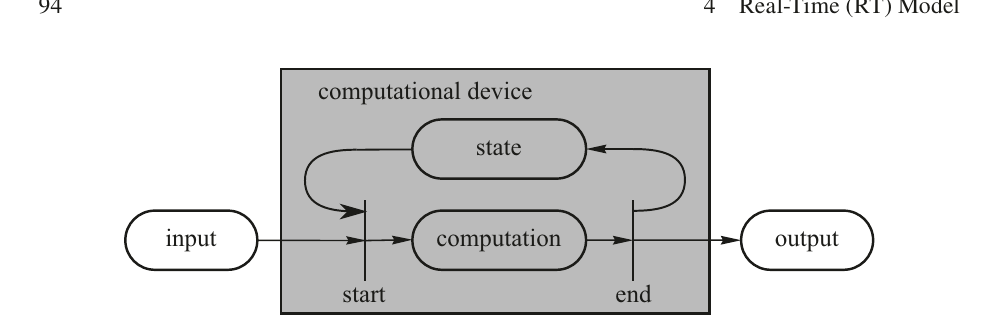

图 4.2 口袋计算器模型

（input = 输入; computational device = 计算设备; state = 状态; computation = 计算; output = 输出; start/end = 开始/结束; real-time = 实时）

---

如果能够观察设备的内部，那么在正弦函数的级数展开过程中，存储在口袋计算器本地内存中的许多中间结果可以被追踪到。如果计算在开始与结束两个时刻之间的某个时刻被中断，那么程序计数器的内容和所有保存中间结果的内存单元构成了该中断时刻的**状态**。在计算结束时刻之后，这些中间内存单元的内容不再具有相关性，状态再次变为空的。图 4.3 描绘了在一次计算中状态的典型扩展与收缩。

图 4.3 一次计算中状态的扩展与收缩

现在让我们分析一个用于求一组数之和的袖珍计算器的状态。当输入一个新数字时，之前已输入数字的和必须被储存在该设备中。如果在已加完一个数字子集后暂停工作，并改用另一台新计算器继续加法操作，我们首先必须输入先前已加数字的中间结果。在用户层面，该状态就是先前加法操作的中间结果。在操作结束时，我们得到最终结果并清除计算器的内存。状态再次变为空的。

从这个简单示例中，我们可以得出结论：一个系统的状态大小取决于对该系统进行观测的时刻。如果增加观测颗粒度，并且在选定的抽象层次上恰好在原子操作之前或之后选择观测点，那么状态的大小就可以被减小。

在任何中断时刻的状态都包含在程序计数器的内容和所有状态变量的内容中——这些内容必须被加载到一个全新的硬件设备中，才能从该中断时刻起继续该操作。如果一次中断是由一个组件的故障引起的，并且我们必须将该组件重整合到一个运行中的系统，那么必须重加载到已修复组件中的状态的大小就成为了关注的焦点。

如果我们的硬件设备是一台可编程计算机，那么在我们开始一次计算之前，必须首先将软件——即操作系统、一组应用程序以及所有状态变量的初始值——加载到一个全新的硬件设备中。我们将必须加载到一个全新的硬件设备中的软件总称称为**核心映像**（core image）或**作业**（job）。通常，作业是一种静态的数据结构，即在软件执行期间不发生变化。在一些嵌入式硬件设备中，作业存储在 ROM（只读存储器）中，因此软件在字面意义上成为了硬件的一部分。

---

### 4.2.3 基础状态

为了便于将组件动态重整合到一个运行中的系统，有必要在行为中设计周期性的**重整合时刻**（reintegration instants），在这些时刻组件在重整合点处的状态包含一小集定义良好的应用特定状态变量。我们将该重整合时刻的状态称为该组件的**基础状态**（ground state, g-state），而将两个重整合点之间的时间区间称为**基础周期**（ground cycle）。

重整合点处的基础状态被存储在一个声明的**基础状态数据结构**中。设计一个**最小基础状态数据结构**是显式设计努力的结果，涉及对给定应用的语义分析。设计者必须找到这样的周期性时刻，在此时未来行为与过去行为之间存在最大程度的解耦。这在循环应用——如控制应用和多媒体应用——中相对容易实现。在这些应用中，一个自然的重新整合时刻恰在一个周期终止之后和下一个周期开始之前。关于最小化基础状态的设计技术将在第 6.6 节中讨论。

在重整合时刻，没有任何任务可以处于活跃状态，并且所有通信通道必须被**清空**，即没有任何在途消息 [Ahu90]。考虑一个包含若干并发执行任务的节点，这些任务彼此之间以及与节点环境之间交换消息。让我们选择一个将任务的执行视为原子操作的抽象层次。如果任务的执行是异步的，那么图 4.4 上部所示的情况就可能出现：在每一个时刻，至少有一个任务处于活跃状态，这意味着不存在任何能够定义该节点基础状态的时刻。

在图 4.4 的下部，存在一个没有任何任务活跃且所有通道均为空的时刻——即系统处于基础状态的时刻。如果一个节点处于基础状态，那么对该节点未来运行至关重要的整个状态就包含在该声明的**基础状态数据结构**中。

图 4.4 任务执行：无基础状态（上）与有基础状态（下）

（task A/B/C = 任务 A/B/C; active = 活跃; ground state = 基础状态; real-time = 实时）

---

**示例：**考虑在一个时钟设计中，基础状态的大小与基础（g）周期的持续时间之间的关系。如果基础周期为 24 小时，且新一天的开始为重整合时刻，则基础状态为空。如果每个完整小时都是重整合时刻，则基础状态包含 5 位（用于从一天 24 小时中标识其中一个小时）。如果每个完整分钟都是重整合时刻，则基础状态为 11 位（用于从一天 1440 分钟中标识其中一分钟）。如果每个完整秒都是重整合时刻，则基础状态为 17 位（用于从一天 86400 秒中标识其中一秒）。确定上述哪种方案对于给定应用为最优，取决于该应用的特征。如果该时钟是一个能够存储最多四个闹钟且闹钟精度为 5 分钟的闹钟，那么每个闹钟的基础状态为 10 位（9 位用于闹钟时间，1 位用于表示闹钟是开启还是关闭）。如果我们假定重整合周期为 1 秒并支持四个闹钟，那么在此简单示例中，基础状态消息的长度为 57 位。此基础状态可以存储在一个 8 字节的数据结构中。在重启动消息中，时间字段必须被修正，使其包含重启动时刻的精确时间值。

表 4.1 基础状态恢复与检查点恢复的比较

  | 基础状态恢复 | 检查点恢复 |  |
| --- | --- | --- |
| 数据选择 | 应用特定的、对该系统未来运行至关重要的小数据集合 | 自计算开始以来所有被修改过的数据元素 |
| 数据修改 | 基础状态数据被修改以在未来重整合时刻建立基础状态与环境状态之间的一致性。在实时系统中无法对环境进行回滚 | 检查点数据不作修改。一致性通过将（数据）环境回滚到检查点数据被捕获的时刻来建立 |

表 4.1 展示了基础状态恢复与检查点恢复本质上不同的——检查点恢复用于在非实时数据密集型系统发生失效后建立一致状态。

### 4.2.4 数据库组件

我们将动态数据元素——即由计算所修改的数据元素——的数量过大以至于无法将它们存储于单条基础状态消息中的组件称为**数据库组件**（database component）。包含在数据库组件中的动态数据元素可以是**状态数据**的一部分，也可以是**归档数据**（archival data）。

术语**归档数据**指的是出于归档目的而收集的数据，它不会直接影响组件未来的行为。归档数据是用于记录生产过程变量历史的需要，以便能在将来的某个时间离线分析生产过程。将归档数据尽快发送到一个远程的归档存储位置是一种良好的实践。云计算和云存储正越来越多地用于此目的（见第 14 章）。

---

**示例：**飞机上的传奇黑匣子包含归档数据。人们可以在数据收集之后立即通过卫星链路将其发送到地面的一个存储站点，以避免在事故发生后必须从残骸中打捞黑匣子的麻烦。

## 4.3 消息概念

**消息**（message）的概念是我们模型的第三个基本概念。一条消息是一个原子性的数据结构，它为通信之目的——即组件之间的数据传输和同步——而构成。

### 4.3.1 消息结构

消息的概念与邮政系统中**信件**（letter）的概念相似。一条消息由一个**头部**（header）、一个**数据字段**（data field）和一个**尾部**（trailer）组成。头部——对应于信件的信封——包含接收方的端口地址（即消息必须送达的**邮箱**）、关于消息应当如何处理的信息（例如挂号信），并且可以包含发送方的地址。数据字段包含消息的应用特定数据，对应于信件的内容。尾部——对应于信件中的签章——包含允许接收方检测消息中包含的数据是否未损坏且真实的信息。尾部有不同类型：最常见的尾部是一个 CRC 字段，允许接收方确定数据字段在传输过程中是否已被损坏。一条消息也可以在尾部包含一个**电子签名**，使得能够确定被认证的消息内容是否未被更改（见第 6.2 节）。**原子性**的概念意味着一条消息要么被完全交付，要么根本不交付。如果一条消息被损坏或消息的仅部分到达接收方站点，则整条消息都将被丢弃。所述尾部的目的正在于以足够高的概率来确保原子性。

消息概念的时间维度与消息被发送方发送和被接收方接收的时刻相关，因此也与消息处于在途状态的时间长度相关。我们将发送时刻与接收时刻之间的区间称为**传输延迟**（transport delay）。时间维度的第二个方面与发送方产生消息的速率和接收方消费消息的速率有关。如果发送速率受到约束，那么我们称之为**速率受控消息系统**（rate-constrained message system）。在发送方速率不受约束的情况下，发送方可能使通信系统的传输能力过载（我们称之为**拥塞**，congestion），或者使接收方的处理能力过载。如果接收方跟不上发送方的消息产生速率，接收方可以向发送方发送一条控制消息告知发送方放慢速度（**背压流控制**，back pressure flow control）。替代地，接收方或通信系统可以简单地丢弃超过其处理能力的消息。

---

### 4.3.2 事件信息与状态信息

一个动态系统的**状态**随着实时时间的推进而变化。让我们假定我们周期性地观测一个系统的状态变量，两次相继观测之间的持续时长为 d。如果我们观测到所有状态变量的值在两次相继观测中相同，那么我们就推断在过去的观测区间 d 内没有**事件**——即状态变化——发生。这一结论只有在系统动态相对于我们的观测区间 d 而言较为缓慢时才有效（参见 Shannon 定理 [Jer77]）。如果某些状态变量值的两次相继观测不同，那么我们推断在过去的观测区间 d 内至少发生了一个事件。我们可以通过两种不同的方式报告一个事件——即状态变化——的发生：要么发送一条包含**事件信息**（event information）的单条消息，要么发送一系列包含**状态信息**（state information）的消息。

当信息传达了之前状态观测与当前状态观测中的值**差异**时，我们称之为**事件信息**。当前（较晚）观测的时刻被假定为事件发生的时刻。这一假设并非完全精确，因为该事件可能发生在过去持续时间 d 的区间内的任何时刻。我们可以通过使区间 d 更小来减小事件的这一时间观测误差，但我们不能完全消除观测事件时的时间不确定性。即使我们使用处理器的中断系统来报告事件，这一点也仍然为真——中继中断发生情况的输入信号并不被处理器连续感知，而仅仅在一条指令执行终止后才被感知。这一延迟的引入是为了减少处理器中必须保存和恢复的处理器状态量，以便在中断被服务后能够继续被中断的任务。如第 4.2.3 节所论述的，在原子操作的执行之前或之后——此例中即为处理器执行一条完整指令之前或之后——状态是最小的。

如果事件的精确计时是关键的，我们可以提供一个专门的、独立的硬件设备来立即对观察到的、中断线的状态变化打上时间戳，从而将时间观测误差减小到与硬件的周期时间处于同一数量级的值。这类硬件设备被用于在分布式系统中实现精确的时钟同步——其中分布式时钟系统的精度须达到纳秒量级。

**示例：**IEEE 1588 时钟同步标准建议实现一个独立的硬件设备来精确捕获时钟同步消息的到达时刻。

当信息传达了当前状态变量的值时，我们称之为**状态信息**。如果一条消息的数据字段包含状态信息，那么由接收方负责比较两次相继的状态观测并确定是否发生了一个事件。关于事件发生的时间不确定性与上述相同。

---

### 4.3.3 事件触发（ET）消息

如果发送一条消息的触发信号来源于一个有意义的**事件的发生**——例如应用软件执行了一条发送消息命令——则称该消息为**事件触发（ET）**消息。

ET 消息非常适合传输**事件信息**。由于一个事件指向一个**唯一的状态变化**，接收方必须消费**每一条**事件消息，并且不允许复制一条事件消息。我们说一条事件消息必须遵守**精确一次**（exactly once）语义。事件消息模型是大多数非实时系统中遵循的标准消息传输模型。

**示例：**事件消息"阀门必须关闭 5 度"意味着阀门新的意图位置等于当前位置加 5 度。如果该事件消息丢失或重复，则计算机中阀门位置状态的镜像将与环境中的阀门位置实际状态相差 5 度。该错误可以通过**状态对齐**（state alignment）来纠正，即将意图阀门位置的（完整）状态发送给该阀门。

在事件触发系统中，错误检测是**发送方**的责任，发送方必须从接收方收到一条显式的确认消息，告知发送方该消息已正确到达。接收方无法执行错误检测，因为接收方无法区分"发送方无活动"与"消息丢失"。因此，控制流必须为**双向控制流**，即便数据流仅是单向的。发送方必须是**时间感知**的，因为它必须在一个有限的实时时间区间内决定通信是否已经失败。这正是我们无法构建不对实时时间推进加以感知的容错系统的原因之一。

### 4.3.4 时间触发（TT）消息

如果发送一条消息的触发信号来源于**实时时间的推进**，则称该消息为**时间触发（TT）**消息。在系统开始运行之前，每个时间触发消息都已被分配了一个由其**周期**和**相位**表征的周期。在周期开始的时刻，该消息的传输由操作系统自动启动。在 TT 消息传输中，不需要发送消息命令。

TT 消息非常适合传输**状态信息**。一条包含状态信息的 TT 消息称为一条**状态消息**（state message）。由于一个新的状态观测版本通常会取代已有的旧版本，一条新状态消息**原地更新**旧消息是合理的。在读取时，状态消息并不被消费；它保留在内存中，直到被一个新版本更新。状态消息的语义类似于程序变量的语义，可以多次读取而不被消费。由于在状态消息传输中不需要队列，队列溢出便不成问题。

---

基于状态消息的先验已知周期，接收方可以**自主**执行错误检测来发现状态消息的丢失。状态消息支持**独立原则**（参见第 2.5 节），因为发送方和接收方可以以不同的（独立的）速率运行，并且接收方没有任何影响发送方的手段。

**示例：**一个温度传感器每秒观测一次环境中的温度传感器的状态。一条状态消息非常适合将该观测结果传输到一个用户，并将其存储在名为 temperature 的程序变量中。用户程序可以在需要参考当前环境温度时随时读取此变量 temperature，并且知道存储在该变量中的值在大约 2 秒内是最新的。如果一条单独的状态消息丢失，那么在一个周期内存储于该变量中的值仅在大约 3 秒内是最新的。因为在一个时间触发系统中，通信系统事先就知道何时必须到达一条新的状态消息，它可以为该变量 temperature 关联一个标志位，以告知用户该变量 temperature 在上一个周期内是否被正确更新。

## 4.4 组件接口

让我们假设一个大型基于组件的系统设计被划分为两个不同的设计阶段：**架构设计**（architecture design）和**组件设计**（component design）（另见第 11.2 节关于系统设计的讨论）。在架构设计阶段结束时，可以获得该系统的**平台独立模型**（PIM，Platform-Independent Model）。PIM 是一个可执行模型，将系统划分为集群和组件，并包含各组件的链接接口在值域和时间域中的精确接口规范。PIM 的链接接口规范与组件实现无关，并且可以用一种高层可执行系统语言——例如 System C——来表达。一个 PIM 组件被转化为一种可以在最终执行平台上运行的形式后，称为该组件的**平台特定模型**（PSM，Platform-Specific Model）。PSM 具有与 PIM 相同的接口特征。在许多情况下，一个恰当的编译器可以将 PIM 自动转化为 PSM。

一个接口应当服务于一个单一且定义明确的目的（关注点分离原则；见第 2.5 节）。基于目的，我们区分一个组件的以下四个消息接口（图 4.5）：

图 4.5 组件的四个接口

（TDI—Technology dependent interface for looking inside a component (e.g., for internal diagnosis) = TDI—用于查看组件内部的、技术相关接口（例如用于内部诊断）; LIF—linking interface for the composition of components = LIF—用于组件组合的链接接口; TII—technology independent interface for component configuration and resource management = TII—用于组件配置和资源管理的技术无关接口; local interfaces (e.g., process input/output) = 本地接口（例如过程输入/输出））

---

- **链接接口（LIF）：**LIF 在被考虑的抽象层次上提供了该组件的指定服务。此接口与组件实现无关。PIM 和 PSM 的 LIF 是相同的。

- **技术无关接口（TII）：**TII 用于配置和控制组件的执行。此接口与组件实现无关。PIM 和 PSM 的 TII 是相同的。

- **技术相关接口（TDI）：**TDI 用于为维护和调试目的提供对组件内部的访问。此接口是特定于具体实现的。

- **本地接口：**本地接口将一个组件与外部世界连接起来，即一个集群的外部环境。此接口在语法上仅在 PSM 层面被指定，尽管此接口的语义内容包含在 LIF 之中。

LIF 和本地接口是**运行接口**（operational interfaces），而 TII 和 TDI 是**控制接口**（control interfaces）。控制接口用于控制、监控或调试一个组件，而运行接口在组件正常运行期间使用。在我们详细讨论这四个接口之前，先阐述消息接口的一些一般属性。

### 4.4.1 接口特性

**推式接口与拉式接口：**在接收组件的接口处，处理一条新消息到达有两种选择方案：

- **信息推送（information push）：**通信系统引发一个中断，强制组件立即对消息做出反应。对组件时间行为的控制被委托给了组件外部的环境。

- **信息拉取（information pull）：**通信系统将消息放置在一个中间存储位置。组件周期性地检查是否有新消息到达。时间控制保持在组件内部。

在实时系统中，应在可能的情况下遵循**信息拉取策略**。只有在需要立即动作、且由信息拉取策略引入的一个周期延迟不可接受的情况下，才应当采取**信息推送策略**。在后种情况下，必须建立机制以保护组件免受因组件外部故障而引起的错误中断的影响（另见第 9.5.3 节）。信息推送策略违背了**独立原则**（见第 2.5 节）。

---

**示例：**一个汽车发动机控制组件在未与防盗系统集成之前工作正常。该发动机控制器与防盗系统之间的消息接口被设计为推式接口，导致当防盗系统传来消息时，一个时间关键的发动机控制任务会在不恰当的时刻被零星的、中断性的打断。结果是，该发动机控制器零星地错过截止时间并失效。将接口改为拉式接口解决了此问题。

**基本接口与复合接口** 在一个分布式实时系统中，有许多情况只需要在一个发送组件与一个接收组件之间实现一个简单的单向数据流。如果数据流和控制流都是单向的，我们称这样的接口为**基本接口**（elementary interface）。如果在单向数据流场景中控制流是双向的，我们称该接口为**复合接口**（composite interface）（图 4.6）[Kop99]。

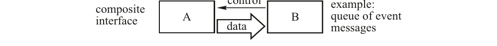

图 4.6 基本接口与复合接口

（elementary interface = 基本接口; example: state message data in a DPRAM = 示例：DPRAM 中的状态消息数据; composite interface = 复合接口; example: queue of event data = 示例：事件数据队列; control = 控制流; data = 数据流; A/B = 组件 A/B）

基本接口在本质上比复合接口更简单，因为发送方的行为不依赖于接收方的行为。我们可以推理发送方的正确性，而无须考虑接收方的行为。这在安全关键系统中尤为重要。

### 4.4.2 链接接口（LIF）

一个组件的服务在其**集群 LIF** 上可被访问。组件的集群 LIF 是一个基于消息的运行接口，它将一个组件与集群中的其他组件互连起来，因此是组件集成到集群中的接口。一个组件的 LIF 将该组件的内部结构和本地接口加以抽象。LIF 的规范必须是自包含的，不仅涵盖组件本身的功能和时序，还涵盖其本地接口的语义。LIF 是与技术无关的，这意味着 LIF 不暴露组件内部或其本地接口的实现细节。一个技术无关的 LIF 确保了相同的计算组件实现（例如通用 CPU、FPGA、ASIC）和不同的本地输入/输出子系统可以连接到同一个组件，而无需对通过其基于消息的 LIF 与该组件交互的其他组件做任何修改。

---

**示例：**在一个输入/输出组件中，外部输入和输出信号通过本地点对点布线接口连接。引入一个总线系统——例如 CAN 总线——将不会改变该输入/输出组件的集群 LIF，只要出现在 LIF 上的数据的时间属性保持相同。

### 4.4.3 技术无关接口（TII）

技术无关接口是一个**控制接口**，用于：配置一个组件——例如为一个组件及其输入/输出端口分配合适的名称；重置、启动和重启动一个组件；以及在运行时监控和控制组件的资源需求（如功耗），如果需要的话。此外，TII 还用于配置和重配置一个组件，即为可编程组件硬件分配一个特定的作业（即核心映像）。

到达 TII 的消息要么直接与组件硬件通信（例如重置），要么与组件的操作系统（例如启动某任务）或组件中间件通信，而不与应用软件通信。因此，TII 与 LIF 是**正交的**。这种将应用特定的消息接口（LIF）与组件的系统控制接口（TII）严格分离的做法，简化了应用软件并降低了组件的整体复杂性（另见第 2.5 节中的关注点分离原则）。

### 4.4.4 技术相关接口（TDI）

TDI 是一个特殊的控制接口，提供了查看组件内部和观察组件内部变量的手段。它与**边界扫描接口**相关——后者广泛应用于大型 VLSI 芯片的测试和调试，并已在 IEEE 1149.1 标准（也称 JTAG 标准）中标准化。TDI 面向的是对组件内部有深入理解的人员。TDI 与组件 LIF 服务的使用者或配置组件的系统工程师均无关。TDI 的精确规范取决于组件实现技术，且当同一个组件功能以软件运行在 CPU 上、以 FPGA 或以 ASIC 的方式实现时将各不相同。

### 4.4.5 本地接口

本地接口在组件与其外部环境之间建立连接，例如与物理装置中的传感器和执行器、人类操作员或另一个计算机系统之间的连接。一个包含本地接口的组件称为**网关组件**（gateway component）或**开放组件**（open component），与不包含本地接口的**封闭组件**（closed component）相对。

---

从组件 LIF 语义规约的角度看，开放组件与封闭组件之间的区分是重要的。只有**封闭组件**可以在不知道其使用语境的情况下被完全规约。

从集群 LIF 的角度看，只有时间属性和**语义内容**——即跨越本地接口交换的信息的含义——才具有相关性，而本地接口的详细结构、命名和访问机制在集群层面则被有意留作未指定。本地访问机制的修改——例如用 Ethernet 替换 CAN 总线——不会对 LIF 规范、因而也不会对 LIF 规范的使用者产生任何影响，只要相关数据项的语义内容和时间属性保持不变（另见第 2.5 节中的抽象原则）。

**示例：**一个计算三角函数的组件是一个封闭组件。其功能可以被形式化规约。一个读取温度传感器的组件是一个开放组件。温度的含义是应用特定的，因为它取决于传感器被放置在物理装置中的位置。

## 4.5 网关组件

从一个集群的视角看，**网关组件**是一个连接两个世界的开放组件：集群的内部世界和集群环境的外部世界。网关组件充当这两个世界之间的**中介**。它拥有两个运行接口：到集群的 LIF 消息接口和到外部世界的本地接口——后者可以是物理装置、人机接口或另一个计算机系统（图 4.7）。从集群外部来看，接口的角色颠倒过来——先前的本地接口成为新的 LIF，先前的 LIF 成为新的本地接口。

图 4.7 LIF 与本地外部世界接口之间的网关组件

（controlled object = 受控对象; operator = 操作员; another computer = 另一计算机; cluster = 集群; LIF = LIF 消息接口; local interface = 本地接口; gateway component = 网关组件; cluster communication system = 集群通信系统; (outer world) = （外部世界））

---

### 4.5.1 属性不匹配

每个系统都是按照一种**架构风格**（architectural style）开发的——即一组被采纳的规则和约定，涉及概念形成、数据表示、命名、编程、组件的交互、数据语义等诸多方面。架构风格表征了那些代表设计结果的实体的属性。架构风格的细节有时被明确记录，但更多时候仅被开发团队隐含性地遵循，反映了支配该开发共同体的不成文约定（另见第 2.2.4 节最后几段）。

每当一个通信通道连接两个由不同组织开发的系统时，跨越该通道交换的消息中的某些属性极有可能存在**不一致**。我们将在该消息的发送方与接收方之间任何数据或协议属性的不一致称为**属性不匹配**（property mismatch）。解决属性不匹配正是网关组件的任务。

**示例：**假设一条消息的发送方与接收方之间存在**端序**（endianness）——即数据的字节顺序——上的差异。如果发送方假定大端序（big endian）——最高有效字节在前，而接收方假定小端序（little endian）——最低有效字节在前，那么这种属性不匹配必须由发送方、接收方或一个中间连接器系统——即网关组件——来解决。

属性不匹配发生在系统交互的边界处，而非在一个设计良好的系统内部。在一个系统内部，所有伙伴都遵守该架构风格的规则和约束，属性不匹配通常不是问题。属性不匹配应当在连接两个系统的网关组件中解决，以保持各个交互子系统内部架构风格的完整性。

### 4.5.2 网关组件的 LIF 与本地接口

如前所述，构成一个集群的一组相关组件在其集群 LIF 上共享一个共同的架构风格。这意味着集群 LIF 消息之间的属性不匹配是罕见的。

这与跨越一个网关组件的消息形成了对比。这些消息来自两个不同的世界，这两个世界由两种不同的架构风格所表征。这两组消息之间的属性不匹配、语法不兼容、命名不连贯和表示上的差异是常态而非例外。网关组件的主要任务就是将其中一个世界的架构风格**翻译**为另一个世界的架构风格，而不改变消息变量的**语义内容**。

存在这样的情况，即两个接口世界的架构风格基于对现实的不同**概念化**——也就是说，

---

不仅仅是在相同概念的名称和表示上存在差异（如第 2.2.4 节中的示例所示），而是概念本身——即语义内容——都是不同的。

从一个给定集群的视角来看，网关组件将外部世界（即本地接口）的细节从计算集群内部的标准化消息格式中**隐藏**起来，并**过滤**传入的信息：只有与所考虑集群的运行相关的信息才以集群标准消息的形式暴露在该网关组件的集群 LIF 处。

一个重要的外部世界接口的特例是**过程 I/O 接口**，它在信息世界与物理世界之间建立链接。表 4.2 描绘了 LIF 消息与到物理工厂的过程控制 I/O 接口之间的一些差异。

表 4.2 LIF 与本地过程 I/O 接口的特征

  | 特征 | 本地过程 I/O 接口 | LIF 消息接口 |
| --- | --- | --- |
| 信息表示 | 由给定的物理接口设备决定，独一无二的 | 在整个集群内统一 |
| 编码 | 模拟或数字，独一无二的 | 数字，统一编码 |
| 时间基准 | 稠密的 | 稀疏的 |
| 互联模式 | 一对一 | 一对多 |
| 耦合 | 紧密，由具体的硬件需求和所连接设备的 I/O 协议决定 | 较松散，由 LIF 消息通信协议决定 |

**示例：**在一个过程工厂的外部世界中，过程变量温度的值可能以模拟的 4–20 mA 传感器信号编码，其中 4 mA 表示所选测量范围（如 0°C 至 100°C）的 0%，20 mA 表示 100%。该模拟表示必须转换为该给定集群架构风格中定义的标准温度表示——可能是开氏温度。

---

**示例：**让我们考察一个重要的接口——人机接口（MMI）——以区分网关 MMI 组件的本地接口和 LIF 消息接口（图 4.8）。在架构建模层面，我们并不关心本地外部世界接口的表示细节，而只关心 LIF 消息接口处消息变量的**语义内容**和**时间属性**。一条重要消息被发送到 MMI 组件。它以某种方式被中继到操作员的心智。在给定的时间区间内，LIF 消息接口处期望收到操作员的一条响应消息。所有涉及操作员终端图形用户界面（GUI）上信息表示的错综复杂问题，从操作员与集群之间交互模式的架构建模角度看都是无关的。如果我们模型的目的在于研究具体人机交互中的人因问题，那么信息在 GUI 上的表现形式和属性（如符号的形状和放置、颜色和声音）就将具有相关性，不能被忽略。

图 4.8 标准化 LIF 与具体 MMI

（important incoming message = 重要传入消息; reaction message = 反应消息; man-machine interface (view, sound) = 人机接口（视图、声音）; input message = 输入消息; cluster LIF standardized messages = 集群 LIF 标准化消息）

一个网关组件可以连接两个不同的集群，它们由两个使用两种不同架构风格的不同组织设计。该网关组件的两个接口中，哪个被视为 LIF，哪个被视为本地接口，取决于所持的视角。如先前已提到的，如果我们改变视角，则 LIF 变为本地接口，本地接口变为 LIF。

### 4.5.3 标准化消息接口

为改善由不同制造商设计的组件之间的兼容性、增强设备的互操作性并避免属性不匹配，一些国际标准组织已试图将消息接口标准化。这种标准化努力的一个例子是 SAE J1587 消息规约。汽车工程师学会（SAE）在 J1587 标准中对重型车辆应用的消息格式进行了标准化。该标准定义了重型车辆应用领域中出现的许多数据元素的消息名称和参数名称。除数据格式外，变量的范围和更新频率也涵盖在该标准中。

---

## 4.6 链接接口规范

如第 4.1.1 节所述，一个组件跨越其与环境的接口交换的、带有时间顺序的消息序列定义了该组件在该接口处的**行为** [Kop03]。因此，接口行为由跨越一个接口的所有消息的属性决定。我们将一个接口规范分为三个部分：(i) 消息的**传输规范**，(ii) 消息的**运行规范**，以及 (iii) 消息的**元层次规范**。

**传输规范**描述了为将一条消息从发送方传输到接收方所需的所有消息属性。传输规范涵盖了一条消息的编址和时间属性。如果两个组件由一个通信系统连接，传输规范就足以描述从该通信系统请求的服务。通信系统对消息数据字段的内容是不可知的。对通信系统而言，数据字段包含的是多媒体数据（如语音或视频）、数值数据还是任何其他数据类型并无区别。

**示例：**互联网在两个端系统之间提供一种定义好的消息传输服务，而并不知晓正在传输何种类型的数字数据。

为了能在通信端点处解释一条消息的数据字段，我们还需要**运行规范**和**元层次规范**。运行规范提供了关于跨越 LIF 交换的消息的**语法结构**信息，并建立了**消息变量**。传输规范和运行规范都必须是精确且形式化的，以确保组件的语法互操作性。一个 LIF 的**元层次规范**为运行规范中引入的消息变量名称赋予**含义**。它基于用户环境的接口模型。由于不可能形式化真实世界用户环境的各个方面，元层次规范通常会包含自然语言要素，而自然语言缺乏形式系统的精确性。应用领域和应用的中央概念可以使用领域特定的本体论来规约。

### 4.6.1 传输规范

传输规范包含通信系统为将一条消息从发送方传输到接收方所需的信息。一个接口包含多个**端口**（ports），这些端口是消息到达该接口或放置待发送消息的位置。传输规范必须包含以下属性：

- 端口地址与方向。

- 消息数据字段的长度。

- 消息类型（例如时间触发、事件触发或数据流）。

- 时间触发消息的周期。

- 事件触发消息或数据流的队列深度。

这些属性是与消息本身相关联，还是与消息被处理的端口相关联，是一个设计决策。

---

如前所述，传输规范必须包含关于消息时间属性的信息。对于时间触发消息，时间域由与每个时间触发消息相关联的**周期**来精确指定。对于事件触发消息，时间规约更加困难——特别是当事件触发消息可以以**突发**方式到达时。从长期来看，消息到达率必须不大于接收方的消息消费率，因为事件触发消息必须遵守**精确一次**语义（见第 4.3.3 节）。在短其内，到达的消息突发可以被缓冲在接收方队列中，直至队列满。为突发性事件触发消息指定恰当的队列长度非常重要。

### 4.6.2 运行规范

从通信的角度看，一条到达消息的数据字段可视为一个**无结构的位向量**。在通信的端点处，**运行规范**决定了如何将此位向量构成为**消息变量**（message variables）。一个消息变量是一个语法单元，由一个固定部分和一个可变部分组成（见第 2.2.4 节）。关于如何将一条消息的数据字段构成语法单元的信息包含在一个**消息结构声明**（MSD，Message-Structure Declaration）中。MSD 包含**消息变量名称**（即消息变量的固定部分）——这些名称在一侧指向相关的概念——并在另一侧指定了无结构位向量的哪一部分表示一个消息变量的值（即可变部分）。除结构信息外，MSD 还可以包含用于检查传入数据有效性的**输入断言**（input assertions）——例如测试数据是否处于接收组件能够处理的允许数据域内——以及用于检查传出数据的**输出断言**（output assertions）。一个通过输入断言的传入数据元素称为**允许数据元素**（permitted data element）。一个通过输出断言的传出数据元素称为**已检查数据元素**（checked data element）。用于在 MSD 中指定数据结构和断言的形式体系取决于可用的编程环境。

在许多实时系统中，MSD 是**静态的**，即在系统的整个生命期内不变化。在这些系统中，出于性能的原因，MSD 并不在消息中传输，而是存储在必须处理数据字段的通信伙伴的内存中。

到达一个端口的无结构位向量与关联的 MSD 之间的链接可以通过不同方式建立：

- MSD 名称被赋予输入端口名称。在这种情况下，只有一个单一消息类型可以被该端口接受。

- MSD 名称包含在消息的数据字段中。在这种情况下，不同的消息类型可以在同一端口被接收。此方法在 CAN（见第 7.3.1 节）中采用。

---

- MSD 名称被赋予一条时间触发消息的循环到达时刻。在这种情况下，不同的消息类型可以在同一端口被接收，而无需将 MSD 名称存储在消息的数据字段中。此方法在 TTP（见第 7.5.1 节）中采用。

- MSD 名称存储在一个可以被消息接收方访问的服务器中。此方法在 CORBA [Sie00] 中采用。

- MSD 本身就是消息的一部分。这是最灵活的方案，代价是必须在每条消息中发送完整的 MSD。此方法在面向服务架构（SOA）[Ray10] 中采用。

### 4.6.3 元层次规范

LIF **元层次规范**为在运行层面两个通信 LIF 之间交换的消息变量赋予**含义**，由此建立**语义互操作性**。它弥合了语法单元与用户关于接口所提供服务的心理模型之间的鸿沟。在此元层次规范中居于中心地位的是**LIF 服务模型**（LIF service model）。LIF 服务模型定义了与运行规范中包含的消息变量名称相关联的**概念**。这些概念对于封闭组件和开放组件而言在**性质上不同**（见第 4.4.5 节）。

封闭组件的 LIF 服务模型可以是**形式化的**，因为封闭组件不与外部环境交互。LIF 输入与 LIF 输出之间的关系取决于该封闭组件内部实现的离散算法。不存在来自外部环境的、可以为组件行为带来不可预测性的输入。集群内部的稀疏时间基准是离散的，并支持所有事件的一致时间顺序。

开放组件的 LIF 服务模型则有着根本的不同，因为在其接口规范中必须包含来自外部环境的输入——也就是组件的本地接口。在不知道开放组件使用语境的情况下，只能提供开放组件的**运行规范**。由于外部物理环境无法被严格定义，对外部输入的解释取决于对自然环境中的人类理解。因此，在描述 LIF 服务模型时所使用的概念必须与使用者内部概念图景（见第 2.2 节）中的习惯概念高度契合；否则该描述将不被理解。

接下来的讨论聚焦于**开放组件**的 LIFs，因为我们所关注的系统必须与外部环境交互。开放组件 LIF 服务模型必须满足以下需求：

- **用户导向：**典型用户所熟悉的概念必须是 LIF 服务模型的基本元素。例如，如果预期用户具有工程背景，那么在呈现该模型时，应当使用该工程学科中的常识性术语和记号。

---

- **目标导向：**组件的用户使用该组件的意图是达成一个目标——即对她/他问题的解决做出贡献。用户意图与 LIF 所提供的服务之间的关系必须在 LIF 服务模型中予以揭示。

- **系统视图：**一个 LIF 服务的用户（即系统架构师）需要考察组件与外部物理环境交互的系统级效应——即超出该组件范围之外的效应。LIF 服务模型与描述组件内部实现的算法的模型是不同的，因为这些算法处于组件的边界之内。

**示例：**让我们分析一个包含温度的变量的简单情形。与任何变量一样，它由两部分组成：静态的变量名和动态的变量值。MSD 包含静态变量名（我们假定该变量名为 Temperature-11）以及动态变量值在消息到达的位流中所放置的位置。元层次规范解释了 Temperature-11 的含义（另见第 2.2.4 节中的示例）。

## 4.7 组件集成

一个组件是一个自包含的、已验证的单元，可以用作构建更大系统的积木。为了使一个组件能够直接被组合到一个组件集群中，应当遵守以下四条**可组合性原则**。

### 4.7.1 可组合性原则

**(i) 组件的独立开发：**架构必须支持在值域和时间域中对一个组件的链接接口（LIF）进行精确规约。这是一侧独立开发组件、另一侧仅依据 LIF 规范重用已有组件的必要前提。虽然交互消息的值域的运行规约在嵌入式系统设计中已是先进水平，但这些消息的时间属性却往往定义不清。许多现有架构和规约技术并未以适当的审慎来处理时间域。注意，传输规范和运行 LIF 规范与开放组件的使用语境无关，而开放组件的元层次 LIF 规范依赖于使用语境。因此，开放组件的**互操作性**并不等同于开放组件的**交互工作性**（interworking），因为后者还假定元层次规范的兼容性。

**(ii) 先行服务的稳定性：**先行服务的稳定性原则指出：一个组件在隔离环境中已验证的服务（即在组件被集成到更大系统之前）在集成之后保持不变（见第 4.4.1 节的示例）。

---

**(iii) 无干扰的交互：**如果存在两组不相交的、共享一个共同通信基础设施的协作组件子组，则一个子组内的通信活动不得干扰另一个子组内的通信活动。如果该原则未被满足，则一个组件子组内的集成将依赖于其他（功能上不相关的）组件子组的正确行为。这些全局性干扰破坏了架构的可组合性。

**示例：**在一个所有组件以先到先服务方式共享单一通信通道的通信系统中，**关键瞬间**（critical instant）被定义为所有发送方同时开始发送消息的那个瞬间。假设在这样一个系统中，需将十个组件集成到一个集群中。一个给定的通信系统能够在八个组件活跃的情况下处理该关键瞬间。一旦第九和第十个组件被集成进来，就出现了零星的时序失效。

**(iv) 在故障情况下对组件抽象的保持：**在一个可组合架构中，所引入的组件抽象应当保持完整——即使某个组件变得有故障。必须能够在无需知道组件内部细节的情况下，诊断并替换一个有故障的组件。这要求在架构内部具有某种程度的错误检测冗余。该原则约束了组件的实现，因为它限制了组件之间默示性的资源共享。如果一个共享资源发生故障，则可能影响多于一个组件。

**示例：**为了检测一个有故障的组件——其行为类似"喋喋不休的白痴"——通信系统必须包含关于每个组件允许的时间行为的信息。如果一个组件在时间域中发生故障，通信系统就将该违反其时间规约的组件切断，从而在其余正确组件间维持及时的通信服务。

### 4.7.2 集成视点

为了将可理解的结构引入大型系统，将——从集成视点看到的——一个（原始）组件集群视为一个单独的网关组件是有意义的。该集成视点建立了一个新的集群，该集群由原始集群各自的网关组件组成。从原始集群的角度看，该网关的外部（本地）接口成为了新集群的 LIF，而从新集群的角度看，该网关到原始集群的 LIF 是新集群的本地接口（见第 4.5.2 节）。到新集群的各个网关仅将那些与新集群的运行相关的信息项提供给新集群。

---

**示例：**图 4.1 描绘了一个构成汽车内部控制系统的组件集群。车-车网关组件（图 4.1 中右下组件）建立了到其他车辆的一条无线链路。在此示例中，我们区分了以下两个集成层次：(i) 将组件集成到图 4.1 所示的集群中，以及 (ii) 将一辆车集成到一个由汽车组成的动态系统中——这通过车-车（C2C）网关组件实现。如果我们考察图 4.1 集群内部的组件集成，那么 C2C 网关组件的通信网络接口（CNI）就是集群 LIF。从 C2C 通信的角度看，该集群 LIF 是 C2C 网关组件的（未指定的）本地接口（另见第 4.5.2 节最后一段）。

导致不同集成层次的组件和集群的**层级组合**是组件集成的一个重要特例。**多层次性**（Multilevelness）是大型系统中的一个重要组织原则。在最低集成层次上，原始组件（即被认为是原子单元、不再进一步分解的组件）被集成以构成一个集群。该集群中的一个特定组件是一个网关组件，它与其他集群的特定网关组件一起构成一个更高层次的集群。这一集成过程可以递归地继续下去，以构建一个具有不同集成层次的**层级系统**（另见第 11.7.2 节关于时间触发架构中组件的递归集成的讨论）。

**示例：**在 GENESYS [Obe09, p. 44] 架构中，引入了三个集成层次。在最底层——芯片层，组件是 MPSoC 的 IP 核，它们通过片上网络进行交互。在下一个更高层，芯片被集成以构成一个**设备**（device）。在第三个集成层次上，设备被集成以构成封闭或开放的系统。一个封闭系统是指系统中构成该系统的子系统是先验已知的。在一个开放系统中，子系统（或设备）动态地加入和离开系统，由此产生系统之系统。

### 4.7.3 系统之系统

对系统之系统日益增长的兴趣有两个原因：(i) 新功能的实现，以及 (ii) 对由持续演化引起的大型系统复杂性增长的控制。可用技术（例如互联网）使得可以将独立开发的系统（遗留系统）互连起来以形成新的**系统之系统**（SoS，System of Systems）。将不同的遗留系统集成为一个 SoS 带来了更高效的经济过程和改善的服务。

为了使大型系统的服务在一个动态的商业环境中保持相关性而进行的持续修改和适应，带来了不断增长的复杂性，这在单体语境中难以得到管理 [Leh85]。攻击这一复杂性问题的一种有前途的技术，是将一个单独的大型单体系统分解为一组近乎自治的**构成系统**（constituent systems），这些构成系统通过定义良好的消息接口相连接。

---

只要这些消息接口处所依赖的属性满足用户意图，该构成系统的内部结构就可以在对全局系统级服务不产生不利影响的情况下进行修改。消息接口处被依赖属性的任何修改都由一个监视和协调系统演化的**元实体**（meta-entity）仔细地协调。因此，SoS 技术的引入是为了控制由大型系统的必要演化所驱动的复杂性增长，通过引入结构并运用抽象、关注点分离和子系统交互的可观测性等简化原则（见第 2.5 节）来予以应对。

因此，子系统之系统与系统之系统之间的区分是基于构成系统的**自治程度**[Mai98]。我们将一个由按照一个主计划设计并处于单独一个开发组织控制域内的子系统构成的单体系统称为**子系统之系统**（system of subsystems）。如果协作的系统处于不同开发组织的控制域内，我们则称之为（构成）系统之系统。表 4.3 比较了单体系统与系统之系统的不同特征。自治构成系统之间的交互可能引发计划的或未预计的涌现行为——例如级联效应 [Fis06]——这些行为必须被检测和控制（另见第 2.4 节）。

在许多分布式实时应用中，不可能在对本地环境观测与需要控制本地环境之间的可用时间区间内将时间准确的实时信息传送到一个中央控制点。在这些应用中，由单体控制系统进行的中央控制是不可能的。相反，自治的分布式控制器必须协同工作以达到期望的效果。

**示例：**在一个开放道路系统中——自行车骑行者与行人会干扰汽车的通行——不可能由一个单体中央控制系统来控制汽车的移动，因为需要被传输到中央控制系统并由其处理的实时信息的数量及时效性在所需的响应时间内是无法管理的。相反，每辆汽车执行自治控制功能并与其他汽车协作，以维持有效的交通流。在这样的系统中，如果交通密度增加越过某个临界点，就可能由于涌现行为而发生堵车这种级联效应。

表 4.3 单体系统与系统之系统的比较

  | 单体系统 | 系统之系统 (SoS) |
| --- | --- |
| 控制域和系统责任在单独一个开发组织内部。子系统服从一个中央权威 | 构成系统处于不同开发组织的控制域内。各子系统是自治的，只能被其他子系统所影响，而不能被控制 |
| 各子系统的架构风格是对齐的。属性不匹配属于例外 | 构成系统的架构风格各不相同。属性不匹配是常态而非例外 |
| 实现集成的 LIF 由负责的系统组织控制 | 实现集成的 LIF 由国际标准组织确立，不在单一系统供应商的控制范围内 |
| 通常为产生各集成层次的层级组合 | 构成系统之间的交互通常遵循网格网络结构，缺乏清晰的集成层次 |
| 子系统为达成系统目标而设计为进行交互：集成（Integration） | 构成系统拥有自身的目标，这些目标不一定与 SoS 目标兼容。为达成共同目的而自愿协作：交互工作（Interoperation） |
| 构成子系统的各组件的演化是协调的 | 构成 SoS 的各构成系统的演化是非协调的 |
| 涌现行为受控 | 涌现行为常常是计划为之，但有时为未预计的 |

---

形成 SoS 的任何构成系统集合必须就一个**共享目的**（shared purpose）、一条**信任链**（chain of trust）以及语义层面上的一个**共享本体论**（shared ontology）达成一致。这些全局属性必须在元层次上建立，并成为经过精心管理的、持续演化的主题。必须在元层次上建立一个新的实体，来监视和协调各构成系统的活动，以便达成这一共享目的。

SoS 的一个重要特征是构成系统的**独立开发**和**非协调演化**（表 4.3）。SoS 设计的焦点在于各单体系统的**链接接口行为**。单体系统本身可以是异构的。它们由不同组织按照不同的架构风格开发。如果这些单体系统通过开放的通信通道互连，那么安全（security）问题至为关键，因为外部攻击者可以干扰系统运行——例如通过执行拒绝服务攻击（见第 6.2.2 节）。

[Sel08, p. 3] 讨论了演化式架构的两个重要属性：(i) 随着构成系统的加入或移除，整体框架的复杂性并不增长；以及 (ii) 当其他构成系统被增加、改变或移除时，给定的构成系统无需被重新工程化。这意味着对构成系统的接口属性（在值域和时间域中）的精确规约和持续重验证。如果一个构成系统所依赖的接口属性未被修改，则该构成系统的演化将不会对整体行为产生不利影响。由于被依赖接口属性的时间维度的精确规约需要一个时间参考，在一个大型 SoS 中所有构成系统都具有可用同步全局时间是有助益的——从而导向一种**时间感知架构**（TAA；见第 11.7 节）。这样的全局时间可以通过参考全球 GPS 信号来建立（见第 3.5 节）。我们称一个所有构成系统都可以访问同步全局时间的 SoS 为一个**时间感知 SoS**（time-aware SoS）。

用于构建系统之系统的首选互联介质是互联网，从而导向了物联网（IoT）。第 13 章专门讨论物联网的主题。

---

## 要点回顾

- 一个实时组件由一个设计（例如软件）、一个具体执行体（例如硬件——包括处理单元、内存和 I/O 接口）以及一个使该组件知晓实时时间推进的实时时钟组成。

- 一个组件在其与环境的接口处产生的、带有时间顺序的输出消息序列是该组件在该接口处的行为。意图的行为称为服务，非意图的行为称为失效。

- 时间控制涉及确定实时时间域中何时必须激活任务，而逻辑控制涉及任务内部的控制流。

- 同步编程语言清晰地区分与实时时间推进相关的时间控制和与执行时间相关的逻辑控制。

- 一个由其周期和相位表征的周期与每个时间触发活动相关联。

- 在给定时刻，一个组件的状态被定义为包含与该组件未来运行相关的过去信息的一个数据结构。

- 为了能够将一个组件动态地重整合到一个运行中的系统中，有必要在行为中设计周期性的重整合时刻，在该时刻的状态称为组件的基础状态。

- 一条消息是一个为了通信目的——即组件间的数据传输和同步——而构成的原子性数据结构。

- 事件信息传达了之前状态观测与当前状态观测之间的差异。包含事件信息的消息必须遵守精确一次语义。

- 状态消息支持独立原则，因为发送方和接收方可以以不同的（独立的）速率运行，并且不存在缓冲区溢出的危险。

- 在实时系统中，应在可能的情况下遵循信息拉取策略。

- 基本接口在本质上比复合接口更简单，因为发送方的行为不依赖于接收方的行为。

- 一个组件的服务在其集群 LIF 上提供给集群中的其他组件。集群 LIF 是一个基于消息的运行接口，与组件集成到集群中相关。组件本地接口的详细结构、命名和访问机制在其集群 LIF 处被有意留作未指定。

- 每个系统都按照一种架构风格开发——即一组被采纳的关于概念化、数据表示、命名、编程、组件交互、数据语义等方面的规则和约定。

- 每当一个通信通道连接两个由不同组织开发的系统时，跨越该通道交换的消息的某些属性极有可能因架构风格的不同而存在不一致。

- 网关组件解决属性不匹配，并将外部世界信息以集群标准消息的形式暴露在该网关组件的集群 LIF 处。

- 我们区分一个 LIF 规范的三个部分：(i) 消息的传输规范，(ii) 消息的运行规范，以及 (iii) 消息的元层次规范。

- 在不知道开放组件的使用语境的情况下，只能提供开放组件的运行规范。

- 关于一条消息的数据字段如何被构成语法单元的信息包含在消息结构声明（MSD）中。MSD 建立消息变量名称（即消息变量的固定部分）——这些名称指向相应的概念——并指定无结构位向量的哪一部分表示一个消息变量的值（即可变部分）。

- 可组合性的四条原则是：(i) 组件的独立开发，(ii) 先行服务的稳定性，(iii) 无干扰的交互，以及 (iv) 在故障情况下对组件抽象的保持。

- 多层次性是大型系统中一个重要的组织原则。

- 子系统之系统与系统之系统之间的区分更多基于组织性而非技术性的基础。

---

## 参考文献

所呈现的实时计算模型是在过去 25 年中发展起来的，记录于一系列出版物中，始于《The Architecture of Mars》[Kop85]，并进一步在以下出版物中得以发展：《Real-time Object Model》[Kim94]、《the Time-Triggered Model of Computation》[Kop98]、《Elementary versus Composite Interfaces in Distributed Real-Time Systems》[Kop99] 以及《Periodic Finite State Machines》[Kop07]。

---

### 复习题与思考题

**4.1.** 如何定义一个实时系统组件？一个组件的元素有哪些？一个组件的行为如何被指定？

**4.2.** 将计算组件从通信基础设施中分离有什么优势？列举这种分离的一些后果。

**4.3.** 时间控制与逻辑控制的区别是什么？

**4.4.** 实时系统状态的定义是什么？时间与状态之间的关系是什么？什么是基础状态？什么是数据库组件？

**4.5.** 事件信息与状态信息的区别是什么？处理事件消息与处理状态消息的区别是什么？

**4.6.** 列出并描述一个组件的四个接口的属性。为什么组件的本地接口在架构层面被有意留作未指定？

**4.7.** 信息推式接口与信息拉式接口的区别是什么？基本接口与复合接口的区别是什么？

**4.8.** 我们使用"架构风格"一词指的是什么？什么是属性不匹配？

**4.9.** 本地过程 I/O 接口与 LIF 消息接口的特征分别是什么？

**4.10.** 网关组件的角色是什么？

**4.11.** 链接接口规范的三个部分分别是什么？

**4.12.** 什么是消息结构声明（MSD）？我们如何将 MSD 与消息中包含的位向量关联起来？

**4.13.** 列出可组合性的四条原则。

**4.14.** 什么是集成层次？GENESYS 架构中引入了多少个集成层次？

---

**4.15.** 假设图 1.9 中前三对轧辊之间的压力 p₁ 和 p₂ 由两个控制器节点测量并发送到人机接口（MMI）节点，以验证以下报警条件：

```

when (p₁ < p₂)
  then everything ok
  else raise pressure alarm;

```

该轧机的特征参数如下：每台轧辊机架之间的最大压力 = 1000 kp cm⁻²（kp 为千磅），值域中的绝对压力测量误差 = 5 kp cm⁻²，压力的最大变化率 = 200 kp cm⁻² sec⁻¹。要求由不同轧辊处压力测量时间点不精确性引起的误差应当与值域中的测量误差处于同一数量级，即全量程的 0.5%。压力必须被连续监控，且第一个报警必须在过程可能偏离正常工作范围后最迟 200 ms 内由报警监控器发出。第二个报警必须在过程确定进入报警区域后 200 ms 内发出：

(a) 假定一个事件触发架构。每个节点包含一个本地实时时钟，但没有全局时间可用。通信系统传输单条消息的最短时间 dmin 为 1 ms。请推导这三个任务的时间控制信号。

(b) 假定一个时间触发架构。各时钟以 10 μs 的精度同步。时间触发通信系统由一个 10 ms 的 TDMA 轮次来表征。通信系统传输单条消息的时间为 1 ms。请推导这三个时间触发任务的时间控制信号。

(c) 比较 4.15 (a) 和 4.15 (b) 的解决方案在产生的计算负载和通信系统负载方面的差异。如果参数——例如通信系统的抖动或 TDMA 轮次的持续时间——发生变化，各解决方案的敏感度如何？

---

# 第5章 时间关系

Real-Time Systems — Hermann Kopetz, Wilfried Steiner 著 | AI 辅助翻译

---

## 本章概述

实时集群的行为必须基于关于其物理环境状态以及其他协作集群状态的及时信息。实时数据仅在有限的实时区间内具有时间准确性。如果实时数据在此应用特定的时间区间之外被使用，系统将会失效。本章的目标是研究信息物理系统不同部分中状态变量之间的时间关系。

在本章中，我们将引入实时（RT）实体、实时（RT）镜像和实时（RT）对象的概念，并建立 RT 镜像的时间有效性概念。RT 镜像的时间有效性可以通过状态估计来扩展。每个 RT 对象都关联一个实时时钟。该对象的时钟提供周期性的时间控制信号，用于执行对象过程，特别是用于状态估计目的。RT 对象时钟的粒度与被控对象中与该 RT 对象关联的 RT 实体的动态特性对齐。本章还将引入对 RT 实体的参数化观测和相位敏感观测的概念，并讨论观测的持久性概念。此外，还将估算动作延迟的持续时间，即消息发送时刻到该消息变为持久时刻之间的时间间隔。

本章的最后一节专门阐述确定性的概念。确定性是计算的一种理想性质，在需要通过组件复制来实现容错时是必需的。确定性也有助于测试和理解系统的运行。一组复制的 RT 对象，如果它们在近似相同的未来时间点访问相同的状态，则称其为副本确定性的。造成确定性丧失的主要原因包括容错机制旨在掩盖的故障，以及确定系统设计中必须避免的非确定性设计构造。

---

## 5.1 实时实体

实时（RT）实体是一个与给定目的相关的状态变量。它位于计算机系统的环境中或计算机系统本身内部。RT 实体的例子包括管道中液体的流量、操作员选定的控制回路设定点，或者控制阀的预期位置。RT 实体具有在 RT 实体生存期内不会改变的静态属性和随着实时推进而改变的动态属性。静态属性的例子包括名称、类型、值域和最大变化率。在特定时刻设定的值是其中最重要的动态属性。另一个动态属性的例子是选定时刻的变化率。

### 5.1.1 控制域

每个 RT 实体都处于一个有权设定该 RT 实体值的子系统的控制域（SOC）之中[Dav79]。在其 SOC 之外，RT 实体只能被观测，但其语义内容不能被修改。在所选的抽象层次上，对 RT 实体值的表示进行的、不改变其语义内容（见第 2.2.4 节）的语法转换不予考虑。

示例：图 5.1 展示了图 1.8 的另一个视图，表示一个根据操作员选定的设定点来控制管道中液体流量的小型控制系统。在此示例中，涉及三个 RT 实体：管道中的流量处于被控对象的 SOC 中，流量的设定点处于操作员的 SOC 中，控制阀的预期位置处于计算机系统的 SOC 中。

图 5.1 RT 实体、RT 镜像和 RT 对象

---

### 5.1.2 离散与连续实时实体

RT 实体可以具有离散值集（离散 RT 实体）或连续值集（连续 RT 实体）。如果时间线从左向右推进，则离散 RT 实体的值集在一个以左事件（L_event）开始、以右事件（R_event）结束的区间内是恒定的——见图 5.2。

在 R_event 与下一个 L_event 之间的区间内，离散 RT 实体的值集是未定义的。相比之下，连续 RT 实体的值集始终是定义的。

图 5.2 离散 RT 状态实体

示例：考虑一扇车库门。在门关闭和门打开这两个已定义状态之间，存在许多既不能归类为门打开也不能归类为门关闭的中间状态。

## 5.2 观测

关于 RT 实体在特定时刻的状态信息由观测的概念来捕获。观测是一个原子数据结构

Observation= 〈Name,tobs,Value〉

由 RT 实体的名称、观测发生的时刻（tobs）以及 RT 实体的观测值组成。连续 RT 实体可以在任意时刻被观测，而离散 RT 实体的观测仅在一个 L_event 和一个 R_event 之间的区间内给出有意义的值（见图 5.2）。我们假设一个智能传感器节点与物理传感器关联，以捕获物理信号、生成时间戳，并将物理信号转换为有意义的数字技术单位。观测应该通过单条消息从该传感器节点传输到系统的其余部分，因为消息概念提供了观测消息所需的原子性。

---

### 5.2.1 无时间戳观测

在没有全局时间的分布式系统中，时间戳只能在创建该时间戳的节点范围内进行解释。因此，如果没有全局时间可用，发送方进行观测的时间戳在观测消息的接收方处是无意义的。相反，无时间戳观测消息到达接收方节点的时间通常被取为观测时间 tobs。由于观测时刻与消息到达目的地时刻之间存在延迟和抖动，这个时间戳是不精确的。在通信协议执行时间的抖动（相对于执行时间中位数）显著且没有全局时间基准可用的系统中，无法精确确定对 RT 实体的观测时刻。这种时间测量的不精确性会降低观测的质量（见图 1.6）。

### 5.2.2 间接观测

在某些情况下，无法直接观测 RT 实体的值。例如，考虑测量一块钢板内部的温度。该内部温度（RT 实体的值）必须间接测量。

三个温度传感器 T1、T2 和 T3 在一段时间内测量表面温度的变化（图 5.3）。钢板内部的温度 T 的值及其相关时刻必须利用热传导的数学模型从这些表面测量中推断出来。

图 5.3 RT 实体的间接测量

---

### 5.2.3 状态观测

如果观测值包含 RT 实体的状态，则该观测为状态观测。状态观测的时间指的是 RT 实体被采样（观测）的实时时刻。状态观测的每一次读取都是自包含的，因为它携带一个绝对值。许多控制算法需要等间距的状态观测序列，这是通过周期性时间触发读取来提供的服务。

状态观测的语义与第 4.3.4 节介绍的状态消息语义非常匹配。状态观测的新读取会替换先前的读取，因为客户端通常关心的是状态变量的最新值。

### 5.2.4 事件观测

事件是在某一瞬间发生的现象（状态改变）。由于观测本身也是一个事件，因此不可能直接观测被控对象中的事件。只能观测被控对象事件的后果（图 5.4），即随后的状态。如果观测包含旧状态与新状态之间的变化值，则该观测为事件观测。事件观测的时刻表示该事件发生时刻的最佳估计。通常，这是新状态的 L_event 的时间。

图 5.4 事件的观测

---

事件观测存在若干问题：

(i) 我们如何获得事件发生的精确时间？如果事件观测是事件触发的，则事件发生时间被假设为中断信号的上升沿。对该中断信号的任何延迟响应都将导致事件观测时间戳中的误差。如果事件观测是时间触发的，则事件发生时间可以是采样区间内的任意点。

(ii) 由于事件观测的值包含旧状态与新状态之间的差值（而非绝对状态），丢失或重复单次事件观测将导致观测者状态与接收方状态之间失去状态同步。从可靠性的角度来看，事件观测比状态观测更脆弱。

(iii) 事件观测仅在 RT 实体改变其值时发送。检测观测者节点故障（例如崩溃）的延迟时间无法被界定，因为接收方假定如果没有新的事件消息到达，则 RT 实体的值没有改变。

另一方面，在 RT 实体不频繁变化的情况下，事件观测比状态观测更具数据效率。

---

## 5.3 实时镜像与实时对象

### 5.3.1 实时镜像

实时（RT）镜像是 RT 实体的当前画面。如果在给定时刻 RT 镜像在值域和时间域上都是对应 RT 实体的精确表示，则该 RT 镜像在该时刻是有效的。RT 镜像的时间准确性概念将在下一节详细讨论。观测记录的是一个永远有效的事实（关于在特定时刻被观测到的 RT 实体的陈述），而 RT 镜像的有效性是时间依赖的，会随着实时的推进而失效。RT 镜像可以从最新的状态观测或最新的事件观测构建。它也可以通过一种称为状态估计的技术来估算，这将在第 5.4.3 节中讨论。RT 镜像存储在计算机系统内部或环境中（例如在执行器中）。

### 5.3.2 实时对象

实时（RT）对象是分布式计算机系统节点内的一个容器，用于容纳 RT 镜像或 RT 实体[Kop90]。每个 RT 对象都关联一个具有指定粒度的实时时钟。每当该对象时钟滴答时，一个时间控制信号被传递给对象以激活对象过程[Kim94]。

**分布式 RT 对象** 在分布式系统中，RT 对象可以以这样一种方式复制：每个本地站点都有其自己的 RT 对象版本，以便向本地站点提供指定的服务。分布式 RT 对象的服务质量必须符合某些指定的一致性约束。

示例：分布式 RT 对象的一个很好的例子是全局时间；每个节点都有一个本地时钟对象，提供具有指定精度 Π（内部时钟同步的服务质量属性）的同步时间服务。每当一个进程读取其本地时钟时，可以保证在另一个节点上运行的进程在同一时刻读取其本地时钟时，得到的时间值最多相差一个滴答。

示例：分布式 RT 对象的另一个例子是分布式系统中的成员服务。成员服务在约定的时刻（成员资格点）生成关于系统所有节点状态（运行或已故障）的一致信息。成员资格点与一致成员信息在其他节点处被获知的时刻之间的区间长度和抖动是成员服务的服务质量参数。响应式成员服务在节点的相关状态改变（故障或加入）时刻与所有其他节点以一致方式被通知该状态改变的时刻之间具有较小的最大延迟。

---

## 5.4 时间准确性

时间准确性表示 RT 实体与其关联的 RT 镜像之间的时间关系。因为 RT 镜像存储在 RT 对象中，时间准确性也可以视为 RT 实体与 RT 对象之间的关系。

### 5.4.1 定义

RT 镜像的时间准确性是通过参考相关 RT 实体的近期观测历史来定义的。在时间 ti 的近期历史 RHi 是一个有序的时刻集合 {ti, ti−1, ti−2, … ti−k}，其中近期历史的长度 dacc = z(ti) − z(ti−k) 称为时间准确性区间或时间准确性 dacc（z(e) 是由参考时钟 z 生成的事件 e 的时间戳；见第 3.1.2 节）。假设 RT 实体在近期历史的每个时刻都被观测。如果满足以下条件，则 RT 镜像在当下时刻 ti 是时间准确的：

∀tj ∈ RHi : Value(RTimage at ti) = Value(RTentity at tj)

也就是说，时间准确的 RT 镜像的当前值是相应 RT 实体近期历史中观测值集合的一个成员。由于观测消息从观测节点传输到接收节点需要一定的时间，RT 镜像滞后于 RT 实体（见图 5.5）。


图 5.5 RT 实体与 RT 镜像之间的时间滞后

---

示例：假设一个温度测量的时间准确性区间为 1 分钟。如果 RT 镜像中包含的值是在最多一分钟前观测到的，即它仍然在相应 RT 实体的近期历史中，则该 RT 镜像是时间准确的。

**时间准确性区间** 可接受的时间准确性区间 dacc 的大小由被控对象中 RT 实体的动态特性决定。RT 实体的观测与 RT 镜像的使用之间的延迟会导致 RT 镜像的误差 error(t)，该误差可以近似为 RT 实体值 v 的梯度与观测时刻和使用时刻之间区间长度的乘积（另见图 1.6）：

$$ error(t) ≈ \frac{dv(t)}{dt} × (z(t_{use}) − z(t_{obs})) $$

如果使用时间有效的 RT 镜像，最坏情况误差为：

$$ error(t) = \left| \max \frac{dv(t)}{dt} \right| × d_{acc} $$

即最大梯度与时间准确性 dacc 的乘积。在一个均衡的设计中，由此时间延迟引起的最坏情况误差与值域中最坏情况测量误差处于同一数量级，通常为被测变量满量程的千分之几。如果 RT 实体快速改变其值，则必须维持较短的准确性区间。设 tuse 为使用 RT 镜像的计算结果被应用于环境的时刻。为了使结果准确，它必须基于一个时间准确的 RT 镜像，即：

z(tobs) ≥ z(tuse) − dacc

其中 dacc 是 RT 镜像的准确性区间。如果对这一重要条件进行变换，可得：

(z(tuse) − z(tobs)) ≤ dacc.

**相位对齐事务** 考虑一个 RT 事务，它由以下相位同步的任务组成：发送方（观测节点）的计算任务（最坏情况执行时间 WCETsend）、消息传输（最坏情况通信延迟 WCCOM）以及接收方（执行器节点）的计算任务（最坏情况执行时间 WCETrec）（图 5.6）。这样的事务称为相位对齐事务。


图 5.6 同步动作

---

在这种事务中，观测点与使用点之间的最坏情况差值由下式给出：

Δt = tuse − tobs = WCETsend + WCCOM + WCETrec

即发送任务的最坏情况执行时间、最坏情况通信延迟以及使用该数据向被控对象中执行器输出设定点的接收任务的最坏情况执行时间之和。如果应用动态特性所要求的时间准确性 dacc 小于此和，则必须应用一种新技术——状态估计——来解决时间准确性问题。状态估计技术将在第 5.4.3 节中讨论。

---

示例：让我们分析一下汽车发动机控制器中使用的 RT 镜像所需的时间准确性区间（表 5.1），发动机最大转速为 6000 转/分钟（rpm）。这些 RT 镜像的时间准确性区间相差超过六个数量级。很明显，第一个数据元素——即活塞在气缸内的位置——的 dacc 需要使用状态估计。

表 5.1 发动机控制中的时间准确性区间

| 计算机内的 RT 镜像 | 最大变化 | 准确性 d | acc |
| --- | --- | --- | --- |
| 活塞在气缸内的位置 | 6000 rpm 0.1° | 3 μs |  |
| 油门踏板位置 | 100%/秒 | 10 ms |  |
| 发动机负载 | 50%/秒 | 20 ms |  |
| 机油和冷却液温度 | 10%/分钟 | 6 s |  |

### 5.4.2 实时镜像的分类

**参数化 RT 镜像** 假设一个 RT 镜像由来自相关 RT 实体的状态观测消息以更新周期 dupdate 进行周期性更新（图 5.7），并假设事务在发送方是相位对齐的。如果时间准确性区间 dacc 满足条件：

dacc > (dupdate + WCETsend + WCCOM + WCETrec),

则我们称该 RT 镜像是参数化的或相位不敏感的。


图 5.7 参数化实时镜像

---

参数化 RT 镜像可以在接收方随时访问，而无需考虑传入观测消息与数据使用点之间的相位关系。

示例：处理油门踏板位置的 RT 事务（发送方的观测和预处理、通信到接收方、接收方的处理、以及向执行器输出）所需的时间量为：

WCETsend + WCCOM + WCETrec = 4 ms.

因为该观测的准确性区间为 10 ms（表 5.1），以小于 6 ms 的周期发送的消息将使该 RT 镜像成为参数化的。

如果组件被复制，则必须注意所有副本访问参数化 RT 镜像的同一版本；否则副本确定性（见第 5.6 节）将会丧失。

**相位敏感 RT 镜像** 假设一个 RT 事务在发送方是相位对齐的。如果满足以下条件，则接收方的 RT 镜像称为相位敏感的：

dacc ≤ (dupdate + WCETsend + WCCOM + WCETrec) 且

dacc > (WCETsend + WCCOMM + WCETrec)

在这种情况下，必须考虑 RT 镜像被更新的时刻与信息被使用的时刻之间的相位关系。在上述例子中，超过 6 ms 的更新周期，例如 8 ms，将使该 RT 镜像成为相位敏感的。

每一个相位敏感的 RT 镜像都对其使用者实时任务的调度施加一个额外的约束。因此，调度访问相位敏感 RT 镜像的任务比调度使用参数化 RT 镜像的任务要复杂得多。一个好的实践是尽量减少相位敏感的 RT 镜像数量。这可以在 dupdate 所施加的限制范围内，通过增加 RT 镜像的更新频率或部署状态估计模型来扩展 RT 镜像的时间准确性来实现。增加更新频率会给通信系统带来更大的负载，而实现状态估计模型则会给处理器带来更大的负载。设计者需要在通信资源利用和处理资源利用之间寻找权衡。

---

### 5.4.3 状态估计

状态估计涉及在 RT 对象内部构建 RT 实体的模型，以计算 RT 实体在选定未来时刻的可能状态，并相应地更新对应的 RT 镜像。状态估计模型在存储 RT 镜像的 RT 对象内周期性地执行。模型执行的控制信号来源于与该 RT 对象关联的实时时钟的滴答（见第 5.3.2 节）。RT 镜像必须与 RT 实体紧密一致的最重要未来时刻是 tuse，即 RT 镜像的值被用于向环境交付输出的时刻。状态估计是一种强大的技术，用于扩展 RT 镜像的时间准确性区间，即让 RT 镜像与 RT 实体更紧密地一致。

示例：假设发动机中的曲轴以 3000 转/分钟的速度旋转，即每毫秒 18 度。如果曲轴位置的观测时刻 tobs 与相应 RT 镜像的使用时刻 tuse 之间的时间间隔为 500 微秒，我们可以将 RT 镜像更新 9 度，以得到 tuse 时刻曲轴位置的估计。如果我们同时考虑发动机在区间 [tobs, tuse] 内的角加速度或角减速度，则可以提高估计精度。

只有 RT 实体的行为受到已知且有规律的过程（即明确规定的物理或化学过程）支配时，才能构建适当的 RT 实体状态估计模型。大多数技术过程，如上述发动机控制，都属于这一类别。然而，如果 RT 实体的行为由随机事件决定，则状态估计技术不适用。

**状态估计模型的输入** 状态估计模型最重要的动态输入是时间区间 [tobs, tuse] 的精确长度。由于 tobs 和 tuse 通常记录在分布式系统的不同节点上，因此具有最小抖动的通信协议或具有良好精度的全局时间基准是状态估计的先决条件。这一先决条件是现场总线设计中的重要要求。

如果 RT 实体的行为可以用连续可微函数 v(t) 描述，则一阶导数 dv/dt 有时足以在观测时刻的邻域内得到 RT 实体在时刻 tuse 的合理状态估计：

$$ v(t_{use}) ≈ v(t_{obs}) + (t_{use} − t_{obs}) × \frac{dv}{dt} $$

如果这种简单近似的精度不够，可以在 tobs 附近进行更精细的级数展开。在其他情况下，可能需要被控对象过程的更详细数学模型。执行这种数学模型可能需要相当大的处理资源。

---

### 5.4.4 可组合性考量

假设一个时间触发的分布式系统，其中一个 RT 实体由传感器节点观测，然后将观测消息发送到一个或多个与环境交互的节点。因此，相关时间区间的长度 [tobs, tuse] 是发送方延迟（由长度 [tobs, tarr] 给出）与接收方延迟（由长度 [tarr, tuse] 给出）之和（通信延迟包含在发送方延迟中）。在时间触发架构中，所有这些区间都是静态的且预先已知（图 5.8）。

图 5.8 发送方和接收方的延迟

如果状态估计在接收方的 RT 对象中执行，那么发送方延迟的任何修改都将导致时间区间的变化，这必须由接收方的状态估计来补偿。如果发送方节点内部发生延迟变化，则接收方软件必须相应改变。为了减少发送方与接收方之间的这种耦合，状态估计可以分两步进行：发送方对区间 [tobs, tarr] 执行状态估计，接收方对区间 [tarr, tuse] 执行状态估计。这让接收方产生 RT 实体在观测消息到达接收方的时刻被观测的错觉。到达点即成为观测的隐式时间戳，接收方不受发送方调度变化的影响。这种方法有助于统一处理通过现场总线收集的传感器数据以及由接收节点直接收集的传感器数据。

---

## 5.5 持久性与幂等性

### 5.5.1 持久性

持久性是到达节点的某条特定消息与该特定消息之前被发送到该节点的所有消息集合之间的关系。当节点知道在该消息发送时间之前发送给它的所有消息都已到达（或将永远不会到达）时，该特定消息在该节点处成为持久消息[Ver94]。

图 5.9 被控对象中的隐藏通道

---

示例：考虑图 5.9 的例子，其中容器中的压力由一个分布式系统监控。报警监控节点（节点 A）接收来自压力传感器节点（节点 D）的周期性消息 MDA。如果压力在没有明显原因的情况下突然变化，报警监控节点 A 应当发出报警。假设操作员节点 B 向节点 C 发送消息 MBC 以打开控制阀释放压力。同时，操作员节点 B 向节点 A 发送消息 MBA，通知节点 A 阀门的开启，使节点 A 不会因预期的压力下降而发出报警。

假设通信系统具有最小协议执行时间 dmin 和最大协议执行时间 dmax，即抖动 djit = dmax − dmin。则图 5.10 所示的情况可能发生。在该图中，来自压力传感器节点的消息 MDA 在来自操作员（通知报警监控节点 A 预期的压力下降）的消息 MBA 到达之前先到达报警监控节点 A。被控对象中从阀门打开到压力传感器变化之间的隐藏通道的传输延迟短于最大协议执行时间。因此，为了避免发出任何虚警，报警监控节点应该延迟任何动作，直到报警消息 MDA 变为持久消息。


图 5.10 消息的持久性

---

**动作延迟** 给定消息的传输开始时刻到该消息在接收方变为持久消息的时刻之间的时间区间称为动作延迟。接收方必须延迟对该消息的任何操作，直到动作延迟过去之后，以避免不正确的行为。

**不可撤销动作** 不可撤销动作是一种不能撤销的操作。不可撤销动作会在环境中造成持久的影响。不可撤销动作的一个例子是枪械击发机构的激活。尤为重要的是，不可撤销动作只有在动作延迟过去之后才能触发。

示例：一架战斗机的飞行员被指示在发出临界警报后立即弹射（不可撤销动作）。考虑警报是由尚未变为持久消息的消息（例如图 5.10 中的事件 4）发出的情况。在此示例中，未在设计中考虑到的隐藏通道是导致飞机损失的原因。

### 5.5.2 动作延迟的持续时间

动作延迟的持续时间取决于通信系统的抖动以及接收方的时间感知能力。让我们假设一个能够看到所有显著事件的全知外部观察者的位置。

**有全局时间的系统** 在具有全局时间的系统中，由发送方时钟测量的消息发送时间 tsend 可以作为消息的一部分，并且可以被接收方解释。如果接收方知道通信系统的最大延迟为 dmax，则接收方可以推断消息将在 tpermanent = tsend + dmax + 2g 时变为持久消息，其中 g 是全局时间基准的粒度（见第 3.2.4 节了解 2g 的来源）。

---

**没有全局时间的系统** 在没有全局时间的系统中，接收方不知道消息何时被发送。为安全起见，接收方必须在消息到达后等待 dmax − dmin 个时间单位，即使该消息已在传输中经过了 dmax 个时间单位。在最坏情况下，从外部观察者的角度看，接收方因此必须等待的时间量为：

tpermanent = tsend + 2dmax − dmin + gl

消息才能被安全使用（其中 gl 是本地时间基准的粒度）。由于在事件触发通信系统中，(dmax − dmin + gl) 通常远大于 2g（其中 g 是全局时间的粒度），没有全局时间基准的系统比有全局时间基准的系统显著更慢。（在这种情况下，实现时间触发通信系统是不可能的，因为我们是在假设没有全局时间基准可用的前提下操作的。）

### 5.5.3 准确性区间与动作延迟

只有当传输镜像的消息已变为持久消息且镜像在时间上准确时，RT 镜像才能被使用。在没有状态估计的系统中，这两个条件只能在时间窗口 (tpermanent, tobs + dacc) 内同时满足。时间准确性 dacc 取决于控制应用的动态特性，而 (tpermanent − tobs) 是一个实现特定的持续时间。如果某个实现不能满足应用的时间要求，那么状态估计可能是设计正确实时系统的唯一剩余替代方案。

### 5.5.4 幂等性

幂等性是指到达同一接收方的一组复制消息的成员之间的关系。如果接收多于一份消息副本的效果与仅接收单份副本的效果相同，则这组复制消息是幂等的。如果消息是幂等的，通过复制消息来实现容错将得到简化。无论接收方收到一份或多份复制消息，结果始终相同。

示例：假设我们有一个没有同步时钟的分布式系统。在这样的系统中，节点之间只能交换无时间戳观测，观测消息的到达时间被取作观测时间。假设一个节点观测一个 RT 实体，例如一个阀门，并将此观测报告给系统中的其他节点。接收方使用此信息在其 RT 对象中构建 RT 实体的本地 RT 镜像的更新版本。状态消息可能包含阀门的绝对值位置为 45°，并将替换镜像的旧版本。事件消息可能包含相对值"阀门已移动 5°"。此事件消息的内容被加到 RT 对象中状态变量的先前内容上，以得到 RT 镜像的更新版本。状态消息是幂等的，而事件消息不是。事件消息的丢失或重复会导致 RT 镜像的永久性错误。

---

## 5.6 确定性

确定性是计算的一种性质，使人能够在给定初始状态和所有带时间戳的输入的情况下预测计算的未来结果。一个给定的计算要么是确定性的，要么不是确定性的。

示例：考虑汽车中容错线控制动系统的情况。在对传感器输入（例如制动踏板位置、车速等）达成一致后，三个独立但同步的通道处理相同的输入。三个输出被呈现给四个智能表决执行器（图 9.8），每个安装在汽车四个车轮之一的制动缸上。在第一个输出消息到达表决执行器后，一个接受窗口被打开。接受窗口的持续时间由三个通道的执行速度差异和通信系统的抖动决定，前提是它们正确运行。每个正确的确定通道将在接受窗口结束之前交付相同的结果。如果一个通道故障，三个到达的结果消息之一将包含与其他两个不同的值（值故障），或者只有两个（相同的）结果消息将在接受窗口期间到达（时序故障）。通过在接受窗口结束时刻选择多数结果，表决器将掩盖三个通道中任意一个的故障。接受窗口的结束点是重要的时刻，此时可以执行表决动作并将结果传输到环境。如果计算和通信系统具有较大的抖动，那么接受窗口的结束点将位于更远的未来，计算机系统的响应性将降低。

### 5.6.1 确定性的定义

在第 2.5 节"如何实现简单性？"主题下，已经引入了因果原理。因果性是指结果与原因之间的单向关系[Bun08]。如果这种关系是逻辑和时序蕴含关系，我们称之为确定性，其定义如下：一个物理系统的行为是确定性的，如果在时刻 t 给定初始状态和一组未来的带时间戳的输入，则未来的状态以及未来输出的值和时刻都是蕴含的。词语"时间"和"时刻"指的是稠密（物理）时间的推进。物理系统的许多自然规律符合这一定义。

---

在物理系统的数字计算机模型中，没有稠密时间。在一个确定性的分布式计算机系统中，我们必须假设所有事件——例如在时刻 t 的初始状态观测和带时间戳的输入——都是稀疏全局时间基准上的稀疏事件（见第 3.3 节），以便分布式系统不同节点中发生的事件的时间属性和关系（如同步性）可以在时钟同步有限精度和离散时间基准的限制下被精确规定。这种由协商协议（见第 3.3.1 节）执行、将物理世界中的稠密事件转换为信息世界（分布式计算机系统）中的稀疏事件的过程，降低了计算机模型的忠实度，因为间距小于时间基准粒度的事件无法被一致地排序。

在实时语境中，确定性的概念要求系统的行为在值域和时间域上都是可预测的。忽略时间维度会导致一种简化的确定性概念——我们称之为逻辑（L）确定性。L-确定性可定义如下：一个系统的行为是 L-确定性的，如果给定初始状态和一组有序的输入，则随后的状态和随后输出的值都是蕴含的。

在日常语言中，"确定性"一词的使用将系统的未来行为作为其当下状态的结果。由于在无时间系统中，"未来"的概念不存在，L-确定性无法捕捉"确定性"一词的日常含义。

示例：在上述制动系统的例子中，仅仅要求制动动作最终会发生还不足以确立正确性。维持制动动作开始（接受窗口的结束点）的实时上界，例如制动动作将在制动踏板被踩下后 2 毫秒开始，是正确行为的必要组成部分。

---

期望组件具有确定性行为的原因如下：

- 初始状态、输入、输出和时间之间的蕴含关系简化了对组件实时行为的理解（另见第 2.1.1 节）。

- 两个从相同初始状态开始并接收相同带时间戳输入的复制组件将在大致相同的时间产生相同的结果。这一性质很重要，如果需要通过两个正确通道的正确结果来掩盖（表决排除）一个故障通道的结果（见第 6.4.2 节），正如上述汽车制动系统例子所示。

- 组件的可测试性得到简化，因为每个测试用例都可以重现，消除了偶发的 Heisenbugs（见第 6.1.2 节）。

确定性是一种期望的行为属性。计算的实现将以一定的估计概率达到这一期望属性。

一个实现可能由于以下原因而未能达到确定性的期望属性：

(i) 计算的初始状态未被精确定义。

(ii) 硬件因随机物理故障而失效。

(iii) 时间概念不清晰。

(iv) 系统（软件）包含设计错误或非确定性设计构造（NDDC），导致在值域或时域中产生不可预测的行为。

从容错的角度看，复制通道的每一次确定性丧失等同于该通道的一次故障，它消除了容错系统进一步的故障掩盖能力。

为了在容错分布式实时计算机系统的实现中实现副本确定性行为，我们必须确保：

- 所有涉及计算的初始状态被一致地定义。如果不建立某种稀疏全局时间基准来对事件进行一致的时间戳标记，以便能够确定某个事件是否包含在初始状态中，就不可能构建副本确定性的分布式实时系统。没有稀疏全局时间基准和稀疏事件，同步性在分布式系统中无法被一致地解决，可能导致报告这些同步事件的复制消息的时间顺序不一致。不一致的排序会导致副本确定性的丧失。

---

- 将事件分配到稀疏全局时间基准上可以在系统层面通过稀疏事件的生成来完成，或在应用层面通过执行协商协议将稠密事件一致地分配到稀疏区间来完成。

- 组件之间的消息传输系统是可预测的，即消息交付的时刻可以预知，且在所有通道上接收消息的时间顺序与发送消息的时间顺序相同。

- 计算机系统和观察者（用户）对实时的精确概念达成一致。

- 所有涉及的计算是确定的，即实现中不存在产生任意结果或包含 NDDC 的程序构造，且计算的最终结果将在预期的接受窗口内可用。

如果上述任何一个条件不满足，则容错系统的故障掩盖能力可能被削弱或丧失。

### 5.6.2 一致的初始状态

为掩盖故障而引入的正确复制通道只有在从相同的初始状态开始并在相同的时间接收相同的输入时，才会产生相同的结果。

根据第 4.2.1 节，只有当过去事件与未来事件之间存在一致的分离时，组件的状态才能被定义。第 3.3 节引入的稀疏时间模型提供了这种过去事件与未来事件的一致分离，使得可以定义分布式系统初始状态被一致定义的时刻。如果没有稀疏全局时间，在分布式系统中建立复制组件的一致初始状态是困难的。

传感器是最终会失效的物理设备。为了掩盖传感器的故障，在容错系统中必须提供多个传感器，直接或间接地测量相同的物理量。复制传感器对同一物理量的冗余观测会偏离的原因有两个：

(i) 不可能制造完美的传感器。每个真实传感器都有有限的测量误差，限制了观测值的精度。

(ii) 物理世界中的量通常是模拟值，但它们在信息空间中的表示是离散值，导致离散化误差。

因此，必须在物理世界与信息空间的边界上执行协商协议，以便所有复制通道接收一致的（完全相同的）协商输入数据（见第 9.6 节）。这些协商协议将在同一稀疏时间区间内向所有复制通道呈现相同的值集合。

---

### 5.6.3 非确定性设计构造（NDDC）

一个从良好定义的初始状态开始的分布式计算可能由于以下原因而未能达到预期的目标状态：

(i) 硬件故障或设计错误导致计算崩溃、交付不正确的结果，或将计算延迟到约定的时间接受窗口结束之后。容错设计的目标是掩盖这些类型的故障。

(ii) 通信系统或时钟系统失效。

(iii) 非确定性设计构造（NDDC）破坏了确定性。由 NDDC 引起的确定性丧失会消除容错系统的故障掩盖能力。

NDDC 的不良影响可以表现在值域或时域中。容错系统设计的一个基本假设——通过比较副本确定通道的结果来掩盖故障——是不同通道中故障的统计独立性。如果 NDDC 是确定性丧失的原因，则此假设被违反，因为相同的 NDDC 可能出现在所有复制通道中。这将导致复制通道的危险相关故障。

以下列表列出了一些可能导致值域确定性丧失（即 L-确定性丧失）的构造：

(i) **随机数生成器：**如果计算的结果依赖于每个通道不同的随机数，则确定性丧失。依赖随机数生成器解决媒体访问冲突的通信协议，如基于总线的 CSMA/CD Ethernet 协议，表现出非确定性。

(ii) **非确定性语言特性：**使用具有非确定性语言构造的编程语言（例如 ADA 程序中的 SELECT 语句）可能导致副本确定性的丧失。由于编程语言未定义在决策点应选择哪个选项，由实现决定所采取的行动过程。两个副本可能做出不同的决定。

(iii) **重大决策点：**重大决策点是算法中的一个决策点，在一组显著不同的行动方案之间提供选择。如果复制组件在重大决策点选择了不同的计算轨迹，则副本的状态将开始偏离。

示例：考虑超时检查的结果决定一个进程是继续还是回退的情况。这是一个重大决策点的例子。

---

(iv) **抢占式调度：**如果使用动态抢占式调度，则计算中识别外部事件（中断）的点可能在不同的副本中有所不同。因此，中断进程在中断点看到两个副本的不同状态。它们可能在下一个重大决策点得出不同的结果。

(v) **不一致的消息顺序：**如果复制通信通道中的消息顺序不完全相同，则复制通道可能产生不同的结果。

上述构造中的大多数也可能导致时域确定性的丧失。此外，还必须考虑以下可能导致确定性时间维度丧失的机制和不足，即使系统是 L-确定性的：

(i) **任务抢占和阻塞：**任务抢占和阻塞会延长任务的执行时间，并可能将结果延迟到接受窗口关闭之后。

(ii) **重试机制：**硬件或软件中的任何重试机制都会导致执行时间的延长，并可能导致值正确结果的不可接受的延迟。

(iii) **竞态条件：**信号量等待操作可能导致非确定性，因为关于哪个进程将赢得信号量竞态的结果是不确定的。同样的论点适用于通过依赖非确定性时序决策来解决访问冲突的通信协议，如 CAN 或在较小程度上的 ARINC 629。

在一些存在 NDDC 的设计中，有人尝试通过显式协调副本之间可能导致确定性丧失的决策来重建副本确定性，例如区分领导者进程和跟随者进程[Pow91]。如果可能的话，应避免副本间协调，因为它损害了副本的独立性，并需要额外的时间和额外的通信带宽。

### 5.6.4 确定性的恢复

如果接受窗口被扩展，使得错过截止时间（即结果在接受窗口结束时不可用）的概率降低到可接受的低值，则可以避免 L-确定性系统中确定性的丧失。这种技术常用于在宏观层面重建确定性，即使微观层面的精确时间行为无法预测。这种技术的主要缺点是交付结果所需的延迟增加，导致控制回路的死区时间和反应系统的反应时间增加。

示例：在牛顿物理层面，许多自然规律被认为是确定性的，尽管底层的量子力学过程在微观层面是非确定性的。宏观层面确定性行为的抽象是可能的，因为与微观层面过程的持续时间相比，宏观层面涉及的大量粒子和长时间跨度使得在宏观层面观察到非确定性行为的概率极低。

---

示例：在云的服务器集群中，任何时刻可能有超过 100,000 个 L-确定性虚拟机（VM）处于活动状态，一个故障的 VM 可以被重新配置和重新启动，使得预期结果仍然在指定的接受窗口内可用。这样的系统在外部层面（见第 2.3.1 节中的四宇宙模型）将具有确定性行为，尽管在较低的信息层面的实现具有非确定性行为。

在外部层面（见第 2.3.1 节中的四宇宙模型）恢复确定性——这些系统在实现层面呈非确定性——是开发系统之系统在用户层面可理解行为模型时的一项重要策略。

---

### Points to Remember

• 对 RT 实体的观测是一个原子三元组 <Name, tobs, Value>，由 RT 实体的名称、观测发生的实时时刻（tobs）以及 RT 实体的观测值组成。连续 RT 实体始终具有定义的值集，可以在任意时刻观测；而离散 RT 实体只能在 L_event 与 R_event 之间观测。

• 如果观测值包含 RT 实体的绝对状态，则该观测为状态观测。状态观测的时间指的是 RT 实体被采样的实时时刻。

• 如果观测包含旧状态与新状态之间的变化值信息，则该观测为事件观测。事件观测的时间表示该事件发生时刻的最佳估计。

• 实时（RT）镜像是 RT 实体的当前画面。如果在给定时刻 RT 镜像在值域和时间域上都是相应 RT 实体的精确表示，则该 RT 镜像是有效的。

• 实时（RT）对象是分布式计算机系统节点内用于容纳 RT 镜像或 RT 实体的容器。每个 RT 对象关联一个具有指定粒度的实时时钟。

• 时间准确的 RT 镜像的当前值是 RT 实体在其近期历史中值集合的一个成员。

• RT 实体的观测与 RT 镜像的使用之间的延迟在最坏情况下会导致 RT 镜像的最大误差 error(t)，该误差可近似为 RT 实体值 v 的最大梯度与准确性区间长度的乘积。

• 每个相位敏感的 RT 镜像都对其使用者实时任务施加一个额外的调度约束。

• 状态估计涉及在 RT 对象内部构建 RT 实体模型，以计算 RT 实体在选定未来时刻的可能状态，并相应更新对应的 RT 镜像。

• 如果 RT 实体的行为可以用连续可微变量 v(t) 描述，则一阶导数 dv/dt 有时足以在观测点邻域获得 RT 实体在 tuse 时刻的合理状态估计。

• 为减少发送方与接收方之间的耦合，状态估计可分两步执行：发送方对区间 [tobs, tarr] 执行状态估计，接收方对区间 [tarr, tuse] 执行状态估计。

• 当节点知道在该消息发送时间之前发送给它的所有消息都已到达（或将永远不会到达）时，该消息在给定节点处变为持久消息。

• 消息传输开始时刻与该消息在接收方变为持久消息的时刻之间的时间区间称为动作延迟。为避免不正确的行为，接收方必须将对该消息的任何操作延迟到动作延迟过去之后。

• RT 镜像只有在传输该镜像的消息变为持久消息且该镜像是时间准确的之后才能被使用。在没有状态估计的系统中，这两个条件只能在时间窗口 [tpermanent, tobs + dacc] 内同时满足。

• 无论接收方收到一组复制幂等消息中的一份还是多份，结果始终相同。

• 确定性是计算的一种期望属性，使人能够基于给定的初始状态和带时间戳的输入预测未来时刻的输出。

• 副本非确定性的基本原因是不一致的输入、计算进度与副本中物理时间的进度之间的差异（由振荡器漂移差异引起）以及 NDDC。

• 如果可能，应避免副本间协调，因为它损害副本的独立性，并需要额外的时间和通信带宽。

---

## 参考文献

时间准确性的概念首次出现在[Kop90]提出的实时对象模型中。Kim 扩展了该模型，并利用该模型分析了实时应用的时间属性[Kim94]。副本确定性问题在[Pol95]中得到了广泛研究。关于因果性和确定性的有趣哲学论述可参见[Bun08]和[Hoe10]。

### 复习题与习题

5.1. 举例说明控制汽车发动机所需的 RT 实体。确定这些 RT 实体的静态和动态属性，并讨论与这些 RT 实体相关的 RT 镜像的时间准确性。

5.2. 状态观测和事件观测之间的区别是什么？讨论它们各自的优缺点。

5.3. 事件观测存在哪些问题？

5.4. 给出时间准确性概念的非正式定义和精确定义。什么是近期历史？

5.5. 参数化 RT 镜像与相位敏感 RT 镜像之间的区别是什么？如何创建参数化 RT 镜像？

5.6. 状态估计模型的输入是什么？讨论有全局时间基准和无全局时间基准系统中的状态估计。

5.7. 讨论状态估计与可组合性之间的相互关系。

5.8. 什么是隐藏通道？定义持久性的概念。

5.9. 计算具有以下参数的分布式系统中的动作延迟：dmax = 20 ms, dmin = 1 ms：

(a) 没有全局时间可用，本地时间粒度为 10 μs

(b) 全局时间粒度为 20 μs

5.10. 动作延迟与时间准确性之间的关系是什么？

5.11. 定义确定性的概念！什么是 L-确定性？

5.12. 举一个例子说明本地超时可能导致副本非确定性。

5.13. 哪些机制可能导致副本非确定性？

5.14. 如何构建一个副本确定性系统？

5.15. 为什么应避免显式的副本间协调？

---

---

# 第6章 可靠性

Real-Time Systems — Hermann Kopetz, Wilfried Steiner 著 | AI 辅助翻译

---

## 本章概述

据说诺贝尔奖得主 Hannes Alfven 曾评论道，在"技术天堂"中，不允许任何自然灾害发生，一切都按照蓝图进行。但现实世界并非技术天堂——组件可能发生故障，蓝图（软件）可能包含设计错误。这就是本章的主题。

本章引入故障、错误和失效的概念，并讨论故障遏制单元这一重要概念。接下来，本章探讨安全问题，并论证安全漏洞可能危及安全关键的嵌入式系统的安全性。许多嵌入式系统直接连接到互联网——物联网（IoT）——使远程攻击者能够搜索漏洞，并且如果入侵成功，就可以对物理环境实施远程控制。因此，安全正成为连接互联网的嵌入式系统设计中的首要关注点。下一节讨论异常检测这一主题。异常是一种超出正常范围的行为，表明某些异常场景正在发展。异常检测有助于发现随机故障的早期影响或试图利用系统漏洞的入侵者的活动。异常位于正确行为与失效之间的灰色地带，而错误是一种不正确的状态，需要立即采取行动以减轻错误的后果。错误检测基于关于系统预期状态或行为的知识。这种知识可以来源于先验建立的规律性约束和计算正确行为的已知属性，也可以来源于对两个冗余通道所计算结果的比较。本章讨论了检测时序故障和值错误的不同技术。随后两节讨论容错系统的设计，这些系统能够掩盖给定故障假设中所包含的故障。最重要的容错策略是三模冗余（TMR），它要求复制组件的确定性行为以及确定性的通信基础设施。然后我们讨论鲁棒性和韧性概念，并以组件重整合这一主题结束本章。

---

## 6.1 基本概念

Avizienis 等人的开创性论文[Avi04]确立了可靠计算领域的基本概念。该论文的核心概念是故障、错误和失效（图 6.1）。

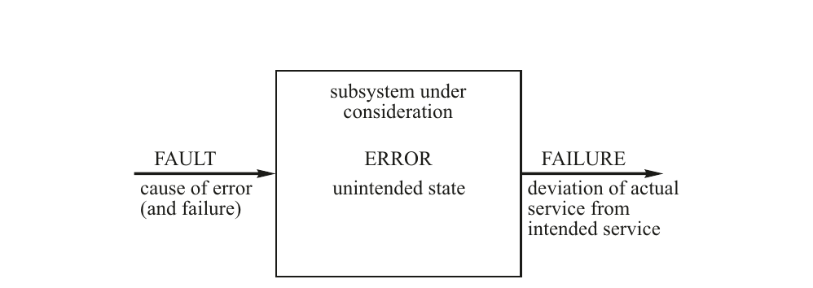

图 6.1 故障、错误和失效

计算机系统的存在是为了向系统用户提供可靠的服务。用户可以是人类用户，也可以是另一个计算机系统。每当系统用户所看到的系统行为（见第 4.1.1 节）偏离预期服务时，系统就被认为已经失效。失效可以追溯到系统内部的一个非预期状态，这称为错误。错误由一种不利现象引起，这称为故障。

我们使用"预期"一词来描述系统正确的状态或行为。理想情况下，这种正确的状态或行为记录在一个精确且完整的规范中。然而，有时规范本身是错误的或不完整的。为了将规范错误纳入我们的模型，我们引入"预期"一词，以建立一个正确性的抽象参考。

如果我们将故障、错误和失效这几个术语与四宇宙模型（第 2.3.1 节）的层次关联起来，那么术语"故障"指的是模型任意层次上的不利现象，而术语"错误"和"失效"则专指数字逻辑层、信息层或外部层的不利现象。如果假设存在稀疏全局时间基准，那么数字逻辑层及以上层次的任何不利现象都可以通过值域中的特定位模式和稀疏全局时间基准上的发生时刻来识别。这对于发生在物理层的现象是无法做到的。

---

### 6.1.1 故障

我们假设系统由组件构建而成。如果一个组件的单个故障的直接影响只影响该单个组件的运行，则该组件是一个故障遏制单元（FCU）。多个 FCU 应独立失效。图 6.2 描述了故障的分类。

图 6.2 故障的分类

**故障空间** 区分与 FCU 内部缺陷相关的故障和发生在 FCU 外部的不利现象相关的故障是很重要的。组件的内部故障，即 FCU 内的故障，可以是物理故障（如导线的随机断裂），也可以是软件中的设计故障（程序错误）或硬件中的设计故障（勘误）。外部故障可以是物理扰动，例如闪电在电源中引起尖峰，或宇宙粒子撞击的影响。提供不正确的输入数据是另一类外部故障。故障遏制是指确保故障的直接后果局限于单个 FCU 的设计和工程努力。许多可靠性模型默认假设 FCU 独立失效，即不存在可以影响多个 FCU 的单一故障。这种 FCU 独立性假设必须由系统设计来证明其合理性。

示例：容错系统中 FCU 的物理分离降低了空间邻近故障的概率，使得单一位置的故障（例如事故中的撞击）无法摧毁超过一个 FCU。

---

**故障时间** 在时域方面，故障可以是瞬态的或永久的。物理故障可以是瞬态的或永久的，而设计故障（例如软件错误）始终是永久的。

瞬态故障出现一段短暂的时间，在该时间间隔结束时消失，无需任何显式的修复操作。瞬态故障可能导致错误，即 FCU 状态的损坏，但不损坏物理硬件（根据定义）。我们将瞬态外部物理故障称为暂态故障。暂态故障的一个例子是宇宙粒子撞击，它损坏了 FCU 的状态。我们将瞬态内部物理故障称为间歇性故障。间歇性故障的例子包括氧化物缺陷、腐蚀或其他尚未发展到硬件永久失效阶段的故障机制。根据[Con02]，在现场观察到的大量瞬态故障是间歇性故障。暂态故障的故障率是恒定的，而间歇性故障的故障率随时间增加。电子硬件组件的间歇性故障率不断上升是该组件磨损的迹象。它表明应进行预防性维护——更换故障组件——以避免组件永久故障。

永久故障是一种在显式修复操作发生并移除故障之前一直存在于系统中的故障。永久外部故障的一个例子是电源的持续中断。永久内部故障可以发生在硬件的物理实体中（例如内部导线断裂）或软件或硬件的设计中。永久故障发生后修复系统所需的平均时间称为 MTTR（平均修复时间）。

### 6.1.2 错误

故障的直接后果是组件中的不正确状态。我们称这种不正确的状态——即 CPU 内存、寄存器或触发电路中的错误数据元素——为错误。随着时间的推移，错误可能被计算激活、被某种错误检测机制检测到，或被清除。

如果某个计算访问了错误，则该错误被激活。从此刻起，该计算本身也变得不正确。如果故障影响了一个内存单元或寄存器的内容，则当该内存单元被计算访问时，随之而来的错误将被激活。如果涉及内存单元，错误发生与错误激活之间可能存在很长的时间间隔（错误的休眠期）。如果故障影响 CPU 的电路，则故障可能立即被激活，当前计算将被损坏。一旦不正确的计算将数据写入内存，这部分内存也变为错误的。

---

我们区分两种类型的软件错误，分别称为 Bohrbugs 和 Heisenbugs [Gra86]。Bohrbug 是一种可以通过向包含 Bohrbug 的例程提供特定输入模式（即一种总导致底层 Bohrbug 被激活的特定输入数据模式），在数据域中以 L-确定性方式复现的软件错误。Heisenbug 是一种只有当输入数据和输入数据的精确时序——相对于计算机中所有其他活动的时间关系——被精确复现时才能观察到的软件错误。由于复现 Heisenbug 很困难，许多通过开发和测试阶段并在实际运行系统中出现的软件错误都是 Heisenbugs。由于事件触发系统中的时序控制结构是动态的，Heisenbugs 在事件触发系统中比在具有数据无关的静态控制结构的时间触发系统中更可能出现。

示例：Heisenbug 的一个典型例子是并发系统中数据访问同步的错误。这种错误只有当访问互斥数据的任务之间的时间关系被精确复现时才能被观察到。

当计算访问了错误并发现计算结果在值域或时域偏离用户的期望或预期时，错误被检测到。例如，简单的奇偶校验如果能假设故障仅损坏了数据字中的单个比特，就能检测到错误。错误（故障）发生时刻与错误检测时刻之间的时间间隔称为错误检测延迟时间。错误被检测到的概率称为错误检测覆盖率。测试是一种检测系统中设计故障（软件错误和硬件勘误）的技术。

如果计算在错误被激活或检测之前就用新值覆盖了它，则错误被清除。既没有被激活、也没有被检测到、更没有清除的错误称为潜伏错误。组件状态中的潜伏错误会导致静默数据损坏（SDC），这可能导致严重后果。

示例：假设在一个不受奇偶位保护的内存单元中发生比特翻转，且该内存单元包含有关汽车发动机预期加速的传感器输入数据。随之而来的静默数据损坏可能导致汽车意外加速。

### 6.1.3 失效

失效是一个事件，表示组件的实际行为与预期行为（服务）之间在特定时刻发生的偏差。由于在我们的模型中，组件的行为表示组件产生的消息序列，失效表现为产生非预期（或没有预期）消息。图 6.3 对组件失效进行了分类。

图 6.3 失效的分类

---

**域** 失效可以发生在值域或时域。值失效意味着在组件-用户接口处呈现了不正确的值。（请记住，用户可以是另一个系统。）时间失效意味着值在被预期的实时区间之外呈现。时间失效仅当系统规范包含有关系统预期时间行为的信息时才存在。时间失效可以细分为早期时间失效和晚期时间失效。如果一个组件包含内部错误检测机制以检测任何错误，并抑制包含值错误或早期时间失效的结果，则该组件在其用户接口处只会表现出晚期时间失效，即遗漏。我们称这种失效为遗漏失效。只产生遗漏失效的组件称为故障静默组件。如果组件在第一次遗漏失效后停止工作，则称为故障停止组件。相应的失效有时称为干净失效或崩溃失效。

示例：自检组件是一种包含内部失效检测机制的组件，使其在组件-用户接口处仅表现出遗漏失效（或干净失效）。自检组件可以由两个确定性 FCU 构建，这两个 FCU 在大致相同的时间产生两个结果，并由一个自检检查器对两个结果进行检查。

示例：MARS 架构的故障注入实验表明，观察到的失效中有 1.9% 到 11.6% 是时间失效，即消息在非预期时刻产生。一个独立的时间片控制器（监护器）检测到了所有这些时间失效[Kar95, p. 326]。

**严重性** 根据失效对环境的影响，我们区分两种极端情况：良性失效和恶性失效（另见第 1.5 节）。良性失效的代价与系统正常效用的损失处于同一数量级，而恶性失效可能导致比系统正常效用高出几个数量级的失效代价，例如恶性失效可能导致灾难，如事故。我们称可能发生恶性失效的应用为安全关键应用。应用的特性决定了失效是良性还是恶性。在良性和恶性这两个极端之间，我们可以给失效分配一个严重性等级，例如基于失效的货币影响或失效对用户体验的影响。

示例：在多媒体系统中，例如数字电视机，单个像素在下一周期被覆盖的失效会被人类感知系统掩盖。因此，这种失效的严重性可以忽略不计。

**频率** 在给定的时间间隔内，失效可以只发生一次或反复发生。如果只发生一次，称为单次失效。如果系统在失效后继续运行，我们称该失效为瞬态失效。频繁发生的瞬态失效称为重复失效。单次失效的一种特殊情况是永久失效，即系统在失效发生后停止提供服务，直至显式修复操作消除失效原因。

---

**视图** 如果多个用户观察一个失效组件，可以区分两种情况：所有用户看到相同的失效行为——我们称之为一致失效——或不同用户看到不同的行为（我们称之为不一致失效）。在文献中，不一致失效有不同的名称：双面失效、拜占庭失效或恶意失效。不一致失效最难处理，因为它们有可能混淆正确的组件（见第 3.4.1 节）。在高完整性系统中，必须考虑拜占庭失效的发生[Dri03]。

示例：假设一个系统包含三个组件。如果其中一个组件以不一致的失效模式失效，则其他两个正确组件将对失效组件的行为有不同的视图。在极端情况下，一个正确组件将失效组件归类为正确，而另一个正确组件将失效组件归类为错误，导致正确组件之间对失效组件的视图不一致。

示例：略超出规格（SOS）失效是拜占庭失效的一种特殊情况。SOS 失效可能发生在四宇宙模型（见第 2.3.1 节）的模拟层和逻辑层之间的接口处。如果在总线系统中，发送方高电平输出的电压略低于高电平状态的规定电平，那么一些接收方可能仍然接受该信号，假定信号的值是高电平，而其他接收方可能不接受该信号，假定该值不是高电平。如果信号在电压或时序方面处于临界状态，SOS 失效将是一个严重问题。

**传播** 如果组件内部的错误被激活并传播到受故障影响的组件的界限之外，则我们称之为错误传播。让我们做一个简化假设：组件仅通过消息交换与其环境通信，并且没有其他组件交互方式（如共享内存）。在这样的系统中，错误只能通过发送不正确的消息传播到受影响的组件之外。

为了避免传播的错误感染其他——在此之前健康的——组件，从而违反组件独立性假设，必须在每个组件周围建立错误传播边界。消息可以在值域上不正确（消息的数据字段包含损坏的值）或在时域上不正确，即消息在非预期时刻发送或根本不发送（遗漏失效）。时间消息失效可以被通信系统检测到，前提是通信系统具有关于组件正确时间行为的先验知识。由于通信系统对消息值字段的内容不知情（见第 4.6.2 节），检测消息数据字段中损坏的值（即错误）是消息接收方的责任。

---

在循环系统中，g-状态（见第 4.2.3 节）的损坏尤其值得关注，因为 g-状态包含影响下一周期行为的当前周期信息。由于 g-状态中的潜伏错误可能成为下一周期计算的不正确输入，g-状态中错误的数量可能逐步增加（称为状态侵蚀）。如果 g-状态为空，则错误不可能从当前周期传播到下一周期。为了避免错误从当前周期传播到下一周期，应由一个独立的诊断组件的特殊错误检测任务监控 g-状态的完整性。

## 6.2 信息安全

信息安全涉及计算机系统提供的信息和服务的真实性、完整性、机密性、隐私和可用性。在下文中，当我们使用"安全"一词时，始终指信息安全。我们将计算机系统设计或运行中可能导致安全事件的缺陷称为漏洞，将漏洞的成功利用称为入侵。以下原因清楚地说明了为什么信息安全已成为嵌入式系统设计和运行中的首要关注点[Car08]：

(i) **控制器即计算机：**在过去几年中，硬连线电子控制器已被带有不完善操作系统的可编程计算机所取代，使外部人员有可能利用软件系统的漏洞。

(ii) **嵌入式系统是分布式的：**大多数嵌入式系统是分布式的，通过有线或无线通道连接各节点。外部入侵者可以利用这些通信通道进入系统。

(iii) **嵌入式系统连接到互联网：**嵌入式系统与互联网的连接使世界上任何地方的入侵者都可以攻击远程系统，并系统地利用任何被发现的漏洞。

---

至今，在信息空间（例如互联网）与物理世界中的行动之间通常存在一个人类中介。人类被认为具有常识和责任感。他们能够识别明显错误的计算机输出，不会基于这种错误输出在物理世界中采取任何行动。然而，在直接连接到互联网的嵌入式系统——物联网（IoT）中，情况大不相同，其中网络边缘的智能物体（例如机器人）可以立即与物理世界交互。攻击者可以通过突破安全壁垒来破坏嵌入式系统的完整性，从而成为安全隐患。或者，攻击者可以进行拒绝服务攻击，从而使重要服务的可用性丧失。因此，安全性和安全性（safety）在连接到互联网的嵌入式系统中是相互关联的，并且是最重要的关注点。

示例：假设度假屋的主人可以通过互联网远程设置度假屋中电炉温控器的温度。如果攻击者控制了温控器，他可以将温度升高到很高的水平，并显著增加能耗。如果攻击者对某个社区的所有度假屋执行此攻击，则该社区的总功耗可能超过临界水平，导致停电（例子取自[Koo04]）。

标准安全技术基于健全的安全架构，该架构控制不同关键性级别和机密性级别的子系统之间的信息流。架构决策通过部署密码学方法（如加密、随机数生成和哈希）来实现。执行密码学方法需要额外的能量和硅片面积，这些在小型（便携式）嵌入式系统中并不总是可用的。

### 6.2.1 安全信息流

嵌入式系统中的主要安全关切是实时数据和系统配置的真实性和完整性，以及——在较小程度上——对数据的访问控制。安全策略必须规定哪些进程有权修改数据（数据完整性），哪些进程可以查看数据（数据机密性）。数据完整性的安全策略可以基于 Biba 模型建立，而数据机密性的安全策略可以从 Bell-LaPadula 模型[Lan81]推导。两种模型都根据从最高到最低的有序级别序列对进程和数据文件进行分类。进程可以读取和修改与其处于同一级别的数据。相应的安全模型管理对不同于读取或写入进程级别的数据的访问和修改。

---

Biba 模型关注的是数据完整性，这在多关键性嵌入式系统中非常相关。数据文件和进程的分类由安全分析（见第 11.4.2 节）视角下的关键性决定。为了确保（高关键性）进程的完整性，（高关键性）进程不得读取分类级别低于该（高关键性）进程分类的数据。为了确保（低关键性）进程不会损坏更高级别关键性的数据，Biba 模型规定，任何（低关键性）进程不得修改处于比该（低关键性）进程更高级别关键性的数据。

Bell-LaPadula 模型关注的是数据机密性。数据文件和进程的分类由数据的机密性（从绝密到非机密）决定。为了确保绝密数据的机密性，必须确保任何（非机密）进程不得读取分类级别高于该（非机密）进程分类的数据。为了确保（绝密）进程不会将机密数据发布到较低（非机密）级别，Bell-LaPadula 模型规定，任何（绝密）进程不得向机密性级别低于该（绝密）进程的数据文件写入数据。

从完整性和机密性的角度看，进程和数据的分类通常是不同的。这些差异可能导致利益冲突。在发生这种冲突的情况下，完整性关切在嵌入式系统中是更重要的关切。

所选的安全策略必须由建立进程真实性和交换数据完整性的机制来强制执行。这些机制广泛使用了第 6.2.3 节中讨论的经过充分理解的密码学方法。

### 6.2.2 安全威胁

系统的安全分析从攻击模型的规范开始。攻击模型提出攻击假设，即列出威胁并对攻击者的攻击策略做出假设。然后概述攻击者为侵入系统而采取的可能步骤。在下一阶段，制定防御策略以对抗攻击。攻击假设始终有可能是不完整的，聪明的攻击者可能找到攻击假设未涵盖的方法来攻击系统。

---

典型攻击者按以下三个阶段进行：接入选定的子系统、搜索并发现漏洞，最后入侵并控制选定的子系统。控制可以是被动的或主动的。在被动控制中，攻击者观察系统并收集机密信息。在主动控制中，攻击者修改系统的行为，使系统服务于攻击者的恶意目的。安全架构必须包含观测机制，即入侵检测机制，以检测与攻击这三个阶段中任何阶段相关的恶意活动。它还必须提供防火墙和程序，以减轻攻击的后果，使系统能够生存。

必须通过要求严格遵守强制访问控制程序来防止对系统的接入，其中每个人或进程必须认证自己，并通过回呼程序验证此认证。安全防火墙在限制授权用户访问敏感子系统方面发挥着重要作用。

攻击者对漏洞的搜索可以通过入侵检测机制来检测，这可以是异常检测子系统的一部分（见第 6.3.1 节）。异常检测对于发现随机物理故障的后果以及恶意入侵者的活动都是必要的。

对于子系统的控制夺取，可以通过结构化的安全架构来防止，其中不同关键性级别被分配给不同的进程，并且基于形式化模型的形式化安全策略控制这些关键性级别之间的交互。

最高安全性不仅仅是一种技术挑战。它需要高层管理承诺，以确保用户严格遵守给定安全策略的组织规则。许多安全违规不是由计算机系统的技术弱点引起的，而是由用户未能遵守组织现有安全策略引起的。

示例：Beautement 等人[Bea08]指出："安全研究和实践中广泛认同，许多安全事件是由人为原因而非技术故障引起的。从人机交互（HCI）角度研究该问题的研究人员证明，许多人为故障是由对于非专家用户来说过于复杂的安全机制引起的。"

以下安全攻击列表仅表明已观察到的情况。它绝不是完整的：

**恶意代码攻击：**恶意代码攻击是一种攻击，攻击者将恶意代码（例如病毒、蠕虫或特洛伊木马）插入软件中，以使攻击者获得系统的部分或完全控制。这种恶意代码可以静态插入（例如通过恶意维护操作（内部攻击）、通过下载新软件版本的过程），或在系统运行期间通过访问受感染的互联网站点或打开受感染的数据结构动态插入。

---

**欺骗攻击：**在欺骗攻击中，攻击者伪装成合法用户以获得对系统的未授权访问。互联网中有许多欺骗攻击的变体：用看似相同但受攻击者控制的副本替代合法网页（例如银行的网页）（也称为钓鱼），用假地址替代电子邮件中的正确地址，以及中间人攻击，其中入侵者截获两个通信伙伴之间的会话并获得对所有交换消息的访问。

**密码攻击：**在密码攻击中，入侵者试图猜测保护系统访问的密码。密码攻击有两种形式：字典攻击和暴力攻击。在字典攻击中，入侵者猜测常用的密码字符串。在暴力攻击中，入侵者系统地搜索密码的完整代码空间，直到成功。

**密文攻击：**在此攻击模型中，攻击者假设能够访问密文，并试图从密文中推导出明文以及可能的加密密钥。现代标准化加密技术，如 AES（高级加密标准），被设计为使密文攻击的成功几乎不可能。

**拒绝服务攻击：**拒绝服务攻击试图使计算机系统对其用户不可用。在任何无线通信场景中，如传感器网络，攻击者可以用适当频率的高功率信号干扰以太，以干扰目标设备的通信。在互联网中，攻击者可以向一个站点发送协调的服务请求爆发，以使该站点过载，从而使合法的服务请求无法再被处理。

**僵尸网络攻击：**僵尸网络（bot 是 robot 的缩写）是一组受感染的联网节点（例如数千台 PC 或机顶盒），这些节点受攻击者控制，并（节点所有者不知情地）协作实现恶意任务。在第一阶段，攻击者获得对僵尸网络节点的控制并用恶意代码感染它们。在第二阶段，他对选定的目标网站发起分布式拒绝服务攻击，使目标网站对合法用户不可用。僵尸网络攻击是互联网中最严重的攻击模式之一。

示例：日本的一项研究[Tel09, p. 213]显示，一台未受保护的 PC 在连接到互联网时，平均约四分钟就会被感染，估计有 500,000 台 PC 被感染。来自日本 IP 地址的共约 10 Gbps 流量被僵尸网络浪费（不包括通过僵尸网络发送的垃圾邮件流量）。

**恶意训练数据攻击：**随着机器学习在实时系统中的应用，例如自动驾驶汽车中的物体识别，攻击者可能利用恶意训练数据在系统运行期间导致失效[Bar10]，例如错误的物体分类。

---

### 6.2.3 密码学方法

在连接到互联网（IoT）的嵌入式系统中提供足够水平的完整性和机密性，只能通过审慎应用密码学方法来实现。与通用计算系统相比，嵌入式系统的安全架构必须应对以下两个额外约束：

- **时序约束：**数据的加密和解密不得延长时间关键任务的响应时间；否则加密将对控制质量产生负面影响。

- **资源约束：**许多嵌入式系统在内存、计算能力和能量方面受到资源约束。

**基本密码学概念** 任何安全架构中必须支持的基本密码学原语包括对称密钥加密、公钥加密、哈希函数和随机数生成。这些原语的正确应用，在安全的密钥管理系统的支持下，可以确保数据的真实性、完整性和机密性。

在以下段落中，我们使用"困难"一词表示：超出设想的攻击者在安全必须提供保障的时间段内破解系统的能力。如果系统设计以及密码学算法和密钥选择合理地证明了攻击者成功攻击的可能性极低假设，则使用"强密码学"一词。

在密码学中，用于加密或解密的算法称为密码（cipher）。在加密过程中，密码将明文转换为密文。密文保存了明文的所有信息，但不知道算法和密钥来解密的话是无法理解的。

对称密钥加密算法使用相同（或简单相关）的密钥来加密和解密明文。因此，加密密钥和解密密钥都必须保密。相比之下，非对称密钥算法使用不同的密钥（公钥和私钥）进行加密和解密。虽然这两个密钥在数学上是相关的，但仅从公钥知识推导出私钥是困难的。非对称密钥算法构成了广泛使用的公钥加密技术的基础[Riv78]。

---

密钥分发的过程称为密钥管理。在公钥加密系统中，系统的安全取决于私钥的保密性以及公钥与相应私钥所有者身份之间可信关系的建立。这种可信关系可以通过对先验已知的安全服务器执行安全网络认证协议来建立。这种网络认证协议的一个示例是 KERBEROS 协议，它提供相互认证[Neu94]，并通过使用可信安全服务器在开放（不安全）网络中的两个节点之间建立安全通道。

随机数在对称和非对称密码学中都需要，用于密钥生成以及生成仅使用一次的不可预测数字（称为 nonce），以确保会话密钥的唯一性。在公钥加密中，需要私钥的节点必须从 nonce 生成非对称密钥对。私钥对节点保密，而公钥通过开放通道向公众分发。必须向安全服务器发送一份签名后的公钥副本，以便其他节点可以检查公钥与生成该公钥的节点身份之间的可信关系。

为了确保保密性，私钥不应以明文形式存储，而必须封装在密码学信封中。要操作这样的信封，需要一个未加密的密钥，通常称为根密钥。根密钥作为信任链的起点。

支持公钥加密所需的计算工作量远高于对称密钥加密所需的计算工作量。因此，公钥加密有时仅用于密钥的安全分发，而数据的加密则使用对称密钥进行。

密码学哈希函数是一个 L-确定性（见第 5.6 节）的数学函数，它将大的变长输入字符串转换为固定大小的位字符串，称为密码学哈希值（或简称哈希），在以下约束条件下：

- 输入字符串中数据的意外或有意改变将改变哈希值。

- 找到具有给定哈希值的输入字符串应该是困难的。

- 找到具有相同哈希值的两个不同输入字符串应该是困难的。

密码学哈希函数是通过电子签名建立明文消息真实性和完整性所必需的。

---

**认证** 任何人只要知道发送方的公钥，就可以解密用发送方私钥加密的消息。如果已确定发送方的公钥与发送方身份之间存在可信关系，则接收方知道该消息是由已识别的发送方产生的。

**数字签名** 如果需要同时建立明文消息的真实性和完整性，则明文被作为密码学哈希函数的输入。然后，哈希值用作者的私钥加密，生成数字签名，并附加到明文上。拥有作者公钥的接收方必须检查解密后的签名是否与重新计算的接收文本哈希值具有相同的位字符串。

**隐私** 任何使用接收方公钥加密消息的人都可以确定，只有公钥被使用的那个接收方才能解密该消息。

**资源需求** 密码学操作的计算工作量（以所需能量、时间和实现的门数来衡量）取决于所选算法及其实现。2001 年，美国国家标准与技术研究所选择 AES（高级加密标准）算法作为对称加密的联邦信息处理标准。AES 支持 128、192 和 256 位的密钥大小。表 6.1 给出了不同硬件实现 AES 的资源需求估算。从该表可以看出，所需时间和所需硅面积之间存在重要的设计权衡。

| AES 128 加密 | 门等效数 | 时钟周期 |
| --- | --- | --- |
| Feldhofer | 3,628 | 992 |
| Mangard | 10,799 | 64 |
| Verbauwhede | 173,000 | 10 |

表 6.1 不同硬件 AES 实现的需求比较（改编自[Fel04a]）

---

表 6.1 中所描述的 AES 算法的不同实现展示了硅面积（门数）与速度（时钟周期）之间的权衡，这对许多算法都适用。公钥加密的资源需求高于表 6.1 中列出的值。

安全措施在当今的嵌入式系统硅解决方案中已易于获得。例如，汽车微控制器通常实现硬件安全模块（HSM）。[Pot21] 概述了 Infineon AURIX 上的 HSM 功能，讨论了其局限性，并将 HSM 与基于软件的实现进行了比较。

### 6.2.4 网络认证

在下文中，我们概述一个使用公钥密码学建立新节点与其公钥之间可信关系的网络认证协议示例。为此，我们需要可信安全服务器。让我们假设所有节点都知道安全服务器的公钥密码学密钥，并且安全服务器事先知道所有节点的公钥密码学密钥。

如果一个节点（例如节点 A）想要向一个尚未识别的节点（例如节点 B）发送加密消息，则节点 A 执行以下步骤：

(1) 节点 A 形成一条带签名的消息，内容如下：当前时间、节点 A 想知道节点 B 的公钥是什么？以及节点 A 的签名。然后节点 A 用安全服务器的公钥加密此消息，并通过开放通道将密文消息发送到安全服务器。

(2) 安全服务器用其私钥解密消息，并检查消息是否在最近发送的。然后，它用先验已知的节点 A 签名的公钥检查消息的签名，以查明来自节点 A 的消息内容是否真实。

(3) 安全服务器形成一条响应消息，内容为当前时间、节点 B 的地址、节点 B 的公钥和签名，用节点 A 的公钥加密此消息，并通过开放通道将此密文消息发送到节点 A。

(4) 节点 A 用其私钥解密消息，并检查消息是否在最近发送的，以及安全服务器的签名是否真实。由于节点 A 信任安全服务器的信息，现在它知道节点 B 的公钥是真实的。它使用此密钥加密它发送给 B 的消息。

一个通过使用对称密码学在两个节点之间建立安全通道的网络认证协议是前述的 KERBEROS 协议[Neu94]。

---

### 6.2.5 实时控制数据的保护

让我们为工业工厂中的实时过程控制系统假设以下攻击模型。分布在整个工厂中的若干传感器节点通过开放的无线通道周期性地向控制器节点发送实时传感器值，控制器节点计算控制阀的设定点。攻击者希望通过向控制器节点发送伪造的传感器值来破坏工厂的运作。

为了建立传感器值的真实性和完整性，标准的安全解决方案是由真正的传感器节点在传感器值上附加一个电子签名，并由接收消息的控制器节点检查此签名。然而，这种方法会将控制回路的持续时间延长生成和检查电子签名所需的时间。这将延长控制回路周期，对控制质量产生负面影响，必须避免。

在实时控制系统中，设计挑战在于找到一个在不延长控制回路周期的情况下检测攻击者的解决方案。上述例子表明，实时性能和安全这两个要求在实时控制系统中不能分开处理。

在设计安全协议时，必须考虑实时控制系统的以下特性：

- 在许多控制系统中，单个损坏的设定点值不是严重问题。只有一系列损坏的值才必须避免。

- 传感器值具有较短的时间准确性（见第 5.4 节）——通常在几毫秒的范围内。

- 许多移动嵌入式系统的资源（包括计算和能量）受到约束。

其中一些特性是有帮助的；其他特性使找到解决方案更加困难。

示例：可以将实时数据的签名生成和签名检查从控制回路中取出，并行执行。因此，入侵检测将延迟一个或多个控制周期（考虑到控制系统的特性，这是可以接受的）。

需要进一步的研究来找到在上述约束下有效的实时数据保护技术。

---

## 6.3 异常检测

### 6.3.1 什么是异常？

如果我们查看实际嵌入式系统的状态空间，我们会发现许多在预期（正确）状态与错误之间存在灰色地带的例子。我们将处于这个预期状态与错误状态或行为模式之间的中间灰色地带的状态称为异常或超出常规状态（见图 6.4）。异常检测关注的是检测超出预期——即正常行为模式——但不属于错误或失效类别的状态或行为模式。异常的发生有多种原因：入侵者寻找漏洞的活动、环境中的异常情况、用户错误、传感器退化导致的不精确传感器读数、外部扰动、规范变化，或由设计或硬件错误引起的即将发生的故障。异常的检测很重要，因为异常的出现表明某些可能需要立即采取纠正措施的非典型场景（例如攻击者即将入侵）正在发展。

图 6.4 预期状态与错误状态之间的灰色地带

---

应用特定的先验知识——关于 RT 实体的值的受限范围及已知相互关系——可用于检测语法方法无法检测到的异常。有时这些应用特定的机制被称为合理性检查。

示例：受控对象技术过程（例如温度变化）的惯性对 RT 实体变化速度所施加的约束，构成了非常有效的合理性检查的基础。

合理性检查可以以断言的形式表达，用于在程序中间检查中间结果的合理性，或在程序结束时通过接受测试[Ran75]来检查。接受测试对于检测值域中发生的异常是有效的。

先进的动态异常检测技术跟踪系统的操作上下文，并自主学习特定上下文中的正常行为，以便更有效地检测异常。在表现出周期行为的实时控制系统中，对实时数据的时间序列进行分析是一种非常有效的异常检测技术。[Cha09]提供了异常检测技术的优秀综述。

---

异常检测子系统应与执行操作功能的子系统分离，原因如下：

- 异常检测子系统应作为一个独立的故障遏制单元来实现，使异常检测子系统的失效不会对操作子系统产生直接影响，反之亦然。

- 异常检测是一个定义明确的任务，必须独立于操作子系统执行。应由两个不同的工程团队分别负责操作子系统和异常检测子系统，以避免共模效应。

第 4.1.1 节介绍的组播消息原语提供了一种使组件的 g-状态可供独立异常检测子系统访问而不引入探测效应的方法。异常检测子系统将观察到的异常按严重性分级，并将其报告给离线诊断系统或在线完整性监控器。完整性监控器可以在观察到的异常指向安全相关事件时立即采取纠正措施。

示例：当汽车在制动踏板被踩下时仍继续加速，这是一种异常。在这种情况下，在线完整性监控器应自主中断加速。

---

在自动驾驶汽车领域，ANSI/UL 4600 标准[ANS20]定义了安全性能指标（SPI）的使用，作为收集车辆运行期间检测到的异常信息的一种技术。SPI 是一种主动监控运行并对所有事件（包括近失误[Near Miss]）做出响应的方法[Koo20]。

所有检测到的异常都应记录在异常数据库中，以供进一步在线或离线分析。对异常调查的深度取决于异常的严重性——异常越严重，应记录关于异常发生的更多信息。对异常数据库的离线分析可以揭示系统薄弱环节的宝贵信息，这些信息可以在未来版本中纠正。

在安全关键系统中，每一个观察到的异常都必须经过详细审查，直到异常的最终原因被明确识别出来。

### 6.3.2 失效检测

只有当观察到的组件行为可以与预期行为进行对比评判时，失效才能被检测到。系统内的失效检测只有在系统包含某种形式的关于预期行为的冗余信息时才有可能。故障检测器的覆盖率——即存在故障时检测出故障的概率——将随着关于预期行为的信息变得更加详细而增加。在极端情况下，如果组件行为中的每一个故障都必须被检测到，则需要一个提供比较基础的第二个组件——一个黄金参考组件，即冗余度为 100%。

关于计算激活模式规律性的知识可用于检测时间失效。如果事先已知一条结果消息必须每秒到达一次，则可以在一秒内检测到未收到该消息。如果已知结果消息必须在每一整秒时精确到达，并且接收方有全局时间可用，则失效检测延迟时间由时钟同步精度给出。容忍抖动的系统确实比无抖动的系统具有更长的失效检测延迟时间。从更早的失效检测中获得的额外时间对于在安全关键的实时系统中启动缓解措施可能非常显著。

在实时系统中，所有实时任务的最坏情况执行时间（WCET；见第 10.2 节）必须事先知道，以便找到可行的任务执行调度。操作系统可以利用此 WCET 来监控任务的执行时间。如果任务在其 WCET 到期之前没有终止，则该任务的时间失效已被检测到。

---

### 6.3.3 错误检测

如前所述，错误是一个不正确的数据结构，例如不正确的状态或不正确的程序。我们只有拥有关于被调查数据结构的预期属性的某种冗余信息，才能检测到错误。这些信息可以属于数据结构本身的一部分，例如 CRC 字段；也可以来自其他来源，例如以断言形式表达的先验知识，或者一个提供作为黄金参考数据结构结果的黄金通道。

**关于代码空间的语法知识** 代码空间被细分为两个分区，一个分区包含语法正确的值，另一个分区包含可检测的错误码字。这种关于有效码字语法结构的先验知识可用于错误检测。一个码字中可检测到的最大比特错误数加一称为该代码的汉明距离。使用错误检测码的例子包括内存中的错误检测码（例如奇偶位）、数据传输中的 CRC 多项式以及人机界面上的校验位。这类代码在检测值的损坏方面非常有效。

示例：考虑这样一个场景，128 个符号的字母表中的每个符号使用一个字节编码。因为只需要 7 位（2⁷=128）来编码一个符号，所以第八位可以用作奇偶位，以便能够区分有效码字与代码空间中 256 个码字中的无效码字。此代码的汉明距离为 2。

**双通道** 如果两个独立的确定性通道使用相同的输入数据计算两个结果，我们可以比较这些结果以检测故障，但无法判断这两个通道中哪一个是错误的。故障注入实验[Arl03]表明，在不同时间重复执行应用任务是检测瞬态硬件故障的一种有效技术。即使不能保证所有任务实例都能在可用时间区间内完成两次，此技术也可用于提高故障检测覆盖率。

硬件、软件和时间冗余有许多不同的可能组合，可通过两次执行计算来检测不同类型的故障。当然，两次计算必须是副本确定性的；否则，在冗余通道之间检测到的差异将远多于由故障实际引起的差异。实现副本确定性容错软件的问题已在第 5.6 节中讨论。

---

**黄金参考** 如果其中一个通道充当黄金参考——根据定义被视为正确的通道，我们可以确定另一个通道产生的结果是正确还是错误。或者，我们需要三个通道通过多数表决来确定单个故障通道，前提是这三个通道是同步的。

示例：David Cummings 报告了他在 NASA 火星探路者航天器软件中进行错误检测的经验[Cum10]："由于探路者号的高可靠性要求以及太空中辐射效应增加而导致不可预测硬件错误的可能性，我们采用了高度'防御性'的编程风格。这包括在软件中执行广泛的错误检查，以检测辐射引起的硬件毛刺和某些软件错误的可能副作用。我们团队的一名成员 Steve Stolper 在他的软件中有一个简单算术计算，如果计算机正常工作，保证结果是一个偶数（2、4、6，等等）。许多程序员不会费心去检查这样一个简单计算的结果。然而，Stolper 加入了一个显式测试来查看结果是否为偶数。我们称此测试为他的'二加二等于五检查'。我们从未预料到它会失败。你猜怎么着，在软件测试期间，我们看到了 Stolper 的错误消息，表明检查失败了。我们只看到过一次。尽管在数千次甚至数百万次迭代中多次尝试，我们始终无法复现此次失效。我们挠了挠头。这怎么可能发生，尤其是在我们软件测试实验室的良性环境中，那里辐射效应几乎不存在？我们仔细检查了 Stolper 的代码，它是正确的。"

我们能从这个例子中学到什么？我们绝不应构建仅依赖单个通道结果的安全关键系统。

## 6.4 容错

任何容错系统的设计都始于故障假设的精确规范。故障假设说明容错系统必须容忍哪些类型的故障，并将故障空间划分为两个域：正常故障域（即必须被容忍的故障）和罕见故障域（即故障假设之外的故障，假定为罕见事件）。图 6.5 描述了容错系统的状态空间。在中心，我们看到正确的状态。正常失效将使系统进入正常故障状态（即故障假设所覆盖的状态）。正常故障将被可用的容错机制纠正，将系统带回正确状态域。罕见故障将使系统进入指定故障假设之外的状态，因此不会被提供的容错机制覆盖。尽管如此，与其放弃，不如采用永不放弃（NGU）策略，尝试将系统带回正确状态。

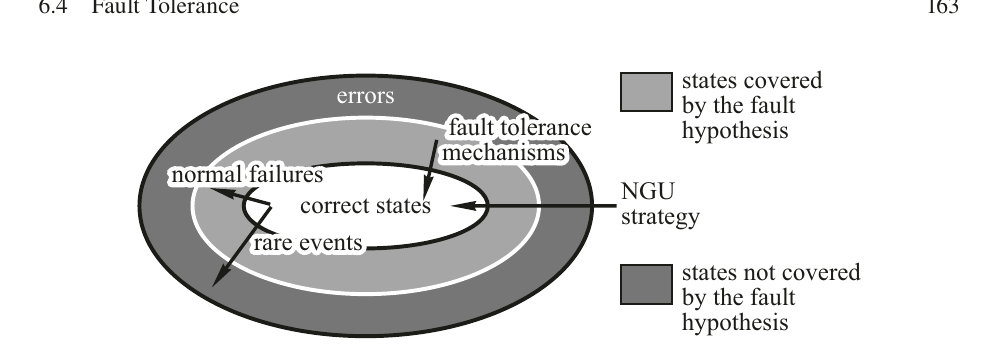

图 6.5 容错系统的状态空间

---

示例：假设故障假设规定，在指定的时间区间内，任何单个组件的故障都必须被容忍。那么两个组件同时失效的情况就在故障假设之外，因为它被认为是罕见故障。如果检测到两个组件同时失效，则 NGU 策略启动。在 NGU 策略中，假定同时故障是瞬态的，整个系统的快速重启将使系统回到正确状态。为了能够及时激活 NGU 策略，我们必须在系统内部有一个检测故障假设违反的检测机制。分布式容错成员服务，如时间触发协议（TTP）中包含的成员协议[Kop93]，实现了这样的检测机制。

### 6.4.1 故障假设

**故障遏制单元（FCU）**

故障假设从失效单元的规范开始，即故障遏制单元（FCU）。确保 FCU 独立失效是质量工程的责任。即使 FCU 故障率的微小相关性也会对系统的整体可靠性产生巨大影响。如果一个故障可能导致多个 FCU 失效，那么这种相关失效的概率必须经过仔细分析并记录在故障假设中。

示例：在分布式系统中，一个组件（包括硬件和软件）可以被视为一个 FCU。只要在电源供应和过程信号的电气隔离方面采取了适当的工程预防措施，物理上相距一定距离的分布式系统的组件独立失效的假设是现实的。在 MPSoC 上，仅通过消息交换与其他 IP 核通信的 IP 核可以被视为一个 FCU。然而，由于 MPSoC 的 IP 核在物理上非常接近（空间邻近故障的可能性），具有共同的电源和共同的时序源，因此假设 IP 核的失效是完全独立的并不合理。例如，在航空航天领域，对于总 MPSoC 失效，假定的失效率为 10 FIT，无论可用的 MPSoC 内部故障遏制机制是什么类型。

---

**失效模式与失效率** 下一步，描述 FCU 的假定失效模式，并记录每种失效模式的估计失效率。这些估计的失效率作为可靠性模型的输入，以确定设计计算出的是否与所需可靠性一致。随后，在系统建成后，将这些估计的失效率与现场观察到的失效率进行比较。这是为了检查故障假设是否合理，以及是否可以达到所需的可靠性目标。表 6.2 列出了工业和汽车领域中使用的大规模 VLSI 芯片的典型硬件失效率的数量级[Pau98]。

| 失效模式 | 失效率（FIT） |
| --- | --- |
| 永久硬件故障 | 10-100 |
| 非故障静默的永久硬件故障 | 1-10 |
| 瞬态硬件故障（强依赖于环境） | 1,000-1,000,000 |

表 6.2 硬件失效率的数量级

---

除了失效模式和失效率外，故障假设还必须包含一节，讨论用于检测故障的错误和失效检测机制。此主题在第 6.3 节中讨论。

**恢复时间** 瞬态故障后恢复所需的时间是可靠性模型的重要输入。在状态感知设计中，恢复时间取决于基态周期（见第 6.6 节）的持续时间以及重启组件所需的时间。

### 6.4.2 容错单元

为了容忍故障遏制单元（FCU）的失效，FCU 被分组为容错单元（FTU）。FTU 的目的是掩盖 FTU 内部单个 FCU 的失效。如果一个 FCU 实现了故障静默抽象，则 FTU 由两个 FCU 组成。如果不能对 FCU 的失效行为做出任何假设，即 FCU 可能表现出拜占庭失效，则需要四个 FCU 通过两条独立通信通道连接来形成一个 FTU。如果可以假设所有 FCU 都存在容错全局时间，并且通信网络包含了 FCU 的时间失效，则可以通过三重复制（称为三模冗余（TMR））来掩盖非故障静默 FCU 的失效。TMR 是最重要的故障掩盖方法。

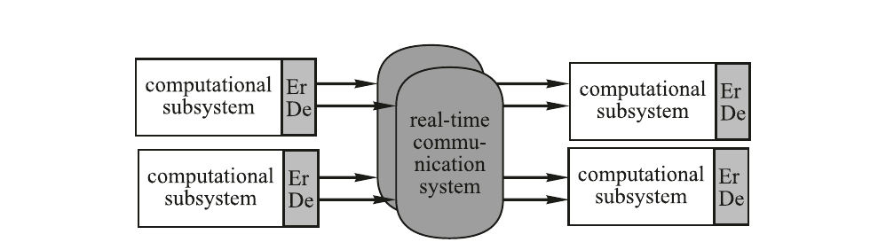

图 6.6 由两个故障静默 FCU 组成的 FTU

---

虽然 FCU 的失效被容错机制掩盖，因此在用户接口处不可见，但 FCU 的永久失效仍然会减少或消除任何进一步的故障掩盖能力。因此，被掩盖的失效必须报告给诊断系统以便修复。此外，必须提供特殊的测试技术来定期检查所有 FCU 和容错机制是否正常运行。术语"清洗（scrubbing）"指的是定期应用于检测故障单元并避免错误积累的测试技术。

示例：如果内存中的数据字受错误纠正码保护，则必须定期访问数据字以纠正错误，从而避免错误的积累。

---

**故障静默 FCU** 故障静默 FCU 由一个计算子系统和一个错误检测器（图 6.6）组成，或者由两个 FCU 和一个自检检查器组成以比较结果。故障静默 FCU 要么产生正确的结果（在值域和时域上），要么根本不产生结果。在时间触发架构中，由两个确定性故障静默 FCU 组成的 FTU 在大致相同的时刻产生零个、一个或两个正确的结果消息。如果没有产生消息，则表示它已失效。如果产生了一个或两个消息，则表示它正在运行。接收方必须丢弃冗余的结果消息。由于两个 FCU 是确定性的，两个结果（如果可用）都是正确的，取哪个结果并不重要。如果结果消息是幂等的，两个复制的消息将与单个消息具有相同的效果。

**三模冗余** 如果故障遏制单元（FCU）在其链接接口（LIF）处可能表现出在给定应用域中不能容忍的概率的值失效，则可以在三模冗余（TMR）配置中检测和掩盖这些值失效。在 TMR 配置中，容错单元（FTU）必须由三个同步的确定性 FCU 组成，其中每个 FCU 由一个表决器和计算子系统组成。任何两个连续的 FTU 必须通过两条独立的实时通信系统连接，以容忍两条通信系统中任何一条的故障（图 6.7）。所有 FCU 和通信系统必须能够访问容错的全局时间基准。通信系统必须在时域执行错误遏制，即它必须知道关于 FCU 被允许的时间行为的知识。如果 FCU 违反了其时间规范，通信系统将丢弃从该 FCU 接收到的所有消息，以保护自身免受过载情况的影响。在无故障情况下，每个接收 FCU 将收到六条物理消息，每条消息（通过两条独立通信系统）来自每个发送 FCU。由于所有 FCU 都是确定性的，正确的 FCU 将产生相同的消息。表决器检测到错误消息，并通过比较三个独立计算的结果，然后选择由多数（即三分之二 FCU）计算的结果，一步完成错误掩盖。

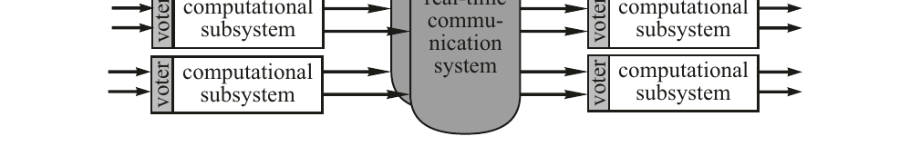

图 6.7 两个 FTU，每个由三个带表决器的 FCU 组成

---

根据上述规则建立的 TMR 配置将容忍任何 FCU 和任何通信系统的任意失效，前提是有容错全局时间基准可用。

可以区分两种不同类型的表决策略：精确表决和非精确表决。在精确表决中，对构成 FTU 的三个 FCU 的结果消息中的数据字段按位比较。如果可用消息中有三分之二具有完全相同的位模式，则选择其中一条消息作为三元组的输出。其基本假设是，正确运行的副本确定性组件产生完全相同的结果。精确表决要求构成 FTU 的三个 FCU 的输入消息和 g-状态在位级别上完全相同。如果输入来自对物理环境的冗余传感器，则必须执行协商协议以强制执行位级别相同的输入消息。

在非精确表决中，如果两个结果在某个应用特定的区间内，则假定它们包含语义上相同的结果。如果无法保证复制组件的副本确定性，则必须使用非精确表决。为非精确表决器选择适当的区间是一项微妙的任务：如果区间太大，错误值将被接受为正确值；如果区间太小，正确值将被拒绝为错误值。无论定义两个结果相同性的标准是什么，似乎都存在困难。

示例：Lala [Lal94] 报告了在空军 F-16 电传飞行控制系统中使用非精确表决的经验，该系统使用四个松同步的冗余计算通道："在开发过程中，这些通道输出的一致性在设定适当的比较阈值方面造成了相当大的麻烦，既要避免令人烦恼的虚警，又要不遗漏任何真实故障。"

**抗拜占庭容错单元** 如果不能对 FCU 的失效模式做出任何假设，且没有容错的全局时间基准可用，则需要四个组件组成一个能够容忍单个拜占庭（或恶意）故障的容错单元（FTU）。这四个组件必须执行抗拜占庭协商协议，以就单个组件的恶意失效达成一致。理论研究[Pea80]表明，这些拜占庭协商协议具有以下要求，以容忍 k 个组件的拜占庭失效：

(i) FTU 必须至少由 3k+1 个组件组成。

(ii) 每个组件必须通过 k+1 条不相交的通信路径连接到 FTU 的所有其他组件。

(iii) 为了检测恶意组件，必须在组件之间执行 k+1 轮通信。一轮通信要求每个组件向所有其他组件发送一个消息。

容忍组件拜占庭失效的架构的一个例子见[Hop78]。

---

### 6.4.3 成员服务

FTU 的失效必须以一致的方式、低延迟地报告给所有正在运行的 FTU。这就是成员服务的任务。组件成员资格可以被确立的某个实时时间点称为该组件的成员资格点。组件的成员资格点与集群中所有其他组件以一致方式被告知当前成员资格的时刻之间的时间延迟对于许多安全相关应用的正常运行至关重要。在故障假设被违反的情况下，一致地激活永不放弃（NGU）策略是成员服务的另一个重要功能。

图 6.8 汽车中智能 ABS 系统示例

---

示例：考虑一辆汽车中的智能 ABS（防抱死制动系统）制动系统，在每个车轮处放置一个分布式计算机系统的节点。每个节点的分布式算法（每个车轮一个）根据驾驶者踩下制动踏板的位置计算制动力在各车轮上的分配（图 6.8）。如果一个车轮节点失效或与车轮计算机的通信丢失，该车轮处的液压制动力执行器自主转换到一个定义的状态，例如车轮处于自由运行状态。如果其他节点在短时间内（例如约 2 ms 的单个控制回路周期）得知该车轮的计算机失效，则制动力可以重新分配到三个正常工作车轮，汽车仍然可控。然而，如果节点丢失没有被如此低的延迟识别出来，则基于所有四个车轮计算机都正常运行的假设计算出的车轮制动力分配将是错误的，汽车将失控。

**ET 架构** 在 ET 架构中，消息仅在组件发生重要事件时才发送。组件在 ET 架构中的沉默意味着要么组件没有发生重要事件，要么发生了故障静默失效（通信丢失或组件的故障静默关闭）。即使假设通信系统完全可靠，也无法区分组件无活动时的情况与 ET 架构中发生静默组件失效的情况。因此，在 ET 架构中必须实现额外的时间触发服务，例如周期性看门狗服务（见第 9.7.4 节），以解决成员问题。

**TT 架构** 在 TT 架构中，周期性消息发送时间是发送方的成员资格点。让我们假设一个故障组件在超过两个成员资格点之间最大时间区间的区间内停止服务。每个接收方事先知道发送方的消息预计何时到达，并将消息的到达解释为发送方成员资格点处的生命信号[Kop91]。然后，可以从连续两个成员资格点处预期消息的到达得出结论：在这两个成员资格点界定的整个区间内，该组件是存活的（有一个隐含假设，即瞬态故障节点在此区间内不恢复）。因此，可以在延迟一轮信息交换后确立 FTU 在集群中任何时间点的成员资格。由于在 TT 架构中一轮信息交换的延迟是事先已知的，因此可以推导出成员服务时间准确性的先验界。

---

## 6.5 鲁棒性与韧性

### 6.5.1 鲁棒性的概念

在嵌入式系统领域，如果故障后果的严重性与故障发生的概率成反比，即预期频繁发生的故障应只对系统的服务质量产生轻微影响，则我们认为系统是鲁棒的。无论故障的具体类型和来源如何，鲁棒的嵌入式系统将尽可能快地从故障影响中恢复，以最小化故障对用户的影响。如第 6.1 节所述，故障的直接后果是错误，即非预期状态。如果我们在错误对服务质量产生严重影响之前检测并纠正错误，我们就提高了系统的鲁棒性。鲁棒性设计不关注寻找故障的详细原因——这是诊断子系统的任务——而是关注故障发生后快速恢复正常的系统服务。

许多实时控制系统和多媒体系统的固有周期性有助于鲁棒性设计。由于大多数执行器的物理功率有限，控制周期中的单个不正确输出通常不会导致物理设定点的突变。如果我们能在下一个控制周期内检测并纠正错误，故障对控制应用的影响将很小。类似的论点也适用于多媒体系统。如果单个帧包含一些不正确的像素，甚至整个帧丢失但下一个连续的帧再次正确，则故障对多媒体体验质量的影响是有限的。

---


图 6.9 鲁棒系统的结构

鲁棒系统至少由两个实现为独立 FCU 的子系统组成（图 6.9）：一个运行组件执行计划好的操作并控制物理环境，另一个监控组件反映运行组件的结果和 g-状态是否与用户的意图一致[Tai03]。

在控制应用这样的周期性应用中，每个控制周期从读取 g-状态和输入数据开始，然后计算控制算法，最后产生新的设定点和新的 g-状态（见图 3.9）。一个控制周期中的瞬态故障只有在 g-状态被故障污染时才可能传播到下一个控制周期。在鲁棒系统中，运行组件必须在每个控制周期中将其 g-状态外部化，以便监控组件可以检查 g-状态的合理性，并且在检测到 g-状态中的严重异常时执行纠正措施。纠正措施可以包括重置运行组件，并以修复后的 g-状态重新启动它。

在安全关键应用中，这种双通道方法——一个通道产生结果，另一个通道（安全监控器）监控结果是否合理——是绝对必要的。即使软件已被证明是正确的，也不能假设硬件执行期间不会有瞬态故障。关于功能安全的 IEC 61508 标准要求这种双通道方法，一个通道用于正常功能，另一个独立通道用于确保控制系统的功能安全（另见第 11.4 节）。

在故障安全型应用中，安全监控器除了将应用带入安全状态外没有其他权限。安全监控器的故障静默失效将导致安全监控功能丧失，而安全监控器的非故障静默失效将导致可用性降低，但不会影响安全性。

在故障运行型应用中，安全监控器的非故障静默失效会影响应用的安全性。因此，安全监控器必须是整体安全架构的一部分。

示例：[Kop21] 提出了一种自动驾驶汽车的故障运行架构。在此架构中，监控器（监控子系统——MSS）持续检查运行 FCU（计算机控制驾驶子系统——CCDSS）。如果 MSS 或 CCDSS 故障，则后备 FCU（关键事件处理子系统——CEHSS）接管。容错决策子系统（FTDSS）确保所有执行器一致地使用 CCDSS+MSS 对的输出或 CEHSS 的输出。

---

### 6.5.2 韧性的概念

韧性定义为面对变化时可靠性的持久性[Lap08]。这些变化可以在三个维度上分类：性质（功能性、环境性或技术性）、前景（预见或未预见）和时序（秒到年）。因此，韧性是一个广泛的概念。事实上，本书中讨论的若干概念直接有助于系统的韧性。

示例：系统之系统设计（见第 4.7.3 节）是一种系统性地实现韧性的方法。

示例：永不放弃（NGU）策略（见第 6.4 节）是一种对环境中短期未预见变化（即故障假设的违反）做出反应的技术。

示例：自主组件（见第 13.3.5 节）从部署中学习，并可适应变化。

尽管韧性有如此广泛的定义，在安全领域已经出现了与之密切相关的网络韧性概念[NIS21]：网络韧性是指对使用或由网络资源启用的系统的不良条件、压力、攻击或损害进行预期、承受、恢复和适应的能力。网络韧性是关于环境中未预见变化的韧性，通常与安全攻击相关。

---

## 6.6 组件重整合

大多数计算机系统故障是瞬态的，即它们零星地出现一段很短的时间，损坏状态，但不永久损坏硬件。如果在瞬态故障发生后能迅速重新建立系统服务，那么在大多数情况下，用户不会受到故障后果的严重影响。在许多嵌入式应用中，故障组件的快速重整合至关重要，必须由适当的架构机制来支持。

### 6.6.1 寻找重整合点

失效可以在系统设计者控制之外的任意时刻发生，但系统设计者可以规划修复组件重整合的正确时间点。在实时系统中重整合一个组件时，关键问题是找到一个未来的时间点，在该点上组件的状态与组件所处的环境——即集群中的其他组件和物理设备——保持同步。由于实时数据会随时间的推移而失效，回退到过去的检查点可能是徒劳的：时间的推进可能已经使检查点信息失效（另见表 4.1）。

如果必须重新加载到正在重整合的组件中的状态规模较小，且能放入单条消息中，重整合就会简化。由于在原子操作完成后状态处于相对极小值，这是组件重整合的理想时刻。在第 4.2.3 节中，我们引入了 g-状态（基态）的概念，指重整合时刻的状态。在循环系统中——许多嵌入式控制和多媒体系统是循环的——组件的理想重整合时刻是在新周期的开始。两个连续重整合时刻之间的时间距离，即重整合周期，就等于控制周期的持续时间。如果重整合时刻的 g-状态为空，则修复组件的重整合在此时刻是平凡的。然而，在许多情况下，在组件的生存期内不存在其 g-状态完全为空的时刻。

---

### 6.6.2 最小化基态

在确立了循环重整合点之后，必须分析该选定时刻的 g-状态，并使其最小化，以简化重整合过程。

在第一阶段，必须调查组件内的所有系统数据结构，以定位任何隐藏状态。特别是，必须识别所有需要初始化的变量，并检查重整合时刻所有信号量和操作系统队列的状态。一个好的编程实践是，当检测到具有 g-状态的任务时，将该任务的 g-状态输出到一个特殊的输出消息中；在任务被重新激活时，重新读取该任务的 g-状态。这样可以识别 g-状态，并使将组件所有任务的所有 g-状态打包到该组件特有一个 g-状态消息中成为可能。

在第二阶段，必须分析已识别的 g-状态并使其最小化。图 6.10 显示了建议将 g-状态信息划分为三个部分：

图 6.10 g-状态的分区

(i) g-状态的第一部分包含可以从环境仪表中检索的输入数据。如果仪表是基于状态的，并且发送 RT 实体的绝对值（状态消息）而不是其相对值（事件消息），那么对环境中所有传感器的完整扫描可以在重整合组件中建立一组当前镜像，从而使组件与外部世界重新同步。

(ii) g-状态的第二部分包含由计算机控制并可以强制作用于环境的输出数据。我们称这组输出数据为重启向量。在许多应用中，重启向量可以在开发时定义。每当一个组件需要重整合时，这个重启向量就被强制作用于环境，以实现与外部世界的一致。如果不同的过程模式需要不同的重启向量，可以在开发时定义一组重启向量，每个模式一个。

---

(iii) g-状态的第三部分包含不属于类别 (i) 或类别 (ii) 的 g-状态数据。这部分 g-状态必须从组件外部的某个来源恢复：从容错系统的复制组件、从监控组件或从操作员处恢复。在某些情况下，可以考虑重新设计过程仪表，将类别 (iii) 的 g-状态转换为类别 (i) 的 g-状态。

示例：当交通控制系统重启时，可以强制对交通灯施加一个重启向量，先将所有十字路口的灯设为黄灯，然后设为红灯，最后将主干道的灯设为绿灯。这是一种相对简单的方法来实现外部世界与计算机系统之间的同步。另一种方法——从某个记录故障前输出命令的日志文件中重建所有交通灯的当前状态——会更加复杂。

在 FTU 中有复制组件的系统中，无法直接从环境中检索的 g-状态数据必须通过 g-状态消息从 FTU 的一个组件传送到 FTU 的其他组件。在 TT 系统中，发送这样的 g-状态消息应该是标准组件周期的一部分。

---

### 6.6.3 组件重启

在监控组件检测到故障后（图 6.10），组件的重启可以按以下方式进行：(i) 监控组件向运行组件的 TII 接口发送一个可信的复位消息，以强制执行硬件复位。(ii) 复位后，运行组件执行自检，并通过检查核心映像数据结构中提供的签名来验证其核心映像的正确性。如果核心映像有误，则必须从稳定的存储中重新加载一份静态核心映像的副本。(iii) 运行组件扫描所有传感器，等待一个集群周期以获取关于其环境的所有可用的当前信息。在分析这些信息后，运行组件决定被控对象的模式，并选择必须强制作用于环境的重启向量。(iv) 最后，在运行组件从监控组件接收到与下一个重整合时刻相关的 g-状态信息后，运行组件与集群的其他部分及其物理环境同步启动其任务。

根据硬件性能和实时操作系统的特性，复位消息到达与 g-状态信息消息到达之间的时间区间可能显著长于重整合周期的持续时间。在这种情况下，监控组件必须执行大范围的状态估计，以在正确的重整合点建立相关的 g-状态。

---

### 本章小结

• 故障是错误或失效的判定原因。

• 错误是系统状态中偏离预期（正确）状态的那部分。

• 失效是一个事件，表示实际服务在特定实时时刻偏离预期服务。

• 工业品质芯片的永久失效故障率在 10 到 100 FIT 之间。瞬态故障的故障率高出几个数量级。

• 信息安全涉及计算机系统提供的信息和服务的真实性、完整性、机密性、隐私和可用性。嵌入式系统中的主要安全关切是数据的真实性和完整性。

• 漏洞是计算机系统设计或运行中可能导致安全事件的缺陷。我们将漏洞的成功利用称为入侵。

• 典型攻击者按以下三个阶段进行：接入选定的子系统、搜索并发现漏洞，最后入侵并控制选定的子系统。

• 安全研究和实践中广泛认同，许多安全事件是由人为原因而非技术故障引起的。

• 任何安全架构中必须支持的基本密码学原语包括对称密钥加密、公钥加密、哈希函数和随机数生成。

• 异常是处于正确与错误之间灰色地带的系统状态。异常的检测很重要，因为异常的出现表明某些可能需要立即采取纠正措施的非典型场景正在发展（例如攻击者的入侵）。

---

• 在安全关键系统中，每一个观察到的异常都必须经过详细审查，直到异常的最终原因被明确识别出来。

• 系统内的失效检测只有在系统包含某种形式的关于预期行为的冗余信息时才有可能。

• 故障假设说明容错系统必须容忍哪些类型的故障，并将故障空间划分为两个域：正常故障域（即必须被容忍的故障）和罕见故障域（即故障假设之外的故障，假定为罕见事件）。

• 罕见故障将使系统进入指定故障假设之外的状态，因此不会被提供的容错机制覆盖。尽管如此，与其放弃，不如采用永不放弃（NGU）策略，尝试将系统带回正确状态。

• 确保 FCU 独立失效是质量工程的责任。即使 FCU 故障率的微小相关性也会对系统的整体可靠性产生巨大影响。

• 容错单元（FTU）的目的是掩盖 FTU 内部单个 FCU 的失效。虽然 FCU 的失效被容错机制掩盖，因此在用户接口处不可见，但 FCU 的永久失效仍然会减少或消除任何进一步的故障掩盖能力。

• 在三模冗余（TMR）配置中，容错单元（FTU）由三个同步的确定性 FCU 组成，其中每个 FCU 由一个表决器和计算子系统组成。

• 成员服务以一致的方式将每个 FTU 的运行状态报告给所有正在运行的 FTU。

• 在许多嵌入式应用中，故障组件的快速重整合至关重要，必须由适当的架构机制来支持。

• 鲁棒性设计不关注寻找故障的详细原因——这是诊断子系统的任务——而是关注快速恢复正常的系统服务。

• 在安全关键应用中，一个通道产生结果、另一个通道监控结果是否合理的双通道方法是绝对必要的。

---

## 参考文献

Avizienis、Laprie、Randell 和 Landwehr 的开创性论文[Avi04]介绍了可靠性和安全领域的基本概念。异常检测在 Chandola [Cha09]的综合综述中有所涵盖，在线失效预测是[Sal10]的主题。多个行业已制定了行业特定的网络安全标准，例如汽车领域的 ISO/SAE 21434 [ISO21]或自动化和控制系统的 IEC 62443 [IEC21]。一年一度的 DSN 会议（由 IEEE 和 IFIP WG 10.4 组织）是发表可靠和安全计算领域研究论文的最重要论坛。

### 复习题与习题

6.1 给出术语失效、错误和故障的精确含义。FCU 的特征是什么？

6.2 VLSI 芯片的典型永久和瞬态故障率是多少？

6.3 什么是异常？为什么异常检测很重要？

6.4 为什么从瞬态故障中快速恢复很重要？

6.5 错误检测的基本技术是什么？从错误检测的角度比较 ET 系统和 TT 系统。

6.6 鲁棒性和容错之间的区别是什么？描述鲁棒系统的结构！

6.7 Heisenbug 和 Bohrbug 之间的区别是什么？

6.8 描述拜占庭失效的特征！什么是 SOS 失效？

6.9 举一些安全威胁的例子！什么是僵尸网络？

6.10 Biba 模型与 Bell-LaPadula 模型在安全系统方面有何区别？

6.11 系统安全分析必须采取哪些步骤？什么是漏洞？什么是入侵？

6.12 什么是成员服务？举一个成员服务需求的实例。成员服务的质量参数是什么？如何在 ET 架构中实现成员服务？

6.13 描述故障假设文档的内容？什么是 NGU 策略？

6.14 讨论通过组件复制可以掩盖的不同类型故障。哪些故障不能通过组件复制来掩盖？

6.15 通过 TMR 实现容错需要什么？

6.16 什么是重启向量？举例说明。

---

---

# 第7章 实时通信

Real-Time Systems — Hermann Kopetz, Wilfried Steiner 著 | AI 辅助翻译

---


## 本章概述

许多实时系统是分布式计算机系统。因此，它们需要一个实时通信子系统来确保可靠且及时的消息交换，使分布式计算机系统能够作为一个协调的整体运行。我们称实时通信子系统为实时网络。实时网络与常见 IT 基础设施中的通信网络根本不同。它必须确保及时的消息交付，而这是 IT 网络所不要求的。过去，许多不同的实时网络被设计和部署。通常，特定的实时网络高度专用于特定行业，仅针对利基市场。然而，随着标准化的推进，越来越多的行业转向仅少数几种解决方案，并且这种标准解决方案的采用过程仍在持续。虽然基于标准 Ethernet 的实时网络已经使用了一段时间，但直到最近，关键的实时功能才被时间敏感网络（TSN）任务组纳入 IEEE 802.1 标准集。然而，尽管当今的 Ethernet 适合作为许多行业的实时网络，但要达到与办公设备相当的市场主导地位和互操作性，仍有很长的路要走。

我们从实时网络的定义开始本章，并讨论其典型需求，及时性是最重要的需求。虽然存在许多不同的实时网络，但它们共享共同的设计原则。我们基于一个简单模型来讨论这些原则，该模型将实时网络解释为用于消息交换的一组资源。我们的简单模型区分三种类型的消息：事件触发、速率约束和时间触发，一个实时网络可以支持其中一种或多种消息类型。我们还提及一般设计限制和陷阱。本章的其余部分对每种消息类型使用一节，首先讨论一般方面，然后介绍具体例子。对于事件触发消息，我们讨论基本 Ethernet 和 CAN。接下来，航空电子全双工交换 Ethernet（AFDX）和音频/视频桥接（AVB）展示速率约束消息。最后，我们讨论时间触发协议（TTP）、时间触发 Ethernet（TTEthernet）和时间敏感网络（TSN），作为支持时间触发消息的实时网络示例。

---

## 7.1 需求

现代实时系统通常实现一个分布式计算机系统，其中实时网络互连空间上分布的节点。实时网络在以下情况下是必要的：

(i) 实时系统本质上是分布式的，例如工厂车间的工业自动化、能源生产工厂、火车、大型飞机。

(ii) 需要将实时系统划分为几乎独立的故障遏制单元以提供容错，例如航天器、汽车。

(iii) 实时系统的处理需求超过单个节点的处理能力，例如自动驾驶汽车。

(iv) 实时系统的仪表接口无法由单个节点单独实现。例如，在工业机器人的情况下，将所有传感器和执行器直接连接到单个处理节点是不切实际的。

实时网络执行实时系统定义的所有分布式节点之间的实时通信，并可能使用异构技术和范式。实时网络还包括节点处的发送和接收子系统。实时网络必须保持前几章中阐述的实时数据的属性。因此，实时网络必须满足与非实时通信服务有很大不同的架构需求。

### 7.1.1 及时性

实时网络最重要的需求是具有有限消息传输抖动的有保证的消息传输延迟。

**有保证的消息传输延迟** 一个网络是实时网络，当且仅当可以通过分析确定时间关键消息的最坏情况消息传输延迟的界，并且该界在运行期间以足够高的概率成立。在硬实时系统中，所述概率趋向于事实上保证的要求。例如，超高可靠系统（如飞机）的常见可靠性要求规定故障率需达到 10⁻⁹ 次/小时。正是这种保证是常见 IT 网络技术无法满足的。另一方面，延迟的目标值及其界由特定实时应用的需求决定。因此，也由具体的实时应用决定某种特定的网络技术是否适合作为实时网络。在许多实时系统中，最小化最坏情况消息传输延迟将直接带来系统层面的质量提升。例如，如果实时系统实现一个实时事务（见第 1.7.3 节），该事务从获取传感器值开始，以向执行器提供输出终止，则最小化消息传输延迟将缩短实时系统控制回路的响应时间，从而改善控制稳定性和控制质量。

---


**有限的消息传输抖动** 抖动是最坏情况与最好情况消息传输延迟之间的差值。大的抖动对动作延迟的持续时间（见第 5.5.1 节）和时钟同步精度（见第 3.1.3 节）有负面影响。

**时间测量服务** 实时镜像（见第 5.4 节）在使用时刻（见第 5.4 节）必须是时间准确的，使用实时镜像的节点必须能够检查其时间准确性。因此，实时网络必须支持分布式时间测量，因为在分布式计算机系统中，对实时实体的观测和对其关联的实时镜像的使用通常发生在不同的节点上。实现时钟同步协议（例如 IEEE 1588）的实时网络可以使用时间戳来实现时间测量服务。时钟同步协议所需的质量（精度、容差/对故障和攻击的鲁棒性）由实时系统的需求决定。

### 7.1.2 可靠性与安全性

**通信可靠性** 传输中的消息可能在时域和值域丢失或损坏。因此，实时网络通常实现冗余机制。丢失的消息通过空间冗余（即沿不相交的通信路径传输）或时间冗余（即顺序消息重传）来补偿。在受益于低消息传输延迟的实时系统中，空间冗余更可取，因为消息的冗余副本可以并行传输。损坏的消息通常通过消息本身内部的数据冗余来解决。提高消息完整性的数据冗余技术包括错误检测码和错误纠正码、时间戳和序列号。我们将通信可靠性定义为在应用所有已实现的消息传输冗余机制后，实时网络成功传输消息的概率。

---

**故障遏制** 当多个节点使用相同的网络资源（例如它们通过同一物理总线连接或共享同一网络交换机）时，实时网络必须实现流量监管方法。否则，故障节点可能超出其指定配额使用资源，限制非故障节点使用该资源。流量监管方法可以在实时网络的边界实现，作为分布式节点本身的一部分，称为源头故障遏制。在这种情况下，节点本地的独立组件监控该节点的通信行为，并在该行为偏离其规范时进行干预。例如，它可以关闭整个节点。另一方面，流量监管通常在实时网络内部实现，例如在网络交换机中。一种常见的流量监管方法（在源头和网络中均适用）是漏桶算法，该算法只允许一个节点在指定的区间内传输指定数量的数据。

**消息完整性与机密性** 虽然消息完整性对通信可靠性至关重要，但过去实时系统很少要求实时消息的机密性。然而，必须重新考虑实时消息的机密性，因为随着实时系统越来越多地连接到 IT 网络甚至互联网，新的攻击变得可能。虽然单条实时消息的信息内容的货币价值可能有限，但随着多个不同消息的整合，这种价值会成倍增加。例如，整合工业生产工厂中的实时消息的攻击者可能学到过程自动化中的机密程序。因此，安全架构可能要求在实时网络的敏感部分使用网络级密码学。使用分组密码的协议如 MACsec（IEEE 802.1AE）可能是实时系统的良好匹配，因为它们可以引起可接受的额外消息传输延迟。

**配置完整性** 随着我们构建越来越复杂的实时系统，其实时网络的复杂性也随之增加。这种复杂性也反映在不断增长的实时网络配置空间中。实时网络的配置完整性在面临故障和攻击时也必须得到保护。特别地，只有经过成功认证的可信实体才能重新配置实时网络。

---


### 7.1.3 灵活性

实时系统可能固有地需要添加和删除节点甚至整个子系统的能力，例如在生产车间中添加和移除机器（即插即产）、在系统运行期间更换节点的维护程序，或航天器与空间站的对接。此外，实时系统的需求可能随时间变化，导致硬件/软件更新。

**变化的通信需求** 实时网络可以支持通信需求中的有意变化，但必须维护来自不受此变化影响的分布式应用的实时消息的最坏情况消息传输延迟。当然，只有在不超过物理或技术限制（例如总通信带宽不能被超过）的情况下，变化才能被支持。通信变化也可能需要重新配置未受影响的应用的消息传输。这取决于具体的实时系统，这种变化是允许在系统运行期间进行，还是只能在系统维护阶段进行，或者根本不允许。

**网络工程 vs. 即插即用** 不同的实时网络在响应变化的通信需求时提供不同程度的自动化重配置。网络工程是指手动或计算机辅助生成新的通信配置。另一方面，即插即用是实时网络在不需人工交互的情况下适应通信需求变化的能力。虽然像 AVB（IEEE 802.1 音频/视频桥接）这样的实时网络提供即插即用，但将其用于安全关键系统中是一种风险。

### 7.1.4 通信带宽与成本效率

**通信带宽** 实时镜像所需的通信带宽由其大小和最大更新频率决定。这种所需的带宽可能因实时实体类型和用例而差异巨大，例如从 10 Hz 的室温传感器的几 bit/s 到自动驾驶汽车的超高清摄像头的数 Gbit/s。

缩写 SWaP-C 代表的系统方面是：尺寸（Size）、重量（Weight）、功耗（Power）和成本（Cost）。虽然功耗和成本在基本上每个实时系统中都是重要因素，但重量和尺寸在汽车、飞机或航天器等移动实时系统中尤其关键。

**成本效率** 实时网络必须成本有效地满足本章讨论的需求。实时系统中存在跨行业的融合网络趋势：单一同构网络技术服务于实时系统中的多个（如果不是全部）分布式应用。融合网络通常提高网络利用率，因此也提高成本效率。IEEE 802.1 时间敏感网络（IEEE 802.1 TSN）是一种用于融合网络的实时网络技术（见第 7.5.3 节）。

---

## 7.2 设计原则与陷阱

实现实时网络有很多不同的方法，但底层设计原则的数量相当有限。根据第 2 章的讨论，这些设计原则作为一个简单模型，捕获所有系统层面相关的通信方面。在这个简单模型中，我们将实时网络视为一组抽象资源和一个基本消息传输服务（BMTS），该服务通过或多或少协调地使用所述资源，将消息从发送组件传输到一个或多个接收组件。BMTS 因其支持的消息类型而不同（见第 7.2.2 节）。在 BMTS 之上，可以实现更高层协议（见第 14.4.2 节）。

### 7.2.1 实时网络模型

在简单模型中，实时网络是一组资源，一次只能有一个发送方使用一个资源。

**个体资源** 对于每个个体资源，实时系统中只有一个发送方。资源例如是发送方与接收方之间的直接通信链路。

**共享资源** 多个发送方共享该资源。资源例如是物理总线、网络集线器或网络交换机中的消息缓冲区。

示例——交换 Ethernet 中的资源：节点通过双向通信链路连接到 Ethernet 交换机。链路中从发送方到交换机的单向部分是一个个体资源。所有其他通信链路和网络交换机中的消息缓冲区均为共享资源。

### 7.2.2 消息类型

节点通过交换消息来使用资源，我们可以区分以下消息类型。

---

**事件触发消息** 发送方在重要事件发生时产生消息。这些事件可能在实时系统的控制域之外，因此无法确定消息之间的最小时间。因此，所有发送方的总消息数可能达到或超过实时网络的资源容量，导致长的消息传输延迟甚至消息丢失。实时网络无法为事件触发消息的消息传输延迟提供时间保证。

**速率约束消息** 发送方产生消息并保证不超过预先定义的最大消息速率。基于消息速率的总和，实时网络可以相应地确定其资源的容量，并且可以离线计算最坏情况消息传输延迟的界。然而，消息传输抖动可能很高，因为来自不同发送方的速率约束消息可能稀疏地或以突发形式到达。

**时间触发消息** 发送方在同步全局时间中的预先定义的时刻产生消息。来自不同发送方的这些时间点可以协调，使实时网络能够确定其资源容量。与速率约束消息相比，实时网络可以通过这种协调来最小化其资源。实时网络还可以预先定义临时缓冲和转发时间触发消息的时间点，以及最终接收节点的接收时间点。因此，消息传输抖动可以减少到同步全局时间的精度。

从任意给定输入产生速率约束消息或时间触发消息的行为称为流量整形。

### 7.2.3 流量控制

前述消息类型是基于发送方行为定义的，但在任何通信场景中，接收方和网络的有限资源容量决定了最大通信速度。因此，流量控制涉及控制一个或多个发送方与接收方（或网络——在这种情况下，有时使用术语拥塞控制）之间信息流的速度，使得接收方（或网络）能够跟上发送方的速度。虽然速率约束和时间触发消息的先验信息允许隐式流量控制，但事件触发消息的流量控制需要显式的流量控制机制。

---


**显式流量控制** 当一个发送方或多个发送方试图超过网络或接收方的资源容量时，消息将丢失。显式流量控制机制通过向所有或部分发送方发出信号，暂停和恢复其消息传输，来防止这些情况。显式流量控制也称为背压流量控制。

示例——Ethernet 暂停命令：当 Ethernet 网络中接收节点（或交换机）的接收缓冲区超过给定的阈值时，接收节点向发送方发送一个 Ethernet 暂停消息，要求在定义的持续时间内暂停消息传输。此外，带有 VLAN 标签的 Ethernet 帧区分八种优先级。数据中心桥接也在暂停消息中使用这些优先级，可以有选择地仅暂停特定优先级的 Ethernet 帧的传输。

显式流量控制并不总是需要交换专用消息，也可以通过网络访问协议来建立。

示例——CAN：在 CAN 系统中，如果其他发送方的传输正在进行中，节点不能访问总线，即发送方的访问协议对打算发送消息的节点施加背压。

**隐式流量控制** 实时网络使用模式的先验知识固有地排除了接收方和网络中的过载场景。因此，流量控制也是预先建立的。实时网络可以实现流量监管机制，确保即使是故障发送方也不会违反所述使用模式，而是遵守其最坏情况的资源使用配额。

从复杂度的角度看，显式流量控制引入了接收方对发送方的控制。因此，故障接收方可能影响正确的发送方。隐式流量控制中发送方和接收方之间的接口是单向的，而显式流量控制中这个接口是双向的——因此更复杂。

### 7.2.4 设计限制

任何物理通信通道都由其带宽和传播延迟来表征。带宽表示在单位时间内可以通过通道的比特数。通道的长度和波（电磁波、光波）在通道内的传输速度决定传播延迟，即单个比特从通道一端传输到另一端所需的时间。由于波在电缆中的传输速度大约是真空中光速（约 300,000 km/s）的 2/3，信号要通过 1 km 长的电缆大约需要 5 μs。术语通道的比特长度表示在一个传播延迟内可以驻留在通道中的比特数。

示例：如果通道带宽为 100 Mbit/s，通道长度为 200 m，则通道的比特长度为 100 比特，因为该通道的传播延迟为 1 μs。

---

#### 7.2.4.1 基于总线的实时网络

在总线中，一次只能有一个节点发送消息。否则多个消息的信号会发生冲突，在总线上引起干扰。这种干扰将导致消息丢失，在某些情况下甚至是不对称的消息丢失：一些节点正确接收到消息，而其他节点不会。存在两种类型的媒体访问协议：冲突检测协议在发生消息冲突时检测并解决冲突，冲突避免协议防止冲突的发生。两种协议类型都要求节点感知总线并区分总线活跃和总线空闲阶段。总线空闲阶段的最小持续时间等于传播延迟，因为只有到那时所有节点才能可靠地感知总线空闲。从这个总线空闲的下界可以得出物理总线中的数据效率，作为其消息长度 m 和比特长度 bl 的函数：

$$ data\_efficiency = m / (m + bl) $$

示例：考虑一个 1 km 的总线，带宽为 100 Mbit/s，消息长度为 100 比特。由此得出通道的比特长度为 500 比特，数据效率为 16.6%。

一般来说，在长总线和具有高带宽的总线中发送短消息将是浪费的。例如，如果消息长度小于通道的比特长度，则数据效率将低于 50%。

#### 7.2.4.2 基于交换的实时网络

在交换网络中，节点连接到交换机，交换机在发送和接收节点之间的通信路径中充当中继站。所有连接都是双向点对点的，位于节点与交换机之间或两个交换机之间。因此，这些连接不需要媒体访问协议。然而，在交换网络中，数据效率方程中的比特长度参数被一个技术依赖的帧间间隙参数所取代。接收方使用帧间间隙重新与发送方同步。

示例：在 1 Gbit/s Ethernet 中，发送节点在帧间间隙中传输 96 比特的空闲符号。Ethernet 消息（第 1 层 Ethernet 数据包）长度在 72 到 1530 个八位字节之间。因此，点对点的 1 Gbit/s Ethernet 链路的数据效率在 86% 到 99% 之间。

---

在基于总线的网络中，共享资源是物理总线；而在交换网络中，共享资源是交换机内部的消息缓冲区及其管理功能。这些消息缓冲区可以以两种模式使用：存储转发模式，即交换机在转发之前完整接收消息；直通模式，即交换机在完全接收消息之前就开始转发消息。技术延迟表示假设该消息的转发队列为空，并且已接收到足够的部分消息以开始传输后，交换机开始转发消息所需的最小时间。

示例：TTE-Switch Controller Space 是一个存储转发交换机，支持最高 1 Gbit/s 的带宽，技术延迟约为 10 μs。

在存储转发模式下，从发送节点到接收节点的消息的最好消息传输延迟的下界由点对点链路上的消息传输延迟与通信路径中交换机的技术延迟之和给出。最坏情况消息传输延迟的上界还需要考虑用于建立消息类型的特定流量整形方法，以及由于并发消息接收在交换机中导致的排队延迟。直通模式显著降低了最好情况和最坏情况的消息传输延迟，因为 (i) 交换机只需要接收部分消息就可以开始转发传输，(ii) 消息在通信路径中多个点对点链路上的传输可能重叠。

#### 7.2.4.3 无线实时网络

无线实时网络在实时系统中也很常见。无线协议类似于物理总线中使用的协议。然而，由于缺少有线传输介质，它们易受噪声、信号反射、衰减和阴影的影响，其通信可靠性通常远低于有线解决方案。尽管如此，仍存在许多低关键性的无线通信用例和无线解决方案，它们实现了上述一种或多种消息类型。此外，一些无线协议调度通信时间和频率，例如 IEEE 802.15.4 时隙通道跳频。

### 7.2.5 设计陷阱

#### 7.2.5.1 子系统范围的误解

**子系统范围** 实时网络只是整个实时系统的一个子系统。因此，理解其子系统范围至关重要。实时网络技术必须实现前面讨论的需求，但可能提供远超于此的服务。更高层网络服务的例子包括组成员资格或文件传输协议。子系统范围可能包括这些服务。另一方面，实时系统将实现明显超出子系统范围的机制。例如，监控消息接收是否对被控对象产生了物理影响，这超出了通信子系统的范围。关于哪些功能应包含在通信系统中、哪些不应包含的研究问题（通常也适用于实时网络）最初由 Saltzer 等人[Sal84]提出。

---

示例——三里岛事故：对实时网络子系统范围的误解可能产生严重后果，正如以下关于 1979 年 3 月 28 日三里岛 2 号核反应堆事故的引文[Sev81, p. 414]所述："在这次事故相对较长的一连串故障中，也许是最重要和最具破坏性的单个故障是稳压器上的压力操作释放阀（PORV）故障。PORV 没有关闭；然而其监控灯却亮着绿色（表示已关闭）。在这个系统中，一条基本的设计原则——永远不要信任执行器——被违反了。设计者假设，命令阀门关闭的控制输出信号的已确认到达意味着阀门已关闭。由于阀门存在机电故障，这个推断并不成立。一个正确的系统设计应使用独立的子系统来机械感知阀门的关闭位置，这将避免这一灾难性的错误信息。"

#### 7.2.5.2 不兼容的网络服务

在协议组合下设计单个网络协议以达期望的涌现行为通常是非平凡的且容易出错的。

示例——冗余管理与端到端协议：IEEE 802.1CB（IEEE 802.1 TSN 协议集的一部分）和 ARINC 664-p7 定义了接收方消除通过实时网络中不相交路径发送的消息冗余副本的方法。这些协议的意图是仅转发其中一个副本以供进一步处理，以减轻接收处理器的负担。端到端协议（如应用级 CRC）旨在防止网络中的故障——故障 Ethernet 交换机可以修改消息的内容并生成正确的 Ethernet 级 CRC（交换机实现此功能）。然而，它生成应用级 CRC 的概率要低得多，可以忽略不计。IEEE 802.1CB 和 ARINC 664-p7 的冗余管理与端到端协议不兼容。故障网络交换机可能损坏应用级 CRC 中的消息，导致该消息在冗余管理中仍然看起来是正确的（因为交换机知道如何生成正确的 Ethernet CRC），并被冗余管理选择作为要转发的副本。应用将检测到消息损坏，但不会收到其他（正确的）副本，因为冗余管理会将它们消除。

---

#### 7.2.5.3 为平均情况而非最坏情况设计

为平均情况而非最坏情况设计的网络将无法满足实时网络的及时性需求。平均情况设计的一个示例效果是颠簸（thrashing）。

**颠簸** 在理想系统中，只要还有空闲资源容量，不断增长的共享资源需求都将得到服务。实际上，管理资源到需求分配的仲裁方案可能导致仲裁开销，阻止资源得到充分利用。一些仲裁方案会出现颠簸：当需求超过某个水平——称为颠簸点——时，其仲裁开销迅速增长，导致资源利用率甚至低于较低需求时。例如，Ethernet 的载波侦听多路访问/冲突检测协议容易出现颠簸（见第 7.3.2 节）。如果平均用例低于颠簸点，具有颠簸的仲裁方案对于非关键系统可能是可以接受的。然而，硬实时系统必须不受颠簸效应的影响。

## 7.3 事件触发通信

不同的消息类型（事件触发、速率约束和时间触发）的区别在于哪些先验系统信息是可用的（以及实时网络如何使用它）。事件触发消息可能根本没有先验系统信息。这对于非实时系统很有吸引力，因为它最小化了配置负担并简化了即插即用。然而，这样的先验系统信息是在实时系统中计算最坏情况消息传输延迟界所必需的。因此，如果实时系统实现基于事件触发消息的共享网络，那么对其最坏情况消息传输延迟的分析不能作为孤立问题来处理。它始终与整体的实时系统分析集成在一起，该分析将分布式实时任务执行的分析与其通信耦合。无法独立于完整的实时系统分析来为事件触发消息提供时间保证。

---

事件触发消息传输开始于发送方在节点内部或节点外部事件发生时，通过向发送方的通信子系统提供消息数据来启动事件触发消息的生成。如果网络是共享资源，它可能已经被另一个消息传输所占用。因此，发送方的通信子系统临时存储消息，直到轮到该发送方使用网络。通常，这种存储组织为一个或多个具有优先级的 FIFO（先进先出）消息队列。来自更高优先级消息队列的消息优先于来自较低优先级队列的消息被选择。

在基于总线的网络中，网络的媒体访问协议决定从多个发送方的通信子系统中选择消息进行传输的时间点。一旦网络从某个发送方选择了一条消息，它将直接交付给接收节点的通信子系统。

在基于交换的网络中，发送方的通信子系统可以立即将事件触发消息传输到其直接连接的交换机，除非交换机施加了背压流量控制。然后，交换机将消息转发到其他交换机和最终接收节点的通信子系统。

### 7.3.1 CAN

由 Bosch 开发的 CAN（控制器局域网络）协议[CAN90]是一种基于总线的 CSMA/CA（载波侦听多路访问/冲突避免）协议，对发送方施加背压流量控制。为此，CAN 消息包含一个仲裁字段，标准消息为 12 位，扩展消息为 32 位（消息在 CAN 中称为帧）。此仲裁字段也充当消息标识符和消息优先级，其中 0 表示高优先级，1 表示低优先级。实际数据在消息的数据字段中传输，该字段还包含一个 CRC 字段和一个帧结束字段。

---

在总线活跃阶段，通过将 CAN 总线设置为显性状态（如果位值为 0）或隐性状态（如果位值为 1）来传输位。经常会出现多个发送方在总线变为空闲时在其通信子系统中准备就绪消息的情况。因此，CAN 使用逐位仲裁协议来识别下一条消息的发送方：每个候选发送方将其仲裁字段的第一个位放到总线上，并观察总线状态。有三种可能的结果：(i) 候选发送方放置一个 0（显性）并观察到 0，(ii) 候选发送方放置一个 1（隐性）并观察到 1，或 (iii) 候选发送方放置一个 1（隐性）但观察到 0（显性）。在情况 (i) 和 (ii) 中，候选发送方要么是唯一发送方，要么是多个在此（第一个）位置具有相同位的发送方之一，并将继续进行下一位的位仲裁过程。然而，情况 (iii) 对候选发送方来说意味着在此仲裁阶段中必定存在另一个具有更高优先级位的候选发送方。在情况 (iii) 中，候选发送方将退避，并尝试在后续仲裁阶段中传输其消息。所有其他发送方将继续使用仲裁字段中的下一位进行此仲裁协议。唯一的消息标识符确保仲裁协议确定单个发送方。

逐位仲裁要求总线上的位长度（称为位单元）至少与其传播延迟一样长。只有这样才能使所有候选发送方可靠地观察到情况 (iii)。

**CAN 灵活数据速率（FD）** 将位单元的长度限制为传播延迟也限制了总线的可实现带宽。CAN FD（灵活数据速率）通过使用不同的数据速率来解决这一限制。CAN 使用正常数据速率进行逐位仲裁，使用更高的数据速率在消息的数据字段中传输数据。

在实时系统中部署 CAN 要求系统集成者为每条 CAN 消息指定唯一的优先级。同时，分析 CAN 消息的最坏情况消息传输延迟要求系统集成者分析实时系统中任务的行为。如果分析出的延迟过长，可能需要重新配置消息优先级，导致一个高度复杂的分析和重配置的迭代设计循环。在 CAN 系统中，一个故障节点可能阻止健康节点之间消息的传输。

### 7.3.2 Ethernet

Ethernet（IEEE 802.3）为实现物理总线的网络定义了一种载波侦听多路访问/冲突检测协议（CSMA/CD）。节点侦听总线，并在感知到总线空闲时开始传输其消息。然而，多个节点可能在大致相同的时间（以总线的传播延迟和节点内部延迟为界）感知到总线空闲。因此，经常会出现多个发送方同时向总线传输消息，导致信号的物理叠加。节点将在总线上检测到此冲突，并发送一个干扰信号，确保所有节点一致地将正在进行的传输归类为冲突。当发送方感知到该干扰信号时，它们将抢占其消息传输并退避一段随机超时时间。当此超时到期且总线空闲时，发送方将重试其消息传输。

---

交换 Ethernet 使此冲突检测协议过时。由于节点直接连接到交换机，物理层的冲突在设计上被排除。然而，当多个消息竞争在接收方的直接链路或连接两个交换机的直接链路上传输时，仍可能发生逻辑冲突。交换机通过消息缓冲来解决逻辑冲突。

虽然原则上，对整个实时系统的整体分析也可以推导出基本 Ethernet 网络的最坏情况消息传输延迟的界，但通常会给基本 Ethernet 配备额外功能以作为实时使用的使能器。确实，有数十种实时 Ethernet 变体用于实时系统。我们将在以下章节中继续讨论其中一些变体。

## 7.4 速率约束通信

当每个节点限制其在给定时间区间内发送的这些消息的数量和大小，并将此信息预先提供给分析时，我们可以计算实时网络中最坏情况消息传输延迟的界。我们称这些消息为速率约束消息。尽管如此，这些消息仍可能发生冲突，但我们可以适当地确定网络资源的规模来解决这些冲突。这些资源将是交换网络中的共享消息缓冲区，消息在其中排入队列作为临时缓冲区。在物理总线中，这些资源是节点通信子系统中的个体资源。

示例：在一个 100 Mbit/s Ethernet 网络中，三个节点通过一个存储转发交换机连接，其中两个节点各向第三个节点发送一条 10,000 比特的消息，每条消息的排队延迟最多是另一条消息的传输时间，即 100 μs。如果有 100 个发送节点而不是 2 个，排队延迟将增加到 10 毫秒。

---

**网络演算** 分析实际实时系统中速率约束消息的最坏情况排队延迟可能变得非常复杂。因此，人们开发了不同的数学分析方法，其中最突出的是网络演算[Cru91a-a, Cru91b-b]。速率约束消息传输被形式化为到达曲线和服务曲线，网络演算从中推导出最坏情况消息队列长度以及最坏情况端到端消息传输延迟的界。网络演算返回可证明的延迟界，但这些界可能变得相当悲观。因此，人们开发了网络演算的改进和新方法，如轨迹方法[Bau09]，这些方法返回更接近实际最坏情况延迟的结果。然而，在安全关键实时系统中，数学框架的悲观性在其认证成本较低时是可以接受的。

### 7.4.1 航空电子全双工交换 Ethernet（AFDX）：ARINC 664-p7

当航空电子行业开发出集成模块化航空电子（IMA）范式（根据该范式，计算节点各自集成多个功能）时，也产生了对更强大的实时网络来互连这些节点的需求。航空电子全双工交换 Ethernet（AFDX）技术正是为此目的而开发的。AFDX 是一种 100 Mbit/s 的实时 Ethernet 变体，标准化为 ARINC 664 第 7 部分。

**虚拟链路** AFDX 消息是标准的 Ethernet 组播消息。每条 AFDX 消息具有唯一的发送方和一个或多个接收方。AFDX 网络是一个基于交换的网络，为所有 AFDX 消息静态配置通信路径。AFDX 将一条 AFDX 消息从其发送方到所有接收方的通信路径总和称为一条虚拟链路。确实，每条 AFDX 消息由其虚拟链路标识符（VL ID）来识别，该标识符编码在其目的地址字段的最后 16 位中。AFDX 交换机在收到 AFDX 消息后，可以仅通过查表来确定转发该消息的端口。

---

**带宽分配间隔（BAG）** AFDX 消息是速率约束消息，其中速率由 1/BAG 决定。BAG 是一个可配置参数，范围从 1 ms 到 128 ms（以 2 的幂为步进）。

**流量整形与流量监管** 发送节点的通信子系统对外发流量进行整形，以在相同虚拟链路上传输两条消息之间建立最小时间间隔。AFDX 交换机监控这些时间，并在消息不满足其到达间隔时间时丢弃消息（流量监管）。流量整形和流量监管确保节点遵守其先验消息速率和大小，并且上述数学分析框架返回合理的结果。

**有序交付** AFDX 消息携带序列号，接收节点使用序列号来识别并丢弃乱序收到的消息（称为完整性检查）。

**冗余管理** AFDX 可以配置为在两个冗余网络上传输消息。接收节点的通信子系统实现一个冗余管理功能，消除同一消息的冗余副本。然而，如前面例子所讨论的，此冗余管理与应用级端到端检查不可组合。因此，安全关键实时系统可能选择禁用冗余管理，并将冗余副本转发到应用层。

### 7.4.2 音频/视频桥接：IEEE 802.1 AVB

Ethernet 有许多实时扩展，但 AVB 是第一个在 IEEE 标准化协会（IEEE SA）内标准化的，随后是时间敏感网络（见第 7.5.3 节）。它针对分布式音频和视频应用，包括专业演播室设备、活动场馆和车载信息娱乐网络。AVB 可以在具有 100 Mbit/s 或更高带宽的交换 Ethernet 网络中部署。

---

**AVB 流** AVB 消息是 VLAN 标记的 Ethernet 组播帧，其中消息的发送节点称为说话者，接收节点称为听众。说话者向听众发送的相关消息称为一个流，一个节点可以是多个流的说话者。AVB 在运行时使用流预留协议（SRP）建立说话者与听众之间的通信。AVB 流通过 Ethernet 帧 VLAN 标签中的优先级字段分类为 SR Class A 和 SR Class B 流。AVB 消息是速率约束消息，其中速率由说话者在每个类别测量区间（CMI）内可传输的数据量来定义。SR Class A 的 CMI 为 125 μs，SR Class B 的 CMI 为 250 μs。说话者每个 CMI 可传输的数据量在运行时由 SRP 确定。

**转发和排队增强** AVB 交换机通常优先处理 AVB 消息（SR Class A 优先于 SR Class B）。然而，在 AVB 交换机的出口处，一种称为基于信用的流量整形的机制偶尔会暂停 AVB 消息传输，让交换机服务非 AVB 消息。

**时钟同步 IEEE 802.1AS** 虽然不用于消息通信，AVB 也在 IEEE 802.1AS 中标准化了一个时钟同步协议，该协议以符合 IEEE 802.1 的方式类似于 IEEE 1588。

**消息传输延迟** IEEE 802.1BA 定义了 AVB 配置文件，并给出了 SR Class A 流量的延迟目标为 2 ms（SR Class B 为 50 ms），适用于 100 Mbit/s Ethernet 网络，说话者与听众之间最多七跳。虽然 IEEE 802.1BA 也给出了满足目标延迟的示例计算，但需要更形式化的数学处理。基于网络演算的此类处理在[Rui14]中提供。

---

## 7.5 时间触发通信

时间触发消息是周期性消息，最大化利用关于实时网络的先验信息，以实现消息传输的最佳时间可预测性。在其强形式中，时间触发消息的所有相关通信动作都发生在同步全局时间中预先规划的时刻。这些时刻包括发送方通信子系统的传输时刻、接收方通信子系统的接收时刻以及所有消息转发时刻（在交换网络的情况下）。这些预先规划时刻的集体配置称为通信调度表，节点（和交换机）将基于全局时间以协调的方式周期性地循环遍历此调度表。通信调度表为每条时间触发消息指定一个周期和该周期内的一个相位，在设计上排除共享资源上时间触发消息传输的冲突。

实时网络可以实现强时间触发消息，但也可能由于动作延迟和抖动与网络利用率之间的设计权衡而选择弱形式。在这种弱形式中，时间触发消息的消息特定动作也是预先规划的。然而，它们的效应（传输、接收、转发）可能仅在预先规划时刻之后的一个已知区间内发生，不一定在该时刻本身发生。此外，弱时间触发消息的通信调度表可能容忍消息的冲突，直至一个定义的限度。

示例：发送方的通信子系统可能为一条时间触发消息配置了消息传输时刻。然而，该时刻的动作可能导致该时间触发消息被放入发送方通信子系统的传输队列中，而不是立即传输。该时间触发消息实际被传输的效应仅在传输队列中所有先前的消息被处理后才发生。因此，这些先前消息的数量和大小必须是有界的且预先已知。

---

**通信调度规划** 时间触发消息使系统设计者对消息传输时间拥有完全的控制，但这种完全控制以生成通信调度表为代价。调度规划是一个搜索问题，可能变得相当资源密集，但候选解的正确性可以很容易地检查。形式上，就计算复杂度而言，这意味着调度规划问题属于 NP 复杂度类。确实，时间触发网络的调度规划在[Ste10]中被表达为 SMT（可满足性模理论）问题：所有时间触发消息的相位被视为整数变量，不同类型的线性不等式（称为约束）将这些整数变量相互关联。

示例：一种基本类型的约束是无冲突约束，它表达了任意两条时间触发消息的相位必须被选择，使得它们在同一通信链路上的传输不会同时发生。在形式化中，通信带宽被分解为重复的循环，每个循环由等大小的顺序通信时隙组成。消息被分配到唯一的时隙，因此消息的相位也由时隙号给出。因此，无冲突约束简单地要求同一链路上不同消息的时隙号必须不同。

调度规划通过搜索所有整数变量的具体估值（即分配消息相位）来实现，使得所有约束都被满足。由于此搜索是复杂的，相当复杂的工具已被开发或采用，如 SMT 求解器。复杂的工具可能被视为安全关键系统的一个问题。然而，由于检查给定候选解是否正确是容易的，我们可以利用简单的调度验证工具来分析复杂规划工具的输出：给定一个候选解（来自复杂规划工具），检查它是否满足所有约束。

**调度规划与优化** 调度规划是一个非常活跃的研究方向（尤其受到 IEEE 802.1 TSN 中时间触发消息标准化的刺激）。各种研究工作将调度规划与优化紧密联系在一起。一方面，ILP（整数线性规划）等优化工具被用于调度规划。另一方面，调度规划问题本身被扩展为优化问题，例如资源使用的优化或在时间触发消息与速率约束消息集成背景下的优化。

---

### 7.5.1 TTP

时间触发协议（TTP）是一种基于总线的协议，将强时间触发消息、时间错误检测、容错时钟同步服务和成员服务集成在一个协议中，且协议开销较小[Kop93]。系统集成者必须预先为节点的传输时隙设置参数。事件触发通信可以通过 TTP 之上的覆盖协议来实现。

容错时钟同步通过以下方式实现：将每条消息的测量到达时间与指定到达时间之间的差值，作为发送方和接收方时钟差异的度量，并对这些差值应用容错平均算法（见第 3.4.3 节）来计算每个本地时钟的校正因子。

TTP 的成员服务告知所有连接的节点关于每个集群节点的健康状态以及故障假设的违反（如果发生），使得永不放弃（NGU）策略可以快速激活。成员资格编码在一个成员资格向量中，该向量包含与集群中节点数相同的比特数。成员资格向量的一个指定位位置分配给每个节点。当该位设为 TRUE 时，节点正常运行；如果该位设为 FALSE，则该节点未正确运行。节点的成员资格时刻是该节点周期性发送消息的时刻。TTP 控制器的状态（C-状态）由当前时间和节点成员资格向量组成。为了强制集群中所有节点对 C-状态达成一致，TTP 在发送方对消息内容与发送方 C-状态串联的结果计算 CRC。接收方的 CRC 是根据接收到的消息内容与接收方 C-状态串联的结果计算的。如果接收方的 CRC 检查结果为负，则要么消息在传输过程中被损坏，要么发送方和接收方的 C-状态存在不一致。

---

在两种情况下，消息都被丢弃，接收节点假定发送方出现故障。我们将此假设称为自信原则。自信原则确保单个故障节点无法杀死正确节点，前提是系统被假设为最多包含一个故障节点。

如果在上述场景中，发送方是正确的——所有其他工作节点都正确接收到消息——那么接收节点必定是故障的。必须有一种算法容忍故障节点做出进一步的错误决策。它将发送带有错误成员资格向量的消息，并被所有其他工作节点从成员资格中移除。如果接收节点原本是正确的，那么一个正确的决策将被做出，原始消息的发送方将被从成员资格中移除。TTP 在两条物理通道上运行，并且在每个节点处有一个独立的总线监护器，保护总线免受胡言乱语者（babbling idiots）的干扰——即使是故障节点也仅在其分配的时隙内发送消息。在其时隙之外，它以故障静默方式运作。

考虑到 TTP 提供的服务，它是一种非常数据高效的协议，非常适合需要频繁更新短实时数据元素的应用。此类应用的例子包括工业控制或机器人运动控制。

TTP 已被正式认证用于机载系统[Rus02]。它部署在 A380 和 Boeing 787 飞机以及其他航空航天和工业控制应用中。TTP 标准化为 SAE AS6003。

### 7.5.2 TTEthernet

TTEthernet 实现时间触发、速率约束和事件触发消息（称为流量类别）。它被设计为一种跨行业实时网络，用于安全关键和混合关键性系统。TTEthernet 的大多数用例见于空间和航空航天市场。

---

**TTEthernet 流量类别** TTEthernet 通常实现 100 Mbit/s 和 1 Gbit/s 的交换 Ethernet。它使用标准的 Ethernet 帧和 AFDX 虚拟链路地址方案用于时间触发和速率约束消息（即这些消息类型由预配置的组播地址标识）。确实，速率约束消息向后兼容 AFDX，而事件触发消息是基本 Ethernet 消息（即其传输可能失败，例如由于消息队列溢出）。TTEthernet 通信调度表规划所有消息传输时刻（传输、转发、接收）。它通过配置支持强和弱时间触发消息。弱形式遵循先前介绍的示例，其中发送方可以是发送节点或转发交换机，TTEthernet 确保队列中只有一条先前的消息。TTEthernet 通过确保传输队列在计划的消息传输时刻为空来实现强形式。因此，虽然速率约束或事件触发消息可能准备就绪待传输，TTEthernet 会及时阻止其传输（不将其添加到传输队列中），以利于计划的时间触发消息的及时传输。然而，如果此时间触发消息未能及时准备就绪以待传输，TTEthernet 会将其带宽重新分配给其他消息类型。时间触发消息未准备好可能是因为发送节点中的决策，或由于消息丢失/损坏。

**容错** TTEthernet 支持网络复制，每个节点可以连接到最多三个隔离的交换网络。TTEthernet 交换机对时间触发和速率约束消息执行流量监管。事件触发消息具有最低优先级，并在必要时被丢弃。由于 TTEthernet 交换机为不同流量类型实现了不同的消息缓冲区，低优先级消息对高优先级消息的内存违反在设计上被排除。此外，TTEthernet 节点和交换机设计可以遵循自检对范式，这允许论证其失效模式是良性的，接近故障静默失效模式。

**容错时钟同步** TTEthernet 实现了一个分布式容错时钟同步算法来建立全局时间。它区分同步主站（SM）、压缩主站（CM）和同步客户端（SC）。通常，SM 由节点实现，CM 由交换机实现，每个网络至少配置一个交换机作为 CM。每个不是 SM 也不是 CM 的节点和交换机作为 SC 运行，仅被动同步到容错时间基准。时钟同步分两步进行。第一步，SM 向 CM 提供时钟同步消息，称为集成帧（IN），CM 使用 IN 的时序作为容错平均函数的输入。第二步，CM 在由第一步容错平均函数输出确定的时间点向 SM（和 SC）提供一个压缩集成帧（cIN）。SM 和 SC 从接收到的 cIN 帧计算平均值，并使用此输出来校正其本地时钟。该算法已得到形式化验证，可容忍单次故障及 SM 和 CM 同时故障[Ste11a]。TTEthernet 还定义了分布式系统初始同步的协议以及团检测和重启程序。

---

TTEthernet 已标准化为 SAE AS6802，并嵌入在 ECSS-E-ST-50-16C 标准中。它已被选为 NASA 猎户座计划的通信骨干系统[Bag10]以及 NASA 太空门户（Space Gateway）的若干组件。TTEthernet 也已被选用于 Ariane 6 火箭[Cla14]。

### 7.5.3 时间敏感网络：IEEE 802.1 TSN

IEEE 802.1 时间敏感网络（TSN）延续了 IEEE AVB 标准化活动。这是时间触发消息首次被引入 IEEE 802.1 标准集。TSN 的主要目标领域是工业自动化和汽车车载网络，但用例远超出此范围，例如进入航空航天市场或电信领域。与 AVB 一样，TSN 是一组标准修正案（主要是对 IEEE 802.1Q 的修正案——以小写字母表示，如 IEEE 802.1Qbv）和一些独立标准（以大写字母表示，如 IEEE 802.1CB）。标准化活动可分类为：(i) 低延迟消息传输；(ii) IEEE 802.1AS 时钟同步协议的增强；(iii) 通过消息复制等改善消息传输可靠性；以及 (iv) 网络配置和资源管理。关于 TSN 协议和用例的详细讨论见[LoB19]。本节重点关注两个低延迟方面：时间触发消息和消息抢占。我们还将在交换 Ethernet 实时网络（具有 VLAN 标记的 Ethernet 帧，这是典型用例）的范围内限制讨论。

---

在 IEEE 802.1 交换机（标准使用术语"网桥"）中，我们可以区分三个主要的操作阶段：(i) 入口操作，(ii) 消息交换，和 (iii) 出口操作。交换机在入口端口处理帧接收，也可能执行流量监管。消息交换确定目标出口端口，并将消息放入出口队列。Ethernet 交换机每个出口端口最多可有八个消息队列，消息交换功能基于 VLAN 标签的 3 位优先级码点字段选择队列（IEEE 802.1CB 也规定了使用其他帧字段进行队列选择）。出口端口的传输选择功能从（最多八个）消息队列中选择下一条要传输的消息。传输选择可以遵循不同的策略，最简单的是严格优先级策略，其中来自较高优先级队列的消息始终优先于来自较低优先级队列的消息。

**IEEE 802.1Qbv——调度流量** 实现时间触发消息传输的流量整形也是出口操作的一部分。为此，IEEE 802.1Qbv 为每个出口队列定义了一个门。门可以是打开或关闭状态，但传输选择只能从门处于打开状态的队列中选择消息。TSN 使用门控列表（GCL）作为通信调度表，该列表定义了全局时间基准中门状态应改变的时刻。

示例：给定一个交换机，在某出口端口有两个门控队列（Q1 和 Q2），我们可以通过配置 GCL 实现 Q1 的时间触发消息传输：在时刻 t0 将 Q1 和 Q2 的门都设为关闭状态，在 (t0 + max(message length)) 时将 Q1 的门设为打开状态。这确保了在 Q1 门打开时通信链路为空闲，传输选择功能从 Q1 中选择一条消息进行传输。

---

队列门控机制允许通过适当配置交换机和发送节点中的 GCL 和消息传输时刻，实现不同类型的效果。例如，Craciunas 等人[Cra16]通过适当配置发送节点中消息的相位，使一条消息在相应交换机队列中同时只有一条，从而实现了强时间触发消息传输。因此，该队列的门打开事件也唯一地与这条特定消息关联。另一方面，发送节点也可以配置为使它们的消息在交换机中排队，例如为了简化调度规划。然后将队列设为打开状态可实现弱形式的时间触发消息。发送节点甚至可以是非同步的，队列门控机制将这些非同步消息（例如速率约束消息）转换为弱时间触发消息。

**IEEE 802.1Qbu——帧抢占** 许多实时网络是融合网络，传输实时和非实时消息，这些消息可能变得非常长。

示例：某些 Ethernet 实现允许长达 9,000 字节的巨型帧。这样的巨型帧在 100 Mbit/s 的一个通信链路上的消息传输时间为 720 μs（在 1 Gbit/s 中为 72 μs）。

限制实时消息延迟的方法是必要的，帧抢占就是这样一种方法。帧抢占通过将帧分配到不同的出口队列来区分可抢占帧和快速帧。快速帧抢占可抢占帧的传输。抢占机制确保被抢占的帧是一个至少 64 字节的格式正确的 Ethernet 帧，带有代表迄今为止被抢占帧所有消息片段的 CRC（称为 mCRC）（即接收方对接收到的每个帧片段继续计算 CRC）。抢占后，被抢占帧的消息传输继续（除非有更多快速帧就绪），接收节点重新组装原始完整帧。帧抢占也可以通过 GCL 中的配置，根据全局时间进行调度。

**TSN 配置文件** TSN 规定了相当多的协议、机制和功能。因此，不同行业正在定义特定的 TSN 配置文件。例如，汽车行业在 P802.1DG 中标准化了汽车车载 Ethernet 通信的 TSN 配置文件，航空航天配置文件作为航空机载 Ethernet 通信的 TSN 在 P802.1DP 中标准化。

---

### 本章小结

• 一个网络是实时网络，当且仅当可以通过分析确定时间关键消息的最坏情况消息传输延迟的界，并且该界在运行期间以足够高的概率成立。

• 在硬实时系统中，时间关键消息所需的消息传输延迟是极具挑战性的，通常在几毫秒或更低的量级。同时，计算出的最坏情况消息传输延迟界成立的概率必须非常高。例如，超高可靠系统（如飞机）的常见可靠性要求规定故障率需达到 10⁻⁹ 次/小时。

• 常用的 IT 网络不是硬实时网络（见第 1.5.1 节）。它们不满足低消息传输延迟和最高坏情况消息延迟界的高概率要求的组合需求。

• 实时网络的典型需求包括及时性、可靠性与安全性、灵活性以及 SWaP-C（尺寸、重量、功耗和成本）。

• 实时网络所需的带宽可能差异巨大，例如从 10 Hz 的室温传感器的几 bit/s 到自动驾驶汽车的超高清摄像头的数 Gbit/s。

• 在简单模型中，实时网络是一组资源，一次只能有一个发送方使用一个资源。节点通过交换消息来使用资源。

• 在实时系统中，区分以下消息类型：事件触发消息、速率约束消息和时间触发消息。

• 不同的消息类型（事件触发、速率约束和时间触发）的区别在于哪些先验系统信息是可用的（以及实时网络如何使用它）。

• 事件触发消息可能根本没有先验系统信息。

• 无法独立于完整的实时系统分析来为事件触发消息提供时间保证。

• CAN 和基本 Ethernet 是事件触发实时网络的例子。

• 速率约束消息在数量和大小上是受限的，因此可以计算其最坏情况延迟的界。

• 网络演算是计算速率约束网络延迟界的最重要工具。

• 航空电子全双工交换 Ethernet（AFDX）和音频/视频桥接是速率约束网络的例子。

• 时间触发消息是周期性消息，最大化利用关于实时网络的先验信息，以实现消息传输的最佳时间可预测性。

• 时间触发消息可以是强的或弱的。

• 对于强时间触发消息，可见的通信效应紧密遵循通信计划。

• 弱时间触发消息允许在可见效应与计划之间存在一些有界延迟，并且也可能在计划中考虑到这种不确定性。

• TTP、TTEthernet 和 TSN 是时间触发网络的例子。

---

## 参考文献

关于车载分布式安全关键实时系统需求的详细分析见 SAE 报告 J20056/1"Class C Application Requirements"[SAE95]。NASA 发布了一份关于安全关键嵌入式系统总线架构比较的有趣报告[Rus03]。时间触发 Ethernet 设计的理由阐述在[Kop08]中发表。

### 复习题与习题

7.1 比较实时通信系统与非实时通信系统的需求。最显著的差异是什么？

7.2 为什么在计算机系统与被控对象之间的接口处需要应用特定的端到端协议？

7.3 描述不同的流量控制策略。如果部署了显式流量控制方案，哪个子系统控制通信速度？

7.4 在低负载和高负载下比较事件触发和时间触发通信协议的效率。

7.5 哪些机制可能导致颠簸？如果观察到颠簸，系统应如何反应？

7.6 给定带宽 500 Mbits/s，通道长度 100 m，消息长度 80 比特，在总线系统的媒体访问级别上可实现的协议效率极限是多少？

7.7 举一个不兼容网络服务的例子！

7.8 什么是 Ethernet PAUSE 命令？

7.9 CAN 协议如何确定下一个发送方？

7.10 速率约束通信协议能否保证最坏情况通信延迟？讨论！

7.11 TTP、TTEthernet 和 IEEE TSN 802.1Qbv 时间触发消息之间的区别是什么？举例说明！

---

---

# 第8章 功耗与能效意识

Real-Time Systems — Hermann Kopetz, Wilfried Steiner 著 | AI 辅助翻译

---

## 本章概述

能效感知和功耗感知计算的日益增长由以下关切驱动：

- 移动电池供电设备的广泛使用，其中可用使用时间取决于设备的功耗。

- 大型片上系统内的功耗耗散导致高内部温度和热点，对芯片的可靠性产生负面影响，可能物理性地损坏芯片。

- 大型数据中心运行和冷却所需的高昂能源成本。

- 对 ICT 行业碳排放的普遍关切，其碳排放量与航空运输业的碳排放量大致相当。

过去，计算机系统在单位时间内执行的指令数（例如 MIPS 或 FLOPS）是衡量系统性能的重要指标。未来，每单位能量（例如一焦耳）执行的指令数将同等重要。

本章的目标是建立一个理解能效嵌入式计算的框架。在第一节中，我们介绍一些物理学的基本概念和一个简单模型，用于估算不同计算任务的能量消耗。这使读者了解能量在何处耗散以及能量耗散的机制是什么。由于能量消耗在很大程度上取决于所考虑的技术，我们假设一个假想的 100 nm CMOS VLSI 技术作为估算的参考。下一节重点介绍硬件节能技术，然后讨论系统架构决策对能量消耗的影响。软件帮助节能的技术则在随后一节中讨论。

---

## 8.1 功耗与能量

计算机需要电能来进行数据的处理和传输。根据国际能源署（IEA）的一份报告[IEA21]："2020年全球数据中心用电量为 200-250 TWh，约占全球最终电力需求的 1%。这还不包括用于加密货币挖矿的能源，2020年约为 100 TWh。全球范围内，数据传输网络在 2020 年消耗了 260-340 TWh，占全球电力使用的 1.1-1.4%。"如果我们将终端用户设备运行所需的能量加到这个数字上，2020 年整个 ICT 行业的全球电能需求约为 800-1000 TWh。这大约是全球约 25,000 TWh 电力生产的 4%。ICT 行业的气候影响[Fri20]与航空旅行行业的气候影响[Ric20]大致处于同一量级。

### 8.1.1 基本概念

能量的概念最初在力学领域引入，是指描述系统可执行功的能力的标量。功的强度，即每单位时间消耗的能量，称为功率。因此，能量是功率随时间的积分。存在不同形式的能量，如机械能（势能和动能）和电能，以及热能和化学能。

热力学第一定律，关于能量守恒，指出在封闭系统中，所有形式能量的总和是恒定的。一种形式的能量向另一种形式的能量的转换受热力学第二定律支配，该定律指出热能只能部分地转换为其他形式的能量。

将热能转换为电能的效率不可能达到 100%，而相反地，将电能转换为热能则可以以 100% 的效率进行。此外，热泵将环境中的低热能升级到更高的温度水平，用于供暖。作为经验法则，汽车发动机将汽油中储存的化学能转换为机械能的效率在 20% 到 40% 之间。然而，将电能转换为机械能（例如通过电动机）或通过发电机将机械能转换为电能的效率优于 95%。

---

存在许多不同且容易混淆的度量能量的单位。SI 系统中的能量单位是焦耳（J），定义为将一公斤质量的物体抵抗一牛顿的力移动一米距离所做的功。一焦耳也对应于一瓦特的功率持续一秒钟（Ws）。广泛使用的能量度量是 kWh，即 1000 × 3600 Ws 或 3.6 × 10⁶ J（因为一小时有 3600 秒）。1 MWh = 1000 kWh，1 GWh = 1000 MWh，1 TWh = 1000 GWh。热能（即热量）通常以卡路里或 BTU（英热单位）来度量。一千卡（kcal）定义为在室温下将一公斤水的温度升高一摄氏度所需的热量。1 kcal 约为 1.16 Wh，而 1 BTU 约对应 0.29 Wh。在本章中，如果能量量很大（>1 Wh），我们使用瓦特作为功率单位，使用瓦特·小时作为能量单位；如果能量量很小（<1 J），则使用焦耳（或瓦特·秒）。

示例：一升汽油含有约 9.6 kWh 的化学能。汽车发动机将大约四分之一的化学能转换为机械能，即一升汽油提供约 2.4 kWh 的机械能。其余的化学能转化为热量。如果一辆汽车行驶 100 km 需要 18 kWh 的机械能，这相当于约 7.5 升汽油。

将地球上质量为 m 的物体提升 h 米所需的势（机械）能 Ep 由下式给出：

Ep = m × g × h

其中 m 是物体的质量（以 kg 表示），g 是重力常数（地球上为 9.8 m s⁻²），h 是高度差（以米 m 表示）。

示例：如果一辆重 1800 kg 的汽车从地面开到地面以上 1000 m 的山上，势能的增加为 Ep = 1800 × 9.8 × 1000 = 17,640,000 J 或 4.9 kWh。这是汽车发动机燃烧约 2 升汽油所提供的机械能。

将质量为 m 的物体从 0 加速到速度 v 所需的动能（机械能）Ek 由下式给出：

Ek = m × v² / 2

示例：如果一辆重 1800 kg 的汽车从 0 m/s 加速到 30 m/s（相当于 108 km/h），所需能量为 810,000 J 或 225 Wh，相当于约 0.1 升汽油。当汽车停下时，此动能通过加热刹车片而耗散。

---

**电池** 电池是电能的存储装置。电池两端存在的电压可以驱动电流通过电阻。在电阻中，电能转化为热量。如果电流 I 流过具有电阻 R 的导线，根据欧姆定律，导线上的电压降为

V = I × R

耗散的电功率由下式给出：

W = V × I

其中 W 表示耗散的电功率（以瓦特计），I 为电流（以安培计），R 为电阻（以欧姆计）。如果恒定电压 V 在 t 秒时间内施加到电阻为 R 的系统上，耗散的能量等于：

E = t × V² / R 或 E = t × I² × R

其中 E 是以焦耳或 Ws 计的耗散能量，t 表示以秒计的时间，V、R 和 I 分别表示电压、电阻和电流。

| 电池类型 | 电压（V） | 能量密度（J/g） | 质量（g） | 能量（Wh） |
| --- | --- | --- | --- | --- |
| AA（一次性） | 1.5 | 670 | 23 | 4.3 |
| AAA（一次性） | 1.5 | 587 | 11.5 | 1.9 |
| 纽扣电池 CR2032（一次性） | 3 | 792 | 3 | 0.7 |
| NiCd（可充电） | 1.2 | 140 |  |  |
| 铅酸（可充电） | 2.1 | 140 |  |  |
| 锂离子（可充电） | 3.6 | 500 |  |  |
| 超级电容 | 最高 100 |  |  |  |
| （汽油） | 44,000 |  |  |  |

表 8.1 不同电池的能量含量

---

表 8.1 描述了不同一次性和可充电电池的标称能量含量。从电池中实际可获取的能量量取决于放电模式。如果所需的电池功率高度不规则，电池效率会降低，从电池中实际可提取的能量可能不到标称能量的一半[Mar99]。可充电电池的放电水平会影响电池的寿命，即电池在失效前可被充电的次数。

在充放电阶段流入和流出电池的功率被精心控制并与电池的电化学参数匹配的假设下，管理良好的电池中可充电电池的效率——即充电输入能量与使用输出能量的关系——在 75% 到 90% 之间。如果应用具有高度不规则的功率特性，则必须提供中间储能装置，如超级电容，以平滑流入和流出电池的功率流。超级电容是一种电化学电容器，与传统电容器相比具有高能量密度。它可以作为中间储能装置，在短时间内缓冲大的功率尖峰。

### 8.1.2 能量估算

计算设备执行程序所需的电能可以表示为以下四项之和：

Etotal = Ecomp + Emem + Ecomm + EIO

其中 Etotal 是所需的总能量，Ecomp 表示在 CMOS VLSI 电路中执行计算所需的能量，Emem 表示内存子系统消耗的能量，Ecomm 表示通信所需的能量，EIO 是 I/O 设备（如屏幕）消耗的能量。在下文中，我们通过呈现简化的能量模型来详细研究这些项中的每一项。参数的数值在很大程度上取决于所使用的技术。我们给出假想的 100 nm CMOS 技术（以 1 V 电源电压运行）的参数的大致取值范围，使读者能够理解每一项的相对重要性。

---

**计算能量** 计算所需的能量 Ecomp 由两部分组成：(i) 动态能量 Edynamic，表示在 CMOS VLSI 电路中执行开关功能所需的能量；(ii) 静态能量 Estatic，因泄漏电流从电源汲取而耗散，无论是否有任何开关活动。

晶体管开关动作的动态能量消耗可以由如图 8.1 所示的一阶 RC 网络建模。在这样一个由电压为 V（以伏特计）的电源、电容 C（以法拉计）和电阻 R（以欧姆计）组成的网络中，电阻 R 上的电压作为开关事件后时间 t（以秒计）的函数由下式给出：

Vres(t) = V e-t/τ

其中 τ = RC（具有秒的量纲）称为 RC 网络的时间常数。该时间常数表征了开关操作的速度。一次开关操作所需的总能量由电压 V(t) 和通过电阻的电流 I(t) 的乘积在从零到无穷的时间段上的积分给出：

$$ E = \frac{1}{2} C V^2 $$

流入电容的电流在电容中建立电荷，并不直接贡献能量耗散。但间接地，电流流动会产生由导线电阻引起的热量。

图 8.1 一阶 RC 网络

让我们建立一个假想的有效电容 Ceff，使得项 CeffV² 涵盖了切换处理器一条平均指令的所有输出转换所需的能量以及从电压源短暂电流流动所耗散的能量。

---

那么，执行单条指令所需的动态能量可以用简单方程表示为：

Edynamic(instruction) = CeffV²

而运行包含 N 条指令的程序所需的动态能量由下式给出：

Edynamic(program) = CeffV²N

在下文中，引入术语 IP-core（知识产权核）指片上系统（SoC）的一个良好定义的功能单元。IP-core 可以是一个具有本地暂存式内存的完整处理器，也可以是一些其他功能单元，如 MPEG 解码器。现在假设一个 IP-core 平均每个时钟周期执行一条指令，该 IP-core 以每秒 f 个时钟周期的频率驱动。那么，该 IP-core 每秒的动态功耗等于：

Pdynamic = CeffV²f

示例：假设一个程序导致每秒执行 10 亿条机器指令，该程序运行在一个电压为 1 V 的 IP-core 上，一条平均指令的特征有效电容 Ceff 为 1 nF。执行一条指令需要 1 nJ（1 纳焦耳，即 10⁻⁹ J）的能量。执行此程序所需的动态能量则为 1 J。

有多种机制即使晶体管不执行任何开关动作，也会导致端子间稳定的电流流动（泄漏电流）。根据[Ped06]，在低于 100 nm 的技术中，对泄漏电流最重要的贡献是亚阈值泄漏电流 Isub，它随阈值电压的降低和温度的升高而增加。另一个重要效应是从栅极流入沟道的隧道电流，尽管它们被不导电的栅氧化层分开。量子力学效应导致电子穿过非常薄的隔离层，此电流随特征尺寸减小、氧化层变薄而呈指数增长。泄漏电流随温度升高呈指数增长在低阈值电压的亚微米器件中是一个主要问题。这种泄漏电流的增加可能导致失控热效应，如果不加适当控制，最终会导致器件的热破坏。

---

在亚微米技术中，静态泄漏电流引起的能量耗散可能接近动态开关动作所需的能量量级[Ped06]。从系统角度看，因此有利的做法是构造硬件系统，使得在短时间内不需要某些子系统的服务时可以将其完全关闭。这是第 8.3.3 节讨论的电源门控的主题。

**通信** 将比特流从发送方传输到接收方的能量需求高度不对称。发送方需要生成足够强以到达预期接收方的信号，而接收方只需感知（微弱的）传入信号。除了接收消息所需的能量外，接收方在等待消息到达的待机期间也需要能量。如果接收/等待比率很小，待机能耗可能相当大。

让我们称传输单个比特所需的能量为 Etr。这一项在有线和无线通信中是不同的。对于有线互连，该项取决于导线长度 d、互连的每单位长度有效电容 Ceffunit 以及电压 V 的平方：

Etr = d Ceffunit V²

芯片上互连的每单位长度有效电容 Ceffunit 的典型值约为 1 pF/cm（1 pF = 10⁻¹² F）[Smi97, p. 858]。

对于无线通信，每比特传输能量可近似为：

Etr = d² b

其中 d 是发送方与接收方之间的距离（以 m 计），b 是一个常数。距离与能量之间的平方关系是粗略近似，必须根据具体天线的能量特性进行调整。在许多便携式设备中，如移动电话，发送方动态调整传输能量，以找到与接收方实际距离最合适的能量水平。参数 b 的典型值由[Hei00]给出为 100 pJ/(bit/m²)。如果我们将一条 32 字节的消息从发送方发送到 10 m 外的接收方，则每比特需要约 10 nJ 的传输能量，即每条消息约 2.5 μJ。

发送方与接收方能量需求的不对称性对连接到电网的基站与能量受限的移动电池供电设备之间通信协议的设计具有决定性影响。

---

在无线传感器网络中，传感器所需的少量能量可以从物理环境中采集，例如从光、声或发送方传入的电能中采集[Sah20]。

**内存** 在内存密集型应用中，访问内存子系统所需的能量可能大于计算所需的能量。内存子系统消耗的能量由两项组成。第一项是空闲内存子系统消耗的功率与该内存子系统上电时间的乘积。该项取决于内存的类型和大小，SRAM、DRAM 和非易失性 FLASH 存储各不相同。第二项包括内存访问次数与单次内存访问能量需求的乘积。在由多个通过片上网络（NoC）连接的 IP-core 组成的 MPSoC 中，可以区分三种类型的内存访问：

- IP-core 内部的暂存式内存。

- SoC 中独立 IP-core 内的共享片上内存，通过 NoC 访问。

- 片外内存，例如大型 DRAM，通过 NoC 和内存网关到内存芯片访问。

访问这三种类型内存中每一种的能量需求差异很大。虽然暂存式内存中指令和数据的访问已考虑在指令的有效电容 Ceff 中，但访问片上内存和片外内存需要通过 NoC 交换两条消息：一条包含地址的请求消息给内存，以及一条从内存返回数据的响应消息。在我们的模型中，我们粗略估计：访问 32 字节块的片上内存所需的能量约为 200 nJ，访问片外内存所需的能量大约是其一百倍，即 20 μJ。

**I/O 设备** I/O 设备（如屏幕、传感器和执行器）消耗的能量是应用特定的（例如屏幕尺寸）。它可能相当大。

---

### 8.1.3 热效应与可靠性

电能在器件中的耗散导致器件发热。器件的温升取决于耗散的能量量、器件的热容量以及器件与其环境之间的热流。

示例：假设一个面积为 100 mm² 的 MPSoC 上容纳了 32 个通过片上网络连接的 IP-core。其中一个 IP-core 执行上述示例的程序。它物理上包含在一个 1 mm × 1 mm 的 0.5 mm 厚硅片块中。如果我们假设这块 0.5 mm³ 的硅块是热隔离的，没有热量可以传递到该块的环境中，那么如果在该块中耗散了约 815 μJ 的能量，该硅块的温度将升高 1°C。（硅的密度为 2.33 g/cm³，比热为 0.7 J/g°C。）执行上述假想示例的程序——产生 1 焦耳的热量——将导致约 1000°C 的温升，并在芯片上产生一个热点。实际上，这种温升不会发生，因为任何两个物体之间的温差都会迫使热量从较热的物体流向较冷的物体，从而减小温差。

在 VLSI 器件中，从热点到芯片环境的热流分两步进行。第一步，热点的热量流向硅片，提高整个硅片的温度。第二步，热量从硅片通过封装流向环境。从热点到整个硅片的热流以及硅片的精确温度分布可以通过求解热传导的偏微分方程来计算。

如果大量功率在非常小的面积内耗散，热点将会形成。例如，假设由于环境宇宙辐射的中子引起的一个故障，在电路的一小部分中形成了晶体管电源轨之间的临时低阻抗路径（闩锁效应，可通过断电重新上电纠正）。在此路径中耗散的电流将导致一个热点，可能物理性地损坏电路。因此，监测器件汲取的电流并在观察到意外电流浪涌时快速（例如在不到 10 μs 内）切断电源是明智的。

---

硅片与环境之间产生的温差由硅片中的功耗耗散和封装的热导率 Hpackage 决定。典型芯片封装的这种热导率 Hpackage 在 0.1 到 1 W/°C 之间，取决于封装的几何形状、尺寸和材料。塑料封装的热导率显著低于陶瓷封装。如果通过封装的热流超过 10 瓦特，则应用风扇冷却封装。引入风扇有许多缺点，例如运行风扇所需的额外能量、风扇的噪音以及机械风扇的可靠性。如果风扇故障，过热可能损坏电路。

高衬底温度对器件的可靠性有负面影响，可能导致瞬态和永久故障。高衬底温度改变了晶体管和电路的时序参数。如果规定的时序模式被违反，将发生瞬态和数据依赖的器件故障。阿伦尼乌斯方程给出了硅衬底温度升高导致的故障率加速的粗略估算[Vig10]。

示例：如果器件衬底的温度从 50°C（即 323 K）升高到 100°C（即 373 K），并假设一个激活能为 0.5 eV 的故障机制，那么该器件的故障率将增加约 11 倍。

## 8.2 硬件功耗降低技术

### 8.2.1 器件等比例缩小

降低 CMOS 器件功耗的最有效方法是器件参数的等比例缩小，即让晶体管更小[Fra01]。表 8.2 描述了理想等比例缩小对 CMOS 器件不同参数的影响。从一代微电子到下一代的缩小因子 α 通常是 1/√2，即约 0.7，使得缩小版设计的面积减少两倍，功耗需求减少两倍，速度提高√2倍，每执行一条指令所需的能量（能效）提高 2√2 倍。注意从表 8.2 中可以看出，理想器件等比例缩小对芯片给定面积中耗散的功率密度没有影响。由此可见，理想等比例缩小不会导致芯片温度升高。

| 物理参数 | 缩放因子 |
| --- | --- |
| 沟道长度、氧化层厚度、布线宽度 | α |
| 器件内电场 | 1 |
| 电压 | α |
| 电容 | α |
| RC 延迟 | α |
| 功耗耗散 | α² |
| 功率密度 | 1 |
| 时间性能（以 MIPS 计） | 1/α |
| 能效性能 | 1/α³ |

表 8.2 理想器件等比例缩小对器件参数的影响

---

示例：假设一个 IP-core 每 2 年理想地以 1/√2 的因子缩小。起初，该 IP-core 的面积为 16 mm²，执行 125 MIPS，消耗 16 瓦特功率。八年后，经过四代缩小，该 IP-core 的面积为 1 mm²，执行 500 MIPS，消耗 1 瓦特功率。执行一条指令所需的能量降低了 64 倍，而时间性能提高了 4 倍。

器件等比例缩小使在单个芯片上放置多达十亿个晶体管成为可能。因此，半导体行业有能力将完整系统（包括处理器、存储器和输入/输出电路）放置在单个芯片上，形成片上系统（SoC）。参与计算的子系统在空间和时间上的紧密性导致能效的显著改善。空间局部性降低了开关动作的有效电容，意味着更低的能量需求和更快的操作。时间局部性减少了缓存未命中的次数。如果位于不同芯片上的子系统集成在单个芯片上，则可以节省在芯片之间交换数据和控制所需的大量能量。

示例：根据 Intel [Int09]，1996 年设计的第一台万亿次超级计算机（由 10,000 个 Pentium Pro 处理器组成）以 2 MegaFlops/Joule 或 500 nJ/指令的能效运行。十年后，即 2006 年，Intel 的一款万亿次研究芯片，在单个芯片上包含 80 个通过片上网络连接的 IP-core，实现了 16,000 MegaFlops/Joule 或 62 pJ/指令的能效。这是在 10 年内能效性能提高了 8000 倍。如果我们假设在 10 年内发生了五代缩小，一代的能效性能提高不仅是理想缩小所规定的 2√2 倍，而是超过 4 倍。这种额外的改善是由所有子系统集成在单个芯片上引起的。

---

在过去 25 年中，器件等比例缩小也对器件可靠性产生了非常有益的影响。晶体管故障率的降低速度甚至快于芯片上晶体管数量的增长速度，导致芯片可靠性的提高，尽管缩小后的芯片包含更多晶体管。工业最先进芯片相对于永久故障的 MTTF 显著低于 100 FIT [Pau98]。

等比例缩小不能无限持续，因为存在由物质的分立结构和量子力学效应（如电子隧穿）带来的限制。晶体管中掺杂原子数量的减少增加了统计变化。噪声的热能限制了电源电压的降低。如果电源电压高于理想缩小所规定的值，那么缩小将导致增加的热应力。在亚微米技术中，我们已经到了这些效应不能再被忽视的地步。2009 年国际半导体技术路线图[ITR09, p. 15]用一句话总结了这些挑战：ITRS 正进入一个新时代，因为行业开始应对 CMOS 缩小的理论极限。

### 8.2.2 低功耗硬件设计

在过去的几年中，已经开发出许多有助于降低 VLSI 电路功耗需求的硬件设计技术[Kea07]。本节非常简要地概述其中一些技术。

**时钟门控：**在许多高度集成的芯片中，总功率中有相当大一部分消耗在执行时钟的分发网络中。降低执行时钟网络中功耗的一种方法是在不需要执行时钟的时间和地点将其关闭。时钟门控可以将芯片的功耗降低 20% 或更多。

**晶体管尺寸与电路设计：**如果晶体管和电路设计以节省功率为目标而非以获取最佳速度为目标进行优化，则可以节省能量。晶体管的特殊尺寸选择有助于减少必须切换的电容。

**多阈值逻辑：**利用当今的微电子设计工具，可以在同一芯片上制造具有不同阈值电压的晶体管。高阈值晶体管具有较低的泄漏电流，但比低阈值晶体管慢。因此，通过适当组合这两种类型的晶体管，可以节省动态和静态功耗。

---

### 8.2.3 电压与频率调节

已经观察到，在每种技术的特性限制内，频率与电压之间存在近乎线性的依赖关系。如果降低器件工作的频率，电压也可以相应降低，而不扰动器件的功能[Kea07]。由于功耗随频率线性增长，但随电压的平方增长，联合进行电压和频率调节不仅可以降低功率，还可以降低执行计算所需的能量。

示例：Intel XScale® 处理器可以在 0.7-1.75 V 的电压范围内和 150-800 MHz 的频率范围内动态运行。最高能耗是最低能耗的 6.3 倍。

电压调节可以在区间 <Vthreshold, Vnormal> 内进行。由于 Vnormal 随着器件被缩小到更小尺寸而降低（见第 8.2.1 节），亚微米器件中可用于电压调节的范围减小，电压调节的效力降低。

执行软件控制的动态电压和频率调节所需的额外电路相当可观。为了减少这些电路，一些设计仅支持两种工作模式：最大化性能的高性能工作模式和最大化能效的能效工作模式。这两种模式之间的切换可以由软件控制。例如，笔记本电脑在连接到电网时可以以高性能工作模式运行，在使用电池供电时可以以能效工作模式运行。

在硬件支持电压和频率调节的前提下，操作系统可以将电源管理与时间关键任务的实时调度集成在一起，以优化总体能量消耗。如果已知在给定频率下运行的处理器的任务的最坏情况执行时间（WCET），并且该任务在必须完成之前有一些松弛时间，则可以降低频率和电压，使任务刚好及时完成以节省能量。这种集成的实时和电源管理调度必须在操作系统层面得到支持。

### 8.2.4 亚阈值逻辑

越来越多的应用需要极低功耗但降低计算需求。以电子设备中数十亿个待机电路（例如电视机）为例，它们在等待重要事件发生（例如来自遥控器的启动命令或传感器网络中的重要事件）时持续消耗功率。亚阈值逻辑技术使用亚微米器件的（通常不希望的）亚阈值泄漏电流来编码逻辑功能。这种新颖技术有潜力设计具有极低功耗需求的低时间性能器件[Soe01]。

---

## 8.3 系统架构

除器件等比例缩小外，以下系统架构技术对显著降低能量需求最为有效。

### 8.3.1 技术无关设计

在高层抽象上，应用需求可以由平台无关模型（PIM）来表达（另见第 4.4 节）。PIM 描述所请求解决方案的功能和时间属性，而不对具体硬件实现做任何引用。例如，当我们规定汽车制动系统的功能和时序时，我们要求正确的制动动作在踩下制动踏板后 2 毫秒内开始。我们说这种应用的高层描述是技术无关的。PIM 可以用过程语言（例如 System C）来表达，并辅以所需的时序信息，例如通过 UML-MARTE [OMG08]。然后，系统实现者可以自由选择最适合其目的的实现技术。

在第二步，PIM 必须转换为可以在选定目标硬件上执行的形式，形成平台特定模型（PSM）。目标硬件可以是具有内存的特定 CPU、现场可编程门阵列（FPGA）或专用集成电路（ASIC）。虽然 PIM 的功能和时间需求都可以通过这些实现选择得到满足，但它们在非功能属性上——如能量需求、硅片面积或可靠性——差异显著。图 8.2 给出了在三种提及的技术中执行给定计算所需能量的大致指示。基于 CPU 的计算具有内置的功耗开销用于指令获取和解码，这在硬连线逻辑中不存在。

图 8.2 不同实现技术的功耗需求（改编自[Lau06, slide 7]）

---

最近，GPU（图形处理单元）和 TPU（张量处理单元）也可用于实时系统，例如自动驾驶汽车中。嵌入式计算机视觉应用的实验表明，GPU 的能效通常介于 CPU 和 FPGA 之间[Qas19]。TPU 实现了一种面向机器学习应用的特定领域架构。第一代张量处理单元（TPU）运行深度神经网络（DNN）推理的速度比同期类似半导体技术中的 CPU 和 GPU 快 15-30 倍，能效高 30-80 倍[Jou18]。如今，用于实时系统的 MPSoC 可能包括 CPU、GPU 和 TPU，例如 NVIDIA Xavier。

技术无关设计使得可以更改单个组件的目标硬件，例如将基于 CPU 的组件替换为 ASIC，而无需重新验证整个系统。这种实现灵活性对于电池供电的大众市场设备特别重要，其中组件功能的初始测试版本可以在基于 CPU 的实现上实现和测试，然后转移到 ASIC 上用于批量生产。

技术无关设计也使得可以解决技术过时问题：在长寿命应用中，如飞机上的控制系统，控制系统的服务必须在长时间跨度内（例如 50 年）提供。在此期间，原始硬件技术会过时。技术无关设计使得可以更改硬件以及相关的 PIM 到 PSM 的转换，而无需更改与其他子系统的接口。

### 8.3.2 Pollack 定律

在过去的 20 年中，我们见证了单处理器系统的巨大性能提升。新的架构机制，如流水线、乱序执行、推测分支和多级缓存，使得在不投资支持高度并行执行环境的替代系统和软件架构的情况下，显著减少顺序程序所需的执行时间成为可能。然而，顺序处理器的这种性能提升有其（能量）代价。Intel 的 Fred Pollack 研究了在相同工艺技术中实现的新微架构相对于前一代微架构的整数性能增长与面积和功率的关系[Bor07]。Pollack 发现，在从 1986 年的 i386 开始的多款 Intel 架构中，每一款后续微架构的性能仅随功率或硅面积的平方根增长。这种关系通常被称为 Pollack 定律。

---

嵌入式系统的特点是应用固有的并行性，即它们由许多并发、近乎独立的过程组成。为了为这些近乎独立的并行过程建立一个可行的软件执行环境，必须在顺序处理器之上实现一个提供空间和时间分区的复杂操作系统。从能量角度看，这是又一个退步。首先，能量因执行强大的顺序机器而被浪费；随后，能量再次被浪费，以提供封装的并行执行环境来支持在此顺序机器上运行的并行过程。

示例：根据 Pollack 定律，通过先进的微架构机制实现的 IP-core 速度提升以 2 的平方根缩放，而所需的能量和硅面积则增加 2 倍。经过四代微架构演进，一个 IP-core 将增长到其原始尺寸的 16 倍，消耗原版 16 倍的能量，并获得 4 倍的时间性能提升。微架构演进使能效退化了 400%。

在简单 IP-core 通过片上网络（NoC）连接的多核片上系统（MPSoC）的引入，将因此彻底改变嵌入式系统的执行环境。考虑到嵌入式系统市场的规模，可以预期未来专注于该市场的能效多核系统将占据主导地位。这些系统的节能潜力是显著的。

MPSoC 设计中的一个重要问题与 IP-core 之间互连的结构有关。基本上有两种选择：(i) 基于消息的通信基础设施和 (ii) 提供大容量共享内存。Poletti 等人[Pol07]研究了这两种选择的能效，并得出结论：如果计算/通信比率高，基于消息的系统更可取；而如果计算/通信比率低，共享内存优于消息传递。芯片多处理器内存模型的比较分析得出了类似的结论[Lev08]。在许多工业嵌入式系统中，高的计算/通信比率表明消息传递是更优选的选择。

示例：在今天的高端汽车中，可以发现多达一百个电子控制单元（ECU），它们通过几条低带宽 CAN 总线连接。将其中一些 ECU 聚合在单个 MPSoC 芯片上将给高带宽 NoC 带来非常小的负载。

---

消息传递相较于共享内存具有许多其他优势属性，如功能封装、故障遏制、支持实现无关的设计方法以及支持电源门控。

### 8.3.3 电源门控

在由一组通过实时片上网络互连的异构 IP-core 组成的多核 SoC 中，一个明确定义的应用功能可以在一个专用的 IP-core（即一个组件，见第 4 章）中实现。这种应用功能的例子包括资源管理、安全、MPEG 处理、输入输出控制器、外部内存管理器等。如果组件仅通过消息传递彼此交互，并且不访问共享内存，则可以将该组件在物理上和逻辑上封装在一小片硅中，当不需要该组件的服务时可以断电，从而节省该组件的动态和静态功耗。通常情况下，组件中包含的状态（见第 4.2 节）在断电时会丢失。因此，明智的做法是选择组件状态为空时的断电/上电点。否则，组件的状态必须被保存。保存状态有两种方式：通过硬件技术，或通过向另一个组件发送包含状态的消息，使该另一个组件能够保存和更新状态。

透明地保存状态的硬件工作量可能相当可观[Kea07]。另一方面，支持鲁棒性的分布式架构必须支持组件因瞬态故障（见第 6 章）而失效时的动态重启。这种重启必须以时间准确的组件状态进行。这种基于软件的状态恢复机制也可以用于支持电源门控所需的状态恢复，而无需任何额外开销。

在由通过片上网络（NoC）连接的多个组件组成的 MPSoC 架构中，电源门控是一种非常有效的节能技术。一个不使用的组件可以被完全关闭，从而不仅节省动态功耗，还节省静态功耗。由于随着我们部署 100 nm 以下技术，静态功耗大幅增加，电源门控成为一种极为重要的节能技术。

在许多器件中，区分两种主要的运行模式很有用：服务模式和睡眠模式。在服务模式下，提供全套设备服务，动态功耗占主导地位。在睡眠模式下，仅需要最小功能来在唤醒信号到达时激活器件。在睡眠模式下，静态（泄漏）功耗是主要关切。电源门控在降低睡眠模式下的功率需求方面非常有效。或者，睡眠模式可以用完全不同的技术实现，例如亚阈值逻辑，一旦识别到相关唤醒信号就启动服务模式。在这种情况下，在睡眠模式下可以完全关闭所有涉及服务模式的组件，从而根本不消耗任何功率。

---

### 8.3.4 实时与执行时间

强调分布式实时系统中实时与执行时间之间的根本区别非常重要。这两个时间基准之间没有密切关系。在 MPSoC 中，实时的粒度将比芯片级执行时间的粒度大一到两个数量级（相应地，频率更低）。由于功耗与频率成正比——见第 8.1.2 节——全局实时时钟分发网络将仅消耗全局执行时间时钟分发网络所需功率的一小部分。为整个 MPSoC 建立单一全局实时基准，但在 MPSoC 的每个 IP-core 中建立多个本地异步执行时间基准，本身就可以节省大量能量，并进一步提高芯片的节能潜力，如下文所述。

实时基准使分布式系统的节点感知实时的推进，并提供了生成时间控制信号的基础（另见第 4.1.3 节）。本地实时时钟应根据国际时间标准 TAI 递增。如果没有外部时钟同步可用，实时由一个实时参考时钟建立，该参考时钟形成分布式实时基准的源。全局实时的粒度取决于时钟同步的精度，并且在不同的集成级别上会有所不同。例如，在芯片级，SoC 的 IP-core 通过 NoC 通信，IP-core 中的本地实时时钟将具有比设备级更好的精度（因此更小的粒度），在设备级，设备通过局域网通信（见第 3 章关于时钟同步）。在芯片级，全局实时的建立可以通过独立的实时时钟分发网络来实现，也可以集成到 NoC 中。

执行时间基准驱动节点的算法计算，因此决定了计算的速度（逻辑控制——见第 4.1.3 节）。在大型 SoC 中，SoC 全局执行时钟系统的能量耗散可能占芯片能量消耗的很大一部分。此外，中央高频时序信号的位置相关延迟导致难以控制的时钟偏差。此外，如果所有 IP-core 以相同的时钟信号工作，则无法对单个 IP-core 的电压和频率进行单独控制。因此，将每个 IP-core 和 NoC 设计为一个同步岛，本地生成其执行时间时钟信号，是有意义的。如果 IP-core 的电压也可以本地控制，那么该 IP-core 就是一个封装的子系统，具有本地电压频率调节和电源门控的能力。在第 4 章概述的架构模型中，时钟域交叉发生在 IP-core 与 NoC 之间的消息接口处，必须精心设计以避免亚稳态问题。

---

## 8.4 软件技术

第 8.1.2 节的方程 E = CeffV²N 给出了执行程序所需的动态能量 E。该方程中有三个参数：有效电容 Ceff、电源电压 V 和指令数 N。降低有效电容 Ceff 和减少每项任务的指令数都会减少完成计算任务所需的时间。因此，在软件层面，为能效性能设计和为时间性能设计之间没有固有的冲突。

电压主要取决于硬件技术，如果硬件支持动态电压和频率调节，则可由软件控制。有效电容 Ceff 可以通过空间和时间局部性来降低，特别是在内存系统中。指令数——指令计数 N——即为达到预期结果所需执行的指令数，完全取决于软件。指令计数是系统软件和应用软件执行的指令总和。

### 8.4.1 系统软件

系统软件由操作系统和中间件组成。灵活的系统软件基础设施目标与最小能量消耗目标将设计过程推向不同的方向。过去的许多操作系统将灵活性视为关键设计驱动，忽略了能效性能这一主题。在这些系统中，必须执行一长串系统软件指令才能完成一个单一的应用命令，例如发送一条消息。

在电池供电的嵌入式系统中，可以通过离线裁剪操作系统功能来适应给定应用的特定需求，从而提高系统软件的能效。此外，应遵循一种综合考虑及时性需求和能量需求的集成资源管理策略。

每当硬件资源（处理器、内存、缓存）在近乎独立的过程之间共享时，隐式交互（例如仲裁、缓存重载、处理器切换）会增加能量消耗，并使时间和能量估算更加困难。

嵌入式系统缺乏普遍接受的架构风格，导致子系统之间的接口处存在许多属性不匹配（例如大端序与小端序），这些必须由系统软件来协调，从而产生必要但非生产性的"黏合软件"，执行时消耗宝贵的能量。

---

### 8.4.2 应用软件

**算法设计** 从最优时间性能的角度开发的算法将不同于从最优能效性能的角度开发的算法。与尽力而为系统（优化算法的平均执行时间）不同，在实时系统中，算法的最坏情况执行时间是相关的。

在许多实时应用中，如多媒体或控制应用，并不总是需要精确的结果——良好的近似结果就足够了。在能量约束下找到给出良好近似结果的算法是一个相关的研究主题（另见第 10.2.3 节关于随时算法的讨论）。

在云计算中，一些任务在云端处理（云中的服务器使用来自电网的电力运行），而一些任务在电池供电的移动设备本地计算。用于本地计算的算法的能量需求与向云端和从云端传输数据的能量需求之间的权衡是一个重要的架构设计问题。适当的设计工具必须支持对不同任务分配策略（到云端或移动设备）的设计探索。

**算法分析** 许多嵌入式应用包含一个计算密集的算法段，称为计算内核。对实现算法的程序执行进行 profiling 可以识别计算内核。如果将计算内核隔离到一个自包含的组件中，该组件将计算内核的所有元素（例如处理引擎、内存）在物理上和时间上紧密地放置在一个 IP-core 中，那么执行环境的有效电容 Ceff 就可以降低，从而节省能量。如果识别的计算内核是成熟的、不变化的，并且被许多应用使用，那么它可以被转换为 MPSoC 的一个 ASIC IP-core，从而带来数量级的能量节省。

**数据结构** 内存访问的显著能量成本可以通过设计从能效角度针对特定用例优化过的数据结构来降低。例如，可以用二进制计数器实现的严格二进制时间格式，操作所需的能量远少于基于格里高利历的时间格式。

### 8.4.3 软件工具

除系统软件外，编译器在低能量系统设计中扮演着重要角色。能效感知的编译器可以基于指令的能量需求为目标代码选择指令。寄存器的能效分配是另一个重要问题，因为现代处理器的寄存器文件相当能耗密集。

---

系统设计者需要在设计的早期阶段估算功耗的工具。这些工具必须是灵活的，以支持不同的目标架构，以便能够进行设计探索。它们应该平滑地集成在设计环境中。

### 本章小结

• 能量定义为执行功的能力。功率指的是功的强度。能量是功率随时间的积分。虽然功率和能量节省密切相关，但它们并不相同。

• 计算设备执行程序所需的能量可以表示为以下四项之和：Etotal = Ecomp + Emem + Ecomm + EIO，其中 Etotal 是所需的总能量，Ecomp 表示在 CMOS VLSI 电路中执行计算所需的能量，Emem 表示内存子系统消耗的能量，Ecomm 表示通信所需的能量，EIO 是 I/O 设备（如屏幕）消耗的能量。

• 运行包含 N 条指令的程序所需的动态能量由 E = CeffV²N 给出，其中 Ceff 是一条指令的有效电容，V 是电源电压，N 表示必须执行的指令数。

• 泄漏电流随温度升高呈指数增长在低阈值电压的亚微米器件中是一个主要问题。

• 发送方与接收方能量需求的不对称性对连接到电网的基站与能量受限的移动电池供电设备之间通信协议的设计具有决定性影响。

• 在内存密集型应用中，访问内存子系统所需的能量可能大于计算所需的能量。

• 高衬底温度对 VLSI 器件的可靠性有负面影响，可能导致瞬态和永久故障。大约一半的器件故障是由热应力引起的。

• 降低 CMOS 器件功耗的最有效方法是器件参数的等比例缩小，即让晶体管更小。

• 从一代微电子到下一代的缩小因子 α 通常为 0.7，使得缩小版设计的面积减少 2 倍，功耗需求减少 2 倍，速度提高√2倍，能效性能提高 2√2 倍。

• 将所有子系统定位在单个芯片（SoC）上，导致各个子系统中晶体管之间距离的显著减少（并因此导致信号线电容的降低），从而带来可观的能量节省。

---

• 器件等比例缩小不能无限持续，因为存在由物质的分立结构和量子力学效应（如电子隧穿）带来的限制。

• 如果降低器件工作的频率，电压也可以相应降低，而不扰动器件的功能，从而带来可观的能量节省。

• 实时和执行时间是两种不同的时间基准，它们之间没有密切关系。

• 技术无关的设计方法论使得可以将功能从软件转移到硬件，从而获得可观的能效增益。

• Pollack 定律指出，一代到下一代之间的微架构进步仅以功耗或硅面积增加的平方根来提高顺序处理器的性能。

• 计算子系统的空间局部性降低了有效电容，从而提高了能效。

• 软件对能效的最重要贡献是减少为实现预期结果而必须执行的语句数量和类型。

## 参考文献

Benini 和 Micheli 的教程综述[Ben00]对导致能效电子系统的系统级设计方法提供了出色的概述。Pedram 和 Nazarian [Ped06]提供了研究亚微米 VLSI 电路中热效应的模型。器件缩小的极限是[Fra01]的主题。Pollack 定律和 SoC 架构的未来是[Bor07]的主题。片上系统中的能效意识问题在[Pol07]中讨论。Sah 和 Amgoth 的综述论文[Sah20]包含了能量采集的良好调查。

---

### 复习题与习题

8.1 解释功率和能量之间的区别。

8.2 一卡路里或一 kWh 包含多少焦耳？

8.3 计算一个程序执行的动态能量，如果该程序包含 1,000,000 条指令，电源电压为 1 V，一条平均指令的有效电容为 1 nF。

8.4 什么是静态能量？静态能量如何随温度变化？

8.5 在本章介绍的参考架构中，访问暂存式内存、片上内存和片外内存各需要多少能量？

8.6 一个传感器节点每秒执行 100,000 条指令（电源电压为 1 V，一条指令的有效电容为 1 nF），并且每秒向其 10 m 外的邻居节点发送一条长度为 32 字节的消息。发射器的电压为 3 V。驱动该传感器节点需要多少功率？如果电源包含两节 AAA 电池，该传感器节点将运行多少小时？

8.7 一个处理器有两种工作模式：以电压为 2 V、频率为 500 MHz 为特征的时间性能优化模式，和以电压为 1 V、频率为 200 MHz 为特征的能量优化模式。一条指令的有效电容为 1 nF。这两种模式下的功率需求分别是多少？

8.8 一块锂离子笔记本电脑电池重 380 g。如果笔记本电脑的功率需求为 10 W，电池负载将持续多长时间？

---

---

# 第9章 实时操作系统

Real-Time Systems — Hermann Kopetz & Wilfried Steiner 著 | AI 辅助翻译

---

## 本章概述

在基于组件的分布式实时系统中，我们区分两个层次的管理：组件之间基于消息的通信与资源分配的协调，以及对每个组件内部并发任务的建立、协调与控制。本章的重点是组件内部的操作系统与中间件功能。

如果软件核心映像不是永久驻留在组件中（例如，在只读存储器中），则必须提供通过技术无关接口对组件软件进行安全引导的机制。必须提供控制机制，以复位、启动和控制组件软件在运行时的执行。组件内的软件通常组织为一系列并发任务。必须仔细设计任务管理和组件间任务交互，以确保时间上的可预测性和确定性。在实时操作系统中，对时间及与时间相关信号的正确处理尤为重要。操作系统还必须支持程序员在运行时建立新的消息通信通道，并控制对组件基于消息的接口的访问。

领域特定的高层协议，例如简单的请求-回复协议，由一系列基于规则的消息交换组成，应在组件的中间件中实现。最后，操作系统必须提供访问连接组件到被控对象的本地进程输入/输出接口的机制。由于被控对象中 RT 实体（实时实体）的值域和时域是稠密的，而计算机内部值和时间的表示是离散的，因此计算机系统内部对值和时间的表示不可避免地存在一定的不准确性。为了减少这些表示不准确性的影响，并在计算机系统内部建立一个一致的（但并非完全忠实的）被控对象模型，必须在物理世界与网络空间之间的接口处执行一致性协议，以便在分布式计算机系统内部创建外部世界的一致数字映像。

组件内部的实时操作系统（OS）必须在时间上可预测。与个人计算机的操作系统不同，实时 OS 应为确定性的，并支持通过主动复制实现容错。在安全关键应用中，OS 必须经过认证。由于动态控制结构行为的认证是困难的，因此应尽可能避免使用动态机制。

---

## 9.1 组件间通信

组件与其环境（即其他组件和被控对象）的信息交换仅通过第 4.4 节中介绍的四个基于消息的接口实现。通用中间件和组件的操作系统负责管理对这四个消息接口的访问以实现组件间通信。TII、LIF 和 TDI 将在本节中讨论，而本地接口将在关于进程输入/输出的小节中讨论。

### 9.1.1 技术无关接口（TII）

从某种意义上说，TII 是一个元级接口，它使一个新组件从软件核心映像——即作业（job）——和给定的载体——即组件硬件——中诞生。TII 的目的是配置组件并控制组件内软件的执行。组件硬件必须提供一个专用的 TII 端口，用于将新的软件映像安全地下载到组件上。应定期在 TII 上发布组件的 g-state（参见第 4.2.3 节），以便通过专用的诊断组件检查 g-state 的内容。另一个直接连接到组件硬件的 TII 端口必须允许复位组件硬件，并在下一个重新集成点使用包含在复位消息中的相关 g-state 重新启动组件软件。TII 还用于控制组件硬件的电压和频率，前提是给定的硬件支持电压-频率缩放。由于恶意的 TII 消息有可能破坏组件的正确运行，因此必须确保发送到 TII 接口的所有消息的真实性和完整性。

---

### 9.1.2 链接接口（LIF）

组件的链接接口是在正常操作期间提供组件服务的接口。从操作和组件可组合性的角度来看，这是最重要的接口。LIF 已在第 4.6 节中广泛讨论。

### 9.1.3 技术相关接口（TDI）

在 VLSI 设计领域，提供一个专用的测试和调试接口端口是常见的做法，即已在 IEEE 标准 1149.1 中标准化的 JTAG 端口。这样的调试端口（TDI）支持对组件内部的详细观察，组件设计者需要用它来监视和更改在其他任何接口上不可见的组件内部变量。组件本地 OS 应支持这样的测试和调试接口。

### 9.1.4 通用中间件（GM）

组件内部的软件结构如图 9.1 所示。在本地硬件相关的实时操作系统与应用软件之间是通用中间件（GM）。到达 TII 的执行控制消息（例如，启动任务、终止任务，或复位组件硬件并使用相关的 g-state 重新启动组件）或在 TII 上产生的消息（例如，定期发布 g-state）在组件内部由标准化的通用中间件（GM）进行解释。应用软件用高级语言编写，通过 API 系统调用访问基于消息的操作接口（LIF 和本地接口）。GM 和任务本地操作系统必须管理 API 系统调用、到达 LIF 的消息以及通过 TII 消息到达的命令。虽然任务本地操作系统可能特定于给定的组件硬件，但 GM 层提供标准化的服务，处理标准化的系统控制消息，并实现高层协议。

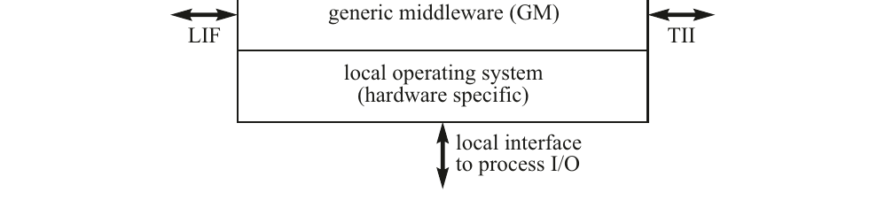

图 9.1 组件内部的软件结构

---

一个高层的时间监视请求-回复协议，在 API 层面是一个独特的概念，但在基本消息传输服务（BMTS）层面需要两个或更多独立的消息，以及一组本地定时器和操作系统调用来实现。GM 实现这个高层协议。它跟踪所有相关消息，并协调超时和操作系统调用。

---

## 9.2 任务管理

在我们的模型中，组件软件假定为一个设计单元，整个组件是最小的故障隔离单元。组件内的并发任务是协作性的而非竞争性的。由于整个组件是一个故障单元，因此设计和实现资源密集型机制来保护组件内部任务免受彼此影响是不合理的。因此，组件内部操作系统是一个轻量级的操作系统，用于管理组件内部的任务执行和资源分配。

任务是顺序程序的执行。它以读取输入数据及其内部状态开始，以产生结果和更新后的内部状态结束。在调用时没有内部状态的任务称为无状态任务；否则称为有状态任务。任务管理涉及任务的初始化、执行、监视、错误处理、交互和终止。

### 9.2.1 简单任务

如果任务内部没有同步点，我们称之为简单任务（S-task），即每当一个 S-task 被启动时，只要 CPU 分配给该任务，它就可以持续运行直到达到其终止点。由于 S-task 不能在任务体内部因等待 S-task 外部的事件而被阻塞，因此 S-task 的执行时间不直接依赖于节点中其他任务的进展，并且可以独立确定。然而，S-task 的执行时间可能因间接交互而延长，例如被更高优先级的任务抢占。

根据触发任务激活的信号，我们区分时间触发（TT）任务和事件触发（ET）任务。每个 TT 任务分配有一个周期（参见第 3.3.4 节），每当全局时间达到新周期的开始时，任务执行即开始。事件触发任务在任务的启动事件发生时启动。启动事件可以是另一个任务的完成，或者是通过传入消息或中断机制传递给操作系统的外部事件。

图 9.2 TT 操作系统中的任务描述符列表（TADL）

---

在完全时间触发的系统中，离线调度工具先验地建立所有任务的时间控制结构。这个时间控制结构编码在任务描述符列表（TADL）中，该列表包含节点所有活动的循环调度（图 9.2）。这个调度考虑了任务之间所需的优先关系和互斥关系，因此在运行时无需操作系统对任务进行显式协调来保证互斥。

每当时间达到 TADL 的一个入口点时，调度器被激活。它执行为该时刻计划的操作。如果启动了任务，操作系统会通知任务其激活时间，该时间在集群内是同步的。任务终止后，操作系统将任务的结果提供给其他任务使用。

TT 系统中 S-task 的应用程序接口（API）由三个数据结构和两个操作系统调用组成。数据结构是任务的输入数据结构、输出数据结构和 g-state 数据结构（如果任务是无状态的，则该结构为空）。系统调用是 TERMINATE TASK 和 ERROR。当任务达到其正常终止点时，任务执行 TERMINATE TASK 系统调用。如果发生无法在应用任务内处理的错误，任务以 ERROR 系统调用终止其操作。

在事件触发系统中，不断变化的应用场景动态地确定任务执行的顺序。每当发生重要事件时，一个任务被释放到就绪状态，并调用动态任务调度器。由调度器在运行时决定选择哪一个就绪任务由 CPU 进行下一次服务。解决调度问题的不同动态算法将在下一章中讨论。调度器的 WCET（最坏情况执行时间）贡献了操作系统的 WCAO（最坏情况管理开销）。

导致 ET 任务激活的重要事件可以是：

(i) 来自节点环境的事件，即消息的到达或来自被控对象的中断，或

---

(ii) 组件内部的重要事件，即任务的终止或当前执行任务内的其他条件，或

(iii) 时钟推进到指定的时刻。这个时刻可以静态或动态指定。

支持非抢占式 S-task 的 ET 操作系统将在当前运行的任务终止后做出新的调度决策。这简化了操作系统的任务管理，但严重限制了其响应能力。如果一个重要事件恰好在最长任务被调度后立即到达，那么在该最长任务完成之前，这个事件都不会被考虑。

在支持任务抢占的 RT 操作系统中，每次重要事件的发生都可能激活一个新任务，并导致当前执行任务的立即中断。根据动态调度算法的结果，新任务将被选中执行，或者被中断的任务将继续执行。如果在任务调用时将任务所需的所有输入数据从全局数据区复制到任务的私有数据区，则可以避免并发执行的 S-task 之间的数据冲突。如果组件被复制，必须注意确保所有副本上的抢占点位于同一条语句；否则副本确定性可能会丢失。

支持事件触发 S-task 的操作系统 API 比仅支持时间触发任务的操作系统需要更多的系统调用。除了数据结构以及已经介绍的 TT 系统的系统调用外，操作系统还必须提供系统调用来立即或在将来某个时间点 ACTIVATE（使就绪）一个新任务。还需要另一个系统调用来 DEACTIVATE 一个已经激活的任务。

### 9.2.2 触发任务

在 TT 系统中，控制始终保持在计算机系统内部。为了识别计算机外部的重大状态变化，TT 系统必须定期监视环境的状态。触发任务是时间触发的 S-task，它在一组反映环境当前状态的时间精确状态变量上评估一个触发条件。触发任务的结果可以是一个控制信号，用于激活另一个应用任务。由于外部或内部状态是以触发任务的频率进行采样的，因此只有持续时间长于触发任务采样周期的状态才能保证被观察到。短时状态，例如按钮的按下，必须存储在内存元素（例如，接口中）中，其持续时间应长于触发任务的采样周期。周期性触发任务在 TT 系统中产生管理开销。触发任务的周期必须小于由环境中事件激活的 RT 事务的松弛度（即截止时间与执行时间之差）。如果 RT 事务的松弛度非常小（<1 ms），则与触发任务相关的开销可能变得不可接受，此时需要实现中断。

---

### 9.2.3 复杂任务

如果一个任务在任务体内包含一个阻塞的同步语句（例如，信号量等待操作），则该任务称为复杂任务（C-Task）。这种等待操作可能是因为任务必须等待任务外部的某个条件得到满足，例如，直到另一个任务完成对共享数据结构的更新，或直到来自终端的输入到达。如果一个共享数据结构被实现为受保护的共享对象，则在任何特定时刻只有一个任务可以更新该数据（互斥）。所有其他任务必须通过等待操作被延迟，直到当前活跃的任务完成其临界区。因此，节点中复杂任务的最坏情况执行时间是一个全局问题，因为它直接依赖于节点内或节点环境中其他任务的进展。

C-task 的 WCET 不能独立于节点中的其他任务来确定。它可能取决于节点环境中某个事件的发生，如等待输入消息的例子所示。时序分析不再是单个任务的局部问题；它变成了一个全局系统问题。仅通过分析任务代码本身，不可能给出 C-task WCET 的上界。

C-task 的应用程序接口比 S-task 更复杂。除了已经介绍的三个数据结构（即输入数据结构、输出数据结构和 g-state 数据结构）之外，还必须定义在阻塞点访问的全局数据结构。必须提供处理 WAIT-FOR-EVENT 和 SIGNAL-EVENT 的系统调用。执行 WAIT-FOR-EVENT 后，任务进入阻塞状态并在队列中等待。事件发生将任务从阻塞状态释放。必须通过超时任务进行监视，以避免永久阻塞。如果在超时期限内等待的事件发生了，超时任务必须被停用，否则必须终止被阻塞的任务。

## 9.3 时间的双重角色

实时映像在使用时刻必须具有时间准确性（参见第 5.4 节）。在分布式系统中，只有在传感器节点观察 RT 实体的时刻与执行器节点确定的使用时刻之间的持续时间可以被测量时，才能检查时间准确性。这要求所有参与的节点之间有一个具有适当精度的全局时间基准。如果需要容错，则必须提供两个独立的自检通道，将终端系统连接到容错通信基础设施。时钟同步消息必须在两个通道上都提供，以容忍任一通道的丢失。

---

每个 I/O 信号有两个维度：值维度和时间维度。值维度涉及 I/O 信号的值。时间维度涉及值从环境中捕获或释放到环境中的时刻。

在硬件设计的语境中，值维度涉及寄存器的内容，而时间维度涉及触发信号，即决定 I/O 寄存器内容何时传输到另一个子系统的控制信号。

发生在实时计算机环境中的事件可以从两个不同的时序角度来看：

(i) 它定义了在时间域中 RT 实体值变化的时刻。对该时刻的精确了解是后续分析事件后果的重要输入（时间作为数据）。

(ii) 它可能要求计算机系统立即采取行动，以尽快对该事件做出反应（时间作为控制）。

区分时间的这两种不同角色很重要。在大多数情况下，将时间作为数据处理就足够了，只有在少数情况下才需要计算机系统立即采取行动（时间作为控制）。

考虑一个计算机系统，需要测量高山滑雪比赛中起点和终点之间的时间间隔。在这个应用中，将时间作为数据处理就足够了，只需记录起点事件和终点事件发生的精确时间。包含这两个时刻的消息被传输到另一台计算机，稍后计算差值。而火车控制系统识别到一个红色警报信号（意味着火车应立即停止）的情况则不同。在这种情况下，需要作为事件发生的后果立即采取行动。事件的发生必须无延迟地启动控制动作。

### 9.3.1 时间作为数据

如果分布式系统中有一个精度已知的全局时间基准，那么将时间作为数据的实现是简单的。观察组件必须在观察消息中包含事件发生的时间戳。我们称包含事件时间戳的消息为"定时消息"。定时消息可以在稍后处理，不需要对时间控制结构进行任何动态的、数据依赖的修改。或者，如果使用延迟已知且固定的现场总线通信协议，则消息到达时间减去这个已知延迟可以用于确定消息的发送时间。

同样的定时消息技术也可以用于输出侧。如果一个输出信号必须以远小于输出消息抖动的精度在精确时刻施加到环境上，则可以向控制执行器的节点发送一条定时输出消息。该节点解释消息中的时间，并在预定的精确时刻作用于环境。

---

在以先验已知的时刻并以固定周期交换消息的 TT 系统中，定时消息中的时间表示可以利用这些先验信息。时间值可以编码为消息周期的分数，从而提高数据效率。例如，如果每 100 ms 交换一次观察消息，则相对于周期开始时间的 7 位时间表示将以优于 1 ms 的粒度标识事件。这样一个 7 位的时间表示，加上一个额外的位来表示事件发生，可以打包为一个单字节。这种对事件发生时刻的紧凑表示在报警监视系统中非常有用，其中有数千个报警需要由周期性触发任务定期查询。触发任务的周期决定了报警报告的最大延迟（时间作为控制），而时间戳的分辨率则提供了关于报警事件在上一周期中发生的精确时刻（时间作为数据）的信息。

在一条带有 1000 字节数据字段且周期时间为 10 ms 的单一周期性 TTEthernet 消息中，可以在单条消息中编码 1000 个报警，具有 10 ms 的最坏情况反应时间和优于 100 μs 的报警分辨率。在 100 Mbit/s 的 Ethernet 系统中，这些周期性报警消息将产生不到网络容量 1% 的（后台）系统负载。即使所有 1000 个报警同时发生，这样的报警报告系统也不会导致负载增加。如果在事件触发系统中，每当报警发生时就发送一条 100 字节的 Ethernet 消息，那么 1000 条报警消息的峰值负载将产生网络容量 10% 的负载，最坏情况反应时间为 100 ms。

### 9.3.2 时间作为控制

时间作为控制比时间作为数据更难处理，因为它有时可能需要动态的、数据依赖的时间控制结构修改。谨慎地仔细检查应用需求，以识别那些绝对需要动态重调度任务的情况是明智的。

如果一个事件需要立即行动，消息传输的最坏情况延迟是一个关键参数。在事件触发协议（如 CAN）中，消息优先级用于解决因几乎同时发生的事件而产生的对公共总线的访问冲突。特定消息的最坏情况延迟可以通过考虑消息系统的峰值负载激活模式来计算 [Tin95]。

对紧急关停请求的迅速反应需要时间作为控制来起作用。假设紧急消息是 CAN 系统中的最高优先级消息。在 CAN 系统中，最高优先级消息的最坏情况延迟受到最长消息（约 100 位）的传输持续时间的限制，因为消息传输不能被抢占。

---

## 9.4 任务间交互

任务间交互是组件内部并发执行的任务之间交换数据以实现共同目标所必需的。在一组并发执行的任务之间交换数据有两种主要方式：(i) 通过消息交换和 (ii) 通过提供可被多个任务访问的共享数据区域。

在组件内部，共享数据结构被广泛使用，因为这种形式的任务间交互可以在任务协作的单个组件中高效实现。然而，必须注意维护被多个任务并发读取或写入的数据的完整性。图 9.3 描述了这个问题。两个任务 T1 和 T2 访问同一个数据的临界区域。我们将程序执行过程中访问数据临界区域的时间间隔称为任务的临界区。如果任务的临界区重叠，就可能发生问题。如果一个任务读取共享数据而同时另一个任务正在修改该数据，那么读者可能读到不一致的数据。如果两个或更多写入任务的临界区重叠，数据可能会被破坏。

图 9.3 临界任务区与临界数据区

可以应用以下三种技术来解决这个问题：

(i) 协调的静态调度。

(ii) 非阻塞写协议。

(iii) 信号量操作。

### 9.4.1 协调的静态调度

在时间触发系统中，可以构造任务调度使得任务的临界区不重叠。这是一种解决问题的非常有效的方式，因为：

(i) 保证互斥的开销最小且可预测。

(ii) 解决方案是确定性的。

只要可能，就应该选择这种解决方案。

---

### 9.4.2 非阻塞写（NBW）协议

然而，如果具有临界区的任务是事件触发的，我们就无法先验地设计无冲突的协调任务调度。非阻塞写（NBW）协议是一个无锁实时协议的示例 [Kop93a]，它在只有一个任务向数据临界区写入时，确保一个或多个读者的数据完整性。

让我们分析 NBW 在从通信系统到主机的接口上进行数据传输的操作。在这个接口处，有一个写者（通信系统）和多个读者（组件的任务）。读者不会破坏写者写入的信息，但写者可能干扰读者的操作。在 NBW 协议中，实时写者永远不会被阻塞。因此，每当有新的消息到达时，它就会将消息的新版本写入数据临界区。如果读者在写者正在写入新版本时读取消息，检索到的消息将包含不一致的信息，必须被丢弃。如果读者能够检测到干扰，那么读者可以重试读操作，直到检索到一致版本的数据。必须证明读者执行的重试次数是有界的。

该协议要求每个数据临界区有一个并发控制字段 CCF。硬件必须保证对 CCF 的原子访问。并发控制字段初始化为零，写者在写操作开始之前递增它。在写操作完成后，写者再次递增它。读者在读操作开始时读取 CCF。如果 CCF 是奇数，则读者立即重试，因为有一个写操作正在进行中。在读操作结束时，读者检查写者在读操作期间是否更改了 CCF。如果是，则再次重试读操作，直到可以读取到未损坏版本的数据结构（参见图 9.4）。

initialization: CCF := 0;
writer:                            reader:
start:CCF_old := CCF;              start:CCF_begin := CCF;
CCF := CCF_old + 1;               if CCF_begin = odd
<write to data structure>          then goto start;
CCF := CCF_old + 2;               <read data structure>
                                    CCF_end := CCF;
                                    if CCF_end ≠ CCF_begin
                                    then goto start;


图 9.4 非阻塞写（NBW）协议

---

可以证明，如果写操作之间的时间间隔显著长于写操作或读操作的持续时间，则读重试次数存在上界。由读者重试引起的典型实时任务执行时间的最坏情况扩展仅为原始最坏情况执行时间（WCET）的百分之几 [Kop93a]。

无锁同步已在其他实时系统中实现，例如在多媒体系统中 [And95]。已经表明，采用无锁同步的系统比锁定数据的系统获得更好的性能。

### 9.4.3 信号量操作

避免数据不一致的经典机制是通过在保护资源的信号量变量上执行 WAIT 操作，强制实现对临界任务区的互斥执行。每当一个任务处于其临界区时，其他任务必须在队列中等待，直到临界区被释放（显式同步）。

信号量初始化操作的实现代价高昂，无论是在内存需求还是操作系统处理开销方面。如果一个进程遇到阻塞的信号量，必须进行上下文切换。该进程被放入队列，并延迟直到另一个进程完成其临界区。然后，该进程出队，并进行另一次上下文切换以恢复原始上下文。如果临界区非常小（这在许多实时应用中很常见），信号量操作的处理时间可能远长于实际读取或写入公共数据的时间。

NBW 协议和信号量操作都可能导致副本确定性的丧失。对 CCF 或信号量变量的并发访问会导致竞态条件，该条件在副本中以不可预测的方式解决。

## 9.5 进程输入/输出

传感器是一个在被控对象（物理世界）与计算机（网络世界）之间形成接口的装置。在输入侧，传感器将机械或电气量转换为数字形式，如果物理量的域是稠密的，则数字表示的离散性会导致不可避免的误差。任何模拟量数字表示的最后一位（无论在值域还是时域）都是不可预测的，如果同一量由两个独立的传感器观察，将导致网络世界表示中可能存在不一致。在输出侧，数字值由执行器转换为适当的物理信号。

---

### 9.5.1 模拟输入/输出

在第一步中，许多模拟物理量的传感器产生标准的 4–20 mA 范围内的模拟信号（4 mA 表示值范围的 0%，20 mA 表示值范围的 100%），然后通过模数（AD）转换器将其转换为数字形式。如果测量值编码在 4–20 mA 范围内，则可以区分断线（无电流流动，0 mA）和 0% 的测量值（4 mA）。

在没有特殊措施的情况下，电噪声水平将任何模拟控制信号的精度限制在约 0.1%。分辨率超过 10 位的模数（AD）转换器需要一个精心控制的物理环境，这在典型的工业应用中是无法提供的。因此，16 位字长足以编码模拟传感器测量的 RT 实体的值。

RT 实体中某个值的发生时刻与该值由传感器在传感器/计算机接口处呈现的时刻之间的时间间隔，取决于特定传感器的传递函数。传感器的阶跃响应（参见图 1.4）给出了该传递函数的近似值，表示传感器的滞后时间和上升时间。在推理传感器/执行器信号的时间准确性时，必须考虑传感器和执行器传递函数的参数（图 9.5）。它们减少了 RT 实体中某个值发生时刻与计算机将该值用于输出动作的时刻之间的可用时间间隔。滞后时间短的传感器增加了计算机系统可用的时间准确性间隔的长度。

在许多控制应用中，模拟物理量被观察（采样）的时刻处于计算机系统的控制范围内。为了减少控制回路的死区时间，采样时刻、采样数据到控制节点的传输、以及设定值数据到执行器节点的传输应在时间触发系统中进行相位对齐（参见第 3.3.4 节）。

图 9.5 完整 I/O 事务的时间延迟

---

### 9.5.2 数字输入/输出

数字 I/O 信号在 TRUE 和 FALSE 两种状态之间转换。在许多应用中，两次状态变化之间的时间间隔长度具有语义意义。在其他应用中，转换发生的时刻很重要。

如果输入信号来自简单的机械开关，新的稳定状态不会立即达到，而是经过一系列随机振荡（图 9.6）之后才能达到，这种振荡称为触点弹跳，由开关触点的机械振动引起。这种触点弹跳必须通过模拟低通滤波器，或者更常见地，在计算机系统内部由软件任务（例如，消抖例程）来消除。由于微控制器价格低廉，通过软件技术消抖比通过硬件机制（例如低通滤波器）更便宜。

图 9.6 机械开关的触点弹跳

许多传感器设备产生一系列脉冲输入，每个脉冲携带关于事件发生的信息。例如，距离测量通常通过一个沿待测物体滚动的轮子来完成。轮子的每次旋转产生一定数量的脉冲，这些脉冲可以转换为行进的距离。脉冲的频率表示速度。如果轮子经过一个定义的校准点，则向计算机发送一个额外的数字输入信号，将脉冲计数器设置为定义的值。一个良好的实践是尽快将相对事件值转换为绝对状态值。

**时间编码信号** 许多输出设备，例如功率半导体（如 IGBT（绝缘栅双极晶体管）），由具有良好指定形状的脉冲序列控制（脉冲宽度调制—PWM）。许多专为 I/O 设计的微控制器为生成这些数字脉冲形状提供特殊的硬件支持。

### 9.5.3 中断

中断机制使计算机控制范围之外的设备能够控制计算机内部的时间控制模式。这是一种强大且潜在危险的机制，必须非常谨慎地使用。当外部事件需要计算机的反应时间（时间作为控制），而该反应时间无法通过触发任务高效实现时，才需要中断。

触发任务最多将由外部事件启动的 RT 事务的响应时间延长一个触发任务周期。提高触发任务频率可以减少这种额外的延迟，但代价是增加开销。[Pol95b] 分析了在所需响应时间接近触发任务 WCET 时，周期性执行触发任务的开销增加情况。作为经验法则，只有当所需响应时间小于触发任务 WCET 的十倍时，才应考虑实现中断。

如果需要知道消息到达的精确时刻，但不需要立即采取行动，则应使用在硬件中实现的中断控制的时间戳机制。这种机制自主工作，不会干扰操作系统级别的任务控制结构。

---

在 IEEE 1588 时钟同步协议的硬件实现中，硬件机制自主生成到达同步消息的时间戳 [Eid06]。

在中断驱动的软件系统中，中断线上的瞬时错误可能破坏整个节点的时间控制模式，并可能导致违反重要的截止时间。因此，必须连续监视任意两次中断发生之间的时间间隔，并与规定的中断事件之间的最小持续时间进行比较。

**监视中断的发生** 对于每个被监视的中断，计算机中有三个任务与之相关 [Pol95b]（图 9.7）。第一个和第二个任务是动态规划的 TT 任务，用于确定中断窗口。第一个任务启用中断线，从而打开允许中断发生的时间窗口。第三个任务是由中断激活的中断服务任务。当中断发生时，中断服务任务通过禁用中断线来关闭时间窗口。然后，它停用已调度的第二个任务的未来激活。如果第三个任务在第二个任务开始之前没有被激活，则第二个任务（一个在时间窗口结束时调度的动态 TT 任务）通过禁用中断线来关闭时间窗口。第二个任务然后生成一个错误标志，通知应用程序中断缺失。

这两个时间触发任务是错误检测所必需的。第一个任务检测不应发生的偶发中断。第二个任务检测本应发生但缺失的中断。这些不同的错误需要不同类型的错误处理。我们对被控对象的规律性了解越多，就越能使中断可能发生的时间窗口变小。这导致更好的错误检测覆盖率。

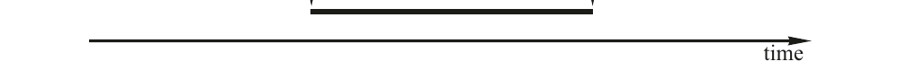

图 9.7 中断的时间窗口

---

汽车发动机的发动机控制器对燃油喷射点相对于气缸内活塞位置的要求极其严格，以至于必须使用中断来测量位置 [Pol95b]。活塞的位置和曲轴的转速由许多传感器测量，当曲轴的某个特定段落经过传感器位置时，传感器产生上升沿。由于发动机的速度和最大角加速度（或减速度）是已知的，下一个正确的中断必须在上一个中断之后的一个小的动态定义的时间窗口内到达。中断逻辑仅在这个短暂的时间窗口内启用，在所有其他时间禁用，以减少偶发中断对主机软件内时间控制模式的影响。如果不被检测到，这样的偶发中断可能会对发动机造成机械损坏。

### 9.5.4 容错执行器

执行器必须将计算机输出接口处产生的信号转换为被控对象中的某种物理动作（例如，打开阀门）。执行器构成从感知 RT 实体值到在环境中实现预期效果的链条中的最后一个元素。在容错系统中，执行器必须对在复制通道上接收到的输出信号执行最终投票。图 9.8 显示了一个示例，其中环境中的预期动作是定位一个机械杠杆。杠杆末端可能有任何作用在被控对象上的机械设备，例如，在作用点处可能安装有控制阀的活塞。

在副本确定性的架构中，正确的复制通道在值域和时域上产生相同的结果。我们区分以下两种情况：架构支持故障静默属性（图 9.8a），即所有故障通道都是静默的；以及不支持故障静默属性（图 9.8b），即故障通道可能在值域上表现出任意行为。

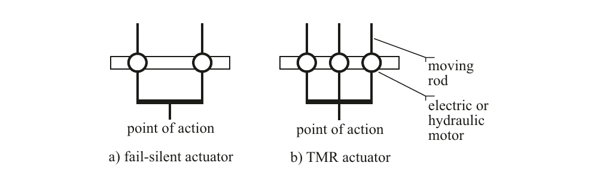

图 9.8 容错执行器

**故障静默执行器** 在故障静默架构中，所有子系统必须支持故障静默属性。故障静默执行器要么产生预期的（正确的）输出动作，要么完全不产生任何结果。如果故障静默执行器未能产生输出动作，它不得妨碍复制的故障静默执行器的工作。图 9.8a 的故障静默执行器由两个电机组成，每个电机都有足够的功率来移动作用点。每个电机连接到计算机系统的两个副本确定性输出通道之一。如果一个电机在任何位置发生故障，另一个电机仍然能够将作用点移动到所需位置。

---

**三模冗余执行器** 三模冗余（TMR）执行器（图 9.8b）由三个电机组成，每个电机连接到容错计算机的三个副本确定性输出通道之一。任意两个电机的合力必须足够强大以压倒第三个电机的力；然而，任何单个电机的力量可能不足以压倒其他两个电机。TMR 执行器可以看作一个机械投票器，它将作用点放置在由三个通道的多数决定的某个位置，将不一致的通道投票出局。

**带专用无状态投票器的执行器** 在许多冗余执行器已经就位的应用中，可以通过将物理执行器与一个小型微控制器结合来构建一个投票执行器，该微控制器接受三模冗余系统三个通道的三个输入通道，并对从三个通道接收到的消息进行投票。这个投票器可以是无状态的，即在每个周期之后，投票器的电路被复位，以消除由瞬时故障引起的状态错误累积（图 9.9）。


图 9.9 与执行器关联的无状态投票器

在汽车中，可以在每个车轮的制动执行器处放置一个无状态投票器。该投票器将屏蔽任何一个 TMR 通道的故障。无状态投票器是智能仪器化的一个示例。

### 9.5.5 智能仪器化

越来越有一种趋势是将传感器/执行器及其相关的微控制器封装在一个单一的物理外壳中，向外提供一个标准的抽象消息接口，在现场总线（例如 CAN 总线）上产生测量值（图 9.10）。这样的单元称为智能仪器。

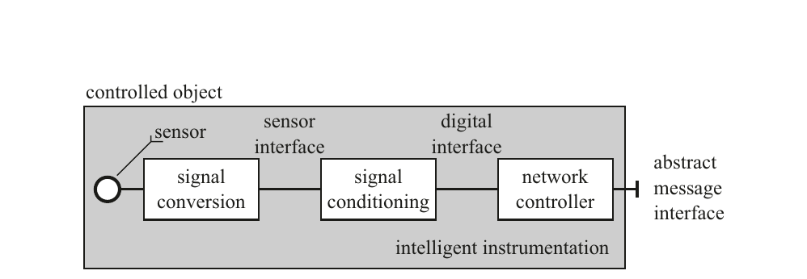

图 9.10 智能仪器化

智能仪器隐藏了具体的传感器接口。其单芯片微控制器为传感器/执行器提供所需的控制信号，执行信号调理、信号平滑和本地错误检测，并以标准测量单位通过现场总线消息接口呈现/获取有意义的 RT 映像。智能仪器简化了工厂设备与计算机的连接。

一个 MEMS 加速度传感器，通过微加工到硅芯片上，与适当的微控制器和网络接口封装在一个单一封装中，构成一个智能传感器。

为了使测量值具备容错能力，可以将多个独立传感器封装在一个单一的智能仪器中。在智能仪器内部，执行一致性协议以达成一致的传感器值，即使其中一个传感器已经发生故障。这种方法假设可以在接近的空间范围内进行独立的测量。

将现场总线节点与执行器集成，就产生了一个智能执行器设备。

---

汽车中安全气囊的执行器必须在适当时刻引爆爆炸装药，以将高压容器的气体释放到安全气囊中。一个放置在微控制器硅片上的小型爆炸装药可以在芯片上被引爆。封装安装在适当的机械位置以打开关键阀门。包含爆炸装药的微控制器构成一个智能执行器。

由于今天有多种不同的现场总线设计可用，但没有一个被普遍接受的行业范围现场总线标准出现，传感器制造商必须应对为不同现场总线提供不同智能仪器网络接口的困境。

### 9.5.6 物理安装

本书的范围之外是传感器基实时控制系统的物理安装中必须考虑的所有问题。这些复杂的话题可以在关于计算机硬件安装的书籍中找到。然而，这里着重强调几个关键问题。

**电源** 许多计算机故障是由电源故障引起的，即长时间的电源中断、不到一秒钟的短暂电源中断（也称为电压骤降），以及电压浪涌（短暂的过电压）。因此，提供可靠且干净的电源对任何计算机系统的正常运行至关重要。

**接地** 在工业厂房中设计适当的接地系统是一项需要相当经验的主要任务。许多短暂的计算机硬件故障是由存在缺陷的接地系统引起的。以树状方式将所有单元连接到一个高质量的真实接地点是很重要的。接地电路中的环路必须避免，因为它们会接收电磁干扰。

---

**电隔离** 在许多应用中，需要将计算机终端与工厂中的信号完全电隔离。这种隔离可以通过用于数字信号的光耦合器或用于模拟信号的信号变压器来实现。

## 9.6 一致性协议

传感器和执行器的故障率远高于单芯片微型计算机。任何关键的输出动作都不应依赖单一传感器的输入。需要通过多个不同的传感器来观察被控对象，并将这些观察结果关联起来，以检测错误的传感器值、观察执行器的效果，并获得被控对象物理状态的一致映像。在分布式系统中，一致性（在 [Bar93] 中也称为共识）通常需要在参与一致性的各方之间进行信息交换。然而，通过适当的系统架构也可以避免一些信息交换。

在 [Kop21] 中讨论的第 6.5.1 节示例中的故障可运行架构避免了自动驾驶汽车中执行器之间的信息交换。这是通过一个容错决策子系统（FTDSS）实现的。FTDSS 由两个故障隔离单元（FCU）组成，它们作为生成汽车行驶轨迹的 FCU 与使用轨迹的执行器之间的中间站运行。因此，达成共识所需的多个通信轮次（参见第 6.4.2 节——拜占庭弹性容错单元）被替换为多个通信阶段，这是 Miner [Min02] 引入的概念。

一般来说，所需的交换轮次（或阶段）数取决于一致性的类型以及对参与者可能故障模式的假设。

### 9.6.1 原始数据、测量数据与一致数据

在第 1.2.1 节中，介绍了原始数据、测量数据和一致数据的概念：原始数据在物理传感器的数字硬件接口处产生。测量数据以标准工程单位表示，通过信号调理过程从一个或一系列原始数据样本中导出。被判定为 RT 实体正确映像的测量数据（例如，与通过不同技术导出的其他测量数据元素比较后），称为一致数据。一致数据构成控制动作的输入。

在安全关键系统中，不允许存在任何单点故障，一致数据元素不得源自单一传感器。开发安全关键输入系统的挑战在于冗余传感器的选择和放置，以及一致性算法的设计。我们区分两种类型的一致性：语法一致性和语义一致性。

---

### 9.6.2 语法一致性

假设两个独立的传感器测量同一个 RT 实体。当两个观察结果从模拟值域转换到离散值域时，由测量误差和数字化误差引起的两个原始值之间的微小差异是不可避免的。这些不同的原始数据值将导致不同的测量值。当被控对象中事件的发生时间被映射到计算机的离散时间时，时域中也会发生数字化误差。即使在无故障的情况下，这些不同的测量值也必须以某种方式调和，以便向可能复制的控制任务呈现 RT 实体的一致视图。在语法一致性中，一致性算法计算一致值时不考虑测量值的上下文。例如，一致性算法总是取一组测量数据值的平均值。如果必须容忍一个传感器的拜占庭故障，则需要三个额外的传感器（参见第 6.4.2 节）。

### 9.6.3 语义一致性

如果不同测量值的含义通过基于关于被控对象过程参数之间关系和物理特性的先验知识的过程模型相互关联，我们称之为语义一致性。在语义一致性中，不需要复制或三倍复制每个传感器。不同的冗余传感器观察不同的 RT 实体。物理过程模型将这些冗余传感器读数相互关联，以找到一组合理的一致值，并识别表示传感器故障的不合理值。这样的错误传感器值必须基于测量集中固有的语义冗余，由给定时间点的最可能值的计算估计值来替换。

许多自然定律控制化学过程：质量守恒、能量守恒，以及化学反应的已知最大速度。这些基本的自然定律可以用来检查测量数据集的合理性。如果某个传感器读数与其他所有传感器读数显著偏离，则假定传感器故障，并用此时刻正确值的估计值替换故障值，以便继续进行化学过程的控制。

---

语义一致性需要对应用过程技术有基本的理解。通常，由一个由过程工艺师、测量专家和计算机工程师组成的跨学科团队合作，找出可以以合理成本高精度测量的 RT 实体。通常，对于每一个输出值，大约需要观察三到七个输入值，这不仅是为了诊断错误的测量数据元素，也是为了检查执行器的正常运行。观察执行器预期效果的独立传感器（参见第 7.2.5.1 节）必须监视每个执行器的正常运行。

在工程实践中，测量数据值的语义一致性比语法一致性更为重要。一致性阶段的结果是产生一致（且一致）的数字输入值集。这些在值域和时域中定义的一致值随后被所有（复制的）任务使用，以实现控制系统的副本确定性行为。

## 9.7 错误检测

实时操作系统必须通过通用方法支持时域错误检测和值域错误检测。本节描述了一些通用方法。

### 9.7.1 监视任务执行时间

在软件开发过程中，必须为实时任务建立最坏情况执行时间（WCET）的紧上界（参见第 10.2 节）。操作系统必须在运行时监视此 WCET，以检测瞬时或永久的硬件错误。如果任务在其 WCET 内没有终止其操作，操作系统将终止该任务的执行。由应用程序来指定在发生错误时应采取什么行动。

### 9.7.2 监视中断

错误的外部中断有可能破坏节点内实时软件的时间控制结构。在设计时，必须知道中断的最小到达间隔时间，以便估计软件系统必须处理的峰值负载。在运行时，操作系统必须通过禁用中断线来强制执行这个最小到达间隔时间，以减少错误偶发中断的概率（参见第 9.5.3 节）。

### 9.7.3 任务的双重执行

故障注入实验表明，任务的双重执行及其结果的后续比较是检测导致值域未检测错误（无声错误）的瞬时硬件故障的一种非常有效的方法 [Arl03]。

---

操作系统可以为应用任务的双重执行提供执行环境，而无需对应用任务本身进行任何更改。因此，可以在系统配置时决定哪些任务应该执行两次，哪些任务仅依赖单次执行就够了。

### 9.7.4 看门狗

故障静默节点要么产生正确的结果，要么完全不产生任何结果。故障静默节点的故障只能在时域中检测到。一个标准技术是提供看门狗信号（心跳），该信号必须由节点的操作系统定期产生。如果节点有权访问全局时间，则看门狗信号应在已知的绝对时间点定期产生。外部观察者可以在看门狗信号消失时立即检测到节点的故障。

一种更复杂的错误检测机制——也覆盖了部分值域——是节点定期执行挑战-响应协议。外部错误检测器向节点提供一个输入模式，并期望在指定的时间间隔内得到一个定义的响应模式。这个响应模式的计算应尽可能多地涉及节点的功能单元。如果计算出的响应模式偏离了先验已知的正确结果，则检测到节点错误。

---

### 要点回顾

- 我们在基于组件的分布式实时系统中区分两个层次的管理：(i) 组件之间基于消息的通信与资源分配的协调，(ii) 每个组件内部并发任务的建立、协调与控制。

- 由于组件软件假定为一个设计单元，整个组件是最小的故障隔离单元，因此组件内部的并发任务是协作性的而非竞争性的。

- 在完全时间触发的系统中，所有任务的静态时间控制结构由离线调度工具先验建立。这个时间控制结构编码在任务描述符列表（TADL）中，该列表包含节点所有活动的循环调度。此调度考虑了任务之间所需的优先关系和互斥关系，因此在运行时无需操作系统的显式协调。

- 在支持任务抢占的 RT 操作系统中，每次重要事件的发生都可能激活一个新任务，并导致当前执行任务的立即中断。如果组件被复制，必须注意确保所有副本上的抢占点位于同一条语句；否则副本确定性可能会丢失。

- C-task 的时序分析不再是单个任务的局部问题；它变成了一个全局系统问题。在一般情况下，不可能给出 C-task WCET 的上界。

- 区分时间作为数据和时间作为控制非常重要。时间作为控制比时间作为数据更难处理，因为它有时可能需要动态的、数据依赖的时间控制结构修改。

- 必须注意维护被多个任务并发读取或写入的数据的完整性。在时间触发系统中，可以构造任务调度使得任务的临界区不重叠。

- 为了减少控制回路的死区时间，采样时刻、采样数据到控制节点的传输、以及设定值数据到执行器节点的传输应在时间触发系统中进行相位对齐。

- 在中断驱动的软件系统中，中断线上的瞬时错误可能破坏整个节点的时间控制模式，并可能导致违反重要的截止时间。

- 投票执行器可以通过将一个小型微控制器分配给物理执行器来构建，该微控制器接受三模冗余系统三个通道的三个输入通道，并对从三个通道接收到的消息进行投票。

- 通常，对于每一个输出值，大约需要观察三到七个输入值，这不仅是为了诊断错误的测量数据元素，也是为了检查执行器的正常运行。

---

## 参考文献

许多标准操作系统教科书中包含实时操作系统的章节，例如 Stallings 的教科书 [Sta18]。ARINC 653 标准用于安全关键航空电子系统中的操作系统。AUTOSAR 是面向汽车应用的操作系统，包括安全关键的应用。一些商业上 POSIX™ 认证或基本符合 POSIX™ 的实时操作系统被用于安全关键系统。开源操作系统 Linux 也基本符合 POSIX™。目前正在进行朝向安全关键 Linux 的努力 [All21]。然而，由于其软件复杂性，这些努力是否能在未来取得成功尚不清楚。另一方面，多种基于 Linux 的操作系统被用于非安全关键的软实时系统。关于实时操作系统的最新研究贡献可以在 IEEE 实时系统年会论文集和 Springer Verlag 的《实时系统》期刊中找到。

---

### 复习题与问题

- 解释标准个人计算机操作系统与安全关键实时应用中节点内的 RT 操作系统之间的区别！

- 简单任务、触发任务和复杂任务分别是什么意思？

- 时间作为数据与时间作为控制的区别是什么？

- 为什么经典的信号量操作机制对于实时 OS 中保护临界数据是次优的？有哪些替代方案？

- 触点弹跳是如何消除的？

- 我们什么时候需要中断？偶发中断的影响是什么？我们如何保护软件免受偶发中断的影响？

- 报警监视系统的一个节点必须监视 50 个报警。报警必须通过 100 kbit/s 的 CAN 总线在 10 ms 内报告给集群的其余部分。勾画一个使用周期性 CAN 消息（时间触发，周期为 10 ms）的实现方案，以及一个使用偶发事件触发消息（每个发生的报警一条）的实现方案。从以下角度比较这两种实现方案：无报警和所有报警同时发生条件下产生的负载、保证的响应时间，以及报警节点崩溃故障的检测。

- 假设一个执行器的故障率为 10^6 FIT。如果我们通过向该执行器添加一个故障率为 10^4 FIT 的微控制器来构建投票执行器，那么投票执行器的综合故障率是多少？

- 原始数据、测量数据和一致数据之间的区别是什么？

- 语法一致性和语义一致性之间的区别是什么？哪种技术在实时应用设计中更为重要？

- 列出实时 OS 应支持的一些通用错误检测技术！

- 通过任务的双重执行可以检测到哪些类型的故障？

---

# 第10章 实时调度

Real-Time Systems — Hermann Kopetz & Wilfried Steiner 著 | AI 辅助翻译

---

## 本章概述

关于如何在一组资源有限的系统中调度一组任务，使得所有任务都能满足其截止时间，已有成千上万篇研究论文。本章试图总结与实时系统设计者相关的一些重要调度研究成果。本章首先引入可调度性测试的概念，以确定给定的任务集是否可调度。它区分了充分、精确和必要的可调度性测试。如果一个调度算法在存在解的情况下总能找到调度方案，则称其为最优调度算法。对手论证表明，一般来说不可能设计出最优的在线调度算法。应用任何调度技术的前提是了解所有时间关键任务的最坏情况执行时间（WCET）。第 10.2 节介绍了估算简单任务和复杂任务 WCET 的技术。具有流水线和缓存的现代处理器使得获得 WCET 的紧界变得困难。随时算法包含一个提供足够（但较低）质量结果的根段，以及一个改进先前结果质量的可选周期段，为摆脱这一困境指明了方向。它们利用具体任务执行中根段的实际执行时间与截止时间（即根段的最坏执行时间）之间的间隔来改进结果质量。第 10.3 节涵盖了静态调度的话题。引入了调度周期（schedule period）的概念，并给出了覆盖一个调度周期的简单搜索树示例。启发式算法必须检查搜索树以找到可行调度。如果找到了一个，该解可以被视为构造性的可调度性测试。第 10.4 节详细阐述了动态调度。它首先考察通过速率单调算法调度一组独立任务的问题。接下来，研究了调度一组依赖任务的问题。引入了优先级天花板协议，并勾画了优先级天花板协议的可调度性测试。最后，触及了分布式系统中的调度问题，并给出了一些关于替代调度策略（如反馈调度）的想法。

---

## 10.1 调度问题

硬实时系统必须执行一组并发的实时任务，使得所有时间关键任务都能满足其指定的截止时间。每个任务需要计算资源、数据资源和其他资源（例如，输入/输出设备）来推进执行。调度问题涉及这些资源的分配，以满足所有时序要求。

### 10.1.1 调度算法的分类

下图（图 10.1）展示了实时调度算法的分类法 [Che87]。

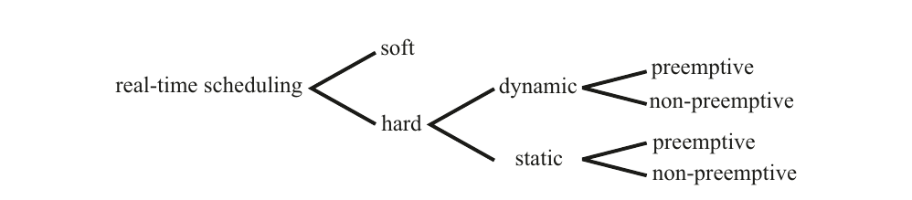

图 10.1 实时调度算法的分类法

**静态调度** 如果调度器在运行之前做出调度决策，则称其为静态（或运行前）调度器。它离线生成运行时调度器使用的调度表。为此，它需要对任务集特性的完全先验知识，例如最大执行时间、优先约束、互斥约束和截止时间。调度表（参见图 9.2）包含调度器在运行时所需的所有信息，以在稀疏时间基准的每个点上决定下一个调度哪个任务。调度器的运行时开销很小。系统行为是确定性的。

如果调度器在运行时做出调度决策，从当前就绪任务集中选择一个，则称其为动态（或在线）调度器。动态调度器是灵活的，能够适应不断变化的任务场景。它们仅考虑当前的任务请求。寻找调度方案所涉及的运行时努力可能相当大。一般来说，系统行为是非确定性的。

**静态调度与动态调度** 本质上，调度是时间和空间上的资源分配问题，其中任务对计算和通信资源有需求。这个资源分配问题在工业实时系统中往往在计算上是复杂的，甚至是 NP 完全的。除了上述操作上的差异之外，静态调度和动态调度在处理这种计算复杂性的方式上也有根本的区别。

静态调度策略将资源分配问题视为对有效配置的搜索问题（参见第 10.3.1 节），例如，寻找有效的调度表。因此，问题解决的计算密集型部分完全在设计时处理。另一方面，动态调度的典型策略是对任务集的特性施加假设，即通过约简问题来降低或完全避免密集计算的需要。一个典型的约简技术是任务独立性的假设（参见第 10.4.1 节中的速率单调调度）。另一个约简技术是限制资源利用率但允许某些任务依赖性（参见第 10.4.2 节的优先级天花板协议）。许多工业实时系统可能不允许充分的约简技术，或在任务间施加更强的依赖形式（例如，相位对齐的事务，参见第 10.5.1 节），可能只能通过静态调度有效实现。

---

**非抢占式与抢占式调度** 在非抢占式调度中，当前正在执行的任务不会被中断，直到它自行决定释放分配的资源。非抢占式调度在一个任务场景中是合理的，其中许多短任务（相对于上下文切换所需的时间）必须被执行。在抢占式调度中，如果更紧急的任务请求服务，当前正在执行的任务可能被抢占，即被中断。

**集中式与分布式调度** 在动态分布式实时系统中，可以在一个中心站点做出所有调度决策，或者开发协作的分布式算法来解决调度问题。分布式系统中的中心调度器是一个关键的故障点。因为它需要所有节点负载情况的最新信息，所以也可能导致通信瓶颈。

### 10.1.2 可调度性测试

确定一组就绪任务是否可以调度使得每个任务满足其截止时间的测试称为可调度性测试。我们区分精确的、必要的和充分的可调度性测试（图 10.2）。

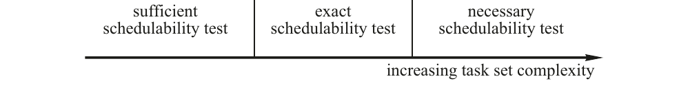

图 10.2 必要和充分的可调度性测试

如果一个调度器在可行调度存在时总能找到，则称其为**最优**的。或者，如果一个调度器在任何情况下都能找到调度，无论何时一个有先见之明的调度器（即完全了解未来请求时间的调度器）能找到一个调度，则称该调度器为最优的。Garey 和 Johnson [Gar75] 已经证明，在几乎所有任务依赖的情况下，即使只有一个共享资源，精确可调度性测试算法的复杂性也属于 NP 完全问题类，因此在计算上是不可解的。充分可调度性测试算法可以更简单，但代价是对一些实际上可调度的任务集给出否定结果。如果必要可调度性测试给出否定结果，则任务集肯定不可调度。如果必要可调度性测试给出肯定结果，仍有可能该任务集不可调度。任务请求时间是任务执行请求被提出的时刻。基于请求时间，区分两种不同的任务类型是有用的：周期性任务和偶发任务。这一区别从可调度性的角度来看很重要。

---

如果我们从初始请求开始，周期性任务的所有未来请求时间可以通过将已知周期的倍数加到初始请求时间来先验地获知。假设有一个周期性任务集 {T_i}，其周期为 p_i，截止时间间隔为 d_i，执行时间为 c_i。截止时间间隔是任务截止时间与任务请求时刻（即任务变为就绪执行的时刻）之间的持续时间。我们称 d_i − c_i 为任务 i 的**松弛度** l_i。检查长度等于这些任务周期的最小公倍数（调度周期）的调度就足以确定可调度性。一组周期性任务的必要可调度性测试指出，利用率因子之和

μ = Σ c_i / p_i ≤ n

必须小于或等于 n，其中 n 是可用处理器的数量。这是显而易见的，因为任务 T_i 的利用率 μ_i 表示任务 T_i 需要处理器服务的时间百分比。

偶发任务的请求时间不是先验已知的。为了可调度，任意两次偶发任务请求之间必须有一个最小间隔。否则，上面引入的必要可调度性测试将失败。如果任务激活的请求时间没有约束，则该任务称为**非周期性任务**。

### 10.1.3 对手论证

假设实时计算机系统包含一个对过去有完全了解但对任务未来请求时间没有任何知识的动态调度器。当前任务集的可调度性可能取决于偶发任务未来何时请求服务。

---

对手论证 [Mok83, p.41] 指出，如果存在周期性任务和偶发任务之间的互斥约束，通常不可能构造一个最优的完全在线动态调度器。对手论证的证明相对简单。

考虑两个互斥的任务，任务 T1 是周期性的，另一个任务 T2 是偶发的，参数如图 10.3 所示。上面引入的必要可调度性测试是满足的，因为

μ = 2/4 + 1/4 = 3/4 ≤ 1

每当周期性任务正在执行时，对手就请求为偶发任务服务。由于互斥约束，偶发任务必须等待直到周期性任务完成。由于偶发任务的松弛度为 0，它将错过其截止时间。

有先见之明的调度器知道偶发任务的所有未来请求时间，它首先调度偶发任务，然后在两次偶发任务激活之间的间隙调度周期性任务（图 10.3）。

对手论证展示了关于任务未来行为的信息对解决调度问题的重要性。如果在线调度器对偶发任务的请求时间没有任何进一步的知识，则动态调度问题是不可解的，尽管处理器容量对于给定的任务场景绰绰有余。如果可以对未来的调度请求做出规律性的假设，则可预测的硬实时系统的设计就会得到简化。循环系统的情况正是如此，它限制了计算机系统识别外部请求的时间点。


图 10.3 对手论证

---

## 10.2 最坏情况执行时间

只有在构成 RT 事务一部分的所有应用任务和通信动作的最坏情况执行时间（WCET）是先验已知的情况下，才能保证完成 RT 事务的截止时间。任务的 WCET 是任务激活与任务终止之间时间的一个保证上界。它必须对任务的所有可能输入数据和执行场景有效，并且应该是一个紧界。

除了了解应用任务的 WCET 之外，我们还必须找到由操作系统管理服务引起的延迟上界，即最坏情况管理开销（WCAO）。WCAO 包括所有影响应用任务但不在应用任务直接控制之下的管理延迟（例如，由上下文切换、调度、因任务被中断或阻塞导致的缓存重载、以及直接内存访问引起的延迟）。

本节首先分析非抢占式简单任务的 WCET。然后，我们继续研究抢占式简单任务的 WCET，接着考察复杂任务的 WCET，最后讨论实时程序时序分析的常用技术。

### 10.2.1 简单任务的 WCET

我们所能想象的最简单任务是在专用硬件上无抢占且不需要任何操作系统服务的单个顺序 S-task。这样一个任务的 WCET 取决于：

(i) 任务的源代码。

(ii) 编译器生成的目标代码的属性。

(iii) 目标硬件的特性。

在本节中，我们研究在这种硬件上对这样一个简单任务的最坏情况执行时间紧界进行分析性构造，其中指令的执行时间是与上下文无关的。

**源代码分析** 第一个问题涉及计算用高级语言编写的程序的 WCET，假设基本语言结构的最大执行时间是已知且与上下文无关的。一般来说，确定任意顺序程序的 WCET 问题是不可解的，等价于图灵机的停机问题。例如，考虑控制循环入口的简单语句：

S: while (exp)
do loop;

---

无法先验地确定布尔表达式 exp 经过多少次迭代（如果有的话）会求值为 FALSE，以及语句 S 何时终止。为了使 WCET 的确定成为可解的问题，程序必须满足一些约束 [Pus89]：

(i) 在循环开始处没有无界控制语句。

(ii) 没有递归函数调用。

(iii) 没有动态数据结构。

WCET 分析只关心程序的时间属性。程序的时间特性可以使用基本语言结构的已知 WCET 界限抽象为每个程序语句的 WCET 界限。例如，条件语句

S: if (exp)
then S_1
else S_2;

的 WCET 界限可以抽象为

T(S) = max [T(exp) + T(S_1), T(exp) + T(S_2)]

其中 T(S) 是语句 S 的最大执行时间，T(exp)、T(S_1) 和 T(S_2) 是相应结构的 WCET 界限。这样一个用于推理程序时序行为的公式称为**时序模式** [Sha89]。

对用高级语言编写的程序进行 WCET 分析，必须确定在最坏情况下将执行哪条程序路径（即哪条指令序列）。最长的程序路径称为**关键路径**。由于程序路径的数量通常随程序规模呈指数增长，如果搜索没有得到适当的引导并且搜索空间没有通过排除不可行路径来缩减，那么对关键路径的搜索可能变得不可解。

**编译器分析** 下一个问题涉及确定源语言基本语言结构的最大执行时间，假设机器语言命令的最大执行时间是已知且与上下文无关的。为此，必须分析编译器的代码生成策略，并将源代码级别可用的时序信息映射到程序的目标代码表示中，以便目标代码时序分析工具可以利用这些信息。

**执行时间分析** 下一个问题涉及确定目标硬件上命令的最坏情况执行时间。如果目标硬件的处理器具有固定的指令执行时间，则硬件指令的持续时间可以在硬件文档中找到，并通过基本的表查找来检索。如果目标硬件是具有流水线执行单元和指令/数据缓存的现代 RISC 处理器，这样简单的方法就不起作用了。虽然这些架构特性带来了显著的性能改进，但也引入了高度的不可预测性。指令之间的依赖关系可能导致流水线冒险，而缓存未命中将导致指令执行的显著延迟。更糟糕的是，这两种效应不是独立的。大量研究涉及带有流水线和缓存机器的执行时间分析。Wilhelm 等人的优秀综述文章 [Wil08] 介绍了研究和工业中的 WCET 分析，并描述了可用于支持 WCET 分析的许多工具。

---

**抢占式 S-Task** 如果一个简单任务（S-task）被另一个独立任务抢占（例如，一个必须服务待处理中断的更高优先级任务），则所考虑的 S-task 的执行时间将延长三个部分：

图 10.4 任务抢占的最坏情况管理开销（WCAO）

(i) 中断任务（图 10.4 中的任务 B）的 WCET

(ii) 上下文切换所需的操作系统 WCET

(iii) 每当处理器上下文切换时重新加载处理器指令缓存和数据缓存所需的时间

我们将由上下文切换 (ii) 和缓存重载 (iii) 引起的最坏情况延迟之和称为任务抢占的**最坏情况管理开销（WCAO）**。WCAO 是一种非生产性的管理操作系统开销，如果禁止任务抢占，这种开销就可以避免。

由任务 B 抢占任务 A 引起的额外延迟是独立任务 B 的 WCET 加上两次上下文切换的两个 WCAO 的总和（图 10.4 中的阴影区域）。在 Microarchitecture-1 和 Microarchitecture-2 中花费的时间是由缓存重载引起的延迟。第一次上下文切换的 Microarchitecture-2 时间是任务 B 的 WCET 的一部分，因为假设任务 B 从空缓存开始。第二次上下文切换包括任务 A 的缓存重载时间，因为在非抢占式系统中，这个延迟不会发生。在许多使用现代处理器的应用中，微架构延迟可能是决定任务抢占成本的重要因素，因为中断任务的 WCET 通常相当短。操作系统中 WCAO 分析的问题在 [Lv09] 中进行了研究。

---

### 10.2.2 复杂任务的 WCET

现在转向访问受保护共享对象的抢占式复杂任务（C-task）的 WCET 分析。这样一个任务的 WCET 不仅取决于任务自身的行为，还取决于其他任务和节点操作系统的行为。因此，C-task 的 WCET 分析不是单个任务的局部问题，而是涉及节点内所有交互任务的全局问题。

除了由任务抢占引起的延迟（在前一节中已分析）之外，还必须考虑由预期的任务依赖关系（互斥、优先关系）所引起的直接交互带来的额外延迟。也存在应对由预期任务依赖关系引起的直接交互的技术——例如，由优先级天花板协议控制的受保护共享对象访问 [Sha94]。这个话题将在第 10.4.2 节关于依赖任务调度的部分进行研究。

### 10.2.3 随时算法

在实际中，任务的最佳情况执行时间（BCET）与最坏情况执行时间（WCET）的保证上界之间的时间差可能相当大。随时算法是利用这个时间差，在提供更多执行时间时改进结果质量的算法 [Chu90]。

随时算法由一个计算具有足够质量的结果的初步近似值的**根段**和一个改进先前计算结果质量的**周期段**组成。周期段重复执行，直到达到截止时间（即根段的保证最坏情况执行时间）。无论何时截止时间到达，可用结果的最后版本被交付给客户端。在调度随时算法时，必须保证随时算法根段的完成，以便在该时刻有足够质量的结果可用。到截止时间之前的剩余时间用于改进这个结果。因此，随时算法的 WCET 问题被简化为找到根段 WCET 的保证上界。WCET 的宽松上界并不严重，因为 BCET 和 WCET 之间的松弛时间被用于改进结果。

大多数迭代算法都是随时算法。随时算法被用于模式识别、规划和控制中。

随时算法应具有以下属性 [Zil96]：

(i) **可度量的质量**：必须能够度量结果的质量。

(ii) **单调性**：结果质量必须是时间的非递减函数，且每次迭代都应改进。

(iii) **收益递减**：结果改进应随着迭代次数的增加而变小。

(iv) **可中断性**：在根段完成后，算法可以随时被中断并交付合理的结果。

---

### 10.2.4 实践现状

前面的讨论表明，对于不使用操作系统服务的 S-task，在限制性假设下，解析计算合理的 WCET 上界是可能的。有许多工具支持这样的分析 [Wil08]。它需要一个包含程序员提供的应用特定信息的带注释源程序，以确保程序终止，还需要硬件行为的详细模型，以获得合理的 WCET 上界。

几乎所有硬实时应用中都需要所有时间关键任务的 WCET 界限。这个重要问题在实践中通过结合多种不同的技术来解决：

(i) 使用受限的架构，减少任务间的交互，便于控制结构的先验分析。将需要上下文切换和操作系统服务的显式同步动作数量最小化。

(ii) 设计 WCET 模型和对子问题（例如，源程序的最大执行时间分析）的解析分析，以便能够自动生成偏向最坏情况执行时间的有效测试用例集。

(iii) 对子系统（任务、操作系统服务时间）进行受控测量，收集实验性的 WCET 数据以校准 WCET 模型。

(iv) 实现随时算法，其中仅需提供根段 WCET 的界限。

(v) 对整个实现进行广泛测试，以验证假设并测量假定 WCET 与实际测量执行时间之间的安全边际。

当前实践的状态并不令人满意，因为在许多情况下，测试期间观察到的最小和最大执行时间被当作 BCET 和 WCET。这样一个观察到的上界不能被视为保证的上界。希望未来 WCET 问题会变得更容易，前提是具有私有便签存储器的简单处理器将构成多处理器片上系统（MPSoC）的组件。

---

## 10.3 静态调度

在静态或运行前调度中，一组任务的可行调度是离线计算的。该调度必须保证所有截止时间，并考虑所有任务的资源、优先关系和同步需求。构建这样一个调度可以被视为构造性的充分可调度性测试。不同节点中执行的任务之间的优先关系可以用优先图的形式描述（图 10.5）。

图 10.5 分布式任务集优先图示例 [Foh94]

### 10.3.1 将静态调度视为搜索

静态调度基于对何时满足未来服务请求的时间点的强规律性假设。虽然要求服务的外部事件的发生不在计算机系统的控制之下，但这些事件将被服务的重复时间点可以通过为每类事件选择适当的采样率先验地确定。在系统设计期间，必须确定直到系统识别请求的最大延迟时间加上最大事务响应时间之和小于指定的服务截止时间。

**时间的角色** 静态调度是一种周期性的时间触发调度。时间线被划分为一系列基本粒度——基本周期时间。系统中只有一个中断：周期性时钟中断，表示新基本粒度的开始。在分布式系统中，这个时钟中断必须全局同步到一个远小于基本粒度持续时间的精度。每个事务都是周期性的，其周期是基本粒度的倍数。所有事务周期的最小公倍数是调度周期。在编译时，必须确定调度周期中每个时间点的调度决策，并将其存储在操作系统的调度器表中，以覆盖整个调度周期。在运行时，调度器在每次时钟中断后执行预先规划的决策。

如果所有任务的周期都是谐波的，例如，整秒的 2 的正或负幂，则调度周期等于具有最长周期的任务的周期。

静态调度可以应用于单处理器、多处理器或分布式系统。除了预先规划所有节点的资源使用之外，在分布式系统中还必须预先规划对通信介质的访问。已知在几乎所有的现实场景中，在分布式系统中找到最优调度是一个 NP 完全问题，即在计算上不可解。但是，即使是非最优解，只要满足所有截止时间，也足够了。

---

**搜索树** 调度问题的解可以看作是在搜索树中通过应用搜索策略寻找一条路径（即可行调度）。图 10.6 展示了图 10.5 中优先图的一个简单搜索树示例。

图 10.6 图 10.5 优先图的搜索树

搜索树的每一层对应一个时间单元。搜索树的深度对应调度周期。搜索从该树的根节点处的空调度开始。一个节点的外出边指向搜索中该点存在的可能替代选择。从根节点到第 n 层某个特定节点的路径记录了到时间点 n 为止所做的调度决策序列。到每个叶节点的路径描述了一个完整调度。搜索的目标是找到一个观察所有优先关系和互斥约束并在截止时间之前完成的完整调度。从图 10.6 可以看出，搜索树的下面分支将导致比上方分支更短的整体执行时间。

**引导搜索的启发式函数** 为了提高搜索效率，需要通过某个启发式函数来引导搜索。这样的启发式函数可以由两项组成：从搜索树根节点到现在节点所遭遇路径的实际成本（即调度中的当前点），以及直到目标节点的估计成本。Fohler [Foh94] 提出了一个启发式函数，用于估计完成优先图所需的时间，称为 TUR（直到响应的时间）。TUR 的一个下界可以通过将当前任务与优先图中最后一个任务之间所有任务和消息交换的最大执行时间求和来导出，前提是假设真正并行执行，受限于同一节点上任务对 CPU 资源的竞争。如果这个必要的 TUR 不足以按时完成优先图，则当前节点的所有分支都可以被剪枝，搜索必须回溯。

### 10.3.2 增加静态调度的灵活性

静态调度的弱点之一是严格周期性任务的假设。尽管硬实时应用中的大多数任务是周期性的，但也存在具有硬截止时间要求的偶发服务请求。这种请求的一个示例是机器的紧急停止。希望它永远不会被请求——紧急停止之间的平均时间可能非常长。然而，如果请求了紧急停止，它必须在指定的较短时间间隔内得到服务。

---

以下三种方法可以增加静态调度的灵活性：

(i) 将偶发请求转化为周期性请求

(ii) 引入偶发服务器任务

(iii) 执行模式切换

**将偶发请求转化为周期性请求** 周期性任务的未来请求时间是先验已知的，而偶发任务只有最小到达间隔时间是预先知道的。偶发任务必须得到服务的实际时间点在请求事件之前是不知道的。这种有限的信息使得在运行前调度偶发请求变得困难。最苛刻的偶发请求是那些响应时间短的（即相应服务任务的延迟小）。

如果一个独立的偶发任务有一个松弛度 l，可以找到调度问题的解。Mok [Mok83, p.44] 提出的一种解是将偶发任务 T 替换为一个伪周期性任务 T′，如表 10.1 所示。

表 10.1 伪周期性任务的参数

这个转换保证了如果伪周期性任务可调度，则偶发任务总是能满足其截止时间。伪周期性任务可以被静态调度。具有短延迟的偶发任务将不断要求处理资源的相当大一部分来保证其截止时间，尽管它可能很少请求服务。

**偶发服务器任务** 为了减少具有长到达间隔（周期）但短延迟的伪周期性任务的大量资源需求，Sprunt 等人 [Spr89] 提出引入一个周期性服务器任务来服务偶发请求。每当在服务器任务周期内有偶发请求到达时，它将以服务器任务的高优先级得到服务。偶发请求的服务耗尽服务器的执行时间。执行时间将在服务器周期之后补充。因此，服务器任务保留其执行时间，直到被偶发请求需要。偶发服务器任务响应偶发请求事件而被动态调度。

**模式切换** 在大多数实时应用的运行期间，可以区分多种不同的运行模式。以飞机中的飞行控制系统为例。当飞机在地面滑行时，需要的服务集与飞机飞行时不同。如果只调度特定运行模式下需要的那些任务，可以实现更好的资源利用率。如果系统离开一种运行模式并进入另一种运行模式，必须进行相应的调度切换。

在系统设计期间，必须确定所有可能的运行模式和紧急模式。对于每种模式，离线计算满足所有截止时间的静态调度。分析模式切换并开发适当的模式切换调度。每当在运行时请求模式切换时，适用的模式切换调度将立即被激活。我们用 Xu 和 Parnas [Xu91, p.134] 的评论来结束本节：

为了在硬实时系统中满足时序约束，系统行为的可预测性是最重要的关切；运行前调度通常是在复杂系统中提供可预测性的唯一实用手段。

---

## 10.4 动态调度

在重要事件发生后，动态调度算法在线确定就绪任务集中哪个任务应被下一个服务。算法的区别在于任务模型复杂性假设和未来任务行为假设的不同 [But04]。

### 10.4.1 调度独立任务

为在单 CPU 系统中调度一组周期性的独立硬实时任务的经典算法——速率单调算法，于 1973 年由 [Liu73] 发表。

**速率单调算法** 速率单调算法是一种基于静态任务优先级的动态抢占式算法。它对任务集做出以下假设：

(i) 必须满足硬截止时间的任务集 {T_i} 的所有任务的请求都是周期性的。

(ii) 所有任务彼此独立。在任何一对任务之间不存在优先约束或互斥约束。

(iii) 每个任务 T_i 的截止时间间隔等于其周期 p_i。

(iv) 每个任务所需的最大计算时间 c_i 是先验已知且恒定的。

(v) 上下文切换所需的时间可以忽略。

---

(vi) n 个周期为 p_i 的任务的利用率因子 μ 的总和由下式给出：

μ = Σ c_i / p_i ≤ n(2^(1/n) − 1)

项 n(2^(1/n) − 1) 随着 n 趋于无穷大趋近于 ln 2，即约 0.7。

速率单调算法基于任务周期分配静态优先级。周期最短的任务获得最高的静态优先级，周期最长的任务获得最低的静态优先级。在运行时，调度器选择具有最高静态优先级的任务请求。

如果所有假设都满足，速率单调算法保证所有任务都将满足其截止时间。该算法对单处理器系统是最优的。该算法的证明基于在关键时刻分析任务集的行为。任务的**关键时刻**是该任务请求将具有最长响应时间的时刻。对于整个任务系统而言，关键时刻发生在所有任务的请求同时被提出时。从最高优先级任务开始，可以证明所有任务都将满足其截止时间，即使在关键时刻的情况下也是如此。在证明的第二阶段，必须证明如果关键场景可以处理，则任何场景都可以处理。证明的细节请参考 [Liu73]。

研究还表明，如果任务周期是谐波的（即它们是最高优先级任务周期的倍数），则上述假设 (vi) 可以放松。在这种情况下，n 个任务的利用率 μ

μ = Σ c_i / p_i ≤ 1

可以达到单处理器系统中理论最大值 1。

近年来，速率单调理论已被扩展以处理截止时间间隔可以不同于周期的任务集 [But04]。

**最早截止时间优先（EDF）算法** 该算法是基于动态优先级的单处理器系统中的最优动态抢占式算法。速率单调算法的假设 (i) 到 (v) 必须成立。处理器利用率 μ 可以高达 1，即使在任务周期不是最小周期倍数的情况下也是如此。在任何重要事件之后，具有最早截止时间的任务被分配最高动态优先级。调度器的操作方式与速率单调算法的调度器相同。

**最小松弛度（LL）算法** 在单处理器系统中，最小松弛度算法是另一种最优算法。它做出与 EDF 算法相同的假设。在任何调度决策时刻，具有最短松弛度 l 的任务被分配最高动态优先级，松弛度为：

d − c = l

---

在多处理器系统中，最早截止时间优先算法和最小松弛度算法都不是最优的，尽管最小松弛度算法可以处理最早截止时间优先算法无法处理的任务场景，反之亦然。

### 10.4.2 调度依赖任务

从实践角度来看，关于如何调度具有优先关系和互斥约束的任务的结果比独立任务模型的分析重要得多。通常，并发执行的任务必须交换信息并访问公共数据资源，以协作实现整体系统目标。因此，在分布式实时系统中，遵守给定的优先关系和互斥约束是常态而非例外。

为了解决这个问题，[Sha90] 开发了**优先级天花板协议**。优先级天花板协议可以用来调度一组周期性任务，这些任务对由信号量保护的公共资源具有独占访问权。这些公共资源（例如公共数据结构）可以用于实现任务间通信。

信号量的**优先级天花板**定义为可能锁定该信号量的最高优先级任务的优先级。只有当任务 T 的分配优先级高于所有当前被 T 以外的任务锁定的信号量的优先级天花板时，任务 T 才被允许进入临界区。任务 T 以其分配优先级运行，除非它处于临界区并阻塞了更高优先级的任务。此时，它继承它所阻塞任务的最高优先级。当它退出临界区时，恢复其进入临界区时的优先级。


图 10.7 的示例取自 [Sha90]，展示了优先级天花板协议的操作。一个由三个任务 T1（最高优先级）、T2（中等优先级）和 T3（最低优先级）组成的系统，竞争由三个信号量 S1、S2 和 S3 保护的三个临界区。


图 10.7 优先级天花板协议（示例取自文献 [Sha90]）

**优先级天花板协议的可调度性测试** [Sha90, 定理 16] 给出了优先级天花板协议的以下充分可调度性测试。假设一组周期性任务 {T_i}，周期为 p_i，计算时间为 c_i。我们记 t_i 由低优先级任务引起的最坏情况阻塞时间为 B_i。如果以下不等式组成立，则 n 个周期性任务 {T_i} 的集合可调度：

∀i, 1 ≤ i ≤ n:
(c_1/p_1 + c_2/p_2 + … + c_i/p_i + B_i/p_i) ≤ i(2^(1/i) − 1)

---

在这些不等式中，高优先级任务抢占的影响在前 i 项中考虑（类似于速率单调算法），而所有低优先级任务的最坏情况阻塞时间则由项 B_i/p_i 表示。阻塞项 B_i/p_i（如果周期短（即 p_i 小）的任务被阻塞了其时间的显著部分，则该项可能变得非常显著）有效地降低了任务系统的 CPU 利用率。如果这个第一个充分可调度性测试失败，可以在 [Sha90] 中找到更复杂的充分测试。优先级天花板协议是一个可预测但非确定的调度协议的良好示例。

NASA Pathfinder 火星探测器经历了一个被诊断为优先级反转经典案例的问题，原因是缺少优先级天花板协议。完整且非常有趣的故事包含在 [Jon97] 中：非常罕见的情况下，可能发生一个中断，导致（中等优先级）通信任务在（高优先级）信息总线线程因等待（低优先级）气象数据线程而被阻塞的短暂间隔内被调度。在这种情况下，长时间运行的通信任务由于比气象任务的优先级更高，会阻止它运行，从而反过来阻止了被阻塞的信息总线任务运行。经过一段时间后，看门狗定时器会超时，注意到数据总线任务已经有一段时间没有执行了，断定发生了某些严重错误，并启动整个系统复位。

---

## 10.5 替代调度策略

### 10.5.1 分布式系统中的调度

在控制系统中，RT 事务的最大持续时间是控制质量的关键参数，因为它贡献了控制回路的死区时间。在分布式系统中，这个事务的持续时间取决于构成该事务的所有处理和通信动作的持续时间之和。在这样的系统中，开发一个整体调度——同时考虑所有这些动作——是有意义的。在时间触发系统中，处理动作和通信动作可以进行相位对齐（参见第 3.3.4 节），使得在处理动作的 WCET 之后立即在通信系统中有一个可用的发送时隙。

在必须考虑任务间互斥和优先约束的单处理器事件触发多任务系统中，通过动态调度技术保证紧截止时间已经很困难了。在分布式系统中，情况更加复杂，因为还必须考虑对通信介质的非抢占式访问。Tindell [Tin95] 分析了使用 CAN 总线作为通信通道的分布式系统，并为一组周期性消息遇到的通信延迟建立了分析上界。然后将这些结果与节点本地任务调度的结果集成，以获得分布式实时事务的最坏情况执行时间。一个困难的问题是事务抖动的控制。

由于事件触发分布式系统中 RT 事务的最坏情况持续时间可能极其悲观，一些研究人员正在研究动态尽力而为策略，并试图基于调度问题的概率分析建立界限。这种方法在硬实时系统中不推荐，因为罕见事件的表征极其困难。环境中的罕见事件发生（例如，电力网遭雷击）将导致系统上高度相关的输入负载（例如，报警风暴），这极难充分建模。即使对真实系统进行长期观察也不具结论性，因为这些罕见事件根据定义不能被频繁观察到。

在软实时系统（如多媒体系统）中，偶尔错过截止时间是可以容忍的，概率分析被广泛使用。对 25 年实时调度研究成果的优秀综述包含在 [Sha04] 中。

### 10.5.2 反馈调度

反馈的概念在工程的许多领域都已建立，它利用关于调度系统实际行为的信息来动态调整调度算法，以实现预期的行为。反馈调度从建立和观察调度系统的相关性能参数开始。在多媒体系统中，服务器进程前形成的队列大小是这样一个相关性能参数的示例。这些队列大小被连续监视，信息生产者被控制——要么减速要么加速——以使队列大小保持在给定水平（低水位和高水位）之间。

---

通过以集成的方式看待调度问题和控制问题，可以在许多控制场景中实现更好的整体结果。例如，过程的采样率可以基于观察到的物理过程的性能进行动态调整。

---

### 要点回顾

- 如果调度器在运行时做出调度决策，从当前就绪任务集中选择一个，则称其为动态（或在线）调度器。如果调度器在编译时做出调度决策，则称其为静态（或运行前）调度器。它离线生成运行时调度器的调度表。

- 确定一组就绪任务是否可以调度使得每个任务满足其截止时间的测试称为可调度性测试。我们区分精确的、必要的和充分的可调度性测试。在几乎所有任务依赖的情况下，即使只有一个共享资源，精确可调度性测试算法的复杂性也属于 NP 完全问题类，因此在计算上是不可解的。

- 周期性任务的未来请求时间是先验已知的，而偶发任务只有最小到达间隔时间是预先知道的。偶发任务必须得到服务的实际时间点在请求事件之前是不知道的。

- 对手论证指出，如果存在周期性任务和偶发任务之间的互斥约束，通常不可能构造一个最优的完全在线动态调度器。对手论证凸显了关于未来行为先验信息的价值。

- 一般来说，确定任意顺序程序的最坏情况执行时间（WCET）问题是不可解的，等价于图灵机的停机问题。只有程序员在源代码级别提供额外的应用特定信息时，WCET 问题才能解决。

- 在静态或运行前调度中，一组任务的可行调度是离线计算的，该调度保证所有截止时间，并考虑所有任务的资源、优先关系和同步需求。构建这样一个调度可以被视为构造性的充分可调度性测试。

- 速率单调算法是一种基于静态任务优先级的动态抢占式调度算法。它假设一组周期性和独立的任务，其截止时间等于它们的周期。

- 最早截止时间优先（EDF）算法是一种基于动态任务优先级的动态抢占式调度算法。具有最早截止时间的任务被分配最高动态优先级。

- 最小松弛度（LL）算法是一种基于动态任务优先级的动态抢占式调度算法。具有最短松弛度的任务被分配最高动态优先级。

- 优先级天花板协议用于调度一组周期性任务，这些任务对由信号量保护的公共资源具有独占访问权。信号量的优先级天花板定义为可能锁定该信号量的最高优先级任务的优先级。

- 根据优先级天花板协议，只有当任务 T 的分配优先级高于所有当前被 T 以外的任务锁定的信号量的优先级天花板时，任务 T 才被允许进入临界区。任务 T 以其分配优先级运行，除非它处于临界区并阻塞了更高优先级的任务。此时，它继承它所阻塞任务的最高优先级。退出临界区时，恢复其进入临界区时的优先级。

- 尽力而为调度中的关键问题涉及对输入分布的假设。环境中的罕见事件发生将导致系统上高度相关的输入负载，这极难充分建模。即使对真实系统进行长期观察也不具结论性，因为这些罕见事件根据定义不能被频繁观察到。

- 在软实时系统（如多媒体系统）中，偶尔错过截止时间是可以容忍的，概率调度策略被广泛使用。

- 随时算法是在提供更多执行时间时改进结果质量的算法。它们由一个计算具有足够质量的结果的初步近似值的根段和一个改进先前计算结果质量的周期段组成。

- 在反馈调度中，关于调度系统实际行为的信息被用于动态调整调度算法，以实现预期的行为。

---

## 参考文献

自 1973 年 Liu 和 Layland [Liu73] 关于独立任务调度的开创性工作以来，每年都有数百篇关于调度的论文发表。2004 年，《实时系统期刊》发表了一篇综合综述《实时调度理论：历史视角》[Sha04]。Butazzo 的著作《硬实时计算机系统》[But00] 广泛涵盖了调度话题。关于 WCET 分析的优秀综述文章包含在 [Wil08] 中。随时算法在 [Zil96] 中描述。

### 复习题与问题

- 给出调度算法的分类法。

- 为单处理器系统上调度一组任务开发一些必要的可调度性测试。

- 周期性任务、偶发任务和非周期性任务之间的区别是什么？

- 为什么很难找到程序的最坏情况执行时间（WCET）？

- 什么是最坏情况管理开销（WCAO）？

- 给定以下独立的周期性任务集，其中截止时间间隔等于周期：{T1(5,8); T2(2,9); T3(4,13)}；（记法：任务名(CPU 时间, 周期)）。
(a) 计算这些任务的松弛度。
(b) 使用必要的可调度性测试，确定该任务集在单处理器系统上是否可调度。
(c) 使用 LL 算法在双处理器系统上调度该任务集。

- 给定以下独立的周期性任务集，其中截止时间间隔等于周期：{T1(5,8); T2(1,9); T3(1,5)}；
(a) 为什么该任务集在单处理器系统上不能用速率单调算法调度？
(b) 使用 EDF 算法在单处理器系统上调度该任务集。

- 为什么一般来说不可能设计最优的动态调度器？

- 假设图 10.7 的任务集在没有优先级天花板协议的情况下执行。在什么时刻会发生死锁？这个死锁能否通过优先级继承解决？确定优先级天花板协议阻止任务进入临界区的点。

- 讨论优先级天花板协议的可调度性测试。阻塞对处理器利用率的影响是什么？

- 分布式系统中动态调度的问题是什么？

- 讨论尽力而为分布式系统中的时序性能问题。

- 时间在静态调度中的角色是什么？

- 列出随时算法的一些属性！

- 什么是反馈调度？

---

# 第11章 系统设计

Real-Time Systems — Hermann Kopetz & Wilfried Steiner 著 | AI 辅助翻译

---

## 本章概述

本章关于系统设计，首先讨论一般意义上的设计。设计者必须深入了解问题领域的各个方面，才能为应用程序设计出适当的架构。在计算机系统设计中，最重要的目标是控制演进中的人工制品的复杂性。对目的、需求和约束的彻底分析可以限制设计空间，并避免对不切实际的设计替代方案进行探索。架构设计的核心步骤是将识别出的系统功能分配到近乎独立的子系统。架构设计阶段的结果是一份接口控制文档（Interface Control Document），精确规定了子系统之间接口的功能和时间属性。子系统应具有高度的内部内聚性和简单的外部接口。接下来，讨论了不同的设计风格，如基于模型的设计和基于组件的设计。安全关键系统的设计始于对设想应用的安全分析，例如故障树分析和/或故障模式与影响分析（FMEA），以及开发令人信服的安全案例。引用了在设计安全关键系统时必须遵守的不同标准，例如针对电气和电子设备的 IEC 61508 标准和针对机载设备软件的 ARINC DO 178C 标准。消除大型安全关键系统的所有设计错误（例如软件错误或硬件勘误）是一个重大挑战。设计多样性可以帮助缓解剩余设计错误的问题，并支持软件的可维护性。软件的可维护性对于纠正软件中的设计错误以及使软件适应不断变化的应用场景的无穷需求是必需的。本章最后一节介绍了时间触发架构设计所遵循的原则。

---

## 11.1 系统设计

### 11.1.1 设计过程

设计本质上是一种创造性的活动，人类心智中的直觉和理性问题解决系统都深度参与其中。许多不同领域的设计活动都有一个共同的核心：建筑设计、产品设计和计算机系统设计都是紧密相关的。设计者必须找到一个解决方案，以协调各种看似冲突的目标，解决一个往往规定不清晰的设计问题。最终，优秀设计与糟糕设计之间的区别往往取决于主观判断。

考虑汽车的设计 [Wil21]。汽车是一种复杂的大规模生产产品，由许多精密的子系统（例如发动机、变速箱、底盘等）组成。这些子系统本身又包含数百个必须满足给定约束的不同组件：功能性、效率、几何形状、重量、可靠性和最低成本。所有这些组件必须协同工作并平稳交互，以提供客户期望的运输服务以及该汽车系统的外观和感觉。

让我们从一开始引入一个相当抽象的系统定义：系统（例如汽车）是许多相关部分（子系统）相互作用的结果，这些部分构成一个整体，并向其环境提供有目的的服务。它被一层物理或虚拟的外壳所封装，将系统与其环境分隔开来。在计算机系统中，外壳中的接口使系统与其环境之间能够进行消息交换 [Kop22, p.10]。

系统设计的第一项活动是**目的分析**。在目的分析阶段，确定设想解决方案的目标以及经济和技术约束。如果此阶段结束时的评估结果是"继续"，则组建项目团队开始**需求分析**和**系统设计**阶段。关于如何在设计大型系统时进行这第一个最关键的阶段，存在三种相反的观点：

(i) 有纪律的顺序方法，每个生命周期阶段在上一个阶段彻底完成和验证后才开始（宏大设计）

(ii) 快速原型方法，在需求分析完成之前就开始实施解决方案的关键部分（快速原型）

(iii) 层次化架构设计方法，将总体系统功能分配到顶层子系统，并首先制定这些子系统之间交互的精确规范

---

宏大设计的理由在于，必须在设计特定解决方案（"如何？"）之前，获得对整个问题的详细且无偏见的规范（"什么？"）。宏大设计的困难在于没有明确的停止规则。对大型问题的分析和理解永远不会完成，而且总有充分的理由在开始真正的设计工作之前提出更多关于需求的问题。此外，世界在分析进行的过程中也在不断演变，改变了最初的场景。"分析瘫痪"一词被创造出来就是为了指出这种危险。

快速原型方法的理由在于，通过在早期阶段研究关键功能的特定解决方案，可以学到很多关于问题空间的知识。在寻找具体解决方案过程中遇到的困难引导设计者提出关于需求的正确问题。快速原型的困境在于，ad hoc 实现是以巨大的代价开发的。由于第一个原型只解决设计问题的有限方面，通常需要完全丢弃第一批原型并重新开始。

层次化架构设计方法的理由在于，它遵循经过充分验证的"分解与征服"原则，将复杂的设计问题划分为复杂度较低且近乎独立的子系统，并为子系统的开发建立明确的约束（精确规定的接口）。作者认为，这第三种替代方案——层次化架构设计——是设计大型系统的最合理方法。

在架构设计阶段，关键设计者应首先尝试对目的和总体架构功能有良好的理解，将只影响子系统内部细节的问题留待以后解决。Fred Brook 在其著作 [Bro10] 中指出，设计的概念完整性是单一心智的结果。如果不清楚如何解决特定问题，则应以明确的意图研究最困难部分的初步原型——在获得所需的洞察后放弃该解决方案。

几年前，Peters [Pet79] 在一篇关于设计的论文中论证了设计属于棘手问题（wicked problems）的范畴。棘手问题具有以下特征：

(i) 棘手问题不能以确定的方式陈述，不能从其环境中抽象出来。每当试图将棘手问题从其周围环境中隔离时，问题就会失去其特殊性。每个棘手问题在某种程度上都是独特的，不能抽象处理。

(ii) 棘手问题不能在心中没有解决方案的情况下进行规范。规范（"什么？"）与实现（"如何？"）之间的区别并不像学术界经常宣称的那样容易。

(iii) 棘手问题的解决方案没有停止规则：对于任何给定的解决方案，总有一个更好的解决方案。总有充分的理由去了解更多关于需求的信息以产生更好的设计。

(iv) 棘手问题的解决方案不能是对或错的；它们只能更好或更差。

(v) 对棘手问题的解决方案没有确定的测试：每当测试成功通过时，该解决方案仍然可能以其他方式失败。

---

### 11.1.2 约束的角色

每个设计都嵌入在一个由一组已知和未知约束所界定的设计空间中。从某种意义上说，约束是需求的对立面。开始设计的一个良好实践是捕捉约束并将其分类为软约束、硬约束和限制性约束。软约束是期望但非强制性的约束。硬约束是给定的必须遵守的强制性约束。限制性约束是限制设计效用的约束。

在建造房屋时，所在区域的强制性建筑规范是硬约束，房间和窗户的朝向是软约束，而建筑成本可能是限制性约束。

约束限制了设计空间，帮助设计者避免探索在给定环境中不切实际的设计替代方案。因此，约束是我们的朋友，而不是我们的对手。必须特别注意限制性约束，因为这些约束对于确定设计对客户的价值至关重要。随着设计的推进，精确监控限制性约束是一个良好实践。一个重要的限制性约束是系统的成本。

### 11.1.3 系统设计与软件设计

在计算机应用设计的早期，设计的焦点是软件的功能方面，很少考虑软件生成的计算的非功能属性，如时序、能效或容错。这种焦点导致了至今仍然盛行的软件设计方法——将注意力集中在程序的数据转换方面，而很少考虑非功能需求，如时序或能耗。

智能手机设计中的一个关键约束是电池负载的预期寿命。如果设计期间只关注设计的功能属性，这个非功能约束就会被忽视。

软件本身是一个描述真实或虚拟机器操作的计划。计划本身（没有机器）没有任何时间维度，不可能有状态（状态依赖于精确的实时概念——参见第 4.2.1 节），也没有行为。只有软件与目标机器——平台——的结合才能产生行为。这是我们将组件而非作业（参见第 4.1.1 节）视为嵌入式系统架构设计级别的基本构造的其中一个原因。

PIM 定义了组件的预期行为，包括对其非功能属性的需求。组件的这种预期行为可以通过不同的实现技术或其组合来实现（即存在不同的方法来实现 PSM）：

---

(i) 为可编程计算机设计软件，产生一个由本地操作系统、中间件和应用软件模块组成的灵活组件。

(ii) 为现场可编程门阵列（FPGA）开发软件，通过一组高度并发逻辑元件的适当互连来实现组件的功能。

(iii) 开发专用集成电路（ASIC），直接在硬件中实现组件的功能。

如果自包含硬件/软件单元的组件特性和接口规范能够保持，多个 PIM 组件可以在所有三种实现技术中实现在单个物理芯片上。

考虑到 Pollack 规则（参见第 8.3.2 节）的含义，我们推测在嵌入式实时系统领域，可预测的顺序处理器结合适当的系统和应用软件将构成未来嵌入式系统的设想 MPSoC 中的 IP 核——即组件。

虽然在 MPSoC 实现中建立自包含性和接口等价性相对简单，但在可编程计算机中却很困难，特别是当它们在硬件与应用软件之间实现多层软件栈时（例如，虚拟化管理器、操作系统、中间件）。要用于硬实时系统，软件栈在目标机器上的行为必须被充分理解。只有当软件层的设计从一开始就考虑到实时性时，才能建立这种理解（参见第 14.4.1 节）。因此，实现通用 IT 解决方案的组件将无法确保自包含性和接口等价性。同样，当今许多具有多级缓存和推测执行的复杂顺序处理器的硬件时序性能也难以规定。

将多个组件集成到单个芯片上可能在短期到中期具有经济效益，但也伴随着显著的风险：

(i) **对组件交互的理解不完整**：即使不同的组件被分配到多核 SoC 中的不同核心，组件可能以不明显的方式交互。例如，共享内存总线或共享电池的能耗可能在组件集成过程中被轻易忽视或过度简化。

(ii) **可测试性**：无探针效应的测试是一个挑战（参见第 12.2.1 节），因为测试子系统也必须（部分）集成在同一芯片上。

(iii) **可扩展性**：多个组件的集成可能导致芯片的专用化，限制其部署可能性。此外，更换集成组件比更换实现在不同芯片上的组件更加困难。

---

(iv) **故障隔离**：某些故障类别（参见第 6.1.1 节）将导致芯片上的多个（甚至全部）组件发生故障。集成在单个芯片上的所有组件对于这些故障属于同一个故障隔离单元（FCU）。

芯片电源的故障将导致其所有集成组件发生故障。

从外部看，组件的服务必须与所选择的实现技术无关。只有这样，才能在不影响系统层面的情况下更改组件的实现。然而，从一些非功能组件特性（如能耗、硅面积需求、变更灵活性或非经常性开发成本）的角度来看，不同的组件实现具有截然不同的特性。在许多应用中，期望首先在架构级别开发一个硬件无关的组件服务模型，并将关于组件最终实现技术的详细决策推迟到后期阶段。

在大众市场消费电器产品中，首先在 CPU 上用软件开发组件原型，然后在产品的市场接受度建立之后再决定将实现转移到 FPGA 或 ASIC 是有意义的。

## 11.2 设计阶段

设计是一种创造性的整体人类活动，不能简化为遵循设计规则手册中的一组规则。设计是一门艺术，辅以科学原则。因此，试图建立一套完整的设计规则并开发完全自动化的设计环境是徒劳的。设计工具可以帮助设计者处理并表示设计信息，并帮助分析设计问题。随着设计和自动化工具能力的增长，设计者的可能性也在增长。然而，工具不能取代创造性的设计者。此外，工具本身可能变得非常复杂，可能需要工具资格认证，即对其正确操作的严格证据。

理论上，设计过程应结构化为一系列不同的阶段：目的分析、需求捕获、架构设计、详细组件设计与实现、组件验证、组件集成、系统验证，最后是系统交付使用。实际上，这样严格顺序的设计过程分解几乎是不可能的，因为新设计问题的全部范围直到设计过程进行到深处才被充分掌握，这需要各设计阶段之间的频繁迭代。

本章的重点是架构设计阶段，而验证阶段在第 12 章中涵盖。

---

### 11.2.1 目的分析

每一个理性的设计都是由给定的目的驱动的。目的将设计置于用户期望和经济理由的更广阔背景中，因此先于需求。目的分析——即分析为什么需要新系统以及设计的最终目标是什么——必须在需求分析之前进行，后者已经限制了分析的范围并将设计工作引导到特定方向。需要关键的目的分析以将需求置于适当的视角中。

购买汽车的目的是提供运输服务。还有其他运输方式，例如公共交通，应在目的分析阶段考虑。

在每个项目中，期望与在给定技术和经济约束下可实现的内容之间存在着持续的冲突。对这些技术和经济约束的良好理解和文档化可以缩减设计空间，并帮助避免探索不切实际的设计替代方案。

### 11.2.2 需求捕获

需求阶段的重点是获得对基本系统功能的需求和约束的良好理解及简洁文档化，这些功能为项目提供了经济理由。总是有被不相关的表征细节问题引入歧途的诱惑，这些问题会模糊整体视野。许多人觉得研究一个明确规定好的次要问题比专注于关键系统问题更容易。需要经验丰富的设计者来决定什么是次要问题，什么是关键系统问题。

每个需求必须伴随一个验收准则，使得在项目结束时可以衡量该需求是否得到满足。如果不可能为一个需求定义明确的验收测试，那么该需求不可能很重要：永远无法确定实现是否满足该需求。一个关键的设计者将总是对那些无法通过一系列理性论证来证实的假定需求保持怀疑——这些论证最终能导致所述需求对系统目的的可度量的贡献。

在嵌入式系统领域，已经开发了许多表征标准和工具来支持系统工程师（参见第 11.3.3 节）。需求统一表征的标准尤为重要，因为它们简化了设计者和用户之间的沟通。

---

### 11.2.3 架构设计

在系统目的已经确定并在所有相关方之间达成一致，主要需求已经捕获和记录之后，生命周期中最关键的阶段——系统架构设计——随之而来。在分布式实时系统的语境中，架构设计建立了整个系统向近乎独立且稳定的子系统的分解，每个子系统的目的，以及子系统之间链接接口的精确规范。

具有稳定中间形式的系统比没有稳定中间形式的系统演进得快得多 [Sim81]。稳定中间形式——例如稳定的子系统——由简单且牢固的接口封装。这些接口为后来的子系统设计提供了基本约束。

架构设计是一个高度迭代的设计阶段。应勾画不同的分解方案，并从多个不同视角评估每个分解方案中每个提议的子系统，如功能性、接口复杂性、可靠性、硬件成本、软件成本、可维护性，以及相对于可预见变更的接口稳定性。在找到最可接受的子系统结构后，必须为所有子系统的链接接口生成一套接口控制文档（ICD）[Cad22]。

架构设计阶段的结果是子系统功能的总体规范和子系统之间链接接口的详细规范，这些记录在接口控制文档（ICD）中。详细的接口规范必须首先考察子系统之间所需的信息流。如果在架构层面，信息流是单向的，那么这种单向性必须在详细通信协议设计中保留。时间触发协议在单向信息流的接收端提供错误检测，而无需发送方的任何参与。通过设计消除故障接收方向正确发送方的错误反向传播，是时间触发通信协议最重要且最有益的特性之一。信息项、子系统之间消息的最大大小，以及时间触发消息将被发送的周期性时刻，是包含在 ICD 中的接口规范的一部分。ICD 的开发和精心维护——可能是系统开发中最重要的文档——应得到最高管理关注。将项目组之间的组织接口与 ICD 中包含的技术接口同构是一个良好实践。这种同构提高了 ICD 的稳定性和精确性，因为技术责任和组织责任是相辅相成的。

---

### 11.2.4 组件的设计

在架构设计阶段结束时，需求已被分配到子系统，子系统的链接接口（LIF）在值域和时域上已被精确规定。设计工作现在可以分解为一组并发的设计活动，每个活动专注于单个子系统的设计、实现和测试。

在超大规模系统的情况下，在顶层架构上将系统分解为子系统之后，可以在下一级对每个子系统进行一组独立的架构设计阶段。在这个递归分解结束时，用于组件的顶层规范已经就绪。请记住，组件是一个硬件/软件单元，通过组件的链接接口提供服务。

组件与其本地环境（例如被控对象或其他集群）之间本地接口（参见第 4.4.5 节）的详细设计不在架构设计阶段涵盖，因为只有这些本地接口的语义而非语法是组件集群 LIF 规范所需的。这些本地接口的规范和实现由组件的详细设计负责。在某些情况下，例如为操作员设计具体的人机界面，这可能是一项主要活动。

实现组件设计所需的具体步骤取决于所选择的实现技术。如果组件的服务通过 CPU 上的软件设计实现，那么所需的设计步骤将根本不同于以 ASIC 为最终结果的设计。由于本书的重点是嵌入式系统的架构设计话题，我们不详细讨论不同实现技术的组件实现技术。

## 11.3 设计风格

### 11.3.1 基于模型的设计

在本书的第 2 章中，我们强调了模型构建对于理解任何真实世界场景的作用。基于模型的设计是一种设计方法，它在设计周期早期为被控对象和控制计算机系统的可执行模型的开发与集成建立了一个有用的框架。

在完成控制系统的目的分析之后，在基于模型的设计中，开发被控对象（工厂）和控制计算机系统的高层可执行模型，以便在高层抽象上研究这些模型的动态交互。

---

基于模型设计的第一步涉及被控对象（即工厂）动态特性的识别和数学建模。在可能的情况下，将工厂模型的结果与真实工厂运行中的实验数据进行比较，以验证工厂模型的忠实度。第二步，动态工厂模型的数学分析用于合成控制算法，这些算法是针对给定工厂模型动态特性进行调优的。第三步，可执行的工厂模型和可执行的控制计算机模型在仿真环境中集成，以便验证模型之间的正确交互，并研究与工厂模型相关的所考虑控制算法的质量。虽然这种仿真通常以仿真时间运行（SIL——软件在环），但重要的是，在仿真环境中工厂模型和控制计算机模型之间交换的消息与（后来的）实时控制环境之间的相位关系保持完全一致 [Per10]。消息之间这种精确的相位关系确保了仿真中和目标系统中的消息顺序相同。最后，在第四阶段，控制计算机系统模型被翻译（可能自动地）到控制计算机的目标执行环境中。

在硬件在环仿真（HIL）中，仿真模型必须以实时方式执行，因为仿真的子系统是由最终目标硬件构成的。

基于模型的设计使得不仅可以在正常操作条件下研究系统性能，而且可以在罕见事件情况下（例如系统关键部分发生故障时）进行研究。在仿真过程中，可以调优控制算法，使得在罕见事件场景中能够维持工厂的安全运行。此外，基于模型的设计环境可以用于自动化测试和工厂操作员的培训。

在模拟器上训练飞行员是一种标准程序，使他们熟悉在真实飞机飞行中难以复现的罕见事件情况下所需的控制动作。

基于模型设计的一个关键问题集中在工厂模型与控制计算机系统模型之间链接接口（LIF）的规范上。正如第 4.4.5 节已经讨论的，这个接口规范必须涵盖穿越 LIF 的消息的值维度和时间维度。语义接口模型必须以可执行的形式呈现，以便可以在高层抽象上执行整个控制系统的仿真，并支持目标控制系统代码的自动生成。一个广泛使用的基于模型设计的工具环境是 MATLAB 设计环境 [Att09]。

---

### 11.3.2 基于组件的设计

在许多工程学科中，大型系统是由具有已知和已验证属性的预制组件构建的。组件通过稳定、可理解和标准化的接口连接。系统工程师了解组件的全局属性——因为它们与系统功能相关——以及组件接口的详细规范。在许多情况下，关于组件内部设计和实现的知识既不需要也得不到。这种构建系统的构造性方法的一个前提是，组件的已验证属性不受系统集成的影响。这种**可组合性**需求是为大型分布式实时系统的基于组件设计选择平台的一个重要约束。

基于组件的设计是一种**中间相遇**的设计方法。一方面，组件的功能和时间需求从所需的应用功能自顶向下导出。另一方面，可用组件的功能和时间能力由组件规范提供（自底向上）。在设计过程中，必须在组件需求和组件能力之间建立适当的匹配。如果没有满足需求的可用组件，就必须开发一个新组件。

任何基于组件设计的前提都是一个清晰明确的组件概念，它支持对跨越组件接口交付和获取的服务进行精确规范。第 4.1.1 节中引入的组件作为硬件-软件单元的概念提供了这样的组件概念。在许多非实时应用中，一个软件单元被认为构成一个组件（即纯软件组件）。在实时系统中，组件的时间属性与其值属性同样重要，纯软件组件的概念是有问题的，因为在不将软件与具体机器关联的情况下，无法为软件赋予任何时间能力。应用软件与具体机器的执行环境（中间件、操作系统）之间 API 的时间属性规范如此复杂，以至于对 API 时间属性的简单规范几乎不可能。如果理解组件接口规范所需的心智努力与理解组件操作内部所需的心智努力处于同一数量级，那么组件的抽象就不再有意义了。因此，在实时系统中，组件必须总是以软件和硬件的形式进行规范：PIM 规定了 PSM 必须实现的非功能属性需求（参见第 11.1.3 节）。

（硬件-软件）组件的时间能力由驱动组件硬件的振荡器频率决定。根据第 8.2.3 节，如果降低电压，这个频率也可以降低（电压-频率缩放），从而在节省完成计算所需能量的同时延长了计算执行所需的实时时间。一个了解到时间需求和能量需求的全盘资源调度器可以将组件的时间能力与应用的时间需求匹配起来，从而节省能量。在移动电池供电设备中节能非常重要，这是嵌入式系统市场的一个重要领域。

---

### 11.3.3 架构设计语言

对平台无关模型 PIM（架构层面的设计——参见第 4.4 节）的表示——例如以组件和消息的形式——需要一种适合此目的的表示法。

2007 年，对象管理组织（OMG）通过一个称为 MARTE（实时与嵌入式系统建模与分析）的配置文件（profile）扩展了统一建模语言（UML），该配置文件扩展了 UML 以支持在架构层面规范、设计和分析嵌入式实时系统 [OMG98]。UML-MARTE 的目标是对嵌入式系统的软件部分和硬件部分进行建模。UML-MARTE 的核心概念表达在两个包中：基础包涉及结构模型，因果包侧重于行为建模和时序方面。在 UML-MARTE 中，行为的基本单元称为**动作**（action），它将一组输入转换为一组输出，花费指定的实时持续时间。行为由动作组成并由触发器启动。UML-MARTE 规范包含一个关于时间建模的特殊小节。它区分了三种不同的时间抽象：(i) 逻辑时间（称为因果/时序时间），只关心时间顺序，没有任何事件之间时间度量的概念；(ii) 离散时间（称为时钟同步时间），时间的连续体被时钟分割为一组有序的粒度，动作可以在一个粒度内执行；(iii) 实时（称为物理/实时时间），其中实时的时间推进被精确建模。关于 UML-MARTE 的详细描述，请参阅 [OMG08]。SysML [Hau06] 是另一个 UML 配置文件（面向系统工程），受到实时工业界越来越多的关注。

架构设计语言的另一个示例是 AADL（架构分析与设计语言），由卡内基梅隆大学软件工程研究所开发，并于 2004 年由汽车工程师协会（SAE）标准化。AADL 被设计用于规范和分析大型嵌入式实时系统的架构。AADL 的核心概念是组件——通过接口与其他组件交互的概念。AADL 组件是一个软件单元，通过捕捉与软件单元绑定的机器特性的属性进行增强，从而可以表达时间需求和计算的最坏情况执行时间（WCET）。AADL 组件仅通过定义的接口进行交互，这些接口通过声明的连接相互绑定。AADL 支持图形用户界面，并包含涉及组件实现以及将组件分组为更抽象单元（称为包）的语言结构。有工具可用于从时序和可靠性角度分析 AADL 设计。关于 AADL 的详细描述，请参阅 [Fei06]。使用 TTEthernet（参见第 7.5.2 节）的集成模块化航空电子（IMA）的 AADL 建模在 [Rob16] 中给出。

---

UML、SysML、AADL 和 MARTE 的详细比较见 [Eve10]。进一步的架构语言有 GIOTTO 和 System C：

GIOTTO [Hen03] 是一种在架构层面表示时间触发嵌入式系统设计的语言。GIOTTO 提供中间抽象，允许设计工程师用从控制回路的高层稳定性分析中导出的时间属性来注释功能编程模块。在最后的开发步骤中（将软件模块分配到目标架构），这些注释是 GIOTTO 编译器必须考虑的约束。

System C 是 C++ 的扩展，能够在架构层面进行无缝的硬件/软件协同仿真，并提供逐步细化设计到硬件实现的寄存器传输级或 C 程序的能力 [Bla09]。System C 非常适合在 PIM 级别表示设计的功能。

### 11.3.4 分解的测试

我们不知道如何用绝对尺度度量架构设计阶段结果的质量。我们所能希望达到的最好效果是建立一组指南和检查清单，便于对两个设计替代方案进行相互比较。在项目开始时为设计替代方案的比较制定项目特定的检查清单是一个良好实践。本节中提供的指南和检查清单可以作为此类项目特定检查清单的起点。

**功能内聚性** 组件应实现一个自包含的功能，具有高度的内部内聚性和低的外部接口复杂性。如果组件是网关，即它处理来自其环境的输入/输出信号，那么在架构设计层面只关心到集群的抽象消息接口（LIF），而不关心到环境的本地接口（参见第 4.3.1 节）。以下问题列表旨在帮助确定组件的功能内聚性和接口复杂性：

(i) 组件是否实现了自包含的功能？

(ii) 组件的 g-state（基态）是否明确？

(iii) 在任何故障之后，只提供一级错误恢复（即重启整个组件）是否足够？需要多级错误恢复总是功能内聚性薄弱的标志。

---

(iv) 是否有控制信号穿越消息接口，还是组件到其环境的接口是严格的数据共享接口？严格的数据共享接口更简单，因此应优先选择。只要可能，尽量将时间控制保持在正在设计的子系统内部（例如，在输入端，信息拉取优于信息推送；参见第 4.4.1 节）！

(v) 有多少不同的数据元素通过消息接口传递？这些数据元素是否是组件接口模型的一部分？时间需求是什么？

(vi) 是否有相位敏感的数据元素通过消息接口传递？

**可测试性** 由于组件实现单一功能，必须能够隔离测试组件。以下问题应有助于评估组件的可测试性：

(i) 消息接口的时间属性和值属性是否精确规定，使得它们可以在测试环境中仿真？

(ii) 是否可以在没有探针效应的情况下观察所有输入/输出消息和组件的 g-state？

(iii) 是否可以从外部设置组件的 g-state 以减少测试序列的数量？

(iv) 组件软件是否具有确定性，使得相同的输入情况总是产生相同的结果？

(v) 测试组件容错机制的程序是什么？

(vi) 是否可以在组件中实现有效的内置自检？

**可靠性** 以下问题检查清单涉及设计的可靠性方面：

(i) 组件最恶意的故障对集群其余部分的影响是什么？如何检测？此故障如何影响最低性能准则？

(ii) 集群的其余部分如何保护免受故障组件的影响？

(iii) 如果通信系统完全失败，组件维持安全状态的本地控制策略是什么？

(iv) 集群中其他组件检测到组件故障需要多长时间？短的错误检测延迟可以大大简化错误处理。

(v) 组件故障后重启需要多长时间？专注于从任何类型的单一故障中快速恢复——单一拜占庭故障 [Dri03]。零故障情况自己会处理好，两个或更多独立的拜占庭故障情况代价高昂、不太可能发生，也不太可能成功。恢复有多复杂？

(vi) 正常操作功能和安全功能是否实现在不同的组件中，使得它们处于不同的 FCU 中？

---

(vii) 消息接口相对于预期的变更需求有多稳定？某个组件变更对集群其余部分的影响概率和影响是什么？

**能量与功率** 能耗是移动设备的一个关键非功能参数。功率控制有助于降低硅片温度，从而降低设备的故障率：

(i) 每个组件的能量预算是多少？

(ii) 峰值功耗是多少？峰值功率如何影响设备的温度和可靠性？

(iii) FCU 的不同组件是否有不同的电源，以减少由电源引起的共模故障的可能性？是否存在通过接地系统的共模故障可能性（例如雷击）？FTU 的 FCU 是否电隔离？

**物理特性** 粗心的物理安装有许多引入共模故障的可能性。以下问题列表应有助于检查这些可能性：

(i) 可更换单元的机械接口是否规定，这些可更换单元的机械边界是否与诊断边界一致？

(ii) FTU（参见第 6.4.2 节）的 FCU 是否安装在不同的物理位置，使得空间邻近故障（例如水、EMI 和事故中的机械损坏等共模外部故障）不会摧毁超过一个 FCU？

(iii) 布线需求是什么？由 EMI 干扰通过布线或接触不良引起的瞬时故障的后果是什么？

(iv) 组件的环境条件（温度、冲击和灰尘）是什么？它们是否与组件规范一致？

## 11.4 安全关键系统的设计

嵌入式系统在许多应用中在经济和技术上的成功导致计算机系统在那些一旦发生计算机故障就会产生严重后果的领域中得到了越来越多的部署。当计算机系统的故障可能导致灾难性后果——例如生命损失、重大财产损失或对环境造成灾难性破坏时，该计算机系统就是安全关键的（或硬实时系统）。

一些安全关键嵌入式系统的例子包括：飞机中的飞行控制系统、汽车中的电子稳定程序、火车控制系统、核反应堆控制系统、医疗设备如心脏起搏器、电网控制或与人交互的机器人控制系统。

---

### 11.4.1 什么是安全？

安全可定义为系统在给定时间段内不发生可能导致灾难性后果的关键故障模式的概率。在文献 [Lal94] 中，神奇数字 10^9 小时（即 115,000 年）是与安全关键操作相关的 MTTF（平均故障前时间）。由于 VLSI 组件的硬件可靠性低于 10^9 小时，感知安全的设计必须基于通过冗余进行硬件故障屏蔽。仅通过测试不可能实现安全关键应用中所需 MTTF 级别的设计正确性置信度——广泛的测试可以在 10^4 到 10^5 小时量级的 MTTF 上建立置信度 [Lit93]。必须开发一个正式的可靠性模型，以建立所需的安全水平，考虑子系统的实验故障率和系统的冗余结构。

**混合关键性架构** 安全是一个系统属性——整体系统设计决定了哪些子系统是安全相关的，哪些子系统可以在不对剩余安全裕度造成严重后果的情况下发生故障。过去，许多安全关键功能在专用硬件上实现，与系统其余部分物理隔离。在这些情况下，相对容易使认证机构相信，安全关键和非安全关键系统功能之间的任何非预期干扰在设计中已被禁止。然而，随着交互安全关键功能数量的增长，通信和计算资源的共享变得不可避免。这导致了对**混合关键性架构**的需求，其中不同关键性的应用可以共存于一个单一集成架构中，并且必须通过架构机制排除不同关键性应用之间在值域和时域上的任何非预期干扰。如果混合关键性分区由软件在单个 CPU 上建立，则分区系统软件（例如虚拟化管理器）被分配了在该系统上执行的任何应用软件模块的最高关键性级别。

**故障安全与故障可运行** 在第 1.5.2 节中，故障安全系统被定义为在发生故障时可以将应用置于安全状态的系统。目前，大多数工业安全相关系统属于这一类别。

在大多数场景中，机器人停止移动时处于安全状态。如果机器人控制系统要么产生正确结果（在值域和时域上），要么完全不产生任何结果（即机器人停止），它就是安全的。因此，机器人控制系统的安全需求是高的错误检测覆盖率（参见第 6.1.2 节）。

---

在许多应用中，存在一个基本的机械或液压控制系统，在计算机控制系统发生故障时将应用保持在安全状态，而计算机控制系统则优化性能。在这种情况下，计算机系统保证在检测到故障时"干净地失败"（参见第 6.1.3 节），即禁止其输出，就足够了。

汽车中的 ABS 系统根据路面状况优化制动动作。如果 ABS 系统干净地失败，传统的液压制动系统仍然可用以将汽车带到安全停止状态。

存在一些安全相关的嵌入式应用，其中物理系统需要计算机的持续控制以维持安全状态。计算机控制的完全丧失可能导致物理系统的灾难性故障。在这种应用中——我们称之为**故障可运行**——如果计算机系统内部发生故障，计算机必须继续提供可接受的服务水平。

在现代飞机中，没有基于计算机的飞行控制系统的机械或液压备份。因此，飞行控制系统必须是故障可运行的。

故障可运行系统需要实现主动冗余（如第 6.4 节讨论）来屏蔽组件故障。

未来，预计故障可运行系统的数量将增加，原因如下：

(i) 提供两个基于不同技术的子系统——一个用于基本安全功能的基本机械或液压备份子系统和一个用于优化过程的复杂计算机控制系统——的成本将变得难以承受。航空航天工业已经证明，提供满足挑战性安全需求的容错计算机系统是可能的。

(ii) 如果基于计算机的控制系统与基本机械安全系统之间的功能能力差异进一步扩大，且计算机系统在大多数时间都可用，那么操作员可能不再有任何使用基本机械安全系统安全控制过程的经验。

(iii) 在一些先进过程中，基于计算机的非线性控制策略对过程的安全运行至关重要。这些无法在简单安全系统中实现。

(iv) 硬件成本的下降使得不需要昂贵的随叫随到维护的故障可运行（容错）系统在越来越多的应用中具有竞争力。

(v) 自主系统（如自动驾驶汽车）不能依赖人类备份来执行机械或液压备份。

---

### 11.4.2 安全分析

安全关键系统的架构在投入运行前必须仔细分析，以降低因计算机故障导致事故发生的概率。

**损害**（Damage）是对事故中损失的金钱度量，例如死亡、疾病、伤害、财产损失或环境损害。有潜力导致或促成事故的不良状态称为**危险**（Hazards）。因此，危险是在给定某些环境触发条件下可能导致事故的危险状态。危险具有严重性和概率。严重性与与该危险相关的事故可能造成的最坏潜在损害有关。危险的严重性通常分为严重性等级。危险严重性与危险概率的乘积称为**风险**（Risk）。安全分析和安全工程的目标是识别危险并提出措施以消除或至少降低危险，或降低危险转变为灾难的概率——即最小化风险 [Lev95]。源自特定危险的风险应被降低到尽可能合理可行的最低水平（ALARP）。这是一个相当不精确的陈述，必须以良好的工程判断来解释。为将危险相关风险降低到可容忍水平而提供的措施称为**安全功能**（Safety Function）。**功能安全**涵盖了安全功能的分析、设计和实现。存在一项关于功能安全的国际标准 IEC 61508。

风险最小化技术的一个例子是实现一个独立的安全监视器，检测被控对象的危险状态并迫使被控对象进入安全状态。

以下讨论两种安全分析技术：故障树分析和故障模式与影响分析。

**故障树分析** 故障树提供了对可能导致特定系统故障（即事故）的组件故障组合的图形化洞察。故障树分析是识别危险和提高复杂系统安全的公认方法 [Xin08]。故障树分析从系统级别开始，识别不希望发生的故障事件（故障树的顶事件）。然后研究可能导致此顶事件的子系统故障条件，并沿树向下进行，直到分析在基本故障处停止——通常是组件故障模式（椭圆中的事件）。故障树中尚未开发的部分以菱形符号标识。故障条件可以通过 AND 或 OR 符号连接。AND 连接器通常建模冗余或安全机制。

图 11.1 描述了一个电熨斗的故障树。如果电熨斗的用户受到电击，则发生了不希望出现的顶事件。这个事件的发生需要两个条件：熨斗的金属部件处于高压状态（危险状态），且用户与金属部件有直接或间接接触（即用户要么直接触摸金属，要么触摸一块导电的湿布）。如果接触熨斗内部金属的导线的绝缘破损，并且本应检测危险状态（金属部件处于高压状态）的接地电流监视器也出现故障，则熨斗的金属部件将处于高压状态。

图 11.1 电熨斗的故障树

---

故障树可以用数学技术进行正式分析。给定基本组件故障的概率，静态故障树顶事件的概率可以通过标准组合方法计算。

热备份和冷备份、共享资源池，以及故障发生顺序决定系统状态的顺序依赖关系，需要更精细的建模技术。不能通过组合方法分析的故障树称为**动态故障树**。动态故障树被转换为马尔可夫链，可以通过数值技术求解。有优秀的计算机工具可用于帮助设计工程师评估给定设计的可靠性和安全性，例如 Mobius [Dea02]。

**故障模式与影响分析（FMEA）** 故障模式与影响分析（FMEA）是一种自底向上的技术，用于系统地分析系统内组件可能故障模式的影响，以检测设计的弱点并防止系统故障的发生。FMEA 需要一组经验丰富的工程师识别每个组件的所有可能故障模式，并调查每个故障在系统/用户接口处对系统服务的影响。故障模式被录入如图 11.2 勾画的标准化工作表中。


图 11.2 FMEA 工作表示例

已经开发了许多软件工具来支持 FMEA。最初的尝试通过引入定制的电子表格程序来减轻记录负担。进一步的努力则旨在辅助推理过程并提供系统范围内的 FMEA [Sta03]。

FMEA 与故障树分析是互补的。故障树分析从不希望出现的顶事件开始，向下追溯到导致该系统故障的组件故障；而 FMEA 从组件开始，调查组件故障对系统功能的影响。

---

**可靠性建模** 可靠性模型是为了分析设想系统的可靠性行为而构建的分布式系统模型。可靠性模型的一个良好起点是从设计的架构表示中导出的结构框图，其中块是组件，组件之间的连接是组件之间的依赖关系。块被注释以组件的故障率和修复率，其中瞬时故障后的修复率（与 g-state 周期密切相关）尤为重要，因为大多数故障是瞬时的。如果组件故障率之间存在任何依赖关系——例如由组件共同位于同一硬件单元上引起——这些依赖关系必须仔细评估，因为相关故障对整体可靠性有强烈影响。容错设计中故障在复制组件之间的相关性尤为关注。有一些软件工具可以评估设计的可靠性和可用性，例如 Mobius 工具 [Dea02]。

可靠性分析为分析的使命建立每个功能的关键性。关键性决定了在系统整体设计中必须给予实现该功能的组件的关注程度。表 11.1 给出了飞机上计算机系统适航性功能关键性级别分配的示例。

表 11.1 关键性级别（改编自 [ARI92]）

---

### 11.4.3 安全案例

安全案例是一组可靠且文档充分的论据的组合，辅以关于给定设计安全性的分析和实验证据。安全案例必须使独立的认证机构相信所考虑的系统是安全的部署。究竟什么构成安全关键计算机系统的适当安全案例，是一个激烈争论的话题。

**安全案例的概要** 安全案例必须论证为什么故障极不可能导致灾难性失效。安全案例中包含的论据将对项目后期阶段的设计决策产生重大影响。因此，安全案例的概要应在项目早期阶段进行规划。

安全案例的核心是对设想危险和故障的严格分析——这些危险和故障可能在系统运行期间出现并导致灾难性后果，如对人类造成伤害、经济损失或严重的环境损害。安全案例必须证明已经采取了充分的措施（工程上和程序上的）将风险降低到社会可接受的水平，并说明为什么排除了其他可能的措施（可能是由于经济或程序原因）。证据随着项目的推进而积累。它包括管理证据（确保所有规定的程序已被遵循）、设计证据（证明已遵循既定的过程模型），以及在目标系统或类似系统的测试阶段和运行阶段收集的测试与运行证据。因此，安全案例是一个活的文档。

安全案例将结合来自独立来源的证据，使认证机构相信系统是安全的部署。关于安全案例中呈现的证据类型，普遍同意：

(i) 确定性证据优于概率性证据（参见第 5.6 节）。

(ii) 定量证据优于定性证据。

(iii) 直接证据优于间接证据。

(iv) 产品证据优于过程证据。

---

计算机系统可能因外部和内部原因而失效（参见第 6.1 节）。外部原因与运行环境有关（例如机械应力、外部电磁场、温度、错误输入）和系统规范。两个主要的内部失效原因是：

(i) 计算机硬件因随机物理故障而失效。第 6.4 节介绍了一些通过冗余检测和处理随机硬件故障的技术。这些容错机制的有效性必须作为安全案例的一部分来证明——例如通过故障注入（第 12.5 节）。

(ii) 设计——包括软件和硬件——包含残余的设计错误。消除设计错误并验证设计（软件和硬件）符合目的，是科学和工程界的重大挑战之一。没有单一的验证技术能够提供计算机系统满足超高可靠性需求所需的证据。

虽然标准的容错技术——例如为实现三模冗余而复制组件——已经成熟，可以屏蔽随机硬件故障的后果，但对于减轻软件或硬件设计中的错误，尚未有这样的标准技术。

**架构属性** 安全关键应用的一个共同要求是，整个系统中不得存在任何能够导致灾难性故障的单点故障。这意味着对于故障安全应用，计算机的每个关键错误必须在如此短的延迟内被检测到，以至于应用可以在错误后果影响系统行为之前被强制进入安全状态。在故障可运行应用中，即使在任何一个组件发生单一故障后，也必须提供安全的系统服务。

**故障隔离单元（FCU）** 在架构层面，必须证明每一个单一故障只能影响一个定义的 FCU，并且将在该 FCU 的边界处被检测到。因此，将系统划分为独立的 FCU 是最重要的关切。

经验表明，设计中有一些敏感点可能导致分布式系统内所有组件的共模故障：

(i) 单一的时间源，如中央时钟。

(ii) 一个"胡言乱语"组件，在共享资源的通信系统（例如总线系统）中破坏正确组件之间的通信。

(iii) 电源或接地系统中的单一故障。

(iv) 当所有组件使用相同的硬件或系统软件时被复制的单一设计错误。

**设计错误** 通过检查（inspection）和设计审查（design review）的有纪律的软件开发过程减少了初始开发期间引入软件的设计错误数量。来自测试的实验证据——仅通过测试来展示超高可靠性区域中的软件安全性本身就是不可行的——必须与关于将系统划分为自治的故障隔离单元的结构性论据相结合。可信度可以通过呈现关键属性形式化分析的结果和先前几代类似系统经过经验验证的可靠性进一步得到增强。关键组件现场故障率的实验数据构成架构可靠性模型的输入，以证明系统将以所需的高概率屏蔽随机组件故障。最后，多样化机制在降低共模设计故障概率方面发挥着重要作用。

---

**可组合的安全论据** 可组合性是另一个重要的架构属性，有助于设计令人信服的安全案例（参见第 4.7.1 节）。假设分布式系统的组件可以被划分为两组：一组组件涉及安全关键功能的实现，另一组组件不涉及安全关键功能。如果可以在架构层面证明任何不涉及组件的错误都不能影响实现安全关键功能的组件的正常运行，那么就可以将不涉及的组件从进一步的安全案例分析中排除。

### 11.4.4 安全标准

嵌入式计算机在各种安全关键应用中的日益使用促使了许多针对嵌入式系统设计的特定领域安全标准的出现。这是令人关注的话题，因为不同的安全标准是跨领域架构和工具部署的路障。一个标准化的统一方法来设计和认证安全关键计算机系统将缓解这一关切。

以下讨论两个已在社区中获得广泛关注并在设计安全相关嵌入式系统中实际使用的安全标准。

**IEC 61508** 1998年，国际电工委员会（IEC）制定了电气/电子和可编程电子（E/E/PE）安全相关系统设计标准，即关于功能安全的 IEC 61508 标准。该标准适用于使用计算机技术的任何安全相关控制或保护系统。它涵盖了按需运行的安全系统（也称为保护系统）和连续运行的安全相关控制系统的软件/硬件设计与运行的所有方面。

按需运行的安全系统（保护系统）的一个例子是核电站中的紧急关停系统。安全相关控制系统的例子是化工厂中保持连续化学过程在安全过程参数内的控制系统。

IEC 61508 的基石是安全功能的精确规范与设计——这些安全功能是将风险降低到尽可能合理可行水平（ALARP）所需的 [Bro00]。安全功能应在独立的安全通道中实现。在定义的系统边界内，安全功能根据保护系统的按需故障容忍概率和安全相关控制系统的每小时故障概率被分配安全完整性级别（SIL）（表 11.2）。

表 11.2 安全功能的安全完整性级别（SIL）

---

IEC 61508 标准处理硬件中的随机物理故障、硬件和软件中的设计错误，以及分布式系统中的通信故障。IEC 61508-2 涉及容错对安全功能可靠性的贡献。为了降低硬件和软件设计错误的概率，该标准建议遵循有纪律的软件开发过程，并提供机制以减轻系统运行期间残余设计错误的后果。有趣的是，在 SIL 1 以上的系统中不推荐使用动态重配置机制。IEC 61508 是一些领域特定安全标准的基础，例如汽车应用的 ISO 26262 标准、机械和非公路工业的 EN ISO 13849，以及医疗设备的 IEC 60601 和 IEC 62304。

[Lie10] 给出了根据 ISO 26262 将汽车安全完整性级别（ASIL）分配给电子加速踏板（EGAS）实现的两个任务——功能任务和监控任务的示例。如果经过认证的监控任务能够检测到不安全状态并保证将系统带入安全状态，且独立于功能任务，则功能任务不需要认证。

**RTCA/DO-178C 和 DO-254** 在过去几十年中，安全相关的计算机系统已被广泛部署在航空工业中。这就是为什么航空工业在设计和运行安全相关计算机系统方面具有丰富经验的原因。文件 RTCA/DO-178C：机载系统和设备认证中的软件考虑 [ARI11] 以及相关文件 RTCA/DO-254：机载电子硬件的设计保证指南 [ARI05] 包含了针对机载安全相关计算机系统的软件和硬件设计及验证的标准和建议。这些文件由一个由主要航空航天公司、航空公司和监管机构的代表组成的委员会制定，因此代表了对产生安全系统的合理且实用方法的国际共识。通过在一些重大项目中使用该标准，已经积累了经验，例如在波音 777 飞机及后续飞机的设计中应用 RTCA/DO-178B（RTCA/DO-178C 的前身）。

RTCA/DO-178C 的基本思想是一种两阶段方法：在第一阶段——规划阶段，定义安全案例的结构、项目执行中必须遵循的程序以及生成的文档。在第二阶段——执行阶段，检查第一阶段建立的所有程序是否在项目执行中被严格遵守。软件的关键性源自安全分析期间识别出的软件相关功能的关键性，并根据表 11.1 进行分类。软件开发过程的严格性随着软件关键性级别的增加而增加。该标准包含建议在为给定关键性级别开发软件时必须遵循的设计、验证、文档和项目管理方法的表格和检查清单。在较高的关键性级别，检查程序必须由独立于开发组的人员执行。对于最高的关键性级别——级别 A，推荐使用形式化方法，但非强制要求。

---

在消除设计错误方面，IEC 61508 和 RTCA/DO-178C 两个标准都要求严格的软件开发过程，希望根据这样的过程开发的软件将没有设计错误。从认证的角度来看，对软件产品的评估比对开发过程的评估更有吸引力，但我们必须认识到通过测试验证软件产品存在根本性限制 [Lit95]。

RTCA/DO-297 集成模块化航空电子（IMA）开发指导和认证考虑标准讨论了设计方法论、架构和分区方法在现代商用飞机集成航空电子系统认证中的作用。该标准还考虑了时间触发分区机制在设计安全相关分布式系统中的贡献。

## 11.5 设计多样性

关于许多大型计算机系统观察到的可靠性的现场数据表明，计算机系统故障的显著且越来越多的部分是由软件中的设计错误而非硬件物理故障引起的。虽然随机物理硬件故障的问题可以通过应用冗余来解决（参见第 6.4 节），但处理设计（软件）错误的问题尚未出现普遍接受的程序。为处理硬件故障而开发的技术不能直接应用于软件领域，因为没有物理过程会导致软件的老化。

软件错误是设计错误，其根源在于设计中未受管理的复杂性。[Boe01] 分析了最常见的软件错误。由于复杂 VLSI 芯片的许多硬件功能是以存储在 ROM 中的微码实现的，因此在安全关键系统中必须考虑硬件中设计错误的可能性。分布式系统所有节点软件中复制的单一设计错误问题值得进一步考虑。可以想象，基于相同硬件并使用相同系统软件的节点构建的 FTU 会因软件或硬件（微程序）中的设计错误而表现出共模故障。

### 11.5.1 多样化软件版本

解决不可靠软件问题的三种主要策略如下：

---

(i) 通过引入概念完整性结构和简化编程范式来提高软件系统的可理解性。这是迄今为止最重要的策略，在本书中得到了广泛支持。

(ii) 在软件开发过程中应用形式化方法，使规范能够以严格的形式表达。然后可以在当今技术的限制内形式化验证高级规范（以形式化规范语言表达）与实现之间的一致性。

(iii) 设计和实现软件的多样化版本，使得即使在存在设计故障的情况下也能提供安全水平的服务。

在我们看来，这三种策略不是矛盾的，而是互补的。一个可理解且结构良好的软件系统是应用其他两种技术（即程序验证和软件多样性）的前提。在安全关键实时系统中，应遵循所有三种策略，将设计错误的数量降低到与超高可靠性需求相当的水平。

设计多样性基于以下假设：使用不同编程语言和不同开发工具的不同程序员不会犯相同的编程错误。这一假设已在一些受控实验中进行了测试，结果只是部分令人鼓舞 [Avi85]。设计多样性提高了系统的整体可靠性。然而，假设从相同规范开发的不同软件版本中的错误不相关是不合理的 [Kni86]。

对大型软件系统现场数据的详细分析表明，大量系统故障可以追溯到系统规范的缺陷。为了更有效，多样化的软件版本应基于不同的规范。这使投票算法的设计变得复杂。非精确投票方案的实践经验并不令人鼓舞 [Lal94]。

软件多样性在安全关键实时系统中应占据什么位置？以下关于一个容错铁路信号系统的案例研究——该系统已安装在许多欧洲火车站以提高列车服务的安全性和可靠性——是软件多样性实际效用的良好示例。

### 11.5.2 故障安全系统的一个示例

由 Alcatel [Kan95] 开发的 VOTRICS 列车信号系统是在安全关键实时环境中应用设计多样性的一个工业示例。列车信号系统的目标是收集关于车站轨道状态的数据——即列车当前位置和移动以及道岔的位置——并设置信号和移动道岔，使得列车可以根据操作员输入的给定时刻表安全穿过车站。列车系统的安全运行是最重要的关切。

---

VOTRICS 系统被划分为两个独立的子系统。第一个子系统接受车站操作员的命令，从轨道收集数据，并计算道岔和信号的预期位置，使得列车可以根据所需计划穿过车站。该子系统使用 TMR 架构来容忍单一硬件故障。

第二个子系统——称为安全包——监视车站状态的安全性。它可以访问实时数据库和第一个子系统的预期输出命令。它动态评估从铁路当局传统"规则手册"中导出的安全谓词。如果它不能动态验证预期输出状态的安全性，它有权阻止输出到切换信号的指令，甚至启动整个车站的紧急关停，将所有信号设置为红色并停止所有列车。安全包也实现在 TMR 硬件架构上。

这个架构的有趣方面是两个多样化软件版本的实质性独立性。这些版本源自完全不同的规范。子系统一将运行需求作为软件规范的起点，而子系统二将既定的安全规则作为其起点。因此可以排除共模规范错误。实现也有实质性不同。子系统一是根据标准编程范式构建的，而子系统二基于专家系统技术。如果基于规则的专家系统在预规定的时间间隔内未能得出肯定答案，则假定违反了安全条件。因此，不需要为专家系统分析性地建立 WCET（这将非常困难）。

该系统已在不同的火车站运行多年。没有报告任何不安全的未被检测到的情况。安全包的独立安全验证在调试阶段也有积极效果，因为子系统一的故障会立即被子系统二检测到。

从这个及其他经验中，我们可以推导出一个通用原则：在安全关键系统中，每个安全关键功能的执行必须由基于多样化设计的第二个独立通道进行监视。在单通道系统上不应有任何安全关键功能。

### 11.5.3 多级系统

上述技术也可以应用于由两级计算机系统控制的故障可运行应用（图 11.3）。高级计算机系统提供完整功能并具有高错误检测覆盖率。如果高级计算机系统失败，一个独立且不同设计的、具有缩减功能的低级计算机系统接管。缩减的功能必须足以保证安全。

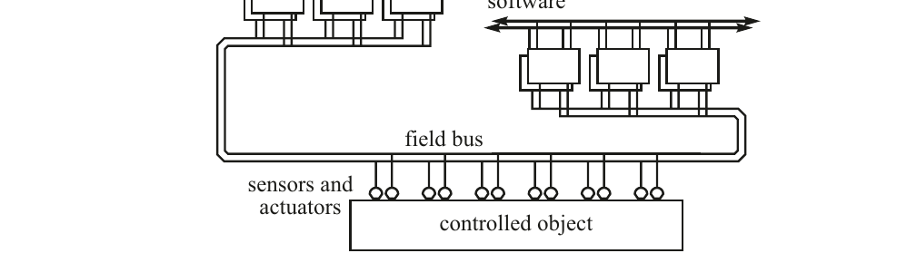

图 11.3 具有多样化软件的多级计算机系统

---

这样的架构已经部署在航天飞机的计算机系统中 [Lee90, p.297]。除了使用相同软件的 TMR 系统外，还提供了第四个具有多样化软件的计算机，以应对设计错误导致整个 TMR 系统相关故障的情况。多样性已部署在许多现有的安全关键实时系统中，例如空客电传飞控系统 [Tra88] 和铁路信号系统 [Kan95]。

## 11.6 面向可维护性的设计

产品的总拥有成本不仅是产品的初始购置成本，而是购置成本、运营成本、产品寿命期间预期维护成本以及最终产品寿命结束时的处置成本之和。面向可维护性的设计试图降低产品寿命期间的预期维护成本。维护成本——可能高于产品的初始购置成本——受到产品设计和维护策略的强烈影响。

### 11.6.1 维护成本

为了能够分析维护行动的成本结构，有必要区分两种类型的维护行动：预防性维护和随叫随到维护。

预防性维护（有时也称为计划维护或常规维护）是指在计划的间隔内周期性地安排的维护行动，此时工厂或机器被有意停机进行维护。基于对组件故障率增加的知识和异常检测数据库分析的结果（参见第 6.3 节），预计在不久的将来会发生故障的组件被识别并在预防性维护期间更换。有效的计划维护策略需要广泛的组件仪器化，以便能够持续地观察组件参数并通过统计技术了解组件即将发生的磨损。

---

随叫随到维护（有时也称为反应性维护）是指在产品未能提供服务后启动的维护行动。就其性质而言，它是未计划的。除了直接的修复成本外，随叫随到维护成本还包括维护准备成本（确保在故障发生时维修团队立即可用）以及从故障发生到修复行动完成期间的服务不可用成本。如果在服务不可用期间必须停止装配线，服务不可用成本可能远高于初始产品购置成本和故障组件的修复成本。

工厂经理的目标是尽可能降低随叫随到维护行动的概率，理想情况下降至零。在航空工业中，飞机的非计划维护意味着失去连接和乘客住宿的额外成本。

影响维护成本的另一方面涉及是永久硬件故障还是软件错误被考虑。永久硬件故障的修复需要物理更换损坏的组件，即备件必须在故障地点可用，并且必须通过物理维护行动进行安装。在建立了适当基础设施的情况下，软件故障的修复可以远程执行，通过 Internet 下载新版本的软件，无需或只需最少的人工干预。

### 11.6.2 维护策略

面向维护的设计始于为产品指定维护策略。维护策略将取决于组件的分类、产品的可维护性/可靠性/成本权衡以及产品的预期使用。

**组件分类** 从维护的角度来看，必须区分两类组件：表现出磨损故障的组件和表现出自发故障的组件。对于表现出磨损故障的组件，必须识别出表示磨损程度的物理参数。这些参数必须被持续监视，以便周期性地确定磨损程度，并确定在下一次计划维护间隔期间是否需要考虑更换该组件。

监视轴承的温度或振动可以在轴承实际损坏之前产生有关其磨损程度的宝贵信息。在一些制造工厂中，安装了超过十万个传感器来监视各种物理组件的磨损参数。

---

如果不能识别组件的可测量磨损参数或不能测量这样的参数，另一种保守的维护技术是组件的降额使用（即在最小应力条件下运行组件），并在给定部署间隔后的计划维护间隔期间系统性更换组件。然而，这种技术相当昂贵。

对于具有自发故障特性的组件，如许多电子组件，不可能提前估计包含故障时刻的间隔。对于这些组件，容错的实现——如第 6.4 节讨论的——是将随叫随到维护转移到预防性维护的首选技术。

**可维护性/可靠性权衡** 这种权衡决定了产品现场可更换单元（FRU）的设计。FRU 是在现场发生故障时可以更换的单元。理想情况下，FRU 由一个或多个 FCU（参见第 6.1.1 节）组成，以便可以对 FRU 故障进行有效诊断。FRU（备件）的大小（和成本）由维护行动的成本分析以及 FCU 结构对产品可靠性的影响决定。为了减少修复行动的时间（和成本），FRU 周围的机械接口应易于连接和断开。易于连接或断开的机械接口（例如插头）的故障率远高于牢固连接的接口（例如焊接连接）。因此，引入 FRU 结构通常会降低产品可靠性。最可靠的产品是不可维护的产品。许多消费产品属于这一类别，因为它们是为最优可靠性而设计的——如果产品损坏，必须作为整体更换新产品。

**预期使用** 产品的预期使用决定了产品故障是否会产生严重后果——例如大型装配线的停机。在这种情况下，实施一个屏蔽电子设备自发性永久故障的容错电子系统在经济上是合理的。在下一个计划维护间隔期间，损坏的设备可以被更换，从而恢复容错能力。硬件容错因此将昂贵的随叫随到维护行动转变为较低成本的计划维护行动。一方面电子设备成本的降低，另一方面人工成本和随叫随到维护期间生产损失成本的增加，将许多电子控制系统的盈亏平衡点转移到了容错系统。

---

在智能环境（AmI）场景中，智能互联网设备被放置在许多家庭中，维护策略必须确保非专业人员可以更换损坏的部件。这需要精心设计的诊断子系统，将故障诊断到 FRU 级别，并通过 Internet 自主订购备件。如果备件交付给用户，没有经验的用户必须能够以最少的努力更换备件，以便以最少的心智和体力恢复系统的容错能力。

Apple iPhone 的维护策略依赖于完全更换损坏的硬件设备，消除了建立精细硬件维护组织的需要。软件错误通过从 Apple iTunes 商店下载新版本来半自动地纠正。

### 11.6.3 软件维护

术语**软件维护**指的是为在不断变化和演进的环境中提供有用服务所需的所有软件活动。这些活动包括：

- **纠正软件错误**：交付完全无错误的软件是困难的。如果在现场运行期间检测到潜伏的软件错误，必须纠正错误并将新版本软件交付给客户。

- **消除漏洞**：如果系统连接到 Internet，任何现有漏洞极有可能被入侵者发现并用于攻击和破坏原本提供可靠服务的系统。

- **适应演进中的规范**：成功的系统会改变其环境。变化的环境对系统提出新的要求，必须满足这些要求以保持系统对用户的相关性。

- **添加新功能**：随着时间的推移，新的有用系统功能将被识别，应包含在软件的新版本中。

嵌入式系统连接到 Internet 是喜忧参半的。一方面，它使提供 Internet 相关服务和远程下载新版本软件成为可能，但另一方面，它使对手能够利用系统的漏洞，如果未提供 Internet 连接，这些漏洞将是无关紧要的。

任何连接到 Internet 的嵌入式系统都必须支持**安全下载服务** [Obe09]。这种服务对于软件的持续远程维护绝对必不可少。安全下载必须使用强大的加密方法，以确保对手无法控制连接的硬件设备并下载其喜欢的软件。

某调制解调器生产商在全球销售了数万个调制解调器，之后黑客发现这些调制解调器包含一个漏洞。该生产商没有考虑提供用于远程安装新的修正版本软件的安全下载服务基础设施。

---

## 11.7 时间触发架构

在系统设计这一章的最后一节中，我们简要概述时间触发架构的设计原则——该架构首先在柏林工业大学、然后在维也纳工业大学历经 20 年开发而成。TTA 整合了本书中提到的许多思想。在维也纳工业大学构建了许多工业原型后，成立了公司 TTTech（时间触发技术），以进一步开发时间触发技术并将其推向工业界。如今，TTA 已部署在许多具有挑战性的航空航天、汽车和工业项目中。

以下段落讨论 TTA 的关键架构原则。一个原则是关于某个讨论领域中对基本洞察的公认陈述。原则为操作规则的制定（即架构的服务）奠定基础。

### 11.7.1 一致全局时间原则

对 TTA 特别重要的是**一致全局时间原则**（参见第 2.5 节）。嵌入式计算机系统必须与由物理时间推进所支配的物理环境交互。因此，物理时间的推进是第一公民，而不是物理环境计算机控制的网络模型的附加物。在大型嵌入式系统的每个节点中都有一个容错的稀疏全局时间基准可用，是 TTA 的基础。这个全局时间基准有助于简化设计。在 TTA 中，这个全局时间基准用于：

- 建立所有相关事件的一致时间顺序，并解决分布式计算机系统中的同时性问题。一致的时间顺序是引入分布式系统**一致状态**概念的前提。当一个新的（修复后的）组件必须重新集成到运行中的系统时，需要一致的状态概念。

- 在接口控制文档中精确规定接口的时间属性，以便可以遵循基于组件的设计风格。

- 建立无冲突的时间控制通信通道用于传输时间触发（TT）消息。TT 消息具有短且可预测的延迟，因此有助于减少分布式相位对齐控制回路中的死区时间。

- 构建在接收端具有错误检测的单向多播通信通道，其中接收方的故障不能传播回发送方。

- 构建具有确定性行为的系统，这些系统易于理解，避免出现 Heisenbug，并支持通过冗余进行故障屏蔽的简单实现。

- 监视和扩展（通过状态估计）实时数据的时间准确性，并确保在物理环境接口处的控制动作基于时间准确的数据。

---

### 11.7.2 组件导向原则

第 4 章中引入的组件概念是时间触发架构的基本结构元素。TTA 组件是一个自包含的硬件/软件单元，仅通过消息交换与其环境交互。组件是设计单元和故障隔离单元（FCU）。组件的基于消息的链接接口（LIF）在时间域和值域上被精确规定，并且与组件的具体实现技术无关。组件可以基于其接口规范（包含在接口控制文档中）使用，无需了解组件实现的内部。TTA 的时间触发集成框架确保跨越多个组件的实时事务具有定义的端到端时间属性。在时间关键的 RT 事务中，组件的计算和时间触发通信系统的消息传输可以进行相位对齐。

一个组件可以扩展到一个新的集群，而无需更改原始组件的 LIF 规范——该规范成为新集群的外部 LIF。经过这样的扩展后，外部 LIF 由一个网关组件提供，该网关组件在另一侧支持一个指向新（扩展）集群的第二个 LIF（集群 LIF）。因此，在 TTA 中我们有一个递归的组件概念。根据所采取的视角，一组组件可以被视为一个集群（关注网关组件的集群 LIF）或一个单一组件（关注网关组件的外部 LIF）。这种递归组件概念使得在 TTA 内构建任意规模的结构良好的系统成为可能。

组件可以集成形成层次结构或网络结构。在层次结构中，一个指定的网关组件连接层次结构的不同级别。现在我们从层次结构的较低级别来看。指定的网关组件有两个 LIF：一个指向层次结构的较低级别（集群 LIF），另一个指向层次结构的较高级别（外部 LIF）。由于不同的层次级别可以遵守不同的架构风格，指定的网关组件必须解决随之而来的属性不匹配。从较低级别来看，网关组件的外部 LIF 是集群的本地未规定接口。反之，当从上方看时，网关组件的集群 LIF 变为本地未规定接口。

---

### 11.7.3 一致通信原则

TTA 的基本通信机制是单向 BMTS（基本消息传输服务），它尽可能遵循 Internet 的**命运共享模型**。命运共享模型由 DARPA 网络的架构师 David Clark 表述如下："命运共享模型建议，如果在实体被丢失的同时也失去了与该实体相关的状态信息，这是可以接受的" [Cla88, p.3]。命运共享原则要求所有与消息传输相关的状态信息必须存储在通信的端点中。即使在时间触发片上网络（TTNoC）的设计中，命运共享原则也被考虑在内。如果终端系统保证是故障静默的，则可以在安全关键配置中应用命运共享原则。否则，关于终端系统预期时间行为的信息还必须存储在一个独立的 FCU 中——即守护者或网络中——以限制胡言乱语节点的故障行为（参见第 7.1.2 节）。

只要 TTA 的不同子系统由时间触发通信系统（如 TTNoC、TTP 或 TTEthernet）连接，BMTS 的特征就是恒定的传输延迟和全局时间的一个粒度最小抖动。如果消息通过事件触发协议传输（例如在 Internet 中），则不能给出这样的时间保证。

这种单一的一致通信机制使得可以将一个组件（可以是片上系统的 IP 核）移动到另一个物理位置，而无需更改组件之间的基本通信机制。

### 11.7.4 容错原则

容错原则处理安全关键系统中故障的发生。它指出，在任何复杂的安全关键应用中，子系统在其寿命期间偶尔发生故障是不可难免的，因此必须设置容错机制以确保这种故障不会导致事故。

大多数从事安全关键系统设计和验证的可靠性工程师都会同意，有强有力的实验证据表明，不可能克服以下四个不可能性结果所总结的约束：

---

- **不可能找到大型且复杂的单体软件系统中的所有设计错误。** 大型系统（超过一百万行代码）的经验表明，实际中不可能消除所有设计错误。虽然正常操作期间发生的大多数设计错误可以在操作测试期间被消除，但处理极其罕见的边界情况的代码中的一些设计错误往往仍然未被发现。

- **不可能在超高可靠系统的寿命期间避免非冗余硬件中的单粒子翻转。** 单粒子翻转（SEU）是由宇宙辐射引起的硬件故障。通常，SEU 不会永久损坏硬件。Li 等人 [Li17] 表明，机器学习卷积网络中间层的一个单位翻转可能导致将卡车误分类为鸟。

- **不可能通过测试和仿真建立大型单体系统的超高可靠性。** 在一篇关于基于软件系统超高可靠性验证的档案论文中，Littlewood 和 Strigini [Lit93] 论证，对于依赖于复杂软件的单体系统，不存在通过测试验证超高可靠性的解决方案。

- **不可能精确规定真实情况下可能遇到的所有边界情况。** 未被覆盖的边界情况——例如驾驶场景中未考虑到的情况——可能成为事故的起因。

---

## 参考文献

已经有很多关于设计的书籍，其中大多数源于建筑设计领域。Jones 的《设计方法：人类未来的种子》[Jon78] 对设计进行了跨学科的审视，对计算机科学家来说是一种愉快的阅读，Christopher Alexander 的《模式语言》[Ale97] 也是如此。Eberhardt Rechtin 的优秀著作《系统架构：创造和构建复杂系统》[Rec91] 和《系统架构的艺术》[Rec02] 提供了许多经验观察到的设计指南，这些指南是撰写本章的重要输入。嵌入式系统的软件设计问题在 [Lee02] 中讨论。Gajski 的《嵌入式系统设计》[Gaj09] 涵盖了硬件综合和验证的主题。

### 要点回顾

- Fred Brook 在其近期著作 [Bro10] 中指出，设计的概念完整性是单一心智的结果。

- 约束限制了设计空间，帮助设计者避免探索在给定环境中不切实际的设计替代方案。因此，约束是我们的朋友，而不是对手。

- 软件本身是一个描述真实或虚拟机器操作的行动计划。计划本身（没有机器）没有任何时间维度，不可能有状态，也没有行为。这是我们将组件而非作业视为嵌入式系统架构设计级别基本构造的其中一个原因。

- 目的分析——即分析为什么需要新系统以及设计的最终目标是什么——必须在需求分析之前进行。

- 对大型问题的分析和理解永远不会完成，总有充分的理由在开始真正的设计工作之前提出更多关于需求的问题。"分析瘫痪"一词被创造出来以指出这种危险。

- 基于模型的设计是一种设计方法，为被控对象和控制计算机系统的可执行模型的开发与集成建立了一个有用的框架。

- 基于组件的设计是一种中间相遇的设计方法。一方面，组件的功能和时间需求从所需的应用功能自顶向下导出。另一方面，组件的功能和时间能力包含在可用组件的规范中。

- 安全可定义为系统在给定时间段内不发生可能导致灾难性后果的关键故障模式的概率。

- 损害是对事故中损失的金钱度量，例如死亡、疾病、伤害、财产损失或环境损害。有潜力导致或促成事故的不良状态称为危险。因此，危险是在给定某些环境触发条件下可能导致事故的危险状态。

- 危险具有严重性和概率。严重性与与该危险相关的事故可能造成的最坏潜在损害有关。危险的严重性通常分为严重性等级。危险严重性与危险概率的乘积称为风险。

- 安全分析和安全工程的目标是识别危险并提出措施以消除或至少降低危险，或降低危险转变为灾难的概率——即最小化风险。

- 安全案例是一组可靠且文档充分的论据的组合，辅以关于给定设计安全性的分析和实验证据。安全案例必须使独立的认证机构相信所考虑的系统是安全的部署。

- 工厂经理的目标是尽可能降低随叫随到维护行动的概率，理想情况下降至零。

- 嵌入式系统连接到 Internet 是喜忧参半的。一方面，它使提供 Internet 相关服务和远程下载新版本软件成为可能，但另一方面，它使对手能够利用系统的漏洞，如果未提供 Internet 连接，这些漏洞将是无关紧要的。

---

### 复习题与问题

- 讨论宏大设计与增量开发的优缺点。

- "棘手"问题的特征是什么？

- 为什么将组件——一个硬件/软件单元——的概念作为系统的基本构建块引入？在实时系统设计的语境中，纯软件组件的概念存在什么问题？

- 讨论限制设计的不同类型的约束。为什么在开始设计项目之前探索这些约束很重要？

- 基于模型的设计和基于组件的设计是两种不同的设计策略。区别是什么？

- UML-MARTE 和 AADL 背后的概念是什么？

- 架构设计阶段的结果是什么？

- 从功能内聚性、可测试性、可靠性、能量与功率以及物理安装的角度，建立一个评估设计的检查清单。

- 什么是安全案例？安全案例中首选的证据是什么？

- 解释故障树分析和故障模式与影响分析的安全分析技术！

- 安全标准 IEC 61508 背后的关键思想是什么？

- 什么是 SIL？

- 设计多样性的优缺点是什么？

- 讨论可靠性/可维护性权衡！

- 为什么我们需要维护软件？

- 如果嵌入式系统连接到 Internet，为什么安全下载服务是必不可少的？

---

# 第12章 验证

Real-Time Systems — Hermann Kopetz & Wilfried Steiner 著 | AI 辅助翻译

---

## 本章概述

本章涉及评估技术。这些技术必须使设计者、用户或认证机构相信，所开发的计算机系统是安全部署的，并且将在规划的真实世界环境中实现其预期功能。本章第一节详细阐述了验证（validation）与核实（verification）之间的区别。验证处理用户意图的非正式模型与被测系统（SUT）行为之间的一致性，而核实处理给定的（形式化）规范与 SUT 之间的一致性。验证与核实之间缺失的环节是规范中的错误。接下来的章节讨论测试的挑战和首选的验证技术。测试的核心是结果的无干扰可观察性和输入的可控性。面向可测试性的设计提供了一个支持这些特性的框架。在大多数情况下，只有输入空间的一小部分可以通过测试用例来检查。正确选择测试用例应能证明这样的假设是合理的：给定测试用例的结果是正确的，系统将在整个输入域上正确运行。在数字系统中，这种归纳的有效性是有疑问的，因为数字输入不是连续的而是离散的——单个位的翻转就可能使正确的结果变为错误。测试输入结果正确与否的判定被委托给测试神谕（test oracle）。测试神谕的自动化是测试领域中的另一个挑战。基于模型的设计——将工厂模型和计算机控制器模型互连以研究闭环控制系统的性能——是通向测试神谕自动化的有前景的路径。如果设计的完整形式化模型可用，则可以部署形式化方法来检查所选属性在模型的所有可能状态下是否成立。在过去几年中，模型检查技术已经成熟到可以处理工业规模系统的程度。容错系统的故障屏蔽机制的正确操作，只有在输入空间扩展到包括系统本应容忍的故障时才能评估。最后一节涵盖了物理故障注入和基于软件的故障注入的主题。由于任何物理传感器或执行器最终都会失效，故障注入活动必须确保即使在任何特定传感器或执行器已经失效的情况下，系统也能安全运行。

---

## 12.1 验证与核实

实时计算机系统开发成本的一个重要部分——高达 50%——用于确保系统符合目的。在必须认证的安全关键应用中，这一比例甚至更高。

在开发嵌入式计算机系统时，区分三种不同类型的系统表示是有用的 [Gau05]：

(i) 用户意图的**非正式模型**，它决定了嵌入式计算机系统在给定真实世界应用上下文中的角色。在嵌入式世界中，这个模型处理计算机输入和输出与物理环境效果之间的关系。这个模型通常没有完整文档化且是非正式的，因为在大多数情况下，不可能思考和形式化在真实世界场景中相关的所有系统方面。

(ii) **系统规范模型**，它用自然语言或某种形式化表示法捕获和记录客户的意图和系统开发者的义务，正如制定（形式化）规范的人或小组所理解的那样。

(iii) **被测系统（SUT）**（系统开发的结果），它应根据用户意图模型执行系统功能。

**核实**建立（形式化）系统规范与 SUT 之间的一致性，而**验证**涉及用户意图模型与 SUT 之间的一致性。核实与验证之间缺失的环节是用户意图（非正式）模型与系统（形式化）规范之间的关系。我们将在此开发阶段发生的错误称为**规范错误**，而将在给定规范转换为 SUT 过程中发生的错误称为**实现错误**。虽然核实理论上可以简化为一个形式化过程，但验证必须检查系统在真实世界中的行为。如果系统的属性已经被形式化地核实，仍然不能确定现有的形式化规范是否捕获了用户环境中预期行为的所有方面，即它是否没有规范错误。有时术语**规范测试**用于找出规范是否与用户意图模型一致 [Gau05]。

验证、规范测试和核实因此是支持质量保证的三种互补手段。主要的验证方法是测试，而理想的核实方法是形式化分析。

在测试期间，实时计算机系统的行为在输入域的精心选择的点上被运行，值域和时域中的相应结果被分类为正确或错误。假定如果测试用例已正确选择并正确执行，那么程序将在巨大的输入空间的所有点上正确运行的归纳是合理的。在数字系统中，单个位的改变可能对行为产生剧烈的后果，这种归纳是脆弱的。如果我们采取纯粹的概率观点，那么只有当系统测试执行的持续时间大于该小时数时，才能估计 SUT 的平均故障前时间（MTTF）将大于给定的小时数 [Lit93]。在实践中，这意味着通过操作测试不可能建立超过 10^3–10^5 小时的 MTTF。这比安全关键系统所需的 MTTF（约 10^9 小时）低几个数量级。

---

形式化方法的主要缺点是用户意图的非正式模型与作为评估系统正确性参考的形式化规范之间的缺失环节。这个空白在 [Kop22] 中被系统地探索。特别是，讨论了规范困境 [Kop22, 第 11.1 节]：

使用形式化符号语言的标记来解决这一规范困境的提议只是部分方案。虽然形式化语言的标记之间的关系是被精确定义的，但标记本身并没有在真实世界中获得扎根。（标记是形式化符号语言中无意义的占位符，例如变量。将真实世界的含义分配给标记的过程——通常通过自然语言——称为"扎根"。）此外，只有与系统运行相关的属性的一个子集可以被捕获在进行形式化分析时检查的形式化属性中。

## 12.2 测试的挑战

SUT 输出的可观察性和测试输入的可控性是任何测试活动的核心。

在非实时系统中，可观察性和可控性由测试和调试监视器提供，它们在测试点暂停程序流，并给测试者监视和修改变量的机会。在分布式实时系统中，这样的过程因以下两个原因不适合：

(i) 在测试点引入的时间延迟修改了系统的时间行为，以至于现有错误可能被隐藏，新错误可能被引入。这种现象称为**探针效应**。测试实时系统时必须避免探针效应。

(ii) 在分布式系统中，存在许多控制点。暂停一个控制路径会在协调的控制流中引入时间失真，可能导致新错误。

---

### 12.2.1 面向可测试性的设计

面向可测试性的设计意味着设计一个框架并提供机制以促进系统的测试。以下技术可以提高可测试性：

(i) 将系统划分为可组合的子系统，具有在值域和时域上明确规定的可观察接口。这样就可以隔离测试每个子系统，并将集成效果限制在涌现行为的测试上。在架构的任何级别上对子系统输出进行无探针效应观察是时间触发架构的基本消息传输服务中提供多播的动机之一（参见第 4.1.1 节）。

(ii) 建立静态的时间控制结构，使时间控制结构独立于输入数据。这样就可以隔离测试时间控制结构。

(iii) 通过引入适当粒度的稀疏时间基准来减少输入空间的时间维度。这个时间基准的粒度对手头应用应足够，但不应更小。稀疏时间基准的粒度越小，时域中的潜在输入空间就越大。通过减小输入空间的大小或增加非冗余测试用例的数量，可以提高测试覆盖率，即测试覆盖总输入空间的比例。

(iv) 在周期性重新集成点以 g-state 消息发布节点的基态。然后可以由独立组件在无探针效应的情况下观察基态。

(v) 在软件中提供确定性，使得如果对组件应用相同的输入消息，将产生相同的输出消息。

由于其确定性属性和静态控制结构，时间触发系统比事件触发系统更容易测试。

### 12.2.2 测试数据选择

在测试阶段，只能运行计算机系统潜在输入空间的一小部分。测试者面临的挑战是找到一个有效且具有代表性的测试数据集，使设计者有信心系统将对所有输入正确工作。本节介绍一些测试数据选择方法：

**随机测试数据选择**：测试数据随机选择，不考虑程序结构或使用的操作剖面。

**需求覆盖**：在此方法中，需求规范是选择测试数据的起点。对于每个给定的需求，设计一组测试用例来检查需求是否得到满足。此准则中隐藏的假设是需求集是完整的。

---

**白盒测试**：检查系统的内部结构，以导出满足某种覆盖准则的测试数据集，例如所有语句都已被执行，或程序的所有分支都已被测试。此测试数据选择准则对单元测试最有效，因为组件的内部实现细节是可用的。

**基于模型的测试数据选择**：测试数据从被测系统模型和物理工厂模型中导出。基于模型的测试数据选择可以实现自动化，因为测试结果的正确性可以与物理过程的性能准则相关联。

考虑汽车发动机控制器与发动机模型进行对抗测试的情况。发动机模型已经相对于真实发动机的运行进行了广泛的验证，被假定为正确的。控制器中实现的控制算法决定了发动机的性能参数，如能效、扭矩、排放等。通过观察发动机的性能参数，我们可以检测由控制器软件的不当行为引起的异常。

**操作剖面**：测试数据选择的基础是被测系统在给定应用上下文中的操作剖面。此测试数据选择准则会遗漏罕见事件。

**峰值负载**：硬实时系统必须在负载和故障假设所覆盖的所有条件下——包括由罕见事件引起的峰值负载——提供规定的及时服务。峰值负载场景对系统施加极端压力，应广泛测试。系统在超过峰值负载情况下的行为也必须测试。如果峰值负载活动处理正确，正常负载情况自然没问题。在大多数情况下，不可能在真实世界操作环境中生成罕见事件和峰值负载。因此，峰值负载测试最好在基于模型的测试环境中进行。

**最坏情况执行时间（WCET）**：要实验性地确定任务的 WCET，可以分析任务源代码以生成偏向最坏情况执行时间的测试数据集。

**容错机制**：测试容错机制的正确性是困难的，因为故障不是正常输入域的一部分。必须提供能够在测试阶段激活故障的机制。例如，软件或硬件实现的故障注入可以用于测试容错机制的正确性（参见下一节 12.5）。

**循环系统**：如果系统具有循环行为（许多控制系统是循环的），则穿越周期的某个特定阶段是时域中的重复事件。在许多循环系统中，测试单周期内发生的所有事件就足够了。

---

上述测试数据选择准则列表不是完整的。关于不同测试数据选择准则有效性的综述研究包含在 [Jur04] 中。使用上述准则的组合来选择测试数据似乎比依赖单一的隔离准则更有效。

为了能够判断测试数据集的质量，引入了不同的覆盖率度量。覆盖率度量描述了测试数据集操作 SUT 的程度。常见的覆盖准则包括：

(i) 功能覆盖——每个功能都已被运行过吗？

(ii) 语句覆盖——源代码的每条语句都已被执行过吗？

(iii) 分支覆盖——每条分支指令都在所有方向上被执行过吗？

(iv) 条件覆盖——每个布尔条件都已被充分测试过吗？

(v) 故障覆盖——故障假设中包含的每个故障的容错机制都已被测试过吗？

### 12.2.3 测试神谕

给定一组测试用例已被选出，必须提供一种方法来确定 SUT 产生的测试用例结果是否可接受。在文献中，术语**测试神谕**（test oracle）用于指代这样的方法。算法化测试神谕的设计是任何测试自动化的前提，这是降低测试成本所必需的。

在实践中，判断测试用例的结果是否符合用户意图模型的自然语言表示，往往被委托给人类。基于模型的设计和基于模型的测试可以帮助部分解决这个问题。

第 4.4 节和第 11 章中讨论的结构化设计过程区分了组件的 PIM（平台无关模型）和 PSM（平台特定模型）。在设计的 PIM 级别上对完整接口行为（在值域和时域上）的可执行表示可以作为 PSM 级别测试结果裁决的参考，从而帮助检测实现错误。神谕挑战因此从 PSM 级别转移到了 PIM 级别。由于 PIM 在设计的早期阶段开发，错误可以在生命周期的早期被捕获，从而降低与错误纠正相关的成本。

---

组件的 LIF 规范（参见第 4.4.2 节）应包含输入断言和输出断言。输入断言限制组件的输入空间，排除组件未设计处理的数据。输出断言有助于立即检测组件内部发生的错误。输入断言和输出断言都可以被视为一种轻量级测试神谕 [Bar01]。由于 PIM 不受资源约束，在 PIM 级别广泛使用输入断言和输出断言可以帮助调试 PIM 规范。在第二阶段，当 PIM 被转换为 PSM 时，可以移除其中一些断言以获得目标机器的高效代码。

在时间触发系统中，时间控制结构是静态的，因此在 PSM 级别检测程序执行中的时间错误是直接的，并且可以自动化。

### 12.2.4 系统演进与技术就绪度级别（TRL）

大多数成功的系统随时间演进。现有缺陷被纠正，新功能在系统的新版本中被引入。这些新版本的验证必须关注两个问题：

(i) **回归测试**：检查先前版本的功能（必须在新版本中得到支持）未被修改且仍然正确。

(ii) **新功能测试**：检查最新版本中新增的功能是否正确实现。

回归测试可以通过在新版本上执行先前版本的测试数据集来自动化。旧版本中检测到的异常（参见第 6.3 节关于异常检测的内容）可以成为对系统施加特别压力的新测试用例的来源。Bertolino [Ber07] 列出了设计特定测试活动时必须解决的六个问题：

(i) 我们**为什么**执行测试？测试活动的目标是发现残余的设计错误，确定产品发布前的可靠性，还是找出系统是否有可用的人机界面？

(ii) **如何**选择测试用例？选择测试用例有多种选项：随机、由操作剖面引导、针对系统的特定需求（例如核反应堆关停场景），或基于对程序内部结构的了解（参见第 12.2.2 节）。

(iii) **多少**测试才算足够？关于必须执行多少测试用例的决策可以来自覆盖率分析或可靠性考虑。

(iv) 我们执行的是**什么**？被测系统是什么——一个模块、仿真环境中的系统，还是真实世界目标环境中的系统。

(v) 我们在**何处**进行观察？这取决于系统的结构以及在不干扰系统运行的情况下观察子系统行为的可能性。

(vi) 我们在产品生命周期的**何时**执行测试？在生命周期的早期阶段，测试只能在人工实验室环境中进行。真正的测试是在系统在其目标环境中运行时到来。

---

**技术就绪度级别（TRL）**系统性地定义了技术方案在其开发过程中的成熟度。最初由 NASA 在 1970 年代和 1980 年代引入，TRL 现已被广泛采用，包括从 Horizon 2020 框架计划开始的欧盟资助研究项目中。不同组织的 TRL 略有不同。例如，欧洲 TRL [EAR14] 区分九个级别。它们从基础研究（TRL 1，观察到基本原理）到实验室验证（TRL 4），再到在运行环境中得到验证的系统（TRL 9）。

## 12.3 基于组件系统的测试

嵌入式应用的基于组件的设计——这是本书的重点——需要适当的基于组件系统验证策略。组件是一个硬件/软件单元，封装并隐藏其设计，在组件的基于消息的 LIF（链接接口）处提供其服务。组件提供者了解组件的内部，可以利用这些知识得出有效的测试用例，而组件用户将组件视为黑盒，必须根据给定的接口规范使用和测试组件。

---

### 12.3.1 组件提供者

组件提供者独立于使用上下文来看待组件。提供者必须关注组件在所有可能的用户场景中正确运行。在我们的组件模型中，用户场景可以通过 TII（技术无关接口，参见第 4.4.3 节）进行参数化。组件提供者必须在 TII 支持的完整参数空间中测试组件的正常功能。组件提供者可以访问源代码，并通过 TDI（技术相关接口，参见第 4.4.4 节）监视组件内部的执行，TDI 通常不被组件用户使用。

### 12.3.2 组件用户

组件用户关注组件在其具体使用上下文中的性能，该上下文由针对给定应用的具体组件参数设置所定义。组件用户可以假设提供者已经根据接口模型测试了组件的功能，并将测试重点放在组件集成的效果和一组组件的涌现行为上——这些是组件提供者测试范围之外的。

第一步，组件用户必须验证组件的先前属性（即组件供应商在隔离状态下测试过的属性）没有被组件的集成所驳斥。组件集成框架在此阶段起着重要作用。

在事件触发系统中，必须在组件的入口和出口提供队列，以将组件性能与待处理的用户请求、用户及时吸收结果的能力以及通信系统的传输能力对齐。由于每个队列都有溢出的可能，需要跨组件边界的流量控制机制。在测试阶段，必须检查组件对队列溢出的反应。

组件的集成可能引发由组件交互引起的计划内或未预期的**涌现行为**。涌现行为是那种不能通过任何比系统整体更简单的层次的分析来预测的行为 [Dys98, p.9]。这个涌现行为的定义明确指出了检测和处理涌现行为属于组件用户而非组件供应商的领域。Mogul [Mog06] 列出了计算机系统中由组件交互引起的许多涌现行为的例子。涌现行为的出现尚未被充分理解，是当前研究的课题（参见第 2.4 节）。

---

### 12.3.3 通信组件

在系统集成期间，商用现成（COTS）组件或应用专用组件通过其相应的链接接口（LIF）连接。跨这些链接接口的消息交换必须仔细测试。在第 4.6 节中，我们介绍了 LIF 规范的三个级别：传输级别、操作级别和语义级别。LIF 测试可以按这三个级别进行。传输级别和操作级别的测试——必须明确规定——可以机械执行，而元级别（语义）的测试通常需要人工干预。BMTS（基本消息传输服务，参见第 4.1.1 节）的多播能力使得可以对在通信组件之间交换的信息进行无探针效应观察。

在基于模型的设计（第 11.3.1 节）中，物理工厂行为和计算机系统控制算法的可执行模型是并行开发的。在 PIM 级别，这些以组件形式体现的模型可以在仿真环境中链接，使得可以观察和研究这些组件的交互。在控制系统中，闭环系统的性能（控制质量）可以被监视，并用于找到最优的控制参数设置。仿真通常以与目标系统不同的时间尺度运行。为了提高仿真相对于目标系统的忠实度，在工厂和控制器 PIM 组件之间交换的消息的相位关系应与最终实现——PSM——中的相位关系相同。这种恒定的相位关系将避免由未受控制和未预期的消息之间相位关系引起的许多微妙设计错误 [Per10]。

## 12.4 形式化方法

术语**形式化方法**（Formal Methods）指的是使用数学和逻辑技术来表达、研究、分析计算机硬件和软件的规范、设计、文档和行为。在雄心勃勃的项目中，形式化方法被应用于形式化地证明一段软件正确实现了规范。John Rushby [Rus93, p.87] 将形式化方法的好处总结如下：

形式化方法可以为认证提供重要的证据，但它们不能比有限元计算"证明"机翼跨度能胜任其工作更多地"证明"一件具有重大逻辑复杂性的人工制品符合其目的。认证必须考虑多个证据来源，最终依赖有根据的工程判断和经验。

---

### 12.4.1 真实世界中的形式化方法

任何对真实世界现象的形式化研究都需要采取以下步骤：

(i) **概念模型构建**：这个重要的非正式第一步导致对作为研究对象的真实世界现象的精确自然语言表示。

(ii) **模型形式化**：在这个第二步中，问题的自然语言表示被转换并用具有精确语法和语义的形式化规范语言表达。在这一步中引入的所有假设、省略或误解都将保留在模型中，并限制从模型中得出的结论的有效性。可以区分不同的严谨度。

(iii) **形式化模型分析**：在第三步中，问题被形式化地分析。在计算机系统中，分析方法基于离散数学和逻辑。在其他工程学科中，分析方法基于数学的不同分支，例如使用微分方程来分析控制问题。

(iv) **结果解释**：在最后一步中，分析的结果必须被解释并应用于真实世界。

这四个步骤中只有步骤 (iii) 可以完全机械化。步骤 (i)、(ii) 和 (iv) 将始终需要人类的参与和人类的直觉，因此与任何其他人类活动一样容易出错。

一个理想且完整的核实环境以规范（以形式化定义的规范语言表达）、实现（以形式化定义的实现语言编写）和执行环境的参数作为输入，并机械地建立规范与实现之间的一致性。在第二步中，必须确保目标机器的所有假设和架构机制（例如硬件的指令集属性和时序）与实现语言定义的计算模型一致。最后，必须建立核实环境本身的正确性。

### 12.4.2 形式化方法的分类

Rushby [Rus93] 将计算机科学中形式化方法的使用按严谨度递增分为以下三个级别：

**级别 (i)**：使用离散数学的概念和表示法。在此级别，关于系统需求和规范的有时含糊的自然语言陈述被离散数学和逻辑的符号和约定——例如集合论、关系和函数——所取代。关于规范的完整性和一致性的推理遵循半形式化的手动风格，正如在数学的许多分支中所进行的一样。

---

**级别 (ii)**：使用具有一些机械支持工具的形式化规范语言。在此级别，引入了一个具有固定语法的形式化规范语言，允许对以规范语言表达的问题的某些属性进行机械分析。在级别 (ii)，不可能机械地生成完整证明。

**级别 (iii)**：使用具有全面支持环境的完全形式化规范语言，包括机械化定理证明或证明/模型检查。在此级别，提供了一种具有直接逻辑解释的精确定义的规范语言，并提供了一组支持工具，允许对以形式化规范语言表达的规范进行机械或自动化分析。

### 12.4.3 形式化方法的益处

**级别 (i) 方法**：在此级别引入的紧凑数学表示法迫使设计者清楚地陈述需求和假设，避免自然语言的歧义。由于对集合论和逻辑基本概念的熟悉是工程教育的一部分，对级别 (i) 方法的有纪律使用将改善项目团队内和工程组织内的沟通，并丰富文档质量。由于大多数严重故障在生命周期的早期就已被引入，级别 (i) 方法的好处最显著地体现在需求捕获和架构设计的早期阶段。Rushby [Rus93, p.39] 看到了在生命周期早期使用级别 (i) 方法的以下好处：

- 软件工程师与其他学科的工程师之间有效和精确沟通的需求在早期阶段最为重要，此时要规定机械控制系统与计算机系统之间的相互依赖关系。

- 熟悉的离散数学概念（例如集合、关系）提供了一个精确但抽象的心智积木库。在项目的早期阶段使用精确的表示法有助于避免歧义和误解。

- 对规范的一些简单机械分析可以导致检测出不一致和遗漏错误，例如符号未被定义或变量未被初始化。

- 如果需求用精确的表示法表达，则生命周期早期阶段的审查比使用模糊的自然语言更有效。

- 以半形式化表示法表达模糊的想法和不成熟的概念的困难有助于揭示需要进一步调查的问题领域。

**级别 (ii) 方法**：级别 (ii) 方法是喜忧参半的。它们引入了一种使用起来繁琐的僵硬形式主义，却没有提供机械证明生成的好处。许多专注于对实时程序时间属性进行形式化推理的规范语言都基于这一级别。级别 (ii) 的形式化方法是在提供全自动核实环境的道路上重要的中间步骤。从研究的角度来看它们是有趣的。

---

**级别 (iii) 方法**：形式化方法的全部好处只有在这一级别才能实现。然而，可用的验证系统并不完整——它们并不覆盖从高级规范到硬件架构的整个系统。它们引入了一个高于硬件功能的中间抽象级别。尽管如此，使用这样的系统对分布式实时系统的某些关键功能——例如时钟同步的正确性——进行严格分析，可以揭示微妙的设计错误并带来宝贵的洞察。NASA 技术备忘录 [Sim11] 定义了一个建模与验证评估分数（MVES），这是一个旨在估计对通过形式化验证活动获得的证据可以赋予的信任量的度量。它以 TTEthernet 协议（参见第 7.5.2 节）的形式化验证过程和工件作为用例进行研究。

### 12.4.4 模型检查

在过去的几年中，**模型检查**（model checking）这一验证技术——级别 (iii) 方法——已经成熟到可以用于分析和支持安全关键设计认证的地步 [Cla03]。给定规范的形式化行为模型和必须满足的形式化属性，模型检查器自动检查该属性是否在系统模型的所有状态中都成立。如果模型检查器发现违规，它会生成一个具体的反例。模型检查的主要问题是状态爆炸。在过去几年中，已经开发了巧妙的形式化分析技术来控制状态爆炸问题，使得可以通过模型检查验证工业规模的系统。

---

## 12.5 故障注入

故障注入是通过软件或硬件有意引入故障，以验证系统在故障条件下的行为。在故障注入实验期间，目标系统暴露于两种类型的输入：注入的故障和输入数据。故障可以看作是激活故障管理机制的另一种输入类型。仔细测试和调试故障管理机制是必要的，因为显著数量的系统故障是由故障管理机制中的错误引起的。

故障注入在评估可靠系统期间具有两个目的：

(i) **测试和调试**：在正常运行期间，故障是罕见事件，很少发生。由于容错机制需要故障的发生才能激活，因此在不进行人工故障注入的情况下测试和调试容错机制的操作是非常繁琐的。

(ii) **可靠性预测**：这用于获取关于容错系统可能可靠性的实验数据。对于第二个目的，必须知道设想运行环境中预期故障的类型和分布。

表 12.1 用于测试和调试的故障注入与用于可靠性预测的故障注入的比较 [Avr92]

可以将故障注入到计算状态中（软件实现的故障注入），或注入到硬件物理层面（物理故障注入）。

### 12.5.1 软件实现的故障注入

在软件实现的故障注入中，由故障注入软件工具将错误播种到计算机的内存中。这些播种的错误模拟硬件故障或软件中设计错误的影响。错误可以随机播种，或根据某些预设策略播种以激活特定的故障处理任务。

软件实现的故障注入相对于物理故障注入有许多潜在优势：

(i) **可预测性**：故障注入的空间（内存单元）和时间由故障注入工具固定。可以在值域和时域上复现每个注入的故障。

(ii) **可及性**：可以到达大型 VLSI 芯片的内部寄存器。引脚级故障注入仅限于芯片的外部引脚。

(iii) **比物理故障注入更省力**：实验可以用软件工具进行，无需修改硬件。

---

### 12.5.2 物理故障注入

在物理故障注入期间，目标硬件受到不良物理现象的影响，这些现象干扰了计算机硬件的正确操作。以下章节描述了一组在 ESPRIT 研究项目"可预测可靠计算系统（PDCS）"背景下对 MARS（可维护实时系统）架构进行的硬件故障注入实验 [Kar95, Arl03]。

MARS 故障注入实验的目标是实验性地确定 MARS 节点的错误检测覆盖率。两个副本确定性的节点接收相同的输入并应产生相同的结果。其中一个节点接受故障注入（FI 节点）；另一个节点作为参考节点（黄金节点）。只要故障的后果在 FI 节点内被检测到，并且 FI 节点关闭自身，或者 FI 节点产生可检测的错误结果消息，该错误就被归类为"已检测"。如果 FI 节点在没有错误指示的情况下产生与黄金节点结果消息不同的结果消息，则观察到**故障静默违规**。

表 12.2 不同物理故障注入技术的特性

在三个不同地点选择了三种不同的故障注入技术（见表 12.2）。在哥德堡查尔姆斯大学，CPU 芯片被 α 粒子轰击直到系统失效。在图卢兹 LAAS，系统接受引脚级故障注入，迫使板上的一条等电位线在精确时刻进入定义的状态。在维也纳工业大学，整个板卡根据 IEC 标准 IEC 801-4 接受电磁干扰（EMI）辐射。

进行了许多不同的测试运行（每个运行包含 2000–10000 次实验），启用了不同的错误检测技术组合。实验结果可总结如下：

(i) 在启用所有错误检测机制的情况下，任何实验中均未观察到故障静默违规。

(ii) 在三种故障注入方法的实验中都需要端到端错误检测机制和任务的双重执行，如果要达到 >99% 的错误检测覆盖率。

(iii) 在使用重离子辐射的实验中，需要三重执行来消除所有覆盖率违规。三重执行由已知输出的测试运行夹在应用任务的两次复制执行之间组成。在 EMI 实验和引脚级故障注入中不需要这个中间的测试运行。

(iv) 在三种实验中都需要总线守护单元，如果要达到 >99% 的覆盖率。它消除了节点最关键的故障——胡言乱语的白痴。

---

MARS 故障注入实验的详细描述以及与在同一系统上进行的软件故障注入的比较包含在 [Arl03] 中。

### 12.5.3 传感器和执行器故障

位于物理世界与网络空间之间接口的传感器和执行器是物理设备，如同任何其他物理设备一样，最终会失效。传感器和执行器的故障通常不是自发的崩溃故障，而是表现为瞬态功能失常或逐渐漂离正确操作，通常与极端物理条件（例如温度、振动）相关。未被检测到的传感器故障产生计算任务的错误输入，其结果将导致可能具有安全相关性的错误输出。因此，任何工业级嵌入式系统都必须有能力检测或屏蔽其任何传感器和执行器的故障，这是当前的最新技术水平。这种能力必须通过故障注入实验来测试，无论是基于软件的还是物理的。

执行器旨在将网络空间中生成的数字信号转换为环境中的某种物理动作。只有当一个或多个传感器观察到预期效果在物理环境中时，才能观察和检测到执行器的不正确操作。这种针对执行器故障的错误检测能力也必须通过故障注入实验来测试（参见第 7.2.5.1 节中的示例）。

在安全关键应用中，这些故障注入测试必须仔细记录，因为它们构成安全案例的一部分。

---

### 要点回顾

- 实时计算机系统开发成本的一个重要部分——高达 50%——用于确保系统符合目的。在必须认证的安全关键应用中，这一比例甚至更高。

- 核实建立（形式化）规范与被测系统（SUT）之间的一致性，而验证涉及用户意图模型与 SUT 之间的一致性。核实与验证之间缺失的环节是用户意图模型与系统（形式化）规范之间的关系。

- 如果采取纯粹的概率观点，那么只有当系统测试执行的持续时间大于该小时数时，才能估计 SUT 的平均故障前时间（MTTF）将大于给定的小时数。

- 通过引入测试探针对被测对象行为的修改称为探针效应。

- 面向可测试性的设计建立了一个框架，其中测试输出可以在无探针效应的情况下观察，测试输入可以在系统架构的任何级别进行控制。

- 测试者面临的挑战是找到一个有效且具有代表性的测试数据集，使设计者有信心系统将对所有输入正确工作。进一步的挑战是找到一个有效的、可自动化的测试神谕。

- 在过去的几年中，已经开发了巧妙的形式化技术来控制状态爆炸问题，使得可以通过模型检查验证工业规模的系统。

- 故障注入是通过硬件或软件方式有意激活故障，以便能够观察系统在故障条件下的运行。在故障注入实验期间，目标系统暴露于两种类型的输入：注入的故障和输入数据。

- 位于物理世界与网络空间之间接口的传感器和执行器是物理设备，如同任何其他物理设备一样，最终会失效。因此，任何工业级嵌入式系统都必须有能力检测或屏蔽其任何传感器和执行器的故障，这是当前的最新技术水平。

## 参考文献

在综述文章《软件测试研究：成就、挑战、梦想》中，Bertoloni [Ber07] 对软件测试的最新水平以及一些开放的研究挑战进行了出色的概述。John Rushby 的研究报告《形式化方法与关键系统的认证》[Rus93] 是关于形式化方法在安全关键系统认证中角色的开创性工作。

---

### 复习题与问题

- 验证与核实的区别是什么？

- 描述测试数据选择的不同方法！

- 什么是测试神谕？

- 组件提供者和组件用户如何测试基于组件的系统？

- 讨论通过形式化方法研究真实世界现象时必须采取的各个步骤。其中哪些步骤可以形式化，哪些不能？

- 在第 12.4.2 节中，介绍了三个不同级别的形式化方法。解释每个级别，并讨论在每个级别应用形式化方法的成本和收益。

- 什么是模型检查？

- 什么是"探针效应"？

- 如何提高设计的"可测试性"？

- 测试在超高可靠系统认证中的作用是什么？

- 故障注入实验的目的是什么？

- 比较硬件和软件故障注入方法的特性。

---

# 第13章 物联网

Real-Time Systems — Hermann Kopetz & Wilfried Steiner 著 | AI 辅助翻译

---

## 本章概述

将物理物品连接到互联网，使得远程传感器数据的获取以及对物理世界的远程控制成为可能。将采集到的数据与其他来源（例如 Web 中包含的数据）的数据进行融合（mash-up），催生出超越孤立嵌入式系统所能提供的全新协同服务。物联网（Internet of Things）正是建立在这一愿景之上。智能对象（smart object）是构成物联网的基本单元，它不过是连接了互联网的嵌入式系统的另一种叫法。还有另一项技术指向了相同的方向——RFID 技术。RFID 技术是日常生活中随处可见的光学条形码的扩展，它要求将一个智能低成本的电子 ID 标签附着在产品上，使得产品的身份可以从一定距离之外解码出来。通过在 ID 标签中加入更多智能，被标记的物品就变成了一个智能对象。物联网（IoT）的新颖之处并不在于任何颠覆性的新技术，而在于智能对象的普遍部署。

本章首先介绍 IoT 的愿景。下一节将详细阐述推动 IoT 发展的各种力量。我们区分技术推动力（technology push）和技术拉动力（technology pull）。技术推动力将 IoT 视为新型 ICT 产品和服务的广阔新市场，而技术拉动力则看到了 IoT 在提高经济多个部门的生产力、为老龄化社会提供新服务以及促进新生活方式方面的潜力。第 13.3 节聚焦于将 IoT 推向大众市场所必须解决的技术问题。第 13.4 节讨论 RFID 技术，它可以被视为 IoT 的先驱。第 13.5 节涵盖了无线传感器网络（wireless sensor networks）这一主题，其中自组织的智能对象构建自组网络并从环境中收集数据。智能对象的普遍部署——它们从远处收集数据并控制物理环境——对世界的安全与安保以及我们生活的隐私构成了严峻挑战。

---

## 13.1 物联网（IoT）的愿景

在过去的 50 年里，互联网呈指数级增长，从一个仅包含少量节点的小型研究网络发展成为一个服务超过 10 亿用户的全球性普及网络。电子设备的进一步小型化和成本降低使得互联网能够扩展到新的维度：即智能对象——那些通过小型电子设备增强的日常物理物品，这些设备提供本地智能并与互联网建立的网络空间（cyberspace）建立连接。这个小型电子设备——一个附着在物理物品上的计算组件——弥合了物理世界与信息世界之间的鸿沟。因此，智能对象是一个信息物理系统（cyber-physical system）或嵌入式系统，由一个物品（物理实体）和一个组件（计算机）组成，该组件处理传感器数据并支持与互联网的无线通信链路。

考虑一台智能冰箱，它跟踪食品的可用性和保质期，并在某种食品的供应低于给定限度时自主向最近的杂货店下订单。

IoT 的新颖之处不在于智能对象的功能能力——如今已有许多嵌入式系统连接到互联网——而在于预计将达到数十亿甚至数万亿的智能对象规模，这将引发与规模相关的新技术和社会问题。这些问题的一些例子包括：智能对象的可靠身份识别、智能对象网络的自主管理和自组织、诊断和维护、情境感知和目标导向行为，以及对隐私的侵犯。必须特别关注那些能够在物理世界中或多或少自主行动、并可能对人员和环境造成物理危害的智能对象。

低功耗无线通信的出现使得无需物理连接即可与智能对象通信。移动智能对象可以在物理空间中移动，同时保持其身份。全球定位系统（GPS）信号的广泛可用性使得智能对象能够感知位置和时间，并提供适应当前使用情境的服务。

我们可以设想一个自主智能对象，它能够访问特定领域的知识库——类似于第 2.2 节中介绍的概念格局（conceptual landscape）——并具备推理能力以便在选定的应用领域中进行自我定位。根据智能对象的能力水平，[Kor10] 区分了活动感知型（activity-aware）、策略感知型（policy-aware）和过程感知型（process-aware）智能对象。

一个按使用付费的智能工具是一个活动感知型智能对象，它收集关于使用时间和使用强度的数据，并自主将数据传输到计费部门。一个策略感知型智能工具会了解其使用案例，并确保其不会在合同约定的使用案例之外被使用。一个过程感知型智能工具会对其环境进行推理，并指导用户如何在给定场景中最优地使用该工具。

---

根据 IoT 的愿景，一个智慧星球（smart planet）将会演化出来，在这个星球上，我们周围的许多日常物品在网络空间中拥有身份，获取智能，并从多种来源融合信息。在智慧星球上，世界经济和支撑系统将更顺畅、更高效地运行。但普通公民的生活也会受到影响，因为那些能够获取所收集信息并控制信息的人与那些无法获取和控制信息的人之间的权力关系将发生改变。

## 13.2 推动 IoT 发展的力量

哪些力量在推动物联网的发展？这些力量存在于技术版图的两侧：技术推动力和技术拉动力。技术推动力将 IoT 视为当前和未来信息与通信技术（ICT）部署的巨大新市场。IoT 将有助于利用现有和新建的工厂，在 ICT 部门提供新的就业机会，并为 ICT 技术的整体进一步发展做出贡献。

本节主要关注技术拉动力。我们经济和社会的哪些领域以及生活的哪些方面将从 IoT 的广泛部署中受益？以下分析并非详尽无遗——我们仅重点介绍根据我们目前的理解，IoT 技术的广泛部署将产生重大影响的一些领域。

### 13.2.1 访问的统一性

互联网已经实现了异构终端系统在多种通信信道上的全球互操作性。IoT 应当将这种互操作性扩展到异构智能对象的整个领域。从降低认知复杂性（见第 2 章）的角度来看，IoT 可以做出非常重大的贡献：建立对物理世界中物品的统一访问模式。

### 13.2.2 物流

IoT 先驱技术——RFID（射频识别，见第 13.4 节）技术的首个商业应用出现在物流领域。随着一些大型企业决定将其供应链管理建立在 RFID 技术之上，低成本 RFID 标签和 RFID 读取器的开发取得了显著进展。在供应链管理中使用 RFID 技术有许多量化优势：货物的流动可以实时跟踪，货架空间可以得到更有效的管理，库存控制得到改善，最重要的是，供应链管理中所需的人力参与显著减少。

---

### 13.2.3 节能

如今，嵌入式系统已经在经济和生活的许多不同领域为节能做出了贡献。汽车发动机燃油效率的提高、家用电器的能效提升以及能量转换损失的减少只是这项技术对节能产生影响的几个例子。IoT 设备的低成本和广泛分布为节能开辟了许多新机会：住宅建筑中的个性化气候和照明控制、通过安装智能电网减少传输中的能量损失，以及通过安装智能电表更好地协调能源供应和能源需求。我们生活中某些部分的去物质化（dematerialization），例如用虚拟会议取代实体会议，以及通过互联网传递信息商品（如日报、音乐和视频），也带来了显著的能源节约。

### 13.2.4 物理安全与安保

对 IoT 技术的一个显著技术拉动来自物理安全与安保领域。基于 IoT 的建筑和住宅自动门禁系统以及基于 IoT 的公共场所监控将增强整体物理安全。智能护照和基于 IoT 的身份识别（例如，进入酒店房间的智能钥匙或智能滑雪缆车票）简化了入场检查并提高了物理安全性，同时减少了这些检查中的人力参与。车对车和车对基础设施通信将向驾驶员发出危险交通场景的警报，例如结冰路面或事故，并减少事故数量。

IoT 技术可以帮助检测假冒商品和可疑的未经批准的备件，这些备件在某些应用领域（例如航空或汽车行业）正成为安全隐患。

另一方面，安全和安保应用侵入了我们生活的隐私。划定个人隐私权与公众对安全生活环境期望之间的界限，应由政策制定者负责。而提供技术以使政治决策能够无缺陷地实施，则是科学家和工程师的责任。

---

### 13.2.5 工业

除了通过应用 RFID 技术来简化供应链和货物管理之外，IoT 还可以在降低维护和诊断成本方面发挥重要作用。对工业设备的计算机化观察和监控不仅能降低维护成本——因为异常可以在导致故障之前被检测到——还能提高工厂的安全性（另见第 11.6 节）。

智能对象还可以监控自身的运行，并在零件磨损或诊断出物理故障时呼叫预防性或自发性维护。自动化故障诊断和简单维护是 IoT 技术在环境智能（ambient intelligence）领域广泛部署的绝对必要前提。

### 13.2.6 医疗

IoT 技术在医疗领域的广泛部署是可预期的。健康监测（心率、血压等）或通过智能植入物精确控制药物输送只是两个潜在应用。作为衣物一部分的身体区域网络可以监测受损人员的行为，并在紧急情况发展时发出警报信息。药品上的智能标签可以帮助患者在正确的时间服用正确的药物，并强制药物依从性。

心脏起搏器可以通过蓝牙链路将重要数据传输到放在衬衫口袋中的移动电话。移动电话可以分析数据并在紧急情况发展时呼叫医生。

### 13.2.7 生活方式

IoT 可以导致生活方式的改变。智能手机可以作为智能对象的浏览器，并用从各种上下文相关数据库中检索到的背景信息来增强我们所看到的现实。

---

## 13.3 IoT 的技术问题

### 13.3.1 互联网集成

根据计算能力和可用能量，智能对象可以直接集成到互联网中，也可以通过连接到互联网的基站间接集成。当智能对象的功率预算非常有限时，将选择间接集成。使用特定于应用的功率优化协议将智能对象连接到附近的基站。不受功率限制的基站可以充当标准 Web 服务器，为可及的智能对象提供网关访问。

在 RFID 系统中，RFID 读取器充当可以读取本地 RFID 标签的基站。读取器可以连接到互联网。在传感器网络中，一个或多个基站从传感器节点收集数据并将数据转发到互联网。

一些主要公司已结成联盟，开发技术解决方案和标准，以便将低功耗智能对象直接集成到互联网中。互联网工程任务组（IETF）的 6LoWPAN（低功耗无线个人区域网络上的 IPv6）工作组已经标准化了将 IPv6 标准与 IEEE 802.15.4 无线近场通信标准集成的节能解决方案。

保障基于 IoT 的系统的安全性和信息安全性被认为是一项困难的任务。许多智能对象将通过严密的防火墙保护其免遭一般互联网访问，以避免攻击者获取对智能对象的控制。第 13.4.5 节将进一步讨论 IoT 中重要的隐私和安全话题。

### 13.3.2 命名与识别

IoT 的愿景（所有数十亿个智能对象都可以通过互联网通信）需要一个精心设计的命名架构，以便能够识别智能对象并建立对该对象的访问路径。

每个名称都需要一个命名上下文，在该上下文中名称可以被解析。命名上下文的递归规范导致了层次化的名称结构——这是互联网所遵循的命名约定。如果我们希望一个名称能够被普遍解释而无需引用特定的命名上下文，我们需要一个具有普遍接受的名称空间的单一上下文。这是 RFID 社区所采取的方法，该社区旨在为每个物理智能对象分配一个电子产品代码（EPC）（另见第 13.4.2 节）。这比其先驱——光学条形码——更为雄心勃勃，后者仅为一类对象分配唯一标识符。

---

**孤立对象** 当我们提及一个孤立对象的简单情况时，必须区分以下三种不同的对象名称：

- **唯一对象标识符（UID）：**指特定对象的物理身份。RFID 社区的电子产品代码（EPC）就是这样一种 UID。

- **对象类型名称：**指一类理想情况下具有相同属性的对象。它是编码在成熟的条形码中的名称。

- **对象角色名称：**在给定的使用上下文中，一个对象扮演由对象角色名称表示的特定角色。在不同时间，同一对象可以扮演不同的角色。一个对象可以扮演多个角色，一个角色可以由多个对象扮演。

假设所有具有相同对象类型名称的对象都是相同的，这一假设并不总是成立。考虑一个未经批准的备件，它具有与批准备件相同的外观属性和相同类型，但却是批准零件的廉价复制品。

办公室钥匙是一个物理对象类型的对象角色名称，该类型可以打开办公室的门。该对象类型的任何实例都是一把办公室钥匙。当办公室门上的锁更换时，不同的对象类型就承担了办公室钥匙的角色。一把特定的办公室钥匙也可以打开实验室。那么它就扮演了两个角色：办公室钥匙的角色和实验室钥匙的角色。一把万能钥匙可以打开任何办公室——因此存在两把不同的钥匙扮演相同的角色。

**复合对象** 每当多个对象被集成以形成复合对象时，一个新的整体，即一个新对象就被创建出来，它具有超越其组成部分身份的新兴身份（emerging identity）。复合对象类似于一个新概念（见第 2.2.1 节），需要一个新名称。

乔治·华盛顿的斧头是一个来源不明的故事的主题，在这个故事中，这个著名的人工制品仍然是乔治·华盛顿的斧头（一个复合对象），尽管它的斧头被更换了两次，斧柄被更换了三次 [Wik10]。

提供新兴服务的复合对象需要自己的 UID，该 UID 与其组成部分的 UID 几乎无关。不同的名称——UID、对象类型名称和对象角色名称——也必须在复合对象的层面上引入。由于复合对象可以是下一个集成层次上的原子单元，名称空间必须递归地构建。

在上述段落中介绍的这些对象名称中，哪一个应该成为与互联网通信的访问点？如果包含在多级复合对象中的所有对象都可以随时随地访问，管理通信复杂性将非常困难。

显而易见，如 EPC 所规定的那样为宇宙中所有智能对象引入一个扁平名称空间只是一个起点。在 IoT 中名称空间架构的适当设计方面还需要更多的研究。

---

### 13.3.3 近场通信

除了已建立的 WLAN（无线局域网）之外，IoT 还需要短距离、高能效的 WPAN（无线个人区域网络），以便在短距离内实现对智能对象的节能无线访问。IEEE 802.15 标准工作组制定了 WPAN 网络标准。符合 802.15 标准的网络包括蓝牙网络和 ZigBee 网络。

蓝牙最初是作为 RS232 有线通信信道的无线替代方案引入的 [Bar07]。蓝牙在 IEEE 802.15.1 中标准化，定义了一个完整的 WPAN 架构，包括安全层。在物理层面，它使用跳频传输技术，在 1 米（第 3 类——最大传输功率 1 mW）到 100 米（第 1 类——最大传输功率 100 mW）的距离上实现高达 3 Mbit/秒的数据速率。蓝牙允许多个设备通过单个适配器进行通信。

ZigBee 联盟是一组开发安全 WPAN 的公司，旨在比蓝牙更简单、更节能且更便宜 [Bar07]。ZigBee 使用基于 IEEE 802.15.4 标准的高级通信协议用于低功耗数字无线电。ZigBee 设备要求电池寿命超过一年。

NFC（近场通信）标准 [Fin03] 是 ISO/IEC 14443 近接卡标准的扩展，是一种短距离高频无线通信技术，可以在不到 20 厘米的距离内实现设备之间的数据交换。该技术兼容现有智能卡和读取器以及其他 NFC 设备，因此与已在公共交通和支付中使用的现有非接触式基础设施兼容。NFC 主要用于移动电话。

### 13.3.4 IoT 设备能力与云计算

能够访问互联网的智能对象可以利用云（通过互联网提供其服务的大型数据中心）所提供的服务。智能对象与云之间的工作分工将在很大程度上由隐私和能量因素决定 [Kum10]。如果在本地执行任务所需的能量大于将任务参数发送到云中服务器所需的能量，那么该任务就是远程处理的候选者。然而，还有其他方面会影响工作分配的决策：智能对象的自主性、响应时间、可靠性和安全性。

---

### 13.3.5 自主组件

预计将遍布我们环境的大量智能对象需要一个自主系统管理，而无需频繁的人机交互。这种自主管理必须涵盖网络服务发现、系统配置和优化、故障诊断和故障恢复、以及系统适应和演化。需要一种多层次的自主管理，从组件的细粒度管理到大规模组件集合或大型系统的粗粒度管理。

图 13.1 自主组件的 MAPE-K 模型（改编自 [Hue08]）

自主组件包含两个独立的故障隔离单元（FCU）：被管组件和自主管理器。自主管理器由以下部分组成：监控器——观察和分析被管组件的行为信息；规划模块——开发和评估替代方案以实现既定目标；以及一个与被管对象的接口——允许自主管理器影响被管组件的行为。自主管理器维护一个包含静态和动态条目的知识库。

图 13.1 展示了自主组件的通用 MAPE-K（监控 Monitoring、分析 Analyzing、规划 Planning、执行 Execution 加知识库 Knowledgebase）架构 [Hue08]。自主组件由两个独立的故障隔离单元（FCU）组成：一个被管组件和一个自主管理器。被管组件可以是单个组件、一组组件或更大系统的一部分。自主管理器包括：一个监控器，用于观察和分析被管组件行为的信息；一个规划模块，用于开发和评估替代方案以实现既定目标；以及一个与被管对象的接口，允许自主管理器影响被管组件的行为。自主管理器维护一个包含静态和动态条目的知识库。静态条目是在先验（即设计时）提供的，它们设定了目标、信念和知识库的通用结构；而动态条目在运行期间填充，以捕获关于具体情境参数的已获取信息。多播通信原语使自主管理器能够在没有任何探针效应（probe effect）的情况下观察被管组件的行为及其与环境的交互。

在其最简单的形式中，自主管理器识别对象和对象变化（事件）并将其分配到已知概念（见第 2.2.1 节）。然后它基于事件-条件-动作规则选择一个动作。如果有多个动作适用，它使用效用函数来选择对实现期望目标具有最高效用值的动作。在更高级的形式中，自主管理器基于支持某种形式的高级推理的认知架构，并可以通过评估过去的决策和引入学习来改进其决策 [Lan09]。

---

## 13.4 RFID 技术

在许多情况下需要方便快速地识别物品，例如在商店、仓库、超市等。为此，一个光学条形码被附着在对象上。读取光学条形码需要人工将对象小心地定位，以便在条形码和条形码读取器之间建立直接视线。

### 13.4.1 概述

为了能够自动化对象识别过程并消除人工环节，已经开发出了电子标签（称为 RFID 标签），可以由 RFID 读取器从短距离读取。RFID 读取器不需要与 RFID 标签的直接视线。RFID 标签存储了所附着对象的唯一电子产品代码（EPC）。由于 RFID 标签必须附着在每个对象上，RFID 标签的成本是一个主要问题。由于国际标准化组织（ISO）对 RFID 技术的标准化以及 RFID 技术的大规模部署，RFID 标签的成本在过去几年中已显著降低。

RFID 读取器可以充当互联网的网关，并将对象身份以及读取时间和对象位置（即读取器的位置）传输到管理大型数据库的远程计算机系统。因此，可以实时跟踪对象。

电子滑雪通行证是一个 RFID 标签，由嵌入在滑雪缆车入场门中的读取器查询。基于对象标识符，滑雪通行证持有者的照片会显示给操作员，如果操作员不干预，门会自动打开。

### 13.4.2 电子产品代码（EPC）

光学条形码表示产品类别（同一产品的所有包装具有相同的条形码），而 RFID 标签的 EPC 表示对象实例（每个包装具有唯一标识符）。EPC 的意图是为地球上每一个可识别的物品分配一个唯一标识符（UID），即为 IoT 的每个智能对象分配一个唯一名称。

EPC 由国际组织 EPC global 管理。为了应对 EPC 必须识别的海量物品，EPC 包含多个字段。一个小型头部字段决定了其余字段的结构。一个典型的 EPC 长度为 96 位，包含以下字段：

- **头部（8 位）：**定义所有后续字段的类型和长度。

- **EPC 管理器（28 位）：**指定负责在其余两个字段中分配对象类别和序列号的实体（通常是制造商）。

- **对象类别（24 位）：**指定一类对象（类似于光学条形码）。

- **对象识别号（36 位）：**包含对象类别内的序列号。

---

EPC 是唯一的产品标识，但不透露产品属性的任何信息。两个具有相同属性但由两个不同制造商设计的物品将具有完全不同的 EPC。通常，唯一的 EPC 被用作在产品数据库中查找产品记录的键。产品记录包含有关产品属性的所有必需信息。

### 13.4.3 RFID 标签

RFID 标签包含其最重要的数据元素——相关物理物品的 EPC。已经开发并标准化了多种不同的 RFID 标签。它们基本上分为两大类：无源 RFID 标签和有源 RFID 标签。

**无源 RFID 标签** 无源标签没有自己的电源。它们从 RFID 读取器发出的电场中收集能量，以获得运行所需的电力。最新一代无源标签运行所需的能量低于 30 μW，这种标签的成本低于 5 美分。无源标签除了包含作为唯一识别号的标准化 EPC 之外，还包含关于产品属性的其他选定信息项。由于可用功率水平低以及 RFID 标签生产的成本压力，无源 RFID 标签的通信协议不符合标准互联网协议。ISO（例如，ISO 18000-6C，也称为 EPC global Gen 2）已经标准化了考虑无源 RFID 标签约束的 RFID 标签与 RFID 读取器之间的专门通信协议，并得到了许多制造商的支持。表 13.1 给出了典型低成本无源 RFID 标签的参数。

表 13.1 典型低成本无源 RFID 标签的参数（改编自 [Jue05]）

    | 存储 | 128–512 位只读存储 |
| --- | --- |
| 内存 | 32–128 位易失性读写存储器 |
| 门数 | 1,000–10,000 门 |
| 工作频率 | 868–956 MHz（UHF） |
| 每次读取的时钟周期 | 10,000 时钟周期 |
| 扫描范围 | 3 米 |
| 性能 | 每秒 100 次读取操作 |
| 标签电源 | 由读取器通过 RF 信号无源供能 |
| 功耗 | 10 微瓦 |

---

**有源 RFID 标签** 有源标签有自己的板载电源，例如电池，这使它们能够支持比无源标签多得多的服务。有源标签的寿命受限于电池的寿命，通常约为一年。有源标签可以在比无源标签更长的距离上发送和接收，通常为数百米量级，可以配备传感器来监测其环境（例如温度、压力），并且有时支持标准互联网通信协议。从某种意义上说，有源 RFID 标签类似于一个小型嵌入式系统。ISO 标准 18000-7 规定了在 433 MHz 范围内与有源标签通信的协议和参数。降低有源 RFID 标签在睡眠模式下的功耗是当前研究的一个课题。

### 13.4.4 RFID 读取器

RFID 读取器是 RFID 标签世界与互联网之间的网关组件。这两个世界以不同的架构风格、命名约定和通信协议为特征。在互联网一侧，RFID 读取器看起来像一个遵循所有互联网标准的标准 Web 服务器。在 RFID 一侧，RFID 读取器遵循 RFID 通信协议标准。RFID 读取器必须解决所有属性不匹配问题。

### 13.4.5 RFID 安全

每当我们把计算机连接到互联网时，就会出现必须解决的敏感安全问题 [Lan97]。标准安全技术基于加密方法的部署，如第 6.2 节中概述的加密、随机数生成和哈希。加密方法的执行需要能量和硅片面积，而这些在所有智能对象（如低成本 RFID 标签）中都不充分。一个经常听到的论点是，随着微电子设备变得越来越便宜，计算能力受限的 RFID 标签对象将在不久的将来消失，但这忽略了简单 RFID 标签面临的成本压力。如果低成本 RFID 标签被贴在数十亿种零售产品上，即使为提供加密能力而增加一分钱的标签成本也将被回避。

---

IoT 中的信息安全威胁可以分为三类：（i）危及信息真实性的威胁；（ii）由 IoT 产品的普遍部署引起的隐私威胁；以及（iii）拒绝服务威胁。我们假设绝大多数 IoT 设备通过无线连接连接到网络空间。无线连接始终构成一个严重的漏洞，因为它为攻击者无察觉地观察流量打开了大门。

**认证** IoT 的一个基本假设是，电子设备（例如 RFID 标签）在网络空间中代表一个唯一的物理物品，并且由可信机构建立的电子设备与物理物品之间的这种链接是可靠可信的。这种对标签真实性的信任很容易被动摇。扫描和复制一个未受保护的标签相对容易，因为标签不过是一串可以毫无困难地复制的位串。

将另一个物理物品——例如伪造产品——附着在一个真实标签上，可以破坏物理物品与标签（物理物品在网络空间中的代表）之间的链接。这类攻击必须在智能对象的物理设计层面解决，而不能通过网络空间安全方法来处理。

确保低成本 RFID 标签背后物品真实性的已知技术相当有限。标签是一个任何通用读取器都能读取的位串，可以被复制以产生克隆标签。即使是数字签名也无法防止标签的克隆。中间人攻击——攻击者模仿正确的标签——可能会破坏读取器与标签之间已建立的链接。访问产品数据库可以通过发现 EPC 的唯一性属性已被违反来检测克隆标签的存在，但不能消除克隆。

访问产品数据库可以识别一件携带克隆标签的伪造艺术品，并发现真品所在的位置与标签读取器的位置不同。

防篡改标签——当它们从可信机构所附着在的物品上分离出来时物理性地断裂——是解决物理标签盗窃问题的一种方案。为了能够确定贵重物品的真实性，已经提出了物理单向函数（POWF——Physical One-Way Functions）[Pap02]。POWF 的一个例子是一个具有随机三维微结构的透明光学器件，以防篡改的方式附着在物品上。由于微结构的随机性在制造过程中无法控制，因此不可能生产出两个相同的 POWF。当以特定角度用激光读取时，POWF 的响应是一个对该唯一 POWF 具有特征的位流。根据读取角度的不同，可以获取不同的特征位流。这些位流可以存储在产品数据库中。攻击者很难克隆 POWF，因为它是一个具有随机特征物理属性的物品，无法用数学函数表示。POWF 不是网络空间的构造，无法被复制或重构。

---

**隐私** RFID 世界中的主要隐私担忧是未经授权的读取器秘密读取标签。由于低成本 RFID 标签未受保护且可被通用读取器读取，未经授权的读取器进行的秘密标签追踪会向攻击者泄露有价值的信息。如果攻击者使用配备高功率天线输出的敏感读取器（恶意读取，rogue reading），他可以显著扩展标称读取范围。标签中包含的 EPC 代码和其他属性的信息可以与携带标签的人的身份相关联，以构建个人画像。由于低成本标签不具备认证读取器的加密能力，每当被查询时它都会泄露其信息。秘密标签读取可以通过在标签进入消费者领域时（即销售点）永久停用（kill）标签来防止。标签停用有效地强制执行了消费者隐私。然而，如果标签支持标签停用功能，则在可用性方面建立了一个漏洞。

通过分析一个人携带的带标签药品，攻击者可以推断出该人的健康状况信息。

如果——如已被提议的——钞票包含 RFID 标签，一个配备隐藏读取器的攻击者可以不知不觉地确定一个人在公文包中携带的金额。

在商业环境中，携带隐藏读取器的攻击者可以定期监控竞争超市中的商品库存。

另一种隐私执行技术不阻止而是检测秘密读取。消费者可以携带一个特殊的监测标签，每当检测到秘密读取攻击时就向携带者发出警报。监测标签将秘密读取行为转化为公开读取行为，从而暴露隐藏的攻击者。

**拒绝服务** 拒绝服务攻击试图使计算机系统对其用户不可用。在任何无线通信场景中，例如 RFID 系统或传感器网络，攻击者可以用适当频率的高功率信号干扰以太，以干扰目标设备的通信。在互联网中，攻击者可以向一个站点发送协调的突发服务请求，以使该站点过载，从而无法再处理合法的服务请求（另见第 6.2.2 节关于僵尸网络的内容）。

作为隐私增强机制，一些 RFID 标签支持将标签置于睡眠模式或永久停用标签的功能。攻击者可以利用此功能来干扰服务的正常运行。

在自动超市结账时，RFID 读取器通过读取购物车中物品的 RFID 标签来确定购买的商品。如果攻击者停用了某些标签，相应的物品将不会被识别，也不会出现在账单上。

---

## 13.5 无线传感器网络（WSN）

微机电系统（MEMS）、低功耗微电子和低功耗通信领域的最新进展使得构建称为传感器节点的小型集成智能对象成为可能，这些传感器节点包含一个传感器、一个微控制器和一个无线通信控制器。传感器节点可以获取各种物理、化学或生物信号，以测量其环境的属性。传感器节点资源受限。它们由小型电池或从环境中收集的能量供能，计算能力有限，内存较小，通信能力受限。

为了监测和观察一个现象，在传感器场中部署一定数量（从几十到数千个）的传感器节点，通过系统性或随机性部署，形成一个自组自组织的网络——无线传感器网络（WSN）。WSN 收集关于目标现象的数据，并通过自组多跳通信信道将数据传输到一个或多个可以连接到互联网的基站。

传感器节点部署到传感器场后，它就独立存在，依赖其自组织能力。首先，它必须检测其邻居并建立通信。在第二阶段，它必须了解节点之间的连接方式，即节点拓扑，并建立到达基站的自组多跳通信信道。在活动节点发生故障的情况下，它必须重新配置网络。

无线传感器网络可用于许多不同的应用，如远程环境监测、监视、医疗应用、环境智能和军事应用。无线传感器网络的效用在于所有活动传感器节点的集体新兴智能，而不是任何特定节点的贡献。

只要最小数量的节点处于活动状态且活动节点与某个基站之间的连接得以保持，传感器网络就是可运行的。在电池供电的传感器网络中，网络的寿命取决于电池的能量容量和节点的功耗。当传感器节点耗尽能量时，它将停止运行，无法再将消息转发给其邻居。因此，节能是传感器网络中至关重要的。节点的设计、通信协议以及传感器网络的系统和应用软件的设计主要由对能效和低成本的追求所决定。

已经尝试使用 RFID 基础设施来互连自主低成本的基于 RFID 的传感器节点 [Bha10]。这些传感器节点无需电池运行，并从环境或 RFID 读取器发射的电磁辐射中收集能量。该技术有潜力生产出长寿命、低成本的普适传感器节点，这可能彻底颠覆许多嵌入式应用。

---

### 本章要点

- 根据 IoT 的愿景，一个智慧星球将会演化出来，在这个星球上，我们周围的许多日常物品在网络空间中拥有身份，获取智能，并从多种来源融合信息。

- 电子产品代码（EPC）是为地球上每一个物理智能对象命名的唯一标识符。这比其先驱——光学条形码——更为雄心勃勃，后者仅为一类对象分配唯一标识符。EPC 由国际组织 EPC global 管理。

- 复合对象需要自己的 UID，该 UID 与其组成部分的 UID 仅松散相关。不同的名称——UID、对象类型名称和对象角色名称——也必须在复合对象的层面上引入。由于复合对象可以是下一个集成层次上的原子单元，名称空间必须递归地构建。

- 智能对象与云之间的工作分工将在很大程度上由能量因素决定。如果在本地执行任务所需的能量大于将任务参数发送到云中服务器所需的能量，那么该任务就是远程处理的候选者。

- 智能对象的自主管理必须涵盖网络服务发现、系统配置和优化、故障诊断和故障恢复、以及系统适应和演化。

- RFID 读取器可以充当互联网的网关，并将对象身份以及读取时间和对象位置（即读取器的位置）传输到管理大型数据库的远程计算机系统。

- IoT 中的信息安全威胁可以分为三类：（i）危及信息真实性的威胁；（ii）由 IoT 产品的普遍部署引起的隐私威胁；以及（iii）拒绝服务威胁。

- 为了避免秘密读取，标签必须认证读取器。

- 攻击者很难克隆物理单向函数（POWF），因为它是一个具有随机特征物理属性的物品，无法用数学函数表示。POWF 不是网络空间的构造，无法被复制或重构。

- 传感器节点部署到传感器场后，它就独立存在，依赖其自组织能力。首先，它必须检测其邻居并建立通信。在第二阶段，它必须了解节点之间的连接方式，即节点拓扑，并建立到达基站的自组多跳通信信道。在活动节点发生故障的情况下，它必须重新配置网络。

---

## 参考文献

2009年，欧盟发布了物联网战略研究路线图 [Ver09]，讨论了 IoT 的愿景和直至 2020 年及以后的相关研究问题。优秀的 RFID 手册 [Fin03] 是 RFID 技术的重要参考。2010 年 9 月的 Proceedings of the IEEE 特刊 [Gad10] 专门讨论 RFID 技术。2022 年 1 月的 Proceedings of the IEEE 特刊讨论了具有无线功率传输和能量收集技术的未来网络 [Cle22]，我们预期这将进一步加速 IoT 的广泛采用。

## 复习题与思考题

- 物联网的愿景是什么？哪些是最迫切需要解决的技术问题？

- 推动物联网发展的力量有哪些？

- 什么是智能对象？

- 讨论智能对象的命名！什么是 UID、类型名称、角色名称或复合对象的名称？

- 讨论近场通信的不同标准！

- IoT 与云计算之间的关系是什么？

- 描述自主组件的 MAPE-K 模型！

- RFID 读取器的功能是什么？

- 低成本 RFID 标签的典型参数有哪些？

- 什么是电子产品代码（EPC）？它与普遍使用的光学条形码有何关系？

- 什么是物理单向函数（POWF）？它在哪里需要？

- RFID 领域的三种主要安全威胁是什么？

- 传感器节点如何部署在传感器场中？

- 描述传感器节点的自组织能力！

---

---

# 第14章 云计算与雾计算

Real-Time Systems — Hermann Kopetz & Wilfried Steiner 著 | AI 辅助翻译

---

## 本章概述

云计算起源于 21 世纪初数据中心过剩容量的商业化。大型数据中心运营商当时意识到，他们的资源利用率平均如此之低，以至于将计算时间和存储等资源出租给付费客户变得有利可图。结果，云计算范式在全球范围内迅速被采纳并取得了巨大成功。截至 2020 年底，约有 600 个超大规模数据中心在运行中提供云计算服务。云计算经常用于实现软实时系统，如视频流、电子商务或办公与协作应用。然而，本章更感兴趣的是探讨云计算如何作为一种设计原则融入构成硬实时系统的分布式嵌入式应用。

我们首先概述云世界和实时系统世界之间的显著差异。我们认为，云世界本身不适合硬实时系统，因为它无法提供及时性保证，并引入了雾计算（fog computing，也称边缘计算 edge computing）作为利用云优势的一种手段。雾计算是一种区分嵌入式层、雾层和云层的架构风格。与云不同，雾层靠近被控对象，由雾节点组成，其特征是提供资源池化、北向和南向连接性以及雾层和嵌入式层的配置能力。我们详细说明了雾计算的主要优点和风险，并继续讨论沿上述特征展开的关键雾和云技术。我们将虚拟化作为一种资源池化方法进行讨论，引入时间触发虚拟机（TTVM），并展望容器和无服务器计算。北向连接性将雾层连接到云，而南向连接性将雾层连接到嵌入式层。我们讨论北向和南向连接性之间的主要差异。我们还给出配置特征的示例。我们在本章结尾讨论了云计算和雾计算在硬实时系统中的用例，并说明了用于工业雾计算的 Nerve 软件平台如何满足雾节点的特征。

---

## 14.1 引言

在第 1 章中，我们将实时系统的主要功能需求定义为数据采集、直接数字控制和人机交互。过去，采集到的数据被传输到企业计算机进行存档和进一步分析。然而，随着许多企业计算功能向云迁移，以及通过互联网远程监控、诊断和更新实时系统的需求出现，将实时控制系统与云对接的需求便产生了。此外，一旦建立了云连接，就会出现新型的实时系统。

自动驾驶汽车是最复杂的实时系统之一。它们通常使用多种传感器和高清地图来安全地识别其位置并进行机动。与传统存储在汽车本地存储中的数字地图不同，作为云服务的数字地图使地图数据能够被视为实时图像，其时间精度由地图更新频率决定。该实时图像还可以包括天气、交通状况或事故信息。汽车可以集体地、即时地更新实时图像，例如使用 HERE 发布的传感器摄取接口规范 [HER15] 或 ETSI 集体感知服务分析技术报告 [ETS19]。

尽管将越来越多的实时系统功能卸载到云在经济上具有吸引力，但由于到云的连接和云中的计算通常不满足实时系统功能的时间要求，因此存在显著的限制。因此，云世界和实时系统世界之间存在一个边界，这个边界必须在空间上靠近被控对象。雾节点是这个边界的一种实现。它们将实时系统与云对接，并提供集中式计算能力。

随着云计算范式的出现，其在执行实时任务方面的用途已被研究。对于软实时任务，它很快就取得了成功。我们将相应的服务称为软实时服务，像视频点播或协作办公工具等服务如今已广泛使用。然而，在云中执行硬实时任务——我们称之为硬实时服务——已被证明是一个重大挑战，据作者所知，目前还没有任何云提供商具备在纯云计算环境中执行硬实时服务的能力。

上述挑战源于构成云的分布式计算机的复杂性及其与实时实体的连接性，这导致与云的通信和云中任务执行时间都存在高时间变化（即抖动）。因此，进出云的消息及其处理的行动延迟（action delay）质量低下，并且在实际中甚至可能无法可靠地计算。

---

测量互联网延迟的工具普遍可用。例如，ping 命令可以测量从发送端到云服务器再返回的往返延迟。从中欧 ping www.google.com 的结果显示平均往返延迟约为 20 ms，但偶尔延迟会显著超过 100 ms。另一个标准工具是 traceroute，它测量发送方和接收方之间的跳数。一个简短的实验表明，像 www.google.com 或 www.aws.com 这样的常见域名可以在十到二十跳之间可达（同样从中欧）。

硬实时服务需要最坏情况通信时间和最坏情况执行时间的可计算界限。使用当今的云技术，两者都不可能实现，这违反了云计算的核心假设——云的底层 HW/SW 系统将自动提供足够的性能（在本例中是指有保障的及时性）。然而，新兴技术如 5G 或用于通信的 IETF detnet 标准，以及在云中使用专门的实时硬件，可能会逐步解决这些开放问题。

由于云服务对消费者的响应时间也是软实时服务的重要属性，云提供商已经迅速意识到将其数据中心与用户地理协同定位可以显著减少通信延迟。随着我们继续将资源分布并进一步向消费者方向协同定位，一种新的架构风格——雾计算——出现了。

## 14.2 云的特征

云世界与实时系统世界有着根本的不同。云中的动态资源共享以牺牲实时保证为代价来提高可依赖性（dependability）和性能。我们在表 14.1 中总结了这两个世界之间的主要差异。

表 14.1 云世界与实时系统世界的比较

    | 特征 | 云世界 | 实时系统世界 |
| --- | --- | --- |
| 及时性 | 为平均情况设计 | 为最坏情况设计，有保证 |
| 可依赖性 | 可用性 | 可靠性与安全性 |
| 灵活性 | 消费者应感知无限资源，可快速扩展/缩减 | 在明确定义的界限内不频繁更新 |
| 物理结构 | 数据中心 | 嵌入式系统 |
| 可访问性 | 广泛且全球性 | 受限 |

---

让我们较详细地审视云计算的以下基本特征：

**资源池化（Resource Pooling）。** 简单来说，云是一个将资源池化并提供给许多消费者的数据中心。这些资源例如存储、处理、内存和网络带宽，云将确保每个消费者能够访问其份额的资源。然而，消费者通常不知道所提供资源的确切位置，也无法精确请求资源位置。这种特征——多个消费者共享一个资源池——称为资源池化。

**广泛的网络访问（Broad Network Access）。** 云中的资源必须通过标准化的通信方式轻松访问。此外，由于用户可能操作具有不同通信能力的各种设备（例如从智能手机到工作站），云还需要支持多种通信标准。

**弹性计算（Elastic Compute）。** 云计算固有地支持消费者资源需求的大规模且快速变化。一方面，按需自助服务特征意味着云计算使消费者能够以自动化方式增加其资源份额，无需云服务提供商的人工干预。另一方面，快速弹性特征进一步说明，云将快速处理消费者资源需求的此类变化。由于每个消费者的资源使用情况可能随时间大幅变化，云计算还必须具有计量服务特征，该特征本质上实现了计量方法，用于记录向消费者分配或由消费者消耗的资源数量。

云计算在各种用例中的显著经济效益以及潜在风险和挑战早已被分析，如 Armbrust 等人的讨论 [Arm10]。毫不奇怪，在有效利用上述云计算特征的用例中，经济效益最高。这些用例是消费者需求变化很大的用例，但也有资源需求不可预测的用例，例如一个提供新型 SaaS 的新 Web 创业公司。Armbrust 等人还给出了第三类用例——客户准备的高度可并行化的计算问题，可以通过在特定时期增加消费者资源供应来更快地解决。我们将在第 14.5.1 节中继续讨论实时系统背景下的云用例。

在风险方面，数据中心的某些典型风险仍然存在，例如单个资源故障或大规模损坏。然而，云提供商可以像传统数据中心运营商一样缓解这些风险，并且可能具有更优的缓解策略选择，因为他们通常运营多个可以互为备份的云站点。尽管如此，一些新的风险随着云计算固有地出现，或与传统数据中心相比显著增加。首先，由于多个消费者共享同一资源池，这些消费者现在彼此构成安全威胁（Armbrust 等人将此称为内部安全，internal-facing security）。事实上，大型云提供商在确保消费者之间无信息泄露方面投入巨大。例如，他们通过使用形式化方法来实现这一点。其次，由于多个消费者共享云基础设施的好处，他们也共同受到其故障的影响。例如，允许根据消费者需求快速自动扩展资源的协议和算法的复杂性增加了常见软件故障的风险。

---

NIST 在一份特别出版物 [Mel11] 中定义了云计算范式，该定义被云行业接受为最新技术水平。除了我们在本节讨论的基本特征外，它还规定了以下三种服务模式。

服务模式包括：

- 软件即服务（SaaS）

- 基础设施即服务（IaaS）

- 平台即服务（PaaS）

公众最常使用的服务模式是软件即服务（SaaS），消费者使用托管在云中的应用程序，例如 webmail 应用程序。对此类应用程序的唯一接口可能是 Web 浏览器。然而，云服务的消费者通常不是最终客户，而是需要不同服务模式的另一家企业。一种是基础设施即服务（IaaS），消费者（例如一家企业）可以控制在云中部署的应用程序、操作系统和存储。最后，平台即服务（PaaS）是介于 SaaS 和 IaaS 之间的另一种服务模式，消费者在其中开发和部署其应用程序，但受限于云提供的平台能力。

在上述数字地图示例中，最终客户可能将地图服务作为 SaaS 使用，而数字地图提供商可能不运营自己的基础设施，而是作为云提供商 IaaS 的消费者。

**服务等级协议（Service-Level Agreement）** 云计算提供商和消费者签订一份法律合同，称为服务等级协议（SLA），该协议定义了提供商交付的云服务以及消费者因此承担的成本。一些云计算提供商在其 SLA 中指示（在云中执行的服务）平均响应时间。然而，据作者所知，SLA 不保证最坏情况响应时间。

## 14.3 雾计算的出现

与云计算不同，雾计算没有一个广泛接受的定义。尽管 NIST 定义了雾计算概念模型 [Ior18]，但其采纳程度远低于 NIST 云计算定义。因此，在本章中，我们在雾计算作为分布式嵌入式系统设计原则的用途下定义它，并给出我们对它如何与类似概念（如边缘计算）相关的解释。

---

### 14.3.1 用于分布式嵌入式系统的雾计算

雾计算连接了云架构风格和嵌入式架构风格（见第 2.2.4 节），并引入了新的设计原则、规则和约定。因此，用于分布式嵌入式系统的雾计算本身就是一种架构风格，在这种风格中，控制物理过程的分布式计算机由嵌入式节点、至少一个雾节点和云服务组成。我们将一个或多个雾节点称为雾层，它具有以下三个特征：

（i）**资源池化：**雾层被配置为执行不同、潜在独立应用的实时服务。如果雾节点允许执行硬实时服务，则它配备足够的计算资源。

（ii）**连接性：**

（a）雾层通过北向接口连接到云。

（b）雾层通过南向接口连接到嵌入式节点，该接口通过实时网络与嵌入式节点通信，也可直接连接到传感器、执行器或两者。

（c）雾层实现了一个网关组件（见第 4.5 节），连接云和嵌入式的架构风格。

（iii）**配置：**

（a）雾层可以配置至少一些通过其南向接口可访问的通信和计算资源。

（b）雾层本身可以通过其北向接口进行配置。

我们将云称为云层，将嵌入式节点称为嵌入式层。图 14.1 描绘了雾计算架构中的三个层。

图 14.1 雾计算架构示例

**自动化钻孔机——**实现自动化钻孔机的雾计算架构可以如下实现。被控对象是一台自动化钻孔机，由一个摄像头、一个钻头定位系统和钻头本身组成。该机器自动供应工件，分布式计算机的任务是确定目标位置、钻孔尺寸和深度并执行实际钻孔。摄像头捕获工件的外观（钻孔前、钻孔中和钻孔后），然后通过实时网络将此图像发送到雾节点，雾节点生成钻头位置、钻头速度和钻头力的具体设定点。雾节点将这些设定点发送到嵌入式节点，嵌入式节点将其应用于定位系统和钻头。此外，雾节点将钻孔前后的工件图片发送到云端进行质量控制。

---

如果多个雾节点构成雾层，它们可以通过展示资源池化特征作为一个集合运行，类似于云计算。

**自动化钻孔工厂车间——**一个工厂车间可能部署了一百台钻孔机，由十个雾节点服务。如果其中一个雾节点发生故障，剩余的无故障雾节点将自动服务受影响的钻孔机。雾节点为此用例进行了充分配置。

雾节点可以是固定的或移动的。例如，雾节点可以位于工业自动化环境中，在工厂车间控制单个生产单元或工业机器人。雾节点也可以是移动的，例如集成在汽车内部。

### 14.3.2 雾计算的收益与风险

多年以来众所周知，通过采用抽象和分而治之原则的架构可以简化大型复杂实时系统的管理 [Kah79]。特别是，与传统的纯嵌入式架构相比，雾架构具有以下收益：

（i）**分区（Partitioning）。** 现代实时系统变得越来越复杂，我们必须使用简化策略来保持其可理解性。将系统划分为定义良好的子系统是一种简化策略（见第 2.1.4 节）。不同子系统通常具有不同的计算特征，因此雾计算架构可以通过将子系统适当地映射到合适的云层、雾层或嵌入式层来优化整体实时系统。此外，雾计算的分层结构也可以指导分区过程，并提供基本机制来控制子系统接口，在此之上可以构建更丰富的控制机制。

（ii）**系统之系统（System-of-Systems）。** 雾层还可以抽象嵌入式层的细节。一方面，抽象是另一种复杂性简化策略。另一方面，抽象使雾计算能够作为系统之系统（system-of-systems）形成的演进架构（见第 4.7.3 节）。

协作的自动驾驶汽车是组成系统。它们将由不同的汽车制造商生产，并可以非协调地演化。它们可以通过本地雾节点作为系统之系统互操作，根据需要调整各自的北向接口和网关组件。

（iii）**嵌入式层卸载（Embedded-layer off-loading）：** 雾层允许通过直接连接到传感器/执行器来节省整个嵌入式节点。那些保留在系统中的嵌入式节点可以实现降低的计算能力。尽管必须考虑雾层的额外成本并与嵌入式层节省的成本进行对比，但这种对比应涉及系统整个生命周期内的总成本。雾层提高了嵌入式层的可靠性（因为节点更少或更简单），且雾层的维护可能比嵌入式层更具成本效益（因为雾层更容易访问）。

---

（iv）**优化的多核利用和资源过度配置（resource overprovision）：** 增加每个芯片的处理器核心数量是当今硅性能增长的主要因素。因此，多核 SoC 也已广泛用于嵌入式系统市场。然而，仅执行单个应用程序的个体嵌入式节点不一定能利用这种硅性能的增长，因为应用程序具有非常专门化且通常非常狭窄的用途。雾节点能够有效利用多核 SoC，整合来自不同嵌入式节点的多个应用程序。此外，雾节点可以实现备用资源，为实时系统未来服务升级做好准备（资源过度配置）。

（v）**简化的供电和冷却基础设施：** 许多现代嵌入式系统在总体能耗方面有很高的需求，导致复杂的能源和冷却基础设施。随着雾计算架构减少了单个节点的数量，这些基础设施可以得到简化。在某些用例中，雾节点还可以远程放置，这降低了冷却和供电的难度。然而，如果雾节点超过一定复杂度，雾节点的冷却和供电子系统可能会成为挑战，分布式（雾）解决方案可能更为可取。

（vi）**集中式数据采集和信息处理：** 雾节点还可以充当集中实体，从嵌入式层收集数据。这些数据随后可以以多种方式处理，例如进行浓缩和压缩以上传到云层，用作入侵和异常检测的基础，进行应用级处理以为嵌入式层生成新信息，实施简化的冗余管理，以及为嵌入式层中的副本提供数据一致性服务。

（vii）**集中式配置和维护：** 现代实时网络如 IEEE 802.1 时间敏感网络（TSN）具有许多配置和重配置能力。雾层非常适合作为嵌入式层中此类网络的中央网络配置实例运行。类似地，雾层可以作为集中实例运行，从云层接收嵌入式层的新软件更新并管理更新过程。

（viii）**安全架构手段：** 雾层可以作为抵御安全威胁的多条防线之一运行。例如，雾节点可以实现入侵检测算法或防火墙。

将功能从嵌入式层集中到雾层也可能带来新的可依赖性问题和安全风险。

尽管系统设计实现了雾计算架构，它仍然必须满足应用特定的可依赖性目标。这些目标可以通过雾节点的足够质量、雾节点的复制、在雾层和嵌入式层中设计组合可依赖性措施，或这些方式的组合来实现。此外，应避免典型的系统设计陷阱：单点故障、故障和错误传播（特别是在云、雾和嵌入式层边界之间）以及共模故障。在单个雾节点内实现多个故障隔离单元在某些系统设计中可能是合理的。然而，这样的设计必须以极大的谨慎进行分析，并且必须证明上述陷阱已被避免或至少被充分缓解。

---

在雾计算架构中，雾层是通向云的唯一接口。尽管如上所述这具有安全优势，但它也将成为安全攻击的主要目标。因此，雾层本身需要按照高安全要求进行设计。根据具体的用例，还建议实施直至嵌入式层的端到端安全措施，例如通过使用签名和安全启动。

### 14.3.3 通用雾计算及与边缘计算的比较

Shi 等人 [Shi16] 将"边缘"定义为"沿数据源和云数据中心之间路径上的任何计算和网络资源"，并认为"边缘计算与雾计算是可互换的"。尽管 NIST 指出了雾和边缘之间的差异，我们同意 Shi 等人的观点。边缘计算和雾计算的技术实现似乎是相同的。然而，技术实现可以从不同的角度来看待。一方面，云和互联网服务提供商将其基础设施的核心（core）和边缘（edge）区分为计算位置。因此，他们倾向于使用术语边缘计算，如今云提供商也提供边缘计算即服务。另一方面，从架构风格的角度，我们更倾向于雾计算，及其定义的云、雾和嵌入式层。在与云计算相关的语境中，这也是一个更好的比喻，尤其因为云没有边缘。

## 14.4 选定的云和雾技术

虽然雾计算范式作为一种架构风格直接源于云计算，但使雾计算成为可能的技术，特别是构建复杂实时系统所需的技术，是与云计算技术并行演进的。在本节中，我们讨论雾计算的使能技术。讨论按照我们先前引入的三个雾计算特征来组织：资源池化、连接性和配置。我们还在本节中讨论雾计算中的系统设计自动化，并强调适当配置工具的重要性。

---

### 14.4.1 资源池化

用于实时系统的雾节点必须限制其托管的不同应用程序之间的干扰，并向其南向用户提供可预测的界限。只有这样，雾节点的实时服务才能符合其规范。云计算中用于资源池化的标准软件技术是虚拟化、容器化和无服务器计算。尽管这些技术限制了干扰，但其实际实现（i）缺乏安全相关和安全关键系统通常所需的严格审查，并且（ii）通常只考虑值域的干扰限制，而不关心硬实时系统绝对必需的时间域干扰。

最强大的干扰限制形式是基于硬件的：雾节点实现多个芯片。结果，在不同芯片上执行的应用程序之间的干扰受到限制，连接这些芯片的通信系统可以施加控制。

**zFAS——**zFAS 是一个用于汽车驾驶辅助系统的中央域控制器。它由一块实现多个 CPU 和一个 FPGA 的单板组成。一个时间触发以太网交换机连接它们。

雾节点甚至可以实现通过背板连接的多块板卡。这种雾节点通常使用 Ethernet、PCIe 或两者作为背板通信。除了干扰限制外，需要多芯片雾节点实现的其他问题还包括对性能的纯粹需求、缺乏经过认证的半导体，以及作为硬件加速器的专用芯片。然而，半导体行业的趋势表明，越来越多地集成到单个片上系统（SoC）解决方案中，旨在缓解上述问题。例如，今天已有可用的半导体实现了用于关键应用的安全岛（safety island）。芯片的这个安全岛部分按照行业特定的安全标准开发，并与同一硅片上的其他非安全部分集成。

软件解决方案也可以限制干扰。例如，在传统嵌入式系统中，实时操作系统的任务是调度实时任务。因此，只要操作系统满足任务的截止时间，任务之间的时间干扰是可接受的。同样，其他操作系统服务将确保值域的干扰限制（例如内存管理、I/O）。

**虚拟化（Virtualization）** 随着半导体性能的不断提高，特别是多核 SoC 的发展，虚拟化在技术上对硬实时系统变得可行，从而实现了前一节讨论的雾计算收益。虚拟化是一种成熟的硬件抽象技术，由 Goldberg [Gol73] 引入，可虚拟化计算机架构的形式化需求由 Popek 和 Goldberg [Pop74] 制定。虚拟化利用虚拟机监视器（VMM）来管理和控制虚拟机（VM）。今天，VMM 通常被称为 hypervisor（虚拟机管理程序），它们有两种类型。类型 1 hypervisor 是一个直接在硬件计算资源（即处理器）之上运行的软件层；它也称为在裸机（bare metal）上运行。相比之下，类型 2 hypervisor 在操作系统之上运行。因此，在类型 2 hypervisor 的情况下，操作系统位于 hypervisor 和裸机之间，称为宿主操作系统。通常，操作系统也安装在 VM 内部——这些操作系统称为客户操作系统。

---

今天，现代处理器不仅支持计算虚拟化，还支持 I/O 和图形虚拟化。随着每个处理器中计算核心数量的增长，虚拟化已成为实现细粒度资源池化的主要技术。例如，VM 可以配置为在固定的一组处理器核心上执行，这称为固定（pinning）。核心也可以配置为在 VM 之间共享，包括来自不同消费者的 VM。

一个特定的服务器级 SoC 可能实现 64 个核心。通过使用 Xen 类型 1 hypervisor，可以通过将适当的核心分配给消费者 VM 来支持许多单独的云消费者。在一个简单的场景中，63 个云消费者各获得一个独占分配的核心，留下一个核心供 Xen 管理虚拟机。

在云中，每个消费者的 VM 数量可以根据消费者需求动态扩展，VM 可以配置为从一台机器迁移到另一台机器，例如在故障情况下。雾节点可以使用用于硬实时系统的 hypervisor，这些 hypervisor 已经开发了相当长的时间。早期的开源 hypervisor 包括 RT-Xen [Xi11]。ACRN [Li19] 是一个较新的例子。还存在越来越多的商业解决方案。

**Nerve 平台——**Nerve 是一个用于工业自动化的雾计算平台。它实现了 ACRN 2.0 hypervisor，允许执行工业实时任务。

它们必须解决的一个基本问题是多级调度问题。

**虚拟化系统中的多级调度** 假设一个系统由一个多核 SoC 组成，该 SoC 由类型 1 hypervisor 虚拟化，实例化多个虚拟机，并让至少一个虚拟机实现实时操作系统。虚拟化系统中的多级调度是协调 hypervisor 的调度决策与客户操作系统的调度决策的问题，以使在虚拟机中执行的实时任务确实满足其截止时间。

在最简单的解决方案中，多级调度退化为经典的实时调度和适当的 hypervisor 配置：VM 固定（VM-pinning）将计算核心独占分配给 VM。因此，每当客户操作系统调度实时任务执行时，它不会被 hypervisor 在该核心上调度另一个 VM 所延迟。然而，VM 固定可能成本较高。

---

或者，一个成本效益高的解决方案是时间触发虚拟机（TTVM），其中 VM 激活和实时任务执行的调度在设计时联合生成。

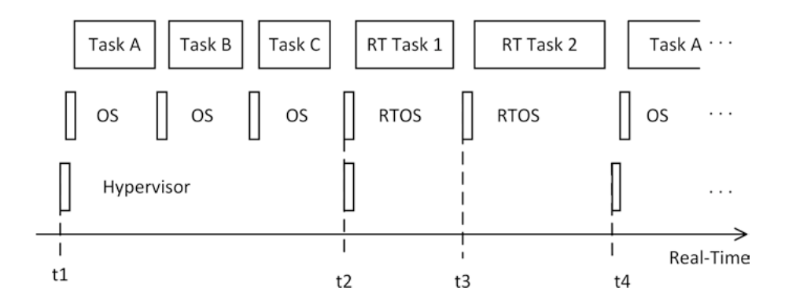

图 14.2 描绘了一个简单的例子，两个 TTVM 在单个计算核心上执行。一个 TTVM 执行非实时任务（任务 A–C），而第二个 TTVM 执行实时任务（RT 任务 1 和 RT 任务 2）。在这个例子中，在时间点 t1–t4 的活动在系统设计时定义，并以 t4 的活动重复 t1 的活动循环重复。时间点 t1、t2 和 t4 是 hypervisor 配置的一部分，指示了相应 TTVM 的启动时间。时间点 t2 和 t3 是 RTOS 配置的一部分，指示 RTOS 何时启动实时任务。


图 14.2 时间触发虚拟机（TTVM）

时间触发虚拟机还需要同步的全局时间。Ruh 等人 [Ruh21] 研究了使用 ACRN 作为 hypervisor 和 IEEE 802.1AS 作为时钟同步协议的虚拟化分布式系统中的时钟同步。他们表明，虚拟环境中的时钟同步质量可以接近非虚拟化系统。实验实现了远低于一微秒的时钟同步精度。

**容器（Containers）** 通过 hypervisor 的虚拟化在不同 VM 之间提供了强隔离，但它有一定的成本：每个 VM 都需要实现一个客户操作系统。因此，在过去几年中开发了更轻量级的虚拟化形式。其中一种技术称为基于容器的虚拟化 [Sol07]，其最突出的实现是 LXC（https://linuxcontainers.org/）和 Docker [Ber14]。与 VM 不同，容器不使用 hypervisor 进行分离，而是直接使用操作系统的内核机制（例如在 Linux 中：命名空间 namespaces、cgroups 和 capabilities）。为此，容器由容器引擎（container engine）管理和控制，该引擎通过对内核函数的适当调用来设置容器的执行。因此，容器是一种 OS 级虚拟化形式。

容器解决了软件开发中非常实际的问题：在容器内执行的软件镜像不仅由应用程序代码本身组成，还包括所有依赖项（例如库、栈和部分操作系统用户空间）。因此，在容器内执行的镜像是自包含的。由于镜像是自包含的，它们也很容易扩展。每个实现兼容容器的容器引擎的物理服务器都知道如何设置所述容器的执行。

---

容器编排（container orchestration，例如 Kubernetes）管理和控制容器的部署、通信和扩展。然而，这种容器编排只涉及容器本身，而不涉及容器内部执行的服务。容器编排将例如将容器分配到适当的计算资源，并设置虚拟网络基础设施以实现容器之间的通信。它还可以监控容器执行并在故障情况下重启容器。在容器成功设置后，容器内执行的服务将自己协调，而不依赖于容器编排。

用于实时系统的容器目前正在获得越来越多的研究关注 [Cin18]。类似于 TTVM，我们也可以设计时间触发容器（TTC），它们在同步全局时间的预配置时间点执行，其中容器编排可以包括这些时刻的计算。RTOS 内核和容器引擎需要确保 TTC 的及时执行。然而，由于容器之间的隔离是由容器引擎和底层操作系统内核建立的，这些部分的任何故障都可能对系统运行产生严重影响。例如，内核中的软件故障可能导致所有容器失败。

**无服务器计算（Serverless Computation）** 最新的计算资源抽象技术是无服务器计算，由亚马逊通过 AWS Lambda 函数引入 [Ama21]。术语"无服务器"需要从消费者的角度来理解：消费者可以直接在云中部署代码，而无需管理和控制服务器（即 VM 或容器）来将所述代码作为服务执行。Baldini 等人 [Bal17] 概述了无服务器平台的关键特征。在其他用例中，无服务器平台通常执行由单一主函数组成的代码，这些函数可以用多种受支持的编程语言（如 Java 或 Python）编写。此外，云将按需启动无服务器函数，并根据实际消费者需求扩展其实例数量。因此，"突发性、计算密集型工作负载"从无服务器计算中获益匪浅 [Bal17]。

据作者所知，无服务器计算尚未用于硬实时系统。然而，尽管在撰写本文时这还属于推测，但无服务器实时计算在未来也有可能成为现实，因为它使应用程序开发人员完全摆脱了平台顾虑。应用程序设计者可以专注于解决其领域特定问题，而平台负责以（微）服务形式将应用程序集成到系统中。在实时系统世界中的这种集成将远超云世界，因为它必须考虑在时间域中描述应用程序的特征（例如通过计算应用程序的 WCET）以及其可依赖性和安全属性。

---

### 14.4.2 连接性

我们区分连接雾层到云层的北向通信系统和连接雾层到嵌入式层的南向通信系统。这两种通信系统有显著差异，特别是在其实时属性方面。北向通信必须与云计算的广泛网络接入特征相配合，而南向通信则遵循实时网络的要求。

雾节点的北向通信系统的较低层通常实现 Ethernet、Wi-Fi 或 5G 等技术。在较高层，将实现标准互联网协议栈。例如，Dizdarevic 等人 [Diz19] 最近关于雾和云计算通信系统的调查报告指出，REST HTTP 经常被用作业通信的北向应用级协议。MQTT 是另一个知名协议。

北向通信系统的重要属性包括例如（并非所有要求都必须满足，它们将取决于实际的雾计算用例）：

（i）**无损数据传输：** 由于云计算的许多用例涉及数据收集和分析，北向数据不得丢失，在消息丢失的情况下必须重传。

（ii）**容忍通信脆弱性：** 北向通信系统可能是脆弱的，无论是在移动雾节点部署还是在固定设置中。移动雾节点（例如部署在卡车中）通过无线方式在到云的北向接口上通信，这种无线链路可能因为隧道或其他环境条件而中断。另一方面，固定雾节点可能部署在互联网基础设施欠发达的地理区域。因此，北向接口不能依赖始终在线的互联网连接。

（iii）**偶发性大块数据传输：** 可能需要进行大块数据传输，包括从雾到云的数据（例如地图或视频数据的大块上传），以及反向的数据（例如软件更新）。

南向通信将实现实时网络，如本书前面（第 7 章）已讨论的那样。因此，像 CAN 或实时 Ethernet 变体（包括 IEEE 802.1 时间敏感网络 TSN）等技术被用于较低网络层。南向的较高层协议通常是专有的。然而，各行业正在持续进行标准化努力，例如机器人技术中的 ROS（Robot Operating System）、汽车领域中的 SOME/IP、工业自动化中的 OPC UA 或跨行业的 DDS（Data-Distribution Service）。此外，还形成了特殊兴趣小组来标准化高层与低层协议的交互，例如 OPC UA over TSN 或 DDS over TSN。

---

数据分发服务（DDS）包括一个发布-订阅消息代理系统。一方面，DDS 节点将其输出（称为主题 topics）作为消息发布。另一方面，DDS 节点可以订阅主题。DDS 建立发布者和订阅者之间的信息交换。DDS 由 OMG 标准化 [OMG15]。

一些行业，特别是汽车行业，区分基于信号（signal-based）的通信和面向服务（service-oriented）的通信。基于信号通常意味着直接在较低网络层上进行基于消息的通信，其中通信配置也经常是硬编码的。一个信号可能例如与具有硬编码发送方和接收方的 Ethernet 消息负荷中的某个字段相关。面向服务也是基于消息的，但意味着包含较低和较高网络层的更丰富的通信系统。在较高层，面向服务通信可能例如包括发布-订阅消息代理系统或服务发现协议。面向服务通信增加了系统的灵活性，但也增加了其复杂性。

**用于容错的服务发现——**一个安全关键系统可以设计为依赖服务发现过程作为故障切换例程的一部分。例如，如果主系统发生故障，服务发现可以识别备用服务。在这样的设置中，服务发现的故障可能导致灾难性事件。

如示例所示，在硬实时系统中，特别是安全关键系统中使用面向服务通信必须逐案仔细审查。例如，一种非关键地使用面向服务通信的方式是在系统的开发阶段，当软件更新频繁时。然而，一旦系统进入生产阶段，面向服务通信的动态部分将被静态配置所替代。

### 14.4.3 配置

雾节点在雾计算架构中的位置使其能够在嵌入式层上执行配置权限，并可由云层重新配置。

雾节点可以重新配置连接嵌入式层的实时网络（南向接口）。例如，IEEE 802.1 TSN 定义了中央网络配置（CNC）和中央用户配置（CUC）的服务。这两种服务都针对网络配置和重配置以适应不断变化的应用程序需求。这些服务可以在雾节点中实现。

---

此外，雾节点还可以充当包括嵌入式层在内的系统级软件更新过程的代理：新的软件镜像被下载到雾节点，并从那里分发到相应的嵌入式节点。

**空中下载（OTA）更新 I——**一个新的汽车摄像头驱动软件版本可用。该摄像头位于实现雾计算架构的自动驾驶汽车中。新软件版本首先加载到汽车内的雾节点中，然后进一步分发到控制摄像头的嵌入式节点。

雾节点本身可以通过其北向接口进行更新。

**OTA 更新 II——**一个新的传感器融合算法软件版本可用。该新软件版本通过北向接口加载到雾节点，雾节点将旧版本替换为新版本并在本地执行。

### 14.4.4 系统设计自动化

雾计算允许实现相当复杂的实时系统，例如自动驾驶汽车或自主工厂（工业 4.0）。然而，这些实时系统包含许多不同的技术，如我们在本节中讨论的技术，而这些技术中的大多数必须被适当地配置。不同技术的配置之间也存在许多依赖关系，例如上述的多级调度。其他依赖关系源于构建计算链的需要——一组必须在给定截止时间内在给定时间顺序中执行的任务，可能位于不同的计算资源中，甚至可能位于雾计算架构的不同层中。

**MotionWise——**MotionWise 是一个用于高级驾驶辅助功能和自动驾驶的汽车软件平台。MotionWise Creator 是一个用于系统设计自动化的工具。例如，它允许指定实时任务的属性（如 WCET、任务依赖关系、内存占用），MotionWise Creator 生成任务和通信调度。

系统设计自动化区分较低级配置和较高级配置，其中人工产生较高级配置，工具自动生成较低级配置。然而，随着技术进步和人类专家知识编码化，较高级和较低级配置之间的边界逐渐上升。因此，越来越多的配置任务变得自动化。

在当前 MotionWise 版本中，人工将功能分配到计算资源（较高级配置）。在即将发布的版本中，MotionWise 也将自动化此功能分配（较低级配置）。

雾计算中的系统设计自动化具有巨大的增长潜力。例如，未来它可能以以下为目标：（i）自动将功能分配到不同的雾计算架构层（嵌入式、雾、云）；（ii）自动化和支持为给定用例选择匹配技术；以及（iii）指导雾节点的选择和放置。

---

## 14.5 示例用例

云和雾计算为分布式嵌入式应用提供了许多用例。我们在本章的最后一节中讨论其中一些。

### 14.5.1 云计算赋能的用例

本节讨论嵌入式层与云层通信的架构用例，无论是直接通信还是通过雾层间接通信。雾层是可选的。

**分布式数据采集与大数据处理**

云计算的数据中心特征使其能够作为集中式数据存储和数据处理设施运行。当不仅单个系统向云馈送数据，而是更大的系统集合（例如汽车车队或工厂车间或多个工厂车间的工业机器人）这样做以实现更高的共同目标时，这是特别有吸引力的。

一支无人机机队配备单独的摄像头，用于在地震后绘制区域地图以辅助救援任务。无人机单独的摄像头馈送到云中，云生成综合地图。云服务可以基于综合地图和来自无人机摄像头的持续软实时馈送来指导救援任务。

在自动驾驶汽车的开发中，一个重要的验证手段是道路测试。一支自动驾驶汽车车队在道路上行驶时向云提供测试数据。这些测试数据的一部分是边缘案例检测（edge case detections），即汽车未正确识别或未按预期处理的情况。这些边缘案例检测被收集在云中，可以用于生成自动驾驶汽车的软件更新，包括对象识别过程中使用的神经网络的更新。

**预测性维护——**一个工业机器人工厂车间向云提供诊断数据。云可以在此诊断数据上使用模式识别方法来识别更换工业机器人组件的需求。此外，它可以从过去的事件中学习，并识别可能导致类似问题的模式。

---

如前面的示例所示，云中的数据采集和处理用例如多种多样。确实，大数据分析（例如参见 Sagrigoglu 等人 [Sag13]）已经在广告业等成熟行业中造成了颠覆，并且在传统实时控制行业（如工业 4.0）中具有类似的颠覆潜力。

**数字孪生（Digital Twin）**

NASA 分类法将数字孪生定义为基于模型的系统工程（MBSE）的一种手段。确实，NASA 最初在 Shafto 等人 [Sha10] 中引入了数字孪生概念来描述 NASA 数字孪生："数字孪生是车辆或系统的集成的多物理场、多尺度、概率仿真 [...]"，以及"数字孪生集成来自车辆板载集成车辆健康管理（IVHM）系统的传感器数据 [...]"。

在更一般的解释中，数字孪生概念有两个核心特征：

（i）数字孪生是物理系统的有用仿真模型。

（ii）物理对象和实现数字孪生的模型之间存在某种在线同步。

云计算是数字孪生的理想用例，因为仿真模型可能变得计算量相当大，而云计算的广泛网络访问特征可以实现与物理系统的同步。

**工业机器人监控——**工业机器人响应控制命令的运动在云中进行仿真。此仿真与物理孪生在相同控制命令下的实际运动进行比较。这种对物理孪生的持续监控和与数字孪生的比较可以检测故障和退化。

数字孪生概念已在不同领域被采纳，例如在机电一体化领域 [Bos16]，并且通常被视为工业 4.0 中的重要元素。

**嵌入式软件工程的云支持**

为嵌入式系统开发软件的传统方式是在开发计算机（笔记本电脑或工作站）上设计和编码，交叉编译，并直接在接近生产系统的目标硬件系统上进行测试。这种目标硬件通常直接放在软件开发人员的桌子上。这种设置给予了软件开发人员最大的灵活性，但有严重的缺点。

首先，可用目标硬件系统的数量可能成为瓶颈。特别是在使用尖端芯片组时，开发板稀缺是很常见的。另一方面，此类硬件可能非常昂贵，使得购置大量设备的经济理由难以成立。第二个主要缺点是缺乏固有的协作开发过程。

---

云计算技术可以在很大程度上缓解这些问题。云数据中心可以配备专门的目标硬件，以资源池化方式在不同开发人员之间共享。或者，更适应云计算的方式是，目标硬件由在标准云硬件上执行的软件层模拟，或至少在比具体目标硬件更通用的硬件上模拟。事实上，这种硬件模拟今天已做到芯片级别——甚至可以在芯片生产之前为该目标芯片开发软件。云计算也固有地支持团队协作。可以使用标准工作流编排技术，例如建立协作开发工作流。

尽管嵌入式软件开发的很大部分可以通过云计算技术来解决，但至少对于关键嵌入式系统，始终需要在生产硬件上进行最终验证和确认，以满足系统获得监管批准的要求。

### 14.5.2 雾计算赋能的用例

本节讨论具有必选雾层的架构中的用例。

---

**汽车领域架构和车载计算平台（ICCP）**

现代汽车是复杂的分布式计算机：大量电子控制单元（ECU）通过车内（实时）网络连接。ECU 和网络统称为 E/E 架构（电气/电子架构）。这种 E/E 架构在持续演进，是创新的主要来源。汽车执行的应用程序相当多样化，汽车制造商通常将其分组为领域（domain），如信息娱乐和数字座舱（infotainment and digital cockpit）、车身（body）、能源（energy）、高级驾驶辅助系统（ADAS）和自动驾驶（AD）、底盘（chassis）、动力总成（powertrain）和网关/连接性（gateway/connectivity）。过去，新应用程序作为硬件/软件捆绑包被引入汽车，即通过新的 ECU，并且通常随着新车型或重大车型改款的推出。这导致了相当高的 ECU 数量和复杂的车内网络：顶级车型的 ECU 轻松超过 100 个。因此，当前的 E/E 架构越来越多地向雾计算架构演进（其收益和风险在第 14.3.2 节中讨论）。

这种 E/E 架构演进中正在进行的一步是引入基于域（domain-based）的架构，其中每个域实现一个域控制器（domain controller），可以将其理解为雾节点。每个域控制器是一个功能相当强大的 ECU，与以前的汽车 ECU 相比，通过南向接口连接到嵌入式层，并通过北向接口连接到云。到云的连接要么直接在网关/连接性域控制器中，要么通过网关间接连接其他域。

不同域控制器的硬件和软件特性因域而异。例如，信息娱乐域控制器的关键性较低，而 ADAS/AD 域控制器将是安全关键的。Audi zFAS 是 ADAS/AD 域控制器的一个例子 [AUD17]。

E/E 架构继续向更加集中化演进，因为多个域控制器正在被集成到单个更强大的 ECU 中。汽车制造商正在探索完全集中化到一个或两个中央汽车计算平台，或称为车载计算平台（in-car compute platform，ICCP），其中两个 ECU 的主要原因是将故障隔离单元彼此隔离。

在 E/E 架构中，创新也在改变嵌入式层。其中一项创新是将嵌入式层结构化为区域（zone），例如分为四个区域：前右、前左和后右、后左。每个区域实现一个区域控制器（zone controller），一方面连接到传感器和执行器，另一方面连接到中央多域 ECU。

**具有车载计算平台（ICCP）的区域架构——**图 14.3 描绘了一个 E/E 架构，包含两个 ICCP ECU 和四个区域控制器（ZC）。

---

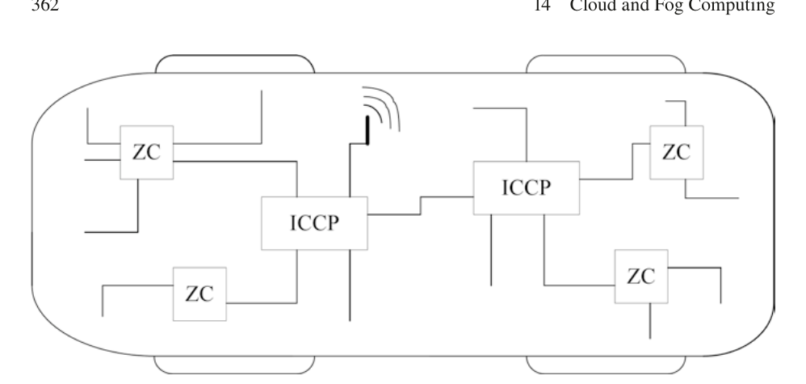

图 14.3 具有四个区域控制器（ZC）的车载计算平台（ICCP）

**软可编程逻辑控制器（Soft PLC）**

复杂的分布式计算机系统高度自动化了现代商品生产。传统上，这些分布式计算机系统组织在所谓的自动化金字塔（automation pyramid）中，该金字塔区分不同层次（参见 [Kah79] 和 Purdue 参考模型 [Wil90]）。在较低层次，金字塔放置了物理过程、传感器和执行器以及过程控制。生产规划和供应链管理任务分配在金字塔的较高层次。在工业 4.0 的背景下，自动化金字塔的严格层次被放宽了。雾计算是实现这一目标的手段。

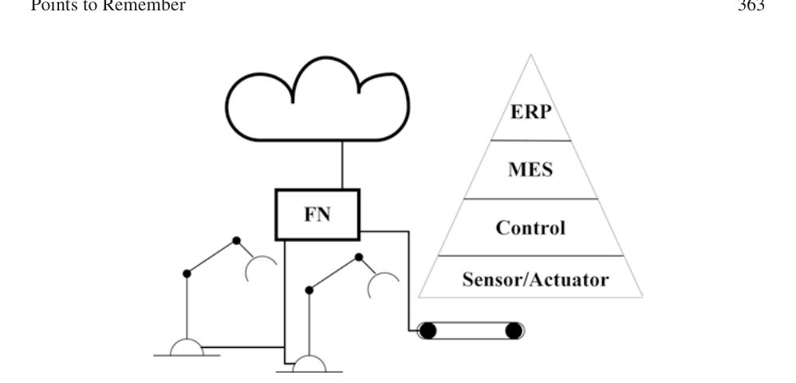

图 14.4 描绘了一个示例雾计算架构，其中一个雾节点（FN）控制两个工业机器人和一条传送带。


图 14.4 工业自动化中的雾计算架构及与自动化金字塔的比较，层次根据 Purdue 参考模型 [Wil90]：传感器/执行器、过程控制、制造执行系统（MES）和企业资源规划（ERP）

传统工业自动化系统在专用硬件中实现过程控制，称为可编程逻辑控制器（PLC）。如图 14.3 所示，当雾节点配备适当的实时硬件时，PLC 功能也可以迁移到雾节点。确实，PLC 功能已经迁移到工业 PC 并以软件形式运行。当 PLC 软件在更通用的硬件平台上执行时，我们称之为软 PLC（Soft PLC）。雾节点处于理想位置，可以接管多个软 PLC 的执行。

---

### 14.5.3 Nerve

Nerve [TTT21] 是一个用于工业雾计算的软件平台。它由位于云层的 Nerve 管理系统（Nerve Management System）和运行在雾层的 Nerve 节点（Nerve Node）组成。Nerve 节点软件的实现使设备能够作为雾节点（Nerve 也称为边缘设备 edge device）运行。下表总结了 Nerve 节点的雾节点特征（表 14.2）。

表 14.2 Nerve 节点提供的雾节点特征

    | 特征 | Nerve 节点实现 |
| --- | --- |
| 资源池化 | Nerve 节点实现 hypervisor（Xen 或 ACRN）以执行多个 VM，并实现 Docker 引擎以执行容器。周期时间低至 1 ms 的实时任务可以通过 CODESYS 实现（必须使用适当的 CPU） |
| 连接性 | Nerve 节点通过 MQTT 和标准互联网协议在北向接口连接到 Nerve 管理系统。南向接口取决于设备选择。典型接口是 IEEE 802.1 TSN、Profinet 和 EtherCAT |
| 配置 | VM 和容器可以在 Nerve 节点中动态添加和移除。嵌入式层的重配置取决于具体的南向接口。例如，对于 IEEE 802.1 TSN，Nerve 节点可以实现中央网络配置 |

Nerve 的用例例如：状态监测（condition monitoring）、远程访问机器、用于远程机器学习的数据采集，或数字孪生的实现。

---

### 本章要点

- 云世界与实时系统世界有着根本的不同。

- 云世界针对平均情况处理及时性，以可用性作为最高可依赖性属性，旨在为消费者提供无限资源的幻觉。

- 云计算由五个基本特征定义：资源池化、广泛的网络访问、按需自助服务、快速弹性和计量服务。

- 云计算支持软实时服务，但不适合硬实时系统，因为它无法提供最坏情况的及时性保证。

- 雾计算是一种区分云层、雾层和嵌入式层的架构风格。

---

- 雾节点实现雾层，解除云世界和实时系统世界之间的耦合。

- 雾节点具有三个基本特征：资源池化、北向和南向连接性，以及配置（雾层和嵌入式层）。

- 资源池化可以通过虚拟化实现。时间触发虚拟机（TTVM）确保虚拟化环境中的及时性。

- 云计算中广泛部署的其他资源池化方法，如容器和无服务器计算，也有一定的潜力对雾计算变得相关。

- 北向连接性实现典型的互联网协议，而南向连接性实现实时通信（见第 7 章）。

- 系统设计自动化是处理系统配置复杂性的关键，它区分较低级和较高级配置，其中工具自动化较低级配置，人工负责较高级配置。较低级和较高级之间的边界在持续上升，因此越来越多的配置任务变得自动化。

- 云用例如：分布式数据采集、大数据处理、数字孪生和软件工程支持。

- 雾用例如：汽车领域架构、车载计算平台（ICCP）和工业自动化中的软可编程逻辑控制器（软 PLC）。

- Nerve 是一个用于工业用例的软件平台。它由用于云层的 Nerve 管理系统和使硬件设备能够作为雾节点运行的 Nerve 节点组成。

---

## 参考文献

Barroso 等人 [Bar18] 将用于云计算的数据中心称为仓级计算机（WSC——Warehouse-Scale Computers）。这些 WSC 通常由数万到数十万台服务器组成，通常聚集成机架，其中每个机架通过具有 40 Gbps 或 100 Gbps 链路的本地以太网交换机将服务器互连，进一步网络将机架彼此互连。服务器通常是标准 CPU，但最近越来越多的专用计算加速器也被引入 WSC [Bar18, p. 56]。这些加速器例如 GPU 或神经网络加速器。关于 WSC 的进一步详细讨论，包括能源、冷却和成本方面，可在 [Bar18] 和 Hennessy 与 Patterson [Hen19, 第 6 章] 中找到。

云应用程序通常使用基于服务和交互的软件架构。Dragoni 等人 [Dra17] 讨论了这种软件架构风格从面向对象设计模式到面向服务计算（SOC）和面向服务架构（SOA）以及到最近的微服务架构风格的演变。

云提供商还提供可扩展的消息服务，如可扩展消息队列，作为云服务之间的中间缓冲区运行。消息队列和发布-订阅通信是成熟的技术。Eugster 等人 [Eug03] 对它们进行了回顾和讨论，他们还建立了关于发布-订阅和早期消息技术的共同观点。然而，云计算将这些技术扩展到了前所未有的水平。在他们的网络研讨会中，Wojciak 和 Bray 概述了 AWS 提供的消息服务 [Woj17]。

用于工业自动化的雾计算已由欧洲项目 FORA（Fog Computing for Robotics and Industrial Automation）研究 [Pop18, Pop21]。

---

## 复习题与思考题

- 云世界与实时系统世界之间的主要区别特征是什么？

- 为什么硬实时系统不能在云世界中实现？

- 什么是服务等级协议（SLA）？

- 雾层的三个特征是什么？

- 雾计算有哪些收益和风险？

- 什么是 hypervisor？虚拟化系统中的多级调度问题是什么？

- 雾架构中北向和南向通信系统的主要差异是什么？

- 什么是系统设计自动化？

- 给出实时系统中云和雾计算的示例用例！

- 什么是数字孪生？

---

---

