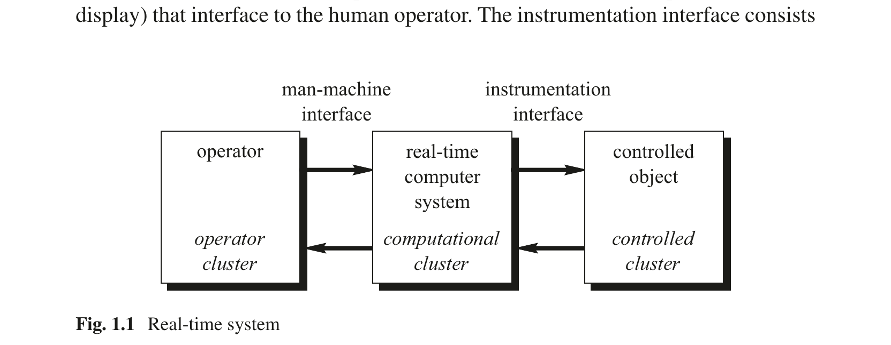
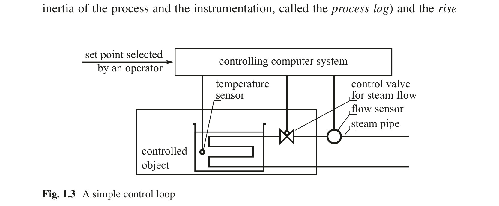
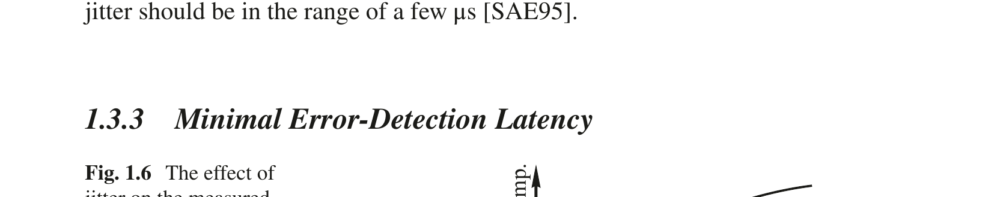
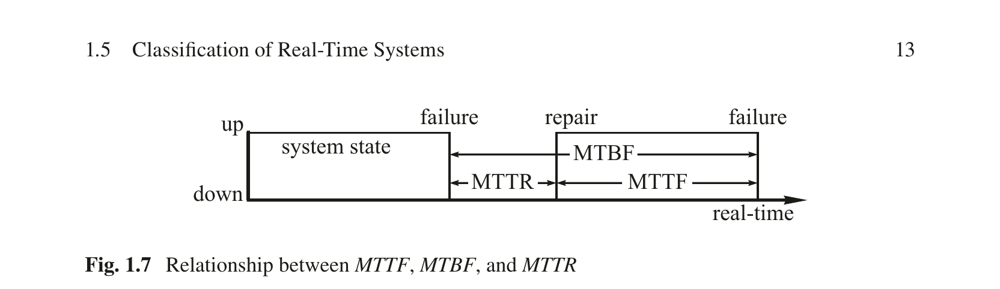
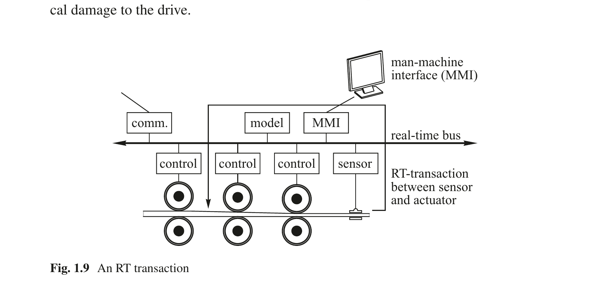

# 第1章 实时系统环境

Real-Time Systems — Hermann Kopetz & Wilfried Steiner 著 | AI 辅助翻译

---

## 本章概述

本章作为引言，旨在从多个不同的视角描述实时计算机系统的环境。扎实理解界定实时应用的技术和经济因素，有助于理解系统设计师必须应对的种种需求。本章从实时系统的定义开始，讨论其功能性需求和非功能性需求。特别强调从控制应用那些已被充分理解的特性中推导出的时间需求。控制算法的目标在于驱动一个过程，使其满足某个性能准则。环境中发生的随机扰动会降低系统性能，控制算法必须予以考虑。控制系统本身引入控制环路的任何额外不确定性——例如控制环路产生不可预测的抖动——都会导致控制质量下降。

在第 1.2、1.3、1.4 和 1.5 节中，我们从多个视角对实时应用进行了分类。特别强调了硬实时系统与软实时系统之间的本质区别。由于软实时系统不存在严重的失效模式，其设计通常采用不那么严格的方法。有时，出于经济上的考量，人们会接受一种资源不足的解决方案，它无法处理极少发生的峰值负载场景。而在硬实时应用中，这种做法是不可接受的——因为在所有规定的情形下（即使极为罕见），设计的安全性必须向认证机构提供证明。在第 1.6 节中，我们对实时系统市场进行了简要分析，重点关注嵌入式实时系统领域。嵌入式实时系统是自包含产品的一部分，例如一台电视机或一辆汽车。嵌入式实时系统——也称为信息物理系统（CPS）——构成了实时技术和整个计算机行业最重要的市场细分。

---

## 1.1 何时一个计算机系统是"实时"的？

实时计算机系统是这样一种计算机系统：其系统行为的正确性不仅取决于计算的逻辑结果，还取决于产生这些结果的物理时间。所谓系统行为，是指系统输出在时间上的序列。

我们将时间的流动建模为一条从过去延伸至未来的有向时间线。时间线上的一个切点称为一个**时刻**（instant）。任何发生在某一时刻的理想化发生称为一个**事件**（event）。描述一个事件的信息（另见第 5.2.4 节关于事件观测的内容）称为**事件信息**（event information）。当前的时间点——**现在**（now）——是一个非常特殊的事件，它将过去与未来分离开来（此处呈现的时间模型基于牛顿物理学，忽略了相对论效应）。时间线上的一个区间，由两个事件定义——起始事件和终止事件——称为一个**持续时长**（duration）。一个数字时钟将时间线分割为一系列等长的持续时长，称为该时钟的**颗粒**（granules），这些颗粒由特殊的周期性事件——时钟的**滴答**（ticks）——来界定。

实时计算机系统始终是一个更大系统的一部分——这个更大的系统称为实时系统或信息物理系统。实时系统会随物理时间的变化而变化，例如，即使在控制它的计算机系统停止后，一个化学反应仍然会继续改变其状态。将一个实时系统分解为一组自包含的子系统（称为集群）是合理的。图 1.1 中给出了集群的示例：需要被控制的物理装置或机器（受控集群）、实时计算机系统（计算集群）以及人类操作员（操作员集群）。我们将受控集群和操作员集群统称为计算集群（实时计算机系统）的**环境**。

如果实时计算机系统是分布式的（大多数都是如此），则它由一组通过实时通信网络互连的（计算机）节点组成。人类操作员与实时计算机系统之间的接口称为人机接口，受控对象与实时计算机系统之间的接口称为仪器接口。人机接口由与操作员交互的输入设备（如键盘）和输出设备（如显示器）组成。仪器接口由传感器和执行器组成，它们将受控集群中的物理信号（如电压、电流）转换为数字形式，反之亦然。

图 1.1 实时系统

（cluster = 集群, operator = 操作员, real-time computer system = 实时计算机系统, controlled object = 受控对象, man-machine interface = 人机接口, instrumentation interface = 仪器接口）

---

实时计算机系统必须在其环境（受控集群或操作员集群）所决定的时间区间内对环境中的激励做出反应。结果必须被产生出来的时刻称为**截止时间**（deadline）。如果一个结果在截止时间过后仍有效用，该截止时间被归类为**软**截止时间（soft）；否则为**确定**截止时间（firm）。如果错过一个确定截止时间可能导致严重的后果，则该截止时间称为**硬**截止时间（hard）。

**示例：**考虑铁路道口前道路上的一盏交通信号灯。如果该交通信号灯在火车到达前没有变为红色，就可能导致事故。

一个必须满足至少一个硬截止时间的实时计算机系统称为硬实时计算机系统或安全关键实时计算机系统。如果不存在硬截止时间，则该系统称为软实时计算机系统。

硬实时系统的设计与软实时系统的设计有着本质上的不同。硬实时计算机系统必须在所有指定的负载和故障条件下维持有保证的时间行为，而软实时计算机系统偶尔错过截止时间是可以容许的。软、硬实时系统之间的区别将在后续各节中详细讨论。本书的重点是硬实时系统的设计。

## 1.2 功能性需求

实时系统的功能性需求涉及实时计算机系统必须执行的功能。它们被分为数据采集需求、直接数字控制需求和人机交互需求。

---

### 1.2.1 数据采集

一个受控对象——例如一辆汽车或一个工业装置——会随时间而改变其状态（本书中，凡不加限定地使用"时间"一词，均指第 3.1 节所描述的物理时间）。如果我们冻结时间，就可以通过记录该时刻状态变量的值来描述受控对象的当前状态。以汽车这一受控对象为例，其可能的状态变量包括：汽车的位置、速度、仪表板上开关的位置，以及气缸中活塞的位置。通常，我们并不关心所有状态变量，而只关心其中对我们有意义的子集。一个有意义的状体变量称为一个**实时（RT）实体**（real-time entity）。

每个 RT 实体都处于某个子系统的**控制域**（SOC，Sphere of Control）内，也就是说，它属于一个有权修改该 RT 实体值的子系统（另见第 5.1.1 节）。在其控制域之外，一个 RT 实体的值可以被观测，但其语义内容（见第 2.2.4 节）不能被修改。例如，发动机气缸中活塞的当前位置处于发动机的控制域内。在汽车发动机之外，活塞的当前位置只能被观测，但我们无权修改此观测的语义内容（语义内容的表示是可以改变的）。

实时计算机系统的第一个功能性需求是观测受控集群中的 RT 实体并收集这些观测结果。对一个 RT 实体的观测在计算机系统中由一个**实时（RT）镜像**（real-time image）来表示。由于受控对象在受控集群中的状态是实时的函数，一个给定的 RT 镜像只在有限的时间区间内保持时间准确性。该时间区间的长度取决于受控对象的动态特性。如果受控对象的状态变化非常快，对应的 RT 镜像就只有一个非常短的准确性区间。

**示例：**考虑图 1.2 中的例子，一辆汽车进入一个由交通信号灯控制的交叉路口。"交通信号灯为绿色"这一观测在时间上是多长有效的？如果"交通信号灯为绿色"这一信息在其准确性区间之外被使用——例如一辆汽车在交通信号灯已变为红色后才进入交叉路口——就可能发生事故。在此例中，准确性区间的上界由交通信号灯黄灯阶段的持续时间给出。只有当观测在汽车驶过交叉路口的整个期间始终保持时间准确时，汽车才能安全进入。

图 1.2 交通信号灯信息的时间准确性

（"the traffic light is green" = 交通信号灯为绿色; "how long is the observation temporally accurate?" = 此观测在多长时间内保持时间准确性？）

---

所有保持时间准确性的受控集群实时镜像的集合称为**实时数据库**（real-time database）。每当一个 RT 实体改变其值时，实时数据库都必须被更新。这些更新可以周期性进行——由实时时钟以固定周期推进触发（时间触发（TT）观测），也可以在状态变化（即一个事件发生）立即之后进行（事件触发（ET）观测）。关于时间触发和事件触发观测的更详细分析将在第 4 章和第 5 章中给出。

**信号调理** 一个物理传感器——例如热电偶——产生原始数据元素（例如电压）。通常，会采集一系列原始数据元素并应用平均算法以减小测量误差。下一步，必须对原始数据进行校准和转换为标准测量单位。**信号调理**（signal conditioning）一词用于指代从原始传感器数据中获得有意义的 RT 实体测量数据所需的所有处理步骤。信号调理之后，必须检查测量数据的合理性，并将其与其他测量数据关联起来，以检测传感器可能的故障。被判断为相应 RT 实体之正确 RT 镜像的数据元素称为一个**共识数据元素**（agreed data element）。

**报警监控** 实时计算机系统的一个重要功能是持续监控 RT 实体，以检测异常的过程行为。

**示例：**化工厂中的管道破裂——一个**主事件**（primary event）——将导致许多 RT 实体（各种压力、温度、液位）偏离其正常工作范围并越过某些预设的报警限值，从而产生一组关联的报警，称为**报警风暴**（alarm shower）。

实时计算机系统必须检测并显示这些报警，并且必须帮助操作员识别引发这些报警的初始原因——主事件。为此，必须将观测到的报警记录在一个特殊的报警日志中，并记录报警发生的精确时刻。报警的精确时间顺序有助于识别**次生报警**（secondary alarms），即所有可能成为主事件因果衍生结果的报警。在复杂的工业装置中，采用复杂的基于知识的系统来帮助操作员进行报警分析。

**示例：**在 2003 年 8 月 14 日美国和加拿大大停电的最终报告中，[Tas03, p. 162] 中有这样的陈述："8 月 14 日大停电的一个宝贵教训是拥有时间同步的系统数据记录器的重要性。调查组的工作人员埋头研究了数千个数据项以确定事件的顺序，就像拼凑一个巨大拼图的一个个小块。如果当时更广泛地使用了同步数据记录设备，这一过程本可以显著加快、大大简化。"

一种很少发生、但一旦发生就极受关注的情形称为**罕见事件情景**（rare-event situation）。验证实时计算机系统在罕见事件情景下的性能是一个具有挑战性的任务，需要物理环境的模型（见第 12.2.2 节）。

**示例：**核电站监控和停堆系统的唯一目的就是在峰值负载报警情景（即罕见事件）下提供可靠的性能。希望这一罕见事件在核电站的整个运行寿命中永远不会发生。

---

### 1.2.2 直接数字控制

许多实时计算机系统必须为执行器计算执行变量，以便直接控制受控对象——即没有任何底层传统控制系统的**直接数字控制**（DDC，Direct Digital Control）。

控制应用具有高度的规律性，由（无限）序列的控制周期组成，每个周期以对 RT 实体的采样（观测）开始，接着执行控制算法以计算出新的执行变量，随即将执行变量输出到执行器。设计一个既能实现期望的控制目标、又能补偿扰动受控对象的随机干扰的合适控制算法，是控制工程领域的课题。在下一节关于时间需求的内容中，将介绍控制工程的一些基本概念。

### 1.2.3 人机交互

实时计算机系统必须将受控对象的当前状态告知操作员，并且必须协助操作员控制机器或装置对象。这是通过人机接口实现的——一个极为重要的关键子系统。安全关键实时系统中的许多严重计算机相关事故都可以追溯到人机接口处出现的错误 [Lev95]。

**示例：**飞机人机接口处的模式混淆已被认定是重大空难的原因之一 [Deg95]。

大多数过程控制应用在人机接口部分都包含一个广泛的数据记录和数据报告子系统，该子系统根据特定行业的需求设计。

**示例：**在某些国家，制药行业被法律要求记录并存档每一生产批次的所有相关过程参数，以便在产品在市场上被发现有缺陷时，能于日后重新审查生产运行当时的过程条件。

人机交互已成为基于计算机的系统设计中如此重要的课题，以至于出现了许多涉及该主题的课程。在本书的语境中，我们将在第 4.5.2 节介绍一个抽象的人机接口，但不会详细讨论其设计。感兴趣的读者可参阅有关用户界面设计的标准教材。

---

## 1.3 时间需求

### 1.3.1 时间需求从何而来？

实时系统最严格的时间需求来源于控制环路的各项要求，例如控制一个快速过程（如汽车发动机）的需求。相比之下，人机接口处的时间需求不那么严格，因为人类的感知延迟（约在 50–100 ms 范围内）比快速控制环路的延迟需求高出数个数量级。

**一个简单的控制环路** 考虑图 1.3 中所示的简单控制环路，它由一个装有液体的容器、一个连接到蒸汽管道的热交换器以及一个控制计算机系统组成。该计算机系统的目标是控制一个阀门（控制变量），该阀门决定流经热交换器的蒸汽流量，从而使容器中液体的温度保持在操作员所选设定点附近的一个小范围内。

以下讨论的重点是该简单控制环路的时间特性，它由一个受控对象和一个控制计算机系统组成。

**受控对象** 假设图 1.4 中的系统处于平衡状态。每当蒸汽流量以阶跃函数增加时，容器中液体的温度将按照图 1.4 所示变化，直至达到新的平衡。该温度在容器中的响应函数取决于环境条件，例如容器中液体的量、以及流经热交换器的蒸汽流量，即取决于受控对象的动态特性。（在接下来的章节中，我们将用 d 表示持续时长，用 t 表示时刻，即时间上的一个点。）

有两个重要的时间参数表征了这一基本的阶跃响应函数：**对象延迟** dobject（有时称为滞后时间或纯滞后）——在此之后被测量变量温度才开始上升（由过程的初始惯性和仪器仪表引起，称为过程滞后），以及温度达到新平衡状态之前的**上升时间** drise。

图 1.3 一个简单的控制环路

（set point selected by an operator = 操作员选择的设定点; controlling computer system = 控制计算机系统; temperature sensor = 温度传感器; control valve for steam flow = 蒸汽流量控制阀; steam pipe = 蒸汽管道; controlled object = 受控对象; flow sensor = 流量传感器）

---

图 1.4 阶跃响应的延迟和上升时间

（temperature of liquid = 液体温度; steam flow = 蒸汽流量; on/off = 开/关; real-time = 实时）

为了从一个给定的实验记录的阶跃响应函数形状中确定对象延迟 dobject 和上升时间 drise，需要找到响应函数达到两个稳态平衡值之间差的 10% 和 90% 所对应的两个时间点。用一条直线连接这两个点（图 1.4）。表征阶跃响应函数的对象延迟 dobject 和上升时间 drise 的重要时间点通过找出该直线与两条水平线的交点来构造，这两条水平线分别表示施加阶跃函数前后的稳定平衡状态所对应的液体温度。

**控制计算机系统** 控制计算机系统必须周期性地对容器温度进行采样，以检测被控制变量温度在期望值与实际值之间的任何偏差。两个采样点之间的恒定持续时间称为**采样周期** dsample，而其倒数 1/dsample 即为**采样频率** fsample。一个经验法则是：在期望表现出准连续系统行为的数字系统中，采样周期应小于受控对象阶跃响应函数上升时间 drise 的十分之一，即 dsample < (drise/10)。计算机将被测温度与操作员选择的温度设定点进行比较，计算出误差项。该误差项构成控制算法计算控制变量新值的基础。在给定每次采样点之后的一个时间区间——称为**计算机延迟** dcomputer——内，控制计算机将输出该执行变量的新值至控制阀，从而闭合控制环路。延迟 dcomputer 应当小于采样周期 dsample。计算机延迟的最大值与最小值之间的差称为计算机延迟的**抖动** ∆dcomputer。该抖动是控制质量的一个敏感参数。

控制环路的**死区时间**（dead time）是指从观测 RT 实体到受控对象因基于该观测的计算机动作而开始做出反应之间的时间区间。死区时间是受控对象延迟 dobject 与计算机延迟 dcomputer 之和 ——前者处于受控对象的控制域内，因而由受控对象的动态特性决定；后者则由计算机实现决定。为了减少控制环路的死区时间并改善控制环路的稳定性，这些延迟应当尽可能小。

---

计算机延迟 dcomputer 由采样点——即对受控对象的观测——到该信息被使用（见图 1.5），即相应的执行器信号（执行变量）被输出到受控对象之间的时间区间来定义。除了进行计算所需的必要时间外，计算机延迟还取决于通信所需的时间以及执行器的反应时间。

图 1.5 延迟与延迟抖动

（observation of the controlled object = 观测受控对象; delay dcomputer = 延迟 dcomputer; output to the actuator = 输出至执行器; variability of the delay = 延迟的可变性; delay jitter: ∆d = 延迟抖动: ∆d; real-time = 实时）

**控制环路的参数** 表 1.1 总结了表征图 1.3 所示基本控制环路的各项时间参数。前两列给出了参数的符号和名称。第三列说明了参数所处的控制域，即哪个子系统决定了该参数的值。最后，第四列指示了这些时间参数之间的关系。

表 1.1 基本控制环路的参数

  | 符号 | 参数 | 控制域 | 关系 |  |  |  |  |
| --- | --- | --- | --- | --- | --- | --- | --- |
| d | object | 受控对象延迟 | 受控对象 | 物理过程 |  |  |  |
| d | rise | 阶跃响应上升时间 | 受控对象 | 物理过程 |  |  |  |
| d | sample | 采样周期 | 计算机 | d | sample | << d | rise |
| d | computer | 计算机延迟 | 计算机 | d | computer | < d | sample |
| ∆d | computer | 计算机延迟的抖动 | 计算机 | ∆d | computer | << d | computer |
| d | deadtime | 死区时间 | 计算机与受控对象 | d | computer | + d | object |

### 1.3.2 最小延迟抖动

控制应用中的数据项是基于状态的，即它们包含的是 RT 实体的镜像。控制应用中的计算动作大多是时间触发的，例如获取采样值的控制信号来源于计算机系统内时间的推进。该控制信号因此处于计算机系统的控制域内。可以预先知道下一次控制动作必须在什么时候发生。许多控制算法基于这样的假设：延迟抖动 ∆dcomputer 相比于延迟 dcomputer 非常小，即延迟接近恒定。之所以做出这一假设，是因为控制算法可以被设计为只能补偿已知的恒定延迟。延迟抖动向控制环路中引入了额外的不确定性，对控制质量产生不利影响。

---

抖动 ∆d 可以看作是关于 RT 实体被观测时刻的不确定性。如图 1.6 所示，这种抖动可以被解释为导致被测量变量温度 T 产生一个附加值误差 ∆T。因此，延迟抖动应始终只是延迟的一个很小比例，即如果要求延迟为 1 ms，则延迟抖动应在几 μs 的范围内 [SAE95]。

图 1.6 抖动对被测量变量 T 的影响

（additional measurement error ∆T = 附加测量误差 ∆T; jitter ∆d = 抖动 ∆d; real-time = 实时）

### 1.3.3 最小错误检测延迟

硬实时应用，顾名思义，是安全关键的。因此，控制系统中出现的任何错误——例如一条消息的丢失或损坏、或一个节点的故障——都必须在极短时间内以极高概率被检测到。所需的最小错误检测延迟必须与控制环路中最快的临界控制环路的采样周期处于同一数量级。这样才能在错误的后果造成任何严重系统失效之前，执行某种纠正动作或将系统带入安全状态。几近无抖动的系统将比允许抖动的系统具有更短的有保证的错误检测延迟。

## 1.4 可信赖性需求

可信赖性（dependability）的概念涵盖了计算机系统中与服务交付质量相关的非功能性属性——即系统在一个较长的时间区间内向其用户（用户可以是人，也可以是另一个技术系统）提供服务的质量。以下可信赖性属性的度量指标是重要的 [Avi04]。

### 1.4.1 可靠性

系统的**可靠性** R(t) 是指在给定系统在初始时刻（即 t = t₀）处于正常运行状态的前提下，系统到时间 t 时仍然提供规定服务的概率。系统在给定时间区间内发生失效的概率用**故障率**（failure rate）表示，以 FIT（Failure In Time，时基故障）为单位度量。1 FIT 的故障率意味着一个器件的平均失效前时间（MTTF）为 10⁹ 小时，即大约每 115,000 年发生一次失效。

---

如果一个系统具有恒定的故障率 λ（失效次数/小时），则在时间 t 的可靠性由以下公式给出：

R(t) = exp(−λ(t − t₀))

其中 t − t₀ 以小时为单位。故障率的倒数 1/λ = MTTF 称为平均失效前时间（Mean Time To Failure，MTTF）（以小时为单位）。如果系统故障率要求达到 10⁻⁹ 失效次数/小时或更低的数量级，则我们称该系统具有**超高可靠性需求**。

### 1.4.2 安全性

**安全性**（safety）是关于关键失效模式的可靠性。一个关键失效模式被说是**恶劣的**（malign），与良性（benign）的非关键失效相对。在恶劣失效模式中，一次失效的代价可能比系统正常运行期间的效用高出数量级。恶劣失效的示例包括：因飞控系统失效导致的飞机坠毁，以及因汽车中计算机控制智能制动器故障导致的汽车事故。安全关键（硬）实时系统在关键失效模式方面的故障率必须满足超高可靠性需求。

**示例：**以汽车中的计算机控制制动器为例。计算机导致的制动器关键失效的故障率必须低于传统制动系统的故障率。假设一辆汽车平均每天运行约 1 小时，那么每一百万辆车每年发生一次安全关键失效就相当于大约 10⁻⁹ 失效次数/小时的故障率。

类似地，在飞控系统、铁路信号系统和核电站监控系统中也需要同等低的故障率。

**认证** 在许多情况下，安全关键实时系统的设计必须获得独立认证机构的批准。如果能让认证机构确信以下几点，认证过程便可以简化：

(i) 对系统安全运行起关键作用的子系统受到**故障隔离**（fault-containment）机制的保护，该机制消除了系统其余部分向这些安全关键子系统传播错误的可能性。

(ii) 从设计的角度看，在给定的负载和故障假设所涵盖的所有场景下，系统都能够按照规范处理，无需引用概率论据。这要求设计必须是**资源充足的**（resource-adequate）。

(iii) 架构支持**构造式模块化认证**过程，其中各子系统的认证可以彼此独立进行。在系统层面，只需对涌现属性进行验证。

---

[Joh92] 规定了一个为验证而设计的系统所需具备的属性：

(i) 可以构建一个完整且准确的可靠性模型。该模型中所有无法通过分析推导的参数，必须能够在可实施的时间内通过测试进行测量。

(ii) 可靠性模型不包含表示设计故障的状态转移；必须通过分析论证表明设计故障不会导致系统失效。

(iii) 设计权衡应偏向于那些将需要测量的参数数量最小化的设计。

### 1.4.3 可维护性

**可维护性**（maintainability）是对发生良性失效后修复系统所需时间区间的一种度量。可维护性由概率 M(d) 衡量，即在失效发生后 d 时间区间内系统得到恢复的概率。与可靠性的形式化描述一致，引入恒定的修复率 μ（修复次数/小时）和平均修复时间（MTTR）来定义可维护性的量化指标。

可靠性与可维护性之间存在着根本性的冲突。可维护的设计要求将系统划分为一组现场可替换单元（FRU），这些单元通过可维护接口（serviceable interface）连接，可以在发生失效时方便地断开和重新连接以替换有故障的 FRU。一个可维护接口——例如插拔式连接——的物理故障率明显高于不可维护接口。此外，可维护接口的生产成本也更高。

在环境智能领域，由未经培训的最终用户进行自动诊断和维护是产品在市场成功中至关重要的系统属性。

### 1.4.4 可用性

**可用性**（availability）是关于正确服务与不正确服务交替情况下正确服务交付的一种度量。它以系统准备就绪以提供正确服务的时间占总时间的比例来衡量。

**示例：**只要用户拿起电话听筒，电话交换系统就应当以非常高的概率准备好提供电话服务。一个电话交换局每年只能有几分钟时间脱离服务。

---

在具有恒定故障率和修复率的系统中，可靠性（MTTF）、可维护性（MTTR）和可用性（A）之间存在以下关系：

A = MTTF / (MTTF + MTTR)

MTTF + MTTR 之和有时被称为**平均失效间隔时间**（MTBF，Mean Time Between Failures）。图 1.7 展示了 MTTF、MTTR 和 MTBF 之间的关系。高可用性可以通过长的 MTTF 或短的 MTTR 来实现。因此，设计师在选择构建高可用性系统的方法上有一定的自由度。

图 1.7 MTTF、MTBF 和 MTTR 之间的关系

（system state = 系统状态; up = 正常; down = 故障; failure = 失效; repair = 修复; MTTF/MTTR/MTBF = 原文不变; real-time = 实时）

### 1.4.5 安全性（Security）

一个可信赖的系统也必须是安全的。安全性（security）涉及信息的真实性和完整性，以及系统阻止未经授权访问信息或服务的能力（另见第 6.2 节）。定义一个量化的安全度量存在困难，例如指定一个"标准盗贼"需要多少时间才能侵入系统。传统上，安全问题与大型数据库联系在一起，其所关注的是信息的机密性、隐私性和真实性。在过去几年中，安全问题在实时系统中也变得越来越重要，例如一种加密防盗系统——如果用户不能提供指定的访问码，就锁定汽车的点火开关。在物联网（IoT）中，互联网的终端是连接信息世界与物理世界的嵌入式系统，安全问题就具有了至关重要的意义，因为入侵者不仅能够破坏计算机中的数据结构，还能对物理环境造成危害。

## 1.5 实时系统的分类

在本节中，我们从不同的视角对实时系统进行分类。前两个分类——硬实时与软实时（在线）以及故障安全与故障可工作——取决于应用的特征，即取决于计算机系统之外的因素。后三个分类——有保证的及时性 vs 尽力而为、资源充足 vs 资源不足、以及事件触发 vs 时间触发——取决于计算机应用的设计与实现，即取决于计算机系统内部的因素。

---

### 1.5.1 硬实时系统与软实时系统

硬实时系统（必须始终在正确时刻产生结果）的设计与软实时系统或在线系统（如事务处理系统）的设计有着根本上的不同。在本节中，我们将详细阐述这些差异。表 1.2 比较了硬实时系统与软实时系统的特征。

表 1.2 硬实时系统与软实时系统的比较

  | 特征 | 硬实时 | 软实时（在线） |
| --- | --- | --- |
| 响应时间 | 强制性要求 | 期望性要求 |
| 峰值负载性能 | 可预测 | 降级 |
| 节奏控制 | 环境 | 计算机 |
| 安全性（Safety） | 通常为关键 | 非关键 |
| 数据文件大小 | 小/中等 | 大 |
| 冗余类型 | 主动 | 检查点-恢复 |
| 数据完整性 | 短期 | 长期 |
| 错误检测 | 自主 | 用户辅助 |

**响应时间** 硬实时应用苛刻的响应时间需求——通常在毫秒量级甚至更小——排除了正常运行期间或紧急情况下直接人为干预的可能。一个硬实时系统必须具备高度的自主性，以维持过程的安全运行。相比之下，软实时系统和在线系统的响应时间需求通常在秒的量级。此外，在软实时系统中，即使错过了截止时间，也不会导致灾难性后果。

**峰值负载性能** 在硬实时系统中，峰值负载场景必须被明确定义。必须通过设计保证计算机系统在所有情况下满足指定的截止时间，因为许多硬实时应用的效用取决于其在导致峰值负载的罕见事件场景下可预测的性能。这与软实时系统的情况形成了对比：在软实时系统中，平均性能才是重要的，而出于经济考量，在极少发生的峰值负载情况下运行降级是可以容忍的。

**节奏控制** 硬实时计算机系统的运行节奏通常由环境中的状态变化所设定。它必须在所有情况下跟上环境（受控对象和人类操作员）的状态。这与在线系统不同，在线系统在无法处理所提交的负载时可以一定程度上控制环境。

**示例：**以一个事务处理系统（如航空订票系统）为例。如果计算机无法跟上用户的需求，它只需延长响应时间，从而迫使用户放慢速度。

---

**安全性（Safety）** 许多实时应用的安全关键性对系统设计师有一系列影响。特别是，错误检测与恢复必须是自主的，以便系统能够在无需人为干预的情况下，在应用所要求的时间区间内启动适当的恢复动作并达到安全状态。

**数据文件大小** 由 RT 实体时间准确的镜像组成的实时数据库通常规模较小。硬实时系统的关键关切是实时数据库短期的时间准确性——该准确性会因时间的流动而失效。相比之下，在线事务处理系统的关键问题则是维护大型数据文件的长期完整性和可用性。在硬实时应用中也可能存在大型数据文件，例如自动驾驶汽车中的实时摄像头数据。然而，这些大型文件通常仅在计算过程中作为状态存在，而计算过程会将其收缩为小规模的 RT 实体的 RT 镜像（关于 RT 镜像见第 5.3 节，关于状态扩展和收缩见第 4.2.2 节）。例如，尽管自动驾驶汽车的摄像头产生大型数据文件，但由此产生的关于周围物体位置、速度和方向的信息只是小规模的。

**冗余类型** 在线系统中检测到错误后，计算将被回滚到一个先前建立的检查点以启动恢复操作。在硬实时系统中，回滚/恢复的效用有限，原因如下：

(i) 由于回滚/恢复操作可能花费不可预测的时间量，在错误发生后保证满足截止时间是困难的。

(ii) 一个行为可能是不可撤销的，因为它对环境的影响无法被撤销。

(iii) 由于检查点时间与"现在"时刻之间存在时间差，检查点数据的时间准确性可能已经失效。

实时数据时间准确性的主题将在第 5.4 节中详细讨论，而错误检测和冗余类型的问题将在第 6 章中讨论。

### 1.5.2 故障安全与故障可工作

在许多硬实时系统中，可以识别出一个或多个安全状态，这些状态可以在系统发生失效时到达。如果这样一个安全状态可以被识别并在发生失效时快速到达，则我们称该系统为**故障安全**（fail-safe）系统。故障安全性是受控对象的特性，而非计算机系统的特性。在故障安全应用中，计算机系统必须具有很高的**错误检测覆盖率**（error-detection coverage），即发生错误后被检测出的概率必须接近 1。

---

**示例：**如果在铁路信号系统中检测到故障，可以将所有信号设为红色，从而停下所有列车，将系统带入安全状态。

在许多实时计算机系统中，会提供一个特殊的外部设备——**看门狗**（watchdog）——来监控计算机系统的运行。计算机系统必须向看门狗发送周期性的**生命信号**（life sign，例如一个预定形式的数字输出）。如果该生命信号未能在指定时间区间内到达看门狗，看门狗就认为计算机系统已经失效，并强制将受控对象带入安全状态。在这样的系统中，及时性仅用于实现高可用性，而并非维持安全所必需——因为在时序违规的情况下，看门狗会将受控对象强制带入安全状态。

然而，也存在一些无法识别可以快速到达的安全状态的应用，例如飞机上的飞控系统。在此类应用中，即使在发生失效的情况下，计算机系统仍然必须保持可工作状态并提供最低水平的服务，以避免灾难。这就是这些应用被称为**故障可工作**（fail-operational）的原因。

### 1.5.3 有保证的响应与尽力而为

如果我们从一个指定的故障和负载假设出发，提供一个使得可以在不借助概率论据的情况下论证设计充分性的设计方案（即使在峰值负载和故障场景下也是如此），那么我们就可以说是一个具有**有保证响应**（guaranteed response）的系统。一个具有有保证响应的完美系统的失效概率被降低为关于峰值负载、故障数量和类型的假设在现实中不成立的几率。这个概率被称为**假设覆盖率**（assumption coverage）[Pow95]。有保证响应系统需要在设计阶段进行仔细的规划和广泛的分析。

如果无法给出这样的分析性响应保证，我们称其为**尽力而为**（best-effort）设计。尽力而为系统并不需要对负载和故障假设进行严格的规定。设计按"已付出最大可能努力"的原则进行，设计的充分性在测试和集成阶段进行验证。要确认一个尽力而为设计在罕见事件场景中运行正确是很困难的。目前，许多非安全关键的实时系统都是按照尽力而为范式设计的。

### 1.5.4 资源充足与资源不足

有保证响应系统基于**资源充足**（resource adequacy）的原则，即有足够的计算资源可用于处理指定的峰值负载和故障场景。然而，许多非安全关键的实时系统设计则基于**资源不足**（resource inadequacy）的原则。

---

这种设计假定提供足够的资源来处理每一种可能的情况在经济上不划算，因而接受一种基于资源共享的动态资源分配策略，并依赖关于预期负载和故障场景的概率论据。

可以预期，未来在许多应用中将出现向资源充足设计的范式转变。计算机在重要的批量应用（例如汽车）中的使用，既提高了公众对计算机相关事故的认知和关注，也迫使设计师提供令人信服的论证，证明设计在所有规定的条件下都能正常工作。硬实时系统必须按照要求资源充足的有保证响应范式进行设计。

### 1.5.5 事件触发与时间触发

事件触发与时间触发之间的区别取决于内部触发器的类型，而非实时系统的外部行为。一个**触发器**（trigger）是导致计算机中某项动作启动的事件，例如一个任务的执行或一条消息的发送。根据每个节点中通信和处理动作的触发机制，可以识别出实时计算机应用控制机制设计的两种截然不同的方法：**事件触发控制**（event-triggered control）和**时间触发控制**（time-triggered control）。

在**事件触发（ET）**控制中，所有通信和处理活动都是在一个非时钟滴答常规事件的重要事件发生时发起的。在 ET 系统中，将重要事件通知计算机中央处理器（CPU）是通过众所周知的中断机制实现的。ET 系统需要一个动态调度策略来激活处理该事件的适当软件任务。

在**时间触发（TT）**系统中，所有活动都是由实时时间的推进发起的。在一个分布式 TT 系统中，每个节点只有一个中断——周期性实时时钟中断。每一次通信或处理活动都在周期性出现的、预先确定的时钟滴答时刻发起。在一个分布式 TT 实时系统中，假定所有节点的时钟被同步化以形成一个在每个节点都可用的**全局时间**（global time）。对受控对象的每一次观测都打上该全局时间的时间戳。全局时间的颗粒度必须选择得能够从时间戳中足够忠实地建立分布式 TT 系统中任何两个观测之间的时间顺序 [Kop09]。全局时间和时钟同步的主题将在第 3 章中详细讨论。

**示例：**事件触发与时间触发之间的区别可以通过电梯控制系统的例子来说明。在事件触发实现中，当你按下一个呼叫按钮时，该事件立即被中继到计算机的中断系统以启动呼叫电梯的动作。而在时间触发系统中，

---

按钮按下被存储在本地，计算机周期性地——例如每秒一次——查询所有按钮的状态。时间触发系统中的控制流由时间的推进来管理，而在事件触发系统中，控制流由环境或计算机系统中发生的事件来决定。

## 1.6 实时系统市场

在市场经济中，成本/性能关系是任何产品取得市场成功的决定性参数。成本论据不占主要考虑的场景屈指可数。一个产品的**全生命周期成本**可以大致分为三类：非重复性开发成本、生产成本以及运行与维护成本。根据产品类型的不同，全生命周期成本在这三个成本类别上的分布可能差异显著。我们将通过考察实时系统的两个重要示例——嵌入式实时系统和工厂自动化系统——来审视这种全生命周期成本分布。

### 1.6.1 嵌入式实时系统

微控制器价格/性能比的不断下降，使得在许多产品中用嵌入式实时计算机系统取代传统的机械或电子控制系统在经济上具有吸引力。嵌入式计算机系统产品的例子不胜枚举：手机、汽车发动机控制器、心脏起搏器、计算机打印机、电视机、洗衣机，甚至某些电动剃须刀都包含一个带有数千条软件代码指令的微控制器。由于产品的外部接口（特别是人机接口）往往与前一代产品保持不变，因此从外部往往看不到一个实时计算机系统正在控制产品的行为。

**特征** 嵌入式实时计算机系统始终是一个明确指定的更大系统——我们称之为**智能产品**（intelligent product）——的一部分。一个智能产品由一个物理（机械）子系统、一个控制用嵌入式计算机以及最通常情况下的一个人机接口组成。任何智能产品的最终成功取决于它能够为其用户提供的服务的相关性和质量。对真正用户需求的关注因此至关重要。

嵌入式系统具有一些影响系统开发过程的显著特征：

(i) **大规模生产：**许多嵌入式系统是为大规模市场设计的，因此在高度自动化的组装工厂中进行大规模生产。这意味着单个单元的生产成本必须尽可能低，即需要关注内存和处理器的有效利用率。

---

(ii) **静态结构：**计算机系统嵌入在具有给定功能和固定结构的智能产品中。可以在设计时分析已知的先验静态环境，以简化软件、提高鲁棒性和改善嵌入式计算机系统的效率。在许多嵌入式系统中，不需要灵活的、动态的软件机制。这些机制会增加资源需求，并导致实现中不必要的复杂性。

(iii) **人机接口：**如果嵌入式系统有人机接口，则必须为指定目的而专门设计，并且必须易于操作。理想情况下，智能产品的使用应当是自解释的，不需要任何培训或查阅操作手册。

(iv) **机械子系统的最小化：**为了降低制造成本并提高智能产品的可靠性，机械子系统的复杂性被最小化。

(v) **功能由只读存储器（ROM）中的软件决定：**通常驻留在 ROM 中的集成软件决定了众多智能产品的功能。由于在发布后无法修改 ROM 中的软件，因此该软件的质量标准很高。

(vi) **维护策略：**许多智能产品被设计为不可维护的，因为将产品划分为可替换单元的成本太高。然而，如果一个产品被设计为可在现场维护，那么提供一个优秀的诊断接口和自解释的维护策略就非常重要。

(vii) **通信能力：**许多智能产品需要与某个更大的系统或互联网互连。只要支持互联网连接，安全问题就极为关键。

(viii) **有限能量：**许多移动嵌入式设备由电池供电。电池负载的使用寿命是系统效用的一个关键参数。

许多智能产品的全生命周期成本中很大一部分在于生产环节，即硬件。智能产品已知的先验静态配置可以用来降低资源需求（从而降低生产成本），同时提高嵌入式计算机系统的鲁棒性。维护成本可能变得非常显著，尤其是在未检测到的设计故障（软件故障）需要召回产品并全面更换一个完整生产系列的情况下。

**示例：**在 [Neu96] 中，我们找到这样一句简洁的一句话新闻：通用汽车因发动机软件缺陷召回近 30 万辆汽车。

**未来趋势** 在过去几年中，嵌入式计算机应用的种类和数量已增长到如此地步，使这一细分市场已成为目前计算机市场中最重要的部分。嵌入式系统市场由半导体行业价格/性能比的持续改进所驱动，这使得基于计算机的控制系统

---

相对于其机械、液压和电子对手在成本上更具竞争力。消费电子和汽车电子领域是其中的关键大规模市场。汽车电子市场尤其值得关注，因为严格的时序、可信赖性和成本要求起到了技术催化剂的作用。

汽车制造商将计算机技术的恰当应用视为不断提升车辆性能和降低制造成本这一无尽追求中的关键竞争要素。虽然几年前汽车上的计算机应用还集中在非关键的车身电子或舒适功能上，但目前计算机对车辆核心功能——如发动机控制、制动控制、变速箱控制和悬挂控制——的控制正在大幅增长。我们看到许多此类功能正在被整合，目标是在关键驾驶操作中提高车辆稳定性。显然，任何一个这些车辆核心功能的错误都会产生严重的安全影响。

目前，汽车中计算机安全的问题在两个层面上解决。在基础层面，一个机械系统提供被认为足以操作汽车的、经过验证的安全水准。计算机系统在此基础机械系统之上提供优化的性能。如果计算机系统出现彻底故障，机械系统会接管。以电子稳定程序（ESP）为例：如果计算机系统失效，传统的机械制动系统仍然可工作。很快，这种安全方案可能达到其极限，原因有三：

(i) 如果计算机控制系统进一步改进，计算机控制系统性能与基础机械系统性能之间的差距将进一步加大。一个习惯了计算机控制系统高性能的驾驶员，可能会认为回退到机械系统较差的性能是一种安全风险。

(ii) 微电子器件价格/性能比的改善将使得容错计算机系统的实现比混合式计算机/机械系统的实现更便宜。因此，经济压力将推动消除冗余的机械系统，并用采用主动冗余的计算机系统取而代之。

(iii) 自动驾驶汽车不能依靠人来执行机械备份。因此，控制自动驾驶汽车的实时计算机系统必须按照超高可靠性需求进行设计。

嵌入式系统市场预计将在未来 10 年内继续保持快速增长。如今，许多嵌入式系统已经连接到互联网，形成了物联网（见第 13 章）。我们预期这一趋势将因雾计算和云计算（见第 14 章）而进一步加剧。

---

### 1.6.2 工厂自动化系统

**特征** 从历史上看，工厂工业自动化是实时数字计算机控制的第一个应用领域。这是可以理解的，因为有规模的工厂计算机化所能获得的收益，远大于 20 世纪 60 年代末即使昂贵的、过程控制计算机的成本。早期，操作员在本地控制工业过程装置。随着工业装置仪器仪表的完善和远程自动控制器的出现，装置监控和指令设施被集中到一个中央控制室，从而减少了运行装置所需的操作员人数。20 世纪 70 年代，引入中央过程控制计算机来监控装置并协助操作员执行日常功能是合乎逻辑的下一步，例如数据记录和操作员引导。最初，计算机被认为是一个尚未被完全信赖的附加设施。由操作员自行判断计算机计算出的设定点是否有意义、是否可以应用于过程（开环控制）。在下一阶段，监控与数据采集（SCADA）系统为装置中的可编程逻辑控制器（PLC）计算设定点。随着过程模型的改善和计算机可靠性的提高，越来越多的控制功能被分配给计算机，操作员逐渐被移出控制环路（闭环控制）。复杂的非线性控制技术——其响应时间需求超出了人类能力——得以实现。

通常，每个工厂自动化系统都是独一无二的。需要投入大量工程和软件努力，将计算机系统适配到特定工厂的物理布局、运行策略、法规要求以及报告系统。为减少这些工程和软件努力，许多过程控制公司开发了一套模块化积木式构件，可以通过单独配置来满足客户的需求。与开发成本相比，生产成本（硬件成本）的重要性较低。如果必须安排维护技术员 24 小时现场待命以最小化工厂的停机时间，则会构成维护成本的问题。

**未来趋势** 工业工厂自动化系统的市场受限于新建工厂或为安装计算机控制系统而进行翻新改造的工厂数量。在过去 30 年中，许多工厂已经实现了自动化。这笔投资必须在安装新一代计算机和控制设备之前得到回报。

此外，在生产装置中安装新一代控制设备会导致装置运行的间断，造成代价高昂的生产损失，这必须在经济上得到合理证明。如果工厂的效率已经很高，通过精细化计算机控制进一步改进的空间有限，这就变得困难。

---

工厂自动化市场的规模太小，不足以支撑特殊专用组件的大规模生产。这就是许多为其他应用领域（如汽车电子）开发的 VLSI 组件被该市场采用以降低系统成本的原因。此类组件的例子包括传感器、执行器、实时局域网和处理节点。已经有多家过程控制公司宣布推出新一代过程控制设备，利用为汽车市场开发（例如为控制器局域网（CAN）——见第 7.3.2 节——开发的芯片）的低价大规模组件。另一方面，工厂自动化市场可以利用跨行业解决方案，例如 IEEE 802.1 时间敏感网络（TSN——见第 7.5.3 节）。

我们还预期工业自动化系统与雾计算和云计算系统（关于用例见第 14.5 节）之间的连通性将急剧增加，以实现工业 4.0 和工业物联网（Industrial IoT）。

### 1.6.3 多媒体系统

**特征** 多媒体市场是一个为特别设计的软和确定实时系统的大规模市场。虽然许多多媒体任务的截止时间——例如音频和视频流的同步——是确定的（firm），但它们并非硬（hard）截止时间。偶尔未能满足截止时间会导致用户体验质量下降，但不会导致灾难。传输和渲染连续视频流所需的处理能力庞大且难以估计，因为一个良好的画面还可以进一步做得更好。多媒体应用中的资源分配策略因此与硬实时应用中的分配策略截然不同；它不是由给定的应用需求决定，而是由可用资源量决定。给定计算资源（处理能力、内存、带宽）的一部分被分配给一个用户域。最终用户处的体验质量考虑决定了详细的资源分配策略。例如，如果用户在其多媒体终端上缩小一个窗口并放大另一个窗口，则系统可以减少分配给第一个窗口的带宽和处理，以释放资源给被放大的另一个窗口。系统的其他用户不应当受到这种局部资源重新分配的影响。

**未来趋势** 互联网与智能手机和多媒体个人计算机的结合带来了许多新的批量应用。本书的重点不在于多媒体系统，因为这些系统属于软实时和确定实时应用的范畴。

---

## 1.7 实时系统示例

在本节中，将介绍三个典型的实时系统示例。这些示例将在全书各部分中使用，以解释不断演进的概念。我们从一个非常简单的流量控制系统示例开始，以展示过程输入/输出中端到端协议的必要性。

### 1.7.1 管道中的流量控制

图 1.8 中所示简单控制系统的目标是控制管道中液体的流量。由客户给定的流量设定点应当在不断变化的环境条件下得到维持。此类变化条件的示例包括容器中液位的波动或液体随温度变化的粘度。计算机通过设置控制阀的位置与受控对象交互。然后通过读取流量传感器 F 观测受控对象的反应，以确定期望的效果——预期的流量变化——是否已经实现。这是必要的端到端协议 [Sal84] 的一个典型示例，该协议必须在计算机与受控对象之间建立（另见第 7.2.5.1 节）。在一个良好设计的系统中，计算机的任何控制动作的效果都必须由一个或多个独立传感器进行监控。为此，许多执行器在同一个物理外壳内部包含若干个传感器。例如，图 1.8 中的控制阀可能包含一个测量阀门在管道中机械位置的传感器，以及两个限位开关，分别指示阀门的完全关闭和完全打开位置。一个经验法则是，每个执行器大约对应三到七个传感器。

图 1.8 中系统的动态特性实质上由控制阀的速度决定。假设该控制阀从 0% 打开或关闭到 100% 需要 10 秒，并且流量传感器 F 的精度为 1%。如果选择 100 ms 的采样间隔，一个采样间隔内阀门位置的最大变化量为 1%，与流量传感器的精度相同。由于控制阀的这种有限速度，计算机在给定时刻采取的某个输出动作会在稍后的某个时刻在环境中产生效果。传感器给定的延迟将进一步推迟计算机对该效果的观测。所有这些延迟都必须在设计稳定的控制系统的时序控制结构之前，通过分析推导或实验测量得到。

图 1.8 管道中的液体流量控制

（computer = 计算机; setpoint = 设定点; control valve = 控制阀; flow = 流量; flow sensor = 流量传感器）

---

### 1.7.2 发动机控制

汽车发动机中发动机控制器的任务，是计算适当的燃油量和燃油必须喷入每个气缸燃烧室的精确时刻。燃油量和喷油时刻取决于多种参数：驾驶员的意图（通过油门踏板位置表达）、发动机的当前负载、发动机温度、气缸状况等等。现代发动机控制器是一个复杂的设备。多达 100 个并发执行的软件任务必须紧密同步协作以实现其期望的目标——一台运行平稳、高效且污染物排放最小的发动机。

内燃机每个气缸中上下运动的活塞连接于一个旋转轴——曲轴。燃油喷射的预期起始点相对于活塞在气缸中的位置，必须精确到曲轴被测角位置的约 0.1 度以内。曲轴的精确角位置由若干个数字传感器测量，这些传感器在曲轴经过这些定义好的位置时产生信号的上升沿。以一台转速为 6000 rpm（转/分钟）的发动机为例，即曲轴旋转 360° 需要 10 ms。如果将 0.1° 的精度要求转换到时域，则需要 3 μs 的时间准确性。燃油喷射通过打开一个电磁阀或压电执行器来实现，该执行器控制燃油从高压储油器流入气缸。给出打开命令到阀门实际打开时刻之间的延迟可能在几百 μs 的量级，并且根据环境条件（例如温度）变化很大。为了能够补偿这种延迟抖动，会有一个传感器信号指示阀门实际打开的时间点。计算机执行输出命令与阀门开始打开之间的持续时间在每个发动机周期中进行测量。测得的延迟用于确定下一个周期中输出命令必须何时执行，以便预期的效果——燃油喷射的开始——恰好在适当的时间点发生。

选择这个发动机控制器的例子，是因为它令人信服地展示了精确时序控制的必要性。例如，如果测量发动机曲轴精确位置的信号处理被延迟几 μs，整个系统的控制质量就会受到损害。甚至可能发生在错误时刻打开阀门就造成发动机机械损坏的情况。

---

### 1.7.3 轧机

分布式工厂自动化系统的一个典型示例是轧机的计算机控制。在此应用中，一块钢板（或纸等其他材料）被轧制成带材并卷取。图 1.9 中的轧机有三个驱动器以及一些用于测量轧制产品质量的仪器仪表。该轧机的分布式计算机控制系统由七个通过实时通信系统连接的节点组成。该应用中最重要的一系列动作——我们称之为一个**实时（RT）事务**（real-time transaction）——始于传感器计算机读取传感器值。然后，该 RT 事务经过模型计算机——该计算机为三个驱动器计算新的设定点——最终到达控制计算机，以通过重新调整轧机轧辊来实现期望的动作。因此，该 RT 事务由三个处理动作和连接它们的两个通信动作组成。

图 1.9 一个 RT 事务

（man-machine interface (MMI) = 人机接口; comm. = 通信节点; model = 模型节点; MMI = 人机接口节点; real-time bus = 实时总线; control = 控制节点; sensor = 传感器节点; RT-transaction between sensor and actuator = 传感器与执行器之间的 RT 事务）

RT 事务的总持续时间（图 1.9 中的粗线）是控制质量的一个重要参数。该事务的持续时间越短，控制质量和控制环路的稳定性就越好，因为该事务构成了关键控制环路死区时间的一部分。死区时间的另一个重要项是钢材从驱动器移动到传感器所需的时间。死区时间中未经补偿的抖动将显著降低控制质量。从图 1.9 中可以明显看出，事件触发系统中的延迟抖动是构成关键 RT 事务的所有处理和通信动作的抖动之和。

注意，该控制系统中各节点之间的通信模式是多播的（multicast），而非点对点的（point-to-point）。这对于大多数分布式实时控制系统而言是典型的。此外，模型节点与驱动器节点之间的通信有一个原子性要求。要么所有驱动器都根据模型的输出进行更改，要么一个都不更改。一条消息的丢失——可能导致某个驱动器未能重新调整到新的位置——可能会对驱动器造成机械损伤。

---

## 要点回顾

- 实时计算机系统必须在环境所决定的时间区间内对来自受控对象（或操作员）的激励做出反应。如果错过一个确定截止时间可能导致灾难，则该截止时间称为硬截止时间。

- 在硬实时计算机系统中，必须通过设计保证计算机系统在所有情况下满足指定的截止时间，因为许多硬实时应用的效用取决于其在峰值负载场景下可预测的性能。

- 硬实时系统必须在所有运行场景下与环境的（受控对象和人类操作员的）状态保持同步。因此，它的运行节奏由环境中的状态变化设定。

- 由于受控对象的状态随实时时间而变化，一个观测仅在一个有限的时间区间内保持时间准确性。

- 触发器是导致某项动作启动的事件，例如触发一个任务的执行或一条消息的发送。

- 实时系统只有小规模的数据文件——由 RT 实体时间准确的镜像组成的实时数据库。关键关切是实时数据库短期的时间准确性——该准确性因实时时间的流动而失效。

- 每当一个 RT 实体改变其值时，实时数据库都必须被更新。该更新可以周期性进行——由实时时钟以固定周期推进触发（时间触发观测），或在 RT 实体中一个事件发生之后立即进行（事件触发观测）。

- 实时系统最严格的时间需求来源于控制环路的各项要求。

- 一个简单受控对象的时间行为可以通过过程滞后和阶跃响应函数的上升时间来表征。

- 控制环路的死区时间是从观测 RT 实体到受控对象因基于该观测的计算机动作而开始做出反应之间的时间区间。

- 许多控制算法基于延迟抖动仅占延迟很小比例的假设——因为控制算法旨在补偿已知的恒定延迟。延迟抖动向控制环路中引入了额外的不确定性，对控制质量产生不利影响。

- 信号调理一词用于指代从原始传感器数据中获得有意义的 RT 实体 RT 镜像所需的所有处理步骤。

- 系统的可靠性 R(t) 是指在给定系统在 t = t₀ 时处于正常运行状态的前提下，系统到时间 t 时仍然提供规定服务的概率。

- 如果系统故障率要求达到约 10⁻⁹ 失效次数/小时或更低的数量级，则我们面对的是一个具有超高可靠性需求的系统。

- 安全性（safety）是关于恶劣（关键）失效模式的可靠性。在恶劣失效模式中，一次失效的代价可能比系统正常运行期间的效用高出数量级。

- 可维护性是对上次经历的良性失效后修复系统所需时间的一种度量，由概率 M(d) 衡量，即在失效发生后 d 时间区间内系统得到恢复的概率。

- 可用性是关于正确服务与不正确服务交替情况下正确服务交付的一种度量，由概率 A(t) 衡量，即系统在时间 t 准备好提供服务的概率。

- 实时系统中的主要安全（security）关注点是实时信息的真实性、完整性和及时性。

- 一个具有有保证响应的完美系统的失效概率，被降低为关于峰值负载和故障数量及类型的假设在现实中成立的几率。

- 如果我们从一个指定的故障和负载假设出发，提供一个使得可以在不借助概率论据的情况下论证设计充分性的设计方案（即使在极端负载和故障场景下），我们就说是一个具有有保证响应的系统。

- 嵌入式实时计算机系统是一个明确指定的更大系统——智能产品——的一部分。一个智能产品通常由一个机械子系统、一个控制用嵌入式计算机和一个人机接口组成。

- 智能产品已知的先验静态配置可以用来降低资源需求并提高嵌入式计算机系统的鲁棒性。

- 通常，每个工厂自动化系统都是独一无二的。与开发成本相比，工厂自动化系统的生产成本（硬件成本）不太重要。

- 嵌入式系统市场预计将在未来 10 年内显著增长。自动驾驶汽车和工业 4.0 是推动驱动力。与其他信息技术市场相比，该市场将为未来的计算机工程师提供最佳的就业机会。

---

## 参考文献

存在多本关于实时系统和嵌入式系统的教科书，例如 Ed Lee 和 Seshia 合著的《Introduction to Embedded Systems – A Cyber-Physical Systems Approach》[Lee10]、Jane Liu 的《Real-Time Systems》[Liu00]、Giorgio Buttazzo 的《Hard Real-Time Computing Systems: Predictable Scheduling Algorithms and Applications》[But04]、以及 Burns 和 Wellings 合著的《Real-Time Systems and Programming Languages: Ada, Real-Time Java and C/Real-Time POSIX》[Bur09]。Rajeev Alur 的《Principles of Cyber-Physical Systems》[Alu15] 着重于信息物理系统的形式化和理论方面。Springer 出版的《Real-Time Systems》期刊发表该主题的归档研究论文。

---

### 复习题与思考题

**1.1** 什么使一个计算机系统成为实时计算机系统？

**1.2** 实时计算机系统必须执行的典型功能有哪些？

**1.3** 时间需求从何而来？描述受控对象时间特征的参数有哪些？

**1.4** 给出一个将准连续系统中的采样周期与受控对象阶跃响应函数上升时间关联起来的"经验法则"。

**1.5** 延迟和延迟抖动对控制质量有什么影响？比较有抖动和无抖动系统中的错误检测延迟。

**1.6** 信号调理是什么意思？

**1.7** 考虑一个 RT 实体，其值按照 v(t) = A₀·sin(2πt/T) 周期性变化，其中振荡周期 T 为 100 ms。在 1 ms 的时间区间内，该 RT 实体的最大变化值是多少？（结果用振幅 A₀ 的百分比表示。）

**1.8** 考虑一台转速为 3000 rpm 的发动机。在 1 ms 内曲轴将旋转多少度？

**1.9** 举出一些例子，说明可预测的罕见事件性能决定了一个硬实时系统的效用。

**1.10** 考虑一个故障安全应用。计算机系统是否必须提供有保证的及时性才能维持该应用的安全性？在超高可信赖性应用中，所需的错误检测覆盖率水平是多少？

**1.11** 可用性与可靠性之间的区别是什么？可维护性与可靠性之间的关系是什么？

**1.12** 什么时候 MTTF 与故障率之间存在简单的倒数关系？

**1.13** 假设你被要求对一个安全关键控制系统进行认证。你将如何进行？

**1.14** 软实时系统与硬实时系统的主要区别是什么？

**1.15** 为什么在计算机系统与受控对象之间的接口处需要一个端到端协议？

**1.16** 嵌入式系统和工厂自动化系统中的开发成本/生产成本比例分别是多少？这一关系如何影响系统设计？

---

**1.17** 假设一家汽车公司生产 2,000,000 个某特定型号的电子发动机控制器。正在讨论以下设计替代方案：

(i) 将发动机控制单元构造为单个 SRU，应用软件存放在只读存储器（ROM）中。该单元的生产成本为 250 美元。在出现错误的情况下，整个单元都必须更换。

(ii) 将发动机控制单元构造为软件存放于插在插座上的 ROM 中，以便在出现软件错误时可以更换 ROM。该单元（不含 ROM）的生产成本为 248 美元。ROM 的成本为 5 美元。

(iii) 将发动机控制单元构造为单个 SRU，软件加载到可重新烧录的 flash EPROM 中。该单元的生产成本为 255 美元。

假设每辆车的维修人工成本为 50 美元。（假定三种替代方案的人工成本相同。）如果因软件错误（如第 1.6.1 节中的示例）需要召回 300,000 辆汽车，请计算每种替代设计方案的软件错误成本。如果仅召回 1,000 辆汽车，哪个替代方案的成本最低？

**1.18** 估计嵌入式消费应用和工厂自动化系统中的（开发成本）/（生产成本）比值。

**1.19** 比较事件触发和时间触发实现的电梯控制系统中可能产生的峰值负载（消息数量、计算机内部任务激活次数）！

---