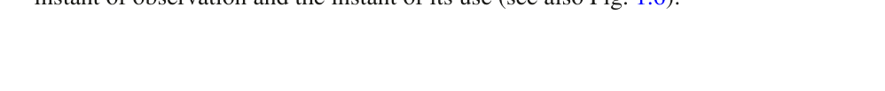
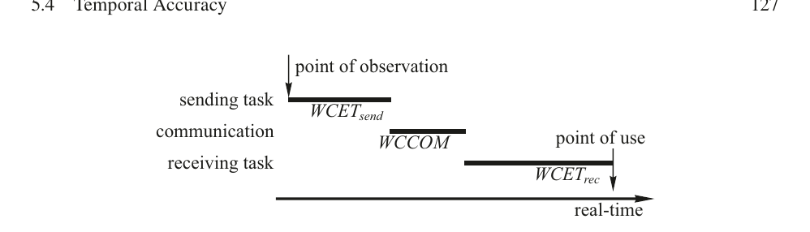
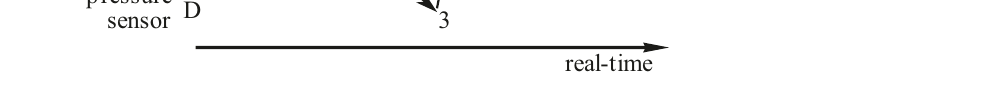

# 第5章 时间关系

Real-Time Systems — Hermann Kopetz, Wilfried Steiner 著 | AI 辅助翻译

---

## 本章概述

实时集群的行为必须基于关于其物理环境状态以及其他协作集群状态的及时信息。实时数据仅在有限的实时区间内具有时间准确性。如果实时数据在此应用特定的时间区间之外被使用，系统将会失效。本章的目标是研究信息物理系统不同部分中状态变量之间的时间关系。

在本章中，我们将引入实时（RT）实体、实时（RT）镜像和实时（RT）对象的概念，并建立 RT 镜像的时间有效性概念。RT 镜像的时间有效性可以通过状态估计来扩展。每个 RT 对象都关联一个实时时钟。该对象的时钟提供周期性的时间控制信号，用于执行对象过程，特别是用于状态估计目的。RT 对象时钟的粒度与被控对象中与该 RT 对象关联的 RT 实体的动态特性对齐。本章还将引入对 RT 实体的参数化观测和相位敏感观测的概念，并讨论观测的持久性概念。此外，还将估算动作延迟的持续时间，即消息发送时刻到该消息变为持久时刻之间的时间间隔。

本章的最后一节专门阐述确定性的概念。确定性是计算的一种理想性质，在需要通过组件复制来实现容错时是必需的。确定性也有助于测试和理解系统的运行。一组复制的 RT 对象，如果它们在近似相同的未来时间点访问相同的状态，则称其为副本确定性的。造成确定性丧失的主要原因包括容错机制旨在掩盖的故障，以及确定系统设计中必须避免的非确定性设计构造。

---

## 5.1 实时实体

实时（RT）实体是一个与给定目的相关的状态变量。它位于计算机系统的环境中或计算机系统本身内部。RT 实体的例子包括管道中液体的流量、操作员选定的控制回路设定点，或者控制阀的预期位置。RT 实体具有在 RT 实体生存期内不会改变的静态属性和随着实时推进而改变的动态属性。静态属性的例子包括名称、类型、值域和最大变化率。在特定时刻设定的值是其中最重要的动态属性。另一个动态属性的例子是选定时刻的变化率。

### 5.1.1 控制域

每个 RT 实体都处于一个有权设定该 RT 实体值的子系统的控制域（SOC）之中[Dav79]。在其 SOC 之外，RT 实体只能被观测，但其语义内容不能被修改。在所选的抽象层次上，对 RT 实体值的表示进行的、不改变其语义内容（见第 2.2.4 节）的语法转换不予考虑。

示例：图 5.1 展示了图 1.8 的另一个视图，表示一个根据操作员选定的设定点来控制管道中液体流量的小型控制系统。在此示例中，涉及三个 RT 实体：管道中的流量处于被控对象的 SOC 中，流量的设定点处于操作员的 SOC 中，控制阀的预期位置处于计算机系统的 SOC 中。

图 5.1 RT 实体、RT 镜像和 RT 对象

---

### 5.1.2 离散与连续实时实体

RT 实体可以具有离散值集（离散 RT 实体）或连续值集（连续 RT 实体）。如果时间线从左向右推进，则离散 RT 实体的值集在一个以左事件（L_event）开始、以右事件（R_event）结束的区间内是恒定的——见图 5.2。

在 R_event 与下一个 L_event 之间的区间内，离散 RT 实体的值集是未定义的。相比之下，连续 RT 实体的值集始终是定义的。

图 5.2 离散 RT 状态实体

示例：考虑一扇车库门。在门关闭和门打开这两个已定义状态之间，存在许多既不能归类为门打开也不能归类为门关闭的中间状态。

## 5.2 观测

关于 RT 实体在特定时刻的状态信息由观测的概念来捕获。观测是一个原子数据结构

Observation= 〈Name,tobs,Value〉

由 RT 实体的名称、观测发生的时刻（tobs）以及 RT 实体的观测值组成。连续 RT 实体可以在任意时刻被观测，而离散 RT 实体的观测仅在一个 L_event 和一个 R_event 之间的区间内给出有意义的值（见图 5.2）。我们假设一个智能传感器节点与物理传感器关联，以捕获物理信号、生成时间戳，并将物理信号转换为有意义的数字技术单位。观测应该通过单条消息从该传感器节点传输到系统的其余部分，因为消息概念提供了观测消息所需的原子性。

---

### 5.2.1 无时间戳观测

在没有全局时间的分布式系统中，时间戳只能在创建该时间戳的节点范围内进行解释。因此，如果没有全局时间可用，发送方进行观测的时间戳在观测消息的接收方处是无意义的。相反，无时间戳观测消息到达接收方节点的时间通常被取为观测时间 tobs。由于观测时刻与消息到达目的地时刻之间存在延迟和抖动，这个时间戳是不精确的。在通信协议执行时间的抖动（相对于执行时间中位数）显著且没有全局时间基准可用的系统中，无法精确确定对 RT 实体的观测时刻。这种时间测量的不精确性会降低观测的质量（见图 1.6）。

### 5.2.2 间接观测

在某些情况下，无法直接观测 RT 实体的值。例如，考虑测量一块钢板内部的温度。该内部温度（RT 实体的值）必须间接测量。

三个温度传感器 T1、T2 和 T3 在一段时间内测量表面温度的变化（图 5.3）。钢板内部的温度 T 的值及其相关时刻必须利用热传导的数学模型从这些表面测量中推断出来。

图 5.3 RT 实体的间接测量

---

### 5.2.3 状态观测

如果观测值包含 RT 实体的状态，则该观测为状态观测。状态观测的时间指的是 RT 实体被采样（观测）的实时时刻。状态观测的每一次读取都是自包含的，因为它携带一个绝对值。许多控制算法需要等间距的状态观测序列，这是通过周期性时间触发读取来提供的服务。

状态观测的语义与第 4.3.4 节介绍的状态消息语义非常匹配。状态观测的新读取会替换先前的读取，因为客户端通常关心的是状态变量的最新值。

### 5.2.4 事件观测

事件是在某一瞬间发生的现象（状态改变）。由于观测本身也是一个事件，因此不可能直接观测被控对象中的事件。只能观测被控对象事件的后果（图 5.4），即随后的状态。如果观测包含旧状态与新状态之间的变化值，则该观测为事件观测。事件观测的时刻表示该事件发生时刻的最佳估计。通常，这是新状态的 L_event 的时间。

图 5.4 事件的观测

---

事件观测存在若干问题：

(i) 我们如何获得事件发生的精确时间？如果事件观测是事件触发的，则事件发生时间被假设为中断信号的上升沿。对该中断信号的任何延迟响应都将导致事件观测时间戳中的误差。如果事件观测是时间触发的，则事件发生时间可以是采样区间内的任意点。

(ii) 由于事件观测的值包含旧状态与新状态之间的差值（而非绝对状态），丢失或重复单次事件观测将导致观测者状态与接收方状态之间失去状态同步。从可靠性的角度来看，事件观测比状态观测更脆弱。

(iii) 事件观测仅在 RT 实体改变其值时发送。检测观测者节点故障（例如崩溃）的延迟时间无法被界定，因为接收方假定如果没有新的事件消息到达，则 RT 实体的值没有改变。

另一方面，在 RT 实体不频繁变化的情况下，事件观测比状态观测更具数据效率。

---

## 5.3 实时镜像与实时对象

### 5.3.1 实时镜像

实时（RT）镜像是 RT 实体的当前画面。如果在给定时刻 RT 镜像在值域和时间域上都是对应 RT 实体的精确表示，则该 RT 镜像在该时刻是有效的。RT 镜像的时间准确性概念将在下一节详细讨论。观测记录的是一个永远有效的事实（关于在特定时刻被观测到的 RT 实体的陈述），而 RT 镜像的有效性是时间依赖的，会随着实时的推进而失效。RT 镜像可以从最新的状态观测或最新的事件观测构建。它也可以通过一种称为状态估计的技术来估算，这将在第 5.4.3 节中讨论。RT 镜像存储在计算机系统内部或环境中（例如在执行器中）。

### 5.3.2 实时对象

实时（RT）对象是分布式计算机系统节点内的一个容器，用于容纳 RT 镜像或 RT 实体[Kop90]。每个 RT 对象都关联一个具有指定粒度的实时时钟。每当该对象时钟滴答时，一个时间控制信号被传递给对象以激活对象过程[Kim94]。

**分布式 RT 对象** 在分布式系统中，RT 对象可以以这样一种方式复制：每个本地站点都有其自己的 RT 对象版本，以便向本地站点提供指定的服务。分布式 RT 对象的服务质量必须符合某些指定的一致性约束。

示例：分布式 RT 对象的一个很好的例子是全局时间；每个节点都有一个本地时钟对象，提供具有指定精度 Π（内部时钟同步的服务质量属性）的同步时间服务。每当一个进程读取其本地时钟时，可以保证在另一个节点上运行的进程在同一时刻读取其本地时钟时，得到的时间值最多相差一个滴答。

示例：分布式 RT 对象的另一个例子是分布式系统中的成员服务。成员服务在约定的时刻（成员资格点）生成关于系统所有节点状态（运行或已故障）的一致信息。成员资格点与一致成员信息在其他节点处被获知的时刻之间的区间长度和抖动是成员服务的服务质量参数。响应式成员服务在节点的相关状态改变（故障或加入）时刻与所有其他节点以一致方式被通知该状态改变的时刻之间具有较小的最大延迟。

---

## 5.4 时间准确性

时间准确性表示 RT 实体与其关联的 RT 镜像之间的时间关系。因为 RT 镜像存储在 RT 对象中，时间准确性也可以视为 RT 实体与 RT 对象之间的关系。

### 5.4.1 定义

RT 镜像的时间准确性是通过参考相关 RT 实体的近期观测历史来定义的。在时间 ti 的近期历史 RHi 是一个有序的时刻集合 {ti, ti−1, ti−2, … ti−k}，其中近期历史的长度 dacc = z(ti) − z(ti−k) 称为时间准确性区间或时间准确性 dacc（z(e) 是由参考时钟 z 生成的事件 e 的时间戳；见第 3.1.2 节）。假设 RT 实体在近期历史的每个时刻都被观测。如果满足以下条件，则 RT 镜像在当下时刻 ti 是时间准确的：

∀tj ∈ RHi : Value(RTimage at ti) = Value(RTentity at tj)

也就是说，时间准确的 RT 镜像的当前值是相应 RT 实体近期历史中观测值集合的一个成员。由于观测消息从观测节点传输到接收节点需要一定的时间，RT 镜像滞后于 RT 实体（见图 5.5）。

图 5.5 RT 实体与 RT 镜像之间的时间滞后

---

示例：假设一个温度测量的时间准确性区间为 1 分钟。如果 RT 镜像中包含的值是在最多一分钟前观测到的，即它仍然在相应 RT 实体的近期历史中，则该 RT 镜像是时间准确的。

**时间准确性区间** 可接受的时间准确性区间 dacc 的大小由被控对象中 RT 实体的动态特性决定。RT 实体的观测与 RT 镜像的使用之间的延迟会导致 RT 镜像的误差 error(t)，该误差可以近似为 RT 实体值 v 的梯度与观测时刻和使用时刻之间区间长度的乘积（另见图 1.6）：

$$ error(t) ≈ \frac{dv(t)}{dt} × (z(t_{use}) − z(t_{obs})) $$

如果使用时间有效的 RT 镜像，最坏情况误差为：

$$ error(t) = \left| \max \frac{dv(t)}{dt} \right| × d_{acc} $$

即最大梯度与时间准确性 dacc 的乘积。在一个均衡的设计中，由此时间延迟引起的最坏情况误差与值域中最坏情况测量误差处于同一数量级，通常为被测变量满量程的千分之几。如果 RT 实体快速改变其值，则必须维持较短的准确性区间。设 tuse 为使用 RT 镜像的计算结果被应用于环境的时刻。为了使结果准确，它必须基于一个时间准确的 RT 镜像，即：

z(tobs) ≥ z(tuse) − dacc

其中 dacc 是 RT 镜像的准确性区间。如果对这一重要条件进行变换，可得：

(z(tuse) − z(tobs)) ≤ dacc.

**相位对齐事务** 考虑一个 RT 事务，它由以下相位同步的任务组成：发送方（观测节点）的计算任务（最坏情况执行时间 WCETsend）、消息传输（最坏情况通信延迟 WCCOM）以及接收方（执行器节点）的计算任务（最坏情况执行时间 WCETrec）（图 5.6）。这样的事务称为相位对齐事务。

图 5.6 同步动作

---

在这种事务中，观测点与使用点之间的最坏情况差值由下式给出：

Δt = tuse − tobs = WCETsend + WCCOM + WCETrec

即发送任务的最坏情况执行时间、最坏情况通信延迟以及使用该数据向被控对象中执行器输出设定点的接收任务的最坏情况执行时间之和。如果应用动态特性所要求的时间准确性 dacc 小于此和，则必须应用一种新技术——状态估计——来解决时间准确性问题。状态估计技术将在第 5.4.3 节中讨论。

---

示例：让我们分析一下汽车发动机控制器中使用的 RT 镜像所需的时间准确性区间（表 5.1），发动机最大转速为 6000 转/分钟（rpm）。这些 RT 镜像的时间准确性区间相差超过六个数量级。很明显，第一个数据元素——即活塞在气缸内的位置——的 dacc 需要使用状态估计。

表 5.1 发动机控制中的时间准确性区间

| 计算机内的 RT 镜像 | 最大变化 | 准确性 d | acc |
| --- | --- | --- | --- |
| 活塞在气缸内的位置 | 6000 rpm 0.1° | 3 μs |  |
| 油门踏板位置 | 100%/秒 | 10 ms |  |
| 发动机负载 | 50%/秒 | 20 ms |  |
| 机油和冷却液温度 | 10%/分钟 | 6 s |  |

### 5.4.2 实时镜像的分类

**参数化 RT 镜像** 假设一个 RT 镜像由来自相关 RT 实体的状态观测消息以更新周期 dupdate 进行周期性更新（图 5.7），并假设事务在发送方是相位对齐的。如果时间准确性区间 dacc 满足条件：

dacc > (dupdate + WCETsend + WCCOM + WCETrec),

则我们称该 RT 镜像是参数化的或相位不敏感的。

图 5.7 参数化实时镜像

---

参数化 RT 镜像可以在接收方随时访问，而无需考虑传入观测消息与数据使用点之间的相位关系。

示例：处理油门踏板位置的 RT 事务（发送方的观测和预处理、通信到接收方、接收方的处理、以及向执行器输出）所需的时间量为：

WCETsend + WCCOM + WCETrec = 4 ms.

因为该观测的准确性区间为 10 ms（表 5.1），以小于 6 ms 的周期发送的消息将使该 RT 镜像成为参数化的。

如果组件被复制，则必须注意所有副本访问参数化 RT 镜像的同一版本；否则副本确定性（见第 5.6 节）将会丧失。

**相位敏感 RT 镜像** 假设一个 RT 事务在发送方是相位对齐的。如果满足以下条件，则接收方的 RT 镜像称为相位敏感的：

dacc ≤ (dupdate + WCETsend + WCCOM + WCETrec) 且

dacc > (WCETsend + WCCOMM + WCETrec)

在这种情况下，必须考虑 RT 镜像被更新的时刻与信息被使用的时刻之间的相位关系。在上述例子中，超过 6 ms 的更新周期，例如 8 ms，将使该 RT 镜像成为相位敏感的。

每一个相位敏感的 RT 镜像都对其使用者实时任务的调度施加一个额外的约束。因此，调度访问相位敏感 RT 镜像的任务比调度使用参数化 RT 镜像的任务要复杂得多。一个好的实践是尽量减少相位敏感的 RT 镜像数量。这可以在 dupdate 所施加的限制范围内，通过增加 RT 镜像的更新频率或部署状态估计模型来扩展 RT 镜像的时间准确性来实现。增加更新频率会给通信系统带来更大的负载，而实现状态估计模型则会给处理器带来更大的负载。设计者需要在通信资源利用和处理资源利用之间寻找权衡。

---

### 5.4.3 状态估计

状态估计涉及在 RT 对象内部构建 RT 实体的模型，以计算 RT 实体在选定未来时刻的可能状态，并相应地更新对应的 RT 镜像。状态估计模型在存储 RT 镜像的 RT 对象内周期性地执行。模型执行的控制信号来源于与该 RT 对象关联的实时时钟的滴答（见第 5.3.2 节）。RT 镜像必须与 RT 实体紧密一致的最重要未来时刻是 tuse，即 RT 镜像的值被用于向环境交付输出的时刻。状态估计是一种强大的技术，用于扩展 RT 镜像的时间准确性区间，即让 RT 镜像与 RT 实体更紧密地一致。

示例：假设发动机中的曲轴以 3000 转/分钟的速度旋转，即每毫秒 18 度。如果曲轴位置的观测时刻 tobs 与相应 RT 镜像的使用时刻 tuse 之间的时间间隔为 500 微秒，我们可以将 RT 镜像更新 9 度，以得到 tuse 时刻曲轴位置的估计。如果我们同时考虑发动机在区间 [tobs, tuse] 内的角加速度或角减速度，则可以提高估计精度。

只有 RT 实体的行为受到已知且有规律的过程（即明确规定的物理或化学过程）支配时，才能构建适当的 RT 实体状态估计模型。大多数技术过程，如上述发动机控制，都属于这一类别。然而，如果 RT 实体的行为由随机事件决定，则状态估计技术不适用。

**状态估计模型的输入** 状态估计模型最重要的动态输入是时间区间 [tobs, tuse] 的精确长度。由于 tobs 和 tuse 通常记录在分布式系统的不同节点上，因此具有最小抖动的通信协议或具有良好精度的全局时间基准是状态估计的先决条件。这一先决条件是现场总线设计中的重要要求。

如果 RT 实体的行为可以用连续可微函数 v(t) 描述，则一阶导数 dv/dt 有时足以在观测时刻的邻域内得到 RT 实体在时刻 tuse 的合理状态估计：

$$ v(t_{use}) ≈ v(t_{obs}) + (t_{use} − t_{obs}) × \frac{dv}{dt} $$

如果这种简单近似的精度不够，可以在 tobs 附近进行更精细的级数展开。在其他情况下，可能需要被控对象过程的更详细数学模型。执行这种数学模型可能需要相当大的处理资源。

---

### 5.4.4 可组合性考量

假设一个时间触发的分布式系统，其中一个 RT 实体由传感器节点观测，然后将观测消息发送到一个或多个与环境交互的节点。因此，相关时间区间的长度 [tobs, tuse] 是发送方延迟（由长度 [tobs, tarr] 给出）与接收方延迟（由长度 [tarr, tuse] 给出）之和（通信延迟包含在发送方延迟中）。在时间触发架构中，所有这些区间都是静态的且预先已知（图 5.8）。

图 5.8 发送方和接收方的延迟

如果状态估计在接收方的 RT 对象中执行，那么发送方延迟的任何修改都将导致时间区间的变化，这必须由接收方的状态估计来补偿。如果发送方节点内部发生延迟变化，则接收方软件必须相应改变。为了减少发送方与接收方之间的这种耦合，状态估计可以分两步进行：发送方对区间 [tobs, tarr] 执行状态估计，接收方对区间 [tarr, tuse] 执行状态估计。这让接收方产生 RT 实体在观测消息到达接收方的时刻被观测的错觉。到达点即成为观测的隐式时间戳，接收方不受发送方调度变化的影响。这种方法有助于统一处理通过现场总线收集的传感器数据以及由接收节点直接收集的传感器数据。

---

## 5.5 持久性与幂等性

### 5.5.1 持久性

持久性是到达节点的某条特定消息与该特定消息之前被发送到该节点的所有消息集合之间的关系。当节点知道在该消息发送时间之前发送给它的所有消息都已到达（或将永远不会到达）时，该特定消息在该节点处成为持久消息[Ver94]。

图 5.9 被控对象中的隐藏通道

---

示例：考虑图 5.9 的例子，其中容器中的压力由一个分布式系统监控。报警监控节点（节点 A）接收来自压力传感器节点（节点 D）的周期性消息 MDA。如果压力在没有明显原因的情况下突然变化，报警监控节点 A 应当发出报警。假设操作员节点 B 向节点 C 发送消息 MBC 以打开控制阀释放压力。同时，操作员节点 B 向节点 A 发送消息 MBA，通知节点 A 阀门的开启，使节点 A 不会因预期的压力下降而发出报警。

假设通信系统具有最小协议执行时间 dmin 和最大协议执行时间 dmax，即抖动 djit = dmax − dmin。则图 5.10 所示的情况可能发生。在该图中，来自压力传感器节点的消息 MDA 在来自操作员（通知报警监控节点 A 预期的压力下降）的消息 MBA 到达之前先到达报警监控节点 A。被控对象中从阀门打开到压力传感器变化之间的隐藏通道的传输延迟短于最大协议执行时间。因此，为了避免发出任何虚警，报警监控节点应该延迟任何动作，直到报警消息 MDA 变为持久消息。

图 5.10 消息的持久性

---

**动作延迟** 给定消息的传输开始时刻到该消息在接收方变为持久消息的时刻之间的时间区间称为动作延迟。接收方必须延迟对该消息的任何操作，直到动作延迟过去之后，以避免不正确的行为。

**不可撤销动作** 不可撤销动作是一种不能撤销的操作。不可撤销动作会在环境中造成持久的影响。不可撤销动作的一个例子是枪械击发机构的激活。尤为重要的是，不可撤销动作只有在动作延迟过去之后才能触发。

示例：一架战斗机的飞行员被指示在发出临界警报后立即弹射（不可撤销动作）。考虑警报是由尚未变为持久消息的消息（例如图 5.10 中的事件 4）发出的情况。在此示例中，未在设计中考虑到的隐藏通道是导致飞机损失的原因。

### 5.5.2 动作延迟的持续时间

动作延迟的持续时间取决于通信系统的抖动以及接收方的时间感知能力。让我们假设一个能够看到所有显著事件的全知外部观察者的位置。

**有全局时间的系统** 在具有全局时间的系统中，由发送方时钟测量的消息发送时间 tsend 可以作为消息的一部分，并且可以被接收方解释。如果接收方知道通信系统的最大延迟为 dmax，则接收方可以推断消息将在 tpermanent = tsend + dmax + 2g 时变为持久消息，其中 g 是全局时间基准的粒度（见第 3.2.4 节了解 2g 的来源）。

---

**没有全局时间的系统** 在没有全局时间的系统中，接收方不知道消息何时被发送。为安全起见，接收方必须在消息到达后等待 dmax − dmin 个时间单位，即使该消息已在传输中经过了 dmax 个时间单位。在最坏情况下，从外部观察者的角度看，接收方因此必须等待的时间量为：

tpermanent = tsend + 2dmax − dmin + gl

消息才能被安全使用（其中 gl 是本地时间基准的粒度）。由于在事件触发通信系统中，(dmax − dmin + gl) 通常远大于 2g（其中 g 是全局时间的粒度），没有全局时间基准的系统比有全局时间基准的系统显著更慢。（在这种情况下，实现时间触发通信系统是不可能的，因为我们是在假设没有全局时间基准可用的前提下操作的。）

### 5.5.3 准确性区间与动作延迟

只有当传输镜像的消息已变为持久消息且镜像在时间上准确时，RT 镜像才能被使用。在没有状态估计的系统中，这两个条件只能在时间窗口 (tpermanent, tobs + dacc) 内同时满足。时间准确性 dacc 取决于控制应用的动态特性，而 (tpermanent − tobs) 是一个实现特定的持续时间。如果某个实现不能满足应用的时间要求，那么状态估计可能是设计正确实时系统的唯一剩余替代方案。

### 5.5.4 幂等性

幂等性是指到达同一接收方的一组复制消息的成员之间的关系。如果接收多于一份消息副本的效果与仅接收单份副本的效果相同，则这组复制消息是幂等的。如果消息是幂等的，通过复制消息来实现容错将得到简化。无论接收方收到一份或多份复制消息，结果始终相同。

示例：假设我们有一个没有同步时钟的分布式系统。在这样的系统中，节点之间只能交换无时间戳观测，观测消息的到达时间被取作观测时间。假设一个节点观测一个 RT 实体，例如一个阀门，并将此观测报告给系统中的其他节点。接收方使用此信息在其 RT 对象中构建 RT 实体的本地 RT 镜像的更新版本。状态消息可能包含阀门的绝对值位置为 45°，并将替换镜像的旧版本。事件消息可能包含相对值"阀门已移动 5°"。此事件消息的内容被加到 RT 对象中状态变量的先前内容上，以得到 RT 镜像的更新版本。状态消息是幂等的，而事件消息不是。事件消息的丢失或重复会导致 RT 镜像的永久性错误。

---

## 5.6 确定性

确定性是计算的一种性质，使人能够在给定初始状态和所有带时间戳的输入的情况下预测计算的未来结果。一个给定的计算要么是确定性的，要么不是确定性的。

示例：考虑汽车中容错线控制动系统的情况。在对传感器输入（例如制动踏板位置、车速等）达成一致后，三个独立但同步的通道处理相同的输入。三个输出被呈现给四个智能表决执行器（图 9.8），每个安装在汽车四个车轮之一的制动缸上。在第一个输出消息到达表决执行器后，一个接受窗口被打开。接受窗口的持续时间由三个通道的执行速度差异和通信系统的抖动决定，前提是它们正确运行。每个正确的确定通道将在接受窗口结束之前交付相同的结果。如果一个通道故障，三个到达的结果消息之一将包含与其他两个不同的值（值故障），或者只有两个（相同的）结果消息将在接受窗口期间到达（时序故障）。通过在接受窗口结束时刻选择多数结果，表决器将掩盖三个通道中任意一个的故障。接受窗口的结束点是重要的时刻，此时可以执行表决动作并将结果传输到环境。如果计算和通信系统具有较大的抖动，那么接受窗口的结束点将位于更远的未来，计算机系统的响应性将降低。

### 5.6.1 确定性的定义

在第 2.5 节"如何实现简单性？"主题下，已经引入了因果原理。因果性是指结果与原因之间的单向关系[Bun08]。如果这种关系是逻辑和时序蕴含关系，我们称之为确定性，其定义如下：一个物理系统的行为是确定性的，如果在时刻 t 给定初始状态和一组未来的带时间戳的输入，则未来的状态以及未来输出的值和时刻都是蕴含的。词语"时间"和"时刻"指的是稠密（物理）时间的推进。物理系统的许多自然规律符合这一定义。

---

在物理系统的数字计算机模型中，没有稠密时间。在一个确定性的分布式计算机系统中，我们必须假设所有事件——例如在时刻 t 的初始状态观测和带时间戳的输入——都是稀疏全局时间基准上的稀疏事件（见第 3.3 节），以便分布式系统不同节点中发生的事件的时间属性和关系（如同步性）可以在时钟同步有限精度和离散时间基准的限制下被精确规定。这种由协商协议（见第 3.3.1 节）执行、将物理世界中的稠密事件转换为信息世界（分布式计算机系统）中的稀疏事件的过程，降低了计算机模型的忠实度，因为间距小于时间基准粒度的事件无法被一致地排序。

在实时语境中，确定性的概念要求系统的行为在值域和时间域上都是可预测的。忽略时间维度会导致一种简化的确定性概念——我们称之为逻辑（L）确定性。L-确定性可定义如下：一个系统的行为是 L-确定性的，如果给定初始状态和一组有序的输入，则随后的状态和随后输出的值都是蕴含的。

在日常语言中，"确定性"一词的使用将系统的未来行为作为其当下状态的结果。由于在无时间系统中，"未来"的概念不存在，L-确定性无法捕捉"确定性"一词的日常含义。

示例：在上述制动系统的例子中，仅仅要求制动动作最终会发生还不足以确立正确性。维持制动动作开始（接受窗口的结束点）的实时上界，例如制动动作将在制动踏板被踩下后 2 毫秒开始，是正确行为的必要组成部分。

---

期望组件具有确定性行为的原因如下：

- 初始状态、输入、输出和时间之间的蕴含关系简化了对组件实时行为的理解（另见第 2.1.1 节）。

- 两个从相同初始状态开始并接收相同带时间戳输入的复制组件将在大致相同的时间产生相同的结果。这一性质很重要，如果需要通过两个正确通道的正确结果来掩盖（表决排除）一个故障通道的结果（见第 6.4.2 节），正如上述汽车制动系统例子所示。

- 组件的可测试性得到简化，因为每个测试用例都可以重现，消除了偶发的 Heisenbugs（见第 6.1.2 节）。

确定性是一种期望的行为属性。计算的实现将以一定的估计概率达到这一期望属性。

一个实现可能由于以下原因而未能达到确定性的期望属性：

(i) 计算的初始状态未被精确定义。

(ii) 硬件因随机物理故障而失效。

(iii) 时间概念不清晰。

(iv) 系统（软件）包含设计错误或非确定性设计构造（NDDC），导致在值域或时域中产生不可预测的行为。

从容错的角度看，复制通道的每一次确定性丧失等同于该通道的一次故障，它消除了容错系统进一步的故障掩盖能力。

为了在容错分布式实时计算机系统的实现中实现副本确定性行为，我们必须确保：

- 所有涉及计算的初始状态被一致地定义。如果不建立某种稀疏全局时间基准来对事件进行一致的时间戳标记，以便能够确定某个事件是否包含在初始状态中，就不可能构建副本确定性的分布式实时系统。没有稀疏全局时间基准和稀疏事件，同步性在分布式系统中无法被一致地解决，可能导致报告这些同步事件的复制消息的时间顺序不一致。不一致的排序会导致副本确定性的丧失。

---

- 将事件分配到稀疏全局时间基准上可以在系统层面通过稀疏事件的生成来完成，或在应用层面通过执行协商协议将稠密事件一致地分配到稀疏区间来完成。

- 组件之间的消息传输系统是可预测的，即消息交付的时刻可以预知，且在所有通道上接收消息的时间顺序与发送消息的时间顺序相同。

- 计算机系统和观察者（用户）对实时的精确概念达成一致。

- 所有涉及的计算是确定的，即实现中不存在产生任意结果或包含 NDDC 的程序构造，且计算的最终结果将在预期的接受窗口内可用。

如果上述任何一个条件不满足，则容错系统的故障掩盖能力可能被削弱或丧失。

### 5.6.2 一致的初始状态

为掩盖故障而引入的正确复制通道只有在从相同的初始状态开始并在相同的时间接收相同的输入时，才会产生相同的结果。

根据第 4.2.1 节，只有当过去事件与未来事件之间存在一致的分离时，组件的状态才能被定义。第 3.3 节引入的稀疏时间模型提供了这种过去事件与未来事件的一致分离，使得可以定义分布式系统初始状态被一致定义的时刻。如果没有稀疏全局时间，在分布式系统中建立复制组件的一致初始状态是困难的。

传感器是最终会失效的物理设备。为了掩盖传感器的故障，在容错系统中必须提供多个传感器，直接或间接地测量相同的物理量。复制传感器对同一物理量的冗余观测会偏离的原因有两个：

(i) 不可能制造完美的传感器。每个真实传感器都有有限的测量误差，限制了观测值的精度。

(ii) 物理世界中的量通常是模拟值，但它们在信息空间中的表示是离散值，导致离散化误差。

因此，必须在物理世界与信息空间的边界上执行协商协议，以便所有复制通道接收一致的（完全相同的）协商输入数据（见第 9.6 节）。这些协商协议将在同一稀疏时间区间内向所有复制通道呈现相同的值集合。

---

### 5.6.3 非确定性设计构造（NDDC）

一个从良好定义的初始状态开始的分布式计算可能由于以下原因而未能达到预期的目标状态：

(i) 硬件故障或设计错误导致计算崩溃、交付不正确的结果，或将计算延迟到约定的时间接受窗口结束之后。容错设计的目标是掩盖这些类型的故障。

(ii) 通信系统或时钟系统失效。

(iii) 非确定性设计构造（NDDC）破坏了确定性。由 NDDC 引起的确定性丧失会消除容错系统的故障掩盖能力。

NDDC 的不良影响可以表现在值域或时域中。容错系统设计的一个基本假设——通过比较副本确定通道的结果来掩盖故障——是不同通道中故障的统计独立性。如果 NDDC 是确定性丧失的原因，则此假设被违反，因为相同的 NDDC 可能出现在所有复制通道中。这将导致复制通道的危险相关故障。

以下列表列出了一些可能导致值域确定性丧失（即 L-确定性丧失）的构造：

(i) **随机数生成器：**如果计算的结果依赖于每个通道不同的随机数，则确定性丧失。依赖随机数生成器解决媒体访问冲突的通信协议，如基于总线的 CSMA/CD Ethernet 协议，表现出非确定性。

(ii) **非确定性语言特性：**使用具有非确定性语言构造的编程语言（例如 ADA 程序中的 SELECT 语句）可能导致副本确定性的丧失。由于编程语言未定义在决策点应选择哪个选项，由实现决定所采取的行动过程。两个副本可能做出不同的决定。

(iii) **重大决策点：**重大决策点是算法中的一个决策点，在一组显著不同的行动方案之间提供选择。如果复制组件在重大决策点选择了不同的计算轨迹，则副本的状态将开始偏离。

示例：考虑超时检查的结果决定一个进程是继续还是回退的情况。这是一个重大决策点的例子。

---

(iv) **抢占式调度：**如果使用动态抢占式调度，则计算中识别外部事件（中断）的点可能在不同的副本中有所不同。因此，中断进程在中断点看到两个副本的不同状态。它们可能在下一个重大决策点得出不同的结果。

(v) **不一致的消息顺序：**如果复制通信通道中的消息顺序不完全相同，则复制通道可能产生不同的结果。

上述构造中的大多数也可能导致时域确定性的丧失。此外，还必须考虑以下可能导致确定性时间维度丧失的机制和不足，即使系统是 L-确定性的：

(i) **任务抢占和阻塞：**任务抢占和阻塞会延长任务的执行时间，并可能将结果延迟到接受窗口关闭之后。

(ii) **重试机制：**硬件或软件中的任何重试机制都会导致执行时间的延长，并可能导致值正确结果的不可接受的延迟。

(iii) **竞态条件：**信号量等待操作可能导致非确定性，因为关于哪个进程将赢得信号量竞态的结果是不确定的。同样的论点适用于通过依赖非确定性时序决策来解决访问冲突的通信协议，如 CAN 或在较小程度上的 ARINC 629。

在一些存在 NDDC 的设计中，有人尝试通过显式协调副本之间可能导致确定性丧失的决策来重建副本确定性，例如区分领导者进程和跟随者进程[Pow91]。如果可能的话，应避免副本间协调，因为它损害了副本的独立性，并需要额外的时间和额外的通信带宽。

### 5.6.4 确定性的恢复

如果接受窗口被扩展，使得错过截止时间（即结果在接受窗口结束时不可用）的概率降低到可接受的低值，则可以避免 L-确定性系统中确定性的丧失。这种技术常用于在宏观层面重建确定性，即使微观层面的精确时间行为无法预测。这种技术的主要缺点是交付结果所需的延迟增加，导致控制回路的死区时间和反应系统的反应时间增加。

示例：在牛顿物理层面，许多自然规律被认为是确定性的，尽管底层的量子力学过程在微观层面是非确定性的。宏观层面确定性行为的抽象是可能的，因为与微观层面过程的持续时间相比，宏观层面涉及的大量粒子和长时间跨度使得在宏观层面观察到非确定性行为的概率极低。

---

示例：在云的服务器集群中，任何时刻可能有超过 100,000 个 L-确定性虚拟机（VM）处于活动状态，一个故障的 VM 可以被重新配置和重新启动，使得预期结果仍然在指定的接受窗口内可用。这样的系统在外部层面（见第 2.3.1 节中的四宇宙模型）将具有确定性行为，尽管在较低的信息层面的实现具有非确定性行为。

在外部层面（见第 2.3.1 节中的四宇宙模型）恢复确定性——这些系统在实现层面呈非确定性——是开发系统之系统在用户层面可理解行为模型时的一项重要策略。

---

### Points to Remember

• 对 RT 实体的观测是一个原子三元组 <Name, tobs, Value>，由 RT 实体的名称、观测发生的实时时刻（tobs）以及 RT 实体的观测值组成。连续 RT 实体始终具有定义的值集，可以在任意时刻观测；而离散 RT 实体只能在 L_event 与 R_event 之间观测。

• 如果观测值包含 RT 实体的绝对状态，则该观测为状态观测。状态观测的时间指的是 RT 实体被采样的实时时刻。

• 如果观测包含旧状态与新状态之间的变化值信息，则该观测为事件观测。事件观测的时间表示该事件发生时刻的最佳估计。

• 实时（RT）镜像是 RT 实体的当前画面。如果在给定时刻 RT 镜像在值域和时间域上都是相应 RT 实体的精确表示，则该 RT 镜像是有效的。

• 实时（RT）对象是分布式计算机系统节点内用于容纳 RT 镜像或 RT 实体的容器。每个 RT 对象关联一个具有指定粒度的实时时钟。

• 时间准确的 RT 镜像的当前值是 RT 实体在其近期历史中值集合的一个成员。

• RT 实体的观测与 RT 镜像的使用之间的延迟在最坏情况下会导致 RT 镜像的最大误差 error(t)，该误差可近似为 RT 实体值 v 的最大梯度与准确性区间长度的乘积。

• 每个相位敏感的 RT 镜像都对其使用者实时任务施加一个额外的调度约束。

• 状态估计涉及在 RT 对象内部构建 RT 实体模型，以计算 RT 实体在选定未来时刻的可能状态，并相应更新对应的 RT 镜像。

• 如果 RT 实体的行为可以用连续可微变量 v(t) 描述，则一阶导数 dv/dt 有时足以在观测点邻域获得 RT 实体在 tuse 时刻的合理状态估计。

• 为减少发送方与接收方之间的耦合，状态估计可分两步执行：发送方对区间 [tobs, tarr] 执行状态估计，接收方对区间 [tarr, tuse] 执行状态估计。

• 当节点知道在该消息发送时间之前发送给它的所有消息都已到达（或将永远不会到达）时，该消息在给定节点处变为持久消息。

• 消息传输开始时刻与该消息在接收方变为持久消息的时刻之间的时间区间称为动作延迟。为避免不正确的行为，接收方必须将对该消息的任何操作延迟到动作延迟过去之后。

• RT 镜像只有在传输该镜像的消息变为持久消息且该镜像是时间准确的之后才能被使用。在没有状态估计的系统中，这两个条件只能在时间窗口 [tpermanent, tobs + dacc] 内同时满足。

• 无论接收方收到一组复制幂等消息中的一份还是多份，结果始终相同。

• 确定性是计算的一种期望属性，使人能够基于给定的初始状态和带时间戳的输入预测未来时刻的输出。

• 副本非确定性的基本原因是不一致的输入、计算进度与副本中物理时间的进度之间的差异（由振荡器漂移差异引起）以及 NDDC。

• 如果可能，应避免副本间协调，因为它损害副本的独立性，并需要额外的时间和通信带宽。

---

## 参考文献

时间准确性的概念首次出现在[Kop90]提出的实时对象模型中。Kim 扩展了该模型，并利用该模型分析了实时应用的时间属性[Kim94]。副本确定性问题在[Pol95]中得到了广泛研究。关于因果性和确定性的有趣哲学论述可参见[Bun08]和[Hoe10]。

### 复习题与习题

5.1. 举例说明控制汽车发动机所需的 RT 实体。确定这些 RT 实体的静态和动态属性，并讨论与这些 RT 实体相关的 RT 镜像的时间准确性。

5.2. 状态观测和事件观测之间的区别是什么？讨论它们各自的优缺点。

5.3. 事件观测存在哪些问题？

5.4. 给出时间准确性概念的非正式定义和精确定义。什么是近期历史？

5.5. 参数化 RT 镜像与相位敏感 RT 镜像之间的区别是什么？如何创建参数化 RT 镜像？

5.6. 状态估计模型的输入是什么？讨论有全局时间基准和无全局时间基准系统中的状态估计。

5.7. 讨论状态估计与可组合性之间的相互关系。

5.8. 什么是隐藏通道？定义持久性的概念。

5.9. 计算具有以下参数的分布式系统中的动作延迟：dmax = 20 ms, dmin = 1 ms：

(a) 没有全局时间可用，本地时间粒度为 10 μs

(b) 全局时间粒度为 20 μs

5.10. 动作延迟与时间准确性之间的关系是什么？

5.11. 定义确定性的概念！什么是 L-确定性？

5.12. 举一个例子说明本地超时可能导致副本非确定性。

5.13. 哪些机制可能导致副本非确定性？

5.14. 如何构建一个副本确定性系统？

5.15. 为什么应避免显式的副本间协调？

---